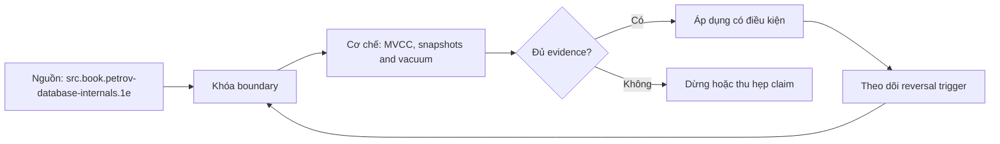

# MVCC, snapshots and vacuum

> [!abstract] Câu hỏi trung tâm
> Row version được nhìn thấy theo snapshot nào, vì sao dead tuple tồn tại, và long transaction gây bloat/wraparound risk ra sao?

## 1. MVCC là visibility protocol

MVCC giữ nhiều row versions và chọn version visible theo transaction/snapshot metadata. Nó giảm read-write blocking nhưng không xoá write-write coordination, schema locks hay predicate conflicts. PostgreSQL tuple header chứa transaction identity/status-related metadata; visibility còn phụ thuộc snapshot và commit state. Nói 'reader không block writer' chỉ đúng với ordinary data reads trong ranh giới documented, không phải mọi lock loại nào.

## 2. Snapshot không phải một khái niệm duy nhất

Ở PostgreSQL Read Committed, mỗi statement lấy snapshot mới; hai SELECT trong cùng transaction có thể thấy commits khác nhau. Repeatable Read và Serializable dùng transaction-level view phù hợp với mode. Snapshot xác định tập transaction được coi là visible/in-progress, không phải copy vật lý toàn database. Một cursor, function hoặc command có thêm chi tiết cần kiểm manual.

## 3. Update tạo version mới

UPDATE thường tạo tuple version mới và version cũ trở thành dead khi không snapshot nào còn cần. DELETE cũng để lại dead tuple cho tới vacuum. HOT có thể tránh index entries mới khi điều kiện thoả, nhưng không biến cleanup thành miễn phí. Dead tuples làm tăng heap/index work, buffer pressure và storage; bloat là phần không tái sử dụng hiệu quả, không đồng nhất một counter duy nhất.

## 4. Vacuum làm gì và không làm gì

Routine VACUUM nhận diện tuples đã chết theo horizon, đánh dấu space tái sử dụng, dọn index theo phase, cập nhật visibility map và có vai trò chống transaction-ID wraparound. Nó thường không trả file về OS. VACUUM FULL rewrite/lock mạnh, không phải nút dọn định kỳ. ANALYZE và VACUUM liên quan vận hành nhưng mục tiêu khác.

## 5. Horizon và long transaction

Snapshot/transaction cũ có thể giữ global xmin/horizon thấp khiến versions mới chết vẫn chưa removable. Idle in transaction đặc biệt nguy hiểm vì không làm việc nhưng giữ snapshot/locks. Replication slot, prepared transaction và standby feedback cũng có thể giữ WAL hoặc cleanup horizon. Vì vậy chỉ nhìn table bytes không đủ xác định nguyên nhân.

## 6. Đo và xử lý

Theo dõi transaction age, idle-in-transaction duration, dead tuples, autovacuum last run/progress, table/index size, transaction ID age và replication-slot/WAL retention. Điều tra workload/churn và threshold trước khi tune. Kết thúc blocker phải theo runbook và owner; sau cleanup, space có thể chỉ tái sử dụng nội bộ nên 'file không nhỏ' không chứng minh vacuum thất bại.

## 7. Ma trận kiểm chứng từng mệnh đề

Mỗi mệnh đề dưới đây phải được kiểm bằng một schedule hoặc phép đo có điều kiện đầu vào rõ ràng. Không dùng một ảnh màn hình cuối làm bằng chứng thay cho lệnh, timestamp, cấu hình và raw output.

### 7.1. Read Committed lấy snapshot theo statement và cho kết quả khác nhau giữa hai SELECT

**Giả thuyết.** Read Committed lấy snapshot theo statement và cho kết quả khác nhau giữa hai SELECT. **Cách kiểm.** Cố định phiên bản database, cấu hình, dữ liệu seed và thứ tự thao tác; ghi operation ID, transaction/session ID, thời điểm bắt đầu-kết thúc và trạng thái commit/abort. **Đối chứng.** Chạy một biến thể bỏ đúng yếu tố đang xét, không đổi đồng thời nhiều tham số. **Bằng chứng đạt cho `wiki.database.mvcc-snapshots-vacuum`.** Lưu command/script, raw result và counter trước-sau; giải thích cơ chế tạo ra quan sát. Một lần không tái hiện không đủ bác bỏ hiện tượng concurrency; cần barrier xác định và lặp có giới hạn.

### 7.2. Repeatable Read giữ view ổn định nhưng transaction update có thể bị abort

**Giả thuyết.** Repeatable Read giữ view ổn định nhưng transaction update có thể bị abort. **Cách kiểm.** Cố định phiên bản database, cấu hình, dữ liệu seed và thứ tự thao tác; ghi operation ID, transaction/session ID, thời điểm bắt đầu-kết thúc và trạng thái commit/abort. **Đối chứng.** Chạy một biến thể bỏ đúng yếu tố đang xét, không đổi đồng thời nhiều tham số. **Bằng chứng đạt cho `wiki.database.mvcc-snapshots-vacuum`.** Lưu command/script, raw result và counter trước-sau; giải thích cơ chế tạo ra quan sát. Một lần không tái hiện không đủ bác bỏ hiện tượng concurrency; cần barrier xác định và lặp có giới hạn.

### 7.3. long idle transaction giữ horizon dù CPU gần bằng không

**Giả thuyết.** long idle transaction giữ horizon dù CPU gần bằng không. **Cách kiểm.** Cố định phiên bản database, cấu hình, dữ liệu seed và thứ tự thao tác; ghi operation ID, transaction/session ID, thời điểm bắt đầu-kết thúc và trạng thái commit/abort. **Đối chứng.** Chạy một biến thể bỏ đúng yếu tố đang xét, không đổi đồng thời nhiều tham số. **Bằng chứng đạt cho `wiki.database.mvcc-snapshots-vacuum`.** Lưu command/script, raw result và counter trước-sau; giải thích cơ chế tạo ra quan sát. Một lần không tái hiện không đủ bác bỏ hiện tượng concurrency; cần barrier xác định và lặp có giới hạn.

### 7.4. UPDATE cùng row nhiều lần sinh chain version và HOT phụ thuộc index columns/page space

**Giả thuyết.** UPDATE cùng row nhiều lần sinh chain version và HOT phụ thuộc index columns/page space. **Cách kiểm.** Cố định phiên bản database, cấu hình, dữ liệu seed và thứ tự thao tác; ghi operation ID, transaction/session ID, thời điểm bắt đầu-kết thúc và trạng thái commit/abort. **Đối chứng.** Chạy một biến thể bỏ đúng yếu tố đang xét, không đổi đồng thời nhiều tham số. **Bằng chứng đạt cho `wiki.database.mvcc-snapshots-vacuum`.** Lưu command/script, raw result và counter trước-sau; giải thích cơ chế tạo ra quan sát. Một lần không tái hiện không đủ bác bỏ hiện tượng concurrency; cần barrier xác định và lặp có giới hạn.

### 7.5. DELETE không trả ngay heap space về filesystem

**Giả thuyết.** DELETE không trả ngay heap space về filesystem. **Cách kiểm.** Cố định phiên bản database, cấu hình, dữ liệu seed và thứ tự thao tác; ghi operation ID, transaction/session ID, thời điểm bắt đầu-kết thúc và trạng thái commit/abort. **Đối chứng.** Chạy một biến thể bỏ đúng yếu tố đang xét, không đổi đồng thời nhiều tham số. **Bằng chứng đạt cho `wiki.database.mvcc-snapshots-vacuum`.** Lưu command/script, raw result và counter trước-sau; giải thích cơ chế tạo ra quan sát. Một lần không tái hiện không đủ bác bỏ hiện tượng concurrency; cần barrier xác định và lặp có giới hạn.

### 7.6. routine VACUUM cho phép reuse nhưng thường không shrink file

**Giả thuyết.** routine VACUUM cho phép reuse nhưng thường không shrink file. **Cách kiểm.** Cố định phiên bản database, cấu hình, dữ liệu seed và thứ tự thao tác; ghi operation ID, transaction/session ID, thời điểm bắt đầu-kết thúc và trạng thái commit/abort. **Đối chứng.** Chạy một biến thể bỏ đúng yếu tố đang xét, không đổi đồng thời nhiều tham số. **Bằng chứng đạt cho `wiki.database.mvcc-snapshots-vacuum`.** Lưu command/script, raw result và counter trước-sau; giải thích cơ chế tạo ra quan sát. Một lần không tái hiện không đủ bác bỏ hiện tượng concurrency; cần barrier xác định và lặp có giới hạn.

### 7.7. VACUUM FULL rewrite và cần lock mạnh nên không chạy phản xạ trên production

**Giả thuyết.** VACUUM FULL rewrite và cần lock mạnh nên không chạy phản xạ trên production. **Cách kiểm.** Cố định phiên bản database, cấu hình, dữ liệu seed và thứ tự thao tác; ghi operation ID, transaction/session ID, thời điểm bắt đầu-kết thúc và trạng thái commit/abort. **Đối chứng.** Chạy một biến thể bỏ đúng yếu tố đang xét, không đổi đồng thời nhiều tham số. **Bằng chứng đạt cho `wiki.database.mvcc-snapshots-vacuum`.** Lưu command/script, raw result và counter trước-sau; giải thích cơ chế tạo ra quan sát. Một lần không tái hiện không đủ bác bỏ hiện tượng concurrency; cần barrier xác định và lặp có giới hạn.

### 7.8. autovacuum threshold kết hợp base threshold và scale factor theo version/config

**Giả thuyết.** autovacuum threshold kết hợp base threshold và scale factor theo version/config. **Cách kiểm.** Cố định phiên bản database, cấu hình, dữ liệu seed và thứ tự thao tác; ghi operation ID, transaction/session ID, thời điểm bắt đầu-kết thúc và trạng thái commit/abort. **Đối chứng.** Chạy một biến thể bỏ đúng yếu tố đang xét, không đổi đồng thời nhiều tham số. **Bằng chứng đạt cho `wiki.database.mvcc-snapshots-vacuum`.** Lưu command/script, raw result và counter trước-sau; giải thích cơ chế tạo ra quan sát. Một lần không tái hiện không đủ bác bỏ hiện tượng concurrency; cần barrier xác định và lặp có giới hạn.

### 7.9. dead-tuple estimate là estimate và có độ trễ

**Giả thuyết.** dead-tuple estimate là estimate và có độ trễ. **Cách kiểm.** Cố định phiên bản database, cấu hình, dữ liệu seed và thứ tự thao tác; ghi operation ID, transaction/session ID, thời điểm bắt đầu-kết thúc và trạng thái commit/abort. **Đối chứng.** Chạy một biến thể bỏ đúng yếu tố đang xét, không đổi đồng thời nhiều tham số. **Bằng chứng đạt cho `wiki.database.mvcc-snapshots-vacuum`.** Lưu command/script, raw result và counter trước-sau; giải thích cơ chế tạo ra quan sát. Một lần không tái hiện không đủ bác bỏ hiện tượng concurrency; cần barrier xác định và lặp có giới hạn.

### 7.10. visibility map hỗ trợ index-only scan nhưng bit có thể bị clear bởi write

**Giả thuyết.** visibility map hỗ trợ index-only scan nhưng bit có thể bị clear bởi write. **Cách kiểm.** Cố định phiên bản database, cấu hình, dữ liệu seed và thứ tự thao tác; ghi operation ID, transaction/session ID, thời điểm bắt đầu-kết thúc và trạng thái commit/abort. **Đối chứng.** Chạy một biến thể bỏ đúng yếu tố đang xét, không đổi đồng thời nhiều tham số. **Bằng chứng đạt cho `wiki.database.mvcc-snapshots-vacuum`.** Lưu command/script, raw result và counter trước-sau; giải thích cơ chế tạo ra quan sát. Một lần không tái hiện không đủ bác bỏ hiện tượng concurrency; cần barrier xác định và lặp có giới hạn.

### 7.11. freeze bảo vệ transaction ID wraparound và khác cleanup thông thường

**Giả thuyết.** freeze bảo vệ transaction ID wraparound và khác cleanup thông thường. **Cách kiểm.** Cố định phiên bản database, cấu hình, dữ liệu seed và thứ tự thao tác; ghi operation ID, transaction/session ID, thời điểm bắt đầu-kết thúc và trạng thái commit/abort. **Đối chứng.** Chạy một biến thể bỏ đúng yếu tố đang xét, không đổi đồng thời nhiều tham số. **Bằng chứng đạt cho `wiki.database.mvcc-snapshots-vacuum`.** Lưu command/script, raw result và counter trước-sau; giải thích cơ chế tạo ra quan sát. Một lần không tái hiện không đủ bác bỏ hiện tượng concurrency; cần barrier xác định và lặp có giới hạn.

### 7.12. replication slot có thể giữ WAL; standby feedback có thể trì hoãn cleanup

**Giả thuyết.** replication slot có thể giữ WAL; standby feedback có thể trì hoãn cleanup. **Cách kiểm.** Cố định phiên bản database, cấu hình, dữ liệu seed và thứ tự thao tác; ghi operation ID, transaction/session ID, thời điểm bắt đầu-kết thúc và trạng thái commit/abort. **Đối chứng.** Chạy một biến thể bỏ đúng yếu tố đang xét, không đổi đồng thời nhiều tham số. **Bằng chứng đạt cho `wiki.database.mvcc-snapshots-vacuum`.** Lưu command/script, raw result và counter trước-sau; giải thích cơ chế tạo ra quan sát. Một lần không tái hiện không đủ bác bỏ hiện tượng concurrency; cần barrier xác định và lặp có giới hạn.

### 7.13. bloat cần đo heap và index riêng, không suy từ dead tuple duy nhất

**Giả thuyết.** bloat cần đo heap và index riêng, không suy từ dead tuple duy nhất. **Cách kiểm.** Cố định phiên bản database, cấu hình, dữ liệu seed và thứ tự thao tác; ghi operation ID, transaction/session ID, thời điểm bắt đầu-kết thúc và trạng thái commit/abort. **Đối chứng.** Chạy một biến thể bỏ đúng yếu tố đang xét, không đổi đồng thời nhiều tham số. **Bằng chứng đạt cho `wiki.database.mvcc-snapshots-vacuum`.** Lưu command/script, raw result và counter trước-sau; giải thích cơ chế tạo ra quan sát. Một lần không tái hiện không đủ bác bỏ hiện tượng concurrency; cần barrier xác định và lặp có giới hạn.

### 7.14. long transaction alert cần age và owner/query context

**Giả thuyết.** long transaction alert cần age và owner/query context. **Cách kiểm.** Cố định phiên bản database, cấu hình, dữ liệu seed và thứ tự thao tác; ghi operation ID, transaction/session ID, thời điểm bắt đầu-kết thúc và trạng thái commit/abort. **Đối chứng.** Chạy một biến thể bỏ đúng yếu tố đang xét, không đổi đồng thời nhiều tham số. **Bằng chứng đạt cho `wiki.database.mvcc-snapshots-vacuum`.** Lưu command/script, raw result và counter trước-sau; giải thích cơ chế tạo ra quan sát. Một lần không tái hiện không đủ bác bỏ hiện tượng concurrency; cần barrier xác định và lặp có giới hạn.

### 7.15. sau khi blocker kết thúc cần quan sát vacuum progress thay vì tuyên bố tự phục hồi

**Giả thuyết.** sau khi blocker kết thúc cần quan sát vacuum progress thay vì tuyên bố tự phục hồi. **Cách kiểm.** Cố định phiên bản database, cấu hình, dữ liệu seed và thứ tự thao tác; ghi operation ID, transaction/session ID, thời điểm bắt đầu-kết thúc và trạng thái commit/abort. **Đối chứng.** Chạy một biến thể bỏ đúng yếu tố đang xét, không đổi đồng thời nhiều tham số. **Bằng chứng đạt cho `wiki.database.mvcc-snapshots-vacuum`.** Lưu command/script, raw result và counter trước-sau; giải thích cơ chế tạo ra quan sát. Một lần không tái hiện không đủ bác bỏ hiện tượng concurrency; cần barrier xác định và lặp có giới hạn.

## 8. Khung chẩn đoán

1. Viết hiện tượng quan sát được và mốc thời gian, không nhảy thẳng tới nguyên nhân.
2. Ghi exact DBMS/version, topology, isolation/durability mode và workload.
3. Dựng state hoặc dependency graph nhỏ nhất giải thích hiện tượng.
4. Thu evidence ở cả client, engine và storage/replica nếu có.
5. Nêu giả thuyết có dự đoán phân biệt được; đổi một biến và chạy lại.
6. Phân biệt biện pháp giảm triệu chứng, sửa nguyên nhân và control ngăn tái diễn.
7. Giữ failed run; không xoá evidence chỉ vì kết quả không như dự kiến.

## 9. Câu hỏi tự kiểm tra

1. Contract chính của cơ chế trong bài là gì và failure class nào nằm ngoài contract?
2. Counter hoặc graph nào phân biệt symptom với root cause?
3. Một phát biểu nào chỉ đúng cho PostgreSQL, không được khái quát thành SQL chung?
4. Abort hoặc stale read khi nào là hành vi đúng theo cấu hình?
5. Lab cần barrier, operation ID và đối chứng nào để tái hiện được?
6. Biện pháp vận hành nào nguy hiểm nếu áp dụng trực tiếp lên production?

## 10. Giới hạn và điều chưa cho phép kết luận

- Chưa chạy lab database; mọi số đo phải được học viên tạo trong môi trường cô lập.
- Hành vi theo version/dialect phải kiểm manual đúng hệ; note không thay runbook production.
- Không suy benchmark, ngưỡng alert hay SLO phổ quát từ sách.
- Không coi synchronous, serializable, vacuum hoặc partitioning là bảo đảm tuyệt đối ngoài cấu hình và failure model đã nêu.

## Reference
1. [[SRC-PETROV-DATABASE-INTERNALS-1E]]
2. [[SRC-POSTGRESQL-17-10-MANUAL]]
3. [[SRC-ROGOV-POSTGRESQL-14-INTERNALS]]
4. [[SRC-SILBERSCHATZ-DATABASE-SYSTEM-CONCEPTS-7E]]

## Source coverage

| Source slice | Nội dung sử dụng | Trạng thái |
|---|---|---|
| [[SRC-PETROV-DATABASE-INTERNALS-1E]] | Cơ chế, ranh giới và phản ví dụ liên quan đến bài | Đã đọc phạm vi có locator và diễn giải |
| [[SRC-POSTGRESQL-17-10-MANUAL]] | Cơ chế, ranh giới và phản ví dụ liên quan đến bài | Đã đọc phạm vi có locator và diễn giải |
| [[SRC-ROGOV-POSTGRESQL-14-INTERNALS]] | Cơ chế, ranh giới và phản ví dụ liên quan đến bài | Đã đọc phạm vi có locator và diễn giải |
| [[SRC-SILBERSCHATZ-DATABASE-SYSTEM-CONCEPTS-7E]] | Cơ chế, ranh giới và phản ví dụ liên quan đến bài | Đã đọc phạm vi có locator và diễn giải |

## Key takeaways
- Bắt đầu từ invariant/failure model và bằng chứng, không bắt đầu từ tên tính năng.
- Phân biệt contract chung với hành vi PostgreSQL cụ thể.
- Concurrency và failover test phải có schedule, operation ID và raw output tái lập được.
- Một control làm giảm rủi ro này có thể tăng latency, abort, coordination hoặc chi phí vận hành khác.
- Chưa chạy lab thì trạng thái là tài liệu học thuật đã kiểm cấu trúc, không phải chứng nhận production.

<!-- ATOMIC-EXECUTION-CAPSULE:START -->

## Execution capsule: kiểm chứng `wiki.database.mvcc-snapshots-vacuum`

> [!important] Phân loại mệnh đề
> Với `wiki.database.mvcc-snapshots-vacuum`, sơ đồ, ví dụ và artifact về **MVCC, snapshots and vacuum** là **synthesis để kiểm chứng**; chúng không phải trích dẫn hay case nguyên văn của nguồn.

### Sơ đồ cơ chế và điểm kiểm soát



Đọc sơ đồ `wiki.database.mvcc-snapshots-vacuum` từ trái sang phải: source chỉ cung cấp claim ban đầu cho **MVCC, snapshots and vacuum**; quyết định chỉ được đi tiếp sau khi boundary, evidence và điều kiện đảo quyết định đã hiện hữu.

### Artifact thực thi tối thiểu

```sql
-- Verification harness for: MVCC, snapshots and vacuum
WITH evidence AS (
    SELECT 'wiki.database.mvcc-snapshots-vacuum' AS concept_id,
           'boundary_declared' AS check_name, 1 AS passed
    UNION ALL
    SELECT 'wiki.database.mvcc-snapshots-vacuum', 'independent_oracle', 1
    UNION ALL
    SELECT 'wiki.database.mvcc-snapshots-vacuum', 'reversal_trigger_recorded', 1
)
SELECT concept_id,
       MIN(passed) AS all_hard_checks_pass,
       COUNT(*) AS evidence_items
FROM evidence
GROUP BY concept_id
HAVING MIN(passed) = 1;
```

Artifact của `wiki.database.mvcc-snapshots-vacuum` buộc người dùng ghi boundary, oracle và reversal trigger cho **MVCC, snapshots and vacuum**. Các giá trị minh họa phải được thay bằng evidence thật trước khi dùng cho quyết định.

### Tự kiểm tra trước khi tái sử dụng

1. Bạn có thể trả lời `Row version được nhìn thấy theo snapshot nào, vì sao dead tuple tồn tại, và long transaction gây bloat/wraparound risk ra sao?` bằng một câu mà không kéo thêm concept thứ hai không?
2. Source locator nào đỡ cho claim, và phần nào chỉ là synthesis trong note?
3. Observation nào khiến bạn dừng, thu hẹp hoặc đảo quyết định?
4. Artifact nào cho phép một reviewer độc lập tái hiện kết quả?

<!-- ATOMIC-EXECUTION-CAPSULE:END -->
