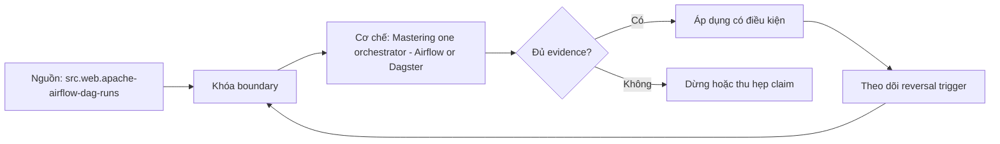

# Mastering one orchestrator - Airflow or Dagster

> [!abstract] Câu hỏi trung tâm
> Làm chủ một orchestrator được chứng minh bằng những năng lực vận hành nào thay vì số lượng DAG đã viết?

## 1. Mastery surface

Làm chủ gồm authoring, scheduling, deployment, observation, recovery và upgrade; biết API happy path mới chỉ là exposure. Đừng bắt đầu bằng tên công cụ. Hãy bắt đầu bằng đối tượng được bảo vệ, boundary quan sát được và hậu quả nếu kết luận sai. Trong bài `Mastering one orchestrator - Airflow or Dagster`, câu hỏi thực dụng là: Làm chủ một orchestrator được chứng minh bằng những năng lực vận hành nào thay vì số lượng DAG đã viết? Ta ghi rõ grain, population, time window, owner và hành động sau failure; nếu một trường chưa biết thì đánh dấu unknown thay vì lấp bằng mặc định. Bằng chứng tối thiểu gồm fixture có version, cấu hình hoặc rule đã resolve, raw observation, expected result và limitation. Phần này là curriculum synthesis dựa trên các nguồn đã định danh, không phải lời hứa rằng mọi adapter hay deployment đều có cùng hành vi.

## 2. Execution identity

DAG run, task instance, logical interval, code version và external artifact phải nối thành một run identity có thể truy vết. Điểm khó không nằm ở cú pháp mà ở identity và scope. Hai phép đo cùng tên vẫn có thể nói về hai population hoặc hai thời điểm khác nhau. Trong bài `Mastering one orchestrator - Airflow or Dagster`, câu hỏi thực dụng là: Làm chủ một orchestrator được chứng minh bằng những năng lực vận hành nào thay vì số lượng DAG đã viết? Ta ghi rõ grain, population, time window, owner và hành động sau failure; nếu một trường chưa biết thì đánh dấu unknown thay vì lấp bằng mặc định. Bằng chứng tối thiểu gồm fixture có version, cấu hình hoặc rule đã resolve, raw observation, expected result và limitation. Phần này là curriculum synthesis dựa trên các nguồn đã định danh, không phải lời hứa rằng mọi adapter hay deployment đều có cùng hành vi.

## 3. Local-to-production gap

Local executor không đại diện queue, worker loss, secret backend, remote logging hay scheduler contention của deployment thật. Một dashboard xanh chỉ là tín hiệu. Muốn biến nó thành bằng chứng phải giữ input, phiên bản, rule, trạng thái trước–sau và cách tính độc lập. Trong bài `Mastering one orchestrator - Airflow or Dagster`, câu hỏi thực dụng là: Làm chủ một orchestrator được chứng minh bằng những năng lực vận hành nào thay vì số lượng DAG đã viết? Ta ghi rõ grain, population, time window, owner và hành động sau failure; nếu một trường chưa biết thì đánh dấu unknown thay vì lấp bằng mặc định. Bằng chứng tối thiểu gồm fixture có version, cấu hình hoặc rule đã resolve, raw observation, expected result và limitation. Phần này là curriculum synthesis dựa trên các nguồn đã định danh, không phải lời hứa rằng mọi adapter hay deployment đều có cùng hành vi.

## 4. Failure laboratory

Bộ lab phải tiêm parse error, worker death, stuck task, duplicate trigger, missed schedule và partial publish. Thiết kế tốt phải chịu được counterexample. Hãy chủ động tạo case sát boundary, case thiếu dữ liệu và case replay thay vì chỉ chạy happy path. Trong bài `Mastering one orchestrator - Airflow or Dagster`, câu hỏi thực dụng là: Làm chủ một orchestrator được chứng minh bằng những năng lực vận hành nào thay vì số lượng DAG đã viết? Ta ghi rõ grain, population, time window, owner và hành động sau failure; nếu một trường chưa biết thì đánh dấu unknown thay vì lấp bằng mặc định. Bằng chứng tối thiểu gồm fixture có version, cấu hình hoặc rule đã resolve, raw observation, expected result và limitation. Phần này là curriculum synthesis dựa trên các nguồn đã định danh, không phải lời hứa rằng mọi adapter hay deployment đều có cùng hành vi.

## 5. Operational dossier

Dossier giữ topology, configuration diff, runbook, metrics, logs, recovery transcript và giới hạn đã biết. Chi phí vận hành thuộc contract. Một rule đúng nhưng quá đắt, quá ồn hoặc không có owner sẽ nhanh chóng bị tắt và mất tác dụng. Trong bài `Mastering one orchestrator - Airflow or Dagster`, câu hỏi thực dụng là: Làm chủ một orchestrator được chứng minh bằng những năng lực vận hành nào thay vì số lượng DAG đã viết? Ta ghi rõ grain, population, time window, owner và hành động sau failure; nếu một trường chưa biết thì đánh dấu unknown thay vì lấp bằng mặc định. Bằng chứng tối thiểu gồm fixture có version, cấu hình hoặc rule đã resolve, raw observation, expected result và limitation. Phần này là curriculum synthesis dựa trên các nguồn đã định danh, không phải lời hứa rằng mọi adapter hay deployment đều có cùng hành vi.

## 6. Choice boundary

Chọn Airflow hay Dagster là quyết định theo workload và operating model; bài này yêu cầu chiều sâu trên một tool, không so brochure. Kết luận cần có điều kiện đảo chiều. Khi volume, latency, nguồn thẩm quyền hoặc topology đổi, quyết định cũ phải được xem xét lại bằng cùng một oracle. Trong bài `Mastering one orchestrator - Airflow or Dagster`, câu hỏi thực dụng là: Làm chủ một orchestrator được chứng minh bằng những năng lực vận hành nào thay vì số lượng DAG đã viết? Ta ghi rõ grain, population, time window, owner và hành động sau failure; nếu một trường chưa biết thì đánh dấu unknown thay vì lấp bằng mặc định. Bằng chứng tối thiểu gồm fixture có version, cấu hình hoặc rule đã resolve, raw observation, expected result và limitation. Phần này là curriculum synthesis dựa trên các nguồn đã định danh, không phải lời hứa rằng mọi adapter hay deployment đều có cùng hành vi.

## 7. Ma trận kiểm chứng từng mệnh đề

Với `wiki.orchestration.master-one-orchestrator`, command thành công không tự chứng minh dữ liệu đúng. Protocol riêng của bài là: Dựng fixture có run/data identity rõ, tiêm một failure tại boundary quan trọng và đối soát state bằng oracle độc lập. Mỗi probe dưới đây phải nối input boundary với failure signal và oracle có thể phản bác kết luận.

### 7.1. Mastering one orchestrator - Airflow or Dagster: kiểm `Mastery surface` bằng case 1, cụ thể làm chủ gồm authoring, scheduling, deployment, observation, recovery và upgrade; biết api happy path mới chỉ là exposure

**Mệnh đề cần kiểm.** Mastering one orchestrator - Airflow or Dagster: kiểm `Mastery surface` bằng case 1, cụ thể làm chủ gồm authoring, scheduling, deployment, observation, recovery và upgrade; biết api happy path mới chỉ là exposure.

**Thiết kế phép thử cho `wiki.orchestration.master-one-orchestrator`.** Trong ngữ cảnh `wiki.orchestration.master-one-orchestrator`, tạo positive control và negative control chỉ khác đúng một điều kiện. Khóa input snapshot, phiên bản và owner của rule; chạy đúng population được bài `Mastering one orchestrator - Airflow or Dagster` công bố.

**Bằng chứng cần giữ.** Đối với probe 1 của `Mastering one orchestrator - Airflow or Dagster`, giữ fixture, raw failing rows và lệnh tái hiện. Nếu chưa chạy lab, ghi expected evidence và giữ trạng thái review; không biến protocol thành observation.

### 7.2. Mastering one orchestrator - Airflow or Dagster: kiểm `Execution identity` bằng case 2, cụ thể dag run, task instance, logical interval, code version và external artifact phải nối thành một run identity có thể truy vết

**Mệnh đề cần kiểm.** Mastering one orchestrator - Airflow or Dagster: kiểm `Execution identity` bằng case 2, cụ thể dag run, task instance, logical interval, code version và external artifact phải nối thành một run identity có thể truy vết.

**Thiết kế phép thử cho `wiki.orchestration.master-one-orchestrator`.** Trong ngữ cảnh `wiki.orchestration.master-one-orchestrator`, đổi grain nhưng giữ tổng số dòng để lộ phép đo sai cấp. Khóa input snapshot, phiên bản và owner của rule; chạy đúng population được bài `Mastering one orchestrator - Airflow or Dagster` công bố.

**Bằng chứng cần giữ.** Đối với probe 2 của `Mastering one orchestrator - Airflow or Dagster`, báo numerator, denominator và key set ở cả hai grain. Nếu chưa chạy lab, ghi expected evidence và giữ trạng thái review; không biến protocol thành observation.

### 7.3. Mastering one orchestrator - Airflow or Dagster: kiểm `Local-to-production gap` bằng case 3, cụ thể local executor không đại diện queue, worker loss, secret backend, remote logging hay scheduler contention của deployment thật

**Mệnh đề cần kiểm.** Mastering one orchestrator - Airflow or Dagster: kiểm `Local-to-production gap` bằng case 3, cụ thể local executor không đại diện queue, worker loss, secret backend, remote logging hay scheduler contention của deployment thật.

**Thiết kế phép thử cho `wiki.orchestration.master-one-orchestrator`.** Trong ngữ cảnh `wiki.orchestration.master-one-orchestrator`, đưa một giá trị tới đúng boundary và một giá trị vượt boundary. Khóa input snapshot, phiên bản và owner của rule; chạy đúng population được bài `Mastering one orchestrator - Airflow or Dagster` công bố.

**Bằng chứng cần giữ.** Đối với probe 3 của `Mastering one orchestrator - Airflow or Dagster`, lưu hai observed values cùng rule đã resolve. Nếu chưa chạy lab, ghi expected evidence và giữ trạng thái review; không biến protocol thành observation.

### 7.4. Mastering one orchestrator - Airflow or Dagster: kiểm `Failure laboratory` bằng case 4, cụ thể bộ lab phải tiêm parse error, worker death, stuck task, duplicate trigger, missed schedule và partial publish

**Mệnh đề cần kiểm.** Mastering one orchestrator - Airflow or Dagster: kiểm `Failure laboratory` bằng case 4, cụ thể bộ lab phải tiêm parse error, worker death, stuck task, duplicate trigger, missed schedule và partial publish.

**Thiết kế phép thử cho `wiki.orchestration.master-one-orchestrator`.** Trong ngữ cảnh `wiki.orchestration.master-one-orchestrator`, kill tiến trình ngay trước rồi ngay sau durable side effect. Khóa input snapshot, phiên bản và owner của rule; chạy đúng population được bài `Mastering one orchestrator - Airflow or Dagster` công bố.

**Bằng chứng cần giữ.** Đối với probe 4 của `Mastering one orchestrator - Airflow or Dagster`, lưu checkpoint, external ledger và trạng thái sau restart. Nếu chưa chạy lab, ghi expected evidence và giữ trạng thái review; không biến protocol thành observation.

### 7.5. Mastering one orchestrator - Airflow or Dagster: kiểm `Operational dossier` bằng case 5, cụ thể dossier giữ topology, configuration diff, runbook, metrics, logs, recovery transcript và giới hạn đã biết

**Mệnh đề cần kiểm.** Mastering one orchestrator - Airflow or Dagster: kiểm `Operational dossier` bằng case 5, cụ thể dossier giữ topology, configuration diff, runbook, metrics, logs, recovery transcript và giới hạn đã biết.

**Thiết kế phép thử cho `wiki.orchestration.master-one-orchestrator`.** Trong ngữ cảnh `wiki.orchestration.master-one-orchestrator`, đảo thứ tự input và concurrency nhưng giữ logical population. Khóa input snapshot, phiên bản và owner của rule; chạy đúng population được bài `Mastering one orchestrator - Airflow or Dagster` công bố.

**Bằng chứng cần giữ.** Đối với probe 5 của `Mastering one orchestrator - Airflow or Dagster`, so canonical hash và business totals giữa các thứ tự. Nếu chưa chạy lab, ghi expected evidence và giữ trạng thái review; không biến protocol thành observation.

### 7.6. Mastering one orchestrator - Airflow or Dagster: kiểm `Choice boundary` bằng case 6, cụ thể chọn airflow hay dagster là quyết định theo workload và operating model; bài này yêu cầu chiều sâu trên một tool, không so brochure

**Mệnh đề cần kiểm.** Mastering one orchestrator - Airflow or Dagster: kiểm `Choice boundary` bằng case 6, cụ thể chọn airflow hay dagster là quyết định theo workload và operating model; bài này yêu cầu chiều sâu trên một tool, không so brochure.

**Thiết kế phép thử cho `wiki.orchestration.master-one-orchestrator`.** Trong ngữ cảnh `wiki.orchestration.master-one-orchestrator`, replay cùng identity với payload giống rồi payload xung đột. Khóa input snapshot, phiên bản và owner của rule; chạy đúng population được bài `Mastering one orchestrator - Airflow or Dagster` công bố.

**Bằng chứng cần giữ.** Đối với probe 6 của `Mastering one orchestrator - Airflow or Dagster`, tách duplicate replay khỏi identity collision bằng reason code. Nếu chưa chạy lab, ghi expected evidence và giữ trạng thái review; không biến protocol thành observation.

### 7.7. Mastering one orchestrator - Airflow or Dagster: kiểm `Mastery surface` bằng case 7, cụ thể làm chủ gồm authoring, scheduling, deployment, observation, recovery và upgrade; biết api happy path mới chỉ là exposure

**Mệnh đề cần kiểm.** Mastering one orchestrator - Airflow or Dagster: kiểm `Mastery surface` bằng case 7, cụ thể làm chủ gồm authoring, scheduling, deployment, observation, recovery và upgrade; biết api happy path mới chỉ là exposure.

**Thiết kế phép thử cho `wiki.orchestration.master-one-orchestrator`.** Trong ngữ cảnh `wiki.orchestration.master-one-orchestrator`, thêm record tới trễ trong horizon và ngoài horizon. Khóa input snapshot, phiên bản và owner của rule; chạy đúng population được bài `Mastering one orchestrator - Airflow or Dagster` công bố.

**Bằng chứng cần giữ.** Đối với probe 7 của `Mastering one orchestrator - Airflow or Dagster`, báo accepted-late, rejected-late và oldest outstanding timestamp. Nếu chưa chạy lab, ghi expected evidence và giữ trạng thái review; không biến protocol thành observation.

### 7.8. Mastering one orchestrator - Airflow or Dagster: kiểm `Execution identity` bằng case 8, cụ thể dag run, task instance, logical interval, code version và external artifact phải nối thành một run identity có thể truy vết

**Mệnh đề cần kiểm.** Mastering one orchestrator - Airflow or Dagster: kiểm `Execution identity` bằng case 8, cụ thể dag run, task instance, logical interval, code version và external artifact phải nối thành một run identity có thể truy vết.

**Thiết kế phép thử cho `wiki.orchestration.master-one-orchestrator`.** Trong ngữ cảnh `wiki.orchestration.master-one-orchestrator`, đổi schema theo một cách tương thích rồi một cách phá vỡ semantics. Khóa input snapshot, phiên bản và owner của rule; chạy đúng population được bài `Mastering one orchestrator - Airflow or Dagster` công bố.

**Bằng chứng cần giữ.** Đối với probe 8 của `Mastering one orchestrator - Airflow or Dagster`, giữ schema diff, classification và consumer-visible result. Nếu chưa chạy lab, ghi expected evidence và giữ trạng thái review; không biến protocol thành observation.

### 7.9. Mastering one orchestrator - Airflow or Dagster: kiểm `Local-to-production gap` bằng case 9, cụ thể local executor không đại diện queue, worker loss, secret backend, remote logging hay scheduler contention của deployment thật

**Mệnh đề cần kiểm.** Mastering one orchestrator - Airflow or Dagster: kiểm `Local-to-production gap` bằng case 9, cụ thể local executor không đại diện queue, worker loss, secret backend, remote logging hay scheduler contention của deployment thật.

**Thiết kế phép thử cho `wiki.orchestration.master-one-orchestrator`.** Trong ngữ cảnh `wiki.orchestration.master-one-orchestrator`, tạo missing và duplicate bù nhau để count tổng không đổi. Khóa input snapshot, phiên bản và owner của rule; chạy đúng population được bài `Mastering one orchestrator - Airflow or Dagster` công bố.

**Bằng chứng cần giữ.** Đối với probe 9 của `Mastering one orchestrator - Airflow or Dagster`, so key multiset và typed hashes thay vì chỉ row count. Nếu chưa chạy lab, ghi expected evidence và giữ trạng thái review; không biến protocol thành observation.

### 7.10. Mastering one orchestrator - Airflow or Dagster: kiểm `Failure laboratory` bằng case 10, cụ thể bộ lab phải tiêm parse error, worker death, stuck task, duplicate trigger, missed schedule và partial publish

**Mệnh đề cần kiểm.** Mastering one orchestrator - Airflow or Dagster: kiểm `Failure laboratory` bằng case 10, cụ thể bộ lab phải tiêm parse error, worker death, stuck task, duplicate trigger, missed schedule và partial publish.

**Thiết kế phép thử cho `wiki.orchestration.master-one-orchestrator`.** Trong ngữ cảnh `wiki.orchestration.master-one-orchestrator`, cho reviewer tái hiện chỉ từ evidence package. Khóa input snapshot, phiên bản và owner của rule; chạy đúng population được bài `Mastering one orchestrator - Airflow or Dagster` công bố.

**Bằng chứng cần giữ.** Đối với probe 10 của `Mastering one orchestrator - Airflow or Dagster`, package phải đủ để người khác dựng lại decision và limitation. Nếu chưa chạy lab, ghi expected evidence và giữ trạng thái review; không biến protocol thành observation.

### 7.11. Mastering one orchestrator - Airflow or Dagster: kiểm `Operational dossier` bằng case 11, cụ thể dossier giữ topology, configuration diff, runbook, metrics, logs, recovery transcript và giới hạn đã biết

**Mệnh đề cần kiểm.** Mastering one orchestrator - Airflow or Dagster: kiểm `Operational dossier` bằng case 11, cụ thể dossier giữ topology, configuration diff, runbook, metrics, logs, recovery transcript và giới hạn đã biết.

**Thiết kế phép thử cho `wiki.orchestration.master-one-orchestrator`.** Trong ngữ cảnh `wiki.orchestration.master-one-orchestrator`, so với oracle độc lập không dùng chung query hoặc parser. Khóa input snapshot, phiên bản và owner của rule; chạy đúng population được bài `Mastering one orchestrator - Airflow or Dagster` công bố.

**Bằng chứng cần giữ.** Đối với probe 11 của `Mastering one orchestrator - Airflow or Dagster`, independent result phải khớp ở grain đã công bố. Nếu chưa chạy lab, ghi expected evidence và giữ trạng thái review; không biến protocol thành observation.

### 7.12. Mastering one orchestrator - Airflow or Dagster: kiểm `Choice boundary` bằng case 12, cụ thể chọn airflow hay dagster là quyết định theo workload và operating model; bài này yêu cầu chiều sâu trên một tool, không so brochure

**Mệnh đề cần kiểm.** Mastering one orchestrator - Airflow or Dagster: kiểm `Choice boundary` bằng case 12, cụ thể chọn airflow hay dagster là quyết định theo workload và operating model; bài này yêu cầu chiều sâu trên một tool, không so brochure.

**Thiết kế phép thử cho `wiki.orchestration.master-one-orchestrator`.** Trong ngữ cảnh `wiki.orchestration.master-one-orchestrator`, chạy scope hẹp và population đầy đủ rồi công bố phần bị loại. Khóa input snapshot, phiên bản và owner của rule; chạy đúng population được bài `Mastering one orchestrator - Airflow or Dagster` công bố.

**Bằng chứng cần giữ.** Đối với probe 12 của `Mastering one orchestrator - Airflow or Dagster`, coverage phải nêu rõ excluded nodes, partitions hoặc incidents. Nếu chưa chạy lab, ghi expected evidence và giữ trạng thái review; không biến protocol thành observation.

### 7.13. Mastering one orchestrator - Airflow or Dagster: kiểm `Mastery surface` bằng case 13, cụ thể làm chủ gồm authoring, scheduling, deployment, observation, recovery và upgrade; biết api happy path mới chỉ là exposure

**Mệnh đề cần kiểm.** Mastering one orchestrator - Airflow or Dagster: kiểm `Mastery surface` bằng case 13, cụ thể làm chủ gồm authoring, scheduling, deployment, observation, recovery và upgrade; biết api happy path mới chỉ là exposure.

**Thiết kế phép thử cho `wiki.orchestration.master-one-orchestrator`.** Trong ngữ cảnh `wiki.orchestration.master-one-orchestrator`, thử timezone, precision hoặc partition ở hai phía của ranh giới. Khóa input snapshot, phiên bản và owner của rule; chạy đúng population được bài `Mastering one orchestrator - Airflow or Dagster` công bố.

**Bằng chứng cần giữ.** Đối với probe 13 của `Mastering one orchestrator - Airflow or Dagster`, UTC/local interval và rounding policy phải hiện trong output. Nếu chưa chạy lab, ghi expected evidence và giữ trạng thái review; không biến protocol thành observation.

### 7.14. Mastering one orchestrator - Airflow or Dagster: kiểm `Execution identity` bằng case 14, cụ thể dag run, task instance, logical interval, code version và external artifact phải nối thành một run identity có thể truy vết

**Mệnh đề cần kiểm.** Mastering one orchestrator - Airflow or Dagster: kiểm `Execution identity` bằng case 14, cụ thể dag run, task instance, logical interval, code version và external artifact phải nối thành một run identity có thể truy vết.

**Thiết kế phép thử cho `wiki.orchestration.master-one-orchestrator`.** Trong ngữ cảnh `wiki.orchestration.master-one-orchestrator`, đổi constraint đủ lớn để quyết định phải đảo. Khóa input snapshot, phiên bản và owner của rule; chạy đúng population được bài `Mastering one orchestrator - Airflow or Dagster` công bố.

**Bằng chứng cần giữ.** Đối với probe 14 của `Mastering one orchestrator - Airflow or Dagster`, ADR phải lưu changed constraint và reversal threshold. Nếu chưa chạy lab, ghi expected evidence và giữ trạng thái review; không biến protocol thành observation.

### 7.15. Mastering one orchestrator - Airflow or Dagster: kiểm `Local-to-production gap` bằng case 15, cụ thể local executor không đại diện queue, worker loss, secret backend, remote logging hay scheduler contention của deployment thật

**Mệnh đề cần kiểm.** Mastering one orchestrator - Airflow or Dagster: kiểm `Local-to-production gap` bằng case 15, cụ thể local executor không đại diện queue, worker loss, secret backend, remote logging hay scheduler contention của deployment thật.

**Thiết kế phép thử cho `wiki.orchestration.master-one-orchestrator`.** Trong ngữ cảnh `wiki.orchestration.master-one-orchestrator`, chạy lại từ môi trường sạch với versions và seed đã khóa. Khóa input snapshot, phiên bản và owner của rule; chạy đúng population được bài `Mastering one orchestrator - Airflow or Dagster` công bố.

**Bằng chứng cần giữ.** Đối với probe 15 của `Mastering one orchestrator - Airflow or Dagster`, canonical result phải ổn định hoặc mọi nondeterminism phải được giải thích. Nếu chưa chạy lab, ghi expected evidence và giữ trạng thái review; không biến protocol thành observation.

## 8. Quy trình phản biện

1. Viết consumer-visible invariant cho `Mastering one orchestrator - Airflow or Dagster` trước khi chọn query hoặc tool.
2. Khóa grain, identity, population, time window và authoritative source.
3. Phân biệt declared configuration, executed state và published state.
4. Chạy negative control, replay hoặc changed-assumption case phù hợp.
5. Đối soát bằng oracle độc lập; công bố coverage và phần không quan sát được.
6. Gắn owner, hành động, reversal trigger và hạn review cho kết luận.

## 9. Câu hỏi tự kiểm tra

1. `Mastering one orchestrator - Airflow or Dagster: kiểm `Mastery surface` bằng case 1, cụ thể làm chủ gồm authoring, scheduling, deployment, observation, recovery và upgrade; biết api happy path mới chỉ là exposure` thất bại đầu tiên ở boundary nào?
2. Artifact nào mạnh nhất để trả lời `Mastering one orchestrator - Airflow or Dagster: kiểm `Local-to-production gap` bằng case 3, cụ thể local executor không đại diện queue, worker loss, secret backend, remote logging hay scheduler contention của deployment thật`?
3. Counterexample nhỏ nhất cho `Mastering one orchestrator - Airflow or Dagster: kiểm `Choice boundary` bằng case 6, cụ thể chọn airflow hay dagster là quyết định theo workload và operating model; bài này yêu cầu chiều sâu trên một tool, không so brochure` gồm những state nào?
4. `Mastering one orchestrator - Airflow or Dagster: kiểm `Local-to-production gap` bằng case 9, cụ thể local executor không đại diện queue, worker loss, secret backend, remote logging hay scheduler contention của deployment thật` có thể xanh giả ra sao?
5. Constraint nào khiến quyết định ở `Mastering one orchestrator - Airflow or Dagster: kiểm `Execution identity` bằng case 14, cụ thể dag run, task instance, logical interval, code version và external artifact phải nối thành một run identity có thể truy vết` phải đảo?
6. Phần nào của `Mastering one orchestrator - Airflow or Dagster: kiểm `Local-to-production gap` bằng case 15, cụ thể local executor không đại diện queue, worker loss, secret backend, remote logging hay scheduler contention của deployment thật` mới là protocol, chưa phải observation?

## 10. Giới hạn và điều chưa cho phép kết luận

- Lab của `Mastering one orchestrator - Airflow or Dagster` chưa chạy trên hệ thống production; nội dung là giáo trình và expected evidence.
- Hành vi phụ thuộc phiên bản, connector, scheduler, warehouse và catalog configuration phải được kiểm lại.
- Các ma trận, ladder và threshold do giáo trình tổng hợp không được gán nguyên văn cho vendor.
- Note giữ trạng thái `review` cho tới khi owner duyệt semantics và learner artifact.

## Reference
1. [[SRC-APACHE-AIRFLOW-DAG-RUNS]]
2. [[SRC-APACHE-AIRFLOW-TASKS]]

## Source coverage

| Source slice | Nội dung sử dụng | Trạng thái |
|---|---|---|
| [[SRC-APACHE-AIRFLOW-DAG-RUNS]] | Contract hoặc cơ chế liên quan trực tiếp tới `Mastering one orchestrator - Airflow or Dagster` | Đã đọc locator; cần pin version khi chạy lab |
| [[SRC-APACHE-AIRFLOW-TASKS]] | Contract hoặc cơ chế liên quan trực tiếp tới `Mastering one orchestrator - Airflow or Dagster` | Đã đọc locator; cần pin version khi chạy lab |

## Key takeaways
- Mastery là năng lực vận hành và phục hồi có bằng chứng, không phải số DAG.
- Với `wiki.orchestration.master-one-orchestrator`, quality của kết luận phụ thuộc identity, coverage và oracle chứ không phụ thuộc màu dashboard.
- Câu hỏi `Làm chủ một orchestrator được chứng minh bằng những năng lực vận hành nào thay vì số lượng DAG đã viết?` chỉ được trả lời trong scope và version đã ghi.
- Các source IDs `src.web.apache-airflow-dag-runs, src.web.apache-airflow-tasks` đặt ranh giới cho source fact; phần còn lại là synthesis có nhãn.
- Trước khi lab chạy, đây là note đã kiểm cấu trúc và provenance, chưa phải chứng nhận production.

<!-- ATOMIC-EXECUTION-CAPSULE:START -->

## Execution capsule — kiểm chứng `wiki.orchestration.master-one-orchestrator`

> [!important] Phân loại mệnh đề
> Với `wiki.orchestration.master-one-orchestrator`, sơ đồ, ví dụ và artifact về **Mastering one orchestrator - Airflow or Dagster** là **synthesis để kiểm chứng**; chúng không phải trích dẫn hay case nguyên văn của nguồn.

### Sơ đồ cơ chế và điểm kiểm soát



Đọc sơ đồ `wiki.orchestration.master-one-orchestrator` từ trái sang phải: source chỉ cung cấp claim ban đầu cho **Mastering one orchestrator - Airflow or Dagster**; quyết định chỉ được đi tiếp sau khi boundary, evidence và điều kiện đảo quyết định đã hiện hữu.

### Artifact thực thi tối thiểu

```sql
-- Verification harness for: Mastering one orchestrator - Airflow or Dagster
WITH evidence AS (
    SELECT 'wiki.orchestration.master-one-orchestrator' AS concept_id,
           'boundary_declared' AS check_name, 1 AS passed
    UNION ALL
    SELECT 'wiki.orchestration.master-one-orchestrator', 'independent_oracle', 1
    UNION ALL
    SELECT 'wiki.orchestration.master-one-orchestrator', 'reversal_trigger_recorded', 1
)
SELECT concept_id,
       MIN(passed) AS all_hard_checks_pass,
       COUNT(*) AS evidence_items
FROM evidence
GROUP BY concept_id
HAVING MIN(passed) = 1;
```

Artifact của `wiki.orchestration.master-one-orchestrator` buộc người dùng ghi boundary, oracle và reversal trigger cho **Mastering one orchestrator - Airflow or Dagster**. Các giá trị minh họa phải được thay bằng evidence thật trước khi dùng cho quyết định.

### Tự kiểm tra trước khi tái sử dụng

1. Bạn có thể trả lời `Làm chủ một orchestrator được chứng minh bằng những năng lực vận hành nào thay vì số lượng DAG đã viết?` bằng một câu mà không kéo thêm concept thứ hai không?
2. Source locator nào đỡ cho claim, và phần nào chỉ là synthesis trong note?
3. Observation nào khiến bạn dừng, thu hẹp hoặc đảo quyết định?
4. Artifact nào cho phép một reviewer độc lập tái hiện kết quả?

<!-- ATOMIC-EXECUTION-CAPSULE:END -->
