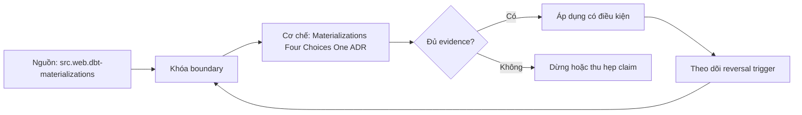

# Materializations Four Choices One ADR

> [!abstract] Câu hỏi trung tâm
> Chọn view, table, incremental hay ephemeral bằng workload, correctness và recovery evidence nào?

## 1. Materialization là execution contract

Cùng select logic nhưng view, table, incremental và ephemeral tạo compute placement, persistence, freshness và failure surface khác nhau. View tính khi đọc; table rebuild lưu snapshot; incremental mutate/replace một phần target; ephemeral inline SQL vào downstream. Adapter macro và warehouse quyết định DDL/transaction chi tiết. ADR phải pin versions và effective config; tên materialization không phải guarantee phổ quát.

## 2. View

View giảm storage duplication và luôn đọc underlying current state, phù hợp logic nhẹ hoặc interface cần freshness. Nó đẩy compute/cost/latency sang consumer và có thể nhân workload qua nhiều dashboards. View chain sâu làm query khó tối ưu/debug. Schema contract/grant behavior phụ thuộc platform. Chọn view khi measured downstream performance trong envelope và recomputation semantics được chấp nhận, không chỉ vì dataset nhỏ hôm nay.

## 3. Table

Table cô lập consumer khỏi recompute và cho predictable scans, nhưng freshness phụ thuộc rebuild schedule và full build cost. Atomic replace, grants, indexes, clustering, statistics và failure rollback phải kiểm theo adapter. Rebuild có thể đơn giản và đúng hơn incremental cho moderate data. Một table stale nhưng query nhanh vẫn fail SLO. Ghi build time, bytes scanned/written, publish window và retained prior version.

## 4. Incremental

Incremental giảm work khi change slice nhỏ, đổi lại thêm contract về filter, unique key, late data, deletes, schema evolution, idempotency và full refresh. Correctness proof phải so với full recompute trên controlled boundary. Adapter strategies khác nhau. Incremental không phải optimization miễn phí; maintenance và backfill cost có thể vượt compute tiết kiệm nếu source mutations không phù hợp.

## 5. Ephemeral

Ephemeral tránh relation riêng và inline như CTE vào dependents, hữu ích cho lightweight single-use logic. Nó không có independent persisted state để inspect, grant, freshness-check hoặc reuse cheaply; reuse ở nhiều downstream nhân compiled SQL và compute. Query text/optimizer limits có thể trở thành vấn đề. Không dùng ephemeral cho semantic boundary cần ownership hoặc recovery.

## 6. ADR và reversal

Score workload bằng reuse fanout, query frequency/latency, build volume/change rate, freshness, recovery, storage/compute cost, observability, access và consumer contract. Benchmark feasible candidates trên cùng data/query set. Ghi decision, rejected options, assumptions và thresholds làm đảo lựa chọn. Review sau observed runs bằng artifacts/query history. ADR không nói một materialization tốt nhất toàn project; decision là per model hoặc coherent model class.

## 7. Ma trận kiểm chứng từng mệnh đề

Trong `Materializations Four Choices One ADR`, mỗi claim phải nối được tới input boundary, compiled hoặc executed artifact, trạng thái trước-sau, failure signal và independent oracle. Một command kết thúc với exit code 0 không tự chứng minh dữ liệu đúng, đầy đủ hoặc phù hợp với consumer contract. Protocol nền của bài này: Dựng fixture và project tối thiểu có exact graph/input boundary; chạy command hoặc protocol theo thứ tự, rồi đối soát relation, key set, typed hash và business invariant với full/reference computation.

### 7.1. Materialization probe 1: workload, persistence, failure window, measured cost và reversal trigger phải rõ

**Mệnh đề cần kiểm.** Materialization probe 1: workload, persistence, failure window, measured cost và reversal trigger phải rõ.

**Thiết kế phép thử cho `wiki.transformation.dbt-materializations-adr`.** Với `Materialization probe 1: workload, persistence, failure window, measured cost và reversal trigger phải rõ`, Bắt đầu bằng ca nhỏ nhất có thể làm mệnh đề sai; chỉ thêm dữ liệu sau khi failure signal đã xuất hiện đúng chỗ. Cách này phân biệt một assertion có lực với một bài demo chỉ đi qua happy path. Khóa versions, target và input boundary có liên quan; lưu command, compiled SQL hoặc scheduler context cùng query IDs và timestamps.

**Bằng chứng cần giữ.** Hồ sơ của `Materialization probe 1: workload, persistence, failure window, measured cost và reversal trigger phải rõ` phải cho thấy: Giữ fixture tối thiểu, raw failure rows và câu lệnh tái hiện; ảnh chụp màn hình một trạng thái xanh không đủ. Nếu sandbox chưa chạy, mục này vẫn là protocol; không đổi expected result thành observation.

### 7.2. Materialization probe 2: workload, persistence, failure window, measured cost và reversal trigger phải rõ

**Mệnh đề cần kiểm.** Materialization probe 2: workload, persistence, failure window, measured cost và reversal trigger phải rõ.

**Thiết kế phép thử cho `wiki.transformation.dbt-materializations-adr`.** Với `Materialization probe 2: workload, persistence, failure window, measured cost và reversal trigger phải rõ`, Giữ nguyên input rồi đổi đúng một tham số cấu hình liên quan. Nếu output đổi theo nhiều hướng cùng lúc, phép thử chưa cô lập được nguyên nhân và phải thu hẹp lại. Khóa versions, target và input boundary có liên quan; lưu command, compiled SQL hoặc scheduler context cùng query IDs và timestamps.

**Bằng chứng cần giữ.** Hồ sơ của `Materialization probe 2: workload, persistence, failure window, measured cost và reversal trigger phải rõ` phải cho thấy: Báo cả giá trị trước-sau của tham số, compiled artifact và diff đầu ra để reviewer thấy biến nào thực sự đổi. Nếu sandbox chưa chạy, mục này vẫn là protocol; không đổi expected result thành observation.

### 7.3. Materialization probe 3: workload, persistence, failure window, measured cost và reversal trigger phải rõ

**Mệnh đề cần kiểm.** Materialization probe 3: workload, persistence, failure window, measured cost và reversal trigger phải rõ.

**Thiết kế phép thử cho `wiki.transformation.dbt-materializations-adr`.** Với `Materialization probe 3: workload, persistence, failure window, measured cost và reversal trigger phải rõ`, Chạy cặp đối chứng: một input phải được chấp nhận và một input chỉ lệch tại boundary phải bị chặn hoặc được phân loại. Hai ca dùng chung code path để tránh so hai hệ thống khác nhau. Khóa versions, target và input boundary có liên quan; lưu command, compiled SQL hoặc scheduler context cùng query IDs và timestamps.

**Bằng chứng cần giữ.** Hồ sơ của `Materialization probe 3: workload, persistence, failure window, measured cost và reversal trigger phải rõ` phải cho thấy: Pass khi positive control đi qua, negative control dừng đúng lớp và không có side effect ngoài scope. Nếu sandbox chưa chạy, mục này vẫn là protocol; không đổi expected result thành observation.

### 7.4. Materialization probe 4: workload, persistence, failure window, measured cost và reversal trigger phải rõ

**Mệnh đề cần kiểm.** Materialization probe 4: workload, persistence, failure window, measured cost và reversal trigger phải rõ.

**Thiết kế phép thử cho `wiki.transformation.dbt-materializations-adr`.** Với `Materialization probe 4: workload, persistence, failure window, measured cost và reversal trigger phải rõ`, Đặt kill point ngay trước và ngay sau durable boundary. So trạng thái sau restart để biết hệ thống tạo replay có kiểm soát, silent gap hay một trạng thái nửa vời mà dashboard không báo. Khóa versions, target và input boundary có liên quan; lưu command, compiled SQL hoặc scheduler context cùng query IDs và timestamps.

**Bằng chứng cần giữ.** Hồ sơ của `Materialization probe 4: workload, persistence, failure window, measured cost và reversal trigger phải rõ` phải cho thấy: Run ledger phải cho biết commit/checkpoint nào bền vững; sau rerun, key set và side-effect ledger cùng hội tụ. Nếu sandbox chưa chạy, mục này vẫn là protocol; không đổi expected result thành observation.

### 7.5. Materialization probe 5: workload, persistence, failure window, measured cost và reversal trigger phải rõ

**Mệnh đề cần kiểm.** Materialization probe 5: workload, persistence, failure window, measured cost và reversal trigger phải rõ.

**Thiết kế phép thử cho `wiki.transformation.dbt-materializations-adr`.** Với `Materialization probe 5: workload, persistence, failure window, measured cost và reversal trigger phải rõ`, Đảo thứ tự input và thay concurrency nhưng giữ logical population. Kết quả khác nhau cho thấy thiết kế đang phụ thuộc physical order hoặc race thay vì contract đã công bố. Khóa versions, target và input boundary có liên quan; lưu command, compiled SQL hoặc scheduler context cùng query IDs và timestamps.

**Bằng chứng cần giữ.** Hồ sơ của `Materialization probe 5: workload, persistence, failure window, measured cost và reversal trigger phải rõ` phải cho thấy: Hash chuẩn hóa và business totals phải giống nhau giữa các thứ tự; chênh lệch được giữ như finding, không làm tròn mất. Nếu sandbox chưa chạy, mục này vẫn là protocol; không đổi expected result thành observation.

### 7.6. Materialization probe 6: workload, persistence, failure window, measured cost và reversal trigger phải rõ

**Mệnh đề cần kiểm.** Materialization probe 6: workload, persistence, failure window, measured cost và reversal trigger phải rõ.

**Thiết kế phép thử cho `wiki.transformation.dbt-materializations-adr`.** Với `Materialization probe 6: workload, persistence, failure window, measured cost và reversal trigger phải rõ`, Cho cùng logical identity xuất hiện hai lần: trước hết cùng payload, sau đó payload khác. Trường hợp đầu phải hội tụ; trường hợp sau phải lộ collision thay vì âm thầm chọn một bản. Khóa versions, target và input boundary có liên quan; lưu command, compiled SQL hoặc scheduler context cùng query IDs và timestamps.

**Bằng chứng cần giữ.** Hồ sơ của `Materialization probe 6: workload, persistence, failure window, measured cost và reversal trigger phải rõ` phải cho thấy: Same-content replay được đếm nhưng không nhân state; different-content collision có reason code và đường xử lý riêng. Nếu sandbox chưa chạy, mục này vẫn là protocol; không đổi expected result thành observation.

### 7.7. Materialization probe 7: workload, persistence, failure window, measured cost và reversal trigger phải rõ

**Mệnh đề cần kiểm.** Materialization probe 7: workload, persistence, failure window, measured cost và reversal trigger phải rõ.

**Thiết kế phép thử cho `wiki.transformation.dbt-materializations-adr`.** Với `Materialization probe 7: workload, persistence, failure window, measured cost và reversal trigger phải rõ`, Mở rộng fixture bằng một record tới trễ ngay trong horizon và một record nằm ngoài horizon. Ghi rõ record nào được sửa, record nào bị loại và metric nào khiến operator biết có mất coverage. Khóa versions, target và input boundary có liên quan; lưu command, compiled SQL hoặc scheduler context cùng query IDs và timestamps.

**Bằng chứng cần giữ.** Hồ sơ của `Materialization probe 7: workload, persistence, failure window, measured cost và reversal trigger phải rõ` phải cho thấy: Evidence ghi accepted-late, rejected-late và oldest outstanding timestamp; thiếu một nhóm được báo là coverage gap. Nếu sandbox chưa chạy, mục này vẫn là protocol; không đổi expected result thành observation.

### 7.8. Materialization probe 8: workload, persistence, failure window, measured cost và reversal trigger phải rõ

**Mệnh đề cần kiểm.** Materialization probe 8: workload, persistence, failure window, measured cost và reversal trigger phải rõ.

**Thiết kế phép thử cho `wiki.transformation.dbt-materializations-adr`.** Với `Materialization probe 8: workload, persistence, failure window, measured cost và reversal trigger phải rõ`, Dùng một schema change tương thích và một thay đổi phá vỡ key, type hoặc meaning. Kết quả phải chỉ ra khác biệt giữa parse được, chạy được và vẫn giữ đúng semantics. Khóa versions, target và input boundary có liên quan; lưu command, compiled SQL hoặc scheduler context cùng query IDs và timestamps.

**Bằng chứng cần giữ.** Hồ sơ của `Materialization probe 8: workload, persistence, failure window, measured cost và reversal trigger phải rõ` phải cho thấy: Lưu schema trước-sau, classification, compiled SQL và target state; một migration chạy xong nhưng đổi meaning vẫn fail. Nếu sandbox chưa chạy, mục này vẫn là protocol; không đổi expected result thành observation.

### 7.9. Materialization probe 9: workload, persistence, failure window, measured cost và reversal trigger phải rõ

**Mệnh đề cần kiểm.** Materialization probe 9: workload, persistence, failure window, measured cost và reversal trigger phải rõ.

**Thiết kế phép thử cho `wiki.transformation.dbt-materializations-adr`.** Với `Materialization probe 9: workload, persistence, failure window, measured cost và reversal trigger phải rõ`, Tạo bảng rỗng, bảng một row và bảng có duplicate bù cho missing row. Đây là ba ca dễ làm count hoặc aggregate xanh dù invariant thực tế đã hỏng. Khóa versions, target và input boundary có liên quan; lưu command, compiled SQL hoặc scheduler context cùng query IDs và timestamps.

**Bằng chứng cần giữ.** Hồ sơ của `Materialization probe 9: workload, persistence, failure window, measured cost và reversal trigger phải rõ` phải cho thấy: Oracle so count, key multiset và typed hashes. Ca missing-plus-duplicate phải bị phát hiện dù tổng row count không đổi. Nếu sandbox chưa chạy, mục này vẫn là protocol; không đổi expected result thành observation.

### 7.10. Materialization probe 10: workload, persistence, failure window, measured cost và reversal trigger phải rõ

**Mệnh đề cần kiểm.** Materialization probe 10: workload, persistence, failure window, measured cost và reversal trigger phải rõ.

**Thiết kế phép thử cho `wiki.transformation.dbt-materializations-adr`.** Với `Materialization probe 10: workload, persistence, failure window, measured cost và reversal trigger phải rõ`, Cho reviewer chỉ artifacts, không cho xem lời giải thích của tác giả. Nếu họ không dựng lại được input, decision và diff thì evidence package chưa đủ để bàn giao. Khóa versions, target và input boundary có liên quan; lưu command, compiled SQL hoặc scheduler context cùng query IDs và timestamps.

**Bằng chứng cần giữ.** Hồ sơ của `Materialization probe 10: workload, persistence, failure window, measured cost và reversal trigger phải rõ` phải cho thấy: Artifact package đạt khi reviewer tái hiện đúng diff và chỉ ra được limitation mà không cần hỏi tác giả về state ẩn. Nếu sandbox chưa chạy, mục này vẫn là protocol; không đổi expected result thành observation.

### 7.11. Materialization probe 11: workload, persistence, failure window, measured cost và reversal trigger phải rõ

**Mệnh đề cần kiểm.** Materialization probe 11: workload, persistence, failure window, measured cost và reversal trigger phải rõ.

**Thiết kế phép thử cho `wiki.transformation.dbt-materializations-adr`.** Với `Materialization probe 11: workload, persistence, failure window, measured cost và reversal trigger phải rõ`, So output với một cách tính độc lập không tái sử dụng macro, filter hoặc intermediate relation đang được kiểm. Hai phép tính dùng chung lỗi chỉ tạo sự đồng thuận giả. Khóa versions, target và input boundary có liên quan; lưu command, compiled SQL hoặc scheduler context cùng query IDs và timestamps.

**Bằng chứng cần giữ.** Hồ sơ của `Materialization probe 11: workload, persistence, failure window, measured cost và reversal trigger phải rõ` phải cho thấy: Independent result phải khớp ở key/grain đã định; nếu chỉ khớp aggregate cao hơn thì drill-down chưa hoàn tất. Nếu sandbox chưa chạy, mục này vẫn là protocol; không đổi expected result thành observation.

### 7.12. Materialization probe 12: workload, persistence, failure window, measured cost và reversal trigger phải rõ

**Mệnh đề cần kiểm.** Materialization probe 12: workload, persistence, failure window, measured cost và reversal trigger phải rõ.

**Thiết kế phép thử cho `wiki.transformation.dbt-materializations-adr`.** Với `Materialization probe 12: workload, persistence, failure window, measured cost và reversal trigger phải rõ`, Thử trên hai scope: selection hẹp dùng trong CI và population đầy đủ dùng khi phát hành. Ghi phần coverage bị bỏ qua; tốc độ của CI không được biến thành tuyên bố kiểm toàn bộ dữ liệu. Khóa versions, target và input boundary có liên quan; lưu command, compiled SQL hoặc scheduler context cùng query IDs và timestamps.

**Bằng chứng cần giữ.** Hồ sơ của `Materialization probe 12: workload, persistence, failure window, measured cost và reversal trigger phải rõ` phải cho thấy: Kết quả nêu numerator, denominator và excluded nodes/partitions; không dùng từ `all` khi selection không phủ toàn graph. Nếu sandbox chưa chạy, mục này vẫn là protocol; không đổi expected result thành observation.

### 7.13. Materialization probe 13: workload, persistence, failure window, measured cost và reversal trigger phải rõ

**Mệnh đề cần kiểm.** Materialization probe 13: workload, persistence, failure window, measured cost và reversal trigger phải rõ.

**Thiết kế phép thử cho `wiki.transformation.dbt-materializations-adr`.** Với `Materialization probe 13: workload, persistence, failure window, measured cost và reversal trigger phải rõ`, Đẩy một giá trị tới sát giới hạn precision, timezone, partition hoặc threshold. Boundary phải được viết half-open hay inclusive rõ ràng, không suy từ một ví dụ ở giữa khoảng. Khóa versions, target và input boundary có liên quan; lưu command, compiled SQL hoặc scheduler context cùng query IDs và timestamps.

**Bằng chứng cần giữ.** Hồ sơ của `Materialization probe 13: workload, persistence, failure window, measured cost và reversal trigger phải rõ` phải cho thấy: Hai phía của boundary đều có expected result và raw observation. Sai đúng một đơn vị phải làm test fail có chẩn đoán. Nếu sandbox chưa chạy, mục này vẫn là protocol; không đổi expected result thành observation.

### 7.14. Materialization probe 14: workload, persistence, failure window, measured cost và reversal trigger phải rõ

**Mệnh đề cần kiểm.** Materialization probe 14: workload, persistence, failure window, measured cost và reversal trigger phải rõ.

**Thiết kế phép thử cho `wiki.transformation.dbt-materializations-adr`.** Với `Materialization probe 14: workload, persistence, failure window, measured cost và reversal trigger phải rõ`, Thay constraint quan trọng nhất bằng giá trị đủ để decision phải đảo. Nếu thiết kế vẫn đưa cùng lựa chọn mà không giải thích, decision rule đang là khẩu hiệu chứ chưa phải rule. Khóa versions, target và input boundary có liên quan; lưu command, compiled SQL hoặc scheduler context cùng query IDs và timestamps.

**Bằng chứng cần giữ.** Hồ sơ của `Materialization probe 14: workload, persistence, failure window, measured cost và reversal trigger phải rõ` phải cho thấy: ADR hoặc rule chỉ pass khi changed constraint tạo lựa chọn mới đúng như đã dự báo và reversal threshold được lưu. Nếu sandbox chưa chạy, mục này vẫn là protocol; không đổi expected result thành observation.

### 7.15. Materialization probe 15: workload, persistence, failure window, measured cost và reversal trigger phải rõ

**Mệnh đề cần kiểm.** Materialization probe 15: workload, persistence, failure window, measured cost và reversal trigger phải rõ.

**Thiết kế phép thử cho `wiki.transformation.dbt-materializations-adr`.** Với `Materialization probe 15: workload, persistence, failure window, measured cost và reversal trigger phải rõ`, Lặp lại phép thử từ môi trường sạch bằng seed và versions đã lưu. Một kết quả chỉ tái hiện được trên workspace của tác giả không đủ làm release evidence. Khóa versions, target và input boundary có liên quan; lưu command, compiled SQL hoặc scheduler context cùng query IDs và timestamps.

**Bằng chứng cần giữ.** Hồ sơ của `Materialization probe 15: workload, persistence, failure window, measured cost và reversal trigger phải rõ` phải cho thấy: Lần chạy sạch phải tạo cùng canonical state; khác biệt do timestamp, file order hoặc generated IDs phải được loại hoặc giải thích. Nếu sandbox chưa chạy, mục này vẫn là protocol; không đổi expected result thành observation.

## 8. Quy trình phản biện

Áp dụng sáu bước sau cho `Materializations Four Choices One ADR`; nếu một bước không phù hợp, ghi lý do thay vì bỏ qua im lặng.

1. Với `wiki.transformation.dbt-materializations-adr`, chốt grain, identity, time boundary và consumer-visible invariant trước câu lệnh.
2. Tách parse/compile state, warehouse execution và publication state.
3. Pin dbt core, adapter, warehouse hoặc orchestrator version cùng configuration có ảnh hưởng.
4. Kiểm correctness bằng key set, typed hash và business invariant trước performance.
5. Chạy negative case, kill point hoặc changed assumption; green path đơn lẻ không đủ.
6. Phân loại source fact, project convention, curriculum synthesis và untested hypothesis.

## 9. Câu hỏi tự kiểm tra

1. `Materialization probe 1: workload, persistence, failure window, measured cost và reversal trigger phải rõ` sẽ thất bại trước tiên ở boundary nào?
2. Với `Materialization probe 2: workload, persistence, failure window, measured cost và reversal trigger phải rõ`, artifact nào là nguồn bằng chứng mạnh nhất?
3. Counterexample nhỏ nhất cho `Materialization probe 3: workload, persistence, failure window, measured cost và reversal trigger phải rõ` gồm những row hoặc state nào?
4. `Materialization probe 4: workload, persistence, failure window, measured cost và reversal trigger phải rõ` có thể xanh giả trong tình huống nào?
5. Version, adapter, timezone hoặc state nào làm `Materialization probe 5: workload, persistence, failure window, measured cost và reversal trigger phải rõ` đổi nghĩa?
6. Phần nào của `Materialization probe 6: workload, persistence, failure window, measured cost và reversal trigger phải rõ` hiện mới là protocol, chưa phải observation?

## 10. Giới hạn và điều chưa cho phép kết luận

- Lab của `Materializations Four Choices One ADR` chưa chạy trên warehouse, dbt project hoặc orchestrator production; các mục kiểm chứng vẫn là protocol và expected evidence.
- Các claim gắn `wiki.transformation.dbt-materializations-adr` phải kiểm lại theo dbt core, adapter, warehouse và scheduler version được chọn.
- Decision matrix, failure campaign và ngưỡng review là curriculum synthesis, không phải cam kết của vendor.
- Note giữ trạng thái `review` cho tới khi chủ dự án duyệt semantic meaning và learner artifact.

## Reference
1. [[SRC-DBT-MATERIALIZATIONS]]
2. [[SRC-DBT-INCREMENTAL-MODELS]]
3. [[SRC-REIS-HOUSLEY-FUNDAMENTALS-DATA-ENGINEERING]]

## Source coverage

| Source slice | Nội dung sử dụng | Trạng thái |
|---|---|---|
| [[SRC-DBT-MATERIALIZATIONS]] | Cơ chế, contract hoặc giới hạn liên quan | Đã đọc locator; claim theo version/configuration |
| [[SRC-DBT-INCREMENTAL-MODELS]] | Cơ chế, contract hoặc giới hạn liên quan | Đã đọc locator; claim theo version/configuration |
| [[SRC-REIS-HOUSLEY-FUNDAMENTALS-DATA-ENGINEERING]] | Cơ chế, contract hoặc giới hạn liên quan | Đã đọc locator; claim theo version/configuration |

## Key takeaways
- Materialization được chọn bằng workload và recovery evidence per model; incremental chỉ thắng khi correctness contract và savings đều được chứng minh.
- Với `Materializations Four Choices One ADR`, compiled intent và observed state phải được lưu tách biệt; trộn hai lớp sẽ che failure window.
- Oracle của bài phải bám câu hỏi trung tâm: Chọn view, table, incremental hay ephemeral bằng workload, correctness và recovery evidence nào?
- Các source IDs `src.web.dbt-materializations, src.web.dbt-incremental-models, src.book.reis-housley-fundamentals-data-engineering` đặt ranh giới cho claim; phần synthesis không được gán nguyên văn cho vendor.
- Trước khi lab chạy, note này là giáo trình đã kiểm cấu trúc và provenance, chưa phải chứng nhận production.

<!-- ATOMIC-EXECUTION-CAPSULE:START -->

## Execution capsule: kiểm chứng `wiki.transformation.dbt-materializations-adr`

> [!important] Phân loại mệnh đề
> Với `wiki.transformation.dbt-materializations-adr`, sơ đồ, ví dụ và artifact về **Materializations Four Choices One ADR** là **synthesis để kiểm chứng**; chúng không phải trích dẫn hay case nguyên văn của nguồn.

### Sơ đồ cơ chế và điểm kiểm soát



Đọc sơ đồ `wiki.transformation.dbt-materializations-adr` từ trái sang phải: source chỉ cung cấp claim ban đầu cho **Materializations Four Choices One ADR**; quyết định chỉ được đi tiếp sau khi boundary, evidence và điều kiện đảo quyết định đã hiện hữu.

### Artifact thực thi tối thiểu

```sql
-- Verification harness for: Materializations Four Choices One ADR
WITH evidence AS (
    SELECT 'wiki.transformation.dbt-materializations-adr' AS concept_id,
           'boundary_declared' AS check_name, 1 AS passed
    UNION ALL
    SELECT 'wiki.transformation.dbt-materializations-adr', 'independent_oracle', 1
    UNION ALL
    SELECT 'wiki.transformation.dbt-materializations-adr', 'reversal_trigger_recorded', 1
)
SELECT concept_id,
       MIN(passed) AS all_hard_checks_pass,
       COUNT(*) AS evidence_items
FROM evidence
GROUP BY concept_id
HAVING MIN(passed) = 1;
```

Artifact của `wiki.transformation.dbt-materializations-adr` buộc người dùng ghi boundary, oracle và reversal trigger cho **Materializations Four Choices One ADR**. Các giá trị minh họa phải được thay bằng evidence thật trước khi dùng cho quyết định.

### Tự kiểm tra trước khi tái sử dụng

1. Bạn có thể trả lời `Chọn view, table, incremental hay ephemeral bằng workload, correctness và recovery evidence nào?` bằng một câu mà không kéo thêm concept thứ hai không?
2. Source locator nào đỡ cho claim, và phần nào chỉ là synthesis trong note?
3. Observation nào khiến bạn dừng, thu hẹp hoặc đảo quyết định?
4. Artifact nào cho phép một reviewer độc lập tái hiện kết quả?

<!-- ATOMIC-EXECUTION-CAPSULE:END -->
