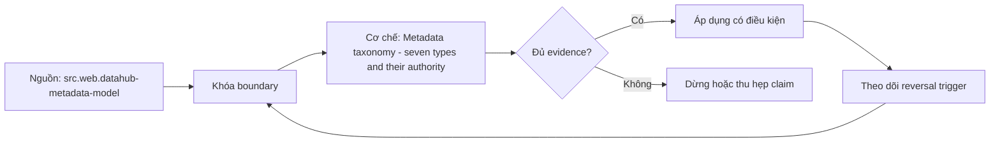

# Metadata taxonomy - seven types and their authority

> [!abstract] Câu hỏi trung tâm
> Bảy loại metadata có authority, freshness và conflict policy khác nhau như thế nào?

## 1. Technical metadata

Schema, type, location và physical properties thường đến từ platform introspection nhưng có thể stale. Đừng bắt đầu bằng tên công cụ. Hãy bắt đầu bằng đối tượng được bảo vệ, boundary quan sát được và hậu quả nếu kết luận sai. Trong bài `Metadata taxonomy - seven types and their authority`, câu hỏi thực dụng là: Bảy loại metadata có authority, freshness và conflict policy khác nhau như thế nào? Ta ghi rõ grain, population, time window, owner và hành động sau failure; nếu một trường chưa biết thì đánh dấu unknown thay vì lấp bằng mặc định. Bằng chứng tối thiểu gồm fixture có version, cấu hình hoặc rule đã resolve, raw observation, expected result và limitation. Phần này là curriculum synthesis dựa trên các nguồn đã định danh, không phải lời hứa rằng mọi adapter hay deployment đều có cùng hành vi.

## 2. Operational metadata

Runs, freshness, volume, usage và failures là observations theo time window, không phải thuộc tính vĩnh viễn. Điểm khó không nằm ở cú pháp mà ở identity và scope. Hai phép đo cùng tên vẫn có thể nói về hai population hoặc hai thời điểm khác nhau. Trong bài `Metadata taxonomy - seven types and their authority`, câu hỏi thực dụng là: Bảy loại metadata có authority, freshness và conflict policy khác nhau như thế nào? Ta ghi rõ grain, population, time window, owner và hành động sau failure; nếu một trường chưa biết thì đánh dấu unknown thay vì lấp bằng mặc định. Bằng chứng tối thiểu gồm fixture có version, cấu hình hoặc rule đã resolve, raw observation, expected result và limitation. Phần này là curriculum synthesis dựa trên các nguồn đã định danh, không phải lời hứa rằng mọi adapter hay deployment đều có cùng hành vi.

## 3. Business metadata

Definitions, grain, approved terms và policy cần accountable human authority và effective dates. Một dashboard xanh chỉ là tín hiệu. Muốn biến nó thành bằng chứng phải giữ input, phiên bản, rule, trạng thái trước-sau và cách tính độc lập. Trong bài `Metadata taxonomy - seven types and their authority`, câu hỏi thực dụng là: Bảy loại metadata có authority, freshness và conflict policy khác nhau như thế nào? Ta ghi rõ grain, population, time window, owner và hành động sau failure; nếu một trường chưa biết thì đánh dấu unknown thay vì lấp bằng mặc định. Bằng chứng tối thiểu gồm fixture có version, cấu hình hoặc rule đã resolve, raw observation, expected result và limitation. Phần này là curriculum synthesis dựa trên các nguồn đã định danh, không phải lời hứa rằng mọi adapter hay deployment đều có cùng hành vi.

## 4. Ownership and stewardship

Owner, steward, support channel và escalation là governed assignments, không suy từ người commit gần nhất. Thiết kế tốt phải chịu được counterexample. Hãy chủ động tạo case sát boundary, case thiếu dữ liệu và case replay thay vì chỉ chạy happy path. Trong bài `Metadata taxonomy - seven types and their authority`, câu hỏi thực dụng là: Bảy loại metadata có authority, freshness và conflict policy khác nhau như thế nào? Ta ghi rõ grain, population, time window, owner và hành động sau failure; nếu một trường chưa biết thì đánh dấu unknown thay vì lấp bằng mặc định. Bằng chứng tối thiểu gồm fixture có version, cấu hình hoặc rule đã resolve, raw observation, expected result và limitation. Phần này là curriculum synthesis dựa trên các nguồn đã định danh, không phải lời hứa rằng mọi adapter hay deployment đều có cùng hành vi.

## 5. Quality and lineage

Assertions/results cùng dependency edges cần method, run/version và confidence để không biến inference thành fact. Chi phí vận hành thuộc contract. Một rule đúng nhưng quá đắt, quá ồn hoặc không có owner sẽ nhanh chóng bị tắt và mất tác dụng. Trong bài `Metadata taxonomy - seven types and their authority`, câu hỏi thực dụng là: Bảy loại metadata có authority, freshness và conflict policy khác nhau như thế nào? Ta ghi rõ grain, population, time window, owner và hành động sau failure; nếu một trường chưa biết thì đánh dấu unknown thay vì lấp bằng mặc định. Bằng chứng tối thiểu gồm fixture có version, cấu hình hoặc rule đã resolve, raw observation, expected result và limitation. Phần này là curriculum synthesis dựa trên các nguồn đã định danh, không phải lời hứa rằng mọi adapter hay deployment đều có cùng hành vi.

## 6. Security and lifecycle

Classification, access policy, retention, status và deletion authority có thể cao hơn connector observation. Kết luận cần có điều kiện đảo chiều. Khi volume, latency, nguồn thẩm quyền hoặc topology đổi, quyết định cũ phải được xem xét lại bằng cùng một oracle. Trong bài `Metadata taxonomy - seven types and their authority`, câu hỏi thực dụng là: Bảy loại metadata có authority, freshness và conflict policy khác nhau như thế nào? Ta ghi rõ grain, population, time window, owner và hành động sau failure; nếu một trường chưa biết thì đánh dấu unknown thay vì lấp bằng mặc định. Bằng chứng tối thiểu gồm fixture có version, cấu hình hoặc rule đã resolve, raw observation, expected result và limitation. Phần này là curriculum synthesis dựa trên các nguồn đã định danh, không phải lời hứa rằng mọi adapter hay deployment đều có cùng hành vi.

## 7. Ma trận kiểm chứng từng mệnh đề

Với `wiki.metadata.taxonomy-authority`, command thành công không tự chứng minh dữ liệu đúng. Protocol riêng của bài là: Dựng fixture có identity và version rõ, inject defect/lifecycle event rồi so canonical graph hoặc recovery state với expected manifest. Mỗi probe dưới đây phải nối input boundary với failure signal và oracle có thể phản bác kết luận.

### 7.1. Metadata taxonomy - seven types and their authority: kiểm `Technical metadata` bằng case 1, cụ thể schema, type, location và physical properties thường đến từ platform introspection nhưng có thể stale

**Mệnh đề cần kiểm.** Metadata taxonomy - seven types and their authority: kiểm `Technical metadata` bằng case 1, cụ thể schema, type, location và physical properties thường đến từ platform introspection nhưng có thể stale.

**Thiết kế phép thử cho `wiki.metadata.taxonomy-authority`.** Trong ngữ cảnh `wiki.metadata.taxonomy-authority`, tạo positive control và negative control chỉ khác đúng một điều kiện. Khóa input snapshot, phiên bản và owner của rule; chạy đúng population được bài `Metadata taxonomy - seven types and their authority` công bố.

**Bằng chứng cần giữ.** Đối với probe 1 của `Metadata taxonomy - seven types and their authority`, giữ fixture, raw failing rows và lệnh tái hiện. Nếu chưa chạy lab, ghi expected evidence và giữ trạng thái review; không biến protocol thành observation.

### 7.2. Metadata taxonomy - seven types and their authority: kiểm `Operational metadata` bằng case 2, cụ thể runs, freshness, volume, usage và failures là observations theo time window, không phải thuộc tính vĩnh viễn

**Mệnh đề cần kiểm.** Metadata taxonomy - seven types and their authority: kiểm `Operational metadata` bằng case 2, cụ thể runs, freshness, volume, usage và failures là observations theo time window, không phải thuộc tính vĩnh viễn.

**Thiết kế phép thử cho `wiki.metadata.taxonomy-authority`.** Trong ngữ cảnh `wiki.metadata.taxonomy-authority`, đổi grain nhưng giữ tổng số dòng để lộ phép đo sai cấp. Khóa input snapshot, phiên bản và owner của rule; chạy đúng population được bài `Metadata taxonomy - seven types and their authority` công bố.

**Bằng chứng cần giữ.** Đối với probe 2 của `Metadata taxonomy - seven types and their authority`, báo numerator, denominator và key set ở cả hai grain. Nếu chưa chạy lab, ghi expected evidence và giữ trạng thái review; không biến protocol thành observation.

### 7.3. Metadata taxonomy - seven types and their authority: kiểm `Business metadata` bằng case 3, cụ thể definitions, grain, approved terms và policy cần accountable human authority và effective dates

**Mệnh đề cần kiểm.** Metadata taxonomy - seven types and their authority: kiểm `Business metadata` bằng case 3, cụ thể definitions, grain, approved terms và policy cần accountable human authority và effective dates.

**Thiết kế phép thử cho `wiki.metadata.taxonomy-authority`.** Trong ngữ cảnh `wiki.metadata.taxonomy-authority`, đưa một giá trị tới đúng boundary và một giá trị vượt boundary. Khóa input snapshot, phiên bản và owner của rule; chạy đúng population được bài `Metadata taxonomy - seven types and their authority` công bố.

**Bằng chứng cần giữ.** Đối với probe 3 của `Metadata taxonomy - seven types and their authority`, lưu hai observed values cùng rule đã resolve. Nếu chưa chạy lab, ghi expected evidence và giữ trạng thái review; không biến protocol thành observation.

### 7.4. Metadata taxonomy - seven types and their authority: kiểm `Ownership and stewardship` bằng case 4, cụ thể owner, steward, support channel và escalation là governed assignments, không suy từ người commit gần nhất

**Mệnh đề cần kiểm.** Metadata taxonomy - seven types and their authority: kiểm `Ownership and stewardship` bằng case 4, cụ thể owner, steward, support channel và escalation là governed assignments, không suy từ người commit gần nhất.

**Thiết kế phép thử cho `wiki.metadata.taxonomy-authority`.** Trong ngữ cảnh `wiki.metadata.taxonomy-authority`, kill tiến trình ngay trước rồi ngay sau durable side effect. Khóa input snapshot, phiên bản và owner của rule; chạy đúng population được bài `Metadata taxonomy - seven types and their authority` công bố.

**Bằng chứng cần giữ.** Đối với probe 4 của `Metadata taxonomy - seven types and their authority`, lưu checkpoint, external ledger và trạng thái sau restart. Nếu chưa chạy lab, ghi expected evidence và giữ trạng thái review; không biến protocol thành observation.

### 7.5. Metadata taxonomy - seven types and their authority: kiểm `Quality and lineage` bằng case 5, cụ thể assertions/results cùng dependency edges cần method, run/version và confidence để không biến inference thành fact

**Mệnh đề cần kiểm.** Metadata taxonomy - seven types and their authority: kiểm `Quality and lineage` bằng case 5, cụ thể assertions/results cùng dependency edges cần method, run/version và confidence để không biến inference thành fact.

**Thiết kế phép thử cho `wiki.metadata.taxonomy-authority`.** Trong ngữ cảnh `wiki.metadata.taxonomy-authority`, đảo thứ tự input và concurrency nhưng giữ logical population. Khóa input snapshot, phiên bản và owner của rule; chạy đúng population được bài `Metadata taxonomy - seven types and their authority` công bố.

**Bằng chứng cần giữ.** Đối với probe 5 của `Metadata taxonomy - seven types and their authority`, so canonical hash và business totals giữa các thứ tự. Nếu chưa chạy lab, ghi expected evidence và giữ trạng thái review; không biến protocol thành observation.

### 7.6. Metadata taxonomy - seven types and their authority: kiểm `Security and lifecycle` bằng case 6, cụ thể classification, access policy, retention, status và deletion authority có thể cao hơn connector observation

**Mệnh đề cần kiểm.** Metadata taxonomy - seven types and their authority: kiểm `Security and lifecycle` bằng case 6, cụ thể classification, access policy, retention, status và deletion authority có thể cao hơn connector observation.

**Thiết kế phép thử cho `wiki.metadata.taxonomy-authority`.** Trong ngữ cảnh `wiki.metadata.taxonomy-authority`, replay cùng identity với payload giống rồi payload xung đột. Khóa input snapshot, phiên bản và owner của rule; chạy đúng population được bài `Metadata taxonomy - seven types and their authority` công bố.

**Bằng chứng cần giữ.** Đối với probe 6 của `Metadata taxonomy - seven types and their authority`, tách duplicate replay khỏi identity collision bằng reason code. Nếu chưa chạy lab, ghi expected evidence và giữ trạng thái review; không biến protocol thành observation.

### 7.7. Metadata taxonomy - seven types and their authority: kiểm `Technical metadata` bằng case 7, cụ thể schema, type, location và physical properties thường đến từ platform introspection nhưng có thể stale

**Mệnh đề cần kiểm.** Metadata taxonomy - seven types and their authority: kiểm `Technical metadata` bằng case 7, cụ thể schema, type, location và physical properties thường đến từ platform introspection nhưng có thể stale.

**Thiết kế phép thử cho `wiki.metadata.taxonomy-authority`.** Trong ngữ cảnh `wiki.metadata.taxonomy-authority`, thêm record tới trễ trong horizon và ngoài horizon. Khóa input snapshot, phiên bản và owner của rule; chạy đúng population được bài `Metadata taxonomy - seven types and their authority` công bố.

**Bằng chứng cần giữ.** Đối với probe 7 của `Metadata taxonomy - seven types and their authority`, báo accepted-late, rejected-late và oldest outstanding timestamp. Nếu chưa chạy lab, ghi expected evidence và giữ trạng thái review; không biến protocol thành observation.

### 7.8. Metadata taxonomy - seven types and their authority: kiểm `Operational metadata` bằng case 8, cụ thể runs, freshness, volume, usage và failures là observations theo time window, không phải thuộc tính vĩnh viễn

**Mệnh đề cần kiểm.** Metadata taxonomy - seven types and their authority: kiểm `Operational metadata` bằng case 8, cụ thể runs, freshness, volume, usage và failures là observations theo time window, không phải thuộc tính vĩnh viễn.

**Thiết kế phép thử cho `wiki.metadata.taxonomy-authority`.** Trong ngữ cảnh `wiki.metadata.taxonomy-authority`, đổi schema theo một cách tương thích rồi một cách phá vỡ semantics. Khóa input snapshot, phiên bản và owner của rule; chạy đúng population được bài `Metadata taxonomy - seven types and their authority` công bố.

**Bằng chứng cần giữ.** Đối với probe 8 của `Metadata taxonomy - seven types and their authority`, giữ schema diff, classification và consumer-visible result. Nếu chưa chạy lab, ghi expected evidence và giữ trạng thái review; không biến protocol thành observation.

### 7.9. Metadata taxonomy - seven types and their authority: kiểm `Business metadata` bằng case 9, cụ thể definitions, grain, approved terms và policy cần accountable human authority và effective dates

**Mệnh đề cần kiểm.** Metadata taxonomy - seven types and their authority: kiểm `Business metadata` bằng case 9, cụ thể definitions, grain, approved terms và policy cần accountable human authority và effective dates.

**Thiết kế phép thử cho `wiki.metadata.taxonomy-authority`.** Trong ngữ cảnh `wiki.metadata.taxonomy-authority`, tạo missing và duplicate bù nhau để count tổng không đổi. Khóa input snapshot, phiên bản và owner của rule; chạy đúng population được bài `Metadata taxonomy - seven types and their authority` công bố.

**Bằng chứng cần giữ.** Đối với probe 9 của `Metadata taxonomy - seven types and their authority`, so key multiset và typed hashes thay vì chỉ row count. Nếu chưa chạy lab, ghi expected evidence và giữ trạng thái review; không biến protocol thành observation.

### 7.10. Metadata taxonomy - seven types and their authority: kiểm `Ownership and stewardship` bằng case 10, cụ thể owner, steward, support channel và escalation là governed assignments, không suy từ người commit gần nhất

**Mệnh đề cần kiểm.** Metadata taxonomy - seven types and their authority: kiểm `Ownership and stewardship` bằng case 10, cụ thể owner, steward, support channel và escalation là governed assignments, không suy từ người commit gần nhất.

**Thiết kế phép thử cho `wiki.metadata.taxonomy-authority`.** Trong ngữ cảnh `wiki.metadata.taxonomy-authority`, cho reviewer tái hiện chỉ từ evidence package. Khóa input snapshot, phiên bản và owner của rule; chạy đúng population được bài `Metadata taxonomy - seven types and their authority` công bố.

**Bằng chứng cần giữ.** Đối với probe 10 của `Metadata taxonomy - seven types and their authority`, package phải đủ để người khác dựng lại decision và limitation. Nếu chưa chạy lab, ghi expected evidence và giữ trạng thái review; không biến protocol thành observation.

### 7.11. Metadata taxonomy - seven types and their authority: kiểm `Quality and lineage` bằng case 11, cụ thể assertions/results cùng dependency edges cần method, run/version và confidence để không biến inference thành fact

**Mệnh đề cần kiểm.** Metadata taxonomy - seven types and their authority: kiểm `Quality and lineage` bằng case 11, cụ thể assertions/results cùng dependency edges cần method, run/version và confidence để không biến inference thành fact.

**Thiết kế phép thử cho `wiki.metadata.taxonomy-authority`.** Trong ngữ cảnh `wiki.metadata.taxonomy-authority`, so với oracle độc lập không dùng chung query hoặc parser. Khóa input snapshot, phiên bản và owner của rule; chạy đúng population được bài `Metadata taxonomy - seven types and their authority` công bố.

**Bằng chứng cần giữ.** Đối với probe 11 của `Metadata taxonomy - seven types and their authority`, independent result phải khớp ở grain đã công bố. Nếu chưa chạy lab, ghi expected evidence và giữ trạng thái review; không biến protocol thành observation.

### 7.12. Metadata taxonomy - seven types and their authority: kiểm `Security and lifecycle` bằng case 12, cụ thể classification, access policy, retention, status và deletion authority có thể cao hơn connector observation

**Mệnh đề cần kiểm.** Metadata taxonomy - seven types and their authority: kiểm `Security and lifecycle` bằng case 12, cụ thể classification, access policy, retention, status và deletion authority có thể cao hơn connector observation.

**Thiết kế phép thử cho `wiki.metadata.taxonomy-authority`.** Trong ngữ cảnh `wiki.metadata.taxonomy-authority`, chạy scope hẹp và population đầy đủ rồi công bố phần bị loại. Khóa input snapshot, phiên bản và owner của rule; chạy đúng population được bài `Metadata taxonomy - seven types and their authority` công bố.

**Bằng chứng cần giữ.** Đối với probe 12 của `Metadata taxonomy - seven types and their authority`, coverage phải nêu rõ excluded nodes, partitions hoặc incidents. Nếu chưa chạy lab, ghi expected evidence và giữ trạng thái review; không biến protocol thành observation.

### 7.13. Metadata taxonomy - seven types and their authority: kiểm `Technical metadata` bằng case 13, cụ thể schema, type, location và physical properties thường đến từ platform introspection nhưng có thể stale

**Mệnh đề cần kiểm.** Metadata taxonomy - seven types and their authority: kiểm `Technical metadata` bằng case 13, cụ thể schema, type, location và physical properties thường đến từ platform introspection nhưng có thể stale.

**Thiết kế phép thử cho `wiki.metadata.taxonomy-authority`.** Trong ngữ cảnh `wiki.metadata.taxonomy-authority`, thử timezone, precision hoặc partition ở hai phía của ranh giới. Khóa input snapshot, phiên bản và owner của rule; chạy đúng population được bài `Metadata taxonomy - seven types and their authority` công bố.

**Bằng chứng cần giữ.** Đối với probe 13 của `Metadata taxonomy - seven types and their authority`, UTC/local interval và rounding policy phải hiện trong output. Nếu chưa chạy lab, ghi expected evidence và giữ trạng thái review; không biến protocol thành observation.

### 7.14. Metadata taxonomy - seven types and their authority: kiểm `Operational metadata` bằng case 14, cụ thể runs, freshness, volume, usage và failures là observations theo time window, không phải thuộc tính vĩnh viễn

**Mệnh đề cần kiểm.** Metadata taxonomy - seven types and their authority: kiểm `Operational metadata` bằng case 14, cụ thể runs, freshness, volume, usage và failures là observations theo time window, không phải thuộc tính vĩnh viễn.

**Thiết kế phép thử cho `wiki.metadata.taxonomy-authority`.** Trong ngữ cảnh `wiki.metadata.taxonomy-authority`, đổi constraint đủ lớn để quyết định phải đảo. Khóa input snapshot, phiên bản và owner của rule; chạy đúng population được bài `Metadata taxonomy - seven types and their authority` công bố.

**Bằng chứng cần giữ.** Đối với probe 14 của `Metadata taxonomy - seven types and their authority`, ADR phải lưu changed constraint và reversal threshold. Nếu chưa chạy lab, ghi expected evidence và giữ trạng thái review; không biến protocol thành observation.

### 7.15. Metadata taxonomy - seven types and their authority: kiểm `Business metadata` bằng case 15, cụ thể definitions, grain, approved terms và policy cần accountable human authority và effective dates

**Mệnh đề cần kiểm.** Metadata taxonomy - seven types and their authority: kiểm `Business metadata` bằng case 15, cụ thể definitions, grain, approved terms và policy cần accountable human authority và effective dates.

**Thiết kế phép thử cho `wiki.metadata.taxonomy-authority`.** Trong ngữ cảnh `wiki.metadata.taxonomy-authority`, chạy lại từ môi trường sạch với versions và seed đã khóa. Khóa input snapshot, phiên bản và owner của rule; chạy đúng population được bài `Metadata taxonomy - seven types and their authority` công bố.

**Bằng chứng cần giữ.** Đối với probe 15 của `Metadata taxonomy - seven types and their authority`, canonical result phải ổn định hoặc mọi nondeterminism phải được giải thích. Nếu chưa chạy lab, ghi expected evidence và giữ trạng thái review; không biến protocol thành observation.

## 8. Quy trình phản biện

1. Viết consumer-visible invariant cho `Metadata taxonomy - seven types and their authority` trước khi chọn query hoặc tool.
2. Khóa grain, identity, population, time window và authoritative source.
3. Phân biệt declared configuration, executed state và published state.
4. Chạy negative control, replay hoặc changed-assumption case phù hợp.
5. Đối soát bằng oracle độc lập; công bố coverage và phần không quan sát được.
6. Gắn owner, hành động, reversal trigger và hạn review cho kết luận.

## 9. Câu hỏi tự kiểm tra

1. `Metadata taxonomy - seven types and their authority: kiểm `Technical metadata` bằng case 1, cụ thể schema, type, location và physical properties thường đến từ platform introspection nhưng có thể stale` thất bại đầu tiên ở boundary nào?
2. Artifact nào mạnh nhất để trả lời `Metadata taxonomy - seven types and their authority: kiểm `Business metadata` bằng case 3, cụ thể definitions, grain, approved terms và policy cần accountable human authority và effective dates`?
3. Counterexample nhỏ nhất cho `Metadata taxonomy - seven types and their authority: kiểm `Security and lifecycle` bằng case 6, cụ thể classification, access policy, retention, status và deletion authority có thể cao hơn connector observation` gồm những state nào?
4. `Metadata taxonomy - seven types and their authority: kiểm `Business metadata` bằng case 9, cụ thể definitions, grain, approved terms và policy cần accountable human authority và effective dates` có thể xanh giả ra sao?
5. Constraint nào khiến quyết định ở `Metadata taxonomy - seven types and their authority: kiểm `Operational metadata` bằng case 14, cụ thể runs, freshness, volume, usage và failures là observations theo time window, không phải thuộc tính vĩnh viễn` phải đảo?
6. Phần nào của `Metadata taxonomy - seven types and their authority: kiểm `Business metadata` bằng case 15, cụ thể definitions, grain, approved terms và policy cần accountable human authority và effective dates` mới là protocol, chưa phải observation?

## 10. Giới hạn và điều chưa cho phép kết luận

- Lab của `Metadata taxonomy - seven types and their authority` chưa chạy trên hệ thống production; nội dung là giáo trình và expected evidence.
- Hành vi phụ thuộc phiên bản, connector, scheduler, warehouse và catalog configuration phải được kiểm lại.
- Các ma trận, ladder và threshold do giáo trình tổng hợp không được gán nguyên văn cho vendor.
- Note giữ trạng thái `review` cho tới khi owner duyệt semantics và learner artifact.

## Reference
1. [[SRC-DATAHUB-METADATA-MODEL]]

## Source coverage

| Source slice | Nội dung sử dụng | Trạng thái |
|---|---|---|
| [[SRC-DATAHUB-METADATA-MODEL]] | Contract hoặc cơ chế liên quan trực tiếp tới `Metadata taxonomy - seven types and their authority` | Đã đọc locator; cần pin version khi chạy lab |

## Key takeaways
- Metadata authority phụ thuộc type, producer, time và governance.
- Với `wiki.metadata.taxonomy-authority`, quality của kết luận phụ thuộc identity, coverage và oracle chứ không phụ thuộc màu dashboard.
- Câu hỏi `Bảy loại metadata có authority, freshness và conflict policy khác nhau như thế nào?` chỉ được trả lời trong scope và version đã ghi.
- Các source IDs `src.web.datahub-metadata-model` đặt ranh giới cho source fact; phần còn lại là synthesis có nhãn.
- Trước khi lab chạy, đây là note đã kiểm cấu trúc và provenance, chưa phải chứng nhận production.

<!-- ATOMIC-EXECUTION-CAPSULE:START -->

## Execution capsule: kiểm chứng `wiki.metadata.taxonomy-authority`

> [!important] Phân loại mệnh đề
> Với `wiki.metadata.taxonomy-authority`, sơ đồ, ví dụ và artifact về **Metadata taxonomy - seven types and their authority** là **synthesis để kiểm chứng**; chúng không phải trích dẫn hay case nguyên văn của nguồn.

### Sơ đồ cơ chế và điểm kiểm soát



Đọc sơ đồ `wiki.metadata.taxonomy-authority` từ trái sang phải: source chỉ cung cấp claim ban đầu cho **Metadata taxonomy - seven types and their authority**; quyết định chỉ được đi tiếp sau khi boundary, evidence và điều kiện đảo quyết định đã hiện hữu.

### Artifact thực thi tối thiểu

```sql
-- Verification harness for: Metadata taxonomy - seven types and their authority
WITH evidence AS (
    SELECT 'wiki.metadata.taxonomy-authority' AS concept_id,
           'boundary_declared' AS check_name, 1 AS passed
    UNION ALL
    SELECT 'wiki.metadata.taxonomy-authority', 'independent_oracle', 1
    UNION ALL
    SELECT 'wiki.metadata.taxonomy-authority', 'reversal_trigger_recorded', 1
)
SELECT concept_id,
       MIN(passed) AS all_hard_checks_pass,
       COUNT(*) AS evidence_items
FROM evidence
GROUP BY concept_id
HAVING MIN(passed) = 1;
```

Artifact của `wiki.metadata.taxonomy-authority` buộc người dùng ghi boundary, oracle và reversal trigger cho **Metadata taxonomy - seven types and their authority**. Các giá trị minh họa phải được thay bằng evidence thật trước khi dùng cho quyết định.

### Tự kiểm tra trước khi tái sử dụng

1. Bạn có thể trả lời `Bảy loại metadata có authority, freshness và conflict policy khác nhau như thế nào?` bằng một câu mà không kéo thêm concept thứ hai không?
2. Source locator nào đỡ cho claim, và phần nào chỉ là synthesis trong note?
3. Observation nào khiến bạn dừng, thu hẹp hoặc đảo quyết định?
4. Artifact nào cho phép một reviewer độc lập tái hiện kết quả?

<!-- ATOMIC-EXECUTION-CAPSULE:END -->
