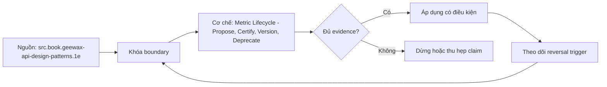

# Metric Lifecycle - Propose, Certify, Version, Deprecate

> [!abstract] Câu hỏi trung tâm
> Metric đi qua propose–review–certify–deprecate–remove bằng gates nào, và breaking semantic change được di trú mà không đổi nghĩa lịch sử ra sao?

## 1. State machine thay cho nhãn trang trí

Năm trạng thái cần entry criteria, allowed actions, transitions, owner và evidence. Proposed cho phép thiết kế nhưng chưa quảng bá; review chạy contract/static/correctness; certified có version và evidence; deprecated vẫn phục vụ trong window có cảnh báo; removed không còn resolve/query. Transition là event audit được, không sửa text field tùy ý. Rollback đưa về trạng thái trước với lý do; expired evidence có thể suspend certification mà không đồng nhất với deprecation.

## 2. Certification bundle

Gate chứng nhận gồm contract sáu phần, owner, grain/path proof, compatibility matrix, independent reconciliation, security tests và serving SLO theo scope. Evidence gắn exact metric version, semantic graph, mart/source snapshot, tool version và reviewer. “Dashboard được đồng thuận” chỉ là consumer acceptance, không thay correctness oracle. Nếu dependency thay, certificate có invalidation rule thay vì sống mãi.

## 3. Ba lớp thay đổi

Non-result change gồm documentation, owner hoặc performance rewrite đã parity; semantic-result change giữ interface nhưng population/formula/time làm numbers đổi; breaking compatibility làm clients không còn gọi/diễn giải được như cũ. Lớp hai nguy hiểm vì request vẫn thành công và số có vẻ hợp lý. Classification dựa observable consumer contract, không dựa số dòng diff. Mỗi change có impact set, expected deltas, communication và required approvals.

## 4. Không sửa đè công thức

In-place overwrite làm cùng metric ID/version trỏ tới hai meanings theo thời gian; historical dashboards không thể biết số đã tính bằng contract nào, cache/audit cũng mất traceability. Semantic-result hoặc breaking change cần immutable new version hoặc effective-dated definition có explicit as-of semantics. Alias “current” có thể chuyển sau migration, nhưng saved artifacts phải resolve pinned version hoặc lưu definition fingerprint.

## 5. Parallel run và reconciliation

Version cũ và mới chạy trên cùng immutable data window và consumer-representative grains. Difference report ghi absolute/relative deltas, changed population, affected consumers và cases explained/unexplained. Chạy ít nhất một business cycle chỉ có nghĩa khi cycle bao phủ late data, fiscal boundary hoặc seasonality liên quan. Consumer approval xác nhận readiness/meaning, không biến unexplained discrepancy thành đúng. Cutover gate yêu cầu zero unresolved critical deltas.

## 6. Deprecation record

Record gồm old/new IDs, rationale, owners, affected consumers, first notice, migration guide, parallel evidence, approvals, deadline, telemetry window, exception list và removal proof. Usage telemetry cần phân biệt service accounts, scheduled reports, human queries và offline exports. Zero observed usage không chứng minh zero dependency nếu logging thiếu; inventory và owner attestation bổ sung. Removal có rollback window hoặc restorable artifact theo risk.

## 7. Lab ba metrics

Metric A đi propose→certified; B thiếu reconciliation nên bị gate chặn; C thực hiện semantic-result notification và breaking v2 migration. Seed same data, chạy v1/v2, lập delta matrix, lấy simulated consumer acceptance và deprecation record. Một hidden consumer hoặc scheduled report được cài để test removal gate. Done when không còn active consumer có bằng chứng và old version removal vẫn truy được audit lineage.

## 8. Ma trận kiểm chứng từng mệnh đề

Mỗi mệnh đề dưới đây cần observation, fixture hoặc artifact có thể lưu. Tên công nghệ, consensus hoặc output nhìn hợp lý không tự là bằng chứng.

### 8.1. state cần entry exit criteria

**Mệnh đề cần kiểm.** state cần entry exit criteria.

**Cách kiểm.** Chạy state-transition fixtures, one missing-evidence certification, semantic-result change và breaking v2 parallel run. Lưu delta matrix, notices, approvals, usage inventory và deprecation record. Với riêng mệnh đề này, ghi input/context, expected observation, failure signal và boundary làm kết luận không còn đúng.

**Bằng chứng đạt cho `wiki.semantic-layer.metric-lifecycle`.** Lưu contract/decision version, fixture hoặc interview evidence, command/checklist output, reviewer và artifact hash. Nếu chưa thực hiện lab, trạng thái chỉ là protocol; không ghi thành kết quả đã quan sát.

### 8.2. transition phải audit được

**Mệnh đề cần kiểm.** transition phải audit được.

**Cách kiểm.** Chạy state-transition fixtures, one missing-evidence certification, semantic-result change và breaking v2 parallel run. Lưu delta matrix, notices, approvals, usage inventory và deprecation record. Với riêng mệnh đề này, ghi input/context, expected observation, failure signal và boundary làm kết luận không còn đúng.

**Bằng chứng đạt cho `wiki.semantic-layer.metric-lifecycle`.** Lưu contract/decision version, fixture hoặc interview evidence, command/checklist output, reviewer và artifact hash. Nếu chưa thực hiện lab, trạng thái chỉ là protocol; không ghi thành kết quả đã quan sát.

### 8.3. certification gắn exact version

**Mệnh đề cần kiểm.** certification gắn exact version.

**Cách kiểm.** Chạy state-transition fixtures, one missing-evidence certification, semantic-result change và breaking v2 parallel run. Lưu delta matrix, notices, approvals, usage inventory và deprecation record. Với riêng mệnh đề này, ghi input/context, expected observation, failure signal và boundary làm kết luận không còn đúng.

**Bằng chứng đạt cho `wiki.semantic-layer.metric-lifecycle`.** Lưu contract/decision version, fixture hoặc interview evidence, command/checklist output, reviewer và artifact hash. Nếu chưa thực hiện lab, trạng thái chỉ là protocol; không ghi thành kết quả đã quan sát.

### 8.4. dashboard consensus không thay oracle

**Mệnh đề cần kiểm.** dashboard consensus không thay oracle.

**Cách kiểm.** Chạy state-transition fixtures, one missing-evidence certification, semantic-result change và breaking v2 parallel run. Lưu delta matrix, notices, approvals, usage inventory và deprecation record. Với riêng mệnh đề này, ghi input/context, expected observation, failure signal và boundary làm kết luận không còn đúng.

**Bằng chứng đạt cho `wiki.semantic-layer.metric-lifecycle`.** Lưu contract/decision version, fixture hoặc interview evidence, command/checklist output, reviewer và artifact hash. Nếu chưa thực hiện lab, trạng thái chỉ là protocol; không ghi thành kết quả đã quan sát.

### 8.5. evidence cần invalidation trigger

**Mệnh đề cần kiểm.** evidence cần invalidation trigger.

**Cách kiểm.** Chạy state-transition fixtures, one missing-evidence certification, semantic-result change và breaking v2 parallel run. Lưu delta matrix, notices, approvals, usage inventory và deprecation record. Với riêng mệnh đề này, ghi input/context, expected observation, failure signal và boundary làm kết luận không còn đúng.

**Bằng chứng đạt cho `wiki.semantic-layer.metric-lifecycle`.** Lưu contract/decision version, fixture hoặc interview evidence, command/checklist output, reviewer và artifact hash. Nếu chưa thực hiện lab, trạng thái chỉ là protocol; không ghi thành kết quả đã quan sát.

### 8.6. semantic-result change khác breaking interface

**Mệnh đề cần kiểm.** semantic-result change khác breaking interface.

**Cách kiểm.** Chạy state-transition fixtures, one missing-evidence certification, semantic-result change và breaking v2 parallel run. Lưu delta matrix, notices, approvals, usage inventory và deprecation record. Với riêng mệnh đề này, ghi input/context, expected observation, failure signal và boundary làm kết luận không còn đúng.

**Bằng chứng đạt cho `wiki.semantic-layer.metric-lifecycle`.** Lưu contract/decision version, fixture hoặc interview evidence, command/checklist output, reviewer và artifact hash. Nếu chưa thực hiện lab, trạng thái chỉ là protocol; không ghi thành kết quả đã quan sát.

### 8.7. silent number change cần notification

**Mệnh đề cần kiểm.** silent number change cần notification.

**Cách kiểm.** Chạy state-transition fixtures, one missing-evidence certification, semantic-result change và breaking v2 parallel run. Lưu delta matrix, notices, approvals, usage inventory và deprecation record. Với riêng mệnh đề này, ghi input/context, expected observation, failure signal và boundary làm kết luận không còn đúng.

**Bằng chứng đạt cho `wiki.semantic-layer.metric-lifecycle`.** Lưu contract/decision version, fixture hoặc interview evidence, command/checklist output, reviewer và artifact hash. Nếu chưa thực hiện lab, trạng thái chỉ là protocol; không ghi thành kết quả đã quan sát.

### 8.8. classification dựa consumer observation

**Mệnh đề cần kiểm.** classification dựa consumer observation.

**Cách kiểm.** Chạy state-transition fixtures, one missing-evidence certification, semantic-result change và breaking v2 parallel run. Lưu delta matrix, notices, approvals, usage inventory và deprecation record. Với riêng mệnh đề này, ghi input/context, expected observation, failure signal và boundary làm kết luận không còn đúng.

**Bằng chứng đạt cho `wiki.semantic-layer.metric-lifecycle`.** Lưu contract/decision version, fixture hoặc interview evidence, command/checklist output, reviewer và artifact hash. Nếu chưa thực hiện lab, trạng thái chỉ là protocol; không ghi thành kết quả đã quan sát.

### 8.9. formula không được overwrite same version

**Mệnh đề cần kiểm.** formula không được overwrite same version.

**Cách kiểm.** Chạy state-transition fixtures, one missing-evidence certification, semantic-result change và breaking v2 parallel run. Lưu delta matrix, notices, approvals, usage inventory và deprecation record. Với riêng mệnh đề này, ghi input/context, expected observation, failure signal và boundary làm kết luận không còn đúng.

**Bằng chứng đạt cho `wiki.semantic-layer.metric-lifecycle`.** Lưu contract/decision version, fixture hoặc interview evidence, command/checklist output, reviewer và artifact hash. Nếu chưa thực hiện lab, trạng thái chỉ là protocol; không ghi thành kết quả đã quan sát.

### 8.10. current alias không thay pinned history

**Mệnh đề cần kiểm.** current alias không thay pinned history.

**Cách kiểm.** Chạy state-transition fixtures, one missing-evidence certification, semantic-result change và breaking v2 parallel run. Lưu delta matrix, notices, approvals, usage inventory và deprecation record. Với riêng mệnh đề này, ghi input/context, expected observation, failure signal và boundary làm kết luận không còn đúng.

**Bằng chứng đạt cho `wiki.semantic-layer.metric-lifecycle`.** Lưu contract/decision version, fixture hoặc interview evidence, command/checklist output, reviewer và artifact hash. Nếu chưa thực hiện lab, trạng thái chỉ là protocol; không ghi thành kết quả đã quan sát.

### 8.11. parallel run cần same data window

**Mệnh đề cần kiểm.** parallel run cần same data window.

**Cách kiểm.** Chạy state-transition fixtures, one missing-evidence certification, semantic-result change và breaking v2 parallel run. Lưu delta matrix, notices, approvals, usage inventory và deprecation record. Với riêng mệnh đề này, ghi input/context, expected observation, failure signal và boundary làm kết luận không còn đúng.

**Bằng chứng đạt cho `wiki.semantic-layer.metric-lifecycle`.** Lưu contract/decision version, fixture hoặc interview evidence, command/checklist output, reviewer và artifact hash. Nếu chưa thực hiện lab, trạng thái chỉ là protocol; không ghi thành kết quả đã quan sát.

### 8.12. delta report cần population and grain

**Mệnh đề cần kiểm.** delta report cần population and grain.

**Cách kiểm.** Chạy state-transition fixtures, one missing-evidence certification, semantic-result change và breaking v2 parallel run. Lưu delta matrix, notices, approvals, usage inventory và deprecation record. Với riêng mệnh đề này, ghi input/context, expected observation, failure signal và boundary làm kết luận không còn đúng.

**Bằng chứng đạt cho `wiki.semantic-layer.metric-lifecycle`.** Lưu contract/decision version, fixture hoặc interview evidence, command/checklist output, reviewer và artifact hash. Nếu chưa thực hiện lab, trạng thái chỉ là protocol; không ghi thành kết quả đã quan sát.

### 8.13. approval không hợp thức hóa unexplained delta

**Mệnh đề cần kiểm.** approval không hợp thức hóa unexplained delta.

**Cách kiểm.** Chạy state-transition fixtures, one missing-evidence certification, semantic-result change và breaking v2 parallel run. Lưu delta matrix, notices, approvals, usage inventory và deprecation record. Với riêng mệnh đề này, ghi input/context, expected observation, failure signal và boundary làm kết luận không còn đúng.

**Bằng chứng đạt cho `wiki.semantic-layer.metric-lifecycle`.** Lưu contract/decision version, fixture hoặc interview evidence, command/checklist output, reviewer và artifact hash. Nếu chưa thực hiện lab, trạng thái chỉ là protocol; không ghi thành kết quả đã quan sát.

### 8.14. usage telemetry có coverage limit

**Mệnh đề cần kiểm.** usage telemetry có coverage limit.

**Cách kiểm.** Chạy state-transition fixtures, one missing-evidence certification, semantic-result change và breaking v2 parallel run. Lưu delta matrix, notices, approvals, usage inventory và deprecation record. Với riêng mệnh đề này, ghi input/context, expected observation, failure signal và boundary làm kết luận không còn đúng.

**Bằng chứng đạt cho `wiki.semantic-layer.metric-lifecycle`.** Lưu contract/decision version, fixture hoặc interview evidence, command/checklist output, reviewer và artifact hash. Nếu chưa thực hiện lab, trạng thái chỉ là protocol; không ghi thành kết quả đã quan sát.

### 8.15. removal cần deprecation record and proof

**Mệnh đề cần kiểm.** removal cần deprecation record and proof.

**Cách kiểm.** Chạy state-transition fixtures, one missing-evidence certification, semantic-result change và breaking v2 parallel run. Lưu delta matrix, notices, approvals, usage inventory và deprecation record. Với riêng mệnh đề này, ghi input/context, expected observation, failure signal và boundary làm kết luận không còn đúng.

**Bằng chứng đạt cho `wiki.semantic-layer.metric-lifecycle`.** Lưu contract/decision version, fixture hoặc interview evidence, command/checklist output, reviewer và artifact hash. Nếu chưa thực hiện lab, trạng thái chỉ là protocol; không ghi thành kết quả đã quan sát.

## 9. Quy trình phản biện

1. Viết decision, consumer, contract và constraints trước khi chọn tool hoặc implementation.
2. Tách source fact, curriculum synthesis và organizational choice.
3. Dùng counterexample và changed constraint để kiểm quyết định có đảo đúng lúc.
4. Gắn mọi approval/certification với exact version, evidence và scope.
5. Kiểm cả valid path lẫn negative/failure path; không chỉ demo happy path.
6. Ghi limitation của telemetry, test environment và source authority.
7. Chưa có execution evidence thì giữ trạng thái `review`.

## 10. Câu hỏi tự kiểm tra

1. Decision hoặc invariant nào đang được bảo vệ?
2. Evidence nào độc lập với implementation đang được đánh giá?
3. Điều kiện nào làm lựa chọn hiện tại phải đảo?
4. Ai có quyền quyết nghĩa, ai triển khai và ai giữ quy trình?
5. Thay đổi nào ảnh hưởng consumer dù interface vẫn chạy?
6. Failure mode nào còn chưa có automated detector?

## 11. Giới hạn và điều chưa cho phép kết luận

- Chưa chạy các lab, migration, workload benchmark hoặc fault-injection; note mô tả protocol và expected evidence.
- Tài liệu sản phẩm web được kiểm ngày 2026-10-02; feature, syntax, license và integration có thể đổi.
- Các scorecard, lifecycle gates, failure matrix và decision contract là curriculum synthesis từ nguồn đã nêu; không gán nguyên văn cho một tác giả.
- Ví dụ tổ chức không thay discovery thực tế, threat model, cost model hoặc owner approval.
- Note giữ trạng thái `review` cho tới khi chủ dự án duyệt semantic meaning.

## Reference
1. [[SRC-GEEWAX-API-DESIGN-PATTERNS-1E]]
2. [[SRC-SOMMERVILLE-SOFTWARE-ENGINEERING-10E]]
3. [[SRC-DBT-SEMANTIC-MODELS]]

## Source coverage

| Source slice | Nội dung sử dụng | Trạng thái |
|---|---|---|
| [[SRC-GEEWAX-API-DESIGN-PATTERNS-1E]] | Khái niệm, cơ chế hoặc decision boundary liên quan | Đã đọc locator được ghi trong source record; không suy ngoài phạm vi |
| [[SRC-SOMMERVILLE-SOFTWARE-ENGINEERING-10E]] | Khái niệm, cơ chế hoặc decision boundary liên quan | Đã đọc locator được ghi trong source record; không suy ngoài phạm vi |
| [[SRC-DBT-SEMANTIC-MODELS]] | Khái niệm, cơ chế hoặc decision boundary liên quan | Đã đọc locator được ghi trong source record; không suy ngoài phạm vi |

## Key takeaways
- Chọn kiến trúc và data product từ decision/constraints, không từ độ mới của công nghệ.
- Metric governance cần versioned evidence, lifecycle gates và owner có quyền rõ.
- Failure matrix chỉ hữu dụng khi mỗi dòng có detector hoặc control kiểm được.
- Capstone là hồ sơ bằng chứng tích hợp, không phải bộ YAML hay dashboard trình diễn.
- Discovery phải cho phép kết luận không xây analytics product.

<!-- ATOMIC-EXECUTION-CAPSULE:START -->

## Execution capsule — kiểm chứng `wiki.semantic-layer.metric-lifecycle`

> [!important] Phân loại mệnh đề
> Với `wiki.semantic-layer.metric-lifecycle`, sơ đồ, ví dụ và artifact về **Metric Lifecycle - Propose, Certify, Version, Deprecate** là **synthesis để kiểm chứng**; chúng không phải trích dẫn hay case nguyên văn của nguồn.

### Sơ đồ cơ chế và điểm kiểm soát



Đọc sơ đồ `wiki.semantic-layer.metric-lifecycle` từ trái sang phải: source chỉ cung cấp claim ban đầu cho **Metric Lifecycle - Propose, Certify, Version, Deprecate**; quyết định chỉ được đi tiếp sau khi boundary, evidence và điều kiện đảo quyết định đã hiện hữu.

### Artifact thực thi tối thiểu

```sql
-- Verification harness for: Metric Lifecycle - Propose, Certify, Version, Deprecate
WITH evidence AS (
    SELECT 'wiki.semantic-layer.metric-lifecycle' AS concept_id,
           'boundary_declared' AS check_name, 1 AS passed
    UNION ALL
    SELECT 'wiki.semantic-layer.metric-lifecycle', 'independent_oracle', 1
    UNION ALL
    SELECT 'wiki.semantic-layer.metric-lifecycle', 'reversal_trigger_recorded', 1
)
SELECT concept_id,
       MIN(passed) AS all_hard_checks_pass,
       COUNT(*) AS evidence_items
FROM evidence
GROUP BY concept_id
HAVING MIN(passed) = 1;
```

Artifact của `wiki.semantic-layer.metric-lifecycle` buộc người dùng ghi boundary, oracle và reversal trigger cho **Metric Lifecycle - Propose, Certify, Version, Deprecate**. Các giá trị minh họa phải được thay bằng evidence thật trước khi dùng cho quyết định.

### Tự kiểm tra trước khi tái sử dụng

1. Bạn có thể trả lời `Metric đi qua propose–review–certify–deprecate–remove bằng gates nào, và breaking semantic change được di trú mà không đổi nghĩa lịch sử ra sao?` bằng một câu mà không kéo thêm concept thứ hai không?
2. Source locator nào đỡ cho claim, và phần nào chỉ là synthesis trong note?
3. Observation nào khiến bạn dừng, thu hẹp hoặc đảo quyết định?
4. Artifact nào cho phép một reviewer độc lập tái hiện kết quả?

<!-- ATOMIC-EXECUTION-CAPSULE:END -->
