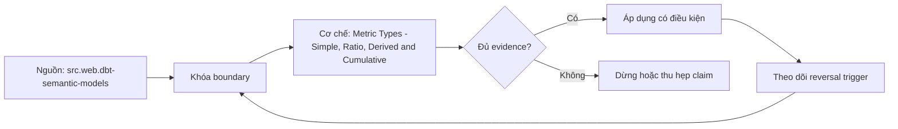

# Metric Types - Simple, Ratio, Derived and Cumulative

> [!abstract] Câu hỏi trung tâm
> Bốn loại metric khác nhau ở dependency, aggregation và time behavior nào, và phép kiểm nào phát hiện một implementation trông hợp lý nhưng sai khi roll up?

## 1. Simple metric

Simple metric áp một aggregation lên base expression ở declared grain: sum revenue, count orders, count-distinct customers, average duration. “Simple” chỉ nói dependency trực tiếp, không nói dễ gộp. `sum` của additive amount có thể roll up; average cần count/weight; count-distinct phải recompute/merge set or sketch; percentile không roll up từ percentile con. Contract vẫn cần population, time và dimensions được phép.

## 2. Ratio metric

Ratio có numerator và denominator là hai metrics có compatible population, time grain, dimensions, unit và filter scope. Tính đúng là aggregate numerator và denominator ở requested grain rồi divide. Lưu row-level ratio hoặc average các group ratios cho sai khi denominators khác nhau. Division by zero, negative denominator, null, rounding và display percentage phải là policy. Test tối thiểu dùng hai nhóm có kích thước rất lệch để lỗi average-of-ratios lộ rõ.

## 3. Derived metric

Derived metric là expression trên metrics khác: profit = revenue - cost; attainment = actual / target; year-over-year change = current/prior - 1. Nó kế thừa dependency, availability dimensions, time constraints, units và uncertainty của inputs. Hai input khác currency, population hoặc grain không tự compatible chỉ vì arithmetic chạy. Derived graph phải acyclic ở dependency level hoặc có cơ chế phát hiện cycle; rename/deprecation input cần impact analysis.

## 4. Cumulative metric

Cumulative metric tích lũy input metric theo all-time, rolling window hoặc grain-to-date. Nó cần continuous time spine để kỳ không event vẫn tồn tại, clear window boundary, inclusive/exclusive rules, timezone và late-data policy. Running sum trên rows chỉ đúng nếu rows đã là dense period grain và không duplicate. Khi query ở grain khác default, cần re-aggregation policy như first/last/average tùy meaning; không sum các cumulative values.

## 5. Phân loại theo computation graph

Hãy hỏi metric đọc trực tiếp base expression, chia hai metrics, kết hợp metrics hay thay đổi frame thời gian của một metric. Một metric có thể trông thuộc nhiều loại: rolling conversion rate là cumulative behavior áp lên ratio components; nên compute numerator/denominator trong windows rồi divide, không roll average conversion rates. Taxonomy là công cụ kiểm dependency và aggregation, không phải nhãn marketing.

## 6. Đối chứng ba mức gộp

Tạo atomic dataset với hai stores, nhiều products và ba months; denominators lệch mạnh, có tháng rỗng. Tính ground truth từ rows tại store-product-month, rồi aggregate lên store-month, region-month và all-period. So implementation đúng với stored ratio/average ratio. Lưu absolute delta, relative delta và groups gây lỗi. Nếu hai cách vô tình bằng nhau trên balanced sample, fixture chưa đủ phân biệt.

## 7. Ranh giới phiên bản và loại ngoài phạm vi

Tài liệu dbt hiện hành còn có conversion metric bên cạnh bốn loại trong roadmap. Bài này không phủ conversion-event matching, entity window và attribution. Cú pháp current/legacy khác nhau; note tập trung semantics chung. Không suy một engine hỗ trợ type name là nó tự đảm bảo population, identity, time hoặc business ownership đúng.

## 8. Ma trận kiểm chứng từng mệnh đề

Các mệnh đề dưới đây phải được kiểm bằng fixture, invariant và output có thể chạy lại. Việc công cụ compile được YAML hoặc sinh SQL không tự chứng minh metric đúng nghĩa.

### 8.1. simple metric vẫn có thể non-additive

**Mệnh đề cần kiểm.** simple metric vẫn có thể non-additive.

**Cách kiểm.** Tạo fixture denominators lệch và periods rỗng; tính atomic oracle rồi roll up ba grains. So simple, ratio, derived và cumulative implementations, dependency graph, window boundary và current-version compilation. Với mệnh đề này, ghi rõ dữ liệu phản ví dụ, expected result và failure signal. Tách validation cấu trúc khỏi xác nhận meaning của owner.

**Bằng chứng đạt cho `wiki.semantic-layer.metric-types`.** Lưu contract/graph, snapshot, query hoặc compiled SQL, output thô, semantic diff và assumptions. Chỉ đánh dấu đạt khi cùng artifact cho kết quả lặp lại ở cùng version/cutoff; nếu chưa chạy, đây là test protocol chứ chưa phải kết quả production.

### 8.2. ratio phải giữ numerator denominator riêng

**Mệnh đề cần kiểm.** ratio phải giữ numerator denominator riêng.

**Cách kiểm.** Tạo fixture denominators lệch và periods rỗng; tính atomic oracle rồi roll up ba grains. So simple, ratio, derived và cumulative implementations, dependency graph, window boundary và current-version compilation. Với mệnh đề này, ghi rõ dữ liệu phản ví dụ, expected result và failure signal. Tách validation cấu trúc khỏi xác nhận meaning của owner.

**Bằng chứng đạt cho `wiki.semantic-layer.metric-types`.** Lưu contract/graph, snapshot, query hoặc compiled SQL, output thô, semantic diff và assumptions. Chỉ đánh dấu đạt khi cùng artifact cho kết quả lặp lại ở cùng version/cutoff; nếu chưa chạy, đây là test protocol chứ chưa phải kết quả production.

### 8.3. average of ratios sai khi weights khác

**Mệnh đề cần kiểm.** average of ratios sai khi weights khác.

**Cách kiểm.** Tạo fixture denominators lệch và periods rỗng; tính atomic oracle rồi roll up ba grains. So simple, ratio, derived và cumulative implementations, dependency graph, window boundary và current-version compilation. Với mệnh đề này, ghi rõ dữ liệu phản ví dụ, expected result và failure signal. Tách validation cấu trúc khỏi xác nhận meaning của owner.

**Bằng chứng đạt cho `wiki.semantic-layer.metric-types`.** Lưu contract/graph, snapshot, query hoặc compiled SQL, output thô, semantic diff và assumptions. Chỉ đánh dấu đạt khi cùng artifact cho kết quả lặp lại ở cùng version/cutoff; nếu chưa chạy, đây là test protocol chứ chưa phải kết quả production.

### 8.4. division by zero cần policy

**Mệnh đề cần kiểm.** division by zero cần policy.

**Cách kiểm.** Tạo fixture denominators lệch và periods rỗng; tính atomic oracle rồi roll up ba grains. So simple, ratio, derived và cumulative implementations, dependency graph, window boundary và current-version compilation. Với mệnh đề này, ghi rõ dữ liệu phản ví dụ, expected result và failure signal. Tách validation cấu trúc khỏi xác nhận meaning của owner.

**Bằng chứng đạt cho `wiki.semantic-layer.metric-types`.** Lưu contract/graph, snapshot, query hoặc compiled SQL, output thô, semantic diff và assumptions. Chỉ đánh dấu đạt khi cùng artifact cho kết quả lặp lại ở cùng version/cutoff; nếu chưa chạy, đây là test protocol chứ chưa phải kết quả production.

### 8.5. derived metric kế thừa constraints của inputs

**Mệnh đề cần kiểm.** derived metric kế thừa constraints của inputs.

**Cách kiểm.** Tạo fixture denominators lệch và periods rỗng; tính atomic oracle rồi roll up ba grains. So simple, ratio, derived và cumulative implementations, dependency graph, window boundary và current-version compilation. Với mệnh đề này, ghi rõ dữ liệu phản ví dụ, expected result và failure signal. Tách validation cấu trúc khỏi xác nhận meaning của owner.

**Bằng chứng đạt cho `wiki.semantic-layer.metric-types`.** Lưu contract/graph, snapshot, query hoặc compiled SQL, output thô, semantic diff và assumptions. Chỉ đánh dấu đạt khi cùng artifact cho kết quả lặp lại ở cùng version/cutoff; nếu chưa chạy, đây là test protocol chứ chưa phải kết quả production.

### 8.6. unit mismatch làm expression vô nghĩa

**Mệnh đề cần kiểm.** unit mismatch làm expression vô nghĩa.

**Cách kiểm.** Tạo fixture denominators lệch và periods rỗng; tính atomic oracle rồi roll up ba grains. So simple, ratio, derived và cumulative implementations, dependency graph, window boundary và current-version compilation. Với mệnh đề này, ghi rõ dữ liệu phản ví dụ, expected result và failure signal. Tách validation cấu trúc khỏi xác nhận meaning của owner.

**Bằng chứng đạt cho `wiki.semantic-layer.metric-types`.** Lưu contract/graph, snapshot, query hoặc compiled SQL, output thô, semantic diff và assumptions. Chỉ đánh dấu đạt khi cùng artifact cho kết quả lặp lại ở cùng version/cutoff; nếu chưa chạy, đây là test protocol chứ chưa phải kết quả production.

### 8.7. dependency cycle phải bị phát hiện

**Mệnh đề cần kiểm.** dependency cycle phải bị phát hiện.

**Cách kiểm.** Tạo fixture denominators lệch và periods rỗng; tính atomic oracle rồi roll up ba grains. So simple, ratio, derived và cumulative implementations, dependency graph, window boundary và current-version compilation. Với mệnh đề này, ghi rõ dữ liệu phản ví dụ, expected result và failure signal. Tách validation cấu trúc khỏi xác nhận meaning của owner.

**Bằng chứng đạt cho `wiki.semantic-layer.metric-types`.** Lưu contract/graph, snapshot, query hoặc compiled SQL, output thô, semantic diff và assumptions. Chỉ đánh dấu đạt khi cùng artifact cho kết quả lặp lại ở cùng version/cutoff; nếu chưa chạy, đây là test protocol chứ chưa phải kết quả production.

### 8.8. cumulative metric cần continuous time spine

**Mệnh đề cần kiểm.** cumulative metric cần continuous time spine.

**Cách kiểm.** Tạo fixture denominators lệch và periods rỗng; tính atomic oracle rồi roll up ba grains. So simple, ratio, derived và cumulative implementations, dependency graph, window boundary và current-version compilation. Với mệnh đề này, ghi rõ dữ liệu phản ví dụ, expected result và failure signal. Tách validation cấu trúc khỏi xác nhận meaning của owner.

**Bằng chứng đạt cho `wiki.semantic-layer.metric-types`.** Lưu contract/graph, snapshot, query hoặc compiled SQL, output thô, semantic diff và assumptions. Chỉ đánh dấu đạt khi cùng artifact cho kết quả lặp lại ở cùng version/cutoff; nếu chưa chạy, đây là test protocol chứ chưa phải kết quả production.

### 8.9. rolling window cần boundary semantics

**Mệnh đề cần kiểm.** rolling window cần boundary semantics.

**Cách kiểm.** Tạo fixture denominators lệch và periods rỗng; tính atomic oracle rồi roll up ba grains. So simple, ratio, derived và cumulative implementations, dependency graph, window boundary và current-version compilation. Với mệnh đề này, ghi rõ dữ liệu phản ví dụ, expected result và failure signal. Tách validation cấu trúc khỏi xác nhận meaning của owner.

**Bằng chứng đạt cho `wiki.semantic-layer.metric-types`.** Lưu contract/graph, snapshot, query hoặc compiled SQL, output thô, semantic diff và assumptions. Chỉ đánh dấu đạt khi cùng artifact cho kết quả lặp lại ở cùng version/cutoff; nếu chưa chạy, đây là test protocol chứ chưa phải kết quả production.

### 8.10. grain-to-date khác fixed rolling window

**Mệnh đề cần kiểm.** grain-to-date khác fixed rolling window.

**Cách kiểm.** Tạo fixture denominators lệch và periods rỗng; tính atomic oracle rồi roll up ba grains. So simple, ratio, derived và cumulative implementations, dependency graph, window boundary và current-version compilation. Với mệnh đề này, ghi rõ dữ liệu phản ví dụ, expected result và failure signal. Tách validation cấu trúc khỏi xác nhận meaning của owner.

**Bằng chứng đạt cho `wiki.semantic-layer.metric-types`.** Lưu contract/graph, snapshot, query hoặc compiled SQL, output thô, semantic diff và assumptions. Chỉ đánh dấu đạt khi cùng artifact cho kết quả lặp lại ở cùng version/cutoff; nếu chưa chạy, đây là test protocol chứ chưa phải kết quả production.

### 8.11. cumulative values không được sum lại

**Mệnh đề cần kiểm.** cumulative values không được sum lại.

**Cách kiểm.** Tạo fixture denominators lệch và periods rỗng; tính atomic oracle rồi roll up ba grains. So simple, ratio, derived và cumulative implementations, dependency graph, window boundary và current-version compilation. Với mệnh đề này, ghi rõ dữ liệu phản ví dụ, expected result và failure signal. Tách validation cấu trúc khỏi xác nhận meaning của owner.

**Bằng chứng đạt cho `wiki.semantic-layer.metric-types`.** Lưu contract/graph, snapshot, query hoặc compiled SQL, output thô, semantic diff và assumptions. Chỉ đánh dấu đạt khi cùng artifact cho kết quả lặp lại ở cùng version/cutoff; nếu chưa chạy, đây là test protocol chứ chưa phải kết quả production.

### 8.12. missing period là test bắt buộc

**Mệnh đề cần kiểm.** missing period là test bắt buộc.

**Cách kiểm.** Tạo fixture denominators lệch và periods rỗng; tính atomic oracle rồi roll up ba grains. So simple, ratio, derived và cumulative implementations, dependency graph, window boundary và current-version compilation. Với mệnh đề này, ghi rõ dữ liệu phản ví dụ, expected result và failure signal. Tách validation cấu trúc khỏi xác nhận meaning của owner.

**Bằng chứng đạt cho `wiki.semantic-layer.metric-types`.** Lưu contract/graph, snapshot, query hoặc compiled SQL, output thô, semantic diff và assumptions. Chỉ đánh dấu đạt khi cùng artifact cho kết quả lặp lại ở cùng version/cutoff; nếu chưa chạy, đây là test protocol chứ chưa phải kết quả production.

### 8.13. three-level rollup phải so atomic ground truth

**Mệnh đề cần kiểm.** three-level rollup phải so atomic ground truth.

**Cách kiểm.** Tạo fixture denominators lệch và periods rỗng; tính atomic oracle rồi roll up ba grains. So simple, ratio, derived và cumulative implementations, dependency graph, window boundary và current-version compilation. Với mệnh đề này, ghi rõ dữ liệu phản ví dụ, expected result và failure signal. Tách validation cấu trúc khỏi xác nhận meaning của owner.

**Bằng chứng đạt cho `wiki.semantic-layer.metric-types`.** Lưu contract/graph, snapshot, query hoặc compiled SQL, output thô, semantic diff và assumptions. Chỉ đánh dấu đạt khi cùng artifact cho kết quả lặp lại ở cùng version/cutoff; nếu chưa chạy, đây là test protocol chứ chưa phải kết quả production.

### 8.14. conversion metric nằm ngoài bốn loại của bài

**Mệnh đề cần kiểm.** conversion metric nằm ngoài bốn loại của bài.

**Cách kiểm.** Tạo fixture denominators lệch và periods rỗng; tính atomic oracle rồi roll up ba grains. So simple, ratio, derived và cumulative implementations, dependency graph, window boundary và current-version compilation. Với mệnh đề này, ghi rõ dữ liệu phản ví dụ, expected result và failure signal. Tách validation cấu trúc khỏi xác nhận meaning của owner.

**Bằng chứng đạt cho `wiki.semantic-layer.metric-types`.** Lưu contract/graph, snapshot, query hoặc compiled SQL, output thô, semantic diff và assumptions. Chỉ đánh dấu đạt khi cùng artifact cho kết quả lặp lại ở cùng version/cutoff; nếu chưa chạy, đây là test protocol chứ chưa phải kết quả production.

### 8.15. syntax version không thay semantic contract

**Mệnh đề cần kiểm.** syntax version không thay semantic contract.

**Cách kiểm.** Tạo fixture denominators lệch và periods rỗng; tính atomic oracle rồi roll up ba grains. So simple, ratio, derived và cumulative implementations, dependency graph, window boundary và current-version compilation. Với mệnh đề này, ghi rõ dữ liệu phản ví dụ, expected result và failure signal. Tách validation cấu trúc khỏi xác nhận meaning của owner.

**Bằng chứng đạt cho `wiki.semantic-layer.metric-types`.** Lưu contract/graph, snapshot, query hoặc compiled SQL, output thô, semantic diff và assumptions. Chỉ đánh dấu đạt khi cùng artifact cho kết quả lặp lại ở cùng version/cutoff; nếu chưa chạy, đây là test protocol chứ chưa phải kết quả production.

## 9. Quy trình phản biện

1. Viết business question, population, grain, identity, time và unit trước syntax.
2. Chỉ ra artifact canonical, owner, version và change process.
3. Tách source fact, product-version detail và curriculum synthesis.
4. Dựng normal case cùng phản ví dụ: denominator lệch, fanout, sparse period, timezone boundary hoặc non-additive rollup.
5. So eligible rows và intermediate components trước final value; hai lỗi có thể triệt tiêu ở số cuối.
6. Chạy negative tests song song với valid controls để phát hiện cả false negative và false positive.
7. Lưu failed run, limitations và conditions khiến kết luận phải đổi.

## 10. Câu hỏi tự kiểm tra

1. Metric đang trả lời câu hỏi nào, trên population và grain nào?
2. Entity/dimension nào reachable qua path nào, cardinality gì?
3. Aggregation nào hợp lệ theo từng dimension và time grain?
4. Ca biên nào cho kết quả hợp lệ cú pháp nhưng sai nghĩa?
5. Chi tiết nào là khái niệm ổn định, chi tiết nào phụ thuộc phiên bản sản phẩm?
6. Bằng chứng nào cho phép người khác bác bỏ implementation?

## 11. Giới hạn và điều chưa cho phép kết luận

- Chưa chạy lab hai người, semantic graph planner, ratio rollup, aggregation rejection hoặc calendar fixture; note mô tả protocol cần thực thi.
- dbt/MetricFlow là ví dụ sản phẩm được kiểm ngày 2026-10-01; syntax và availability có thể đổi theo version/tier.
- PostgreSQL documentation mô tả SQL mechanics, không tự cung cấp business semantics hay metric governance.
- Kimball–Ross hỗ trợ grain, additivity và calendar modeling; semantic-layer enforcement là phần tổng hợp có đối chiếu tài liệu hiện hành.
- Owner chưa phê duyệt meaning nên note giữ trạng thái `review`.

## Reference
1. [[SRC-DBT-SEMANTIC-MODELS]]
2. [[SRC-KIMBALL-ROSS-DW-TOOLKIT-3E]]
3. [[SRC-POSTGRESQL-17-WINDOW-FUNCTIONS]]

## Source coverage

| Source slice | Nội dung sử dụng | Trạng thái |
|---|---|---|
| [[SRC-DBT-SEMANTIC-MODELS]] | Khái niệm, cơ chế, product detail hoặc SQL behavior liên quan | Đã đọc phạm vi có locator; không suy ngoài phạm vi |
| [[SRC-KIMBALL-ROSS-DW-TOOLKIT-3E]] | Khái niệm, cơ chế, product detail hoặc SQL behavior liên quan | Đã đọc phạm vi có locator; không suy ngoài phạm vi |
| [[SRC-POSTGRESQL-17-WINDOW-FUNCTIONS]] | Khái niệm, cơ chế, product detail hoặc SQL behavior liên quan | Đã đọc phạm vi có locator; không suy ngoài phạm vi |

## Key takeaways
- Metric contract bắt đầu từ population, grain, time, filters, aggregation và ownership; tên metric không đủ.
- Semantic graph phải mã hóa identity, cardinality và path semantics để phát hiện fanout hoặc ambiguity.
- Ratio, cumulative, distinct và semi-additive metrics cần state/behavior riêng; không roll up như số cộng được.
- Time comparison đúng cần dense calendar, timezone, fiscal policy, partial-period và leap-day rules.
- Chưa chạy protocol thì note là tài liệu học thuật có truy nguồn, không phải chứng nhận production.

<!-- ATOMIC-EXECUTION-CAPSULE:START -->

## Execution capsule — kiểm chứng `wiki.semantic-layer.metric-types`

> [!important] Phân loại mệnh đề
> Với `wiki.semantic-layer.metric-types`, sơ đồ, ví dụ và artifact về **Metric Types - Simple, Ratio, Derived and Cumulative** là **synthesis để kiểm chứng**; chúng không phải trích dẫn hay case nguyên văn của nguồn.

### Sơ đồ cơ chế và điểm kiểm soát



Đọc sơ đồ `wiki.semantic-layer.metric-types` từ trái sang phải: source chỉ cung cấp claim ban đầu cho **Metric Types - Simple, Ratio, Derived and Cumulative**; quyết định chỉ được đi tiếp sau khi boundary, evidence và điều kiện đảo quyết định đã hiện hữu.

### Artifact thực thi tối thiểu

```sql
-- Verification harness for: Metric Types - Simple, Ratio, Derived and Cumulative
WITH evidence AS (
    SELECT 'wiki.semantic-layer.metric-types' AS concept_id,
           'boundary_declared' AS check_name, 1 AS passed
    UNION ALL
    SELECT 'wiki.semantic-layer.metric-types', 'independent_oracle', 1
    UNION ALL
    SELECT 'wiki.semantic-layer.metric-types', 'reversal_trigger_recorded', 1
)
SELECT concept_id,
       MIN(passed) AS all_hard_checks_pass,
       COUNT(*) AS evidence_items
FROM evidence
GROUP BY concept_id
HAVING MIN(passed) = 1;
```

Artifact của `wiki.semantic-layer.metric-types` buộc người dùng ghi boundary, oracle và reversal trigger cho **Metric Types - Simple, Ratio, Derived and Cumulative**. Các giá trị minh họa phải được thay bằng evidence thật trước khi dùng cho quyết định.

### Tự kiểm tra trước khi tái sử dụng

1. Bạn có thể trả lời `Bốn loại metric khác nhau ở dependency, aggregation và time behavior nào, và phép kiểm nào phát hiện một implementation trông hợp lý nhưng sai khi roll up?` bằng một câu mà không kéo thêm concept thứ hai không?
2. Source locator nào đỡ cho claim, và phần nào chỉ là synthesis trong note?
3. Observation nào khiến bạn dừng, thu hẹp hoặc đảo quyết định?
4. Artifact nào cho phép một reviewer độc lập tái hiện kết quả?

<!-- ATOMIC-EXECUTION-CAPSULE:END -->
