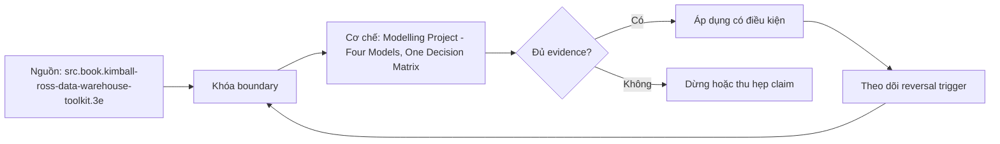

# Modelling Project - Four Models, One Decision Matrix

> [!abstract] Câu hỏi trung tâm
> Làm thế nào so bốn mô hình trên cùng domain bằng bằng chứng tương đương, thay vì chọn theo sở thích hoặc một benchmark không cùng điều kiện?

## 1. Khóa bài toán trước khi dựng mô hình

Cả bốn phương án phải dùng cùng source snapshot, business question, cutoff, currency, privacy rule và expected answer. Ghi domain, workload, volume, concurrency, change frequency, latency/freshness target và team capability. Nếu mỗi mô hình trả lời một câu khác nhau thì ma trận không có giá trị. Ground truth cần được tính từ atomic source bằng một oracle query độc lập với bốn implementation.

## 2. Bốn mô hình và grain

Operational normalized model ưu tiên transaction integrity, dependencies và write behavior. Dimensional model tuyên bố fact grain, conformed dimensions, SCD2 và aggregation semantics. Data Vault sketch xác định stable business keys, relationship grain, Satellites và delivery mart; bài không tuyên bố triển khai DV2 đầy đủ. Wide table chọn consumption grain, xử lý one-to-many/nested fields và duplicate measures. Mọi event table đều phải có một câu grain và test key/cardinality.

## 3. Bảo toàn nghĩa trước khi đo hiệu năng

Chạy cùng query suite trên bốn models và đối chiếu result set sau khi normalize ordering/types/precision. Chênh lệch phải được giải thích bằng semantics đã công bố, không được bỏ qua. Bắt buộc có SCD2 case, early fact, ba special-member meanings và late correction. Một model nhanh nhưng bỏ unmatched facts hoặc dùng current dimension cho history là không hợp lệ, không được đưa vào ranking performance.

## 4. Ma trận bốn nhân bốn có số

Bốn trục là correctness/traceability, usability, performance/cost và change/operations. Mỗi ô cần số đo hoặc ước lượng có công thức: mismatched rows/control-total delta; task success/time/error rate; p50/p95 latency, bytes scanned, storage, refresh; artifacts touched, migration hours, failed-change recovery. Nhanh, dễ, linh hoạt không phải evidence. Với ước lượng, ghi range, assumptions và confidence thay vì số giả chính xác.

## 5. Khuyến nghị và điều kiện đảo ngược

Khuyến nghị phải có bối cảnh, lựa chọn, evidence, trade-off chấp nhận, rejected alternatives và ba trigger làm quyết định đổi: workload/concurrency vượt ngưỡng, source/domain volatility tăng, hoặc team/tool/governance thay đổi. Không nhất thiết một model thắng toàn bộ. Kiến trúc thực tế có thể dùng normalized source, Raw Vault, dimensional mart và semantic layer nối tiếp; ma trận phải chỉ rõ layer đang so, tránh biến patterns bổ sung thành đối thủ tuyệt đối.

## 6. Ma trận kiểm chứng từng mệnh đề

Mỗi mệnh đề dưới đây cần một dữ liệu phản ví dụ, một invariant và một bằng chứng chạy lại được. Tên pattern, sơ đồ hoặc một query chạy thành công không đủ để xác nhận đúng ngữ nghĩa.

### 6.1. bốn models phải dùng cùng source snapshot

**Mệnh đề cần kiểm.** bốn models phải dùng cùng source snapshot.

**Cách kiểm.** Khóa một source snapshot và oracle result; dựng bốn models rồi chạy cùng correctness suite trước benchmark. Lưu semantic diff, query plans, latency, bytes/storage, refresh, consumer-task results và change-impact counts. Tách phép kiểm cấu trúc khỏi xác nhận của owner về business meaning. Lưu input snapshot, assumptions, executable query/test, output thô, control totals và phản ví dụ.

**Điều kiện kết luận cho `wiki.data-modeling.four-model-decision-matrix`.** Chỉ đánh dấu đạt khi artifact thực thi cho kết quả lặp lại ở cùng cutoff và không vi phạm grain, identity, time hoặc ownership contract. Nếu chưa thực thi, trạng thái là thiết kế kiểm chứng, không phải kết quả production.

### 6.2. business question và cutoff phải giống nhau

**Mệnh đề cần kiểm.** business question và cutoff phải giống nhau.

**Cách kiểm.** Khóa một source snapshot và oracle result; dựng bốn models rồi chạy cùng correctness suite trước benchmark. Lưu semantic diff, query plans, latency, bytes/storage, refresh, consumer-task results và change-impact counts. Tách phép kiểm cấu trúc khỏi xác nhận của owner về business meaning. Lưu input snapshot, assumptions, executable query/test, output thô, control totals và phản ví dụ.

**Điều kiện kết luận cho `wiki.data-modeling.four-model-decision-matrix`.** Chỉ đánh dấu đạt khi artifact thực thi cho kết quả lặp lại ở cùng cutoff và không vi phạm grain, identity, time hoặc ownership contract. Nếu chưa thực thi, trạng thái là thiết kế kiểm chứng, không phải kết quả production.

### 6.3. oracle query phải độc lập implementation

**Mệnh đề cần kiểm.** oracle query phải độc lập implementation.

**Cách kiểm.** Khóa một source snapshot và oracle result; dựng bốn models rồi chạy cùng correctness suite trước benchmark. Lưu semantic diff, query plans, latency, bytes/storage, refresh, consumer-task results và change-impact counts. Tách phép kiểm cấu trúc khỏi xác nhận của owner về business meaning. Lưu input snapshot, assumptions, executable query/test, output thô, control totals và phản ví dụ.

**Điều kiện kết luận cho `wiki.data-modeling.four-model-decision-matrix`.** Chỉ đánh dấu đạt khi artifact thực thi cho kết quả lặp lại ở cùng cutoff và không vi phạm grain, identity, time hoặc ownership contract. Nếu chưa thực thi, trạng thái là thiết kế kiểm chứng, không phải kết quả production.

### 6.4. mỗi event table có declared grain

**Mệnh đề cần kiểm.** mỗi event table có declared grain.

**Cách kiểm.** Khóa một source snapshot và oracle result; dựng bốn models rồi chạy cùng correctness suite trước benchmark. Lưu semantic diff, query plans, latency, bytes/storage, refresh, consumer-task results và change-impact counts. Tách phép kiểm cấu trúc khỏi xác nhận của owner về business meaning. Lưu input snapshot, assumptions, executable query/test, output thô, control totals và phản ví dụ.

**Điều kiện kết luận cho `wiki.data-modeling.four-model-decision-matrix`.** Chỉ đánh dấu đạt khi artifact thực thi cho kết quả lặp lại ở cùng cutoff và không vi phạm grain, identity, time hoặc ownership contract. Nếu chưa thực thi, trạng thái là thiết kế kiểm chứng, không phải kết quả production.

### 6.5. SCD2 behavior phải được kiểm

**Mệnh đề cần kiểm.** SCD2 behavior phải được kiểm.

**Cách kiểm.** Khóa một source snapshot và oracle result; dựng bốn models rồi chạy cùng correctness suite trước benchmark. Lưu semantic diff, query plans, latency, bytes/storage, refresh, consumer-task results và change-impact counts. Tách phép kiểm cấu trúc khỏi xác nhận của owner về business meaning. Lưu input snapshot, assumptions, executable query/test, output thô, control totals và phản ví dụ.

**Điều kiện kết luận cho `wiki.data-modeling.four-model-decision-matrix`.** Chỉ đánh dấu đạt khi artifact thực thi cho kết quả lặp lại ở cùng cutoff và không vi phạm grain, identity, time hoặc ownership contract. Nếu chưa thực thi, trạng thái là thiết kế kiểm chứng, không phải kết quả production.

### 6.6. early fact không được làm mất row

**Mệnh đề cần kiểm.** early fact không được làm mất row.

**Cách kiểm.** Khóa một source snapshot và oracle result; dựng bốn models rồi chạy cùng correctness suite trước benchmark. Lưu semantic diff, query plans, latency, bytes/storage, refresh, consumer-task results và change-impact counts. Tách phép kiểm cấu trúc khỏi xác nhận của owner về business meaning. Lưu input snapshot, assumptions, executable query/test, output thô, control totals và phản ví dụ.

**Điều kiện kết luận cho `wiki.data-modeling.four-model-decision-matrix`.** Chỉ đánh dấu đạt khi artifact thực thi cho kết quả lặp lại ở cùng cutoff và không vi phạm grain, identity, time hoặc ownership contract. Nếu chưa thực thi, trạng thái là thiết kế kiểm chứng, không phải kết quả production.

### 6.7. ba unknown meanings phải còn queryable

**Mệnh đề cần kiểm.** ba unknown meanings phải còn queryable.

**Cách kiểm.** Khóa một source snapshot và oracle result; dựng bốn models rồi chạy cùng correctness suite trước benchmark. Lưu semantic diff, query plans, latency, bytes/storage, refresh, consumer-task results và change-impact counts. Tách phép kiểm cấu trúc khỏi xác nhận của owner về business meaning. Lưu input snapshot, assumptions, executable query/test, output thô, control totals và phản ví dụ.

**Điều kiện kết luận cho `wiki.data-modeling.four-model-decision-matrix`.** Chỉ đánh dấu đạt khi artifact thực thi cho kết quả lặp lại ở cùng cutoff và không vi phạm grain, identity, time hoặc ownership contract. Nếu chưa thực thi, trạng thái là thiết kế kiểm chứng, không phải kết quả production.

### 6.8. result sets phải semantic-diff trước benchmark

**Mệnh đề cần kiểm.** result sets phải semantic-diff trước benchmark.

**Cách kiểm.** Khóa một source snapshot và oracle result; dựng bốn models rồi chạy cùng correctness suite trước benchmark. Lưu semantic diff, query plans, latency, bytes/storage, refresh, consumer-task results và change-impact counts. Tách phép kiểm cấu trúc khỏi xác nhận của owner về business meaning. Lưu input snapshot, assumptions, executable query/test, output thô, control totals và phản ví dụ.

**Điều kiện kết luận cho `wiki.data-modeling.four-model-decision-matrix`.** Chỉ đánh dấu đạt khi artifact thực thi cho kết quả lặp lại ở cùng cutoff và không vi phạm grain, identity, time hoặc ownership contract. Nếu chưa thực thi, trạng thái là thiết kế kiểm chứng, không phải kết quả production.

### 6.9. p50 p95 cần cùng workload và warm-up

**Mệnh đề cần kiểm.** p50 p95 cần cùng workload và warm-up.

**Cách kiểm.** Khóa một source snapshot và oracle result; dựng bốn models rồi chạy cùng correctness suite trước benchmark. Lưu semantic diff, query plans, latency, bytes/storage, refresh, consumer-task results và change-impact counts. Tách phép kiểm cấu trúc khỏi xác nhận của owner về business meaning. Lưu input snapshot, assumptions, executable query/test, output thô, control totals và phản ví dụ.

**Điều kiện kết luận cho `wiki.data-modeling.four-model-decision-matrix`.** Chỉ đánh dấu đạt khi artifact thực thi cho kết quả lặp lại ở cùng cutoff và không vi phạm grain, identity, time hoặc ownership contract. Nếu chưa thực thi, trạng thái là thiết kế kiểm chứng, không phải kết quả production.

### 6.10. storage phải tính cả refresh artifacts

**Mệnh đề cần kiểm.** storage phải tính cả refresh artifacts.

**Cách kiểm.** Khóa một source snapshot và oracle result; dựng bốn models rồi chạy cùng correctness suite trước benchmark. Lưu semantic diff, query plans, latency, bytes/storage, refresh, consumer-task results và change-impact counts. Tách phép kiểm cấu trúc khỏi xác nhận của owner về business meaning. Lưu input snapshot, assumptions, executable query/test, output thô, control totals và phản ví dụ.

**Điều kiện kết luận cho `wiki.data-modeling.four-model-decision-matrix`.** Chỉ đánh dấu đạt khi artifact thực thi cho kết quả lặp lại ở cùng cutoff và không vi phạm grain, identity, time hoặc ownership contract. Nếu chưa thực thi, trạng thái là thiết kế kiểm chứng, không phải kết quả production.

### 6.11. usability phải đo bằng consumer task

**Mệnh đề cần kiểm.** usability phải đo bằng consumer task.

**Cách kiểm.** Khóa một source snapshot và oracle result; dựng bốn models rồi chạy cùng correctness suite trước benchmark. Lưu semantic diff, query plans, latency, bytes/storage, refresh, consumer-task results và change-impact counts. Tách phép kiểm cấu trúc khỏi xác nhận của owner về business meaning. Lưu input snapshot, assumptions, executable query/test, output thô, control totals và phản ví dụ.

**Điều kiện kết luận cho `wiki.data-modeling.four-model-decision-matrix`.** Chỉ đánh dấu đạt khi artifact thực thi cho kết quả lặp lại ở cùng cutoff và không vi phạm grain, identity, time hoặc ownership contract. Nếu chưa thực thi, trạng thái là thiết kế kiểm chứng, không phải kết quả production.

### 6.12. changeability phải đếm blast radius

**Mệnh đề cần kiểm.** changeability phải đếm blast radius.

**Cách kiểm.** Khóa một source snapshot và oracle result; dựng bốn models rồi chạy cùng correctness suite trước benchmark. Lưu semantic diff, query plans, latency, bytes/storage, refresh, consumer-task results và change-impact counts. Tách phép kiểm cấu trúc khỏi xác nhận của owner về business meaning. Lưu input snapshot, assumptions, executable query/test, output thô, control totals và phản ví dụ.

**Điều kiện kết luận cho `wiki.data-modeling.four-model-decision-matrix`.** Chỉ đánh dấu đạt khi artifact thực thi cho kết quả lặp lại ở cùng cutoff và không vi phạm grain, identity, time hoặc ownership contract. Nếu chưa thực thi, trạng thái là thiết kế kiểm chứng, không phải kết quả production.

### 6.13. ước lượng cần assumptions và confidence

**Mệnh đề cần kiểm.** ước lượng cần assumptions và confidence.

**Cách kiểm.** Khóa một source snapshot và oracle result; dựng bốn models rồi chạy cùng correctness suite trước benchmark. Lưu semantic diff, query plans, latency, bytes/storage, refresh, consumer-task results và change-impact counts. Tách phép kiểm cấu trúc khỏi xác nhận của owner về business meaning. Lưu input snapshot, assumptions, executable query/test, output thô, control totals và phản ví dụ.

**Điều kiện kết luận cho `wiki.data-modeling.four-model-decision-matrix`.** Chỉ đánh dấu đạt khi artifact thực thi cho kết quả lặp lại ở cùng cutoff và không vi phạm grain, identity, time hoặc ownership contract. Nếu chưa thực thi, trạng thái là thiết kế kiểm chứng, không phải kết quả production.

### 6.14. recommendation phải có ba reversal triggers

**Mệnh đề cần kiểm.** recommendation phải có ba reversal triggers.

**Cách kiểm.** Khóa một source snapshot và oracle result; dựng bốn models rồi chạy cùng correctness suite trước benchmark. Lưu semantic diff, query plans, latency, bytes/storage, refresh, consumer-task results và change-impact counts. Tách phép kiểm cấu trúc khỏi xác nhận của owner về business meaning. Lưu input snapshot, assumptions, executable query/test, output thô, control totals và phản ví dụ.

**Điều kiện kết luận cho `wiki.data-modeling.four-model-decision-matrix`.** Chỉ đánh dấu đạt khi artifact thực thi cho kết quả lặp lại ở cùng cutoff và không vi phạm grain, identity, time hoặc ownership contract. Nếu chưa thực thi, trạng thái là thiết kế kiểm chứng, không phải kết quả production.

### 6.15. patterns ở các layers khác nhau có thể cùng tồn tại

**Mệnh đề cần kiểm.** patterns ở các layers khác nhau có thể cùng tồn tại.

**Cách kiểm.** Khóa một source snapshot và oracle result; dựng bốn models rồi chạy cùng correctness suite trước benchmark. Lưu semantic diff, query plans, latency, bytes/storage, refresh, consumer-task results và change-impact counts. Tách phép kiểm cấu trúc khỏi xác nhận của owner về business meaning. Lưu input snapshot, assumptions, executable query/test, output thô, control totals và phản ví dụ.

**Điều kiện kết luận cho `wiki.data-modeling.four-model-decision-matrix`.** Chỉ đánh dấu đạt khi artifact thực thi cho kết quả lặp lại ở cùng cutoff và không vi phạm grain, identity, time hoặc ownership contract. Nếu chưa thực thi, trạng thái là thiết kế kiểm chứng, không phải kết quả production.

## 7. Quy trình làm bài và phản biện

1. Viết business question, phạm vi, vocabulary, grain, identity và time semantics trước khi chọn bảng hoặc công cụ.
2. Gắn từng định nghĩa với context, owner, version và canonical artifact; không dùng tên cột thay nghĩa.
3. Tách nội dung lấy trực tiếp từ nguồn, quyết định thiết kế và phần tổng hợp của giáo trình.
4. Dựng normal case cùng các ca biên có thể tạo kết quả hợp lệ cú pháp nhưng sai nghĩa.
5. Đo row count, distinct keys, unmatched/disposition counts, control totals và semantic diff trước-sau transform.
6. Thử replay, late correction hoặc schema/contract change phù hợp với bài; ghi change blast radius.
7. Giữ failed run, assumptions và limitation trong hồ sơ. Chúng cho người khác khả năng bác bỏ kết luận.

## 8. Câu hỏi tự kiểm tra

1. Artifact nào giữ dữ liệu, artifact nào giữ nghĩa và ai có quyền thay đổi?
2. Một row/term/metric đại diện điều gì trong context và khoảng thời gian nào?
3. Ca biên nào làm con số sai nhưng pipeline hoặc dashboard vẫn xanh?
4. Phép kiểm nào xác nhận cấu trúc; phần nào vẫn cần owner xác nhận?
5. Khi contract thay đổi, consumer nào bị ảnh hưởng và migration được kiểm ra sao?
6. Phần nào của note là source fact, phần nào là synthesis có điều kiện?

## 9. Giới hạn và điều chưa cho phép kết luận

- Chưa chạy các lab, handover test hoặc benchmark mô tả trong note; chúng là giao thức kiểm chứng, không phải số đo đã thu.
- Nguồn sách cung cấp khái niệm và patterns; lựa chọn cho một doanh nghiệp còn phụ thuộc domain, engine, workload, policy và owner.
- Tài liệu web được kiểm ngày 2026-10-01 và có thể thay đổi theo phiên bản sản phẩm.
- Không suy một tool, model hay kiến trúc là chuẩn duy nhất từ ví dụ của nguồn.
- Không có owner review thì trạng thái vẫn là `review`, chưa phải policy được phê duyệt.

## Reference
1. [[SRC-KIMBALL-ROSS-DW-TOOLKIT-3E]]
2. [[SRC-ADAMSON-STAR-SCHEMA-COMPLETE-REFERENCE]]
3. [[SRC-REIS-HOUSLEY-FUNDAMENTALS-DATA-ENGINEERING]]

## Source coverage

| Source slice | Nội dung sử dụng | Trạng thái |
|---|---|---|
| [[SRC-KIMBALL-ROSS-DW-TOOLKIT-3E]] | Khái niệm, cơ chế và giới hạn liên quan trực tiếp | Đã đọc phạm vi có locator; không suy ngoài phạm vi |
| [[SRC-ADAMSON-STAR-SCHEMA-COMPLETE-REFERENCE]] | Khái niệm, cơ chế và giới hạn liên quan trực tiếp | Đã đọc phạm vi có locator; không suy ngoài phạm vi |
| [[SRC-REIS-HOUSLEY-FUNDAMENTALS-DATA-ENGINEERING]] | Khái niệm, cơ chế và giới hạn liên quan trực tiếp | Đã đọc phạm vi có locator; không suy ngoài phạm vi |

## Key takeaways
- Bắt đầu từ nghĩa, context, grain, identity, time và ownership; schema và công cụ là phần triển khai.
- Mọi trường hợp unmatched, unknown hoặc duplicated definition phải có trạng thái quan sát được, không được mất trong im lặng.
- Tài liệu chỉ đạt khi một người khác dùng đúng mà không dựa vào trí nhớ của tác giả.
- So sánh mô hình chỉ hợp lệ sau khi kết quả ngữ nghĩa đã được đối chiếu trên cùng dữ liệu và cutoff.
- Chưa chạy phép kiểm thì note là tài liệu học thuật có truy nguồn, không phải chứng nhận production.

<!-- ATOMIC-EXECUTION-CAPSULE:START -->

## Execution capsule: kiểm chứng `wiki.data-modeling.four-model-decision-matrix`

> [!important] Phân loại mệnh đề
> Với `wiki.data-modeling.four-model-decision-matrix`, sơ đồ, ví dụ và artifact về **Modelling Project - Four Models, One Decision Matrix** là **synthesis để kiểm chứng**; chúng không phải trích dẫn hay case nguyên văn của nguồn.

### Sơ đồ cơ chế và điểm kiểm soát



Đọc sơ đồ `wiki.data-modeling.four-model-decision-matrix` từ trái sang phải: source chỉ cung cấp claim ban đầu cho **Modelling Project - Four Models, One Decision Matrix**; quyết định chỉ được đi tiếp sau khi boundary, evidence và điều kiện đảo quyết định đã hiện hữu.

### Artifact thực thi tối thiểu

```sql
-- Verification harness for: Modelling Project - Four Models, One Decision Matrix
WITH evidence AS (
    SELECT 'wiki.data-modeling.four-model-decision-matrix' AS concept_id,
           'boundary_declared' AS check_name, 1 AS passed
    UNION ALL
    SELECT 'wiki.data-modeling.four-model-decision-matrix', 'independent_oracle', 1
    UNION ALL
    SELECT 'wiki.data-modeling.four-model-decision-matrix', 'reversal_trigger_recorded', 1
)
SELECT concept_id,
       MIN(passed) AS all_hard_checks_pass,
       COUNT(*) AS evidence_items
FROM evidence
GROUP BY concept_id
HAVING MIN(passed) = 1;
```

Artifact của `wiki.data-modeling.four-model-decision-matrix` buộc người dùng ghi boundary, oracle và reversal trigger cho **Modelling Project - Four Models, One Decision Matrix**. Các giá trị minh họa phải được thay bằng evidence thật trước khi dùng cho quyết định.

### Tự kiểm tra trước khi tái sử dụng

1. Bạn có thể trả lời `Làm thế nào so bốn mô hình trên cùng domain bằng bằng chứng tương đương, thay vì chọn theo sở thích hoặc một benchmark không cùng điều kiện?` bằng một câu mà không kéo thêm concept thứ hai không?
2. Source locator nào đỡ cho claim, và phần nào chỉ là synthesis trong note?
3. Observation nào khiến bạn dừng, thu hẹp hoặc đảo quyết định?
4. Artifact nào cho phép một reviewer độc lập tái hiện kết quả?

<!-- ATOMIC-EXECUTION-CAPSULE:END -->
