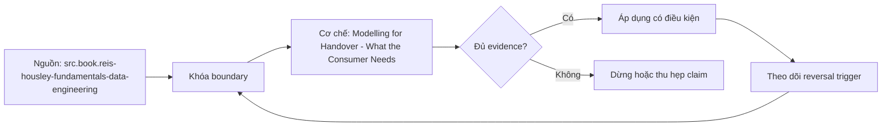

# Modelling for Handover - What the Consumer Needs

> [!abstract] Câu hỏi trung tâm
> Một người chưa tham gia thiết kế cần những bằng chứng nào để dùng mô hình đúng, tự phát hiện giới hạn và vận hành mà không phụ thuộc trí nhớ của tác giả?

## 1. Bàn giao là phép thử khả dụng

Mô hình không hoàn thành khi tác giả chạy được query; nó hoàn thành khi consumer độc lập có thể tìm đúng bảng, hiểu một row, chọn đúng field, tính đúng measure và biết khi nào không được kết luận. Handover test vì thế đo hành vi thật: giao dataset, tài liệu và ba câu hỏi cho người chưa xem model; không coaching trong lúc làm. Câu hỏi họ phải hỏi, query sai và interpretation sai đều là defects có thể sửa.

## 2. Phần một và hai: grain, keys, measures

Phần một ghi purpose, scope, grain, business keys, time/cutoff và quan hệ chính. Một câu grain phải đủ để người nhận dự đoán row count và join cardinality. Phần hai là metric dictionary: tên, business question, formula, numerator/denominator, filters, grouping, unit/currency, additivity, null/zero policy, owner và version. SQL minh họa không thay definition; definition không có executable test cũng khó giữ đúng khi model đổi.

## 3. Phần ba và bốn: dimensions, freshness, quality

Phần ba mô tả dimensions/attributes bằng ngôn ngữ nghiệp vụ, values, hierarchy, role, slowly-changing behavior và unknown categories. Không chép tên cột source thành “định nghĩa”. Phần bốn ghi source lineage, refresh cadence, watermark, expected freshness, completeness, reconciliation, known incidents và support owner. “Cập nhật hằng ngày” chưa đủ nếu không có timezone, cutoff và cách xử lý late data.

## 4. Phần năm và sáu: examples, limits

Phần năm có ít nhất ba query mẫu gắn business questions, expected grain/output và anti-example thường sai. Phần sáu ghi interpretation limits: coverage population, excluded events, survivorship bias, attribution boundary, non-causal nature, restatement policy và những câu hỏi dataset không trả lời. Đây không phải disclaimer trang trí; nó chặn người dùng biến sự tương quan thành nguyên nhân hoặc dùng snapshot để suy event không được capture.

## 5. Từ tài liệu tĩnh tới hợp đồng vận hành

Bộ sáu phần phải version cùng model, có owner, changelog, deprecation notice và machine-checkable elements nơi phù hợp. Catalog/semantic tooling giúp discovery nhưng không tự sinh đúng business meaning. Handover log phải ghi task, time, câu hỏi, lỗi, sửa đổi và retest. Đạt 2/3 chỉ là ngưỡng bài học; production handover còn cần access, runbook, incident path, privacy và consumer sign-off.

## 6. Ma trận kiểm chứng từng mệnh đề

Mỗi mệnh đề dưới đây cần một dữ liệu phản ví dụ, một invariant và một bằng chứng chạy lại được. Tên pattern, sơ đồ hoặc một query chạy thành công không đủ để xác nhận đúng ngữ nghĩa.

### 6.1. grain phải giúp dự đoán row cardinality

**Mệnh đề cần kiểm.** grain phải giúp dự đoán row cardinality.

**Cách kiểm.** Giao model, bộ tài liệu và ba câu hỏi cho người chưa tham gia. Không coaching. Thu query, câu trả lời, thời gian, câu hỏi và lỗi; sửa đúng phần tài liệu rồi retest với cùng rubric. Tách phép kiểm cấu trúc khỏi xác nhận của owner về business meaning. Lưu input snapshot, assumptions, executable query/test, output thô, control totals và phản ví dụ.

**Điều kiện kết luận cho `wiki.data-modeling.consumer-handover`.** Chỉ đánh dấu đạt khi artifact thực thi cho kết quả lặp lại ở cùng cutoff và không vi phạm grain, identity, time hoặc ownership contract. Nếu chưa thực thi, trạng thái là thiết kế kiểm chứng, không phải kết quả production.

### 6.2. metric formula phải nêu filters và time boundary

**Mệnh đề cần kiểm.** metric formula phải nêu filters và time boundary.

**Cách kiểm.** Giao model, bộ tài liệu và ba câu hỏi cho người chưa tham gia. Không coaching. Thu query, câu trả lời, thời gian, câu hỏi và lỗi; sửa đúng phần tài liệu rồi retest với cùng rubric. Tách phép kiểm cấu trúc khỏi xác nhận của owner về business meaning. Lưu input snapshot, assumptions, executable query/test, output thô, control totals và phản ví dụ.

**Điều kiện kết luận cho `wiki.data-modeling.consumer-handover`.** Chỉ đánh dấu đạt khi artifact thực thi cho kết quả lặp lại ở cùng cutoff và không vi phạm grain, identity, time hoặc ownership contract. Nếu chưa thực thi, trạng thái là thiết kế kiểm chứng, không phải kết quả production.

### 6.3. attribute definition không được chép tên cột

**Mệnh đề cần kiểm.** attribute definition không được chép tên cột.

**Cách kiểm.** Giao model, bộ tài liệu và ba câu hỏi cho người chưa tham gia. Không coaching. Thu query, câu trả lời, thời gian, câu hỏi và lỗi; sửa đúng phần tài liệu rồi retest với cùng rubric. Tách phép kiểm cấu trúc khỏi xác nhận của owner về business meaning. Lưu input snapshot, assumptions, executable query/test, output thô, control totals và phản ví dụ.

**Điều kiện kết luận cho `wiki.data-modeling.consumer-handover`.** Chỉ đánh dấu đạt khi artifact thực thi cho kết quả lặp lại ở cùng cutoff và không vi phạm grain, identity, time hoặc ownership contract. Nếu chưa thực thi, trạng thái là thiết kế kiểm chứng, không phải kết quả production.

### 6.4. unknown categories phải được giải thích

**Mệnh đề cần kiểm.** unknown categories phải được giải thích.

**Cách kiểm.** Giao model, bộ tài liệu và ba câu hỏi cho người chưa tham gia. Không coaching. Thu query, câu trả lời, thời gian, câu hỏi và lỗi; sửa đúng phần tài liệu rồi retest với cùng rubric. Tách phép kiểm cấu trúc khỏi xác nhận của owner về business meaning. Lưu input snapshot, assumptions, executable query/test, output thô, control totals và phản ví dụ.

**Điều kiện kết luận cho `wiki.data-modeling.consumer-handover`.** Chỉ đánh dấu đạt khi artifact thực thi cho kết quả lặp lại ở cùng cutoff và không vi phạm grain, identity, time hoặc ownership contract. Nếu chưa thực thi, trạng thái là thiết kế kiểm chứng, không phải kết quả production.

### 6.5. freshness cần timezone và cutoff

**Mệnh đề cần kiểm.** freshness cần timezone và cutoff.

**Cách kiểm.** Giao model, bộ tài liệu và ba câu hỏi cho người chưa tham gia. Không coaching. Thu query, câu trả lời, thời gian, câu hỏi và lỗi; sửa đúng phần tài liệu rồi retest với cùng rubric. Tách phép kiểm cấu trúc khỏi xác nhận của owner về business meaning. Lưu input snapshot, assumptions, executable query/test, output thô, control totals và phản ví dụ.

**Điều kiện kết luận cho `wiki.data-modeling.consumer-handover`.** Chỉ đánh dấu đạt khi artifact thực thi cho kết quả lặp lại ở cùng cutoff và không vi phạm grain, identity, time hoặc ownership contract. Nếu chưa thực thi, trạng thái là thiết kế kiểm chứng, không phải kết quả production.

### 6.6. quality cần control totals và owner

**Mệnh đề cần kiểm.** quality cần control totals và owner.

**Cách kiểm.** Giao model, bộ tài liệu và ba câu hỏi cho người chưa tham gia. Không coaching. Thu query, câu trả lời, thời gian, câu hỏi và lỗi; sửa đúng phần tài liệu rồi retest với cùng rubric. Tách phép kiểm cấu trúc khỏi xác nhận của owner về business meaning. Lưu input snapshot, assumptions, executable query/test, output thô, control totals và phản ví dụ.

**Điều kiện kết luận cho `wiki.data-modeling.consumer-handover`.** Chỉ đánh dấu đạt khi artifact thực thi cho kết quả lặp lại ở cùng cutoff và không vi phạm grain, identity, time hoặc ownership contract. Nếu chưa thực thi, trạng thái là thiết kế kiểm chứng, không phải kết quả production.

### 6.7. sample query phải ghi expected output grain

**Mệnh đề cần kiểm.** sample query phải ghi expected output grain.

**Cách kiểm.** Giao model, bộ tài liệu và ba câu hỏi cho người chưa tham gia. Không coaching. Thu query, câu trả lời, thời gian, câu hỏi và lỗi; sửa đúng phần tài liệu rồi retest với cùng rubric. Tách phép kiểm cấu trúc khỏi xác nhận của owner về business meaning. Lưu input snapshot, assumptions, executable query/test, output thô, control totals và phản ví dụ.

**Điều kiện kết luận cho `wiki.data-modeling.consumer-handover`.** Chỉ đánh dấu đạt khi artifact thực thi cho kết quả lặp lại ở cùng cutoff và không vi phạm grain, identity, time hoặc ownership contract. Nếu chưa thực thi, trạng thái là thiết kế kiểm chứng, không phải kết quả production.

### 6.8. anti-example giúp nhận diện query sai

**Mệnh đề cần kiểm.** anti-example giúp nhận diện query sai.

**Cách kiểm.** Giao model, bộ tài liệu và ba câu hỏi cho người chưa tham gia. Không coaching. Thu query, câu trả lời, thời gian, câu hỏi và lỗi; sửa đúng phần tài liệu rồi retest với cùng rubric. Tách phép kiểm cấu trúc khỏi xác nhận của owner về business meaning. Lưu input snapshot, assumptions, executable query/test, output thô, control totals và phản ví dụ.

**Điều kiện kết luận cho `wiki.data-modeling.consumer-handover`.** Chỉ đánh dấu đạt khi artifact thực thi cho kết quả lặp lại ở cùng cutoff và không vi phạm grain, identity, time hoặc ownership contract. Nếu chưa thực thi, trạng thái là thiết kế kiểm chứng, không phải kết quả production.

### 6.9. interpretation limits phải nêu population coverage

**Mệnh đề cần kiểm.** interpretation limits phải nêu population coverage.

**Cách kiểm.** Giao model, bộ tài liệu và ba câu hỏi cho người chưa tham gia. Không coaching. Thu query, câu trả lời, thời gian, câu hỏi và lỗi; sửa đúng phần tài liệu rồi retest với cùng rubric. Tách phép kiểm cấu trúc khỏi xác nhận của owner về business meaning. Lưu input snapshot, assumptions, executable query/test, output thô, control totals và phản ví dụ.

**Điều kiện kết luận cho `wiki.data-modeling.consumer-handover`.** Chỉ đánh dấu đạt khi artifact thực thi cho kết quả lặp lại ở cùng cutoff và không vi phạm grain, identity, time hoặc ownership contract. Nếu chưa thực thi, trạng thái là thiết kế kiểm chứng, không phải kết quả production.

### 6.10. correlation không được viết thành causality

**Mệnh đề cần kiểm.** correlation không được viết thành causality.

**Cách kiểm.** Giao model, bộ tài liệu và ba câu hỏi cho người chưa tham gia. Không coaching. Thu query, câu trả lời, thời gian, câu hỏi và lỗi; sửa đúng phần tài liệu rồi retest với cùng rubric. Tách phép kiểm cấu trúc khỏi xác nhận của owner về business meaning. Lưu input snapshot, assumptions, executable query/test, output thô, control totals và phản ví dụ.

**Điều kiện kết luận cho `wiki.data-modeling.consumer-handover`.** Chỉ đánh dấu đạt khi artifact thực thi cho kết quả lặp lại ở cùng cutoff và không vi phạm grain, identity, time hoặc ownership contract. Nếu chưa thực thi, trạng thái là thiết kế kiểm chứng, không phải kết quả production.

### 6.11. lineage phải đi tới source và transform

**Mệnh đề cần kiểm.** lineage phải đi tới source và transform.

**Cách kiểm.** Giao model, bộ tài liệu và ba câu hỏi cho người chưa tham gia. Không coaching. Thu query, câu trả lời, thời gian, câu hỏi và lỗi; sửa đúng phần tài liệu rồi retest với cùng rubric. Tách phép kiểm cấu trúc khỏi xác nhận của owner về business meaning. Lưu input snapshot, assumptions, executable query/test, output thô, control totals và phản ví dụ.

**Điều kiện kết luận cho `wiki.data-modeling.consumer-handover`.** Chỉ đánh dấu đạt khi artifact thực thi cho kết quả lặp lại ở cùng cutoff và không vi phạm grain, identity, time hoặc ownership contract. Nếu chưa thực thi, trạng thái là thiết kế kiểm chứng, không phải kết quả production.

### 6.12. documentation version phải đi cùng model version

**Mệnh đề cần kiểm.** documentation version phải đi cùng model version.

**Cách kiểm.** Giao model, bộ tài liệu và ba câu hỏi cho người chưa tham gia. Không coaching. Thu query, câu trả lời, thời gian, câu hỏi và lỗi; sửa đúng phần tài liệu rồi retest với cùng rubric. Tách phép kiểm cấu trúc khỏi xác nhận của owner về business meaning. Lưu input snapshot, assumptions, executable query/test, output thô, control totals và phản ví dụ.

**Điều kiện kết luận cho `wiki.data-modeling.consumer-handover`.** Chỉ đánh dấu đạt khi artifact thực thi cho kết quả lặp lại ở cùng cutoff và không vi phạm grain, identity, time hoặc ownership contract. Nếu chưa thực thi, trạng thái là thiết kế kiểm chứng, không phải kết quả production.

### 6.13. handover test không coaching người nhận

**Mệnh đề cần kiểm.** handover test không coaching người nhận.

**Cách kiểm.** Giao model, bộ tài liệu và ba câu hỏi cho người chưa tham gia. Không coaching. Thu query, câu trả lời, thời gian, câu hỏi và lỗi; sửa đúng phần tài liệu rồi retest với cùng rubric. Tách phép kiểm cấu trúc khỏi xác nhận của owner về business meaning. Lưu input snapshot, assumptions, executable query/test, output thô, control totals và phản ví dụ.

**Điều kiện kết luận cho `wiki.data-modeling.consumer-handover`.** Chỉ đánh dấu đạt khi artifact thực thi cho kết quả lặp lại ở cùng cutoff và không vi phạm grain, identity, time hoặc ownership contract. Nếu chưa thực thi, trạng thái là thiết kế kiểm chứng, không phải kết quả production.

### 6.14. mọi câu hỏi phát sinh trở thành defect log

**Mệnh đề cần kiểm.** mọi câu hỏi phát sinh trở thành defect log.

**Cách kiểm.** Giao model, bộ tài liệu và ba câu hỏi cho người chưa tham gia. Không coaching. Thu query, câu trả lời, thời gian, câu hỏi và lỗi; sửa đúng phần tài liệu rồi retest với cùng rubric. Tách phép kiểm cấu trúc khỏi xác nhận của owner về business meaning. Lưu input snapshot, assumptions, executable query/test, output thô, control totals và phản ví dụ.

**Điều kiện kết luận cho `wiki.data-modeling.consumer-handover`.** Chỉ đánh dấu đạt khi artifact thực thi cho kết quả lặp lại ở cùng cutoff và không vi phạm grain, identity, time hoặc ownership contract. Nếu chưa thực thi, trạng thái là thiết kế kiểm chứng, không phải kết quả production.

### 6.15. catalog tool không thay semantic ownership

**Mệnh đề cần kiểm.** catalog tool không thay semantic ownership.

**Cách kiểm.** Giao model, bộ tài liệu và ba câu hỏi cho người chưa tham gia. Không coaching. Thu query, câu trả lời, thời gian, câu hỏi và lỗi; sửa đúng phần tài liệu rồi retest với cùng rubric. Tách phép kiểm cấu trúc khỏi xác nhận của owner về business meaning. Lưu input snapshot, assumptions, executable query/test, output thô, control totals và phản ví dụ.

**Điều kiện kết luận cho `wiki.data-modeling.consumer-handover`.** Chỉ đánh dấu đạt khi artifact thực thi cho kết quả lặp lại ở cùng cutoff và không vi phạm grain, identity, time hoặc ownership contract. Nếu chưa thực thi, trạng thái là thiết kế kiểm chứng, không phải kết quả production.

## 7. Quy trình làm bài và phản biện

1. Viết business question, phạm vi, vocabulary, grain, identity và time semantics trước khi chọn bảng hoặc công cụ.
2. Gắn từng định nghĩa với context, owner, version và canonical artifact; không dùng tên cột thay nghĩa.
3. Tách nội dung lấy trực tiếp từ nguồn, quyết định thiết kế và phần tổng hợp của giáo trình.
4. Dựng normal case cùng các ca biên có thể tạo kết quả hợp lệ cú pháp nhưng sai nghĩa.
5. Đo row count, distinct keys, unmatched/disposition counts, control totals và semantic diff trước–sau transform.
6. Thử replay, late correction hoặc schema/contract change phù hợp với bài; ghi change blast radius.
7. Giữ failed run, assumptions và limitation trong hồ sơ. Chúng cho người khác khả năng bác bỏ kết luận.

## 8. Câu hỏi tự kiểm tra

1. Artifact nào giữ dữ liệu, artifact nào giữ nghĩa và ai có quyền thay đổi?
2. Một row/term/metric đại diện điều gì trong context và khoảng thời gian nào?
3. Ca biên nào làm con số sai nhưng pipeline hoặc dashboard vẫn xanh?
4. Phép kiểm nào xác nhận cấu trúc; phần nào vẫn cần owner xác nhận?
5. Khi contract thay đổi, consumer nào bị ảnh hưởng và migration được kiểm ra sao?
6. Phần nào của note là source fact, phần nào là synthesis có điều kiện?

## 9. Giới hạn và điều chưa cho phép kết luận

- Chưa chạy các lab, handover test hoặc benchmark mô tả trong note; chúng là giao thức kiểm chứng, không phải số đo đã thu.
- Nguồn sách cung cấp khái niệm và patterns; lựa chọn cho một doanh nghiệp còn phụ thuộc domain, engine, workload, policy và owner.
- Tài liệu web được kiểm ngày 2026-10-01 và có thể thay đổi theo phiên bản sản phẩm.
- Không suy một tool, model hay kiến trúc là chuẩn duy nhất từ ví dụ của nguồn.
- Không có owner review thì trạng thái vẫn là `review`, chưa phải policy được phê duyệt.

## Reference
1. [[SRC-REIS-HOUSLEY-FUNDAMENTALS-DATA-ENGINEERING]]
2. [[SRC-DBT-SEMANTIC-MODELS]]
3. [[SRC-STOPFORD-DESIGNING-EVENT-DRIVEN-SYSTEMS]]

## Source coverage

| Source slice | Nội dung sử dụng | Trạng thái |
|---|---|---|
| [[SRC-REIS-HOUSLEY-FUNDAMENTALS-DATA-ENGINEERING]] | Khái niệm, cơ chế và giới hạn liên quan trực tiếp | Đã đọc phạm vi có locator; không suy ngoài phạm vi |
| [[SRC-DBT-SEMANTIC-MODELS]] | Khái niệm, cơ chế và giới hạn liên quan trực tiếp | Đã đọc phạm vi có locator; không suy ngoài phạm vi |
| [[SRC-STOPFORD-DESIGNING-EVENT-DRIVEN-SYSTEMS]] | Khái niệm, cơ chế và giới hạn liên quan trực tiếp | Đã đọc phạm vi có locator; không suy ngoài phạm vi |

## Key takeaways
- Bắt đầu từ nghĩa, context, grain, identity, time và ownership; schema và công cụ là phần triển khai.
- Mọi trường hợp unmatched, unknown hoặc duplicated definition phải có trạng thái quan sát được, không được mất trong im lặng.
- Tài liệu chỉ đạt khi một người khác dùng đúng mà không dựa vào trí nhớ của tác giả.
- So sánh mô hình chỉ hợp lệ sau khi kết quả ngữ nghĩa đã được đối chiếu trên cùng dữ liệu và cutoff.
- Chưa chạy phép kiểm thì note là tài liệu học thuật có truy nguồn, không phải chứng nhận production.

<!-- ATOMIC-EXECUTION-CAPSULE:START -->

## Execution capsule — kiểm chứng `wiki.data-modeling.consumer-handover`

> [!important] Phân loại mệnh đề
> Với `wiki.data-modeling.consumer-handover`, sơ đồ, ví dụ và artifact về **Modelling for Handover - What the Consumer Needs** là **synthesis để kiểm chứng**; chúng không phải trích dẫn hay case nguyên văn của nguồn.

### Sơ đồ cơ chế và điểm kiểm soát



Đọc sơ đồ `wiki.data-modeling.consumer-handover` từ trái sang phải: source chỉ cung cấp claim ban đầu cho **Modelling for Handover - What the Consumer Needs**; quyết định chỉ được đi tiếp sau khi boundary, evidence và điều kiện đảo quyết định đã hiện hữu.

### Artifact thực thi tối thiểu

```sql
-- Verification harness for: Modelling for Handover - What the Consumer Needs
WITH evidence AS (
    SELECT 'wiki.data-modeling.consumer-handover' AS concept_id,
           'boundary_declared' AS check_name, 1 AS passed
    UNION ALL
    SELECT 'wiki.data-modeling.consumer-handover', 'independent_oracle', 1
    UNION ALL
    SELECT 'wiki.data-modeling.consumer-handover', 'reversal_trigger_recorded', 1
)
SELECT concept_id,
       MIN(passed) AS all_hard_checks_pass,
       COUNT(*) AS evidence_items
FROM evidence
GROUP BY concept_id
HAVING MIN(passed) = 1;
```

Artifact của `wiki.data-modeling.consumer-handover` buộc người dùng ghi boundary, oracle và reversal trigger cho **Modelling for Handover - What the Consumer Needs**. Các giá trị minh họa phải được thay bằng evidence thật trước khi dùng cho quyết định.

### Tự kiểm tra trước khi tái sử dụng

1. Bạn có thể trả lời `Một người chưa tham gia thiết kế cần những bằng chứng nào để dùng mô hình đúng, tự phát hiện giới hạn và vận hành mà không phụ thuộc trí nhớ của tác giả?` bằng một câu mà không kéo thêm concept thứ hai không?
2. Source locator nào đỡ cho claim, và phần nào chỉ là synthesis trong note?
3. Observation nào khiến bạn dừng, thu hẹp hoặc đảo quyết định?
4. Artifact nào cho phép một reviewer độc lập tái hiện kết quả?

<!-- ATOMIC-EXECUTION-CAPSULE:END -->
