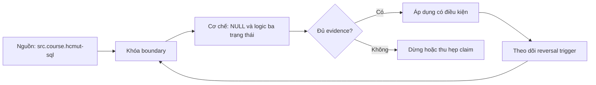

# NULL và logic ba trạng thái

> [!abstract] Câu hỏi trung tâm
> Khi một giá trị chưa biết hoặc không tồn tại được biểu diễn bằng NULL, SQL suy luận TRUE, FALSE và UNKNOWN ra sao; hàng nào được giữ; mẫu số tổng hợp nào được dùng; và quyết định thay thế nào còn đúng với nghiệp vụ?

## 1. NULL biểu diễn thiếu thông tin, không phải một giá trị thông thường

`NULL` không đồng nghĩa số 0, chuỗi rỗng, `false`, ngày 1970-01-01 hay chữ `"unknown"`. Các giá trị kia đều là giá trị đã biết. NULL cho biết hệ thống không có một giá trị để so sánh theo cách thông thường. Hai NULL cũng không tự động là cùng một thực thể hay cùng một lý do thiếu.

Một cột nullable thường trộn nhiều trạng thái: chưa thu thập, không áp dụng, bị che vì quyền riêng tư, nguồn lỗi, đang chờ xác minh. Nếu các trạng thái dẫn tới quyết định khác nhau, một bit nullability không đủ. Thiết kế nên dùng status/reason code, timestamp hoặc relation riêng, thay vì mong NULL giữ thông tin nó không chứa.

## 2. TRUE, FALSE và UNKNOWN

Trong SQL, phép so sánh có toán hạng NULL thường trả `UNKNOWN`. `7 = NULL`, `7 <> NULL`, `NULL = NULL` đều không trả TRUE. `WHERE` chỉ giữ row mà predicate là TRUE; FALSE và UNKNOWN đều bị loại. Vì vậy:

```sql
WHERE status <> 'A'
```

không giữ row có `status IS NULL`. Nếu nghiệp vụ muốn “mọi row không phải A, kể cả chưa biết”, phải viết rõ:

```sql
WHERE status <> 'A' OR status IS NULL
```

hoặc dùng `status IS DISTINCT FROM 'A'` trong PostgreSQL. Hai câu này có thể khác trong biểu thức phức tạp, nên chọn theo contract, không theo độ ngắn.

## 3. Bảng chân trị phải được suy từ UNKNOWN

Với `AND`, FALSE đủ làm toàn biểu thức FALSE; TRUE AND UNKNOWN là UNKNOWN. Với `OR`, TRUE đủ làm TRUE; FALSE OR UNKNOWN là UNKNOWN. `NOT UNKNOWN` vẫn UNKNOWN.

| p | q | p AND q | p OR q |
|---|---|---|---|
| TRUE | UNKNOWN | UNKNOWN | TRUE |
| FALSE | UNKNOWN | FALSE | UNKNOWN |
| UNKNOWN | UNKNOWN | UNKNOWN | UNKNOWN |

Các luật Boolean cổ điển không phải lúc nào giữ nguyên trực giác trong three-valued logic. Khi viết lại predicate, cần kiểm cả input NULL thay vì chỉ TRUE/FALSE. Test table phải có giá trị khớp, không khớp và NULL.

## 4. Kiểm NULL đúng cách

`IS NULL` và `IS NOT NULL` luôn trả boolean. PostgreSQL còn có `IS TRUE`, `IS FALSE`, `IS UNKNOWN` và dạng phủ định, hữu ích khi boolean nullable. `IS DISTINCT FROM` xử lý NULL như một giá trị so sánh được: hai NULL không distinct; một NULL và một non-NULL distinct. `IS NOT DISTINCT FROM` là null-safe equality.

Không bật `transform_null_equals` để hợp thức hóa code sai nếu có thể sửa ứng dụng; đó là compatibility switch, không phải semantics nên dạy. Row-valued `IS NULL` có chi tiết riêng: row có cả field null và non-null có thể khiến cả `IS NULL` lẫn `IS NOT NULL` false; khi kiểm overall row, dùng predicate được tài liệu chỉ định.

## 5. Số học, nối chuỗi và biểu thức

Phần lớn toán tử strict truyền NULL: `price * quantity` thành NULL nếu một toán hạng NULL. Đây không phải 0 doanh thu. `COALESCE(quantity,0)` chỉ đúng nếu missing quantity có nghĩa nghiệp vụ là zero; nếu là “chưa nhận dữ liệu”, thay 0 sẽ biến chất lượng dữ liệu thành số liệu kinh doanh giả.

Nối chuỗi cũng phụ thuộc function/operator và DBMS. Không suy từ một công cụ sang công cụ khác. Khi dựng label, quyết định rõ “thiếu middle name” thì bỏ đoạn hay toàn label unknown; test function cụ thể trên PostgreSQL 17.

`CASE` có thể phân loại NULL, nhưng thứ tự nhánh quan trọng. `CASE WHEN x = NULL` không match; dùng `x IS NULL`. Không dùng `ELSE 0` như một thùng chứa mọi trạng thái chưa hiểu.

## 6. IN, NOT IN và bẫy UNKNOWN

`x IN (a,b,NULL)` tương đương chuỗi OR equality. Nếu x không khớp a/b, so sánh với NULL cho UNKNOWN, kết quả toàn biểu thức có thể UNKNOWN. `NOT IN` có NULL trong tập con đặc biệt nguy hiểm: không tìm thấy match chưa đủ trả TRUE vì vẫn có phần tử unknown. Query có thể trả zero rows mà không báo lỗi.

Với anti-join, ưu tiên `NOT EXISTS` với correlated equality và kiểm semantics NULL rõ ràng. Nếu dùng `NOT IN`, subquery phải bảo đảm NOT NULL bằng constraint hoặc filter được chứng minh. Không chữa bằng `COALESCE` sentinel nếu sentinel có thể là giá trị thật.

## 7. Tổng hợp và mẫu số

`COUNT(*)` đếm rows; `COUNT(column)` đếm non-NULL values. `SUM`, `AVG`, `MIN`, `MAX` thường bỏ qua NULL inputs; nếu không có non-NULL input, nhiều aggregate trả NULL. Vì vậy:

$$
AVG(x)=\frac{SUM(x\;non-null)}{COUNT(x)}
$$

không dùng `COUNT(*)`. Nếu 10 người, 2 người thiếu lương, AVG tính trên 8 người. Thay NULL bằng 0 tạo câu hỏi khác: tổng chia 10 với giả định hai người lương bằng 0. Cả hai đều có thể hợp lệ trong domain khác nhau, nhưng phải ghi denominator và missingness policy.

Group by thường gom các NULL grouping values thành một group cho mục đích grouping. Điều đó không có nghĩa `NULL = NULL` trở thành TRUE trong predicate. Đây là hai rule khác nhau.

## 8. ORDER BY và NULL placement

Không dựa vào vị trí NULL mặc định giữa DBMS hoặc giữa ASC/DESC. PostgreSQL hỗ trợ `NULLS FIRST`/`NULLS LAST`; dùng rõ khi output contract cần ổn định. Pagination theo cursor phải định nghĩa tie-breaker và null ordering, nếu không row có thể trùng/sót giữa trang.

Thứ tự hiển thị không chữa semantics thiếu. Đẩy NULL xuống cuối chỉ thay presentation, không nói giá trị thấp/cao hơn.

## 9. JOIN với nullable key

Equality join chỉ match khi `ON` predicate TRUE. `NULL = NULL` là UNKNOWN nên hai row có key NULL không match. Inner join làm chúng biến mất; left join giữ row trái và null-extend bên phải. Dùng `IS NOT DISTINCT FROM` sẽ cho NULL match NULL, nhưng có thể tạo many-to-many explosion nếu nhiều row mỗi bên NULL. Chỉ dùng nếu domain thật sự coi thiếu key là cùng equivalence class—trường hợp hiếm.

Join key đáng lẽ bắt buộc nhưng nullable là quality signal. Đếm NULL key trước join và đưa vào reconciliation thay vì im lặng coalesce sang sentinel chung.

## 10. CHECK, UNIQUE và NULL

CHECK constraint đạt khi expression TRUE hoặc NULL/UNKNOWN trong PostgreSQL; muốn bắt buộc điều kiện, thường phải kết hợp `NOT NULL` hoặc viết predicate loại UNKNOWN. Unique constraint có semantics NULL riêng; PostgreSQL mặc định cho nhiều NULL vì chúng không được coi equal, và có tùy chọn `NULLS NOT DISTINCT`. Không suy “UNIQUE nghĩa chỉ một NULL” nếu chưa kiểm DBMS/version.

Ràng buộc phải phản ánh state hợp lệ. Nếu code quốc gia thiếu là invalid, dùng NOT NULL. Nếu đang onboarding cho phép thiếu tạm thời, cần workflow/status rõ và query downstream hiểu.

## 11. Ba nghĩa và ba cách tính trung bình

Một bảng đo có `value NULL` có thể được xử lý:

1. bỏ qua NULL: ước lượng trên observations đã có;
2. thay 0: giả định missing thật sự bằng zero;
3. impute/ước lượng: dùng model/rule và phải gắn cờ imputed.

Không có lựa chọn chung “đúng”. Báo cáo phải nêu population, denominator, missing rate và reason distribution. Nếu missing not at random, average observed có bias. Bài lab chỉ so ba phép tính không đủ; phải viết câu nghiệp vụ cho từng giả định.

## 12. Bộ 15 biểu thức kiểm tra

Test nên phủ equality/inequality, AND/OR/NOT, arithmetic, CASE, IN/NOT IN, COUNT/AVG, GROUP BY, ORDER BY và JOIN. Người học ghi prediction trước khi chạy, gồm value lẫn type/state TRUE/FALSE/UNKNOWN. Sau chạy, mọi chênh lệch phải giải thích bằng rule, không ghi “PostgreSQL làm vậy”.

Thêm row-valued case và `IS DISTINCT FROM` để phân biệt SQL chuẩn phổ biến với PostgreSQL-specific predicate. Lưu script và output để chạy lại khi đổi DBMS.

## 13. Quy tắc thiết kế

- Dùng NOT NULL khi absence không phải valid state.
- Nếu có nhiều lý do thiếu ảnh hưởng quyết định, model reason riêng.
- Không `COALESCE` trước khi định nghĩa meaning.
- Metric luôn công bố denominator và missingness.
- Join/reconciliation luôn đếm NULL keys.
- Test predicate với ba lớp input: match, non-match, NULL.

## 14. Câu hỏi tự kiểm tra

1. Vì sao `x <> 'A'` không giữ row x NULL?
2. `NOT IN` gặp NULL trong subquery dẫn tới UNKNOWN thế nào?
3. `COUNT(*)`, `COUNT(x)` và `AVG(x)` dùng mẫu số nào?
4. Khi nào `IS NOT DISTINCT FROM` hữu ích và khi nào gây join explosion?
5. CHECK expression UNKNOWN có ý nghĩa gì trong PostgreSQL?
6. Ba nghĩa “chưa biết”, “không áp dụng”, “bằng 0” cần model khác nhau ra sao?

## 15. Giới hạn và điều chưa cho phép kết luận

- Note dùng PostgreSQL 17 làm hệ kiểm chứng; DBMS khác phải chạy lại truth table và constraint tests.
- NULL không mã hóa được lý do thiếu; không suy missing mechanism từ ký hiệu này.
- Ví dụ average không phải hướng dẫn statistical imputation; phần đó cần phương pháp riêng.
- Null-safe equality không tự động là join key đúng.

## Reference
1. [[SRC-HCMUT-SQL]] — PDF 49–50, 61–79.
2. [[SRC-POSTGRESQL-17-NULL-COMPARISON]] — comparison và null predicates.
3. [[SRC-POSTGRESQL-17-QUERY-EXPRESSIONS]] — WHERE, GROUP BY, joins.

## Source coverage

| Source slice | Nội dung phải giữ | Vị trí trong note | Trạng thái |
|---|---|---|---|
| [[SRC-HCMUT-SQL]], PDF 49–50, 69–79 | NULL, grouping, aggregate, ordering | §§1–3, 7–8 | Đã trình bày và bổ sung business semantics |
| [[SRC-POSTGRESQL-17-NULL-COMPARISON]] | UNKNOWN, IS predicates, DISTINCT FROM | §§2–4 | Đã giữ cả row-valued limitation |
| [[SRC-POSTGRESQL-17-QUERY-EXPRESSIONS]] | filter/join/group pipeline | §§7–9 | Đã tách logical khỏi physical |
| Tổng hợp DE-L114 | missingness, 15-expression test, decision rules | §§11–13 | Đã ghi thành synthesis kiểm được |

## Key takeaways
- WHERE chỉ giữ TRUE; FALSE và UNKNOWN đều bị loại.
- NULL không phải zero/empty/false và không giữ lý do thiếu.
- Aggregate bỏ NULL làm thay denominator; metric phải công bố missingness policy.
- `NOT IN`, nullable join key và CHECK UNKNOWN là ba failure mode âm thầm.
- Chỉ COALESCE sau khi định nghĩa rõ ý nghĩa nghiệp vụ.

<!-- ATOMIC-EXECUTION-CAPSULE:START -->

## Execution capsule — kiểm chứng `wiki.database.null-three-valued-logic`

> [!important] Phân loại mệnh đề
> Với `wiki.database.null-three-valued-logic`, sơ đồ, ví dụ và artifact về **NULL và logic ba trạng thái** là **synthesis để kiểm chứng**; chúng không phải trích dẫn hay case nguyên văn của nguồn.

### Sơ đồ cơ chế và điểm kiểm soát



Đọc sơ đồ `wiki.database.null-three-valued-logic` từ trái sang phải: source chỉ cung cấp claim ban đầu cho **NULL và logic ba trạng thái**; quyết định chỉ được đi tiếp sau khi boundary, evidence và điều kiện đảo quyết định đã hiện hữu.

### Tự kiểm tra trước khi tái sử dụng

1. Bạn có thể trả lời `NULL đi qua biểu thức, bộ lọc, phép nối, tổng hợp và sắp xếp như thế nào, và khi nào việc thay NULL bằng giá trị mặc định làm sai nghĩa nghiệp vụ?` bằng một câu mà không kéo thêm concept thứ hai không?
2. Source locator nào đỡ cho claim, và phần nào chỉ là synthesis trong note?
3. Observation nào khiến bạn dừng, thu hẹp hoặc đảo quyết định?
4. Artifact nào cho phép một reviewer độc lập tái hiện kết quả?

<!-- ATOMIC-EXECUTION-CAPSULE:END -->
