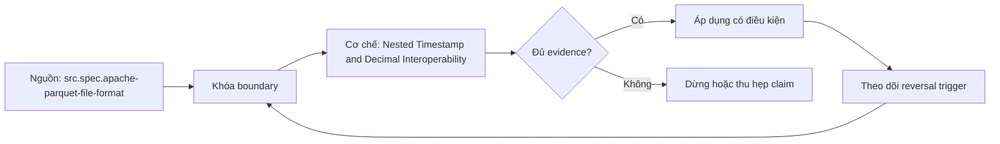

# Nested Timestamp and Decimal Interoperability

> [!abstract] Câu hỏi trung tâm
> Round-trip nested data, timestamp và decimal qua nhiều engine thế nào để phát hiện sai nghĩa?

## 1. Interoperability là typed equality

Cùng đọc được file chỉ chứng minh parser chấp nhận bytes. Interoperability cần canonical logical schema, value semantics và equality oracle. So row count hoặc aggregate có thể che nested order, null versus empty, precision loss và timezone shift. Fixture phải có stable row key; mỗi engine xuất canonical representation để so từng field. Mismatch được phân loại thành schema mapping, writer encoding, reader conversion, API representation hoặc application normalization.

## 2. Nested levels

Parquet lưu leaf values cùng definition levels để biểu diễn optionality và repetition levels để biểu diễn list boundaries trong cấu trúc lồng. Các LIST/MAP encodings lịch sử và generated schemas có thể khác shape dù nhìn gần giống. Fixture phải phân biệt missing parent, null child, empty list, list containing null, empty map và nested repeated records. Flatten rồi rebuild không phải oracle nếu nó làm mất parent/position identity. So canonical JSON có explicit states và stable ordering rule.

## 3. Timestamp semantics

Timestamp cần unit, timezone adjustment contract và meaning. Milliseconds, microseconds và nanoseconds khác precision; một engine có thể truncate hoặc reject. Instant with offset, local wall-clock time và calendar date là ba concepts. DST gap/overlap, pre-epoch values, leap-related boundaries và writer timezone cần fixture. Legacy INT96 có engine-specific behavior; nếu xuất hiện phải pin reader options. So epoch instant cho instant fields và local components plus zone policy cho local fields.

## 4. Decimal semantics

Decimal mang precision và scale; physical storage có thể là int32, int64 hoặc fixed/byte array. Reader mapping sang binary floating point làm mất exactness. Fixture gồm max/min precision, trailing zeros, negative, rounding boundary và overflow. Equality business có thể quan tâm numeric value hoặc representation scale; contract phải chọn. Writer không được silently round nếu policy yêu cầu reject. Canonical oracle dùng unscaled integer cùng scale hoặc decimal string chuẩn hóa theo rule đã công bố.

## 5. Cross-engine matrix

Chọn ít nhất hai engines nhưng ghi exact versions, connectors, session timezone, schema options và language driver. Mỗi engine vừa làm writer vừa làm reader để tạo W_A→R_A, W_A→R_B, W_B→R_A, W_B→R_B. Lưu file hash, footer schema, inferred schema, typed output và warnings. Một mismatch được sửa ở writer contract nếu có thể; workaround chỉ ở reader phải được ghi như compatibility debt và có test ngăn regression.

## 6. Automation

Golden corpus nhỏ nhưng bao phủ states được version control cùng expected canonical values. Pipeline đọc tất cả files bằng tất cả supported readers, normalize theo contract rồi diff per key/field. Negative fixtures phải reject: decimal overflow, unsupported timestamp precision, invalid nested schema. Khi nâng engine/library, chạy lại matrix trước deploy. Không tự regenerate expected output bằng code đang được kiểm; owner duyệt thay đổi oracle và ghi migration rationale.

## 7. Ma trận kiểm chứng từng mệnh đề

Mỗi claim phải chỉ rõ metadata scope, writer/reader version, exact fixture, counterexample và oracle. File parse được, plan có predicate hoặc metadata tồn tại chưa đủ để kết luận physical I/O hay semantic result đúng.

### 7.1. Interoperability probe 1: writer-reader version, typed fixture, canonical value và mismatch class phải hiện đủ

**Mệnh đề cần kiểm.** Interoperability probe 1: writer-reader version, typed fixture, canonical value và mismatch class phải hiện đủ.

**Thiết kế phép thử cho `wiki.storage.nested-timestamp-decimal-interoperability`.** Khóa schema, dataset hash, writer/reader/engine versions, storage backend, cache state và configuration. Tạo positive fixture, boundary fixture và negative/counterexample; thay đổi đúng một biến. Lưu footer hoặc metadata-tree locator, query plan, scan counters, requested/transferred bytes nếu có, typed result hash, logs và run ID. Khi công cụ không quan sát được một tầng, ghi `unknown` thay vì suy từ latency hoặc output count.

**Điều kiện chấp nhận cho `wiki.storage.nested-timestamp-decimal-interoperability`.** Canonical result phải khớp trước khi so hiệu năng. Observation phải lặp lại trên số run đã định, chỉ ra đơn vị bị loại và cơ chế chịu trách nhiệm. Báo riêng source fact, phần tổng hợp của giáo trình và giả định theo implementation. Chưa chạy lab thì mục này là protocol, chưa phải kết quả thực nghiệm.

### 7.2. Interoperability probe 2: writer-reader version, typed fixture, canonical value và mismatch class phải hiện đủ

**Mệnh đề cần kiểm.** Interoperability probe 2: writer-reader version, typed fixture, canonical value và mismatch class phải hiện đủ.

**Thiết kế phép thử cho `wiki.storage.nested-timestamp-decimal-interoperability`.** Khóa schema, dataset hash, writer/reader/engine versions, storage backend, cache state và configuration. Tạo positive fixture, boundary fixture và negative/counterexample; thay đổi đúng một biến. Lưu footer hoặc metadata-tree locator, query plan, scan counters, requested/transferred bytes nếu có, typed result hash, logs và run ID. Khi công cụ không quan sát được một tầng, ghi `unknown` thay vì suy từ latency hoặc output count.

**Điều kiện chấp nhận cho `wiki.storage.nested-timestamp-decimal-interoperability`.** Canonical result phải khớp trước khi so hiệu năng. Observation phải lặp lại trên số run đã định, chỉ ra đơn vị bị loại và cơ chế chịu trách nhiệm. Báo riêng source fact, phần tổng hợp của giáo trình và giả định theo implementation. Chưa chạy lab thì mục này là protocol, chưa phải kết quả thực nghiệm.

### 7.3. Interoperability probe 3: writer-reader version, typed fixture, canonical value và mismatch class phải hiện đủ

**Mệnh đề cần kiểm.** Interoperability probe 3: writer-reader version, typed fixture, canonical value và mismatch class phải hiện đủ.

**Thiết kế phép thử cho `wiki.storage.nested-timestamp-decimal-interoperability`.** Khóa schema, dataset hash, writer/reader/engine versions, storage backend, cache state và configuration. Tạo positive fixture, boundary fixture và negative/counterexample; thay đổi đúng một biến. Lưu footer hoặc metadata-tree locator, query plan, scan counters, requested/transferred bytes nếu có, typed result hash, logs và run ID. Khi công cụ không quan sát được một tầng, ghi `unknown` thay vì suy từ latency hoặc output count.

**Điều kiện chấp nhận cho `wiki.storage.nested-timestamp-decimal-interoperability`.** Canonical result phải khớp trước khi so hiệu năng. Observation phải lặp lại trên số run đã định, chỉ ra đơn vị bị loại và cơ chế chịu trách nhiệm. Báo riêng source fact, phần tổng hợp của giáo trình và giả định theo implementation. Chưa chạy lab thì mục này là protocol, chưa phải kết quả thực nghiệm.

### 7.4. Interoperability probe 4: writer-reader version, typed fixture, canonical value và mismatch class phải hiện đủ

**Mệnh đề cần kiểm.** Interoperability probe 4: writer-reader version, typed fixture, canonical value và mismatch class phải hiện đủ.

**Thiết kế phép thử cho `wiki.storage.nested-timestamp-decimal-interoperability`.** Khóa schema, dataset hash, writer/reader/engine versions, storage backend, cache state và configuration. Tạo positive fixture, boundary fixture và negative/counterexample; thay đổi đúng một biến. Lưu footer hoặc metadata-tree locator, query plan, scan counters, requested/transferred bytes nếu có, typed result hash, logs và run ID. Khi công cụ không quan sát được một tầng, ghi `unknown` thay vì suy từ latency hoặc output count.

**Điều kiện chấp nhận cho `wiki.storage.nested-timestamp-decimal-interoperability`.** Canonical result phải khớp trước khi so hiệu năng. Observation phải lặp lại trên số run đã định, chỉ ra đơn vị bị loại và cơ chế chịu trách nhiệm. Báo riêng source fact, phần tổng hợp của giáo trình và giả định theo implementation. Chưa chạy lab thì mục này là protocol, chưa phải kết quả thực nghiệm.

### 7.5. Interoperability probe 5: writer-reader version, typed fixture, canonical value và mismatch class phải hiện đủ

**Mệnh đề cần kiểm.** Interoperability probe 5: writer-reader version, typed fixture, canonical value và mismatch class phải hiện đủ.

**Thiết kế phép thử cho `wiki.storage.nested-timestamp-decimal-interoperability`.** Khóa schema, dataset hash, writer/reader/engine versions, storage backend, cache state và configuration. Tạo positive fixture, boundary fixture và negative/counterexample; thay đổi đúng một biến. Lưu footer hoặc metadata-tree locator, query plan, scan counters, requested/transferred bytes nếu có, typed result hash, logs và run ID. Khi công cụ không quan sát được một tầng, ghi `unknown` thay vì suy từ latency hoặc output count.

**Điều kiện chấp nhận cho `wiki.storage.nested-timestamp-decimal-interoperability`.** Canonical result phải khớp trước khi so hiệu năng. Observation phải lặp lại trên số run đã định, chỉ ra đơn vị bị loại và cơ chế chịu trách nhiệm. Báo riêng source fact, phần tổng hợp của giáo trình và giả định theo implementation. Chưa chạy lab thì mục này là protocol, chưa phải kết quả thực nghiệm.

### 7.6. Interoperability probe 6: writer-reader version, typed fixture, canonical value và mismatch class phải hiện đủ

**Mệnh đề cần kiểm.** Interoperability probe 6: writer-reader version, typed fixture, canonical value và mismatch class phải hiện đủ.

**Thiết kế phép thử cho `wiki.storage.nested-timestamp-decimal-interoperability`.** Khóa schema, dataset hash, writer/reader/engine versions, storage backend, cache state và configuration. Tạo positive fixture, boundary fixture và negative/counterexample; thay đổi đúng một biến. Lưu footer hoặc metadata-tree locator, query plan, scan counters, requested/transferred bytes nếu có, typed result hash, logs và run ID. Khi công cụ không quan sát được một tầng, ghi `unknown` thay vì suy từ latency hoặc output count.

**Điều kiện chấp nhận cho `wiki.storage.nested-timestamp-decimal-interoperability`.** Canonical result phải khớp trước khi so hiệu năng. Observation phải lặp lại trên số run đã định, chỉ ra đơn vị bị loại và cơ chế chịu trách nhiệm. Báo riêng source fact, phần tổng hợp của giáo trình và giả định theo implementation. Chưa chạy lab thì mục này là protocol, chưa phải kết quả thực nghiệm.

### 7.7. Interoperability probe 7: writer-reader version, typed fixture, canonical value và mismatch class phải hiện đủ

**Mệnh đề cần kiểm.** Interoperability probe 7: writer-reader version, typed fixture, canonical value và mismatch class phải hiện đủ.

**Thiết kế phép thử cho `wiki.storage.nested-timestamp-decimal-interoperability`.** Khóa schema, dataset hash, writer/reader/engine versions, storage backend, cache state và configuration. Tạo positive fixture, boundary fixture và negative/counterexample; thay đổi đúng một biến. Lưu footer hoặc metadata-tree locator, query plan, scan counters, requested/transferred bytes nếu có, typed result hash, logs và run ID. Khi công cụ không quan sát được một tầng, ghi `unknown` thay vì suy từ latency hoặc output count.

**Điều kiện chấp nhận cho `wiki.storage.nested-timestamp-decimal-interoperability`.** Canonical result phải khớp trước khi so hiệu năng. Observation phải lặp lại trên số run đã định, chỉ ra đơn vị bị loại và cơ chế chịu trách nhiệm. Báo riêng source fact, phần tổng hợp của giáo trình và giả định theo implementation. Chưa chạy lab thì mục này là protocol, chưa phải kết quả thực nghiệm.

### 7.8. Interoperability probe 8: writer-reader version, typed fixture, canonical value và mismatch class phải hiện đủ

**Mệnh đề cần kiểm.** Interoperability probe 8: writer-reader version, typed fixture, canonical value và mismatch class phải hiện đủ.

**Thiết kế phép thử cho `wiki.storage.nested-timestamp-decimal-interoperability`.** Khóa schema, dataset hash, writer/reader/engine versions, storage backend, cache state và configuration. Tạo positive fixture, boundary fixture và negative/counterexample; thay đổi đúng một biến. Lưu footer hoặc metadata-tree locator, query plan, scan counters, requested/transferred bytes nếu có, typed result hash, logs và run ID. Khi công cụ không quan sát được một tầng, ghi `unknown` thay vì suy từ latency hoặc output count.

**Điều kiện chấp nhận cho `wiki.storage.nested-timestamp-decimal-interoperability`.** Canonical result phải khớp trước khi so hiệu năng. Observation phải lặp lại trên số run đã định, chỉ ra đơn vị bị loại và cơ chế chịu trách nhiệm. Báo riêng source fact, phần tổng hợp của giáo trình và giả định theo implementation. Chưa chạy lab thì mục này là protocol, chưa phải kết quả thực nghiệm.

### 7.9. Interoperability probe 9: writer-reader version, typed fixture, canonical value và mismatch class phải hiện đủ

**Mệnh đề cần kiểm.** Interoperability probe 9: writer-reader version, typed fixture, canonical value và mismatch class phải hiện đủ.

**Thiết kế phép thử cho `wiki.storage.nested-timestamp-decimal-interoperability`.** Khóa schema, dataset hash, writer/reader/engine versions, storage backend, cache state và configuration. Tạo positive fixture, boundary fixture và negative/counterexample; thay đổi đúng một biến. Lưu footer hoặc metadata-tree locator, query plan, scan counters, requested/transferred bytes nếu có, typed result hash, logs và run ID. Khi công cụ không quan sát được một tầng, ghi `unknown` thay vì suy từ latency hoặc output count.

**Điều kiện chấp nhận cho `wiki.storage.nested-timestamp-decimal-interoperability`.** Canonical result phải khớp trước khi so hiệu năng. Observation phải lặp lại trên số run đã định, chỉ ra đơn vị bị loại và cơ chế chịu trách nhiệm. Báo riêng source fact, phần tổng hợp của giáo trình và giả định theo implementation. Chưa chạy lab thì mục này là protocol, chưa phải kết quả thực nghiệm.

### 7.10. Interoperability probe 10: writer-reader version, typed fixture, canonical value và mismatch class phải hiện đủ

**Mệnh đề cần kiểm.** Interoperability probe 10: writer-reader version, typed fixture, canonical value và mismatch class phải hiện đủ.

**Thiết kế phép thử cho `wiki.storage.nested-timestamp-decimal-interoperability`.** Khóa schema, dataset hash, writer/reader/engine versions, storage backend, cache state và configuration. Tạo positive fixture, boundary fixture và negative/counterexample; thay đổi đúng một biến. Lưu footer hoặc metadata-tree locator, query plan, scan counters, requested/transferred bytes nếu có, typed result hash, logs và run ID. Khi công cụ không quan sát được một tầng, ghi `unknown` thay vì suy từ latency hoặc output count.

**Điều kiện chấp nhận cho `wiki.storage.nested-timestamp-decimal-interoperability`.** Canonical result phải khớp trước khi so hiệu năng. Observation phải lặp lại trên số run đã định, chỉ ra đơn vị bị loại và cơ chế chịu trách nhiệm. Báo riêng source fact, phần tổng hợp của giáo trình và giả định theo implementation. Chưa chạy lab thì mục này là protocol, chưa phải kết quả thực nghiệm.

### 7.11. Interoperability probe 11: writer-reader version, typed fixture, canonical value và mismatch class phải hiện đủ

**Mệnh đề cần kiểm.** Interoperability probe 11: writer-reader version, typed fixture, canonical value và mismatch class phải hiện đủ.

**Thiết kế phép thử cho `wiki.storage.nested-timestamp-decimal-interoperability`.** Khóa schema, dataset hash, writer/reader/engine versions, storage backend, cache state và configuration. Tạo positive fixture, boundary fixture và negative/counterexample; thay đổi đúng một biến. Lưu footer hoặc metadata-tree locator, query plan, scan counters, requested/transferred bytes nếu có, typed result hash, logs và run ID. Khi công cụ không quan sát được một tầng, ghi `unknown` thay vì suy từ latency hoặc output count.

**Điều kiện chấp nhận cho `wiki.storage.nested-timestamp-decimal-interoperability`.** Canonical result phải khớp trước khi so hiệu năng. Observation phải lặp lại trên số run đã định, chỉ ra đơn vị bị loại và cơ chế chịu trách nhiệm. Báo riêng source fact, phần tổng hợp của giáo trình và giả định theo implementation. Chưa chạy lab thì mục này là protocol, chưa phải kết quả thực nghiệm.

### 7.12. Interoperability probe 12: writer-reader version, typed fixture, canonical value và mismatch class phải hiện đủ

**Mệnh đề cần kiểm.** Interoperability probe 12: writer-reader version, typed fixture, canonical value và mismatch class phải hiện đủ.

**Thiết kế phép thử cho `wiki.storage.nested-timestamp-decimal-interoperability`.** Khóa schema, dataset hash, writer/reader/engine versions, storage backend, cache state và configuration. Tạo positive fixture, boundary fixture và negative/counterexample; thay đổi đúng một biến. Lưu footer hoặc metadata-tree locator, query plan, scan counters, requested/transferred bytes nếu có, typed result hash, logs và run ID. Khi công cụ không quan sát được một tầng, ghi `unknown` thay vì suy từ latency hoặc output count.

**Điều kiện chấp nhận cho `wiki.storage.nested-timestamp-decimal-interoperability`.** Canonical result phải khớp trước khi so hiệu năng. Observation phải lặp lại trên số run đã định, chỉ ra đơn vị bị loại và cơ chế chịu trách nhiệm. Báo riêng source fact, phần tổng hợp của giáo trình và giả định theo implementation. Chưa chạy lab thì mục này là protocol, chưa phải kết quả thực nghiệm.

### 7.13. Interoperability probe 13: writer-reader version, typed fixture, canonical value và mismatch class phải hiện đủ

**Mệnh đề cần kiểm.** Interoperability probe 13: writer-reader version, typed fixture, canonical value và mismatch class phải hiện đủ.

**Thiết kế phép thử cho `wiki.storage.nested-timestamp-decimal-interoperability`.** Khóa schema, dataset hash, writer/reader/engine versions, storage backend, cache state và configuration. Tạo positive fixture, boundary fixture và negative/counterexample; thay đổi đúng một biến. Lưu footer hoặc metadata-tree locator, query plan, scan counters, requested/transferred bytes nếu có, typed result hash, logs và run ID. Khi công cụ không quan sát được một tầng, ghi `unknown` thay vì suy từ latency hoặc output count.

**Điều kiện chấp nhận cho `wiki.storage.nested-timestamp-decimal-interoperability`.** Canonical result phải khớp trước khi so hiệu năng. Observation phải lặp lại trên số run đã định, chỉ ra đơn vị bị loại và cơ chế chịu trách nhiệm. Báo riêng source fact, phần tổng hợp của giáo trình và giả định theo implementation. Chưa chạy lab thì mục này là protocol, chưa phải kết quả thực nghiệm.

### 7.14. Interoperability probe 14: writer-reader version, typed fixture, canonical value và mismatch class phải hiện đủ

**Mệnh đề cần kiểm.** Interoperability probe 14: writer-reader version, typed fixture, canonical value và mismatch class phải hiện đủ.

**Thiết kế phép thử cho `wiki.storage.nested-timestamp-decimal-interoperability`.** Khóa schema, dataset hash, writer/reader/engine versions, storage backend, cache state và configuration. Tạo positive fixture, boundary fixture và negative/counterexample; thay đổi đúng một biến. Lưu footer hoặc metadata-tree locator, query plan, scan counters, requested/transferred bytes nếu có, typed result hash, logs và run ID. Khi công cụ không quan sát được một tầng, ghi `unknown` thay vì suy từ latency hoặc output count.

**Điều kiện chấp nhận cho `wiki.storage.nested-timestamp-decimal-interoperability`.** Canonical result phải khớp trước khi so hiệu năng. Observation phải lặp lại trên số run đã định, chỉ ra đơn vị bị loại và cơ chế chịu trách nhiệm. Báo riêng source fact, phần tổng hợp của giáo trình và giả định theo implementation. Chưa chạy lab thì mục này là protocol, chưa phải kết quả thực nghiệm.

### 7.15. Interoperability probe 15: writer-reader version, typed fixture, canonical value và mismatch class phải hiện đủ

**Mệnh đề cần kiểm.** Interoperability probe 15: writer-reader version, typed fixture, canonical value và mismatch class phải hiện đủ.

**Thiết kế phép thử cho `wiki.storage.nested-timestamp-decimal-interoperability`.** Khóa schema, dataset hash, writer/reader/engine versions, storage backend, cache state và configuration. Tạo positive fixture, boundary fixture và negative/counterexample; thay đổi đúng một biến. Lưu footer hoặc metadata-tree locator, query plan, scan counters, requested/transferred bytes nếu có, typed result hash, logs và run ID. Khi công cụ không quan sát được một tầng, ghi `unknown` thay vì suy từ latency hoặc output count.

**Điều kiện chấp nhận cho `wiki.storage.nested-timestamp-decimal-interoperability`.** Canonical result phải khớp trước khi so hiệu năng. Observation phải lặp lại trên số run đã định, chỉ ra đơn vị bị loại và cơ chế chịu trách nhiệm. Báo riêng source fact, phần tổng hợp của giáo trình và giả định theo implementation. Chưa chạy lab thì mục này là protocol, chưa phải kết quả thực nghiệm.

## 8. Quy trình phản biện

1. Xác định tầng đang nói: object store, file, table metadata, catalog hay engine.
2. Viết identity và publication boundary trước khi bàn hiệu năng.
3. Tách metadata presence, planner intent, executed pruning và physical I/O.
4. Kiểm semantic result bằng typed oracle trước benchmark.
5. Pin version, configuration, cache state và metric definition.
6. Ghi counterexample, limitation và reversal condition cho recommendation.

## 9. Câu hỏi tự kiểm tra

1. Đơn vị đang xét là file, row group, column chunk, page, manifest hay snapshot?
2. Metadata nào authoritative và lấy từ locator nào?
3. Reader có dùng metadata hay chỉ có khả năng dùng?
4. Parse/decode thành công có che semantic mismatch không?
5. Failure ở trước hay sau publication boundary?
6. Bằng chứng nào còn là protocol chưa chạy?

## 10. Giới hạn và điều chưa cho phép kết luận

- Chưa chạy Parquet footer/page-index lab hoặc Iceberg metadata trace trên engine/catalog thật.
- Đặc tả được kiểm ngày 2026-10-02; implementation behavior phải pin version.
- Matrices và lab protocols là synthesis của giáo trình, không gán nguyên văn cho một nguồn.
- Note giữ trạng thái `review` tới khi chủ dự án duyệt.

## Reference
1. [[SRC-APACHE-PARQUET-FILE-FORMAT]]
2. [[SRC-APACHE-ICEBERG-SPEC]]
3. [[SRC-REIS-HOUSLEY-FUNDAMENTALS-DATA-ENGINEERING]]

## Source coverage

| Source slice | Nội dung sử dụng | Trạng thái |
|---|---|---|
| [[SRC-APACHE-PARQUET-FILE-FORMAT]] | Format/table contract, implementation boundary hoặc workload context | Đã đọc locator; không suy ngoài phạm vi |
| [[SRC-APACHE-ICEBERG-SPEC]] | Format/table contract, implementation boundary hoặc workload context | Đã đọc locator; không suy ngoài phạm vi |
| [[SRC-REIS-HOUSLEY-FUNDAMENTALS-DATA-ENGINEERING]] | Format/table contract, implementation boundary hoặc workload context | Đã đọc locator; không suy ngoài phạm vi |

## Key takeaways
- Mọi claim phải đúng tầng và đúng granularity.
- Metadata hiện diện, planner intent, executed pruning và physical I/O là bốn bằng chứng khác nhau.
- Semantic oracle được kiểm trước performance attribution.
- Chưa chạy lab thì note cung cấp giáo trình và protocol, chưa phải certification cho production.

<!-- ATOMIC-EXECUTION-CAPSULE:START -->

## Execution capsule — kiểm chứng `wiki.storage.nested-timestamp-decimal-interoperability`

> [!important] Phân loại mệnh đề
> Với `wiki.storage.nested-timestamp-decimal-interoperability`, sơ đồ, ví dụ và artifact về **Nested Timestamp and Decimal Interoperability** là **synthesis để kiểm chứng**; chúng không phải trích dẫn hay case nguyên văn của nguồn.

### Sơ đồ cơ chế và điểm kiểm soát



Đọc sơ đồ `wiki.storage.nested-timestamp-decimal-interoperability` từ trái sang phải: source chỉ cung cấp claim ban đầu cho **Nested Timestamp and Decimal Interoperability**; quyết định chỉ được đi tiếp sau khi boundary, evidence và điều kiện đảo quyết định đã hiện hữu.

### Ví dụ làm việc có thể bác bỏ

**Input.** Một đội cần trả lời: “Round-trip nested data, timestamp và decimal qua nhiều engine thế nào để phát hiện sai nghĩa?” cho một phạm vi nhỏ, có owner và deadline rõ.

**Decision.** Đội áp dụng **Nested Timestamp and Decimal Interoperability** trên control và variant chỉ khác một assumption; expected result và hard constraints được khóa trước khi chạy.

**Outcome.** Với `wiki.storage.nested-timestamp-decimal-interoperability`, nếu observation vi phạm hard constraint hoặc oracle độc lập không xác nhận **Nested Timestamp and Decimal Interoperability**, đội thu hẹp claim hay đảo quyết định. Nếu đạt, kết luận vẫn kèm scope, version và review date; một lần thành công không được nâng thành quy luật phổ quát.

### Artifact thực thi tối thiểu

```sql
-- Verification harness for: Nested Timestamp and Decimal Interoperability
WITH evidence AS (
    SELECT 'wiki.storage.nested-timestamp-decimal-interoperability' AS concept_id,
           'boundary_declared' AS check_name, 1 AS passed
    UNION ALL
    SELECT 'wiki.storage.nested-timestamp-decimal-interoperability', 'independent_oracle', 1
    UNION ALL
    SELECT 'wiki.storage.nested-timestamp-decimal-interoperability', 'reversal_trigger_recorded', 1
)
SELECT concept_id,
       MIN(passed) AS all_hard_checks_pass,
       COUNT(*) AS evidence_items
FROM evidence
GROUP BY concept_id
HAVING MIN(passed) = 1;
```

Artifact của `wiki.storage.nested-timestamp-decimal-interoperability` buộc người dùng ghi boundary, oracle và reversal trigger cho **Nested Timestamp and Decimal Interoperability**. Các giá trị minh họa phải được thay bằng evidence thật trước khi dùng cho quyết định.

### Tự kiểm tra trước khi tái sử dụng

1. Bạn có thể trả lời `Round-trip nested data, timestamp và decimal qua nhiều engine thế nào để phát hiện sai nghĩa?` bằng một câu mà không kéo thêm concept thứ hai không?
2. Source locator nào đỡ cho claim, và phần nào chỉ là synthesis trong note?
3. Observation nào khiến bạn dừng, thu hẹp hoặc đảo quyết định?
4. Artifact nào cho phép một reviewer độc lập tái hiện kết quả?

<!-- ATOMIC-EXECUTION-CAPSULE:END -->
