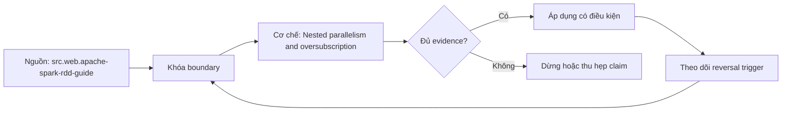

# Nested parallelism and oversubscription

> [!abstract] Câu hỏi trung tâm
> Làm thế nào mô hình, kiểm chứng và vận hành nested parallelism, executor cores và oversubscription mà không khẳng định vượt quá evidence?

## 1. Mechanism

Mô hình nested parallelism, executor cores và oversubscription phải nêu actor, state, transition và resource thực sự tham gia thay vì chỉ gọi tên tính năng. Đừng bắt đầu bằng tên công cụ. Hãy bắt đầu bằng đối tượng được bảo vệ, boundary quan sát được và hậu quả nếu kết luận sai. Trong bài `Nested parallelism and oversubscription`, câu hỏi thực dụng là: Làm thế nào mô hình, kiểm chứng và vận hành nested parallelism, executor cores và oversubscription mà không khẳng định vượt quá evidence? Ta ghi rõ grain, population, time window, owner và hành động sau failure; nếu một trường chưa biết thì đánh dấu unknown thay vì lấp bằng mặc định. Bằng chứng tối thiểu gồm fixture có version, cấu hình hoặc rule đã resolve, raw observation, expected result và limitation. Phần này là curriculum synthesis dựa trên các nguồn đã định danh, không phải lời hứa rằng mọi adapter hay deployment đều có cùng hành vi.

## 2. Boundary

Guarantee của nested parallelism, executor cores và oversubscription chỉ có nghĩa khi khóa scope, identity, time window, failure domain và version. Điểm khó không nằm ở cú pháp mà ở identity và scope. Hai phép đo cùng tên vẫn có thể nói về hai population hoặc hai thời điểm khác nhau. Trong bài `Nested parallelism and oversubscription`, câu hỏi thực dụng là: Làm thế nào mô hình, kiểm chứng và vận hành nested parallelism, executor cores và oversubscription mà không khẳng định vượt quá evidence? Ta ghi rõ grain, population, time window, owner và hành động sau failure; nếu một trường chưa biết thì đánh dấu unknown thay vì lấp bằng mặc định. Bằng chứng tối thiểu gồm fixture có version, cấu hình hoặc rule đã resolve, raw observation, expected result và limitation. Phần này là curriculum synthesis dựa trên các nguồn đã định danh, không phải lời hứa rằng mọi adapter hay deployment đều có cùng hành vi.

## 3. Failure mode

Phân tích nested parallelism, executor cores và oversubscription cần chỉ ra earliest controllable failure, blast radius và trạng thái còn quan sát được sau lỗi. Một dashboard xanh chỉ là tín hiệu. Muốn biến nó thành bằng chứng phải giữ input, phiên bản, rule, trạng thái trước–sau và cách tính độc lập. Trong bài `Nested parallelism and oversubscription`, câu hỏi thực dụng là: Làm thế nào mô hình, kiểm chứng và vận hành nested parallelism, executor cores và oversubscription mà không khẳng định vượt quá evidence? Ta ghi rõ grain, population, time window, owner và hành động sau failure; nếu một trường chưa biết thì đánh dấu unknown thay vì lấp bằng mặc định. Bằng chứng tối thiểu gồm fixture có version, cấu hình hoặc rule đã resolve, raw observation, expected result và limitation. Phần này là curriculum synthesis dựa trên các nguồn đã định danh, không phải lời hứa rằng mọi adapter hay deployment đều có cùng hành vi.

## 4. Decision rule

Quyết định về nested parallelism, executor cores và oversubscription phải nối workload constraints với alternatives, trade-offs và điều kiện đảo chiều. Thiết kế tốt phải chịu được counterexample. Hãy chủ động tạo case sát boundary, case thiếu dữ liệu và case replay thay vì chỉ chạy happy path. Trong bài `Nested parallelism and oversubscription`, câu hỏi thực dụng là: Làm thế nào mô hình, kiểm chứng và vận hành nested parallelism, executor cores và oversubscription mà không khẳng định vượt quá evidence? Ta ghi rõ grain, population, time window, owner và hành động sau failure; nếu một trường chưa biết thì đánh dấu unknown thay vì lấp bằng mặc định. Bằng chứng tối thiểu gồm fixture có version, cấu hình hoặc rule đã resolve, raw observation, expected result và limitation. Phần này là curriculum synthesis dựa trên các nguồn đã định danh, không phải lời hứa rằng mọi adapter hay deployment đều có cùng hành vi.

## 5. Evidence

Bằng chứng cho nested parallelism, executor cores và oversubscription gồm resolved configuration, runtime identity, metrics/logs, state trước–sau và independent oracle. Chi phí vận hành thuộc contract. Một rule đúng nhưng quá đắt, quá ồn hoặc không có owner sẽ nhanh chóng bị tắt và mất tác dụng. Trong bài `Nested parallelism and oversubscription`, câu hỏi thực dụng là: Làm thế nào mô hình, kiểm chứng và vận hành nested parallelism, executor cores và oversubscription mà không khẳng định vượt quá evidence? Ta ghi rõ grain, population, time window, owner và hành động sau failure; nếu một trường chưa biết thì đánh dấu unknown thay vì lấp bằng mặc định. Bằng chứng tối thiểu gồm fixture có version, cấu hình hoặc rule đã resolve, raw observation, expected result và limitation. Phần này là curriculum synthesis dựa trên các nguồn đã định danh, không phải lời hứa rằng mọi adapter hay deployment đều có cùng hành vi.

## 6. Recovery lab

Lab nested parallelism, executor cores và oversubscription phải inject một failure hoặc changed constraint, phục hồi từ checkpoint hợp lệ rồi reconcile kết quả. Kết luận cần có điều kiện đảo chiều. Khi volume, latency, nguồn thẩm quyền hoặc topology đổi, quyết định cũ phải được xem xét lại bằng cùng một oracle. Trong bài `Nested parallelism and oversubscription`, câu hỏi thực dụng là: Làm thế nào mô hình, kiểm chứng và vận hành nested parallelism, executor cores và oversubscription mà không khẳng định vượt quá evidence? Ta ghi rõ grain, population, time window, owner và hành động sau failure; nếu một trường chưa biết thì đánh dấu unknown thay vì lấp bằng mặc định. Bằng chứng tối thiểu gồm fixture có version, cấu hình hoặc rule đã resolve, raw observation, expected result và limitation. Phần này là curriculum synthesis dựa trên các nguồn đã định danh, không phải lời hứa rằng mọi adapter hay deployment đều có cùng hành vi.

## 7. Ma trận kiểm chứng từng mệnh đề

Với `wiki.spark.nested-parallelism`, command thành công không tự chứng minh dữ liệu đúng. Protocol riêng của bài là: Run a version-pinned sandbox fixture, change one declared constraint or inject one failure, retain raw runtime evidence and reconcile the final identities and state against an independent oracle. Mỗi probe dưới đây phải nối input boundary với failure signal và oracle có thể phản bác kết luận.

### 7.1. Nested parallelism and oversubscription: kiểm `Mechanism` bằng case 1, cụ thể mô hình nested parallelism, executor cores và oversubscription phải nêu actor, state, transition và resource thực sự tham gia thay vì chỉ gọi tên tính năng

**Mệnh đề cần kiểm.** Nested parallelism and oversubscription: kiểm `Mechanism` bằng case 1, cụ thể mô hình nested parallelism, executor cores và oversubscription phải nêu actor, state, transition và resource thực sự tham gia thay vì chỉ gọi tên tính năng.

**Thiết kế phép thử cho `wiki.spark.nested-parallelism`.** Trong ngữ cảnh `wiki.spark.nested-parallelism`, tạo positive control và negative control chỉ khác đúng một điều kiện. Khóa input snapshot, phiên bản và owner của rule; chạy đúng population được bài `Nested parallelism and oversubscription` công bố.

**Bằng chứng cần giữ.** Đối với probe 1 của `Nested parallelism and oversubscription`, giữ fixture, raw failing rows và lệnh tái hiện. Nếu chưa chạy lab, ghi expected evidence và giữ trạng thái review; không biến protocol thành observation.

### 7.2. Nested parallelism and oversubscription: kiểm `Boundary` bằng case 2, cụ thể guarantee của nested parallelism, executor cores và oversubscription chỉ có nghĩa khi khóa scope, identity, time window, failure domain và version

**Mệnh đề cần kiểm.** Nested parallelism and oversubscription: kiểm `Boundary` bằng case 2, cụ thể guarantee của nested parallelism, executor cores và oversubscription chỉ có nghĩa khi khóa scope, identity, time window, failure domain và version.

**Thiết kế phép thử cho `wiki.spark.nested-parallelism`.** Trong ngữ cảnh `wiki.spark.nested-parallelism`, đổi grain nhưng giữ tổng số dòng để lộ phép đo sai cấp. Khóa input snapshot, phiên bản và owner của rule; chạy đúng population được bài `Nested parallelism and oversubscription` công bố.

**Bằng chứng cần giữ.** Đối với probe 2 của `Nested parallelism and oversubscription`, báo numerator, denominator và key set ở cả hai grain. Nếu chưa chạy lab, ghi expected evidence và giữ trạng thái review; không biến protocol thành observation.

### 7.3. Nested parallelism and oversubscription: kiểm `Failure mode` bằng case 3, cụ thể phân tích nested parallelism, executor cores và oversubscription cần chỉ ra earliest controllable failure, blast radius và trạng thái còn quan sát được sau lỗi

**Mệnh đề cần kiểm.** Nested parallelism and oversubscription: kiểm `Failure mode` bằng case 3, cụ thể phân tích nested parallelism, executor cores và oversubscription cần chỉ ra earliest controllable failure, blast radius và trạng thái còn quan sát được sau lỗi.

**Thiết kế phép thử cho `wiki.spark.nested-parallelism`.** Trong ngữ cảnh `wiki.spark.nested-parallelism`, đưa một giá trị tới đúng boundary và một giá trị vượt boundary. Khóa input snapshot, phiên bản và owner của rule; chạy đúng population được bài `Nested parallelism and oversubscription` công bố.

**Bằng chứng cần giữ.** Đối với probe 3 của `Nested parallelism and oversubscription`, lưu hai observed values cùng rule đã resolve. Nếu chưa chạy lab, ghi expected evidence và giữ trạng thái review; không biến protocol thành observation.

### 7.4. Nested parallelism and oversubscription: kiểm `Decision rule` bằng case 4, cụ thể quyết định về nested parallelism, executor cores và oversubscription phải nối workload constraints với alternatives, trade-offs và điều kiện đảo chiều

**Mệnh đề cần kiểm.** Nested parallelism and oversubscription: kiểm `Decision rule` bằng case 4, cụ thể quyết định về nested parallelism, executor cores và oversubscription phải nối workload constraints với alternatives, trade-offs và điều kiện đảo chiều.

**Thiết kế phép thử cho `wiki.spark.nested-parallelism`.** Trong ngữ cảnh `wiki.spark.nested-parallelism`, kill tiến trình ngay trước rồi ngay sau durable side effect. Khóa input snapshot, phiên bản và owner của rule; chạy đúng population được bài `Nested parallelism and oversubscription` công bố.

**Bằng chứng cần giữ.** Đối với probe 4 của `Nested parallelism and oversubscription`, lưu checkpoint, external ledger và trạng thái sau restart. Nếu chưa chạy lab, ghi expected evidence và giữ trạng thái review; không biến protocol thành observation.

### 7.5. Nested parallelism and oversubscription: kiểm `Evidence` bằng case 5, cụ thể bằng chứng cho nested parallelism, executor cores và oversubscription gồm resolved configuration, runtime identity, metrics/logs, state trước–sau và independent oracle

**Mệnh đề cần kiểm.** Nested parallelism and oversubscription: kiểm `Evidence` bằng case 5, cụ thể bằng chứng cho nested parallelism, executor cores và oversubscription gồm resolved configuration, runtime identity, metrics/logs, state trước–sau và independent oracle.

**Thiết kế phép thử cho `wiki.spark.nested-parallelism`.** Trong ngữ cảnh `wiki.spark.nested-parallelism`, đảo thứ tự input và concurrency nhưng giữ logical population. Khóa input snapshot, phiên bản và owner của rule; chạy đúng population được bài `Nested parallelism and oversubscription` công bố.

**Bằng chứng cần giữ.** Đối với probe 5 của `Nested parallelism and oversubscription`, so canonical hash và business totals giữa các thứ tự. Nếu chưa chạy lab, ghi expected evidence và giữ trạng thái review; không biến protocol thành observation.

### 7.6. Nested parallelism and oversubscription: kiểm `Recovery lab` bằng case 6, cụ thể lab nested parallelism, executor cores và oversubscription phải inject một failure hoặc changed constraint, phục hồi từ checkpoint hợp lệ rồi reconcile kết quả

**Mệnh đề cần kiểm.** Nested parallelism and oversubscription: kiểm `Recovery lab` bằng case 6, cụ thể lab nested parallelism, executor cores và oversubscription phải inject một failure hoặc changed constraint, phục hồi từ checkpoint hợp lệ rồi reconcile kết quả.

**Thiết kế phép thử cho `wiki.spark.nested-parallelism`.** Trong ngữ cảnh `wiki.spark.nested-parallelism`, replay cùng identity với payload giống rồi payload xung đột. Khóa input snapshot, phiên bản và owner của rule; chạy đúng population được bài `Nested parallelism and oversubscription` công bố.

**Bằng chứng cần giữ.** Đối với probe 6 của `Nested parallelism and oversubscription`, tách duplicate replay khỏi identity collision bằng reason code. Nếu chưa chạy lab, ghi expected evidence và giữ trạng thái review; không biến protocol thành observation.

### 7.7. Nested parallelism and oversubscription: kiểm `Mechanism` bằng case 7, cụ thể mô hình nested parallelism, executor cores và oversubscription phải nêu actor, state, transition và resource thực sự tham gia thay vì chỉ gọi tên tính năng

**Mệnh đề cần kiểm.** Nested parallelism and oversubscription: kiểm `Mechanism` bằng case 7, cụ thể mô hình nested parallelism, executor cores và oversubscription phải nêu actor, state, transition và resource thực sự tham gia thay vì chỉ gọi tên tính năng.

**Thiết kế phép thử cho `wiki.spark.nested-parallelism`.** Trong ngữ cảnh `wiki.spark.nested-parallelism`, thêm record tới trễ trong horizon và ngoài horizon. Khóa input snapshot, phiên bản và owner của rule; chạy đúng population được bài `Nested parallelism and oversubscription` công bố.

**Bằng chứng cần giữ.** Đối với probe 7 của `Nested parallelism and oversubscription`, báo accepted-late, rejected-late và oldest outstanding timestamp. Nếu chưa chạy lab, ghi expected evidence và giữ trạng thái review; không biến protocol thành observation.

### 7.8. Nested parallelism and oversubscription: kiểm `Boundary` bằng case 8, cụ thể guarantee của nested parallelism, executor cores và oversubscription chỉ có nghĩa khi khóa scope, identity, time window, failure domain và version

**Mệnh đề cần kiểm.** Nested parallelism and oversubscription: kiểm `Boundary` bằng case 8, cụ thể guarantee của nested parallelism, executor cores và oversubscription chỉ có nghĩa khi khóa scope, identity, time window, failure domain và version.

**Thiết kế phép thử cho `wiki.spark.nested-parallelism`.** Trong ngữ cảnh `wiki.spark.nested-parallelism`, đổi schema theo một cách tương thích rồi một cách phá vỡ semantics. Khóa input snapshot, phiên bản và owner của rule; chạy đúng population được bài `Nested parallelism and oversubscription` công bố.

**Bằng chứng cần giữ.** Đối với probe 8 của `Nested parallelism and oversubscription`, giữ schema diff, classification và consumer-visible result. Nếu chưa chạy lab, ghi expected evidence và giữ trạng thái review; không biến protocol thành observation.

### 7.9. Nested parallelism and oversubscription: kiểm `Failure mode` bằng case 9, cụ thể phân tích nested parallelism, executor cores và oversubscription cần chỉ ra earliest controllable failure, blast radius và trạng thái còn quan sát được sau lỗi

**Mệnh đề cần kiểm.** Nested parallelism and oversubscription: kiểm `Failure mode` bằng case 9, cụ thể phân tích nested parallelism, executor cores và oversubscription cần chỉ ra earliest controllable failure, blast radius và trạng thái còn quan sát được sau lỗi.

**Thiết kế phép thử cho `wiki.spark.nested-parallelism`.** Trong ngữ cảnh `wiki.spark.nested-parallelism`, tạo missing và duplicate bù nhau để count tổng không đổi. Khóa input snapshot, phiên bản và owner của rule; chạy đúng population được bài `Nested parallelism and oversubscription` công bố.

**Bằng chứng cần giữ.** Đối với probe 9 của `Nested parallelism and oversubscription`, so key multiset và typed hashes thay vì chỉ row count. Nếu chưa chạy lab, ghi expected evidence và giữ trạng thái review; không biến protocol thành observation.

### 7.10. Nested parallelism and oversubscription: kiểm `Decision rule` bằng case 10, cụ thể quyết định về nested parallelism, executor cores và oversubscription phải nối workload constraints với alternatives, trade-offs và điều kiện đảo chiều

**Mệnh đề cần kiểm.** Nested parallelism and oversubscription: kiểm `Decision rule` bằng case 10, cụ thể quyết định về nested parallelism, executor cores và oversubscription phải nối workload constraints với alternatives, trade-offs và điều kiện đảo chiều.

**Thiết kế phép thử cho `wiki.spark.nested-parallelism`.** Trong ngữ cảnh `wiki.spark.nested-parallelism`, cho reviewer tái hiện chỉ từ evidence package. Khóa input snapshot, phiên bản và owner của rule; chạy đúng population được bài `Nested parallelism and oversubscription` công bố.

**Bằng chứng cần giữ.** Đối với probe 10 của `Nested parallelism and oversubscription`, package phải đủ để người khác dựng lại decision và limitation. Nếu chưa chạy lab, ghi expected evidence và giữ trạng thái review; không biến protocol thành observation.

### 7.11. Nested parallelism and oversubscription: kiểm `Evidence` bằng case 11, cụ thể bằng chứng cho nested parallelism, executor cores và oversubscription gồm resolved configuration, runtime identity, metrics/logs, state trước–sau và independent oracle

**Mệnh đề cần kiểm.** Nested parallelism and oversubscription: kiểm `Evidence` bằng case 11, cụ thể bằng chứng cho nested parallelism, executor cores và oversubscription gồm resolved configuration, runtime identity, metrics/logs, state trước–sau và independent oracle.

**Thiết kế phép thử cho `wiki.spark.nested-parallelism`.** Trong ngữ cảnh `wiki.spark.nested-parallelism`, so với oracle độc lập không dùng chung query hoặc parser. Khóa input snapshot, phiên bản và owner của rule; chạy đúng population được bài `Nested parallelism and oversubscription` công bố.

**Bằng chứng cần giữ.** Đối với probe 11 của `Nested parallelism and oversubscription`, independent result phải khớp ở grain đã công bố. Nếu chưa chạy lab, ghi expected evidence và giữ trạng thái review; không biến protocol thành observation.

### 7.12. Nested parallelism and oversubscription: kiểm `Recovery lab` bằng case 12, cụ thể lab nested parallelism, executor cores và oversubscription phải inject một failure hoặc changed constraint, phục hồi từ checkpoint hợp lệ rồi reconcile kết quả

**Mệnh đề cần kiểm.** Nested parallelism and oversubscription: kiểm `Recovery lab` bằng case 12, cụ thể lab nested parallelism, executor cores và oversubscription phải inject một failure hoặc changed constraint, phục hồi từ checkpoint hợp lệ rồi reconcile kết quả.

**Thiết kế phép thử cho `wiki.spark.nested-parallelism`.** Trong ngữ cảnh `wiki.spark.nested-parallelism`, chạy scope hẹp và population đầy đủ rồi công bố phần bị loại. Khóa input snapshot, phiên bản và owner của rule; chạy đúng population được bài `Nested parallelism and oversubscription` công bố.

**Bằng chứng cần giữ.** Đối với probe 12 của `Nested parallelism and oversubscription`, coverage phải nêu rõ excluded nodes, partitions hoặc incidents. Nếu chưa chạy lab, ghi expected evidence và giữ trạng thái review; không biến protocol thành observation.

### 7.13. Nested parallelism and oversubscription: kiểm `Mechanism` bằng case 13, cụ thể mô hình nested parallelism, executor cores và oversubscription phải nêu actor, state, transition và resource thực sự tham gia thay vì chỉ gọi tên tính năng

**Mệnh đề cần kiểm.** Nested parallelism and oversubscription: kiểm `Mechanism` bằng case 13, cụ thể mô hình nested parallelism, executor cores và oversubscription phải nêu actor, state, transition và resource thực sự tham gia thay vì chỉ gọi tên tính năng.

**Thiết kế phép thử cho `wiki.spark.nested-parallelism`.** Trong ngữ cảnh `wiki.spark.nested-parallelism`, thử timezone, precision hoặc partition ở hai phía của ranh giới. Khóa input snapshot, phiên bản và owner của rule; chạy đúng population được bài `Nested parallelism and oversubscription` công bố.

**Bằng chứng cần giữ.** Đối với probe 13 của `Nested parallelism and oversubscription`, UTC/local interval và rounding policy phải hiện trong output. Nếu chưa chạy lab, ghi expected evidence và giữ trạng thái review; không biến protocol thành observation.

### 7.14. Nested parallelism and oversubscription: kiểm `Boundary` bằng case 14, cụ thể guarantee của nested parallelism, executor cores và oversubscription chỉ có nghĩa khi khóa scope, identity, time window, failure domain và version

**Mệnh đề cần kiểm.** Nested parallelism and oversubscription: kiểm `Boundary` bằng case 14, cụ thể guarantee của nested parallelism, executor cores và oversubscription chỉ có nghĩa khi khóa scope, identity, time window, failure domain và version.

**Thiết kế phép thử cho `wiki.spark.nested-parallelism`.** Trong ngữ cảnh `wiki.spark.nested-parallelism`, đổi constraint đủ lớn để quyết định phải đảo. Khóa input snapshot, phiên bản và owner của rule; chạy đúng population được bài `Nested parallelism and oversubscription` công bố.

**Bằng chứng cần giữ.** Đối với probe 14 của `Nested parallelism and oversubscription`, ADR phải lưu changed constraint và reversal threshold. Nếu chưa chạy lab, ghi expected evidence và giữ trạng thái review; không biến protocol thành observation.

### 7.15. Nested parallelism and oversubscription: kiểm `Failure mode` bằng case 15, cụ thể phân tích nested parallelism, executor cores và oversubscription cần chỉ ra earliest controllable failure, blast radius và trạng thái còn quan sát được sau lỗi

**Mệnh đề cần kiểm.** Nested parallelism and oversubscription: kiểm `Failure mode` bằng case 15, cụ thể phân tích nested parallelism, executor cores và oversubscription cần chỉ ra earliest controllable failure, blast radius và trạng thái còn quan sát được sau lỗi.

**Thiết kế phép thử cho `wiki.spark.nested-parallelism`.** Trong ngữ cảnh `wiki.spark.nested-parallelism`, chạy lại từ môi trường sạch với versions và seed đã khóa. Khóa input snapshot, phiên bản và owner của rule; chạy đúng population được bài `Nested parallelism and oversubscription` công bố.

**Bằng chứng cần giữ.** Đối với probe 15 của `Nested parallelism and oversubscription`, canonical result phải ổn định hoặc mọi nondeterminism phải được giải thích. Nếu chưa chạy lab, ghi expected evidence và giữ trạng thái review; không biến protocol thành observation.

## 8. Quy trình phản biện

1. Viết consumer-visible invariant cho `Nested parallelism and oversubscription` trước khi chọn query hoặc tool.
2. Khóa grain, identity, population, time window và authoritative source.
3. Phân biệt declared configuration, executed state và published state.
4. Chạy negative control, replay hoặc changed-assumption case phù hợp.
5. Đối soát bằng oracle độc lập; công bố coverage và phần không quan sát được.
6. Gắn owner, hành động, reversal trigger và hạn review cho kết luận.

## 9. Câu hỏi tự kiểm tra

1. `Nested parallelism and oversubscription: kiểm `Mechanism` bằng case 1, cụ thể mô hình nested parallelism, executor cores và oversubscription phải nêu actor, state, transition và resource thực sự tham gia thay vì chỉ gọi tên tính năng` thất bại đầu tiên ở boundary nào?
2. Artifact nào mạnh nhất để trả lời `Nested parallelism and oversubscription: kiểm `Failure mode` bằng case 3, cụ thể phân tích nested parallelism, executor cores và oversubscription cần chỉ ra earliest controllable failure, blast radius và trạng thái còn quan sát được sau lỗi`?
3. Counterexample nhỏ nhất cho `Nested parallelism and oversubscription: kiểm `Recovery lab` bằng case 6, cụ thể lab nested parallelism, executor cores và oversubscription phải inject một failure hoặc changed constraint, phục hồi từ checkpoint hợp lệ rồi reconcile kết quả` gồm những state nào?
4. `Nested parallelism and oversubscription: kiểm `Failure mode` bằng case 9, cụ thể phân tích nested parallelism, executor cores và oversubscription cần chỉ ra earliest controllable failure, blast radius và trạng thái còn quan sát được sau lỗi` có thể xanh giả ra sao?
5. Constraint nào khiến quyết định ở `Nested parallelism and oversubscription: kiểm `Boundary` bằng case 14, cụ thể guarantee của nested parallelism, executor cores và oversubscription chỉ có nghĩa khi khóa scope, identity, time window, failure domain và version` phải đảo?
6. Phần nào của `Nested parallelism and oversubscription: kiểm `Failure mode` bằng case 15, cụ thể phân tích nested parallelism, executor cores và oversubscription cần chỉ ra earliest controllable failure, blast radius và trạng thái còn quan sát được sau lỗi` mới là protocol, chưa phải observation?

## 10. Giới hạn và điều chưa cho phép kết luận

- Lab của `Nested parallelism and oversubscription` chưa chạy trên hệ thống production; nội dung là giáo trình và expected evidence.
- Hành vi phụ thuộc phiên bản, connector, scheduler, warehouse và catalog configuration phải được kiểm lại.
- Các ma trận, ladder và threshold do giáo trình tổng hợp không được gán nguyên văn cho vendor.
- Note giữ trạng thái `review` cho tới khi owner duyệt semantics và learner artifact.

## Reference
1. [[SRC-APACHE-SPARK-RDD-GUIDE]]
2. [[SRC-APACHE-SPARK-TUNING]]

## Source coverage

| Source slice | Nội dung sử dụng | Trạng thái |
|---|---|---|
| [[SRC-APACHE-SPARK-RDD-GUIDE]] | Contract hoặc cơ chế liên quan trực tiếp tới `Nested parallelism and oversubscription` | Đã đọc locator; cần pin version khi chạy lab |
| [[SRC-APACHE-SPARK-TUNING]] | Contract hoặc cơ chế liên quan trực tiếp tới `Nested parallelism and oversubscription` | Đã đọc locator; cần pin version khi chạy lab |

## Key takeaways
- Nested parallelism, executor cores và oversubscription phải được bảo vệ bằng boundary, failure probe và evidence có thể phản bác.
- Với `wiki.spark.nested-parallelism`, quality của kết luận phụ thuộc identity, coverage và oracle chứ không phụ thuộc màu dashboard.
- Câu hỏi `Làm thế nào mô hình, kiểm chứng và vận hành nested parallelism, executor cores và oversubscription mà không khẳng định vượt quá evidence?` chỉ được trả lời trong scope và version đã ghi.
- Các source IDs `src.web.apache-spark-rdd-guide, src.web.apache-spark-tuning` đặt ranh giới cho source fact; phần còn lại là synthesis có nhãn.
- Trước khi lab chạy, đây là note đã kiểm cấu trúc và provenance, chưa phải chứng nhận production.

<!-- ATOMIC-EXECUTION-CAPSULE:START -->

## Execution capsule — kiểm chứng `wiki.spark.nested-parallelism`

> [!important] Phân loại mệnh đề
> Với `wiki.spark.nested-parallelism`, sơ đồ, ví dụ và artifact về **Nested parallelism and oversubscription** là **synthesis để kiểm chứng**; chúng không phải trích dẫn hay case nguyên văn của nguồn.

### Sơ đồ cơ chế và điểm kiểm soát



Đọc sơ đồ `wiki.spark.nested-parallelism` từ trái sang phải: source chỉ cung cấp claim ban đầu cho **Nested parallelism and oversubscription**; quyết định chỉ được đi tiếp sau khi boundary, evidence và điều kiện đảo quyết định đã hiện hữu.

### Artifact thực thi tối thiểu

```sql
-- Verification harness for: Nested parallelism and oversubscription
WITH evidence AS (
    SELECT 'wiki.spark.nested-parallelism' AS concept_id,
           'boundary_declared' AS check_name, 1 AS passed
    UNION ALL
    SELECT 'wiki.spark.nested-parallelism', 'independent_oracle', 1
    UNION ALL
    SELECT 'wiki.spark.nested-parallelism', 'reversal_trigger_recorded', 1
)
SELECT concept_id,
       MIN(passed) AS all_hard_checks_pass,
       COUNT(*) AS evidence_items
FROM evidence
GROUP BY concept_id
HAVING MIN(passed) = 1;
```

Artifact của `wiki.spark.nested-parallelism` buộc người dùng ghi boundary, oracle và reversal trigger cho **Nested parallelism and oversubscription**. Các giá trị minh họa phải được thay bằng evidence thật trước khi dùng cho quyết định.

### Tự kiểm tra trước khi tái sử dụng

1. Bạn có thể trả lời `Làm thế nào mô hình, kiểm chứng và vận hành nested parallelism, executor cores và oversubscription mà không khẳng định vượt quá evidence?` bằng một câu mà không kéo thêm concept thứ hai không?
2. Source locator nào đỡ cho claim, và phần nào chỉ là synthesis trong note?
3. Observation nào khiến bạn dừng, thu hẹp hoặc đảo quyết định?
4. Artifact nào cho phép một reviewer độc lập tái hiện kết quả?

<!-- ATOMIC-EXECUTION-CAPSULE:END -->
