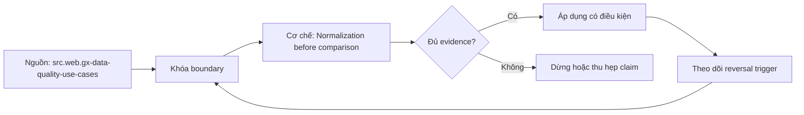

# Normalization before comparison

> [!abstract] Câu hỏi trung tâm
> Canonicalization nào cần làm trước reconciliation mà không xóa khác biệt có ý nghĩa?

## 1. Type normalization

String-number, decimal scale, timestamp precision và boolean encodings cần typed target có loss policy. Đừng bắt đầu bằng tên công cụ. Hãy bắt đầu bằng đối tượng được bảo vệ, boundary quan sát được và hậu quả nếu kết luận sai. Trong bài `Normalization before comparison`, câu hỏi thực dụng là: Canonicalization nào cần làm trước reconciliation mà không xóa khác biệt có ý nghĩa? Ta ghi rõ grain, population, time window, owner và hành động sau failure; nếu một trường chưa biết thì đánh dấu unknown thay vì lấp bằng mặc định. Bằng chứng tối thiểu gồm fixture có version, cấu hình hoặc rule đã resolve, raw observation, expected result và limitation. Phần này là curriculum synthesis dựa trên các nguồn đã định danh, không phải lời hứa rằng mọi adapter hay deployment đều có cùng hành vi.

## 2. Text normalization

Unicode form, whitespace, case và locale chỉ áp khi business identity cho phép; tên riêng không mặc nhiên case-insensitive. Điểm khó không nằm ở cú pháp mà ở identity và scope. Hai phép đo cùng tên vẫn có thể nói về hai population hoặc hai thời điểm khác nhau. Trong bài `Normalization before comparison`, câu hỏi thực dụng là: Canonicalization nào cần làm trước reconciliation mà không xóa khác biệt có ý nghĩa? Ta ghi rõ grain, population, time window, owner và hành động sau failure; nếu một trường chưa biết thì đánh dấu unknown thay vì lấp bằng mặc định. Bằng chứng tối thiểu gồm fixture có version, cấu hình hoặc rule đã resolve, raw observation, expected result và limitation. Phần này là curriculum synthesis dựa trên các nguồn đã định danh, không phải lời hứa rằng mọi adapter hay deployment đều có cùng hành vi.

## 3. Temporal normalization

Convert instant bằng known timezone, giữ original local/offset khi ambiguity có ý nghĩa. Một dashboard xanh chỉ là tín hiệu. Muốn biến nó thành bằng chứng phải giữ input, phiên bản, rule, trạng thái trước-sau và cách tính độc lập. Trong bài `Normalization before comparison`, câu hỏi thực dụng là: Canonicalization nào cần làm trước reconciliation mà không xóa khác biệt có ý nghĩa? Ta ghi rõ grain, population, time window, owner và hành động sau failure; nếu một trường chưa biết thì đánh dấu unknown thay vì lấp bằng mặc định. Bằng chứng tối thiểu gồm fixture có version, cấu hình hoặc rule đã resolve, raw observation, expected result và limitation. Phần này là curriculum synthesis dựa trên các nguồn đã định danh, không phải lời hứa rằng mọi adapter hay deployment đều có cùng hành vi.

## 4. Null and absence

NULL, empty, zero, missing field và sentinel là states khác nhau trừ khi contract hợp nhất chúng. Thiết kế tốt phải chịu được counterexample. Hãy chủ động tạo case sát boundary, case thiếu dữ liệu và case replay thay vì chỉ chạy happy path. Trong bài `Normalization before comparison`, câu hỏi thực dụng là: Canonicalization nào cần làm trước reconciliation mà không xóa khác biệt có ý nghĩa? Ta ghi rõ grain, population, time window, owner và hành động sau failure; nếu một trường chưa biết thì đánh dấu unknown thay vì lấp bằng mặc định. Bằng chứng tối thiểu gồm fixture có version, cấu hình hoặc rule đã resolve, raw observation, expected result và limitation. Phần này là curriculum synthesis dựa trên các nguồn đã định danh, không phải lời hứa rằng mọi adapter hay deployment đều có cùng hành vi.

## 5. Collection ordering

Chỉ sort arrays/maps khi semantics là set; event sequence và repeated fields có thể order-sensitive. Chi phí vận hành thuộc contract. Một rule đúng nhưng quá đắt, quá ồn hoặc không có owner sẽ nhanh chóng bị tắt và mất tác dụng. Trong bài `Normalization before comparison`, câu hỏi thực dụng là: Canonicalization nào cần làm trước reconciliation mà không xóa khác biệt có ý nghĩa? Ta ghi rõ grain, population, time window, owner và hành động sau failure; nếu một trường chưa biết thì đánh dấu unknown thay vì lấp bằng mặc định. Bằng chứng tối thiểu gồm fixture có version, cấu hình hoặc rule đã resolve, raw observation, expected result và limitation. Phần này là curriculum synthesis dựa trên các nguồn đã định danh, không phải lời hứa rằng mọi adapter hay deployment đều có cùng hành vi.

## 6. Canonical hash contract

Serialize field names, types, null markers, separators và version trước hash; collision/algorithm migration phải có kế hoạch. Kết luận cần có điều kiện đảo chiều. Khi volume, latency, nguồn thẩm quyền hoặc topology đổi, quyết định cũ phải được xem xét lại bằng cùng một oracle. Trong bài `Normalization before comparison`, câu hỏi thực dụng là: Canonicalization nào cần làm trước reconciliation mà không xóa khác biệt có ý nghĩa? Ta ghi rõ grain, population, time window, owner và hành động sau failure; nếu một trường chưa biết thì đánh dấu unknown thay vì lấp bằng mặc định. Bằng chứng tối thiểu gồm fixture có version, cấu hình hoặc rule đã resolve, raw observation, expected result và limitation. Phần này là curriculum synthesis dựa trên các nguồn đã định danh, không phải lời hứa rằng mọi adapter hay deployment đều có cùng hành vi.

## 7. Ma trận kiểm chứng từng mệnh đề

Với `wiki.data-quality.normalization-before-comparison`, command thành công không tự chứng minh dữ liệu đúng. Protocol riêng của bài là: Chạy fixture gốc và biến đổi/đối chiếu độc lập, giữ seed hoặc canonicalization version và chứng minh ít nhất một negative case bị bắt. Mỗi probe dưới đây phải nối input boundary với failure signal và oracle có thể phản bác kết luận.

### 7.1. Normalization before comparison: kiểm `Type normalization` bằng case 1, cụ thể string-number, decimal scale, timestamp precision và boolean encodings cần typed target có loss policy

**Mệnh đề cần kiểm.** Normalization before comparison: kiểm `Type normalization` bằng case 1, cụ thể string-number, decimal scale, timestamp precision và boolean encodings cần typed target có loss policy.

**Thiết kế phép thử cho `wiki.data-quality.normalization-before-comparison`.** Trong ngữ cảnh `wiki.data-quality.normalization-before-comparison`, tạo positive control và negative control chỉ khác đúng một điều kiện. Khóa input snapshot, phiên bản và owner của rule; chạy đúng population được bài `Normalization before comparison` công bố.

**Bằng chứng cần giữ.** Đối với probe 1 của `Normalization before comparison`, giữ fixture, raw failing rows và lệnh tái hiện. Nếu chưa chạy lab, ghi expected evidence và giữ trạng thái review; không biến protocol thành observation.

### 7.2. Normalization before comparison: kiểm `Text normalization` bằng case 2, cụ thể unicode form, whitespace, case và locale chỉ áp khi business identity cho phép; tên riêng không mặc nhiên case-insensitive

**Mệnh đề cần kiểm.** Normalization before comparison: kiểm `Text normalization` bằng case 2, cụ thể unicode form, whitespace, case và locale chỉ áp khi business identity cho phép; tên riêng không mặc nhiên case-insensitive.

**Thiết kế phép thử cho `wiki.data-quality.normalization-before-comparison`.** Trong ngữ cảnh `wiki.data-quality.normalization-before-comparison`, đổi grain nhưng giữ tổng số dòng để lộ phép đo sai cấp. Khóa input snapshot, phiên bản và owner của rule; chạy đúng population được bài `Normalization before comparison` công bố.

**Bằng chứng cần giữ.** Đối với probe 2 của `Normalization before comparison`, báo numerator, denominator và key set ở cả hai grain. Nếu chưa chạy lab, ghi expected evidence và giữ trạng thái review; không biến protocol thành observation.

### 7.3. Normalization before comparison: kiểm `Temporal normalization` bằng case 3, cụ thể convert instant bằng known timezone, giữ original local/offset khi ambiguity có ý nghĩa

**Mệnh đề cần kiểm.** Normalization before comparison: kiểm `Temporal normalization` bằng case 3, cụ thể convert instant bằng known timezone, giữ original local/offset khi ambiguity có ý nghĩa.

**Thiết kế phép thử cho `wiki.data-quality.normalization-before-comparison`.** Trong ngữ cảnh `wiki.data-quality.normalization-before-comparison`, đưa một giá trị tới đúng boundary và một giá trị vượt boundary. Khóa input snapshot, phiên bản và owner của rule; chạy đúng population được bài `Normalization before comparison` công bố.

**Bằng chứng cần giữ.** Đối với probe 3 của `Normalization before comparison`, lưu hai observed values cùng rule đã resolve. Nếu chưa chạy lab, ghi expected evidence và giữ trạng thái review; không biến protocol thành observation.

### 7.4. Normalization before comparison: kiểm `Null and absence` bằng case 4, cụ thể null, empty, zero, missing field và sentinel là states khác nhau trừ khi contract hợp nhất chúng

**Mệnh đề cần kiểm.** Normalization before comparison: kiểm `Null and absence` bằng case 4, cụ thể null, empty, zero, missing field và sentinel là states khác nhau trừ khi contract hợp nhất chúng.

**Thiết kế phép thử cho `wiki.data-quality.normalization-before-comparison`.** Trong ngữ cảnh `wiki.data-quality.normalization-before-comparison`, kill tiến trình ngay trước rồi ngay sau durable side effect. Khóa input snapshot, phiên bản và owner của rule; chạy đúng population được bài `Normalization before comparison` công bố.

**Bằng chứng cần giữ.** Đối với probe 4 của `Normalization before comparison`, lưu checkpoint, external ledger và trạng thái sau restart. Nếu chưa chạy lab, ghi expected evidence và giữ trạng thái review; không biến protocol thành observation.

### 7.5. Normalization before comparison: kiểm `Collection ordering` bằng case 5, cụ thể chỉ sort arrays/maps khi semantics là set; event sequence và repeated fields có thể order-sensitive

**Mệnh đề cần kiểm.** Normalization before comparison: kiểm `Collection ordering` bằng case 5, cụ thể chỉ sort arrays/maps khi semantics là set; event sequence và repeated fields có thể order-sensitive.

**Thiết kế phép thử cho `wiki.data-quality.normalization-before-comparison`.** Trong ngữ cảnh `wiki.data-quality.normalization-before-comparison`, đảo thứ tự input và concurrency nhưng giữ logical population. Khóa input snapshot, phiên bản và owner của rule; chạy đúng population được bài `Normalization before comparison` công bố.

**Bằng chứng cần giữ.** Đối với probe 5 của `Normalization before comparison`, so canonical hash và business totals giữa các thứ tự. Nếu chưa chạy lab, ghi expected evidence và giữ trạng thái review; không biến protocol thành observation.

### 7.6. Normalization before comparison: kiểm `Canonical hash contract` bằng case 6, cụ thể serialize field names, types, null markers, separators và version trước hash; collision/algorithm migration phải có kế hoạch

**Mệnh đề cần kiểm.** Normalization before comparison: kiểm `Canonical hash contract` bằng case 6, cụ thể serialize field names, types, null markers, separators và version trước hash; collision/algorithm migration phải có kế hoạch.

**Thiết kế phép thử cho `wiki.data-quality.normalization-before-comparison`.** Trong ngữ cảnh `wiki.data-quality.normalization-before-comparison`, replay cùng identity với payload giống rồi payload xung đột. Khóa input snapshot, phiên bản và owner của rule; chạy đúng population được bài `Normalization before comparison` công bố.

**Bằng chứng cần giữ.** Đối với probe 6 của `Normalization before comparison`, tách duplicate replay khỏi identity collision bằng reason code. Nếu chưa chạy lab, ghi expected evidence và giữ trạng thái review; không biến protocol thành observation.

### 7.7. Normalization before comparison: kiểm `Type normalization` bằng case 7, cụ thể string-number, decimal scale, timestamp precision và boolean encodings cần typed target có loss policy

**Mệnh đề cần kiểm.** Normalization before comparison: kiểm `Type normalization` bằng case 7, cụ thể string-number, decimal scale, timestamp precision và boolean encodings cần typed target có loss policy.

**Thiết kế phép thử cho `wiki.data-quality.normalization-before-comparison`.** Trong ngữ cảnh `wiki.data-quality.normalization-before-comparison`, thêm record tới trễ trong horizon và ngoài horizon. Khóa input snapshot, phiên bản và owner của rule; chạy đúng population được bài `Normalization before comparison` công bố.

**Bằng chứng cần giữ.** Đối với probe 7 của `Normalization before comparison`, báo accepted-late, rejected-late và oldest outstanding timestamp. Nếu chưa chạy lab, ghi expected evidence và giữ trạng thái review; không biến protocol thành observation.

### 7.8. Normalization before comparison: kiểm `Text normalization` bằng case 8, cụ thể unicode form, whitespace, case và locale chỉ áp khi business identity cho phép; tên riêng không mặc nhiên case-insensitive

**Mệnh đề cần kiểm.** Normalization before comparison: kiểm `Text normalization` bằng case 8, cụ thể unicode form, whitespace, case và locale chỉ áp khi business identity cho phép; tên riêng không mặc nhiên case-insensitive.

**Thiết kế phép thử cho `wiki.data-quality.normalization-before-comparison`.** Trong ngữ cảnh `wiki.data-quality.normalization-before-comparison`, đổi schema theo một cách tương thích rồi một cách phá vỡ semantics. Khóa input snapshot, phiên bản và owner của rule; chạy đúng population được bài `Normalization before comparison` công bố.

**Bằng chứng cần giữ.** Đối với probe 8 của `Normalization before comparison`, giữ schema diff, classification và consumer-visible result. Nếu chưa chạy lab, ghi expected evidence và giữ trạng thái review; không biến protocol thành observation.

### 7.9. Normalization before comparison: kiểm `Temporal normalization` bằng case 9, cụ thể convert instant bằng known timezone, giữ original local/offset khi ambiguity có ý nghĩa

**Mệnh đề cần kiểm.** Normalization before comparison: kiểm `Temporal normalization` bằng case 9, cụ thể convert instant bằng known timezone, giữ original local/offset khi ambiguity có ý nghĩa.

**Thiết kế phép thử cho `wiki.data-quality.normalization-before-comparison`.** Trong ngữ cảnh `wiki.data-quality.normalization-before-comparison`, tạo missing và duplicate bù nhau để count tổng không đổi. Khóa input snapshot, phiên bản và owner của rule; chạy đúng population được bài `Normalization before comparison` công bố.

**Bằng chứng cần giữ.** Đối với probe 9 của `Normalization before comparison`, so key multiset và typed hashes thay vì chỉ row count. Nếu chưa chạy lab, ghi expected evidence và giữ trạng thái review; không biến protocol thành observation.

### 7.10. Normalization before comparison: kiểm `Null and absence` bằng case 10, cụ thể null, empty, zero, missing field và sentinel là states khác nhau trừ khi contract hợp nhất chúng

**Mệnh đề cần kiểm.** Normalization before comparison: kiểm `Null and absence` bằng case 10, cụ thể null, empty, zero, missing field và sentinel là states khác nhau trừ khi contract hợp nhất chúng.

**Thiết kế phép thử cho `wiki.data-quality.normalization-before-comparison`.** Trong ngữ cảnh `wiki.data-quality.normalization-before-comparison`, cho reviewer tái hiện chỉ từ evidence package. Khóa input snapshot, phiên bản và owner của rule; chạy đúng population được bài `Normalization before comparison` công bố.

**Bằng chứng cần giữ.** Đối với probe 10 của `Normalization before comparison`, package phải đủ để người khác dựng lại decision và limitation. Nếu chưa chạy lab, ghi expected evidence và giữ trạng thái review; không biến protocol thành observation.

### 7.11. Normalization before comparison: kiểm `Collection ordering` bằng case 11, cụ thể chỉ sort arrays/maps khi semantics là set; event sequence và repeated fields có thể order-sensitive

**Mệnh đề cần kiểm.** Normalization before comparison: kiểm `Collection ordering` bằng case 11, cụ thể chỉ sort arrays/maps khi semantics là set; event sequence và repeated fields có thể order-sensitive.

**Thiết kế phép thử cho `wiki.data-quality.normalization-before-comparison`.** Trong ngữ cảnh `wiki.data-quality.normalization-before-comparison`, so với oracle độc lập không dùng chung query hoặc parser. Khóa input snapshot, phiên bản và owner của rule; chạy đúng population được bài `Normalization before comparison` công bố.

**Bằng chứng cần giữ.** Đối với probe 11 của `Normalization before comparison`, independent result phải khớp ở grain đã công bố. Nếu chưa chạy lab, ghi expected evidence và giữ trạng thái review; không biến protocol thành observation.

### 7.12. Normalization before comparison: kiểm `Canonical hash contract` bằng case 12, cụ thể serialize field names, types, null markers, separators và version trước hash; collision/algorithm migration phải có kế hoạch

**Mệnh đề cần kiểm.** Normalization before comparison: kiểm `Canonical hash contract` bằng case 12, cụ thể serialize field names, types, null markers, separators và version trước hash; collision/algorithm migration phải có kế hoạch.

**Thiết kế phép thử cho `wiki.data-quality.normalization-before-comparison`.** Trong ngữ cảnh `wiki.data-quality.normalization-before-comparison`, chạy scope hẹp và population đầy đủ rồi công bố phần bị loại. Khóa input snapshot, phiên bản và owner của rule; chạy đúng population được bài `Normalization before comparison` công bố.

**Bằng chứng cần giữ.** Đối với probe 12 của `Normalization before comparison`, coverage phải nêu rõ excluded nodes, partitions hoặc incidents. Nếu chưa chạy lab, ghi expected evidence và giữ trạng thái review; không biến protocol thành observation.

### 7.13. Normalization before comparison: kiểm `Type normalization` bằng case 13, cụ thể string-number, decimal scale, timestamp precision và boolean encodings cần typed target có loss policy

**Mệnh đề cần kiểm.** Normalization before comparison: kiểm `Type normalization` bằng case 13, cụ thể string-number, decimal scale, timestamp precision và boolean encodings cần typed target có loss policy.

**Thiết kế phép thử cho `wiki.data-quality.normalization-before-comparison`.** Trong ngữ cảnh `wiki.data-quality.normalization-before-comparison`, thử timezone, precision hoặc partition ở hai phía của ranh giới. Khóa input snapshot, phiên bản và owner của rule; chạy đúng population được bài `Normalization before comparison` công bố.

**Bằng chứng cần giữ.** Đối với probe 13 của `Normalization before comparison`, UTC/local interval và rounding policy phải hiện trong output. Nếu chưa chạy lab, ghi expected evidence và giữ trạng thái review; không biến protocol thành observation.

### 7.14. Normalization before comparison: kiểm `Text normalization` bằng case 14, cụ thể unicode form, whitespace, case và locale chỉ áp khi business identity cho phép; tên riêng không mặc nhiên case-insensitive

**Mệnh đề cần kiểm.** Normalization before comparison: kiểm `Text normalization` bằng case 14, cụ thể unicode form, whitespace, case và locale chỉ áp khi business identity cho phép; tên riêng không mặc nhiên case-insensitive.

**Thiết kế phép thử cho `wiki.data-quality.normalization-before-comparison`.** Trong ngữ cảnh `wiki.data-quality.normalization-before-comparison`, đổi constraint đủ lớn để quyết định phải đảo. Khóa input snapshot, phiên bản và owner của rule; chạy đúng population được bài `Normalization before comparison` công bố.

**Bằng chứng cần giữ.** Đối với probe 14 của `Normalization before comparison`, ADR phải lưu changed constraint và reversal threshold. Nếu chưa chạy lab, ghi expected evidence và giữ trạng thái review; không biến protocol thành observation.

### 7.15. Normalization before comparison: kiểm `Temporal normalization` bằng case 15, cụ thể convert instant bằng known timezone, giữ original local/offset khi ambiguity có ý nghĩa

**Mệnh đề cần kiểm.** Normalization before comparison: kiểm `Temporal normalization` bằng case 15, cụ thể convert instant bằng known timezone, giữ original local/offset khi ambiguity có ý nghĩa.

**Thiết kế phép thử cho `wiki.data-quality.normalization-before-comparison`.** Trong ngữ cảnh `wiki.data-quality.normalization-before-comparison`, chạy lại từ môi trường sạch với versions và seed đã khóa. Khóa input snapshot, phiên bản và owner của rule; chạy đúng population được bài `Normalization before comparison` công bố.

**Bằng chứng cần giữ.** Đối với probe 15 của `Normalization before comparison`, canonical result phải ổn định hoặc mọi nondeterminism phải được giải thích. Nếu chưa chạy lab, ghi expected evidence và giữ trạng thái review; không biến protocol thành observation.

## 8. Quy trình phản biện

1. Viết consumer-visible invariant cho `Normalization before comparison` trước khi chọn query hoặc tool.
2. Khóa grain, identity, population, time window và authoritative source.
3. Phân biệt declared configuration, executed state và published state.
4. Chạy negative control, replay hoặc changed-assumption case phù hợp.
5. Đối soát bằng oracle độc lập; công bố coverage và phần không quan sát được.
6. Gắn owner, hành động, reversal trigger và hạn review cho kết luận.

## 9. Câu hỏi tự kiểm tra

1. `Normalization before comparison: kiểm `Type normalization` bằng case 1, cụ thể string-number, decimal scale, timestamp precision và boolean encodings cần typed target có loss policy` thất bại đầu tiên ở boundary nào?
2. Artifact nào mạnh nhất để trả lời `Normalization before comparison: kiểm `Temporal normalization` bằng case 3, cụ thể convert instant bằng known timezone, giữ original local/offset khi ambiguity có ý nghĩa`?
3. Counterexample nhỏ nhất cho `Normalization before comparison: kiểm `Canonical hash contract` bằng case 6, cụ thể serialize field names, types, null markers, separators và version trước hash; collision/algorithm migration phải có kế hoạch` gồm những state nào?
4. `Normalization before comparison: kiểm `Temporal normalization` bằng case 9, cụ thể convert instant bằng known timezone, giữ original local/offset khi ambiguity có ý nghĩa` có thể xanh giả ra sao?
5. Constraint nào khiến quyết định ở `Normalization before comparison: kiểm `Text normalization` bằng case 14, cụ thể unicode form, whitespace, case và locale chỉ áp khi business identity cho phép; tên riêng không mặc nhiên case-insensitive` phải đảo?
6. Phần nào của `Normalization before comparison: kiểm `Temporal normalization` bằng case 15, cụ thể convert instant bằng known timezone, giữ original local/offset khi ambiguity có ý nghĩa` mới là protocol, chưa phải observation?

## 10. Giới hạn và điều chưa cho phép kết luận

- Lab của `Normalization before comparison` chưa chạy trên hệ thống production; nội dung là giáo trình và expected evidence.
- Hành vi phụ thuộc phiên bản, connector, scheduler, warehouse và catalog configuration phải được kiểm lại.
- Các ma trận, ladder và threshold do giáo trình tổng hợp không được gán nguyên văn cho vendor.
- Note giữ trạng thái `review` cho tới khi owner duyệt semantics và learner artifact.

## Reference
1. [[SRC-GX-DATA-QUALITY-USE-CASES]]
2. [[SRC-GX-EXPECTATIONS]]

## Source coverage

| Source slice | Nội dung sử dụng | Trạng thái |
|---|---|---|
| [[SRC-GX-DATA-QUALITY-USE-CASES]] | Contract hoặc cơ chế liên quan trực tiếp tới `Normalization before comparison` | Đã đọc locator; cần pin version khi chạy lab |
| [[SRC-GX-EXPECTATIONS]] | Contract hoặc cơ chế liên quan trực tiếp tới `Normalization before comparison` | Đã đọc locator; cần pin version khi chạy lab |

## Key takeaways
- Normalization là contract có version; canonicalization quá tay có thể che defect.
- Với `wiki.data-quality.normalization-before-comparison`, quality của kết luận phụ thuộc identity, coverage và oracle chứ không phụ thuộc màu dashboard.
- Câu hỏi `Canonicalization nào cần làm trước reconciliation mà không xóa khác biệt có ý nghĩa?` chỉ được trả lời trong scope và version đã ghi.
- Các source IDs `src.web.gx-data-quality-use-cases, src.web.gx-expectations` đặt ranh giới cho source fact; phần còn lại là synthesis có nhãn.
- Trước khi lab chạy, đây là note đã kiểm cấu trúc và provenance, chưa phải chứng nhận production.

<!-- ATOMIC-EXECUTION-CAPSULE:START -->

## Execution capsule: kiểm chứng `wiki.data-quality.normalization-before-comparison`

> [!important] Phân loại mệnh đề
> Với `wiki.data-quality.normalization-before-comparison`, sơ đồ, ví dụ và artifact về **Normalization before comparison** là **synthesis để kiểm chứng**; chúng không phải trích dẫn hay case nguyên văn của nguồn.

### Sơ đồ cơ chế và điểm kiểm soát



Đọc sơ đồ `wiki.data-quality.normalization-before-comparison` từ trái sang phải: source chỉ cung cấp claim ban đầu cho **Normalization before comparison**; quyết định chỉ được đi tiếp sau khi boundary, evidence và điều kiện đảo quyết định đã hiện hữu.

### Artifact thực thi tối thiểu

```sql
-- Verification harness for: Normalization before comparison
WITH evidence AS (
    SELECT 'wiki.data-quality.normalization-before-comparison' AS concept_id,
           'boundary_declared' AS check_name, 1 AS passed
    UNION ALL
    SELECT 'wiki.data-quality.normalization-before-comparison', 'independent_oracle', 1
    UNION ALL
    SELECT 'wiki.data-quality.normalization-before-comparison', 'reversal_trigger_recorded', 1
)
SELECT concept_id,
       MIN(passed) AS all_hard_checks_pass,
       COUNT(*) AS evidence_items
FROM evidence
GROUP BY concept_id
HAVING MIN(passed) = 1;
```

Artifact của `wiki.data-quality.normalization-before-comparison` buộc người dùng ghi boundary, oracle và reversal trigger cho **Normalization before comparison**. Các giá trị minh họa phải được thay bằng evidence thật trước khi dùng cho quyết định.

### Tự kiểm tra trước khi tái sử dụng

1. Bạn có thể trả lời `Canonicalization nào cần làm trước reconciliation mà không xóa khác biệt có ý nghĩa?` bằng một câu mà không kéo thêm concept thứ hai không?
2. Source locator nào đỡ cho claim, và phần nào chỉ là synthesis trong note?
3. Observation nào khiến bạn dừng, thu hẹp hoặc đảo quyết định?
4. Artifact nào cho phép một reviewer độc lập tái hiện kết quả?

<!-- ATOMIC-EXECUTION-CAPSULE:END -->
