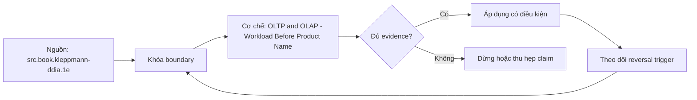

# OLTP and OLAP - Workload Before Product Name

> [!abstract] Câu hỏi trung tâm
> Phân loại OLTP, OLAP và vùng lai bằng workload shape như thế nào, rồi suy ra yêu cầu storage, execution và isolation mà không dựa vào nhãn sản phẩm?

## 1. Workload là vector, không phải nhãn

Ghi ít nhất năm chiều: rows touched/query, columns touched/query, read/write mix và mutation shape, latency/throughput target, concurrent sessions. Bổ sung history horizon, query predictability, consistency/freshness và burst pattern khi chúng đổi lựa chọn. OLTP điển hình point/range nhỏ, cập nhật từ user input, tail latency thấp và concurrency cao. OLAP điển hình quét/aggregate nhiều rows, projection hẹp, bulk/stream ingest và latency tính bằng giây. Đây là profiles, không phải luật: workload cụ thể có thể nằm giữa hoặc có nhiều classes đồng thời.

## 2. Từ vector tới bottleneck

Point lookup phụ thuộc index traversal, random access, latch/lock/MVCC và log durability; scan lớn phụ thuộc bytes read, sequential bandwidth, decompression, memory bandwidth, CPU cache và parallel aggregation. Rows và columns phải quy về byte/operation estimates: mười columns kiểu rộng có thể lớn hơn năm mươi boolean columns. Concurrency biến một query nhanh thành workload quá tải qua queueing. p50 không thay p95/p99; average bytes không cho thấy spill hoặc skew. Phân loại tốt dự đoán resource saturation, không chỉ gọi tên OLTP/OLAP.

## 3. Hệ quả kiến trúc

Workload point-update thường ưu tiên row locality, indexes, WAL, fine-grained concurrency và bounded transactions. Workload scan ưu tiên column projection, encoding/compression, vectorized operators, zone/partition pruning và batch writes. C-Store trình bày một thiết kế read-optimized với projections, compressed columns và tách write/read structures; đó là một kiến trúc cụ thể, không phải định nghĩa OLAP. SQL interface giống nhau không làm storage path giống nhau. Một engine có thể có row và column representations cho classes khác nhau.

## 4. Tách tải và tính nhất quán

Chạy analytic query trên primary có thể tranh CPU, memory, buffer cache, I/O và locks với transactions. Read replica tách một phần compute nhưng không tự xóa tác động: WAL generation/retention, replay lag, network, storage, failover readiness và long snapshots vẫn cần đo. Warehouse/lakehouse thêm ingestion lag và reconciliation boundary. Quyết định tách hệ ghi freshness tolerance, source impact, failure isolation, data contract và cost; không mặc định copy là miễn phí hoặc luôn cần.

## 5. HTAP và vùng lai

Hybrid transactional/analytical processing có thể dùng dual engines, column replicas, in-memory structures hoặc workload isolation. Hệ lai giảm movement/freshness gap trong một số cases nhưng vẫn có resource governance, update propagation, consistency và cost trade-offs. Một operational dashboard quét vài triệu rows mỗi phút có thể là analytical workload dù nằm trong ứng dụng. Một lookup trong warehouse vẫn là point query. Phân loại theo từng query class và service-level objective, không gán toàn database một nhãn duy nhất.

## 6. Ba dấu hiệu đặt nhầm

Dấu hiệu 1: query plan/read metrics cho thấy scan lớn trên hệ có tail-latency transaction đang tăng. Dấu hiệu 2: hàng nghìn point updates/upserts nhỏ vào cấu trúc tối ưu batch tạo write amplification/merge pressure và freshness queue. Dấu hiệu 3: một hệ phải đồng thời giữ p99 mili giây và phục vụ unbounded ad-hoc scans nhưng không có admission control/workload isolation. Triệu chứng chưa đủ kết luận; cần correlate query class với resource, lag, latency và business deadline.

## 7. Bài phân loại có đối chứng

Sáu cases gồm checkout write, account lookup, daily revenue scan, customer-360 interactive query, near-real-time anomaly aggregate và bulk correction. Mỗi case chấm năm chiều bằng range có unit, chỉ ra unknowns, chọn architecture và reversal conditions. Hai cases ranh giới phải có điều kiện đẩy sang mỗi phía. Benchmark dùng cùng logical dataset/query/answer, ghi engine/version, indexes/layout, cache state, concurrency và bytes read. Kết quả chỉ áp cho cấu hình đó; không biến một lần đo thành tuyên bố engine phổ quát.

## 8. Ma trận kiểm chứng từng mệnh đề

Mỗi kết luận cần input, observation và failure signal có thể lưu. Tên sản phẩm, file nhỏ, query nhanh hoặc presentation thuyết phục không tự chứng minh cơ chế hay năng lực.

### 8.1. OLTP OLAP là workload profiles không phải product labels

**Mệnh đề cần kiểm.** OLTP OLAP là workload profiles không phải product labels.

**Cách kiểm.** Chấm workload vector có unit, đo plans/resources trên cùng logical case và thay concurrency, projection width hoặc freshness constraint. Ghi điều kiện làm architecture choice phải đảo. Với mệnh đề này, ghi dataset/contract version, environment, controlled variables, expected observation, failure signal và boundary làm kết luận mất hiệu lực.

**Bằng chứng đạt cho `wiki.olap.oltp-olap-workload-shape`.** Lưu fixture hoặc source slice, command/query/protocol, raw output, counters/diff, reviewer và artifact hash. Nếu lab chưa chạy trên môi trường được phép, chỉ ghi protocol và expected result; không viết như kết quả đã quan sát.

### 8.2. rows touched cần đổi thành bytes và operations

**Mệnh đề cần kiểm.** rows touched cần đổi thành bytes và operations.

**Cách kiểm.** Chấm workload vector có unit, đo plans/resources trên cùng logical case và thay concurrency, projection width hoặc freshness constraint. Ghi điều kiện làm architecture choice phải đảo. Với mệnh đề này, ghi dataset/contract version, environment, controlled variables, expected observation, failure signal và boundary làm kết luận mất hiệu lực.

**Bằng chứng đạt cho `wiki.olap.oltp-olap-workload-shape`.** Lưu fixture hoặc source slice, command/query/protocol, raw output, counters/diff, reviewer và artifact hash. Nếu lab chưa chạy trên môi trường được phép, chỉ ghi protocol và expected result; không viết như kết quả đã quan sát.

### 8.3. column width làm số cột không đủ dự đoán bytes

**Mệnh đề cần kiểm.** column width làm số cột không đủ dự đoán bytes.

**Cách kiểm.** Chấm workload vector có unit, đo plans/resources trên cùng logical case và thay concurrency, projection width hoặc freshness constraint. Ghi điều kiện làm architecture choice phải đảo. Với mệnh đề này, ghi dataset/contract version, environment, controlled variables, expected observation, failure signal và boundary làm kết luận mất hiệu lực.

**Bằng chứng đạt cho `wiki.olap.oltp-olap-workload-shape`.** Lưu fixture hoặc source slice, command/query/protocol, raw output, counters/diff, reviewer và artifact hash. Nếu lab chưa chạy trên môi trường được phép, chỉ ghi protocol và expected result; không viết như kết quả đã quan sát.

### 8.4. tail latency và concurrency thuộc workload contract

**Mệnh đề cần kiểm.** tail latency và concurrency thuộc workload contract.

**Cách kiểm.** Chấm workload vector có unit, đo plans/resources trên cùng logical case và thay concurrency, projection width hoặc freshness constraint. Ghi điều kiện làm architecture choice phải đảo. Với mệnh đề này, ghi dataset/contract version, environment, controlled variables, expected observation, failure signal và boundary làm kết luận mất hiệu lực.

**Bằng chứng đạt cho `wiki.olap.oltp-olap-workload-shape`.** Lưu fixture hoặc source slice, command/query/protocol, raw output, counters/diff, reviewer và artifact hash. Nếu lab chưa chạy trên môi trường được phép, chỉ ghi protocol và expected result; không viết như kết quả đã quan sát.

### 8.5. point lookup và scan lớn có bottleneck khác nhau

**Mệnh đề cần kiểm.** point lookup và scan lớn có bottleneck khác nhau.

**Cách kiểm.** Chấm workload vector có unit, đo plans/resources trên cùng logical case và thay concurrency, projection width hoặc freshness constraint. Ghi điều kiện làm architecture choice phải đảo. Với mệnh đề này, ghi dataset/contract version, environment, controlled variables, expected observation, failure signal và boundary làm kết luận mất hiệu lực.

**Bằng chứng đạt cho `wiki.olap.oltp-olap-workload-shape`.** Lưu fixture hoặc source slice, command/query/protocol, raw output, counters/diff, reviewer và artifact hash. Nếu lab chưa chạy trên môi trường được phép, chỉ ghi protocol và expected result; không viết như kết quả đã quan sát.

### 8.6. SQL interface chung không chứng minh storage path chung

**Mệnh đề cần kiểm.** SQL interface chung không chứng minh storage path chung.

**Cách kiểm.** Chấm workload vector có unit, đo plans/resources trên cùng logical case và thay concurrency, projection width hoặc freshness constraint. Ghi điều kiện làm architecture choice phải đảo. Với mệnh đề này, ghi dataset/contract version, environment, controlled variables, expected observation, failure signal và boundary làm kết luận mất hiệu lực.

**Bằng chứng đạt cho `wiki.olap.oltp-olap-workload-shape`.** Lưu fixture hoặc source slice, command/query/protocol, raw output, counters/diff, reviewer và artifact hash. Nếu lab chưa chạy trên môi trường được phép, chỉ ghi protocol và expected result; không viết như kết quả đã quan sát.

### 8.7. read replica chỉ tách một phần resource contention

**Mệnh đề cần kiểm.** read replica chỉ tách một phần resource contention.

**Cách kiểm.** Chấm workload vector có unit, đo plans/resources trên cùng logical case và thay concurrency, projection width hoặc freshness constraint. Ghi điều kiện làm architecture choice phải đảo. Với mệnh đề này, ghi dataset/contract version, environment, controlled variables, expected observation, failure signal và boundary làm kết luận mất hiệu lực.

**Bằng chứng đạt cho `wiki.olap.oltp-olap-workload-shape`.** Lưu fixture hoặc source slice, command/query/protocol, raw output, counters/diff, reviewer và artifact hash. Nếu lab chưa chạy trên môi trường được phép, chỉ ghi protocol và expected result; không viết như kết quả đã quan sát.

### 8.8. replica lag và WAL retention vẫn là operational cost

**Mệnh đề cần kiểm.** replica lag và WAL retention vẫn là operational cost.

**Cách kiểm.** Chấm workload vector có unit, đo plans/resources trên cùng logical case và thay concurrency, projection width hoặc freshness constraint. Ghi điều kiện làm architecture choice phải đảo. Với mệnh đề này, ghi dataset/contract version, environment, controlled variables, expected observation, failure signal và boundary làm kết luận mất hiệu lực.

**Bằng chứng đạt cho `wiki.olap.oltp-olap-workload-shape`.** Lưu fixture hoặc source slice, command/query/protocol, raw output, counters/diff, reviewer và artifact hash. Nếu lab chưa chạy trên môi trường được phép, chỉ ghi protocol và expected result; không viết như kết quả đã quan sát.

### 8.9. warehouse separation thêm freshness boundary

**Mệnh đề cần kiểm.** warehouse separation thêm freshness boundary.

**Cách kiểm.** Chấm workload vector có unit, đo plans/resources trên cùng logical case và thay concurrency, projection width hoặc freshness constraint. Ghi điều kiện làm architecture choice phải đảo. Với mệnh đề này, ghi dataset/contract version, environment, controlled variables, expected observation, failure signal và boundary làm kết luận mất hiệu lực.

**Bằng chứng đạt cho `wiki.olap.oltp-olap-workload-shape`.** Lưu fixture hoặc source slice, command/query/protocol, raw output, counters/diff, reviewer và artifact hash. Nếu lab chưa chạy trên môi trường được phép, chỉ ghi protocol và expected result; không viết như kết quả đã quan sát.

### 8.10. HTAP không xóa isolation và propagation trade-offs

**Mệnh đề cần kiểm.** HTAP không xóa isolation và propagation trade-offs.

**Cách kiểm.** Chấm workload vector có unit, đo plans/resources trên cùng logical case và thay concurrency, projection width hoặc freshness constraint. Ghi điều kiện làm architecture choice phải đảo. Với mệnh đề này, ghi dataset/contract version, environment, controlled variables, expected observation, failure signal và boundary làm kết luận mất hiệu lực.

**Bằng chứng đạt cho `wiki.olap.oltp-olap-workload-shape`.** Lưu fixture hoặc source slice, command/query/protocol, raw output, counters/diff, reviewer và artifact hash. Nếu lab chưa chạy trên môi trường được phép, chỉ ghi protocol và expected result; không viết như kết quả đã quan sát.

### 8.11. operational dashboard có thể mang analytical workload

**Mệnh đề cần kiểm.** operational dashboard có thể mang analytical workload.

**Cách kiểm.** Chấm workload vector có unit, đo plans/resources trên cùng logical case và thay concurrency, projection width hoặc freshness constraint. Ghi điều kiện làm architecture choice phải đảo. Với mệnh đề này, ghi dataset/contract version, environment, controlled variables, expected observation, failure signal và boundary làm kết luận mất hiệu lực.

**Bằng chứng đạt cho `wiki.olap.oltp-olap-workload-shape`.** Lưu fixture hoặc source slice, command/query/protocol, raw output, counters/diff, reviewer và artifact hash. Nếu lab chưa chạy trên môi trường được phép, chỉ ghi protocol và expected result; không viết như kết quả đã quan sát.

### 8.12. point query trong warehouse không biến thành OLTP system

**Mệnh đề cần kiểm.** point query trong warehouse không biến thành OLTP system.

**Cách kiểm.** Chấm workload vector có unit, đo plans/resources trên cùng logical case và thay concurrency, projection width hoặc freshness constraint. Ghi điều kiện làm architecture choice phải đảo. Với mệnh đề này, ghi dataset/contract version, environment, controlled variables, expected observation, failure signal và boundary làm kết luận mất hiệu lực.

**Bằng chứng đạt cho `wiki.olap.oltp-olap-workload-shape`.** Lưu fixture hoặc source slice, command/query/protocol, raw output, counters/diff, reviewer và artifact hash. Nếu lab chưa chạy trên môi trường được phép, chỉ ghi protocol và expected result; không viết như kết quả đã quan sát.

### 8.13. misplacement cần correlate query class với saturation

**Mệnh đề cần kiểm.** misplacement cần correlate query class với saturation.

**Cách kiểm.** Chấm workload vector có unit, đo plans/resources trên cùng logical case và thay concurrency, projection width hoặc freshness constraint. Ghi điều kiện làm architecture choice phải đảo. Với mệnh đề này, ghi dataset/contract version, environment, controlled variables, expected observation, failure signal và boundary làm kết luận mất hiệu lực.

**Bằng chứng đạt cho `wiki.olap.oltp-olap-workload-shape`.** Lưu fixture hoặc source slice, command/query/protocol, raw output, counters/diff, reviewer và artifact hash. Nếu lab chưa chạy trên môi trường được phép, chỉ ghi protocol và expected result; không viết như kết quả đã quan sát.

### 8.14. benchmark phải khóa cache concurrency và physical design

**Mệnh đề cần kiểm.** benchmark phải khóa cache concurrency và physical design.

**Cách kiểm.** Chấm workload vector có unit, đo plans/resources trên cùng logical case và thay concurrency, projection width hoặc freshness constraint. Ghi điều kiện làm architecture choice phải đảo. Với mệnh đề này, ghi dataset/contract version, environment, controlled variables, expected observation, failure signal và boundary làm kết luận mất hiệu lực.

**Bằng chứng đạt cho `wiki.olap.oltp-olap-workload-shape`.** Lưu fixture hoặc source slice, command/query/protocol, raw output, counters/diff, reviewer và artifact hash. Nếu lab chưa chạy trên môi trường được phép, chỉ ghi protocol và expected result; không viết như kết quả đã quan sát.

### 8.15. reversal conditions quan trọng hơn tên công nghệ

**Mệnh đề cần kiểm.** reversal conditions quan trọng hơn tên công nghệ.

**Cách kiểm.** Chấm workload vector có unit, đo plans/resources trên cùng logical case và thay concurrency, projection width hoặc freshness constraint. Ghi điều kiện làm architecture choice phải đảo. Với mệnh đề này, ghi dataset/contract version, environment, controlled variables, expected observation, failure signal và boundary làm kết luận mất hiệu lực.

**Bằng chứng đạt cho `wiki.olap.oltp-olap-workload-shape`.** Lưu fixture hoặc source slice, command/query/protocol, raw output, counters/diff, reviewer và artifact hash. Nếu lab chưa chạy trên môi trường được phép, chỉ ghi protocol và expected result; không viết như kết quả đã quan sát.

## 9. Quy trình phản biện

1. Chốt decision hoặc workload, grain, version và constraints trước khi chọn implementation.
2. Tách logical semantics, physical mechanism, observed metric và business conclusion.
3. Khóa controlled variables; ghi rõ confounders còn lại và instrumentation boundary.
4. Kiểm correctness trước performance, đồng thời giữ negative và changed-constraint cases.
5. Phân loại source fact, curriculum synthesis, engine-specific behavior và untested hypothesis.
6. Dùng raw artifacts và independent oracle khi kết quả do chính implementation sinh ra.
7. Chưa có execution evidence thì giữ trạng thái `review`.

## 10. Câu hỏi tự kiểm tra

1. Invariant, decision hoặc workload characteristic trung tâm là gì?
2. Biến nào được giữ cố định và biến nào được thay đổi?
3. Counter nào đo đúng mechanism thay vì chỉ đo wall-clock?
4. Một kết quả xanh nhưng sai semantics có thể xuất hiện bằng cách nào?
5. Điều kiện nào làm lựa chọn hiện tại phải đảo?
6. Kết luận nào mới là protocol, chưa phải evidence quan sát được?

## 11. Giới hạn và điều chưa cho phép kết luận

- Chưa chạy capstone với người dùng thật, Gate 5 với hội đồng, benchmark engines hoặc compression matrix; note mô tả protocol và expected evidence.
- Tài liệu web được kiểm ngày 2026-10-01; format, encoding support, storage version và engine behavior có thể đổi.
- Rubric, tám hạng mục capstone và ma trận kiểm chứng là curriculum synthesis; không gán nguyên văn cho một nguồn.
- Kết quả microbenchmark chỉ áp cho dataset, version, configuration, cache và workload đã ghi; không chứng minh ưu thế phổ quát.
- Note giữ trạng thái `review` cho tới khi chủ dự án duyệt semantic meaning.

## Reference
1. [[SRC-KLEPPMANN-DDIA-1E]]
2. [[SRC-SILBERSCHATZ-DATABASE-SYSTEM-CONCEPTS-7E]]
3. [[SRC-CSTORE-COLUMN-ORIENTED-DBMS]]

## Source coverage

| Source slice | Nội dung sử dụng | Trạng thái |
|---|---|---|
| [[SRC-KLEPPMANN-DDIA-1E]] | Khái niệm, mechanism hoặc evidence boundary liên quan | Đã đọc locator được ghi trong source record; không suy ngoài phạm vi |
| [[SRC-SILBERSCHATZ-DATABASE-SYSTEM-CONCEPTS-7E]] | Khái niệm, mechanism hoặc evidence boundary liên quan | Đã đọc locator được ghi trong source record; không suy ngoài phạm vi |
| [[SRC-CSTORE-COLUMN-ORIENTED-DBMS]] | Khái niệm, mechanism hoặc evidence boundary liên quan | Đã đọc locator được ghi trong source record; không suy ngoài phạm vi |

## Key takeaways
- OLTP và OLAP là workload profiles; architecture phải được suy từ rows, columns, mutations, latency và concurrency có unit.
- Correctness, scope và exact version đi trước performance hoặc approval.
- Một proxy dễ lấy không được dùng thay consumer outcome, physical counter hoặc independent reconciliation.
- Counterexample và changed constraint phải làm kết luận đảo khi assumptions không còn đúng.
- Chưa chạy lab thì artifact là giáo trình đã kiểm cấu trúc, không phải chứng nhận production hay benchmark result.

<!-- ATOMIC-EXECUTION-CAPSULE:START -->

## Execution capsule: kiểm chứng `wiki.olap.oltp-olap-workload-shape`

> [!important] Phân loại mệnh đề
> Với `wiki.olap.oltp-olap-workload-shape`, sơ đồ, ví dụ và artifact về **OLTP and OLAP - Workload Before Product Name** là **synthesis để kiểm chứng**; chúng không phải trích dẫn hay case nguyên văn của nguồn.

### Sơ đồ cơ chế và điểm kiểm soát



Đọc sơ đồ `wiki.olap.oltp-olap-workload-shape` từ trái sang phải: source chỉ cung cấp claim ban đầu cho **OLTP and OLAP - Workload Before Product Name**; quyết định chỉ được đi tiếp sau khi boundary, evidence và điều kiện đảo quyết định đã hiện hữu.

### Ví dụ làm việc có thể bác bỏ

**Input.** Một đội cần trả lời: Phân loại OLTP, OLAP và vùng lai bằng workload shape như thế nào, rồi suy ra yêu cầu storage, execution và isolation mà không dựa vào nhãn sản phẩm? cho một phạm vi nhỏ, có owner và deadline rõ.

**Decision.** Đội áp dụng **OLTP and OLAP - Workload Before Product Name** trên control và variant chỉ khác một assumption; expected result và hard constraints được khóa trước khi chạy.

**Outcome.** Với `wiki.olap.oltp-olap-workload-shape`, nếu observation vi phạm hard constraint hoặc oracle độc lập không xác nhận **OLTP and OLAP - Workload Before Product Name**, đội thu hẹp claim hay đảo quyết định. Nếu đạt, kết luận vẫn kèm scope, version và review date; một lần thành công không được nâng thành quy luật phổ quát.

### Artifact thực thi tối thiểu

```sql
-- Verification harness for: OLTP and OLAP - Workload Before Product Name
WITH evidence AS (
    SELECT 'wiki.olap.oltp-olap-workload-shape' AS concept_id,
           'boundary_declared' AS check_name, 1 AS passed
    UNION ALL
    SELECT 'wiki.olap.oltp-olap-workload-shape', 'independent_oracle', 1
    UNION ALL
    SELECT 'wiki.olap.oltp-olap-workload-shape', 'reversal_trigger_recorded', 1
)
SELECT concept_id,
       MIN(passed) AS all_hard_checks_pass,
       COUNT(*) AS evidence_items
FROM evidence
GROUP BY concept_id
HAVING MIN(passed) = 1;
```

Artifact của `wiki.olap.oltp-olap-workload-shape` buộc người dùng ghi boundary, oracle và reversal trigger cho **OLTP and OLAP - Workload Before Product Name**. Các giá trị minh họa phải được thay bằng evidence thật trước khi dùng cho quyết định.

### Tự kiểm tra trước khi tái sử dụng

1. Bạn có thể trả lời `Phân loại OLTP, OLAP và vùng lai bằng workload shape như thế nào, rồi suy ra yêu cầu storage, execution và isolation mà không dựa vào nhãn sản phẩm?` bằng một câu mà không kéo thêm concept thứ hai không?
2. Source locator nào đỡ cho claim, và phần nào chỉ là synthesis trong note?
3. Observation nào khiến bạn dừng, thu hẹp hoặc đảo quyết định?
4. Artifact nào cho phép một reviewer độc lập tái hiện kết quả?

<!-- ATOMIC-EXECUTION-CAPSULE:END -->
