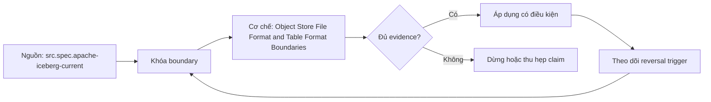

# Object Store File Format and Table Format Boundaries

> [!abstract] Câu hỏi trung tâm
> Object store, file format và table format giải quyết ba lớp vấn đề khác nhau ra sao?

## 1. Ba lớp contract

Object store quản lý immutable-like objects, keys, versions/listing và request semantics. File format như Parquet định nghĩa bytes, schema/metadata trong một file và cách reader tìm column chunks/pages. Table format định nghĩa tập files nào tạo thành table state, schema/partition evolution, snapshots và commit protocol. Compute engine thực thi query/write; catalog giữ hoặc điều phối current metadata pointer. Trộn lớp dẫn tới khẳng định sai như Parquet tự cung cấp transaction hoặc object-store directory tự là table.

## 2. Directory listing không phải table state

Nếu reader liệt kê prefix để suy table, nó có thể thấy files từ lần ghi chưa hoàn tất, files bị bỏ lại, duplicate retries hoặc mixed schema generations. Ngay cả khi object listing hiện có strong consistency, listing vẫn không biết business transaction boundary. Rename-directory pattern có thể đắt, không atomic hoặc không khả dụng theo backend. Table state cần explicit commit marker/pointer và immutable metadata lineage, thay vì lấy sự hiện diện vật lý làm publication decision.

## 3. Failure window

Một writer thường tạo data files trước khi công bố. Nếu chết giữa chừng, physical objects tồn tại nhưng chưa committed. Directory reader có thể đưa chúng vào scan và tạo partial batch; snapshot reader chỉ dùng files referenced bởi committed metadata. Ngược lại, xóa physical file đang được snapshot reference sẽ phá read/time travel. Lab tiêm failure sau từng boundary, so object count, referenced-file set và table row count. Orphan chỉ được xác định bằng reachability cộng retention, không bằng tuổi đơn giản.

## 4. Cơ chế table format

Iceberg theo dõi files trong snapshots. Table metadata trỏ snapshots; snapshot trỏ manifest list; manifest list trỏ manifests; manifests ghi data/delete files và metrics. Commit công bố state bằng atomic swap của metadata pointer. Readers giữ snapshot loaded; writers dùng optimistic concurrency và validation. Hidden partitioning tách logical predicate khỏi path convention. Field IDs cho phép rename/reorder an toàn hơn name-based projection. Mỗi guarantee phải gắn mechanism này, không dùng nhãn ACID một mình.

## 5. Điều table format không giải

Format không tự cấp quyền object store/catalog, không chạy compaction, không bảo đảm mọi engine hỗ trợ feature/version, không xử lý data quality/business correctness và không tạo backup/DR. Atomicity thường ở table boundary; multi-table transaction tùy catalog/engine. Snapshot retention và orphan cleanup có thể xóa khả năng time travel nếu cấu hình sai. Encryption, PII deletion, cost, lock/catalog availability và writer bugs vẫn là trách nhiệm platform/operations.

## 6. Bài phân loại và mô tả guarantee

Phân mười thành phần vào storage, file format, table format và ghi thêm engine/catalog khi cần. Dựng writer tạo files rồi dừng trước commit; đối chiếu prefix-based read với snapshot read bằng exact file set và row hash. Mô tả guarantee theo subject, mechanism, boundary và failure behavior: ai công bố, pointer nào đổi, reader thấy snapshot nào, retry/conflict ra sao. Kết luận chỉ áp dụng cho implementation/version đã chạy; chưa chạy lab thì ghi protocol.

## 7. Ma trận kiểm chứng từng mệnh đề

Mỗi claim phải chỉ rõ metadata scope, writer/reader version, exact fixture, counterexample và oracle. File parse được, plan có predicate hoặc metadata tồn tại chưa đủ để kết luận physical I/O hay semantic result đúng.

### 7.1. Layer-boundary probe 1: component owner, publication rule, failure window và unsupported guarantee phải rõ

**Mệnh đề cần kiểm.** Layer-boundary probe 1: component owner, publication rule, failure window và unsupported guarantee phải rõ.

**Thiết kế phép thử cho `wiki.storage.object-store-file-table-format-boundaries`.** Khóa schema, dataset hash, writer/reader/engine versions, storage backend, cache state và configuration. Tạo positive fixture, boundary fixture và negative/counterexample; thay đổi đúng một biến. Lưu footer hoặc metadata-tree locator, query plan, scan counters, requested/transferred bytes nếu có, typed result hash, logs và run ID. Khi công cụ không quan sát được một tầng, ghi `unknown` thay vì suy từ latency hoặc output count.

**Điều kiện chấp nhận cho `wiki.storage.object-store-file-table-format-boundaries`.** Canonical result phải khớp trước khi so hiệu năng. Observation phải lặp lại trên số run đã định, chỉ ra đơn vị bị loại và cơ chế chịu trách nhiệm. Báo riêng source fact, phần tổng hợp của giáo trình và giả định theo implementation. Chưa chạy lab thì mục này là protocol, chưa phải kết quả thực nghiệm.

### 7.2. Layer-boundary probe 2: component owner, publication rule, failure window và unsupported guarantee phải rõ

**Mệnh đề cần kiểm.** Layer-boundary probe 2: component owner, publication rule, failure window và unsupported guarantee phải rõ.

**Thiết kế phép thử cho `wiki.storage.object-store-file-table-format-boundaries`.** Khóa schema, dataset hash, writer/reader/engine versions, storage backend, cache state và configuration. Tạo positive fixture, boundary fixture và negative/counterexample; thay đổi đúng một biến. Lưu footer hoặc metadata-tree locator, query plan, scan counters, requested/transferred bytes nếu có, typed result hash, logs và run ID. Khi công cụ không quan sát được một tầng, ghi `unknown` thay vì suy từ latency hoặc output count.

**Điều kiện chấp nhận cho `wiki.storage.object-store-file-table-format-boundaries`.** Canonical result phải khớp trước khi so hiệu năng. Observation phải lặp lại trên số run đã định, chỉ ra đơn vị bị loại và cơ chế chịu trách nhiệm. Báo riêng source fact, phần tổng hợp của giáo trình và giả định theo implementation. Chưa chạy lab thì mục này là protocol, chưa phải kết quả thực nghiệm.

### 7.3. Layer-boundary probe 3: component owner, publication rule, failure window và unsupported guarantee phải rõ

**Mệnh đề cần kiểm.** Layer-boundary probe 3: component owner, publication rule, failure window và unsupported guarantee phải rõ.

**Thiết kế phép thử cho `wiki.storage.object-store-file-table-format-boundaries`.** Khóa schema, dataset hash, writer/reader/engine versions, storage backend, cache state và configuration. Tạo positive fixture, boundary fixture và negative/counterexample; thay đổi đúng một biến. Lưu footer hoặc metadata-tree locator, query plan, scan counters, requested/transferred bytes nếu có, typed result hash, logs và run ID. Khi công cụ không quan sát được một tầng, ghi `unknown` thay vì suy từ latency hoặc output count.

**Điều kiện chấp nhận cho `wiki.storage.object-store-file-table-format-boundaries`.** Canonical result phải khớp trước khi so hiệu năng. Observation phải lặp lại trên số run đã định, chỉ ra đơn vị bị loại và cơ chế chịu trách nhiệm. Báo riêng source fact, phần tổng hợp của giáo trình và giả định theo implementation. Chưa chạy lab thì mục này là protocol, chưa phải kết quả thực nghiệm.

### 7.4. Layer-boundary probe 4: component owner, publication rule, failure window và unsupported guarantee phải rõ

**Mệnh đề cần kiểm.** Layer-boundary probe 4: component owner, publication rule, failure window và unsupported guarantee phải rõ.

**Thiết kế phép thử cho `wiki.storage.object-store-file-table-format-boundaries`.** Khóa schema, dataset hash, writer/reader/engine versions, storage backend, cache state và configuration. Tạo positive fixture, boundary fixture và negative/counterexample; thay đổi đúng một biến. Lưu footer hoặc metadata-tree locator, query plan, scan counters, requested/transferred bytes nếu có, typed result hash, logs và run ID. Khi công cụ không quan sát được một tầng, ghi `unknown` thay vì suy từ latency hoặc output count.

**Điều kiện chấp nhận cho `wiki.storage.object-store-file-table-format-boundaries`.** Canonical result phải khớp trước khi so hiệu năng. Observation phải lặp lại trên số run đã định, chỉ ra đơn vị bị loại và cơ chế chịu trách nhiệm. Báo riêng source fact, phần tổng hợp của giáo trình và giả định theo implementation. Chưa chạy lab thì mục này là protocol, chưa phải kết quả thực nghiệm.

### 7.5. Layer-boundary probe 5: component owner, publication rule, failure window và unsupported guarantee phải rõ

**Mệnh đề cần kiểm.** Layer-boundary probe 5: component owner, publication rule, failure window và unsupported guarantee phải rõ.

**Thiết kế phép thử cho `wiki.storage.object-store-file-table-format-boundaries`.** Khóa schema, dataset hash, writer/reader/engine versions, storage backend, cache state và configuration. Tạo positive fixture, boundary fixture và negative/counterexample; thay đổi đúng một biến. Lưu footer hoặc metadata-tree locator, query plan, scan counters, requested/transferred bytes nếu có, typed result hash, logs và run ID. Khi công cụ không quan sát được một tầng, ghi `unknown` thay vì suy từ latency hoặc output count.

**Điều kiện chấp nhận cho `wiki.storage.object-store-file-table-format-boundaries`.** Canonical result phải khớp trước khi so hiệu năng. Observation phải lặp lại trên số run đã định, chỉ ra đơn vị bị loại và cơ chế chịu trách nhiệm. Báo riêng source fact, phần tổng hợp của giáo trình và giả định theo implementation. Chưa chạy lab thì mục này là protocol, chưa phải kết quả thực nghiệm.

### 7.6. Layer-boundary probe 6: component owner, publication rule, failure window và unsupported guarantee phải rõ

**Mệnh đề cần kiểm.** Layer-boundary probe 6: component owner, publication rule, failure window và unsupported guarantee phải rõ.

**Thiết kế phép thử cho `wiki.storage.object-store-file-table-format-boundaries`.** Khóa schema, dataset hash, writer/reader/engine versions, storage backend, cache state và configuration. Tạo positive fixture, boundary fixture và negative/counterexample; thay đổi đúng một biến. Lưu footer hoặc metadata-tree locator, query plan, scan counters, requested/transferred bytes nếu có, typed result hash, logs và run ID. Khi công cụ không quan sát được một tầng, ghi `unknown` thay vì suy từ latency hoặc output count.

**Điều kiện chấp nhận cho `wiki.storage.object-store-file-table-format-boundaries`.** Canonical result phải khớp trước khi so hiệu năng. Observation phải lặp lại trên số run đã định, chỉ ra đơn vị bị loại và cơ chế chịu trách nhiệm. Báo riêng source fact, phần tổng hợp của giáo trình và giả định theo implementation. Chưa chạy lab thì mục này là protocol, chưa phải kết quả thực nghiệm.

### 7.7. Layer-boundary probe 7: component owner, publication rule, failure window và unsupported guarantee phải rõ

**Mệnh đề cần kiểm.** Layer-boundary probe 7: component owner, publication rule, failure window và unsupported guarantee phải rõ.

**Thiết kế phép thử cho `wiki.storage.object-store-file-table-format-boundaries`.** Khóa schema, dataset hash, writer/reader/engine versions, storage backend, cache state và configuration. Tạo positive fixture, boundary fixture và negative/counterexample; thay đổi đúng một biến. Lưu footer hoặc metadata-tree locator, query plan, scan counters, requested/transferred bytes nếu có, typed result hash, logs và run ID. Khi công cụ không quan sát được một tầng, ghi `unknown` thay vì suy từ latency hoặc output count.

**Điều kiện chấp nhận cho `wiki.storage.object-store-file-table-format-boundaries`.** Canonical result phải khớp trước khi so hiệu năng. Observation phải lặp lại trên số run đã định, chỉ ra đơn vị bị loại và cơ chế chịu trách nhiệm. Báo riêng source fact, phần tổng hợp của giáo trình và giả định theo implementation. Chưa chạy lab thì mục này là protocol, chưa phải kết quả thực nghiệm.

### 7.8. Layer-boundary probe 8: component owner, publication rule, failure window và unsupported guarantee phải rõ

**Mệnh đề cần kiểm.** Layer-boundary probe 8: component owner, publication rule, failure window và unsupported guarantee phải rõ.

**Thiết kế phép thử cho `wiki.storage.object-store-file-table-format-boundaries`.** Khóa schema, dataset hash, writer/reader/engine versions, storage backend, cache state và configuration. Tạo positive fixture, boundary fixture và negative/counterexample; thay đổi đúng một biến. Lưu footer hoặc metadata-tree locator, query plan, scan counters, requested/transferred bytes nếu có, typed result hash, logs và run ID. Khi công cụ không quan sát được một tầng, ghi `unknown` thay vì suy từ latency hoặc output count.

**Điều kiện chấp nhận cho `wiki.storage.object-store-file-table-format-boundaries`.** Canonical result phải khớp trước khi so hiệu năng. Observation phải lặp lại trên số run đã định, chỉ ra đơn vị bị loại và cơ chế chịu trách nhiệm. Báo riêng source fact, phần tổng hợp của giáo trình và giả định theo implementation. Chưa chạy lab thì mục này là protocol, chưa phải kết quả thực nghiệm.

### 7.9. Layer-boundary probe 9: component owner, publication rule, failure window và unsupported guarantee phải rõ

**Mệnh đề cần kiểm.** Layer-boundary probe 9: component owner, publication rule, failure window và unsupported guarantee phải rõ.

**Thiết kế phép thử cho `wiki.storage.object-store-file-table-format-boundaries`.** Khóa schema, dataset hash, writer/reader/engine versions, storage backend, cache state và configuration. Tạo positive fixture, boundary fixture và negative/counterexample; thay đổi đúng một biến. Lưu footer hoặc metadata-tree locator, query plan, scan counters, requested/transferred bytes nếu có, typed result hash, logs và run ID. Khi công cụ không quan sát được một tầng, ghi `unknown` thay vì suy từ latency hoặc output count.

**Điều kiện chấp nhận cho `wiki.storage.object-store-file-table-format-boundaries`.** Canonical result phải khớp trước khi so hiệu năng. Observation phải lặp lại trên số run đã định, chỉ ra đơn vị bị loại và cơ chế chịu trách nhiệm. Báo riêng source fact, phần tổng hợp của giáo trình và giả định theo implementation. Chưa chạy lab thì mục này là protocol, chưa phải kết quả thực nghiệm.

### 7.10. Layer-boundary probe 10: component owner, publication rule, failure window và unsupported guarantee phải rõ

**Mệnh đề cần kiểm.** Layer-boundary probe 10: component owner, publication rule, failure window và unsupported guarantee phải rõ.

**Thiết kế phép thử cho `wiki.storage.object-store-file-table-format-boundaries`.** Khóa schema, dataset hash, writer/reader/engine versions, storage backend, cache state và configuration. Tạo positive fixture, boundary fixture và negative/counterexample; thay đổi đúng một biến. Lưu footer hoặc metadata-tree locator, query plan, scan counters, requested/transferred bytes nếu có, typed result hash, logs và run ID. Khi công cụ không quan sát được một tầng, ghi `unknown` thay vì suy từ latency hoặc output count.

**Điều kiện chấp nhận cho `wiki.storage.object-store-file-table-format-boundaries`.** Canonical result phải khớp trước khi so hiệu năng. Observation phải lặp lại trên số run đã định, chỉ ra đơn vị bị loại và cơ chế chịu trách nhiệm. Báo riêng source fact, phần tổng hợp của giáo trình và giả định theo implementation. Chưa chạy lab thì mục này là protocol, chưa phải kết quả thực nghiệm.

### 7.11. Layer-boundary probe 11: component owner, publication rule, failure window và unsupported guarantee phải rõ

**Mệnh đề cần kiểm.** Layer-boundary probe 11: component owner, publication rule, failure window và unsupported guarantee phải rõ.

**Thiết kế phép thử cho `wiki.storage.object-store-file-table-format-boundaries`.** Khóa schema, dataset hash, writer/reader/engine versions, storage backend, cache state và configuration. Tạo positive fixture, boundary fixture và negative/counterexample; thay đổi đúng một biến. Lưu footer hoặc metadata-tree locator, query plan, scan counters, requested/transferred bytes nếu có, typed result hash, logs và run ID. Khi công cụ không quan sát được một tầng, ghi `unknown` thay vì suy từ latency hoặc output count.

**Điều kiện chấp nhận cho `wiki.storage.object-store-file-table-format-boundaries`.** Canonical result phải khớp trước khi so hiệu năng. Observation phải lặp lại trên số run đã định, chỉ ra đơn vị bị loại và cơ chế chịu trách nhiệm. Báo riêng source fact, phần tổng hợp của giáo trình và giả định theo implementation. Chưa chạy lab thì mục này là protocol, chưa phải kết quả thực nghiệm.

### 7.12. Layer-boundary probe 12: component owner, publication rule, failure window và unsupported guarantee phải rõ

**Mệnh đề cần kiểm.** Layer-boundary probe 12: component owner, publication rule, failure window và unsupported guarantee phải rõ.

**Thiết kế phép thử cho `wiki.storage.object-store-file-table-format-boundaries`.** Khóa schema, dataset hash, writer/reader/engine versions, storage backend, cache state và configuration. Tạo positive fixture, boundary fixture và negative/counterexample; thay đổi đúng một biến. Lưu footer hoặc metadata-tree locator, query plan, scan counters, requested/transferred bytes nếu có, typed result hash, logs và run ID. Khi công cụ không quan sát được một tầng, ghi `unknown` thay vì suy từ latency hoặc output count.

**Điều kiện chấp nhận cho `wiki.storage.object-store-file-table-format-boundaries`.** Canonical result phải khớp trước khi so hiệu năng. Observation phải lặp lại trên số run đã định, chỉ ra đơn vị bị loại và cơ chế chịu trách nhiệm. Báo riêng source fact, phần tổng hợp của giáo trình và giả định theo implementation. Chưa chạy lab thì mục này là protocol, chưa phải kết quả thực nghiệm.

### 7.13. Layer-boundary probe 13: component owner, publication rule, failure window và unsupported guarantee phải rõ

**Mệnh đề cần kiểm.** Layer-boundary probe 13: component owner, publication rule, failure window và unsupported guarantee phải rõ.

**Thiết kế phép thử cho `wiki.storage.object-store-file-table-format-boundaries`.** Khóa schema, dataset hash, writer/reader/engine versions, storage backend, cache state và configuration. Tạo positive fixture, boundary fixture và negative/counterexample; thay đổi đúng một biến. Lưu footer hoặc metadata-tree locator, query plan, scan counters, requested/transferred bytes nếu có, typed result hash, logs và run ID. Khi công cụ không quan sát được một tầng, ghi `unknown` thay vì suy từ latency hoặc output count.

**Điều kiện chấp nhận cho `wiki.storage.object-store-file-table-format-boundaries`.** Canonical result phải khớp trước khi so hiệu năng. Observation phải lặp lại trên số run đã định, chỉ ra đơn vị bị loại và cơ chế chịu trách nhiệm. Báo riêng source fact, phần tổng hợp của giáo trình và giả định theo implementation. Chưa chạy lab thì mục này là protocol, chưa phải kết quả thực nghiệm.

### 7.14. Layer-boundary probe 14: component owner, publication rule, failure window và unsupported guarantee phải rõ

**Mệnh đề cần kiểm.** Layer-boundary probe 14: component owner, publication rule, failure window và unsupported guarantee phải rõ.

**Thiết kế phép thử cho `wiki.storage.object-store-file-table-format-boundaries`.** Khóa schema, dataset hash, writer/reader/engine versions, storage backend, cache state và configuration. Tạo positive fixture, boundary fixture và negative/counterexample; thay đổi đúng một biến. Lưu footer hoặc metadata-tree locator, query plan, scan counters, requested/transferred bytes nếu có, typed result hash, logs và run ID. Khi công cụ không quan sát được một tầng, ghi `unknown` thay vì suy từ latency hoặc output count.

**Điều kiện chấp nhận cho `wiki.storage.object-store-file-table-format-boundaries`.** Canonical result phải khớp trước khi so hiệu năng. Observation phải lặp lại trên số run đã định, chỉ ra đơn vị bị loại và cơ chế chịu trách nhiệm. Báo riêng source fact, phần tổng hợp của giáo trình và giả định theo implementation. Chưa chạy lab thì mục này là protocol, chưa phải kết quả thực nghiệm.

### 7.15. Layer-boundary probe 15: component owner, publication rule, failure window và unsupported guarantee phải rõ

**Mệnh đề cần kiểm.** Layer-boundary probe 15: component owner, publication rule, failure window và unsupported guarantee phải rõ.

**Thiết kế phép thử cho `wiki.storage.object-store-file-table-format-boundaries`.** Khóa schema, dataset hash, writer/reader/engine versions, storage backend, cache state và configuration. Tạo positive fixture, boundary fixture và negative/counterexample; thay đổi đúng một biến. Lưu footer hoặc metadata-tree locator, query plan, scan counters, requested/transferred bytes nếu có, typed result hash, logs và run ID. Khi công cụ không quan sát được một tầng, ghi `unknown` thay vì suy từ latency hoặc output count.

**Điều kiện chấp nhận cho `wiki.storage.object-store-file-table-format-boundaries`.** Canonical result phải khớp trước khi so hiệu năng. Observation phải lặp lại trên số run đã định, chỉ ra đơn vị bị loại và cơ chế chịu trách nhiệm. Báo riêng source fact, phần tổng hợp của giáo trình và giả định theo implementation. Chưa chạy lab thì mục này là protocol, chưa phải kết quả thực nghiệm.

## 8. Quy trình phản biện

1. Xác định tầng đang nói: object store, file, table metadata, catalog hay engine.
2. Viết identity và publication boundary trước khi bàn hiệu năng.
3. Tách metadata presence, planner intent, executed pruning và physical I/O.
4. Kiểm semantic result bằng typed oracle trước benchmark.
5. Pin version, configuration, cache state và metric definition.
6. Ghi counterexample, limitation và reversal condition cho recommendation.

## 9. Câu hỏi tự kiểm tra

1. Đơn vị đang xét là file, row group, column chunk, page, manifest hay snapshot?
2. Metadata nào authoritative và lấy từ locator nào?
3. Reader có dùng metadata hay chỉ có khả năng dùng?
4. Parse/decode thành công có che semantic mismatch không?
5. Failure ở trước hay sau publication boundary?
6. Bằng chứng nào còn là protocol chưa chạy?

## 10. Giới hạn và điều chưa cho phép kết luận

- Chưa chạy Parquet footer/page-index lab hoặc Iceberg metadata trace trên engine/catalog thật.
- Đặc tả được kiểm ngày 2026-10-02; implementation behavior phải pin version.
- Matrices và lab protocols là synthesis của giáo trình, không gán nguyên văn cho một nguồn.
- Note giữ trạng thái `review` tới khi chủ dự án duyệt.

## Reference
1. [[SRC-APACHE-ICEBERG-SPEC]]
2. [[SRC-APACHE-ICEBERG-INTRODUCTION]]
3. [[SRC-REIS-HOUSLEY-FUNDAMENTALS-DATA-ENGINEERING]]

## Source coverage

| Source slice | Nội dung sử dụng | Trạng thái |
|---|---|---|
| [[SRC-APACHE-ICEBERG-SPEC]] | Format/table contract, implementation boundary hoặc workload context | Đã đọc locator; không suy ngoài phạm vi |
| [[SRC-APACHE-ICEBERG-INTRODUCTION]] | Format/table contract, implementation boundary hoặc workload context | Đã đọc locator; không suy ngoài phạm vi |
| [[SRC-REIS-HOUSLEY-FUNDAMENTALS-DATA-ENGINEERING]] | Format/table contract, implementation boundary hoặc workload context | Đã đọc locator; không suy ngoài phạm vi |

## Key takeaways
- Mọi claim phải đúng tầng và đúng granularity.
- Metadata hiện diện, planner intent, executed pruning và physical I/O là bốn bằng chứng khác nhau.
- Semantic oracle được kiểm trước performance attribution.
- Chưa chạy lab thì note cung cấp giáo trình và protocol, chưa phải certification cho production.

<!-- ATOMIC-EXECUTION-CAPSULE:START -->

## Execution capsule: kiểm chứng `wiki.storage.object-store-file-table-format-boundaries`

> [!important] Phân loại mệnh đề
> Với `wiki.storage.object-store-file-table-format-boundaries`, sơ đồ, ví dụ và artifact về **Object Store File Format and Table Format Boundaries** là **synthesis để kiểm chứng**; chúng không phải trích dẫn hay case nguyên văn của nguồn.

### Sơ đồ cơ chế và điểm kiểm soát



Đọc sơ đồ `wiki.storage.object-store-file-table-format-boundaries` từ trái sang phải: source chỉ cung cấp claim ban đầu cho **Object Store File Format and Table Format Boundaries**; quyết định chỉ được đi tiếp sau khi boundary, evidence và điều kiện đảo quyết định đã hiện hữu.

### Ví dụ làm việc có thể bác bỏ

**Input.** Một đội cần trả lời: Object store, file format và table format giải quyết ba lớp vấn đề khác nhau ra sao? cho một phạm vi nhỏ, có owner và deadline rõ.

**Decision.** Đội áp dụng **Object Store File Format and Table Format Boundaries** trên control và variant chỉ khác một assumption; expected result và hard constraints được khóa trước khi chạy.

**Outcome.** Với `wiki.storage.object-store-file-table-format-boundaries`, nếu observation vi phạm hard constraint hoặc oracle độc lập không xác nhận **Object Store File Format and Table Format Boundaries**, đội thu hẹp claim hay đảo quyết định. Nếu đạt, kết luận vẫn kèm scope, version và review date; một lần thành công không được nâng thành quy luật phổ quát.

### Artifact thực thi tối thiểu

```sql
-- Verification harness for: Object Store File Format and Table Format Boundaries
WITH evidence AS (
    SELECT 'wiki.storage.object-store-file-table-format-boundaries' AS concept_id,
           'boundary_declared' AS check_name, 1 AS passed
    UNION ALL
    SELECT 'wiki.storage.object-store-file-table-format-boundaries', 'independent_oracle', 1
    UNION ALL
    SELECT 'wiki.storage.object-store-file-table-format-boundaries', 'reversal_trigger_recorded', 1
)
SELECT concept_id,
       MIN(passed) AS all_hard_checks_pass,
       COUNT(*) AS evidence_items
FROM evidence
GROUP BY concept_id
HAVING MIN(passed) = 1;
```

Artifact của `wiki.storage.object-store-file-table-format-boundaries` buộc người dùng ghi boundary, oracle và reversal trigger cho **Object Store File Format and Table Format Boundaries**. Các giá trị minh họa phải được thay bằng evidence thật trước khi dùng cho quyết định.

### Tự kiểm tra trước khi tái sử dụng

1. Bạn có thể trả lời `Object store, file format và table format giải quyết ba lớp vấn đề khác nhau ra sao?` bằng một câu mà không kéo thêm concept thứ hai không?
2. Source locator nào đỡ cho claim, và phần nào chỉ là synthesis trong note?
3. Observation nào khiến bạn dừng, thu hẹp hoặc đảo quyết định?
4. Artifact nào cho phép một reviewer độc lập tái hiện kết quả?

<!-- ATOMIC-EXECUTION-CAPSULE:END -->
