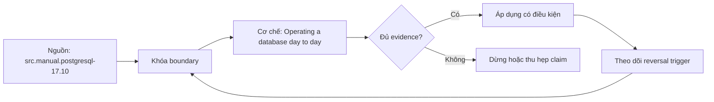

# Operating a database day to day

> [!abstract] Câu hỏi trung tâm
> Bộ vận hành hằng ngày tối thiểu phải theo dõi resource, workload, maintenance và change như thế nào để phát hiện rủi ro trước người dùng?

## 1. Điều hành theo service objective

Dashboard chỉ có ý nghĩa khi gắn với availability, latency, correctness, durability và capacity objectives. Tách symptom metrics như query latency/error khỏi cause metrics như lock waits, IO, connection saturation, bloat hoặc replica lag. Baseline theo giờ/ngày và workload class; một ngưỡng tròn không phản ánh mùa vụ.

## 2. Kết nối

max_connections là giới hạn, không phải target. Mỗi backend tiêu tốn memory/state; connection storm có thể làm database thất bại trước khi chạm hard limit. Pool giới hạn concurrency và queue ở lớp ứng dụng nhưng pool nhân theo replicas/pods. Theo dõi active, idle, idle-in-transaction, wait event, acquisition latency và rejected connections.

## 3. Truy vấn và lock

Thu slow-query log hoặc pg_stat_statements theo policy, giữ query ID và distribution thay vì chỉ average. P95/P99 theo class, calls, total time, rows, temp IO và plans hỗ trợ ưu tiên. Theo dõi long transactions, blocker chains và deadlocks. Log có thể chứa dữ liệu nhạy cảm nên access/retention/redaction là control bắt buộc.

## 4. Vacuum, statistics và storage

Theo dõi dead tuples, oldest transaction/XID age, autovacuum progress, table/index growth, last analyze và plan regressions sau bulk load. Disk alert dùng growth rate, time-to-exhaustion và headroom cho maintenance/recovery, không chỉ percent used. WAL/archive/slot retention có thể đầy volume khác với data volume.

## 5. Backup, replication và change

Kiểm latest successful backup chưa đủ; theo dõi age của last restorable recovery point và restore-drill result. Replication theo send/write/flush/replay lag. Minor/major upgrade khác blast radius; mọi change có compatibility, backup, rehearsal, rollback và post-change verification. Extension/driver/OS cũng nằm trong matrix.

## 6. Alert engineering

Alert phải actionable: condition, duration, severity, owner, dashboard/runbook link và suppression rule. Dẫn threshold từ baseline/SLO/capacity model, thử bằng sự cố cô lập và đo detection lead time. Tránh alert theo một sample; dùng burn rate hoặc sustained window phù hợp. Review false positive, missed incident và stale alert định kỳ.

## 7. Ma trận kiểm chứng từng mệnh đề

Mỗi mệnh đề dưới đây phải được kiểm bằng một schedule hoặc phép đo có điều kiện đầu vào rõ ràng. Không dùng một ảnh màn hình cuối làm bằng chứng thay cho lệnh, timestamp, cấu hình và raw output.

### 7.1. pool size phải tính tổng qua mọi application instance

**Giả thuyết.** pool size phải tính tổng qua mọi application instance. **Cách kiểm.** Cố định phiên bản database, cấu hình, dữ liệu seed và thứ tự thao tác; ghi operation ID, transaction/session ID, thời điểm bắt đầu–kết thúc và trạng thái commit/abort. **Đối chứng.** Chạy một biến thể bỏ đúng yếu tố đang xét, không đổi đồng thời nhiều tham số. **Bằng chứng đạt cho `wiki.database.day-two-operations`.** Lưu command/script, raw result và counter trước–sau; giải thích cơ chế tạo ra quan sát. Một lần không tái hiện không đủ bác bỏ hiện tượng concurrency; cần barrier xác định và lặp có giới hạn.

### 7.2. idle-in-transaction có thể giữ snapshot/lock dù active query bằng không

**Giả thuyết.** idle-in-transaction có thể giữ snapshot/lock dù active query bằng không. **Cách kiểm.** Cố định phiên bản database, cấu hình, dữ liệu seed và thứ tự thao tác; ghi operation ID, transaction/session ID, thời điểm bắt đầu–kết thúc và trạng thái commit/abort. **Đối chứng.** Chạy một biến thể bỏ đúng yếu tố đang xét, không đổi đồng thời nhiều tham số. **Bằng chứng đạt cho `wiki.database.day-two-operations`.** Lưu command/script, raw result và counter trước–sau; giải thích cơ chế tạo ra quan sát. Một lần không tái hiện không đủ bác bỏ hiện tượng concurrency; cần barrier xác định và lặp có giới hạn.

### 7.3. slow-query average che tail latency và bimodal plans

**Giả thuyết.** slow-query average che tail latency và bimodal plans. **Cách kiểm.** Cố định phiên bản database, cấu hình, dữ liệu seed và thứ tự thao tác; ghi operation ID, transaction/session ID, thời điểm bắt đầu–kết thúc và trạng thái commit/abort. **Đối chứng.** Chạy một biến thể bỏ đúng yếu tố đang xét, không đổi đồng thời nhiều tham số. **Bằng chứng đạt cho `wiki.database.day-two-operations`.** Lưu command/script, raw result và counter trước–sau; giải thích cơ chế tạo ra quan sát. Một lần không tái hiện không đủ bác bỏ hiện tượng concurrency; cần barrier xác định và lặp có giới hạn.

### 7.4. pg_stat_statements reset/restart làm đổi observation window

**Giả thuyết.** pg_stat_statements reset/restart làm đổi observation window. **Cách kiểm.** Cố định phiên bản database, cấu hình, dữ liệu seed và thứ tự thao tác; ghi operation ID, transaction/session ID, thời điểm bắt đầu–kết thúc và trạng thái commit/abort. **Đối chứng.** Chạy một biến thể bỏ đúng yếu tố đang xét, không đổi đồng thời nhiều tham số. **Bằng chứng đạt cho `wiki.database.day-two-operations`.** Lưu command/script, raw result và counter trước–sau; giải thích cơ chế tạo ra quan sát. Một lần không tái hiện không đủ bác bỏ hiện tượng concurrency; cần barrier xác định và lặp có giới hạn.

### 7.5. log statements có thể lộ secrets/PII và cần policy

**Giả thuyết.** log statements có thể lộ secrets/PII và cần policy. **Cách kiểm.** Cố định phiên bản database, cấu hình, dữ liệu seed và thứ tự thao tác; ghi operation ID, transaction/session ID, thời điểm bắt đầu–kết thúc và trạng thái commit/abort. **Đối chứng.** Chạy một biến thể bỏ đúng yếu tố đang xét, không đổi đồng thời nhiều tham số. **Bằng chứng đạt cho `wiki.database.day-two-operations`.** Lưu command/script, raw result và counter trước–sau; giải thích cơ chế tạo ra quan sát. Một lần không tái hiện không đủ bác bỏ hiện tượng concurrency; cần barrier xác định và lặp có giới hạn.

### 7.6. dead tuples không đồng nhất bloat nhưng là input điều tra

**Giả thuyết.** dead tuples không đồng nhất bloat nhưng là input điều tra. **Cách kiểm.** Cố định phiên bản database, cấu hình, dữ liệu seed và thứ tự thao tác; ghi operation ID, transaction/session ID, thời điểm bắt đầu–kết thúc và trạng thái commit/abort. **Đối chứng.** Chạy một biến thể bỏ đúng yếu tố đang xét, không đổi đồng thời nhiều tham số. **Bằng chứng đạt cho `wiki.database.day-two-operations`.** Lưu command/script, raw result và counter trước–sau; giải thích cơ chế tạo ra quan sát. Một lần không tái hiện không đủ bác bỏ hiện tượng concurrency; cần barrier xác định và lặp có giới hạn.

### 7.7. oldest XID age là safety signal khác table size

**Giả thuyết.** oldest XID age là safety signal khác table size. **Cách kiểm.** Cố định phiên bản database, cấu hình, dữ liệu seed và thứ tự thao tác; ghi operation ID, transaction/session ID, thời điểm bắt đầu–kết thúc và trạng thái commit/abort. **Đối chứng.** Chạy một biến thể bỏ đúng yếu tố đang xét, không đổi đồng thời nhiều tham số. **Bằng chứng đạt cho `wiki.database.day-two-operations`.** Lưu command/script, raw result và counter trước–sau; giải thích cơ chế tạo ra quan sát. Một lần không tái hiện không đủ bác bỏ hiện tượng concurrency; cần barrier xác định và lặp có giới hạn.

### 7.8. bulk load làm statistics cũ và thay plan

**Giả thuyết.** bulk load làm statistics cũ và thay plan. **Cách kiểm.** Cố định phiên bản database, cấu hình, dữ liệu seed và thứ tự thao tác; ghi operation ID, transaction/session ID, thời điểm bắt đầu–kết thúc và trạng thái commit/abort. **Đối chứng.** Chạy một biến thể bỏ đúng yếu tố đang xét, không đổi đồng thời nhiều tham số. **Bằng chứng đạt cho `wiki.database.day-two-operations`.** Lưu command/script, raw result và counter trước–sau; giải thích cơ chế tạo ra quan sát. Một lần không tái hiện không đủ bác bỏ hiện tượng concurrency; cần barrier xác định và lặp có giới hạn.

### 7.9. disk percent thiếu growth rate và restore headroom

**Giả thuyết.** disk percent thiếu growth rate và restore headroom. **Cách kiểm.** Cố định phiên bản database, cấu hình, dữ liệu seed và thứ tự thao tác; ghi operation ID, transaction/session ID, thời điểm bắt đầu–kết thúc và trạng thái commit/abort. **Đối chứng.** Chạy một biến thể bỏ đúng yếu tố đang xét, không đổi đồng thời nhiều tham số. **Bằng chứng đạt cho `wiki.database.day-two-operations`.** Lưu command/script, raw result và counter trước–sau; giải thích cơ chế tạo ra quan sát. Một lần không tái hiện không đủ bác bỏ hiện tượng concurrency; cần barrier xác định và lặp có giới hạn.

### 7.10. replication connected không đồng nghĩa replay current

**Giả thuyết.** replication connected không đồng nghĩa replay current. **Cách kiểm.** Cố định phiên bản database, cấu hình, dữ liệu seed và thứ tự thao tác; ghi operation ID, transaction/session ID, thời điểm bắt đầu–kết thúc và trạng thái commit/abort. **Đối chứng.** Chạy một biến thể bỏ đúng yếu tố đang xét, không đổi đồng thời nhiều tham số. **Bằng chứng đạt cho `wiki.database.day-two-operations`.** Lưu command/script, raw result và counter trước–sau; giải thích cơ chế tạo ra quan sát. Một lần không tái hiện không đủ bác bỏ hiện tượng concurrency; cần barrier xác định và lặp có giới hạn.

### 7.11. replication slot có thể giữ WAL đến đầy disk

**Giả thuyết.** replication slot có thể giữ WAL đến đầy disk. **Cách kiểm.** Cố định phiên bản database, cấu hình, dữ liệu seed và thứ tự thao tác; ghi operation ID, transaction/session ID, thời điểm bắt đầu–kết thúc và trạng thái commit/abort. **Đối chứng.** Chạy một biến thể bỏ đúng yếu tố đang xét, không đổi đồng thời nhiều tham số. **Bằng chứng đạt cho `wiki.database.day-two-operations`.** Lưu command/script, raw result và counter trước–sau; giải thích cơ chế tạo ra quan sát. Một lần không tái hiện không đủ bác bỏ hiện tượng concurrency; cần barrier xác định và lặp có giới hạn.

### 7.12. backup job green không thay restore drill

**Giả thuyết.** backup job green không thay restore drill. **Cách kiểm.** Cố định phiên bản database, cấu hình, dữ liệu seed và thứ tự thao tác; ghi operation ID, transaction/session ID, thời điểm bắt đầu–kết thúc và trạng thái commit/abort. **Đối chứng.** Chạy một biến thể bỏ đúng yếu tố đang xét, không đổi đồng thời nhiều tham số. **Bằng chứng đạt cho `wiki.database.day-two-operations`.** Lưu command/script, raw result và counter trước–sau; giải thích cơ chế tạo ra quan sát. Một lần không tái hiện không đủ bác bỏ hiện tượng concurrency; cần barrier xác định và lặp có giới hạn.

### 7.13. threshold cần baseline và service objective

**Giả thuyết.** threshold cần baseline và service objective. **Cách kiểm.** Cố định phiên bản database, cấu hình, dữ liệu seed và thứ tự thao tác; ghi operation ID, transaction/session ID, thời điểm bắt đầu–kết thúc và trạng thái commit/abort. **Đối chứng.** Chạy một biến thể bỏ đúng yếu tố đang xét, không đổi đồng thời nhiều tham số. **Bằng chứng đạt cho `wiki.database.day-two-operations`.** Lưu command/script, raw result và counter trước–sau; giải thích cơ chế tạo ra quan sát. Một lần không tái hiện không đủ bác bỏ hiện tượng concurrency; cần barrier xác định và lặp có giới hạn.

### 7.14. alert không có owner/runbook không actionable

**Giả thuyết.** alert không có owner/runbook không actionable. **Cách kiểm.** Cố định phiên bản database, cấu hình, dữ liệu seed và thứ tự thao tác; ghi operation ID, transaction/session ID, thời điểm bắt đầu–kết thúc và trạng thái commit/abort. **Đối chứng.** Chạy một biến thể bỏ đúng yếu tố đang xét, không đổi đồng thời nhiều tham số. **Bằng chứng đạt cho `wiki.database.day-two-operations`.** Lưu command/script, raw result và counter trước–sau; giải thích cơ chế tạo ra quan sát. Một lần không tái hiện không đủ bác bỏ hiện tượng concurrency; cần barrier xác định và lặp có giới hạn.

### 7.15. major upgrade cần rehearsal và rollback boundary

**Giả thuyết.** major upgrade cần rehearsal và rollback boundary. **Cách kiểm.** Cố định phiên bản database, cấu hình, dữ liệu seed và thứ tự thao tác; ghi operation ID, transaction/session ID, thời điểm bắt đầu–kết thúc và trạng thái commit/abort. **Đối chứng.** Chạy một biến thể bỏ đúng yếu tố đang xét, không đổi đồng thời nhiều tham số. **Bằng chứng đạt cho `wiki.database.day-two-operations`.** Lưu command/script, raw result và counter trước–sau; giải thích cơ chế tạo ra quan sát. Một lần không tái hiện không đủ bác bỏ hiện tượng concurrency; cần barrier xác định và lặp có giới hạn.

## 8. Khung chẩn đoán

1. Viết hiện tượng quan sát được và mốc thời gian, không nhảy thẳng tới nguyên nhân.
2. Ghi exact DBMS/version, topology, isolation/durability mode và workload.
3. Dựng state hoặc dependency graph nhỏ nhất giải thích hiện tượng.
4. Thu evidence ở cả client, engine và storage/replica nếu có.
5. Nêu giả thuyết có dự đoán phân biệt được; đổi một biến và chạy lại.
6. Phân biệt biện pháp giảm triệu chứng, sửa nguyên nhân và control ngăn tái diễn.
7. Giữ failed run; không xoá evidence chỉ vì kết quả không như dự kiến.

## 9. Câu hỏi tự kiểm tra

1. Contract chính của cơ chế trong bài là gì và failure class nào nằm ngoài contract?
2. Counter hoặc graph nào phân biệt symptom với root cause?
3. Một phát biểu nào chỉ đúng cho PostgreSQL, không được khái quát thành SQL chung?
4. Abort hoặc stale read khi nào là hành vi đúng theo cấu hình?
5. Lab cần barrier, operation ID và đối chứng nào để tái hiện được?
6. Biện pháp vận hành nào nguy hiểm nếu áp dụng trực tiếp lên production?

## 10. Giới hạn và điều chưa cho phép kết luận

- Chưa chạy lab database; mọi số đo phải được học viên tạo trong môi trường cô lập.
- Hành vi theo version/dialect phải kiểm manual đúng hệ; note không thay runbook production.
- Không suy benchmark, ngưỡng alert hay SLO phổ quát từ sách.
- Không coi synchronous, serializable, vacuum hoặc partitioning là bảo đảm tuyệt đối ngoài cấu hình và failure model đã nêu.

## Reference
1. [[SRC-POSTGRESQL-17-10-MANUAL]]
2. [[SRC-MASTERING-POSTGRESQL-17-6E]]
3. [[SRC-ROGOV-POSTGRESQL-14-INTERNALS]]
4. [[SRC-SILBERSCHATZ-DATABASE-SYSTEM-CONCEPTS-7E]]

## Source coverage

| Source slice | Nội dung sử dụng | Trạng thái |
|---|---|---|
| [[SRC-POSTGRESQL-17-10-MANUAL]] | Cơ chế, ranh giới và phản ví dụ liên quan đến bài | Đã đọc phạm vi có locator và diễn giải |
| [[SRC-MASTERING-POSTGRESQL-17-6E]] | Cơ chế, ranh giới và phản ví dụ liên quan đến bài | Đã đọc phạm vi có locator và diễn giải |
| [[SRC-ROGOV-POSTGRESQL-14-INTERNALS]] | Cơ chế, ranh giới và phản ví dụ liên quan đến bài | Đã đọc phạm vi có locator và diễn giải |
| [[SRC-SILBERSCHATZ-DATABASE-SYSTEM-CONCEPTS-7E]] | Cơ chế, ranh giới và phản ví dụ liên quan đến bài | Đã đọc phạm vi có locator và diễn giải |

## Key takeaways
- Bắt đầu từ invariant/failure model và bằng chứng, không bắt đầu từ tên tính năng.
- Phân biệt contract chung với hành vi PostgreSQL cụ thể.
- Concurrency và failover test phải có schedule, operation ID và raw output tái lập được.
- Một control làm giảm rủi ro này có thể tăng latency, abort, coordination hoặc chi phí vận hành khác.
- Chưa chạy lab thì trạng thái là tài liệu học thuật đã kiểm cấu trúc, không phải chứng nhận production.

<!-- ATOMIC-EXECUTION-CAPSULE:START -->

## Execution capsule — kiểm chứng `wiki.database.day-two-operations`

> [!important] Phân loại mệnh đề
> Với `wiki.database.day-two-operations`, sơ đồ, ví dụ và artifact về **Operating a database day to day** là **synthesis để kiểm chứng**; chúng không phải trích dẫn hay case nguyên văn của nguồn.

### Sơ đồ cơ chế và điểm kiểm soát



Đọc sơ đồ `wiki.database.day-two-operations` từ trái sang phải: source chỉ cung cấp claim ban đầu cho **Operating a database day to day**; quyết định chỉ được đi tiếp sau khi boundary, evidence và điều kiện đảo quyết định đã hiện hữu.

### Artifact thực thi tối thiểu

```sql
-- Verification harness for: Operating a database day to day
WITH evidence AS (
    SELECT 'wiki.database.day-two-operations' AS concept_id,
           'boundary_declared' AS check_name, 1 AS passed
    UNION ALL
    SELECT 'wiki.database.day-two-operations', 'independent_oracle', 1
    UNION ALL
    SELECT 'wiki.database.day-two-operations', 'reversal_trigger_recorded', 1
)
SELECT concept_id,
       MIN(passed) AS all_hard_checks_pass,
       COUNT(*) AS evidence_items
FROM evidence
GROUP BY concept_id
HAVING MIN(passed) = 1;
```

Artifact của `wiki.database.day-two-operations` buộc người dùng ghi boundary, oracle và reversal trigger cho **Operating a database day to day**. Các giá trị minh họa phải được thay bằng evidence thật trước khi dùng cho quyết định.

### Tự kiểm tra trước khi tái sử dụng

1. Bạn có thể trả lời `Bộ vận hành hằng ngày tối thiểu phải theo dõi resource, workload, maintenance và change như thế nào để phát hiện rủi ro trước người dùng?` bằng một câu mà không kéo thêm concept thứ hai không?
2. Source locator nào đỡ cho claim, và phần nào chỉ là synthesis trong note?
3. Observation nào khiến bạn dừng, thu hẹp hoặc đảo quyết định?
4. Artifact nào cho phép một reviewer độc lập tái hiện kết quả?

<!-- ATOMIC-EXECUTION-CAPSULE:END -->
