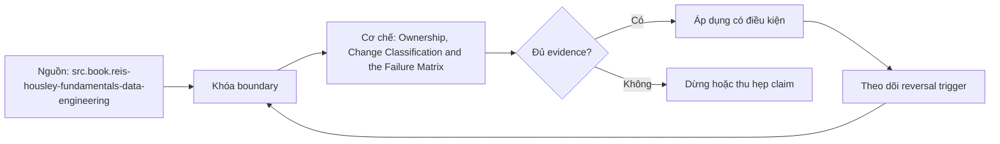

# Ownership, Change Classification and the Failure Matrix

> [!abstract] Câu hỏi trung tâm
> Ba vai sở hữu phối hợp ra sao, và failure matrix biến bảy lỗi semantic layer thành controls, tests và postmortem actions như thế nào?

## 1. Ba vai và quyền quyết định

Business owner quyết population, interpretation, acceptable change và consumer sign-off. Technical owner chịu implementation, tests, performance, security và incident response. Catalog steward giữ IDs, metadata, lifecycle gates, notices và evidence completeness. Một người có thể giữ nhiều vai ở đội nhỏ, nhưng decision rights vẫn tách. Gán cho “Finance team” không đủ: cần accountable person, deputy, escalation và review date.

## 2. RACI không thay accountability

Matrix tasks gồm propose, semantic approval, implementation, certify, change classify, incident response và remove. Mỗi task có đúng một accountable role; responsible có thể nhiều. Business owner không tự chứng minh SQL; technical owner không tự đổi nghĩa revenue; steward không quyết business exception. Conflict/escalation rule được viết trước. Out-of-office/departure trigger reassignment để metric không thành orphan.

## 3. Failure matrix bảy dòng

Double count; ambiguous join; wrong aggregation type; time semantic drift; aggregate inference leak; cache missing security/semantic version; formula overwritten in place. Mỗi row ghi symptom, invariant violated, root/contributing conditions, detection signal, prevention, automated test, severity, owner và response. “Query returned wrong number” là symptom, không phải root cause. Một control có thể cover nhiều rows nhưng mỗi row cần chứng minh detection path riêng.

## 4. Detection và prevention tách nhau

Reconciliation phát hiện double count nhưng pre-aggregation/path rules ngăn nó. Compile ambiguity check ngăn wrong path; generated-SQL review có thể phát hiện. Cache isolation test phát hiện cross-principal reuse; security-context keying/physical grants ngăn. Immutable versioning ngăn overwrite; artifact fingerprint audit phát hiện. Matrix không đạt nếu chỉ có lời khuyên thủ công không chạy được.

## 5. Fault injection và coverage

Tạo seven mutations trên fixture, mỗi mutation chỉ kích một failure mode khi có thể. Test harness báo rule code, affected metric/user/version và evidence. Target ≥6/7 là acceptance của bài nhưng row còn lọt phải có owner/remediation, không được gọi hệ thống an toàn. Injected error phải realistic và reversible; security test dùng synthetic principals/data, không rò dữ liệu thật.

## 6. Postmortem không đổ lỗi cá nhân

Timeline dựa facts, impact và detection lag; phân tích vì sao hệ thống cho action hợp lý tại thời điểm đó đi tới failure. Ghi contributing conditions như missing gate, ambiguous ownership, alert blind spot và incentive/time pressure. Blameless không bỏ accountability: action items có owner, due date, verification và priority. “Nhắc người cẩn thận hơn” không phải corrective control; test/gate/tool/documented decision mới quan sát được.

## 7. Từ postmortem về backlog kiểm soát

Mỗi finding map tới matrix row hoặc tạo row mới, rồi chọn prevent/detect/respond control. Action được đóng chỉ khi test hoặc observation chứng minh hiệu lực; merge code không tự là done. Theo dõi recurrence, detection time, escaped defects và stale owners. Business/technical/catalog owners cùng review vì incident semantic vừa là nghĩa, implementation vừa là governance failure.

## 8. Ma trận kiểm chứng từng mệnh đề

Mỗi mệnh đề dưới đây cần observation, fixture hoặc artifact có thể lưu. Tên công nghệ, consensus hoặc output nhìn hợp lý không tự là bằng chứng.

### 8.1. business owner quyết semantic meaning

**Mệnh đề cần kiểm.** business owner quyết semantic meaning.

**Cách kiểm.** Inject seven single-fault mutations, map mỗi failure tới invariant, detector và preventer. Viết evidence timeline/postmortem, rồi kiểm action items có owner, deadline và verification. Với riêng mệnh đề này, ghi input/context, expected observation, failure signal và boundary làm kết luận không còn đúng.

**Bằng chứng đạt cho `wiki.semantic-layer.ownership-failure-matrix`.** Lưu contract/decision version, fixture hoặc interview evidence, command/checklist output, reviewer và artifact hash. Nếu chưa thực hiện lab, trạng thái chỉ là protocol; không ghi thành kết quả đã quan sát.

### 8.2. technical owner chịu implementation evidence

**Mệnh đề cần kiểm.** technical owner chịu implementation evidence.

**Cách kiểm.** Inject seven single-fault mutations, map mỗi failure tới invariant, detector và preventer. Viết evidence timeline/postmortem, rồi kiểm action items có owner, deadline và verification. Với riêng mệnh đề này, ghi input/context, expected observation, failure signal và boundary làm kết luận không còn đúng.

**Bằng chứng đạt cho `wiki.semantic-layer.ownership-failure-matrix`.** Lưu contract/decision version, fixture hoặc interview evidence, command/checklist output, reviewer và artifact hash. Nếu chưa thực hiện lab, trạng thái chỉ là protocol; không ghi thành kết quả đã quan sát.

### 8.3. steward giữ lifecycle and catalog integrity

**Mệnh đề cần kiểm.** steward giữ lifecycle and catalog integrity.

**Cách kiểm.** Inject seven single-fault mutations, map mỗi failure tới invariant, detector và preventer. Viết evidence timeline/postmortem, rồi kiểm action items có owner, deadline và verification. Với riêng mệnh đề này, ghi input/context, expected observation, failure signal và boundary làm kết luận không còn đúng.

**Bằng chứng đạt cho `wiki.semantic-layer.ownership-failure-matrix`.** Lưu contract/decision version, fixture hoặc interview evidence, command/checklist output, reviewer và artifact hash. Nếu chưa thực hiện lab, trạng thái chỉ là protocol; không ghi thành kết quả đã quan sát.

### 8.4. team name không đủ accountability

**Mệnh đề cần kiểm.** team name không đủ accountability.

**Cách kiểm.** Inject seven single-fault mutations, map mỗi failure tới invariant, detector và preventer. Viết evidence timeline/postmortem, rồi kiểm action items có owner, deadline và verification. Với riêng mệnh đề này, ghi input/context, expected observation, failure signal và boundary làm kết luận không còn đúng.

**Bằng chứng đạt cho `wiki.semantic-layer.ownership-failure-matrix`.** Lưu contract/decision version, fixture hoặc interview evidence, command/checklist output, reviewer và artifact hash. Nếu chưa thực hiện lab, trạng thái chỉ là protocol; không ghi thành kết quả đã quan sát.

### 8.5. one accountable role per decision

**Mệnh đề cần kiểm.** one accountable role per decision.

**Cách kiểm.** Inject seven single-fault mutations, map mỗi failure tới invariant, detector và preventer. Viết evidence timeline/postmortem, rồi kiểm action items có owner, deadline và verification. Với riêng mệnh đề này, ghi input/context, expected observation, failure signal và boundary làm kết luận không còn đúng.

**Bằng chứng đạt cho `wiki.semantic-layer.ownership-failure-matrix`.** Lưu contract/decision version, fixture hoặc interview evidence, command/checklist output, reviewer và artifact hash. Nếu chưa thực hiện lab, trạng thái chỉ là protocol; không ghi thành kết quả đã quan sát.

### 8.6. failure matrix cần invariant and test

**Mệnh đề cần kiểm.** failure matrix cần invariant and test.

**Cách kiểm.** Inject seven single-fault mutations, map mỗi failure tới invariant, detector và preventer. Viết evidence timeline/postmortem, rồi kiểm action items có owner, deadline và verification. Với riêng mệnh đề này, ghi input/context, expected observation, failure signal và boundary làm kết luận không còn đúng.

**Bằng chứng đạt cho `wiki.semantic-layer.ownership-failure-matrix`.** Lưu contract/decision version, fixture hoặc interview evidence, command/checklist output, reviewer và artifact hash. Nếu chưa thực hiện lab, trạng thái chỉ là protocol; không ghi thành kết quả đã quan sát.

### 8.7. symptom khác root cause

**Mệnh đề cần kiểm.** symptom khác root cause.

**Cách kiểm.** Inject seven single-fault mutations, map mỗi failure tới invariant, detector và preventer. Viết evidence timeline/postmortem, rồi kiểm action items có owner, deadline và verification. Với riêng mệnh đề này, ghi input/context, expected observation, failure signal và boundary làm kết luận không còn đúng.

**Bằng chứng đạt cho `wiki.semantic-layer.ownership-failure-matrix`.** Lưu contract/decision version, fixture hoặc interview evidence, command/checklist output, reviewer và artifact hash. Nếu chưa thực hiện lab, trạng thái chỉ là protocol; không ghi thành kết quả đã quan sát.

### 8.8. detection khác prevention

**Mệnh đề cần kiểm.** detection khác prevention.

**Cách kiểm.** Inject seven single-fault mutations, map mỗi failure tới invariant, detector và preventer. Viết evidence timeline/postmortem, rồi kiểm action items có owner, deadline và verification. Với riêng mệnh đề này, ghi input/context, expected observation, failure signal và boundary làm kết luận không còn đúng.

**Bằng chứng đạt cho `wiki.semantic-layer.ownership-failure-matrix`.** Lưu contract/decision version, fixture hoặc interview evidence, command/checklist output, reviewer và artifact hash. Nếu chưa thực hiện lab, trạng thái chỉ là protocol; không ghi thành kết quả đã quan sát.

### 8.9. each row cần automated test

**Mệnh đề cần kiểm.** each row cần automated test.

**Cách kiểm.** Inject seven single-fault mutations, map mỗi failure tới invariant, detector và preventer. Viết evidence timeline/postmortem, rồi kiểm action items có owner, deadline và verification. Với riêng mệnh đề này, ghi input/context, expected observation, failure signal và boundary làm kết luận không còn đúng.

**Bằng chứng đạt cho `wiki.semantic-layer.ownership-failure-matrix`.** Lưu contract/decision version, fixture hoặc interview evidence, command/checklist output, reviewer và artifact hash. Nếu chưa thực hiện lab, trạng thái chỉ là protocol; không ghi thành kết quả đã quan sát.

### 8.10. fault injection nên single mutation

**Mệnh đề cần kiểm.** fault injection nên single mutation.

**Cách kiểm.** Inject seven single-fault mutations, map mỗi failure tới invariant, detector và preventer. Viết evidence timeline/postmortem, rồi kiểm action items có owner, deadline và verification. Với riêng mệnh đề này, ghi input/context, expected observation, failure signal và boundary làm kết luận không còn đúng.

**Bằng chứng đạt cho `wiki.semantic-layer.ownership-failure-matrix`.** Lưu contract/decision version, fixture hoặc interview evidence, command/checklist output, reviewer và artifact hash. Nếu chưa thực hiện lab, trạng thái chỉ là protocol; không ghi thành kết quả đã quan sát.

### 8.11. six of seven pass leaves residual risk

**Mệnh đề cần kiểm.** six of seven pass leaves residual risk.

**Cách kiểm.** Inject seven single-fault mutations, map mỗi failure tới invariant, detector và preventer. Viết evidence timeline/postmortem, rồi kiểm action items có owner, deadline và verification. Với riêng mệnh đề này, ghi input/context, expected observation, failure signal và boundary làm kết luận không còn đúng.

**Bằng chứng đạt cho `wiki.semantic-layer.ownership-failure-matrix`.** Lưu contract/decision version, fixture hoặc interview evidence, command/checklist output, reviewer và artifact hash. Nếu chưa thực hiện lab, trạng thái chỉ là protocol; không ghi thành kết quả đã quan sát.

### 8.12. security fixtures phải synthetic

**Mệnh đề cần kiểm.** security fixtures phải synthetic.

**Cách kiểm.** Inject seven single-fault mutations, map mỗi failure tới invariant, detector và preventer. Viết evidence timeline/postmortem, rồi kiểm action items có owner, deadline và verification. Với riêng mệnh đề này, ghi input/context, expected observation, failure signal và boundary làm kết luận không còn đúng.

**Bằng chứng đạt cho `wiki.semantic-layer.ownership-failure-matrix`.** Lưu contract/decision version, fixture hoặc interview evidence, command/checklist output, reviewer và artifact hash. Nếu chưa thực hiện lab, trạng thái chỉ là protocol; không ghi thành kết quả đã quan sát.

### 8.13. blameless không bỏ accountability

**Mệnh đề cần kiểm.** blameless không bỏ accountability.

**Cách kiểm.** Inject seven single-fault mutations, map mỗi failure tới invariant, detector và preventer. Viết evidence timeline/postmortem, rồi kiểm action items có owner, deadline và verification. Với riêng mệnh đề này, ghi input/context, expected observation, failure signal và boundary làm kết luận không còn đúng.

**Bằng chứng đạt cho `wiki.semantic-layer.ownership-failure-matrix`.** Lưu contract/decision version, fixture hoặc interview evidence, command/checklist output, reviewer và artifact hash. Nếu chưa thực hiện lab, trạng thái chỉ là protocol; không ghi thành kết quả đã quan sát.

### 8.14. action item cần owner due date verification

**Mệnh đề cần kiểm.** action item cần owner due date verification.

**Cách kiểm.** Inject seven single-fault mutations, map mỗi failure tới invariant, detector và preventer. Viết evidence timeline/postmortem, rồi kiểm action items có owner, deadline và verification. Với riêng mệnh đề này, ghi input/context, expected observation, failure signal và boundary làm kết luận không còn đúng.

**Bằng chứng đạt cho `wiki.semantic-layer.ownership-failure-matrix`.** Lưu contract/decision version, fixture hoặc interview evidence, command/checklist output, reviewer và artifact hash. Nếu chưa thực hiện lab, trạng thái chỉ là protocol; không ghi thành kết quả đã quan sát.

### 8.15. recurrence feeds control backlog

**Mệnh đề cần kiểm.** recurrence feeds control backlog.

**Cách kiểm.** Inject seven single-fault mutations, map mỗi failure tới invariant, detector và preventer. Viết evidence timeline/postmortem, rồi kiểm action items có owner, deadline và verification. Với riêng mệnh đề này, ghi input/context, expected observation, failure signal và boundary làm kết luận không còn đúng.

**Bằng chứng đạt cho `wiki.semantic-layer.ownership-failure-matrix`.** Lưu contract/decision version, fixture hoặc interview evidence, command/checklist output, reviewer và artifact hash. Nếu chưa thực hiện lab, trạng thái chỉ là protocol; không ghi thành kết quả đã quan sát.

## 9. Quy trình phản biện

1. Viết decision, consumer, contract và constraints trước khi chọn tool hoặc implementation.
2. Tách source fact, curriculum synthesis và organizational choice.
3. Dùng counterexample và changed constraint để kiểm quyết định có đảo đúng lúc.
4. Gắn mọi approval/certification với exact version, evidence và scope.
5. Kiểm cả valid path lẫn negative/failure path; không chỉ demo happy path.
6. Ghi limitation của telemetry, test environment và source authority.
7. Chưa có execution evidence thì giữ trạng thái `review`.

## 10. Câu hỏi tự kiểm tra

1. Decision hoặc invariant nào đang được bảo vệ?
2. Evidence nào độc lập với implementation đang được đánh giá?
3. Điều kiện nào làm lựa chọn hiện tại phải đảo?
4. Ai có quyền quyết nghĩa, ai triển khai và ai giữ quy trình?
5. Thay đổi nào ảnh hưởng consumer dù interface vẫn chạy?
6. Failure mode nào còn chưa có automated detector?

## 11. Giới hạn và điều chưa cho phép kết luận

- Chưa chạy các lab, migration, workload benchmark hoặc fault-injection; note mô tả protocol và expected evidence.
- Tài liệu sản phẩm web được kiểm ngày 2026-10-02; feature, syntax, license và integration có thể đổi.
- Các scorecard, lifecycle gates, failure matrix và decision contract là curriculum synthesis từ nguồn đã nêu; không gán nguyên văn cho một tác giả.
- Ví dụ tổ chức không thay discovery thực tế, threat model, cost model hoặc owner approval.
- Note giữ trạng thái `review` cho tới khi chủ dự án duyệt semantic meaning.

## Reference
1. [[SRC-REIS-HOUSLEY-FUNDAMENTALS-DATA-ENGINEERING]]
2. [[SRC-SOMMERVILLE-SOFTWARE-ENGINEERING-10E]]
3. [[SRC-GOOGLE-SRE-POSTMORTEM-CULTURE]]

## Source coverage

| Source slice | Nội dung sử dụng | Trạng thái |
|---|---|---|
| [[SRC-REIS-HOUSLEY-FUNDAMENTALS-DATA-ENGINEERING]] | Khái niệm, cơ chế hoặc decision boundary liên quan | Đã đọc locator được ghi trong source record; không suy ngoài phạm vi |
| [[SRC-SOMMERVILLE-SOFTWARE-ENGINEERING-10E]] | Khái niệm, cơ chế hoặc decision boundary liên quan | Đã đọc locator được ghi trong source record; không suy ngoài phạm vi |
| [[SRC-GOOGLE-SRE-POSTMORTEM-CULTURE]] | Khái niệm, cơ chế hoặc decision boundary liên quan | Đã đọc locator được ghi trong source record; không suy ngoài phạm vi |

## Key takeaways
- Chọn kiến trúc và data product từ decision/constraints, không từ độ mới của công nghệ.
- Metric governance cần versioned evidence, lifecycle gates và owner có quyền rõ.
- Failure matrix chỉ hữu dụng khi mỗi dòng có detector hoặc control kiểm được.
- Capstone là hồ sơ bằng chứng tích hợp, không phải bộ YAML hay dashboard trình diễn.
- Discovery phải cho phép kết luận không xây analytics product.

<!-- ATOMIC-EXECUTION-CAPSULE:START -->

## Execution capsule — kiểm chứng `wiki.semantic-layer.ownership-failure-matrix`

> [!important] Phân loại mệnh đề
> Với `wiki.semantic-layer.ownership-failure-matrix`, sơ đồ, ví dụ và artifact về **Ownership, Change Classification and the Failure Matrix** là **synthesis để kiểm chứng**; chúng không phải trích dẫn hay case nguyên văn của nguồn.

### Sơ đồ cơ chế và điểm kiểm soát



Đọc sơ đồ `wiki.semantic-layer.ownership-failure-matrix` từ trái sang phải: source chỉ cung cấp claim ban đầu cho **Ownership, Change Classification and the Failure Matrix**; quyết định chỉ được đi tiếp sau khi boundary, evidence và điều kiện đảo quyết định đã hiện hữu.

### Artifact thực thi tối thiểu

```sql
-- Verification harness for: Ownership, Change Classification and the Failure Matrix
WITH evidence AS (
    SELECT 'wiki.semantic-layer.ownership-failure-matrix' AS concept_id,
           'boundary_declared' AS check_name, 1 AS passed
    UNION ALL
    SELECT 'wiki.semantic-layer.ownership-failure-matrix', 'independent_oracle', 1
    UNION ALL
    SELECT 'wiki.semantic-layer.ownership-failure-matrix', 'reversal_trigger_recorded', 1
)
SELECT concept_id,
       MIN(passed) AS all_hard_checks_pass,
       COUNT(*) AS evidence_items
FROM evidence
GROUP BY concept_id
HAVING MIN(passed) = 1;
```

Artifact của `wiki.semantic-layer.ownership-failure-matrix` buộc người dùng ghi boundary, oracle và reversal trigger cho **Ownership, Change Classification and the Failure Matrix**. Các giá trị minh họa phải được thay bằng evidence thật trước khi dùng cho quyết định.

### Tự kiểm tra trước khi tái sử dụng

1. Bạn có thể trả lời `Ba vai sở hữu phối hợp ra sao, và failure matrix biến bảy lỗi semantic layer thành controls, tests và postmortem actions như thế nào?` bằng một câu mà không kéo thêm concept thứ hai không?
2. Source locator nào đỡ cho claim, và phần nào chỉ là synthesis trong note?
3. Observation nào khiến bạn dừng, thu hẹp hoặc đảo quyết định?
4. Artifact nào cho phép một reviewer độc lập tái hiện kết quả?

<!-- ATOMIC-EXECUTION-CAPSULE:END -->
