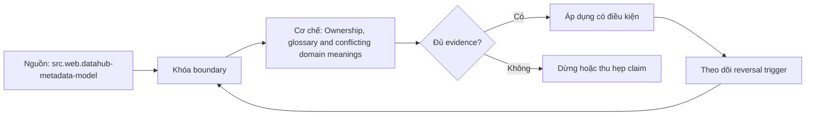

# Ownership, glossary and conflicting domain meanings

> [!abstract] Câu hỏi trung tâm
> Ownership và glossary xử lý cùng một thuật ngữ có nhiều nghĩa theo domain mà không ép đồng thuận giả thế nào?

## 1. Ownership roles

Accountable owner, steward, technical custodian và support contact khác nhau; suy owner từ usage hay git author là inference. Đừng bắt đầu bằng tên công cụ. Hãy bắt đầu bằng đối tượng được bảo vệ, boundary quan sát được và hậu quả nếu kết luận sai. Trong bài `Ownership, glossary and conflicting domain meanings`, câu hỏi thực dụng là: Ownership và glossary xử lý cùng một thuật ngữ có nhiều nghĩa theo domain mà không ép đồng thuận giả thế nào? Ta ghi rõ grain, population, time window, owner và hành động sau failure; nếu một trường chưa biết thì đánh dấu unknown thay vì lấp bằng mặc định. Bằng chứng tối thiểu gồm fixture có version, cấu hình hoặc rule đã resolve, raw observation, expected result và limitation. Phần này là curriculum synthesis dựa trên các nguồn đã định danh, không phải lời hứa rằng mọi adapter hay deployment đều có cùng hành vi.

## 2. Term identity

Glossary term có stable ID, definition, domain, scope, examples, exclusions, effective date và approver. Điểm khó không nằm ở cú pháp mà ở identity và scope. Hai phép đo cùng tên vẫn có thể nói về hai population hoặc hai thời điểm khác nhau. Trong bài `Ownership, glossary and conflicting domain meanings`, câu hỏi thực dụng là: Ownership và glossary xử lý cùng một thuật ngữ có nhiều nghĩa theo domain mà không ép đồng thuận giả thế nào? Ta ghi rõ grain, population, time window, owner và hành động sau failure; nếu một trường chưa biết thì đánh dấu unknown thay vì lấp bằng mặc định. Bằng chứng tối thiểu gồm fixture có version, cấu hình hoặc rule đã resolve, raw observation, expected result và limitation. Phần này là curriculum synthesis dựa trên các nguồn đã định danh, không phải lời hứa rằng mọi adapter hay deployment đều có cùng hành vi.

## 3. Contextual meaning

Customer, revenue hay active có thể hợp lệ với nhiều định nghĩa theo bounded context; giữ qualifiers thay vì merge tên. Một dashboard xanh chỉ là tín hiệu. Muốn biến nó thành bằng chứng phải giữ input, phiên bản, rule, trạng thái trước–sau và cách tính độc lập. Trong bài `Ownership, glossary and conflicting domain meanings`, câu hỏi thực dụng là: Ownership và glossary xử lý cùng một thuật ngữ có nhiều nghĩa theo domain mà không ép đồng thuận giả thế nào? Ta ghi rõ grain, population, time window, owner và hành động sau failure; nếu một trường chưa biết thì đánh dấu unknown thay vì lấp bằng mặc định. Bằng chứng tối thiểu gồm fixture có version, cấu hình hoặc rule đã resolve, raw observation, expected result và limitation. Phần này là curriculum synthesis dựa trên các nguồn đã định danh, không phải lời hứa rằng mọi adapter hay deployment đều có cùng hành vi.

## 4. Conflict record

Ghi competing claims, authorities, affected assets, decision status và resolution owner; conflict chưa giải quyết vẫn phải tìm thấy. Thiết kế tốt phải chịu được counterexample. Hãy chủ động tạo case sát boundary, case thiếu dữ liệu và case replay thay vì chỉ chạy happy path. Trong bài `Ownership, glossary and conflicting domain meanings`, câu hỏi thực dụng là: Ownership và glossary xử lý cùng một thuật ngữ có nhiều nghĩa theo domain mà không ép đồng thuận giả thế nào? Ta ghi rõ grain, population, time window, owner và hành động sau failure; nếu một trường chưa biết thì đánh dấu unknown thay vì lấp bằng mặc định. Bằng chứng tối thiểu gồm fixture có version, cấu hình hoặc rule đã resolve, raw observation, expected result và limitation. Phần này là curriculum synthesis dựa trên các nguồn đã định danh, không phải lời hứa rằng mọi adapter hay deployment đều có cùng hành vi.

## 5. Binding assets

Liên kết term với field/metric/model có relationship type và review date; text mention không tự thành semantic binding. Chi phí vận hành thuộc contract. Một rule đúng nhưng quá đắt, quá ồn hoặc không có owner sẽ nhanh chóng bị tắt và mất tác dụng. Trong bài `Ownership, glossary and conflicting domain meanings`, câu hỏi thực dụng là: Ownership và glossary xử lý cùng một thuật ngữ có nhiều nghĩa theo domain mà không ép đồng thuận giả thế nào? Ta ghi rõ grain, population, time window, owner và hành động sau failure; nếu một trường chưa biết thì đánh dấu unknown thay vì lấp bằng mặc định. Bằng chứng tối thiểu gồm fixture có version, cấu hình hoặc rule đã resolve, raw observation, expected result và limitation. Phần này là curriculum synthesis dựa trên các nguồn đã định danh, không phải lời hứa rằng mọi adapter hay deployment đều có cùng hành vi.

## 6. Governance workflow

Propose, review, approve, publish, expire và supersede có audit trail; emergency correction không xóa history. Kết luận cần có điều kiện đảo chiều. Khi volume, latency, nguồn thẩm quyền hoặc topology đổi, quyết định cũ phải được xem xét lại bằng cùng một oracle. Trong bài `Ownership, glossary and conflicting domain meanings`, câu hỏi thực dụng là: Ownership và glossary xử lý cùng một thuật ngữ có nhiều nghĩa theo domain mà không ép đồng thuận giả thế nào? Ta ghi rõ grain, population, time window, owner và hành động sau failure; nếu một trường chưa biết thì đánh dấu unknown thay vì lấp bằng mặc định. Bằng chứng tối thiểu gồm fixture có version, cấu hình hoặc rule đã resolve, raw observation, expected result và limitation. Phần này là curriculum synthesis dựa trên các nguồn đã định danh, không phải lời hứa rằng mọi adapter hay deployment đều có cùng hành vi.

## 7. Ma trận kiểm chứng từng mệnh đề

Với `wiki.metadata.ownership-glossary-conflicts`, command thành công không tự chứng minh dữ liệu đúng. Protocol riêng của bài là: Dựng metadata graph/query fixture có ground-truth manifest, inject ambiguity hoặc stale state và đối chiếu result với expected identities. Mỗi probe dưới đây phải nối input boundary với failure signal và oracle có thể phản bác kết luận.

### 7.1. Ownership, glossary and conflicting domain meanings: kiểm `Ownership roles` bằng case 1, cụ thể accountable owner, steward, technical custodian và support contact khác nhau; suy owner từ usage hay git author là inference

**Mệnh đề cần kiểm.** Ownership, glossary and conflicting domain meanings: kiểm `Ownership roles` bằng case 1, cụ thể accountable owner, steward, technical custodian và support contact khác nhau; suy owner từ usage hay git author là inference.

**Thiết kế phép thử cho `wiki.metadata.ownership-glossary-conflicts`.** Trong ngữ cảnh `wiki.metadata.ownership-glossary-conflicts`, tạo positive control và negative control chỉ khác đúng một điều kiện. Khóa input snapshot, phiên bản và owner của rule; chạy đúng population được bài `Ownership, glossary and conflicting domain meanings` công bố.

**Bằng chứng cần giữ.** Đối với probe 1 của `Ownership, glossary and conflicting domain meanings`, giữ fixture, raw failing rows và lệnh tái hiện. Nếu chưa chạy lab, ghi expected evidence và giữ trạng thái review; không biến protocol thành observation.

### 7.2. Ownership, glossary and conflicting domain meanings: kiểm `Term identity` bằng case 2, cụ thể glossary term có stable id, definition, domain, scope, examples, exclusions, effective date và approver

**Mệnh đề cần kiểm.** Ownership, glossary and conflicting domain meanings: kiểm `Term identity` bằng case 2, cụ thể glossary term có stable id, definition, domain, scope, examples, exclusions, effective date và approver.

**Thiết kế phép thử cho `wiki.metadata.ownership-glossary-conflicts`.** Trong ngữ cảnh `wiki.metadata.ownership-glossary-conflicts`, đổi grain nhưng giữ tổng số dòng để lộ phép đo sai cấp. Khóa input snapshot, phiên bản và owner của rule; chạy đúng population được bài `Ownership, glossary and conflicting domain meanings` công bố.

**Bằng chứng cần giữ.** Đối với probe 2 của `Ownership, glossary and conflicting domain meanings`, báo numerator, denominator và key set ở cả hai grain. Nếu chưa chạy lab, ghi expected evidence và giữ trạng thái review; không biến protocol thành observation.

### 7.3. Ownership, glossary and conflicting domain meanings: kiểm `Contextual meaning` bằng case 3, cụ thể customer, revenue hay active có thể hợp lệ với nhiều định nghĩa theo bounded context; giữ qualifiers thay vì merge tên

**Mệnh đề cần kiểm.** Ownership, glossary and conflicting domain meanings: kiểm `Contextual meaning` bằng case 3, cụ thể customer, revenue hay active có thể hợp lệ với nhiều định nghĩa theo bounded context; giữ qualifiers thay vì merge tên.

**Thiết kế phép thử cho `wiki.metadata.ownership-glossary-conflicts`.** Trong ngữ cảnh `wiki.metadata.ownership-glossary-conflicts`, đưa một giá trị tới đúng boundary và một giá trị vượt boundary. Khóa input snapshot, phiên bản và owner của rule; chạy đúng population được bài `Ownership, glossary and conflicting domain meanings` công bố.

**Bằng chứng cần giữ.** Đối với probe 3 của `Ownership, glossary and conflicting domain meanings`, lưu hai observed values cùng rule đã resolve. Nếu chưa chạy lab, ghi expected evidence và giữ trạng thái review; không biến protocol thành observation.

### 7.4. Ownership, glossary and conflicting domain meanings: kiểm `Conflict record` bằng case 4, cụ thể ghi competing claims, authorities, affected assets, decision status và resolution owner; conflict chưa giải quyết vẫn phải tìm thấy

**Mệnh đề cần kiểm.** Ownership, glossary and conflicting domain meanings: kiểm `Conflict record` bằng case 4, cụ thể ghi competing claims, authorities, affected assets, decision status và resolution owner; conflict chưa giải quyết vẫn phải tìm thấy.

**Thiết kế phép thử cho `wiki.metadata.ownership-glossary-conflicts`.** Trong ngữ cảnh `wiki.metadata.ownership-glossary-conflicts`, kill tiến trình ngay trước rồi ngay sau durable side effect. Khóa input snapshot, phiên bản và owner của rule; chạy đúng population được bài `Ownership, glossary and conflicting domain meanings` công bố.

**Bằng chứng cần giữ.** Đối với probe 4 của `Ownership, glossary and conflicting domain meanings`, lưu checkpoint, external ledger và trạng thái sau restart. Nếu chưa chạy lab, ghi expected evidence và giữ trạng thái review; không biến protocol thành observation.

### 7.5. Ownership, glossary and conflicting domain meanings: kiểm `Binding assets` bằng case 5, cụ thể liên kết term với field/metric/model có relationship type và review date; text mention không tự thành semantic binding

**Mệnh đề cần kiểm.** Ownership, glossary and conflicting domain meanings: kiểm `Binding assets` bằng case 5, cụ thể liên kết term với field/metric/model có relationship type và review date; text mention không tự thành semantic binding.

**Thiết kế phép thử cho `wiki.metadata.ownership-glossary-conflicts`.** Trong ngữ cảnh `wiki.metadata.ownership-glossary-conflicts`, đảo thứ tự input và concurrency nhưng giữ logical population. Khóa input snapshot, phiên bản và owner của rule; chạy đúng population được bài `Ownership, glossary and conflicting domain meanings` công bố.

**Bằng chứng cần giữ.** Đối với probe 5 của `Ownership, glossary and conflicting domain meanings`, so canonical hash và business totals giữa các thứ tự. Nếu chưa chạy lab, ghi expected evidence và giữ trạng thái review; không biến protocol thành observation.

### 7.6. Ownership, glossary and conflicting domain meanings: kiểm `Governance workflow` bằng case 6, cụ thể propose, review, approve, publish, expire và supersede có audit trail; emergency correction không xóa history

**Mệnh đề cần kiểm.** Ownership, glossary and conflicting domain meanings: kiểm `Governance workflow` bằng case 6, cụ thể propose, review, approve, publish, expire và supersede có audit trail; emergency correction không xóa history.

**Thiết kế phép thử cho `wiki.metadata.ownership-glossary-conflicts`.** Trong ngữ cảnh `wiki.metadata.ownership-glossary-conflicts`, replay cùng identity với payload giống rồi payload xung đột. Khóa input snapshot, phiên bản và owner của rule; chạy đúng population được bài `Ownership, glossary and conflicting domain meanings` công bố.

**Bằng chứng cần giữ.** Đối với probe 6 của `Ownership, glossary and conflicting domain meanings`, tách duplicate replay khỏi identity collision bằng reason code. Nếu chưa chạy lab, ghi expected evidence và giữ trạng thái review; không biến protocol thành observation.

### 7.7. Ownership, glossary and conflicting domain meanings: kiểm `Ownership roles` bằng case 7, cụ thể accountable owner, steward, technical custodian và support contact khác nhau; suy owner từ usage hay git author là inference

**Mệnh đề cần kiểm.** Ownership, glossary and conflicting domain meanings: kiểm `Ownership roles` bằng case 7, cụ thể accountable owner, steward, technical custodian và support contact khác nhau; suy owner từ usage hay git author là inference.

**Thiết kế phép thử cho `wiki.metadata.ownership-glossary-conflicts`.** Trong ngữ cảnh `wiki.metadata.ownership-glossary-conflicts`, thêm record tới trễ trong horizon và ngoài horizon. Khóa input snapshot, phiên bản và owner của rule; chạy đúng population được bài `Ownership, glossary and conflicting domain meanings` công bố.

**Bằng chứng cần giữ.** Đối với probe 7 của `Ownership, glossary and conflicting domain meanings`, báo accepted-late, rejected-late và oldest outstanding timestamp. Nếu chưa chạy lab, ghi expected evidence và giữ trạng thái review; không biến protocol thành observation.

### 7.8. Ownership, glossary and conflicting domain meanings: kiểm `Term identity` bằng case 8, cụ thể glossary term có stable id, definition, domain, scope, examples, exclusions, effective date và approver

**Mệnh đề cần kiểm.** Ownership, glossary and conflicting domain meanings: kiểm `Term identity` bằng case 8, cụ thể glossary term có stable id, definition, domain, scope, examples, exclusions, effective date và approver.

**Thiết kế phép thử cho `wiki.metadata.ownership-glossary-conflicts`.** Trong ngữ cảnh `wiki.metadata.ownership-glossary-conflicts`, đổi schema theo một cách tương thích rồi một cách phá vỡ semantics. Khóa input snapshot, phiên bản và owner của rule; chạy đúng population được bài `Ownership, glossary and conflicting domain meanings` công bố.

**Bằng chứng cần giữ.** Đối với probe 8 của `Ownership, glossary and conflicting domain meanings`, giữ schema diff, classification và consumer-visible result. Nếu chưa chạy lab, ghi expected evidence và giữ trạng thái review; không biến protocol thành observation.

### 7.9. Ownership, glossary and conflicting domain meanings: kiểm `Contextual meaning` bằng case 9, cụ thể customer, revenue hay active có thể hợp lệ với nhiều định nghĩa theo bounded context; giữ qualifiers thay vì merge tên

**Mệnh đề cần kiểm.** Ownership, glossary and conflicting domain meanings: kiểm `Contextual meaning` bằng case 9, cụ thể customer, revenue hay active có thể hợp lệ với nhiều định nghĩa theo bounded context; giữ qualifiers thay vì merge tên.

**Thiết kế phép thử cho `wiki.metadata.ownership-glossary-conflicts`.** Trong ngữ cảnh `wiki.metadata.ownership-glossary-conflicts`, tạo missing và duplicate bù nhau để count tổng không đổi. Khóa input snapshot, phiên bản và owner của rule; chạy đúng population được bài `Ownership, glossary and conflicting domain meanings` công bố.

**Bằng chứng cần giữ.** Đối với probe 9 của `Ownership, glossary and conflicting domain meanings`, so key multiset và typed hashes thay vì chỉ row count. Nếu chưa chạy lab, ghi expected evidence và giữ trạng thái review; không biến protocol thành observation.

### 7.10. Ownership, glossary and conflicting domain meanings: kiểm `Conflict record` bằng case 10, cụ thể ghi competing claims, authorities, affected assets, decision status và resolution owner; conflict chưa giải quyết vẫn phải tìm thấy

**Mệnh đề cần kiểm.** Ownership, glossary and conflicting domain meanings: kiểm `Conflict record` bằng case 10, cụ thể ghi competing claims, authorities, affected assets, decision status và resolution owner; conflict chưa giải quyết vẫn phải tìm thấy.

**Thiết kế phép thử cho `wiki.metadata.ownership-glossary-conflicts`.** Trong ngữ cảnh `wiki.metadata.ownership-glossary-conflicts`, cho reviewer tái hiện chỉ từ evidence package. Khóa input snapshot, phiên bản và owner của rule; chạy đúng population được bài `Ownership, glossary and conflicting domain meanings` công bố.

**Bằng chứng cần giữ.** Đối với probe 10 của `Ownership, glossary and conflicting domain meanings`, package phải đủ để người khác dựng lại decision và limitation. Nếu chưa chạy lab, ghi expected evidence và giữ trạng thái review; không biến protocol thành observation.

### 7.11. Ownership, glossary and conflicting domain meanings: kiểm `Binding assets` bằng case 11, cụ thể liên kết term với field/metric/model có relationship type và review date; text mention không tự thành semantic binding

**Mệnh đề cần kiểm.** Ownership, glossary and conflicting domain meanings: kiểm `Binding assets` bằng case 11, cụ thể liên kết term với field/metric/model có relationship type và review date; text mention không tự thành semantic binding.

**Thiết kế phép thử cho `wiki.metadata.ownership-glossary-conflicts`.** Trong ngữ cảnh `wiki.metadata.ownership-glossary-conflicts`, so với oracle độc lập không dùng chung query hoặc parser. Khóa input snapshot, phiên bản và owner của rule; chạy đúng population được bài `Ownership, glossary and conflicting domain meanings` công bố.

**Bằng chứng cần giữ.** Đối với probe 11 của `Ownership, glossary and conflicting domain meanings`, independent result phải khớp ở grain đã công bố. Nếu chưa chạy lab, ghi expected evidence và giữ trạng thái review; không biến protocol thành observation.

### 7.12. Ownership, glossary and conflicting domain meanings: kiểm `Governance workflow` bằng case 12, cụ thể propose, review, approve, publish, expire và supersede có audit trail; emergency correction không xóa history

**Mệnh đề cần kiểm.** Ownership, glossary and conflicting domain meanings: kiểm `Governance workflow` bằng case 12, cụ thể propose, review, approve, publish, expire và supersede có audit trail; emergency correction không xóa history.

**Thiết kế phép thử cho `wiki.metadata.ownership-glossary-conflicts`.** Trong ngữ cảnh `wiki.metadata.ownership-glossary-conflicts`, chạy scope hẹp và population đầy đủ rồi công bố phần bị loại. Khóa input snapshot, phiên bản và owner của rule; chạy đúng population được bài `Ownership, glossary and conflicting domain meanings` công bố.

**Bằng chứng cần giữ.** Đối với probe 12 của `Ownership, glossary and conflicting domain meanings`, coverage phải nêu rõ excluded nodes, partitions hoặc incidents. Nếu chưa chạy lab, ghi expected evidence và giữ trạng thái review; không biến protocol thành observation.

### 7.13. Ownership, glossary and conflicting domain meanings: kiểm `Ownership roles` bằng case 13, cụ thể accountable owner, steward, technical custodian và support contact khác nhau; suy owner từ usage hay git author là inference

**Mệnh đề cần kiểm.** Ownership, glossary and conflicting domain meanings: kiểm `Ownership roles` bằng case 13, cụ thể accountable owner, steward, technical custodian và support contact khác nhau; suy owner từ usage hay git author là inference.

**Thiết kế phép thử cho `wiki.metadata.ownership-glossary-conflicts`.** Trong ngữ cảnh `wiki.metadata.ownership-glossary-conflicts`, thử timezone, precision hoặc partition ở hai phía của ranh giới. Khóa input snapshot, phiên bản và owner của rule; chạy đúng population được bài `Ownership, glossary and conflicting domain meanings` công bố.

**Bằng chứng cần giữ.** Đối với probe 13 của `Ownership, glossary and conflicting domain meanings`, UTC/local interval và rounding policy phải hiện trong output. Nếu chưa chạy lab, ghi expected evidence và giữ trạng thái review; không biến protocol thành observation.

### 7.14. Ownership, glossary and conflicting domain meanings: kiểm `Term identity` bằng case 14, cụ thể glossary term có stable id, definition, domain, scope, examples, exclusions, effective date và approver

**Mệnh đề cần kiểm.** Ownership, glossary and conflicting domain meanings: kiểm `Term identity` bằng case 14, cụ thể glossary term có stable id, definition, domain, scope, examples, exclusions, effective date và approver.

**Thiết kế phép thử cho `wiki.metadata.ownership-glossary-conflicts`.** Trong ngữ cảnh `wiki.metadata.ownership-glossary-conflicts`, đổi constraint đủ lớn để quyết định phải đảo. Khóa input snapshot, phiên bản và owner của rule; chạy đúng population được bài `Ownership, glossary and conflicting domain meanings` công bố.

**Bằng chứng cần giữ.** Đối với probe 14 của `Ownership, glossary and conflicting domain meanings`, ADR phải lưu changed constraint và reversal threshold. Nếu chưa chạy lab, ghi expected evidence và giữ trạng thái review; không biến protocol thành observation.

### 7.15. Ownership, glossary and conflicting domain meanings: kiểm `Contextual meaning` bằng case 15, cụ thể customer, revenue hay active có thể hợp lệ với nhiều định nghĩa theo bounded context; giữ qualifiers thay vì merge tên

**Mệnh đề cần kiểm.** Ownership, glossary and conflicting domain meanings: kiểm `Contextual meaning` bằng case 15, cụ thể customer, revenue hay active có thể hợp lệ với nhiều định nghĩa theo bounded context; giữ qualifiers thay vì merge tên.

**Thiết kế phép thử cho `wiki.metadata.ownership-glossary-conflicts`.** Trong ngữ cảnh `wiki.metadata.ownership-glossary-conflicts`, chạy lại từ môi trường sạch với versions và seed đã khóa. Khóa input snapshot, phiên bản và owner của rule; chạy đúng population được bài `Ownership, glossary and conflicting domain meanings` công bố.

**Bằng chứng cần giữ.** Đối với probe 15 của `Ownership, glossary and conflicting domain meanings`, canonical result phải ổn định hoặc mọi nondeterminism phải được giải thích. Nếu chưa chạy lab, ghi expected evidence và giữ trạng thái review; không biến protocol thành observation.

## 8. Quy trình phản biện

1. Viết consumer-visible invariant cho `Ownership, glossary and conflicting domain meanings` trước khi chọn query hoặc tool.
2. Khóa grain, identity, population, time window và authoritative source.
3. Phân biệt declared configuration, executed state và published state.
4. Chạy negative control, replay hoặc changed-assumption case phù hợp.
5. Đối soát bằng oracle độc lập; công bố coverage và phần không quan sát được.
6. Gắn owner, hành động, reversal trigger và hạn review cho kết luận.

## 9. Câu hỏi tự kiểm tra

1. `Ownership, glossary and conflicting domain meanings: kiểm `Ownership roles` bằng case 1, cụ thể accountable owner, steward, technical custodian và support contact khác nhau; suy owner từ usage hay git author là inference` thất bại đầu tiên ở boundary nào?
2. Artifact nào mạnh nhất để trả lời `Ownership, glossary and conflicting domain meanings: kiểm `Contextual meaning` bằng case 3, cụ thể customer, revenue hay active có thể hợp lệ với nhiều định nghĩa theo bounded context; giữ qualifiers thay vì merge tên`?
3. Counterexample nhỏ nhất cho `Ownership, glossary and conflicting domain meanings: kiểm `Governance workflow` bằng case 6, cụ thể propose, review, approve, publish, expire và supersede có audit trail; emergency correction không xóa history` gồm những state nào?
4. `Ownership, glossary and conflicting domain meanings: kiểm `Contextual meaning` bằng case 9, cụ thể customer, revenue hay active có thể hợp lệ với nhiều định nghĩa theo bounded context; giữ qualifiers thay vì merge tên` có thể xanh giả ra sao?
5. Constraint nào khiến quyết định ở `Ownership, glossary and conflicting domain meanings: kiểm `Term identity` bằng case 14, cụ thể glossary term có stable id, definition, domain, scope, examples, exclusions, effective date và approver` phải đảo?
6. Phần nào của `Ownership, glossary and conflicting domain meanings: kiểm `Contextual meaning` bằng case 15, cụ thể customer, revenue hay active có thể hợp lệ với nhiều định nghĩa theo bounded context; giữ qualifiers thay vì merge tên` mới là protocol, chưa phải observation?

## 10. Giới hạn và điều chưa cho phép kết luận

- Lab của `Ownership, glossary and conflicting domain meanings` chưa chạy trên hệ thống production; nội dung là giáo trình và expected evidence.
- Hành vi phụ thuộc phiên bản, connector, scheduler, warehouse và catalog configuration phải được kiểm lại.
- Các ma trận, ladder và threshold do giáo trình tổng hợp không được gán nguyên văn cho vendor.
- Note giữ trạng thái `review` cho tới khi owner duyệt semantics và learner artifact.

## Reference
1. [[SRC-DATAHUB-METADATA-MODEL]]
2. [[SRC-DATAHUB-SEARCH]]

## Source coverage

| Source slice | Nội dung sử dụng | Trạng thái |
|---|---|---|
| [[SRC-DATAHUB-METADATA-MODEL]] | Contract hoặc cơ chế liên quan trực tiếp tới `Ownership, glossary and conflicting domain meanings` | Đã đọc locator; cần pin version khi chạy lab |
| [[SRC-DATAHUB-SEARCH]] | Contract hoặc cơ chế liên quan trực tiếp tới `Ownership, glossary and conflicting domain meanings` | Đã đọc locator; cần pin version khi chạy lab |

## Key takeaways
- Conflicting domain meanings cần identity và scope riêng thay vì merge tên.
- Với `wiki.metadata.ownership-glossary-conflicts`, quality của kết luận phụ thuộc identity, coverage và oracle chứ không phụ thuộc màu dashboard.
- Câu hỏi `Ownership và glossary xử lý cùng một thuật ngữ có nhiều nghĩa theo domain mà không ép đồng thuận giả thế nào?` chỉ được trả lời trong scope và version đã ghi.
- Các source IDs `src.web.datahub-metadata-model, src.web.datahub-search` đặt ranh giới cho source fact; phần còn lại là synthesis có nhãn.
- Trước khi lab chạy, đây là note đã kiểm cấu trúc và provenance, chưa phải chứng nhận production.

<!-- ATOMIC-EXECUTION-CAPSULE:START -->

## Execution capsule — kiểm chứng `wiki.metadata.ownership-glossary-conflicts`

> [!important] Phân loại mệnh đề
> Với `wiki.metadata.ownership-glossary-conflicts`, sơ đồ, ví dụ và artifact về **Ownership, glossary and conflicting domain meanings** là **synthesis để kiểm chứng**; chúng không phải trích dẫn hay case nguyên văn của nguồn.

### Sơ đồ cơ chế và điểm kiểm soát



Đọc sơ đồ `wiki.metadata.ownership-glossary-conflicts` từ trái sang phải: source chỉ cung cấp claim ban đầu cho **Ownership, glossary and conflicting domain meanings**; quyết định chỉ được đi tiếp sau khi boundary, evidence và điều kiện đảo quyết định đã hiện hữu.

### Artifact thực thi tối thiểu

```sql
-- Verification harness for: Ownership, glossary and conflicting domain meanings
WITH evidence AS (
    SELECT 'wiki.metadata.ownership-glossary-conflicts' AS concept_id,
           'boundary_declared' AS check_name, 1 AS passed
    UNION ALL
    SELECT 'wiki.metadata.ownership-glossary-conflicts', 'independent_oracle', 1
    UNION ALL
    SELECT 'wiki.metadata.ownership-glossary-conflicts', 'reversal_trigger_recorded', 1
)
SELECT concept_id,
       MIN(passed) AS all_hard_checks_pass,
       COUNT(*) AS evidence_items
FROM evidence
GROUP BY concept_id
HAVING MIN(passed) = 1;
```

Artifact của `wiki.metadata.ownership-glossary-conflicts` buộc người dùng ghi boundary, oracle và reversal trigger cho **Ownership, glossary and conflicting domain meanings**. Các giá trị minh họa phải được thay bằng evidence thật trước khi dùng cho quyết định.

### Tự kiểm tra trước khi tái sử dụng

1. Bạn có thể trả lời `Ownership và glossary xử lý cùng một thuật ngữ có nhiều nghĩa theo domain mà không ép đồng thuận giả thế nào?` bằng một câu mà không kéo thêm concept thứ hai không?
2. Source locator nào đỡ cho claim, và phần nào chỉ là synthesis trong note?
3. Observation nào khiến bạn dừng, thu hẹp hoặc đảo quyết định?
4. Artifact nào cho phép một reviewer độc lập tái hiện kết quả?

<!-- ATOMIC-EXECUTION-CAPSULE:END -->
