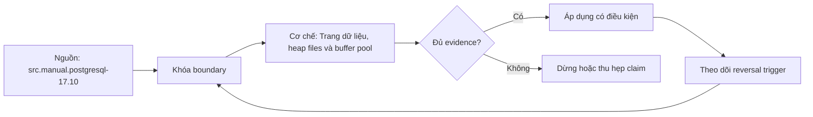

# Trang dữ liệu, heap files và buffer pool

> [!abstract] Câu hỏi trung tâm
> Row được đặt và định vị trong page/heap như thế nào, page đi qua shared buffers và OS cache ra sao, và số hit/read cho phép kết luận đến đâu?

## 1. Đơn vị I/O là block/page

PostgreSQL tổ chức relations thành blocks/pages có kích thước build-time, thông thường 8 KiB. Đây là default phổ biến của PostgreSQL, không phải quy luật mọi database. `SHOW block_size` xác nhận instance.

Executor yêu cầu tuple nhưng storage/buffer manager làm việc theo pages. Một row nhỏ vẫn kéo page chứa nó vào cache. Locality vì vậy quyết định pages đọc. Sequential scan đi qua heap pages; index lookup tìm TID rồi fetch heap page nếu cần.

Không nói “database không đọc theo row” tuyệt đối ở mọi tầng: executor trao tuples, còn storage I/O/caching theo pages.

## 2. Relation, segment và forks

Heap relation là tập pages không ordered theo logical key. File relation lớn được chia segments theo size convention. Mỗi relation có main fork và có thể FSM, VM, init forks; indexes là relations riêng.

Main fork chứa heap/index data. Free Space Map giúp tìm pages có free space cho inserts/updates. Visibility Map ghi all-visible/all-frozen page-level facts, hỗ trợ vacuum/index-only scans. Chúng không “nằm ngay trong mỗi data page”; chúng là forks/structures riêng. Đây là hiệu chỉnh quan trọng so với mô tả giản lược.

File path/relfilenode có thể đổi khi rewrite; không dựa path như stable identity.

## 3. Bố cục page

Manual PostgreSQL 17 mô tả năm phần: PageHeaderData; array ItemIdData; free space; items; special space. Header giữ LSN/checksum/flags và `pd_lower`, `pd_upper`, `pd_special` boundaries. Item identifiers bốn bytes trỏ tới items.

Header/item array lớn từ đầu lên; tuples/items đặt từ cuối vùng usable xuống; free space ở giữa. Special space dùng bởi access methods, heap thường không cần như index pages.

Không gọi FSM/VM là metadata nằm trong page header. Page header chỉ có fields page-local; FSM/VM ở forks riêng.

## 4. Line pointers và stable CTID

Heap tuple identifier gồm block number + item/offset number (CTID). Line pointer cho phép tuple data di chuyển/compact trong page mà references qua item slot còn ý nghĩa trong phạm vi version/lifecycle. CTID không phải business key và có thể đổi sau UPDATE/VACUUM FULL/CLUSTER.

ItemId states unused/normal/redirect/dead hỗ trợ HOT/pruning. `pageinspect` hiển thị line pointers và tuple headers, nhưng output low-level/version-sensitive.

Không lưu CTID làm long-lived identifier. Dùng primary/business key.

## 5. Tuple header và MVCC

Heap tuple có header với xmin/xmax, command IDs/infomask, CTID và null bitmap tùy row. MVCC visibility xác định version nào visible theo snapshot. UPDATE thường tạo new tuple version; DELETE đánh dấu xmax.

Row width, alignment, NULL bitmap và TOAST ảnh hưởng page capacity. Large attributes có thể stored externally/compressed; `avg_width` không đủ mô tả mọi page.

Inspect tuple headers cần hiểu transaction status; raw xmin/xmax không tự nói committed/visible.

## 6. HOT updates

Heap-Only Tuple optimization có thể tránh new index entries khi indexed columns không đổi và new tuple version nằm cùng heap page đủ chỗ. Line pointer redirect/chain giúp index tới chain. HOT giảm index churn/bloat.

Fillfactor để free room tăng cơ hội HOT nhưng làm table lớn hơn/read more pages. Nhiều indexes hoặc update indexed columns giảm HOT. Theo dõi `n_tup_hot_upd` cùng workload.

HOT không có nghĩa update “in place”; vẫn có tuple version theo MVCC.

## 7. Heap không có logical ordering

Heap pages/tuples không bảo đảm primary-key order. Seq scan trả physical traversal order nhưng SQL output không có contract nếu thiếu ORDER BY. CLUSTER/rewrite có thể reorder physical heap theo index tại thời điểm chạy, rồi subsequent writes làm correlation drift.

Tìm row không có usable access path thường scan candidate pages, nhưng partition pruning/BRIN/other paths có thể giảm. Tránh khẩu quyết “không index = mọi page” trong mọi query.

Physical locality hỗ trợ range I/O nhưng không thay ORDER BY semantics.

## 8. Shared buffer cache

PostgreSQL shared buffers là shared-memory cache các database blocks. Buffer tags định relation/fork/block; descriptors giữ pin, dirty, usage count và state. Backend pin buffer khi dùng; pinned buffer không bị evict.

Page read vào buffer, được kiểm/locked theo operation; update làm dirty. Dirty page phải được viết trước reuse và theo checkpoint/background writer/WAL rules. WAL-before-data bảo vệ recovery.

`shared_buffers` size không nên chọn bằng một tỷ lệ universal; workload/OS/memory/checkpoint quyết định.

## 9. Clock-sweep replacement

PostgreSQL dùng clock-sweep approximation: usage count tăng khi accessed trong giới hạn; clock hand giảm counts và chọn unpinned usage zero victim. Bulk scans có buffer access strategies/rings để tránh đẩy toàn working set nóng ra cache.

LRU thuần là mô hình sai. `pg_buffercache` usage counts là snapshot, concurrent activity làm minor inconsistencies. Một usage count không phải precise recency timestamp.

Temporary relations có local buffers; temp work files khác shared buffer path.

## 10. Hai tầng cache

PostgreSQL shared buffers nằm trên filesystem; OS page cache có thể giữ file blocks. `shared read` nghĩa miss trong PostgreSQL cache và request read, nhưng kernel có thể phục vụ RAM. Vì vậy read block không đồng nghĩa physical device I/O.

Double caching không chỉ “lãng phí”: OS thực hiện filesystem/I/O/readahead và PostgreSQL cần page-aware locking/dirty/visibility. Direct I/O developments/version specifics cần tra riêng.

Đo server buffers cùng `track_io_timing`, pg_stat_io, OS/storage metrics. Không suy storage latency chỉ từ hit ratio.

## 11. Dirty pages, writer và checkpoint

Update page trong shared buffers làm dirty và ghi WAL. Checkpointer/background writer/backend phân phối writes theo cơ chế/config. Checkpoint đảm bảo recovery point nhưng burst writes có thể tăng latency.

Cache eviction của dirty page có thể đòi write; background writer giảm backend writes. Checkpoint không đồng nghĩa flush mọi page ngay lập tức theo một bước đơn; có pacing.

Nội dung chi tiết nối các bài checkpoint/WAL sau. Ở đây cần trace page state: read → pin/use → dirty → WAL durable → writeback → clean/evict.

## 12. Hit ratio không phải KPI tối cao

Buffer hit ratio cao có thể che query đọc quá nhiều cached pages; 99.9% của một tỷ pages vẫn costly CPU. Hit ratio thấp có thể hợp lý cho one-pass analytics/bulk scan. Cache usefulness phụ thuộc latency/SLO/working set.

Quan trọng là blocks/work per useful result, I/O timing, cache regime và query frequency. Dùng hit ratio để mô tả cache behavior, không universal top metric.

`pg_stat_database` hit ratio có aggregate caveats; EXPLAIN BUFFERS per-query cụ thể hơn. OS cache vẫn ngoài.

## 13. pageinspect lab

Extension `pageinspect` cần quyền và low-level caution. Tạo bảng lab riêng, `get_raw_page`, `page_header`, `heap_page_items`; ghi header lower/upper/special, line pointers và tuple metadata. Chèn rows theo steps, inspect cùng block và diff.

Không đọc arbitrary production pages chứa data nhạy vào report. Extension output version-sensitive. Dùng transaction/test DB; không mutate internals.

Ba thành phần trong rubric nên thực tế là header, item pointer array, tuple/free-space regions; note rằng manual chia năm phần.

## 14. Cache warm/cold lab

Chạy query nhiều lần, capture EXPLAIN ANALYZE BUFFERS, pg_stat_io/track_io_timing nếu enabled, OS metrics. Warm run có thể shared hit tăng/read giảm. Cold regime chỉ dựng trong test instance qua restart/controlled cache eviction/data larger than cache.

Không `echo drop_caches` trên shared machine. `pg_buffercache_evict` restricted và snapshot immediately stale. Ghi method.

Lần hai không “luôn” nhanh: variance/concurrency/JIT/checkpoint. Report distribution và blocks.

## 15. Working set và capacity

Working set là pages active trong time window, không total database size. Shared buffers cần phối hợp OS/cache/concurrency. Too small gây churn; too large có overhead/OS starvation/checkpoint implications.

Estimate hot relation/index pages từ workload, not cache entire DB assumption. Monitor evictions/reuse, reads, dirty/pinned, query buffers và latency.

Capacity change là production-controlled task, không kết luận từ classroom lab.

## 15.1. Diễn giải một cache experiment

Giả sử query lần một báo `shared read=12.000`, `shared hit=800`; lần hai `shared read=0`, `shared hit=12.800`. Điều có thể kết luận là lần hai các database blocks cần thiết đã có trong PostgreSQL shared buffers tại thời điểm truy cập. Không được kết luận lần một đọc 12.000 blocks từ thiết bị: kernel page cache có thể đã giữ chúng. Cũng không được kết luận cache size tối ưu vì query có thể đọc quá nhiều pages do predicate sai.

Muốn đi xa hơn, bật/kiểm `track_io_timing` trong môi trường phù hợp, đọc pg_stat_io và OS device metrics, giữ cùng result/plan/load, lặp nhiều runs. Nếu warm elapsed vẫn cao với all hits, kiểm CPU, tuple filtering, decompression, locks và output volume. Nếu cold read timing thấp, OS/storage cache có thể phục vụ. Một cache report tốt tách observation ở từng layer và ghi uncertainty, thay vì gán mọi chênh lệch cho “disk”.

## 16. Câu hỏi tự kiểm tra

1. Năm phần của PostgreSQL page là gì?
2. FSM và VM nằm trong page hay forks riêng?
3. Vì sao CTID không phải stable key?
4. shared hit/read liên hệ OS page cache thế nào?
5. HOT update cần hai điều kiện chính nào?
6. Vì sao hit ratio cao vẫn có thể chậm?

## 17. Giới hạn và điều chưa cho phép kết luận

- 8 KiB là PostgreSQL build default thường gặp, không universal.
- `pageinspect`/internal layout là version-sensitive và privileged.
- BUFFERS không trực tiếp đo physical device I/O.
- pg_buffercache là concurrent snapshot, không transactionally consistent toàn cache.
- Lab page/cache chưa chạy; evidence thuộc `after-note.md`.

## Reference
1. [[SRC-POSTGRESQL-17-10-MANUAL]] — page layout, HOT, pageinspect và pg_buffercache.
2. [[SRC-ROGOV-POSTGRESQL-14-INTERNALS]] — pages/tuples/buffer cache/WAL mechanisms.
3. [[SRC-MASTERING-POSTGRESQL-17-6E]] — runtime I/O/cache statistics.

## Source coverage

| Source slice | Nội dung phải giữ | Vị trí trong note | Trạng thái |
|---|---|---|---|
| [[SRC-POSTGRESQL-17-10-MANUAL]], PDF 2623–2630, 2888–2910 | page layout, HOT, inspection/cache views | §§2–14 | Đã giữ privilege/snapshot caveat |
| [[SRC-ROGOV-POSTGRESQL-14-INTERNALS]], PDF 60–82, 156–176 | tuples, clock cache, dirty pages | §§3–11 | Đã neo vào manual 17.10 |
| [[SRC-MASTERING-POSTGRESQL-17-6E]], PDF 198–202 | runtime table/index/I/O stats | §§10–15 | Đã tách DB cache khỏi OS cache |
| Tổng hợp DE-L133 | page lab, warm/cold protocol | §§12–15 | Đã sửa hit-ratio overclaim |

## Key takeaways
- PostgreSQL storage I/O/cache theo pages, còn executor xử lý tuples.
- Page có header, item IDs, free space, items và special space; FSM/VM là forks riêng.
- shared read có thể được OS cache phục vụ; BUFFERS không tự là disk I/O.
- Hit ratio chỉ có nghĩa cùng workload, pages per result và latency.
- Page/cache experiments phải cô lập, ghi regime và không phá production cache.

<!-- ATOMIC-EXECUTION-CAPSULE:START -->

## Execution capsule — kiểm chứng `wiki.database.pages-heap-files-buffer-pool`

> [!important] Phân loại mệnh đề
> Với `wiki.database.pages-heap-files-buffer-pool`, sơ đồ, ví dụ và artifact về **Trang dữ liệu, heap files và buffer pool** là **synthesis để kiểm chứng**; chúng không phải trích dẫn hay case nguyên văn của nguồn.

### Sơ đồ cơ chế và điểm kiểm soát



Đọc sơ đồ `wiki.database.pages-heap-files-buffer-pool` từ trái sang phải: source chỉ cung cấp claim ban đầu cho **Trang dữ liệu, heap files và buffer pool**; quyết định chỉ được đi tiếp sau khi boundary, evidence và điều kiện đảo quyết định đã hiện hữu.

### Ví dụ làm việc có thể bác bỏ

**Input.** Một đội cần trả lời: “PostgreSQL tổ chức row trong page/heap ra sao, shared buffer phối hợp OS cache thế nào, và cache experiment được diễn giải đúng bằng gì?” cho một phạm vi nhỏ, có owner và deadline rõ.

**Decision.** Đội áp dụng **Trang dữ liệu, heap files và buffer pool** trên control và variant chỉ khác một assumption; expected result và hard constraints được khóa trước khi chạy.

**Outcome.** Với `wiki.database.pages-heap-files-buffer-pool`, nếu observation vi phạm hard constraint hoặc oracle độc lập không xác nhận **Trang dữ liệu, heap files và buffer pool**, đội thu hẹp claim hay đảo quyết định. Nếu đạt, kết luận vẫn kèm scope, version và review date; một lần thành công không được nâng thành quy luật phổ quát.

### Artifact thực thi tối thiểu

```sql
-- Verification harness for: Trang dữ liệu, heap files và buffer pool
WITH evidence AS (
    SELECT 'wiki.database.pages-heap-files-buffer-pool' AS concept_id,
           'boundary_declared' AS check_name, 1 AS passed
    UNION ALL
    SELECT 'wiki.database.pages-heap-files-buffer-pool', 'independent_oracle', 1
    UNION ALL
    SELECT 'wiki.database.pages-heap-files-buffer-pool', 'reversal_trigger_recorded', 1
)
SELECT concept_id,
       MIN(passed) AS all_hard_checks_pass,
       COUNT(*) AS evidence_items
FROM evidence
GROUP BY concept_id
HAVING MIN(passed) = 1;
```

Artifact của `wiki.database.pages-heap-files-buffer-pool` buộc người dùng ghi boundary, oracle và reversal trigger cho **Trang dữ liệu, heap files và buffer pool**. Các giá trị minh họa phải được thay bằng evidence thật trước khi dùng cho quyết định.

### Tự kiểm tra trước khi tái sử dụng

1. Bạn có thể trả lời `PostgreSQL tổ chức row trong page/heap ra sao, shared buffer phối hợp OS cache thế nào, và cache experiment được diễn giải đúng bằng gì?` bằng một câu mà không kéo thêm concept thứ hai không?
2. Source locator nào đỡ cho claim, và phần nào chỉ là synthesis trong note?
3. Observation nào khiến bạn dừng, thu hẹp hoặc đảo quyết định?
4. Artifact nào cho phép một reviewer độc lập tái hiện kết quả?

<!-- ATOMIC-EXECUTION-CAPSULE:END -->
