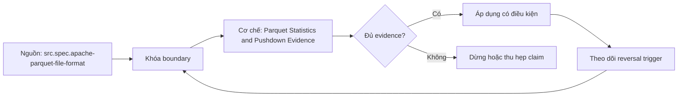

# Parquet Statistics and Pushdown Evidence

> [!abstract] Câu hỏi trung tâm
> Chứng minh riêng projection pushdown, row-group pruning và page skipping bằng bằng chứng nào?

## 1. Ba cơ chế độc lập

Projection pushdown bỏ đọc leaf columns không cần cho output, predicate hoặc join. Filter pushdown chuyển predicate xuống scan để metadata hay reader loại dữ liệu sớm. Pruning là hệ quả ở một granularity: partition, file, row group hay page. Một query chọn ít cột và lọc hẹp có thể dùng cả hai; muốn quy công phải dựng cells projection-only, filter-only, both và neither. Optimizer plan chỉ chứng minh intent; scan counters, requested ranges và result oracle mới chứng minh execution.

## 2. Encoding khác compression

PLAIN, dictionary, RLE/bit-packing và delta encodings biến đổi representation theo data type/pattern. Codec như Snappy, Zstd hoặc gzip nén encoded bytes ở lớp khác. Dictionary giúp repeated low-cardinality values nhưng dictionary page có thể quá lớn hoặc writer fallback. Sorted data có thể hỗ trợ delta/RLE và tight min/max cùng lúc; không được gán toàn bộ lợi ích cho encoding. Lab giữ codec cố định khi so encoding, rồi giữ encoding/writer policy cố định khi so codec.

## 3. Statistics có điều kiện

Min/max chỉ loại unit khi predicate và ordering semantics cho phép chứng minh miền không giao. Null count hỗ trợ một số null predicates; distinct count không phải exact index. Strings có thể bị truncate; timestamps/decimals cần physical/logical interpretation; NaN phá trực giác ordering. Writer có thể omit statistics vì size hoặc type; reader có thể bỏ qua metadata không đáng tin. Mỗi claim nêu writer, format version, field, metadata presence và exact predicate.

## 4. Page index

ColumnIndex giữ value bounds/null pages; OffsetIndex nối row indices với page offsets để reader căn các projected columns. Ordered columns cho phép binary search; unordered columns thường scan bounds. Index nằm tách khỏi row group để full scans không bắt buộc trả I/O/deserialization cost. Đây không phải secondary index và không trả row location toàn bảng. Page index là optional; compatibility với older readers và generated metadata phải được kiểm bằng file inspection cùng reader counters.

## 5. Thiết kế attribution

Bốn file configurations gồm unsorted/no page index, sorted, page-indexed và sorted+indexed. Trên từng file chạy query matrix: all columns/no filter; narrow columns/no filter; all columns/selective filter; narrow columns/selective filter. Mỗi run khóa cache state, concurrency, projection, predicate, repetition và output hash. Contribution không nhất thiết cộng tuyến tính do metadata, prefetch, decompression và cache interactions; nếu tổng riêng lệch phép đo both thì báo interaction thay vì ép cộng.

## 6. Kết luận writer policy

Writer policy chỉ được chọn sau khi đo workload mix, file count, row-group/page geometry, selectivity, CPU, bytes và memory. Sort key cải thiện bounds nhưng tốn shuffle/sort và có thể gây skew. Page index tăng metadata/write work; lợi ích phụ thuộc reader support. Recommendation ghi threshold và reversal: selectivity đổi, reader không dùng index, ingest SLA bị vi phạm hoặc storage/CPU cost đổi. Dùng same semantic dataset và versioned configuration để quyết định có thể tái hiện.

## 7. Ma trận kiểm chứng từng mệnh đề

Mỗi claim phải chỉ rõ metadata scope, writer/reader version, exact fixture, counterexample và oracle. File parse được, plan có predicate hoặc metadata tồn tại chưa đủ để kết luận physical I/O hay semantic result đúng.

### 7.1. Pushdown attribution probe 1: plan intent, metadata presence, scan counters và result oracle phải tách riêng

**Mệnh đề cần kiểm.** Pushdown attribution probe 1: plan intent, metadata presence, scan counters và result oracle phải tách riêng.

**Thiết kế phép thử cho `wiki.storage.parquet-statistics-pushdown-evidence`.** Khóa schema, dataset hash, writer/reader/engine versions, storage backend, cache state và configuration. Tạo positive fixture, boundary fixture và negative/counterexample; thay đổi đúng một biến. Lưu footer hoặc metadata-tree locator, query plan, scan counters, requested/transferred bytes nếu có, typed result hash, logs và run ID. Khi công cụ không quan sát được một tầng, ghi `unknown` thay vì suy từ latency hoặc output count.

**Điều kiện chấp nhận cho `wiki.storage.parquet-statistics-pushdown-evidence`.** Canonical result phải khớp trước khi so hiệu năng. Observation phải lặp lại trên số run đã định, chỉ ra đơn vị bị loại và cơ chế chịu trách nhiệm. Báo riêng source fact, phần tổng hợp của giáo trình và giả định theo implementation. Chưa chạy lab thì mục này là protocol, chưa phải kết quả thực nghiệm.

### 7.2. Pushdown attribution probe 2: plan intent, metadata presence, scan counters và result oracle phải tách riêng

**Mệnh đề cần kiểm.** Pushdown attribution probe 2: plan intent, metadata presence, scan counters và result oracle phải tách riêng.

**Thiết kế phép thử cho `wiki.storage.parquet-statistics-pushdown-evidence`.** Khóa schema, dataset hash, writer/reader/engine versions, storage backend, cache state và configuration. Tạo positive fixture, boundary fixture và negative/counterexample; thay đổi đúng một biến. Lưu footer hoặc metadata-tree locator, query plan, scan counters, requested/transferred bytes nếu có, typed result hash, logs và run ID. Khi công cụ không quan sát được một tầng, ghi `unknown` thay vì suy từ latency hoặc output count.

**Điều kiện chấp nhận cho `wiki.storage.parquet-statistics-pushdown-evidence`.** Canonical result phải khớp trước khi so hiệu năng. Observation phải lặp lại trên số run đã định, chỉ ra đơn vị bị loại và cơ chế chịu trách nhiệm. Báo riêng source fact, phần tổng hợp của giáo trình và giả định theo implementation. Chưa chạy lab thì mục này là protocol, chưa phải kết quả thực nghiệm.

### 7.3. Pushdown attribution probe 3: plan intent, metadata presence, scan counters và result oracle phải tách riêng

**Mệnh đề cần kiểm.** Pushdown attribution probe 3: plan intent, metadata presence, scan counters và result oracle phải tách riêng.

**Thiết kế phép thử cho `wiki.storage.parquet-statistics-pushdown-evidence`.** Khóa schema, dataset hash, writer/reader/engine versions, storage backend, cache state và configuration. Tạo positive fixture, boundary fixture và negative/counterexample; thay đổi đúng một biến. Lưu footer hoặc metadata-tree locator, query plan, scan counters, requested/transferred bytes nếu có, typed result hash, logs và run ID. Khi công cụ không quan sát được một tầng, ghi `unknown` thay vì suy từ latency hoặc output count.

**Điều kiện chấp nhận cho `wiki.storage.parquet-statistics-pushdown-evidence`.** Canonical result phải khớp trước khi so hiệu năng. Observation phải lặp lại trên số run đã định, chỉ ra đơn vị bị loại và cơ chế chịu trách nhiệm. Báo riêng source fact, phần tổng hợp của giáo trình và giả định theo implementation. Chưa chạy lab thì mục này là protocol, chưa phải kết quả thực nghiệm.

### 7.4. Pushdown attribution probe 4: plan intent, metadata presence, scan counters và result oracle phải tách riêng

**Mệnh đề cần kiểm.** Pushdown attribution probe 4: plan intent, metadata presence, scan counters và result oracle phải tách riêng.

**Thiết kế phép thử cho `wiki.storage.parquet-statistics-pushdown-evidence`.** Khóa schema, dataset hash, writer/reader/engine versions, storage backend, cache state và configuration. Tạo positive fixture, boundary fixture và negative/counterexample; thay đổi đúng một biến. Lưu footer hoặc metadata-tree locator, query plan, scan counters, requested/transferred bytes nếu có, typed result hash, logs và run ID. Khi công cụ không quan sát được một tầng, ghi `unknown` thay vì suy từ latency hoặc output count.

**Điều kiện chấp nhận cho `wiki.storage.parquet-statistics-pushdown-evidence`.** Canonical result phải khớp trước khi so hiệu năng. Observation phải lặp lại trên số run đã định, chỉ ra đơn vị bị loại và cơ chế chịu trách nhiệm. Báo riêng source fact, phần tổng hợp của giáo trình và giả định theo implementation. Chưa chạy lab thì mục này là protocol, chưa phải kết quả thực nghiệm.

### 7.5. Pushdown attribution probe 5: plan intent, metadata presence, scan counters và result oracle phải tách riêng

**Mệnh đề cần kiểm.** Pushdown attribution probe 5: plan intent, metadata presence, scan counters và result oracle phải tách riêng.

**Thiết kế phép thử cho `wiki.storage.parquet-statistics-pushdown-evidence`.** Khóa schema, dataset hash, writer/reader/engine versions, storage backend, cache state và configuration. Tạo positive fixture, boundary fixture và negative/counterexample; thay đổi đúng một biến. Lưu footer hoặc metadata-tree locator, query plan, scan counters, requested/transferred bytes nếu có, typed result hash, logs và run ID. Khi công cụ không quan sát được một tầng, ghi `unknown` thay vì suy từ latency hoặc output count.

**Điều kiện chấp nhận cho `wiki.storage.parquet-statistics-pushdown-evidence`.** Canonical result phải khớp trước khi so hiệu năng. Observation phải lặp lại trên số run đã định, chỉ ra đơn vị bị loại và cơ chế chịu trách nhiệm. Báo riêng source fact, phần tổng hợp của giáo trình và giả định theo implementation. Chưa chạy lab thì mục này là protocol, chưa phải kết quả thực nghiệm.

### 7.6. Pushdown attribution probe 6: plan intent, metadata presence, scan counters và result oracle phải tách riêng

**Mệnh đề cần kiểm.** Pushdown attribution probe 6: plan intent, metadata presence, scan counters và result oracle phải tách riêng.

**Thiết kế phép thử cho `wiki.storage.parquet-statistics-pushdown-evidence`.** Khóa schema, dataset hash, writer/reader/engine versions, storage backend, cache state và configuration. Tạo positive fixture, boundary fixture và negative/counterexample; thay đổi đúng một biến. Lưu footer hoặc metadata-tree locator, query plan, scan counters, requested/transferred bytes nếu có, typed result hash, logs và run ID. Khi công cụ không quan sát được một tầng, ghi `unknown` thay vì suy từ latency hoặc output count.

**Điều kiện chấp nhận cho `wiki.storage.parquet-statistics-pushdown-evidence`.** Canonical result phải khớp trước khi so hiệu năng. Observation phải lặp lại trên số run đã định, chỉ ra đơn vị bị loại và cơ chế chịu trách nhiệm. Báo riêng source fact, phần tổng hợp của giáo trình và giả định theo implementation. Chưa chạy lab thì mục này là protocol, chưa phải kết quả thực nghiệm.

### 7.7. Pushdown attribution probe 7: plan intent, metadata presence, scan counters và result oracle phải tách riêng

**Mệnh đề cần kiểm.** Pushdown attribution probe 7: plan intent, metadata presence, scan counters và result oracle phải tách riêng.

**Thiết kế phép thử cho `wiki.storage.parquet-statistics-pushdown-evidence`.** Khóa schema, dataset hash, writer/reader/engine versions, storage backend, cache state và configuration. Tạo positive fixture, boundary fixture và negative/counterexample; thay đổi đúng một biến. Lưu footer hoặc metadata-tree locator, query plan, scan counters, requested/transferred bytes nếu có, typed result hash, logs và run ID. Khi công cụ không quan sát được một tầng, ghi `unknown` thay vì suy từ latency hoặc output count.

**Điều kiện chấp nhận cho `wiki.storage.parquet-statistics-pushdown-evidence`.** Canonical result phải khớp trước khi so hiệu năng. Observation phải lặp lại trên số run đã định, chỉ ra đơn vị bị loại và cơ chế chịu trách nhiệm. Báo riêng source fact, phần tổng hợp của giáo trình và giả định theo implementation. Chưa chạy lab thì mục này là protocol, chưa phải kết quả thực nghiệm.

### 7.8. Pushdown attribution probe 8: plan intent, metadata presence, scan counters và result oracle phải tách riêng

**Mệnh đề cần kiểm.** Pushdown attribution probe 8: plan intent, metadata presence, scan counters và result oracle phải tách riêng.

**Thiết kế phép thử cho `wiki.storage.parquet-statistics-pushdown-evidence`.** Khóa schema, dataset hash, writer/reader/engine versions, storage backend, cache state và configuration. Tạo positive fixture, boundary fixture và negative/counterexample; thay đổi đúng một biến. Lưu footer hoặc metadata-tree locator, query plan, scan counters, requested/transferred bytes nếu có, typed result hash, logs và run ID. Khi công cụ không quan sát được một tầng, ghi `unknown` thay vì suy từ latency hoặc output count.

**Điều kiện chấp nhận cho `wiki.storage.parquet-statistics-pushdown-evidence`.** Canonical result phải khớp trước khi so hiệu năng. Observation phải lặp lại trên số run đã định, chỉ ra đơn vị bị loại và cơ chế chịu trách nhiệm. Báo riêng source fact, phần tổng hợp của giáo trình và giả định theo implementation. Chưa chạy lab thì mục này là protocol, chưa phải kết quả thực nghiệm.

### 7.9. Pushdown attribution probe 9: plan intent, metadata presence, scan counters và result oracle phải tách riêng

**Mệnh đề cần kiểm.** Pushdown attribution probe 9: plan intent, metadata presence, scan counters và result oracle phải tách riêng.

**Thiết kế phép thử cho `wiki.storage.parquet-statistics-pushdown-evidence`.** Khóa schema, dataset hash, writer/reader/engine versions, storage backend, cache state và configuration. Tạo positive fixture, boundary fixture và negative/counterexample; thay đổi đúng một biến. Lưu footer hoặc metadata-tree locator, query plan, scan counters, requested/transferred bytes nếu có, typed result hash, logs và run ID. Khi công cụ không quan sát được một tầng, ghi `unknown` thay vì suy từ latency hoặc output count.

**Điều kiện chấp nhận cho `wiki.storage.parquet-statistics-pushdown-evidence`.** Canonical result phải khớp trước khi so hiệu năng. Observation phải lặp lại trên số run đã định, chỉ ra đơn vị bị loại và cơ chế chịu trách nhiệm. Báo riêng source fact, phần tổng hợp của giáo trình và giả định theo implementation. Chưa chạy lab thì mục này là protocol, chưa phải kết quả thực nghiệm.

### 7.10. Pushdown attribution probe 10: plan intent, metadata presence, scan counters và result oracle phải tách riêng

**Mệnh đề cần kiểm.** Pushdown attribution probe 10: plan intent, metadata presence, scan counters và result oracle phải tách riêng.

**Thiết kế phép thử cho `wiki.storage.parquet-statistics-pushdown-evidence`.** Khóa schema, dataset hash, writer/reader/engine versions, storage backend, cache state và configuration. Tạo positive fixture, boundary fixture và negative/counterexample; thay đổi đúng một biến. Lưu footer hoặc metadata-tree locator, query plan, scan counters, requested/transferred bytes nếu có, typed result hash, logs và run ID. Khi công cụ không quan sát được một tầng, ghi `unknown` thay vì suy từ latency hoặc output count.

**Điều kiện chấp nhận cho `wiki.storage.parquet-statistics-pushdown-evidence`.** Canonical result phải khớp trước khi so hiệu năng. Observation phải lặp lại trên số run đã định, chỉ ra đơn vị bị loại và cơ chế chịu trách nhiệm. Báo riêng source fact, phần tổng hợp của giáo trình và giả định theo implementation. Chưa chạy lab thì mục này là protocol, chưa phải kết quả thực nghiệm.

### 7.11. Pushdown attribution probe 11: plan intent, metadata presence, scan counters và result oracle phải tách riêng

**Mệnh đề cần kiểm.** Pushdown attribution probe 11: plan intent, metadata presence, scan counters và result oracle phải tách riêng.

**Thiết kế phép thử cho `wiki.storage.parquet-statistics-pushdown-evidence`.** Khóa schema, dataset hash, writer/reader/engine versions, storage backend, cache state và configuration. Tạo positive fixture, boundary fixture và negative/counterexample; thay đổi đúng một biến. Lưu footer hoặc metadata-tree locator, query plan, scan counters, requested/transferred bytes nếu có, typed result hash, logs và run ID. Khi công cụ không quan sát được một tầng, ghi `unknown` thay vì suy từ latency hoặc output count.

**Điều kiện chấp nhận cho `wiki.storage.parquet-statistics-pushdown-evidence`.** Canonical result phải khớp trước khi so hiệu năng. Observation phải lặp lại trên số run đã định, chỉ ra đơn vị bị loại và cơ chế chịu trách nhiệm. Báo riêng source fact, phần tổng hợp của giáo trình và giả định theo implementation. Chưa chạy lab thì mục này là protocol, chưa phải kết quả thực nghiệm.

### 7.12. Pushdown attribution probe 12: plan intent, metadata presence, scan counters và result oracle phải tách riêng

**Mệnh đề cần kiểm.** Pushdown attribution probe 12: plan intent, metadata presence, scan counters và result oracle phải tách riêng.

**Thiết kế phép thử cho `wiki.storage.parquet-statistics-pushdown-evidence`.** Khóa schema, dataset hash, writer/reader/engine versions, storage backend, cache state và configuration. Tạo positive fixture, boundary fixture và negative/counterexample; thay đổi đúng một biến. Lưu footer hoặc metadata-tree locator, query plan, scan counters, requested/transferred bytes nếu có, typed result hash, logs và run ID. Khi công cụ không quan sát được một tầng, ghi `unknown` thay vì suy từ latency hoặc output count.

**Điều kiện chấp nhận cho `wiki.storage.parquet-statistics-pushdown-evidence`.** Canonical result phải khớp trước khi so hiệu năng. Observation phải lặp lại trên số run đã định, chỉ ra đơn vị bị loại và cơ chế chịu trách nhiệm. Báo riêng source fact, phần tổng hợp của giáo trình và giả định theo implementation. Chưa chạy lab thì mục này là protocol, chưa phải kết quả thực nghiệm.

### 7.13. Pushdown attribution probe 13: plan intent, metadata presence, scan counters và result oracle phải tách riêng

**Mệnh đề cần kiểm.** Pushdown attribution probe 13: plan intent, metadata presence, scan counters và result oracle phải tách riêng.

**Thiết kế phép thử cho `wiki.storage.parquet-statistics-pushdown-evidence`.** Khóa schema, dataset hash, writer/reader/engine versions, storage backend, cache state và configuration. Tạo positive fixture, boundary fixture và negative/counterexample; thay đổi đúng một biến. Lưu footer hoặc metadata-tree locator, query plan, scan counters, requested/transferred bytes nếu có, typed result hash, logs và run ID. Khi công cụ không quan sát được một tầng, ghi `unknown` thay vì suy từ latency hoặc output count.

**Điều kiện chấp nhận cho `wiki.storage.parquet-statistics-pushdown-evidence`.** Canonical result phải khớp trước khi so hiệu năng. Observation phải lặp lại trên số run đã định, chỉ ra đơn vị bị loại và cơ chế chịu trách nhiệm. Báo riêng source fact, phần tổng hợp của giáo trình và giả định theo implementation. Chưa chạy lab thì mục này là protocol, chưa phải kết quả thực nghiệm.

### 7.14. Pushdown attribution probe 14: plan intent, metadata presence, scan counters và result oracle phải tách riêng

**Mệnh đề cần kiểm.** Pushdown attribution probe 14: plan intent, metadata presence, scan counters và result oracle phải tách riêng.

**Thiết kế phép thử cho `wiki.storage.parquet-statistics-pushdown-evidence`.** Khóa schema, dataset hash, writer/reader/engine versions, storage backend, cache state và configuration. Tạo positive fixture, boundary fixture và negative/counterexample; thay đổi đúng một biến. Lưu footer hoặc metadata-tree locator, query plan, scan counters, requested/transferred bytes nếu có, typed result hash, logs và run ID. Khi công cụ không quan sát được một tầng, ghi `unknown` thay vì suy từ latency hoặc output count.

**Điều kiện chấp nhận cho `wiki.storage.parquet-statistics-pushdown-evidence`.** Canonical result phải khớp trước khi so hiệu năng. Observation phải lặp lại trên số run đã định, chỉ ra đơn vị bị loại và cơ chế chịu trách nhiệm. Báo riêng source fact, phần tổng hợp của giáo trình và giả định theo implementation. Chưa chạy lab thì mục này là protocol, chưa phải kết quả thực nghiệm.

### 7.15. Pushdown attribution probe 15: plan intent, metadata presence, scan counters và result oracle phải tách riêng

**Mệnh đề cần kiểm.** Pushdown attribution probe 15: plan intent, metadata presence, scan counters và result oracle phải tách riêng.

**Thiết kế phép thử cho `wiki.storage.parquet-statistics-pushdown-evidence`.** Khóa schema, dataset hash, writer/reader/engine versions, storage backend, cache state và configuration. Tạo positive fixture, boundary fixture và negative/counterexample; thay đổi đúng một biến. Lưu footer hoặc metadata-tree locator, query plan, scan counters, requested/transferred bytes nếu có, typed result hash, logs và run ID. Khi công cụ không quan sát được một tầng, ghi `unknown` thay vì suy từ latency hoặc output count.

**Điều kiện chấp nhận cho `wiki.storage.parquet-statistics-pushdown-evidence`.** Canonical result phải khớp trước khi so hiệu năng. Observation phải lặp lại trên số run đã định, chỉ ra đơn vị bị loại và cơ chế chịu trách nhiệm. Báo riêng source fact, phần tổng hợp của giáo trình và giả định theo implementation. Chưa chạy lab thì mục này là protocol, chưa phải kết quả thực nghiệm.

## 8. Quy trình phản biện

1. Xác định tầng đang nói: object store, file, table metadata, catalog hay engine.
2. Viết identity và publication boundary trước khi bàn hiệu năng.
3. Tách metadata presence, planner intent, executed pruning và physical I/O.
4. Kiểm semantic result bằng typed oracle trước benchmark.
5. Pin version, configuration, cache state và metric definition.
6. Ghi counterexample, limitation và reversal condition cho recommendation.

## 9. Câu hỏi tự kiểm tra

1. Đơn vị đang xét là file, row group, column chunk, page, manifest hay snapshot?
2. Metadata nào authoritative và lấy từ locator nào?
3. Reader có dùng metadata hay chỉ có khả năng dùng?
4. Parse/decode thành công có che semantic mismatch không?
5. Failure ở trước hay sau publication boundary?
6. Bằng chứng nào còn là protocol chưa chạy?

## 10. Giới hạn và điều chưa cho phép kết luận

- Chưa chạy Parquet footer/page-index lab hoặc Iceberg metadata trace trên engine/catalog thật.
- Đặc tả được kiểm ngày 2026-10-02; implementation behavior phải pin version.
- Matrices và lab protocols là synthesis của giáo trình, không gán nguyên văn cho một nguồn.
- Note giữ trạng thái `review` tới khi chủ dự án duyệt.

## Reference
1. [[SRC-APACHE-PARQUET-FILE-FORMAT]]
2. [[SRC-APACHE-PARQUET-PAGE-INDEX]]
3. [[SRC-APACHE-PARQUET-ENCODINGS]]
4. [[SRC-DUCKDB-PARQUET-PUSHDOWN]]
5. [[SRC-DUCKDB-ZONEMAPS]]

## Source coverage

| Source slice | Nội dung sử dụng | Trạng thái |
|---|---|---|
| [[SRC-APACHE-PARQUET-FILE-FORMAT]] | Format/table contract, implementation boundary hoặc workload context | Đã đọc locator; không suy ngoài phạm vi |
| [[SRC-APACHE-PARQUET-PAGE-INDEX]] | Format/table contract, implementation boundary hoặc workload context | Đã đọc locator; không suy ngoài phạm vi |
| [[SRC-APACHE-PARQUET-ENCODINGS]] | Format/table contract, implementation boundary hoặc workload context | Đã đọc locator; không suy ngoài phạm vi |
| [[SRC-DUCKDB-PARQUET-PUSHDOWN]] | Format/table contract, implementation boundary hoặc workload context | Đã đọc locator; không suy ngoài phạm vi |
| [[SRC-DUCKDB-ZONEMAPS]] | Format/table contract, implementation boundary hoặc workload context | Đã đọc locator; không suy ngoài phạm vi |

## Key takeaways
- Mọi claim phải đúng tầng và đúng granularity.
- Metadata hiện diện, planner intent, executed pruning và physical I/O là bốn bằng chứng khác nhau.
- Semantic oracle được kiểm trước performance attribution.
- Chưa chạy lab thì note cung cấp giáo trình và protocol, chưa phải certification cho production.

<!-- ATOMIC-EXECUTION-CAPSULE:START -->

## Execution capsule — kiểm chứng `wiki.storage.parquet-statistics-pushdown-evidence`

> [!important] Phân loại mệnh đề
> Với `wiki.storage.parquet-statistics-pushdown-evidence`, sơ đồ, ví dụ và artifact về **Parquet Statistics and Pushdown Evidence** là **synthesis để kiểm chứng**; chúng không phải trích dẫn hay case nguyên văn của nguồn.

### Sơ đồ cơ chế và điểm kiểm soát



Đọc sơ đồ `wiki.storage.parquet-statistics-pushdown-evidence` từ trái sang phải: source chỉ cung cấp claim ban đầu cho **Parquet Statistics and Pushdown Evidence**; quyết định chỉ được đi tiếp sau khi boundary, evidence và điều kiện đảo quyết định đã hiện hữu.

### Ví dụ làm việc có thể bác bỏ

**Input.** Một đội cần trả lời: “Chứng minh riêng projection pushdown, row-group pruning và page skipping bằng bằng chứng nào?” cho một phạm vi nhỏ, có owner và deadline rõ.

**Decision.** Đội áp dụng **Parquet Statistics and Pushdown Evidence** trên control và variant chỉ khác một assumption; expected result và hard constraints được khóa trước khi chạy.

**Outcome.** Với `wiki.storage.parquet-statistics-pushdown-evidence`, nếu observation vi phạm hard constraint hoặc oracle độc lập không xác nhận **Parquet Statistics and Pushdown Evidence**, đội thu hẹp claim hay đảo quyết định. Nếu đạt, kết luận vẫn kèm scope, version và review date; một lần thành công không được nâng thành quy luật phổ quát.

### Artifact thực thi tối thiểu

```sql
-- Verification harness for: Parquet Statistics and Pushdown Evidence
WITH evidence AS (
    SELECT 'wiki.storage.parquet-statistics-pushdown-evidence' AS concept_id,
           'boundary_declared' AS check_name, 1 AS passed
    UNION ALL
    SELECT 'wiki.storage.parquet-statistics-pushdown-evidence', 'independent_oracle', 1
    UNION ALL
    SELECT 'wiki.storage.parquet-statistics-pushdown-evidence', 'reversal_trigger_recorded', 1
)
SELECT concept_id,
       MIN(passed) AS all_hard_checks_pass,
       COUNT(*) AS evidence_items
FROM evidence
GROUP BY concept_id
HAVING MIN(passed) = 1;
```

Artifact của `wiki.storage.parquet-statistics-pushdown-evidence` buộc người dùng ghi boundary, oracle và reversal trigger cho **Parquet Statistics and Pushdown Evidence**. Các giá trị minh họa phải được thay bằng evidence thật trước khi dùng cho quyết định.

### Tự kiểm tra trước khi tái sử dụng

1. Bạn có thể trả lời `Chứng minh riêng projection pushdown, row-group pruning và page skipping bằng bằng chứng nào?` bằng một câu mà không kéo thêm concept thứ hai không?
2. Source locator nào đỡ cho claim, và phần nào chỉ là synthesis trong note?
3. Observation nào khiến bạn dừng, thu hẹp hoặc đảo quyết định?
4. Artifact nào cho phép một reviewer độc lập tái hiện kết quả?

<!-- ATOMIC-EXECUTION-CAPSULE:END -->
