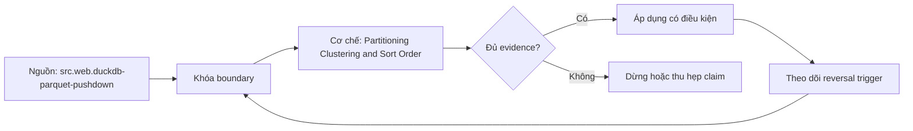

# Partitioning Clustering and Sort Order

> [!abstract] Câu hỏi trung tâm
> Chọn partition transform, clustering và sort order bằng cách cân pruning, file size, metadata, write maintenance và workload mix như thế nào?

## 1. Ba lớp bố trí

Partitioning đặt rows vào logical/physical groups bằng transform như day/month/bucket/category và cho coarse pruning từ metadata. Bucketing/hash distribution gom keys theo buckets nhưng không tạo range order. Clustering/sort sắp hoặc đồng vị trí rows trong partition/file/row groups để min/max hẹp, compression và locality tốt hơn. Thuật ngữ sản phẩm khác nhau; lesson luôn ghi unit và guarantee. 'Clustered' có thể chỉ tương quan, không phải globally sorted. Partitioning table khác distributed hash partitioning giữa MPP workers.

## 2. High cardinality là risk, không định luật

Partition theo user_id/order_id có thể tạo rất nhiều partitions/directories/files, nhưng số file còn phụ thuộc writers, ingest batches, target file size và format/table service; không phải cứ high-cardinality là tự động hàng triệu file. Điều cần đo là active partition count per write, files/partition, size distribution và metadata/split cost. Low-cardinality key cũng thất bại nếu một partition quá lớn hoặc skew. Chọn transform/granularity để partitions đủ lớn, lifecycle quản được và filter phổ biến có thể prune.

## 3. Small-file penalty

Mỗi file thêm metadata row/manifest/metastore entry, list/open/range requests, split scheduling, footer read, task setup và thường có row groups nhỏ nên compression/scan kém. Object storage latency và coordinator scheduling có thể làm query metadata-bound trước khi đọc nhiều bytes. Song song nhiều files đôi khi tăng throughput, nên 'ít file hơn luôn tốt' cũng sai. Báo count, p10/p50/p90 size, files opened, listing/planning time, splits/tasks, bytes/read requests và scan/CPU. Compaction giảm files nhưng tạo write/compute cost và concurrency semantics.

## 4. Sort order đa cột

Lexicographic sort ưu tiên cột đầu; cột sau chỉ ordered trong equal-prefix groups. Vì thế time→customer khác customer→time cho ranges khác nhau. Analogy với composite index giúp nhớ prefix, nhưng zonemap lưu per-column min/max nên vẫn có thể hưởng partial correlation ngoài strict prefix; mức lợi phải đo. Sort tăng RLE/compression ở leading columns và pruning ranges, đồng thời tốn sort/merge, có thể giảm write throughput và làm query theo key khác tệ hơn.

## 5. Clustering drift và maintenance

Append data không theo key, late events, updates và compaction có thể làm clustering degrade. Một table tạo ban đầu sorted không bảo đảm six months later vẫn correlated. Theo dõi overlap/depth, min-max width, files touched/query, pruning ratio và reclustering backlog/cost tùy engine. Maintenance policy có trigger và budget, không chạy định kỳ mù. Recluster/optimize cần snapshot correctness, concurrent-write behavior và rollback/cleanup; Trino/Presto paper cảnh báo enumeration/small-file overhead nhưng implementation operation tùy connector.

## 6. Workload-weighted decision

Liệt kê query families với frequency, scanned horizon, filter columns/selectivity, join/group keys, SLA và concurrency. Thêm ingest/update pattern, retention, late data, compaction window và cost. Candidate score không chỉ average query time: p95, bytes, files, metadata time, write amplification và storage. Một daily partition có thể tốt cho 30-day ranges nhưng tệ nếu millions tiny tenants write each hour. Reversal trigger gồm query mix shift, partition size vượt/thiếu target, small-file count hoặc maintenance budget.

## 7. Ba phương án thí nghiệm

A partition coarse theo low-cardinality/time transform. B partition theo high-cardinality key với cùng writer concurrency/batch để lộ fragmentation thực. C coarse partition cộng sort/cluster theo frequent filter. Giữ same data/hash/format/codec/target file settings; nếu systems tự coalesce, ghi actual files thay assumptions. Năm queries gồm partition equality/range, leading sort filter, second sort filter, unrelated filter và full scan. Tách metadata/planning khỏi scan/execution; đo write/compaction cost.

## 8. Quyết định và remediation

Chọn phương án trên Pareto frontier, không dựa một truy vấn thắng nhất. Nếu B tạo small files, remediation có thể đổi transform, buffer writes, target size hoặc compaction; không chỉ tăng coordinator. Nếu C giúp query nhưng sort cost phá freshness, giảm clustering depth hoặc asynchronous maintenance. Document layout version/effective snapshot; layout migration có dual-read/rewrite validation và old files cleanup. Done khi cả pruning benefit và file/maintenance penalty có số, correctness bằng nhau và lựa chọn nối workload.

## 8. Ma trận kiểm chứng từng mệnh đề

Mỗi mệnh đề hiệu năng cần counterfactual, correctness oracle và counter ở đúng tầng. Elapsed time, plan label hoặc tên công nghệ riêng lẻ không đủ quy nguyên nhân.

### 8.1. partition bucketing clustering sort là concepts khác nhau

**Mệnh đề cần kiểm.** partition bucketing clustering sort là concepts khác nhau.

**Cách kiểm.** Ghi cùng data theo ba layouts; đo partition/file distribution, listing/planning, splits, bytes, p95 query, write/compaction cost và correctness. Thay query mix hoặc ingest granularity để tìm reversal. Với mệnh đề này, ghi engine/compiler/format version, data shape, controlled variables, expected counter, failure signal và boundary làm kết luận không còn đúng.

**Bằng chứng đạt cho `wiki.olap.partitioning-clustering-sort-order`.** Lưu generator/hash, configuration, query/source, plan/profile/compiler proof, raw counters, result oracle, repetitions và reviewer. Nếu chưa chạy lab được phép, chỉ ghi protocol; không biến expected result thành số đo đã quan sát.

### 8.2. high cardinality là fragmentation risk không deterministic file count

**Mệnh đề cần kiểm.** high cardinality là fragmentation risk không deterministic file count.

**Cách kiểm.** Ghi cùng data theo ba layouts; đo partition/file distribution, listing/planning, splits, bytes, p95 query, write/compaction cost và correctness. Thay query mix hoặc ingest granularity để tìm reversal. Với mệnh đề này, ghi engine/compiler/format version, data shape, controlled variables, expected counter, failure signal và boundary làm kết luận không còn đúng.

**Bằng chứng đạt cho `wiki.olap.partitioning-clustering-sort-order`.** Lưu generator/hash, configuration, query/source, plan/profile/compiler proof, raw counters, result oracle, repetitions và reviewer. Nếu chưa chạy lab được phép, chỉ ghi protocol; không biến expected result thành số đo đã quan sát.

### 8.3. low cardinality vẫn có skew và oversized partition

**Mệnh đề cần kiểm.** low cardinality vẫn có skew và oversized partition.

**Cách kiểm.** Ghi cùng data theo ba layouts; đo partition/file distribution, listing/planning, splits, bytes, p95 query, write/compaction cost và correctness. Thay query mix hoặc ingest granularity để tìm reversal. Với mệnh đề này, ghi engine/compiler/format version, data shape, controlled variables, expected counter, failure signal và boundary làm kết luận không còn đúng.

**Bằng chứng đạt cho `wiki.olap.partitioning-clustering-sort-order`.** Lưu generator/hash, configuration, query/source, plan/profile/compiler proof, raw counters, result oracle, repetitions và reviewer. Nếu chưa chạy lab được phép, chỉ ghi protocol; không biến expected result thành số đo đã quan sát.

### 8.4. active partitions per write quan trọng hơn domain cardinality đơn lẻ

**Mệnh đề cần kiểm.** active partitions per write quan trọng hơn domain cardinality đơn lẻ.

**Cách kiểm.** Ghi cùng data theo ba layouts; đo partition/file distribution, listing/planning, splits, bytes, p95 query, write/compaction cost và correctness. Thay query mix hoặc ingest granularity để tìm reversal. Với mệnh đề này, ghi engine/compiler/format version, data shape, controlled variables, expected counter, failure signal và boundary làm kết luận không còn đúng.

**Bằng chứng đạt cho `wiki.olap.partitioning-clustering-sort-order`.** Lưu generator/hash, configuration, query/source, plan/profile/compiler proof, raw counters, result oracle, repetitions và reviewer. Nếu chưa chạy lab được phép, chỉ ghi protocol; không biến expected result thành số đo đã quan sát.

### 8.5. small files tăng metadata open split task overhead

**Mệnh đề cần kiểm.** small files tăng metadata open split task overhead.

**Cách kiểm.** Ghi cùng data theo ba layouts; đo partition/file distribution, listing/planning, splits, bytes, p95 query, write/compaction cost và correctness. Thay query mix hoặc ingest granularity để tìm reversal. Với mệnh đề này, ghi engine/compiler/format version, data shape, controlled variables, expected counter, failure signal và boundary làm kết luận không còn đúng.

**Bằng chứng đạt cho `wiki.olap.partitioning-clustering-sort-order`.** Lưu generator/hash, configuration, query/source, plan/profile/compiler proof, raw counters, result oracle, repetitions và reviewer. Nếu chưa chạy lab được phép, chỉ ghi protocol; không biến expected result thành số đo đã quan sát.

### 8.6. nhiều files đôi khi tăng parallelism

**Mệnh đề cần kiểm.** nhiều files đôi khi tăng parallelism.

**Cách kiểm.** Ghi cùng data theo ba layouts; đo partition/file distribution, listing/planning, splits, bytes, p95 query, write/compaction cost và correctness. Thay query mix hoặc ingest granularity để tìm reversal. Với mệnh đề này, ghi engine/compiler/format version, data shape, controlled variables, expected counter, failure signal và boundary làm kết luận không còn đúng.

**Bằng chứng đạt cho `wiki.olap.partitioning-clustering-sort-order`.** Lưu generator/hash, configuration, query/source, plan/profile/compiler proof, raw counters, result oracle, repetitions và reviewer. Nếu chưa chạy lab được phép, chỉ ghi protocol; không biến expected result thành số đo đã quan sát.

### 8.7. file size distribution tốt hơn chỉ average

**Mệnh đề cần kiểm.** file size distribution tốt hơn chỉ average.

**Cách kiểm.** Ghi cùng data theo ba layouts; đo partition/file distribution, listing/planning, splits, bytes, p95 query, write/compaction cost và correctness. Thay query mix hoặc ingest granularity để tìm reversal. Với mệnh đề này, ghi engine/compiler/format version, data shape, controlled variables, expected counter, failure signal và boundary làm kết luận không còn đúng.

**Bằng chứng đạt cho `wiki.olap.partitioning-clustering-sort-order`.** Lưu generator/hash, configuration, query/source, plan/profile/compiler proof, raw counters, result oracle, repetitions và reviewer. Nếu chưa chạy lab được phép, chỉ ghi protocol; không biến expected result thành số đo đã quan sát.

### 8.8. compaction có write cost và concurrency semantics

**Mệnh đề cần kiểm.** compaction có write cost và concurrency semantics.

**Cách kiểm.** Ghi cùng data theo ba layouts; đo partition/file distribution, listing/planning, splits, bytes, p95 query, write/compaction cost và correctness. Thay query mix hoặc ingest granularity để tìm reversal. Với mệnh đề này, ghi engine/compiler/format version, data shape, controlled variables, expected counter, failure signal và boundary làm kết luận không còn đúng.

**Bằng chứng đạt cho `wiki.olap.partitioning-clustering-sort-order`.** Lưu generator/hash, configuration, query/source, plan/profile/compiler proof, raw counters, result oracle, repetitions và reviewer. Nếu chưa chạy lab được phép, chỉ ghi protocol; không biến expected result thành số đo đã quan sát.

### 8.9. multi-column sort ưu tiên leading key

**Mệnh đề cần kiểm.** multi-column sort ưu tiên leading key.

**Cách kiểm.** Ghi cùng data theo ba layouts; đo partition/file distribution, listing/planning, splits, bytes, p95 query, write/compaction cost và correctness. Thay query mix hoặc ingest granularity để tìm reversal. Với mệnh đề này, ghi engine/compiler/format version, data shape, controlled variables, expected counter, failure signal và boundary làm kết luận không còn đúng.

**Bằng chứng đạt cho `wiki.olap.partitioning-clustering-sort-order`.** Lưu generator/hash, configuration, query/source, plan/profile/compiler proof, raw counters, result oracle, repetitions và reviewer. Nếu chưa chạy lab được phép, chỉ ghi protocol; không biến expected result thành số đo đã quan sát.

### 8.10. composite-index analogy có giới hạn với zonemaps

**Mệnh đề cần kiểm.** composite-index analogy có giới hạn với zonemaps.

**Cách kiểm.** Ghi cùng data theo ba layouts; đo partition/file distribution, listing/planning, splits, bytes, p95 query, write/compaction cost và correctness. Thay query mix hoặc ingest granularity để tìm reversal. Với mệnh đề này, ghi engine/compiler/format version, data shape, controlled variables, expected counter, failure signal và boundary làm kết luận không còn đúng.

**Bằng chứng đạt cho `wiki.olap.partitioning-clustering-sort-order`.** Lưu generator/hash, configuration, query/source, plan/profile/compiler proof, raw counters, result oracle, repetitions và reviewer. Nếu chưa chạy lab được phép, chỉ ghi protocol; không biến expected result thành số đo đã quan sát.

### 8.11. sort order ảnh hưởng compression và pruning

**Mệnh đề cần kiểm.** sort order ảnh hưởng compression và pruning.

**Cách kiểm.** Ghi cùng data theo ba layouts; đo partition/file distribution, listing/planning, splits, bytes, p95 query, write/compaction cost và correctness. Thay query mix hoặc ingest granularity để tìm reversal. Với mệnh đề này, ghi engine/compiler/format version, data shape, controlled variables, expected counter, failure signal và boundary làm kết luận không còn đúng.

**Bằng chứng đạt cho `wiki.olap.partitioning-clustering-sort-order`.** Lưu generator/hash, configuration, query/source, plan/profile/compiler proof, raw counters, result oracle, repetitions và reviewer. Nếu chưa chạy lab được phép, chỉ ghi protocol; không biến expected result thành số đo đã quan sát.

### 8.12. clustering degrade khi append late data

**Mệnh đề cần kiểm.** clustering degrade khi append late data.

**Cách kiểm.** Ghi cùng data theo ba layouts; đo partition/file distribution, listing/planning, splits, bytes, p95 query, write/compaction cost và correctness. Thay query mix hoặc ingest granularity để tìm reversal. Với mệnh đề này, ghi engine/compiler/format version, data shape, controlled variables, expected counter, failure signal và boundary làm kết luận không còn đúng.

**Bằng chứng đạt cho `wiki.olap.partitioning-clustering-sort-order`.** Lưu generator/hash, configuration, query/source, plan/profile/compiler proof, raw counters, result oracle, repetitions và reviewer. Nếu chưa chạy lab được phép, chỉ ghi protocol; không biến expected result thành số đo đã quan sát.

### 8.13. layout decision cần weighted query families

**Mệnh đề cần kiểm.** layout decision cần weighted query families.

**Cách kiểm.** Ghi cùng data theo ba layouts; đo partition/file distribution, listing/planning, splits, bytes, p95 query, write/compaction cost và correctness. Thay query mix hoặc ingest granularity để tìm reversal. Với mệnh đề này, ghi engine/compiler/format version, data shape, controlled variables, expected counter, failure signal và boundary làm kết luận không còn đúng.

**Bằng chứng đạt cho `wiki.olap.partitioning-clustering-sort-order`.** Lưu generator/hash, configuration, query/source, plan/profile/compiler proof, raw counters, result oracle, repetitions và reviewer. Nếu chưa chạy lab được phép, chỉ ghi protocol; không biến expected result thành số đo đã quan sát.

### 8.14. metadata time phải tách scan time

**Mệnh đề cần kiểm.** metadata time phải tách scan time.

**Cách kiểm.** Ghi cùng data theo ba layouts; đo partition/file distribution, listing/planning, splits, bytes, p95 query, write/compaction cost và correctness. Thay query mix hoặc ingest granularity để tìm reversal. Với mệnh đề này, ghi engine/compiler/format version, data shape, controlled variables, expected counter, failure signal và boundary làm kết luận không còn đúng.

**Bằng chứng đạt cho `wiki.olap.partitioning-clustering-sort-order`.** Lưu generator/hash, configuration, query/source, plan/profile/compiler proof, raw counters, result oracle, repetitions và reviewer. Nếu chưa chạy lab được phép, chỉ ghi protocol; không biến expected result thành số đo đã quan sát.

### 8.15. layout migration cần version và cleanup evidence

**Mệnh đề cần kiểm.** layout migration cần version và cleanup evidence.

**Cách kiểm.** Ghi cùng data theo ba layouts; đo partition/file distribution, listing/planning, splits, bytes, p95 query, write/compaction cost và correctness. Thay query mix hoặc ingest granularity để tìm reversal. Với mệnh đề này, ghi engine/compiler/format version, data shape, controlled variables, expected counter, failure signal và boundary làm kết luận không còn đúng.

**Bằng chứng đạt cho `wiki.olap.partitioning-clustering-sort-order`.** Lưu generator/hash, configuration, query/source, plan/profile/compiler proof, raw counters, result oracle, repetitions và reviewer. Nếu chưa chạy lab được phép, chỉ ghi protocol; không biến expected result thành số đo đã quan sát.

## 9. Quy trình phản biện

1. Vẽ data path và xác định tầng storage, reader, engine, compiler, ISA hoặc network đang được nói tới.
2. Khóa semantics, dataset và correctness oracle trước khi đo performance.
3. Thay một mechanism; giữ các mechanisms còn lại cố định hoặc ghi confounder.
4. Đọc plans/remarks nhưng xác nhận bằng runtime counters hoặc assembly khi phù hợp.
5. Báo distribution và critical path, không dùng một average che skew hoặc tails.
6. Viết reversal case và stop condition trước khi chạy.
7. Chưa có execution evidence thì giữ trạng thái `review`.

## 10. Câu hỏi tự kiểm tra

1. Mechanism nằm ở tầng nào và counter trực tiếp của nó là gì?
2. Kết quả đúng được xác minh độc lập ra sao?
3. Biến nào thực sự đổi giữa hai cấu hình?
4. Overhead cố định, bandwidth, skew hoặc tail nào có thể che kết quả?
5. Constraint nào làm lựa chọn hiện tại phải đảo?
6. Kết luận nào mới là protocol, chưa phải observation?

## 11. Giới hạn và điều chưa cho phép kết luận

- Chưa chạy pruning, vectorization, layout hoặc MPP benchmarks; note mô tả protocol và expected evidence.
- Tài liệu engine/compiler được kiểm ngày 2026-10-01; version, plan format, counters và optimizer support có thể đổi.
- Taxonomy và lab matrices là curriculum synthesis; không gán nguyên văn cho một paper hoặc vendor.
- Microbenchmark không chứng minh production speedup nếu data, concurrency, cache, compiler, storage hoặc network khác.
- Note giữ trạng thái `review` cho tới khi chủ dự án duyệt semantic meaning.

## Reference
1. [[SRC-DUCKDB-PARQUET-PUSHDOWN]]
2. [[SRC-CSTORE-COLUMN-ORIENTED-DBMS]]
3. [[SRC-PRESTO-SQL-ON-EVERYTHING]]

## Source coverage

| Source slice | Nội dung sử dụng | Trạng thái |
|---|---|---|
| [[SRC-DUCKDB-PARQUET-PUSHDOWN]] | Khái niệm, mechanism hoặc evidence boundary liên quan | Đã đọc locator trong source record; không suy ngoài phạm vi |
| [[SRC-CSTORE-COLUMN-ORIENTED-DBMS]] | Khái niệm, mechanism hoặc evidence boundary liên quan | Đã đọc locator trong source record; không suy ngoài phạm vi |
| [[SRC-PRESTO-SQL-ON-EVERYTHING]] | Khái niệm, mechanism hoặc evidence boundary liên quan | Đã đọc locator trong source record; không suy ngoài phạm vi |

## Key takeaways
- Layout là bài toán Pareto giữa pruning, metadata, files, write maintenance và workload mix.
- Correctness oracle và controlled variables đi trước mọi speedup claim.
- Plan estimate, compiler flag hoặc engine feature không thay runtime evidence.
- Average phải đi cùng tails, skew, bytes/units và critical-path counters.
- Chưa chạy lab thì artifact là giáo trình đã kiểm cấu trúc, không phải benchmark result hay production certification.

<!-- ATOMIC-EXECUTION-CAPSULE:START -->

## Execution capsule — kiểm chứng `wiki.olap.partitioning-clustering-sort-order`

> [!important] Phân loại mệnh đề
> Với `wiki.olap.partitioning-clustering-sort-order`, sơ đồ, ví dụ và artifact về **Partitioning Clustering and Sort Order** là **synthesis để kiểm chứng**; chúng không phải trích dẫn hay case nguyên văn của nguồn.

### Sơ đồ cơ chế và điểm kiểm soát



Đọc sơ đồ `wiki.olap.partitioning-clustering-sort-order` từ trái sang phải: source chỉ cung cấp claim ban đầu cho **Partitioning Clustering and Sort Order**; quyết định chỉ được đi tiếp sau khi boundary, evidence và điều kiện đảo quyết định đã hiện hữu.

### Ví dụ làm việc có thể bác bỏ

**Input.** Một đội cần trả lời: “Chọn partition transform, clustering và sort order bằng cách cân pruning, file size, metadata, write maintenance và workload mix như thế nào?” cho một phạm vi nhỏ, có owner và deadline rõ.

**Decision.** Đội áp dụng **Partitioning Clustering and Sort Order** trên control và variant chỉ khác một assumption; expected result và hard constraints được khóa trước khi chạy.

**Outcome.** Với `wiki.olap.partitioning-clustering-sort-order`, nếu observation vi phạm hard constraint hoặc oracle độc lập không xác nhận **Partitioning Clustering and Sort Order**, đội thu hẹp claim hay đảo quyết định. Nếu đạt, kết luận vẫn kèm scope, version và review date; một lần thành công không được nâng thành quy luật phổ quát.

### Artifact thực thi tối thiểu

```sql
-- Verification harness for: Partitioning Clustering and Sort Order
WITH evidence AS (
    SELECT 'wiki.olap.partitioning-clustering-sort-order' AS concept_id,
           'boundary_declared' AS check_name, 1 AS passed
    UNION ALL
    SELECT 'wiki.olap.partitioning-clustering-sort-order', 'independent_oracle', 1
    UNION ALL
    SELECT 'wiki.olap.partitioning-clustering-sort-order', 'reversal_trigger_recorded', 1
)
SELECT concept_id,
       MIN(passed) AS all_hard_checks_pass,
       COUNT(*) AS evidence_items
FROM evidence
GROUP BY concept_id
HAVING MIN(passed) = 1;
```

Artifact của `wiki.olap.partitioning-clustering-sort-order` buộc người dùng ghi boundary, oracle và reversal trigger cho **Partitioning Clustering and Sort Order**. Các giá trị minh họa phải được thay bằng evidence thật trước khi dùng cho quyết định.

### Tự kiểm tra trước khi tái sử dụng

1. Bạn có thể trả lời `Chọn partition transform, clustering và sort order bằng cách cân pruning, file size, metadata, write maintenance và workload mix như thế nào?` bằng một câu mà không kéo thêm concept thứ hai không?
2. Source locator nào đỡ cho claim, và phần nào chỉ là synthesis trong note?
3. Observation nào khiến bạn dừng, thu hẹp hoặc đảo quyết định?
4. Artifact nào cho phép một reviewer độc lập tái hiện kết quả?

<!-- ATOMIC-EXECUTION-CAPSULE:END -->
