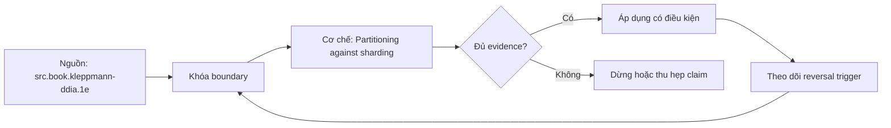

# Partitioning against sharding

> [!abstract] Câu hỏi trung tâm
> Khi nào chia bảng trong một database đủ, khi nào phải shard qua nhiều node, và partition key được chứng minh bằng workload ra sao?

## 1. Hai ranh giới khác nhau

PostgreSQL declarative partitioning chia một logical table thành child partitions dưới một database/cluster; planner, catalog và transaction manager vẫn cùng hệ. Sharding phân data ownership qua nhiều nodes/databases và thêm routing, rebalance, distributed queries, cross-shard transactions, failure domains và topology metadata. Một số sản phẩm gọi shard là partition; phải nói physical/administrative boundary thay vì chỉ tin thuật ngữ.

## 2. Mục tiêu của partitioning

Partition pruning giảm partitions phải scan khi predicate cho phép suy ra partition key; maintenance có thể detach/drop partition theo thời gian; indexes/constraints được quản lý theo partition. Partitioning không tự làm query nhanh: quá nhiều partitions tăng planning/catalog overhead, pruning thất bại sẽ scan rộng, skew tạo hot partition. Phải đo bytes/pages/partitions touched và latency distribution.

## 3. Range, list và hash

Range phù hợp time/range access và lifecycle nhưng latest range có thể nóng. List hợp region/tenant categories hữu hạn nhưng default partition cần quản trị. Hash phân phối đều hơn theo key quality nhưng phá locality/range pruning và migration semantics. Composite/subpartitioning tăng option lẫn operational complexity; chỉ dùng khi workload evidence cần.

## 4. Chọn key từ workload

Liệt kê query shapes, ingest distribution, retention, joins, uniqueness và growth. Key tốt xuất hiện trong selective predicates/routing, phân phối load đủ đều, không đổi thường xuyên và tương thích lifecycle. Timestamp cho drop-by-month tốt nhưng không giúp point lookup nếu query không có time. Tenant ID route tốt nhưng tenant lớn tạo skew; có thể cần bucket/compound strategy.

## 5. Sharding thêm distributed systems

Router phải map key→shard theo versioned topology. Rebalance copy data trong khi writes tiếp diễn và cần cutover correctness. Cross-shard join/aggregation gây scatter-gather; global uniqueness và foreign key khó; multi-shard transaction cần coordination. Hot key vẫn nóng dù số shard tăng. Vì vậy shard sau khi chứng minh single-node/partitioned design không đạt capacity/SLO.

## 6. Quy trình quyết định

Trước hết sửa model/query/index, archive và partition theo lifecycle. Đo peak storage, write IOPS, CPU/memory, maintenance window và headroom. Nếu một failure/administrative domain không đủ hoặc capacity vượt scale-up hợp lý, thiết kế shard contract: key, router, replication per shard, rebalance, global ID, cross-shard policy và recovery. Quyết định phải có exit/rekey plan.

## 7. Ma trận kiểm chứng từng mệnh đề

Mỗi mệnh đề dưới đây phải được kiểm bằng một schedule hoặc phép đo có điều kiện đầu vào rõ ràng. Không dùng một ảnh màn hình cuối làm bằng chứng thay cho lệnh, timestamp, cấu hình và raw output.

### 7.1. partition pruning cần predicate có quan hệ suy ra được với partition key

**Giả thuyết.** partition pruning cần predicate có quan hệ suy ra được với partition key. **Cách kiểm.** Cố định phiên bản database, cấu hình, dữ liệu seed và thứ tự thao tác; ghi operation ID, transaction/session ID, thời điểm bắt đầu-kết thúc và trạng thái commit/abort. **Đối chứng.** Chạy một biến thể bỏ đúng yếu tố đang xét, không đổi đồng thời nhiều tham số. **Bằng chứng đạt cho `wiki.database.partitioning-versus-sharding`.** Lưu command/script, raw result và counter trước-sau; giải thích cơ chế tạo ra quan sát. Một lần không tái hiện không đủ bác bỏ hiện tượng concurrency; cần barrier xác định và lặp có giới hạn.

### 7.2. partition key theo tháng hỗ trợ retention nhưng latest partition có thể hotspot

**Giả thuyết.** partition key theo tháng hỗ trợ retention nhưng latest partition có thể hotspot. **Cách kiểm.** Cố định phiên bản database, cấu hình, dữ liệu seed và thứ tự thao tác; ghi operation ID, transaction/session ID, thời điểm bắt đầu-kết thúc và trạng thái commit/abort. **Đối chứng.** Chạy một biến thể bỏ đúng yếu tố đang xét, không đổi đồng thời nhiều tham số. **Bằng chứng đạt cho `wiki.database.partitioning-versus-sharding`.** Lưu command/script, raw result và counter trước-sau; giải thích cơ chế tạo ra quan sát. Một lần không tái hiện không đủ bác bỏ hiện tượng concurrency; cần barrier xác định và lặp có giới hạn.

### 7.3. drop/detach partition khác DELETE từng row về WAL/lock/maintenance cost

**Giả thuyết.** drop/detach partition khác DELETE từng row về WAL/lock/maintenance cost. **Cách kiểm.** Cố định phiên bản database, cấu hình, dữ liệu seed và thứ tự thao tác; ghi operation ID, transaction/session ID, thời điểm bắt đầu-kết thúc và trạng thái commit/abort. **Đối chứng.** Chạy một biến thể bỏ đúng yếu tố đang xét, không đổi đồng thời nhiều tham số. **Bằng chứng đạt cho `wiki.database.partitioning-versus-sharding`.** Lưu command/script, raw result và counter trước-sau; giải thích cơ chế tạo ra quan sát. Một lần không tái hiện không đủ bác bỏ hiện tượng concurrency; cần barrier xác định và lặp có giới hạn.

### 7.4. quá nhiều partitions tăng planning/catalog overhead

**Giả thuyết.** quá nhiều partitions tăng planning/catalog overhead. **Cách kiểm.** Cố định phiên bản database, cấu hình, dữ liệu seed và thứ tự thao tác; ghi operation ID, transaction/session ID, thời điểm bắt đầu-kết thúc và trạng thái commit/abort. **Đối chứng.** Chạy một biến thể bỏ đúng yếu tố đang xét, không đổi đồng thời nhiều tham số. **Bằng chứng đạt cho `wiki.database.partitioning-versus-sharding`.** Lưu command/script, raw result và counter trước-sau; giải thích cơ chế tạo ra quan sát. Một lần không tái hiện không đủ bác bỏ hiện tượng concurrency; cần barrier xác định và lặp có giới hạn.

### 7.5. local index trên partitions không tự tạo global uniqueness ngoài partition key

**Giả thuyết.** local index trên partitions không tự tạo global uniqueness ngoài partition key. **Cách kiểm.** Cố định phiên bản database, cấu hình, dữ liệu seed và thứ tự thao tác; ghi operation ID, transaction/session ID, thời điểm bắt đầu-kết thúc và trạng thái commit/abort. **Đối chứng.** Chạy một biến thể bỏ đúng yếu tố đang xét, không đổi đồng thời nhiều tham số. **Bằng chứng đạt cho `wiki.database.partitioning-versus-sharding`.** Lưu command/script, raw result và counter trước-sau; giải thích cơ chế tạo ra quan sát. Một lần không tái hiện không đủ bác bỏ hiện tượng concurrency; cần barrier xác định và lặp có giới hạn.

### 7.6. hash partitioning phân phối key space nhưng không đảm bảo workload đều nếu hot key

**Giả thuyết.** hash partitioning phân phối key space nhưng không đảm bảo workload đều nếu hot key. **Cách kiểm.** Cố định phiên bản database, cấu hình, dữ liệu seed và thứ tự thao tác; ghi operation ID, transaction/session ID, thời điểm bắt đầu-kết thúc và trạng thái commit/abort. **Đối chứng.** Chạy một biến thể bỏ đúng yếu tố đang xét, không đổi đồng thời nhiều tham số. **Bằng chứng đạt cho `wiki.database.partitioning-versus-sharding`.** Lưu command/script, raw result và counter trước-sau; giải thích cơ chế tạo ra quan sát. Một lần không tái hiện không đủ bác bỏ hiện tượng concurrency; cần barrier xác định và lặp có giới hạn.

### 7.7. sharding đưa routing metadata thành consistency problem

**Giả thuyết.** sharding đưa routing metadata thành consistency problem. **Cách kiểm.** Cố định phiên bản database, cấu hình, dữ liệu seed và thứ tự thao tác; ghi operation ID, transaction/session ID, thời điểm bắt đầu-kết thúc và trạng thái commit/abort. **Đối chứng.** Chạy một biến thể bỏ đúng yếu tố đang xét, không đổi đồng thời nhiều tham số. **Bằng chứng đạt cho `wiki.database.partitioning-versus-sharding`.** Lưu command/script, raw result và counter trước-sau; giải thích cơ chế tạo ra quan sát. Một lần không tái hiện không đủ bác bỏ hiện tượng concurrency; cần barrier xác định và lặp có giới hạn.

### 7.8. scatter-gather latency bị quyết định bởi slow shard và fan-out

**Giả thuyết.** scatter-gather latency bị quyết định bởi slow shard và fan-out. **Cách kiểm.** Cố định phiên bản database, cấu hình, dữ liệu seed và thứ tự thao tác; ghi operation ID, transaction/session ID, thời điểm bắt đầu-kết thúc và trạng thái commit/abort. **Đối chứng.** Chạy một biến thể bỏ đúng yếu tố đang xét, không đổi đồng thời nhiều tham số. **Bằng chứng đạt cho `wiki.database.partitioning-versus-sharding`.** Lưu command/script, raw result và counter trước-sau; giải thích cơ chế tạo ra quan sát. Một lần không tái hiện không đủ bác bỏ hiện tượng concurrency; cần barrier xác định và lặp có giới hạn.

### 7.9. cross-shard transaction thêm coordinator/failure states

**Giả thuyết.** cross-shard transaction thêm coordinator/failure states. **Cách kiểm.** Cố định phiên bản database, cấu hình, dữ liệu seed và thứ tự thao tác; ghi operation ID, transaction/session ID, thời điểm bắt đầu-kết thúc và trạng thái commit/abort. **Đối chứng.** Chạy một biến thể bỏ đúng yếu tố đang xét, không đổi đồng thời nhiều tham số. **Bằng chứng đạt cho `wiki.database.partitioning-versus-sharding`.** Lưu command/script, raw result và counter trước-sau; giải thích cơ chế tạo ra quan sát. Một lần không tái hiện không đủ bác bỏ hiện tượng concurrency; cần barrier xác định và lặp có giới hạn.

### 7.10. rebalance cần copy, catch-up, cutover và rollback evidence

**Giả thuyết.** rebalance cần copy, catch-up, cutover và rollback evidence. **Cách kiểm.** Cố định phiên bản database, cấu hình, dữ liệu seed và thứ tự thao tác; ghi operation ID, transaction/session ID, thời điểm bắt đầu-kết thúc và trạng thái commit/abort. **Đối chứng.** Chạy một biến thể bỏ đúng yếu tố đang xét, không đổi đồng thời nhiều tham số. **Bằng chứng đạt cho `wiki.database.partitioning-versus-sharding`.** Lưu command/script, raw result và counter trước-sau; giải thích cơ chế tạo ra quan sát. Một lần không tái hiện không đủ bác bỏ hiện tượng concurrency; cần barrier xác định và lặp có giới hạn.

### 7.11. tenant ID shard key gặp whale tenant skew

**Giả thuyết.** tenant ID shard key gặp whale tenant skew. **Cách kiểm.** Cố định phiên bản database, cấu hình, dữ liệu seed và thứ tự thao tác; ghi operation ID, transaction/session ID, thời điểm bắt đầu-kết thúc và trạng thái commit/abort. **Đối chứng.** Chạy một biến thể bỏ đúng yếu tố đang xét, không đổi đồng thời nhiều tham số. **Bằng chứng đạt cho `wiki.database.partitioning-versus-sharding`.** Lưu command/script, raw result và counter trước-sau; giải thích cơ chế tạo ra quan sát. Một lần không tái hiện không đủ bác bỏ hiện tượng concurrency; cần barrier xác định và lặp có giới hạn.

### 7.12. random key giảm locality và range scan efficiency

**Giả thuyết.** random key giảm locality và range scan efficiency. **Cách kiểm.** Cố định phiên bản database, cấu hình, dữ liệu seed và thứ tự thao tác; ghi operation ID, transaction/session ID, thời điểm bắt đầu-kết thúc và trạng thái commit/abort. **Đối chứng.** Chạy một biến thể bỏ đúng yếu tố đang xét, không đổi đồng thời nhiều tham số. **Bằng chứng đạt cho `wiki.database.partitioning-versus-sharding`.** Lưu command/script, raw result và counter trước-sau; giải thích cơ chế tạo ra quan sát. Một lần không tái hiện không đủ bác bỏ hiện tượng concurrency; cần barrier xác định và lặp có giới hạn.

### 7.13. replication và sharding là hai trục: mỗi shard vẫn cần replicas

**Giả thuyết.** replication và sharding là hai trục: mỗi shard vẫn cần replicas. **Cách kiểm.** Cố định phiên bản database, cấu hình, dữ liệu seed và thứ tự thao tác; ghi operation ID, transaction/session ID, thời điểm bắt đầu-kết thúc và trạng thái commit/abort. **Đối chứng.** Chạy một biến thể bỏ đúng yếu tố đang xét, không đổi đồng thời nhiều tham số. **Bằng chứng đạt cho `wiki.database.partitioning-versus-sharding`.** Lưu command/script, raw result và counter trước-sau; giải thích cơ chế tạo ra quan sát. Một lần không tái hiện không đủ bác bỏ hiện tượng concurrency; cần barrier xác định và lặp có giới hạn.

### 7.14. partitioning không thay index và không chữa query không sargable

**Giả thuyết.** partitioning không thay index và không chữa query không sargable. **Cách kiểm.** Cố định phiên bản database, cấu hình, dữ liệu seed và thứ tự thao tác; ghi operation ID, transaction/session ID, thời điểm bắt đầu-kết thúc và trạng thái commit/abort. **Đối chứng.** Chạy một biến thể bỏ đúng yếu tố đang xét, không đổi đồng thời nhiều tham số. **Bằng chứng đạt cho `wiki.database.partitioning-versus-sharding`.** Lưu command/script, raw result và counter trước-sau; giải thích cơ chế tạo ra quan sát. Một lần không tái hiện không đủ bác bỏ hiện tượng concurrency; cần barrier xác định và lặp có giới hạn.

### 7.15. chỉ shard sau capacity forecast, measured bottleneck và operational readiness

**Giả thuyết.** chỉ shard sau capacity forecast, measured bottleneck và operational readiness. **Cách kiểm.** Cố định phiên bản database, cấu hình, dữ liệu seed và thứ tự thao tác; ghi operation ID, transaction/session ID, thời điểm bắt đầu-kết thúc và trạng thái commit/abort. **Đối chứng.** Chạy một biến thể bỏ đúng yếu tố đang xét, không đổi đồng thời nhiều tham số. **Bằng chứng đạt cho `wiki.database.partitioning-versus-sharding`.** Lưu command/script, raw result và counter trước-sau; giải thích cơ chế tạo ra quan sát. Một lần không tái hiện không đủ bác bỏ hiện tượng concurrency; cần barrier xác định và lặp có giới hạn.

## 8. Khung chẩn đoán

1. Viết hiện tượng quan sát được và mốc thời gian, không nhảy thẳng tới nguyên nhân.
2. Ghi exact DBMS/version, topology, isolation/durability mode và workload.
3. Dựng state hoặc dependency graph nhỏ nhất giải thích hiện tượng.
4. Thu evidence ở cả client, engine và storage/replica nếu có.
5. Nêu giả thuyết có dự đoán phân biệt được; đổi một biến và chạy lại.
6. Phân biệt biện pháp giảm triệu chứng, sửa nguyên nhân và control ngăn tái diễn.
7. Giữ failed run; không xoá evidence chỉ vì kết quả không như dự kiến.

## 9. Câu hỏi tự kiểm tra

1. Contract chính của cơ chế trong bài là gì và failure class nào nằm ngoài contract?
2. Counter hoặc graph nào phân biệt symptom với root cause?
3. Một phát biểu nào chỉ đúng cho PostgreSQL, không được khái quát thành SQL chung?
4. Abort hoặc stale read khi nào là hành vi đúng theo cấu hình?
5. Lab cần barrier, operation ID và đối chứng nào để tái hiện được?
6. Biện pháp vận hành nào nguy hiểm nếu áp dụng trực tiếp lên production?

## 10. Giới hạn và điều chưa cho phép kết luận

- Chưa chạy lab database; mọi số đo phải được học viên tạo trong môi trường cô lập.
- Hành vi theo version/dialect phải kiểm manual đúng hệ; note không thay runbook production.
- Không suy benchmark, ngưỡng alert hay SLO phổ quát từ sách.
- Không coi synchronous, serializable, vacuum hoặc partitioning là bảo đảm tuyệt đối ngoài cấu hình và failure model đã nêu.

## Reference
1. [[SRC-KLEPPMANN-DDIA-1E]]
2. [[SRC-POSTGRESQL-17-10-MANUAL]]
3. [[SRC-SILBERSCHATZ-DATABASE-SYSTEM-CONCEPTS-7E]]
4. [[SRC-PETROV-DATABASE-INTERNALS-1E]]

## Source coverage

| Source slice | Nội dung sử dụng | Trạng thái |
|---|---|---|
| [[SRC-KLEPPMANN-DDIA-1E]] | Cơ chế, ranh giới và phản ví dụ liên quan đến bài | Đã đọc phạm vi có locator và diễn giải |
| [[SRC-POSTGRESQL-17-10-MANUAL]] | Cơ chế, ranh giới và phản ví dụ liên quan đến bài | Đã đọc phạm vi có locator và diễn giải |
| [[SRC-SILBERSCHATZ-DATABASE-SYSTEM-CONCEPTS-7E]] | Cơ chế, ranh giới và phản ví dụ liên quan đến bài | Đã đọc phạm vi có locator và diễn giải |
| [[SRC-PETROV-DATABASE-INTERNALS-1E]] | Cơ chế, ranh giới và phản ví dụ liên quan đến bài | Đã đọc phạm vi có locator và diễn giải |

## Key takeaways
- Bắt đầu từ invariant/failure model và bằng chứng, không bắt đầu từ tên tính năng.
- Phân biệt contract chung với hành vi PostgreSQL cụ thể.
- Concurrency và failover test phải có schedule, operation ID và raw output tái lập được.
- Một control làm giảm rủi ro này có thể tăng latency, abort, coordination hoặc chi phí vận hành khác.
- Chưa chạy lab thì trạng thái là tài liệu học thuật đã kiểm cấu trúc, không phải chứng nhận production.

<!-- ATOMIC-EXECUTION-CAPSULE:START -->

## Execution capsule: kiểm chứng `wiki.database.partitioning-versus-sharding`

> [!important] Phân loại mệnh đề
> Với `wiki.database.partitioning-versus-sharding`, sơ đồ, ví dụ và artifact về **Partitioning against sharding** là **synthesis để kiểm chứng**; chúng không phải trích dẫn hay case nguyên văn của nguồn.

### Sơ đồ cơ chế và điểm kiểm soát



Đọc sơ đồ `wiki.database.partitioning-versus-sharding` từ trái sang phải: source chỉ cung cấp claim ban đầu cho **Partitioning against sharding**; quyết định chỉ được đi tiếp sau khi boundary, evidence và điều kiện đảo quyết định đã hiện hữu.

### Artifact thực thi tối thiểu

```sql
-- Verification harness for: Partitioning against sharding
WITH evidence AS (
    SELECT 'wiki.database.partitioning-versus-sharding' AS concept_id,
           'boundary_declared' AS check_name, 1 AS passed
    UNION ALL
    SELECT 'wiki.database.partitioning-versus-sharding', 'independent_oracle', 1
    UNION ALL
    SELECT 'wiki.database.partitioning-versus-sharding', 'reversal_trigger_recorded', 1
)
SELECT concept_id,
       MIN(passed) AS all_hard_checks_pass,
       COUNT(*) AS evidence_items
FROM evidence
GROUP BY concept_id
HAVING MIN(passed) = 1;
```

Artifact của `wiki.database.partitioning-versus-sharding` buộc người dùng ghi boundary, oracle và reversal trigger cho **Partitioning against sharding**. Các giá trị minh họa phải được thay bằng evidence thật trước khi dùng cho quyết định.

### Tự kiểm tra trước khi tái sử dụng

1. Bạn có thể trả lời `Khi nào chia bảng trong một database đủ, khi nào phải shard qua nhiều node, và partition key được chứng minh bằng workload ra sao?` bằng một câu mà không kéo thêm concept thứ hai không?
2. Source locator nào đỡ cho claim, và phần nào chỉ là synthesis trong note?
3. Observation nào khiến bạn dừng, thu hẹp hoặc đảo quyết định?
4. Artifact nào cho phép một reviewer độc lập tái hiện kết quả?

<!-- ATOMIC-EXECUTION-CAPSULE:END -->
