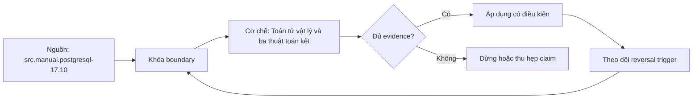

# Toán tử vật lý và ba thuật toán kết

> [!abstract] Câu hỏi trung tâm
> Mỗi plan node nhận/phát rows thế nào, cần ordering/index/memory gì, và evidence nào xác nhận dự đoán thuật toán thay vì suy từ khẩu quyết?

## 1. Plan là cây toán tử

Physical plan là cây nodes. Leaf scans đọc relations/indexes; nodes giữa filter, join, sort, aggregate/materialize; root trả rows. Parent gọi children và tiêu thụ output. `loops` cho biết node chạy bao nhiêu lần; actual rows thường là mỗi loop trong EXPLAIN ANALYZE.

Đọc từ lá lên để thấy data volume biến đổi. Tìm node đầu tiên estimated/actual lệch, rows removed lớn, repeated loops, sort/hash spill hoặc heap fetch cao. Tổng thời gian parent bao gồm child theo instrumentation, nên không cộng ngây thơ.

Plan node name không đủ kết luận; đọc conditions, rows, loops, buffers, memory/disk và ordering.

## 2. Sequential scan

Sequential scan đọc heap pages tuần tự và áp filter. Nó hợp lý khi query cần phần lớn bảng, bảng nhỏ, correlation/index không có lợi hoặc random fetch đắt. Seq scan là xấu là ngộ nhận.

`Rows Removed by Filter` giúp thấy selectivity actual; buffers cho thấy pages hit/read. Một seq scan thường xuyên trên bảng lớn có thể là missing index, nhưng cũng có thể là analytics hoặc backup hợp lý.

Parallel seq scan chia pages cho workers, thêm gather. Parallelism có setup/coordination cost; bảng nhỏ không đáng.

## 3. Index scan

Index scan duyệt access method để lấy TIDs rồi fetch heap rows và kiểm visibility. Nó có lợi khi selectivity đủ thấp, ordering hữu ích hoặc correlation giảm random I/O. Nhiều scattered heap fetch có thể đắt hơn seq scan.

`Index Cond` là điều kiện dùng để định vị trong index; `Filter` là điều kiện áp sau khi fetch. Hai query đều dùng index nhưng lượng heap work có thể rất khác.

Cost phụ thuộc pages, tuples, correlation, cache và constants. Không định một ngưỡng phần trăm phổ quát.

## 4. Index-only scan

Index-only scan cần access method lưu/reconstruct columns và query chỉ cần columns trong index. Nhưng PostgreSQL visibility nằm ở heap; chỉ khi visibility map nói heap page all-visible mới tránh heap fetch. EXPLAIN báo `Heap Fetches`.

`INCLUDE` thêm payload columns để cover query mà không làm search key; index rộng tăng storage/write cost và có size limits. Workload update-heavy có thể làm all-visible thấp, khiến index-only degrade gần index scan.

Vì vậy covering index không cần heap chỉ đúng khi coverage và visibility cùng đạt.

## 5. Bitmap scans

Bitmap index scan tạo bitmap TIDs; bitmap heap scan gom theo heap pages, giảm random visits. Có thể combine multiple indexes bằng bitmap AND/OR. Khi bitmap vượt memory, nó có thể lossy và cần recheck.

Bitmap phù hợp selectivity trung gian, nhưng không giữ index order như regular index scan. Nếu query cần ORDER BY, planner cân sort.

Đọc `Heap Blocks exact/lossy`, `Recheck Cond`, rows removed by recheck và work_mem context.

## 6. Sort

Sort tạo ordering cho ORDER BY, merge join, unique, window hoặc aggregate. In-memory methods khác external merge khi vượt memory. EXPLAIN ANALYZE ghi `Sort Method`, memory hoặc disk. Spill tăng temp I/O và latency.

`work_mem` là budget theo sort/hash operation, không phải một pool duy nhất cho query/session. Nhiều nodes, partitions và concurrent sessions có thể nhân memory. Tăng global quá cao có thể OOM.

Incremental sort tận dụng prefix đã sorted trong trường hợp phù hợp. Index order có thể bỏ sort nhưng trade-off index maintenance.

## 7. Aggregate operators

HashAggregate xây hash table theo group keys; GroupAggregate cần sorted input. Hash phù hợp groups vừa memory; spill/batches tùy version/plan. Sorted input từ index hoặc sort có thể làm group aggregate phù hợp.

Estimated number of groups ảnh hưởng memory/cost. NDV sai dẫn tới operator/memory sai. Partial/final aggregate hỗ trợ parallel execution cho hàm phù hợp.

Operator choice không đổi aggregate semantics nhưng input fanout/grain sai vẫn cho số sai.

## 8. Materialize và memoize

Materialize lưu output child để đọc lại, dùng memory rồi temp file khi cần. Trong nested loop, nó có thể tránh chạy child tĩnh nhiều lần. Memoize cache kết quả parameterized scan theo key, hiệu quả khi outer keys lặp và cache hit cao.

Không gọi mọi materialize là lỗi. Đọc loops, cache hits/misses/evictions và spill. Nếu outer keys gần unique, memoize ít lợi.

CTE materialization và Materialize plan node liên quan ý tưởng lưu trung gian nhưng không đồng nhất khái niệm.

## 9. Nested loop

Nested loop lấy từng outer row rồi chạy inner path với join condition/parameter. Nó mạnh khi outer nhỏ và inner lookup rẻ qua index, hoặc join không equi mà hash/merge không áp dụng. Cost gần outer rows × inner lookup work.

Nếu planner ước lượng outer 10 nhưng thực tế một triệu, inner scan lặp một triệu lần và plan sụp. Đọc `loops` ở inner node. Có index không đủ; key lookup/selectivity/cache phải phù hợp.

Nested loop cũng là lựa chọn tự nhiên cho Cartesian product nhỏ và parameterized joins. Không coi nó luôn xấu.

## 10. Hash join

Hash join thường dùng equi-join: build hash table từ một input, probe bằng input kia. Tốt khi build side vừa memory và không có ordering hữu ích. Planner chọn build side dựa estimated size; estimate sai có thể build phía lớn.

Nếu hash table vượt memory, PostgreSQL chia batches và dùng temp I/O. EXPLAIN hiển thị buckets, batches, memory usage; buffers/temp giúp đo. Skew/hot keys có thể ảnh hưởng distribution và output fanout.

Hash join không cung cấp sorted output. Nó cần hashable equality operator và có semantics hỗ trợ join type cụ thể.

## 11. Merge join

Merge join đọc hai inputs đã sorted theo join keys và tiến đồng bộ. Nếu inputs có index order hoặc đã sorted cho mục đích khác, merge có lợi. Nếu phải sort cả hai, sort cost/spill có thể làm kém.

Duplicates cần nhóm matching và có thể tạo many-to-many output như semantics yêu cầu. Merge join phù hợp equality và một số ordered comparisons tùy operator families.

Nói merge tốt khi cả hai đã sort là heuristic; cardinality, selectivity và available paths vẫn quyết định.

## 12. So sánh ba thuật toán

Nested loop có thể trả first rows sớm, tốt outer nhỏ/inner indexed; hash có build startup rồi probe, tốt equi join lớn khi memory phù hợp; merge cần/order-preserving, tốt khi sorted paths. Không có winner tuyệt đối.

Planner đánh giá complete paths, không chọn join algorithm tách khỏi scans, order và downstream. Một merge join có thể tránh sort cho ORDER BY; hash join nhanh join nhưng thêm sort.

Outer/semi/anti/non-equi support khác nhau. Correctness đến từ semantics, performance từ full plan.

## 13. Bốn tình huống dự đoán

Tình huống A: outer 10 rows, inner hàng triệu với selective indexed key → dự đoán nested loop. B: hai tập lớn equi, build side vừa memory, không sorted → hash. C: hai inputs đã ordered/indexed và output cần order → merge. D: hash build vượt work_mem → hash batches/temp hoặc alternative plan.

Đây là hypotheses, không cam kết. Ghi dự đoán trước; chạy EXPLAIN (ANALYZE, BUFFERS, SETTINGS); giải thích nếu khác bằng estimates/costs/paths. Không bật/tắt join methods để tạo bằng chứng cho default planner; chỉ dùng toggles ở experiment bổ sung.

Fixture có cùng result semantics. So result checksum khi rewrite/index khác.

## 14. Thí nghiệm spill

Dùng session-local `SET LOCAL work_mem` trong transaction/lab để tránh tác động cluster. Chọn query có sort/hash đủ lớn. Giảm dần budget, ghi Sort Method, Disk, Hash Batches, temp read/write, elapsed distribution và system load.

Không đặt work_mem cực nhỏ trên production traffic. Không kết luận từ một run; warm/cold cache và concurrent I/O ảnh hưởng. Dùng data đủ lớn nhưng kiểm soát.

Tăng work_mem chỉ một query có thể dùng role/session setting hoặc query restructuring; tính worst-case concurrency trước global change.

## 15. Index scan và index-only experiment

Tạo index key-only và covering INCLUDE. Chạy cùng query sau VACUUM phù hợp và sau update-heavy workload. So Heap Fetches, buffers, size và write throughput. Điều này chứng minh visibility dependency.

Không chạy VACUUM chỉ để benchmark đẹp mà bỏ trạng thái production. Báo cả hai regimes.

Index-only tốt cho reads không tự biện minh index rộng nếu writes chịu chi phí lớn.

## 16. Đọc plan có kỷ luật

Ghi query/parameters, PostgreSQL version, data snapshot, schema/indexes, stats timestamp, settings, machine/load. Đọc estimates trước actual để giữ dự đoán độc lập. Xác định critical path theo loops/work.

So estimate vs actual, `Index Cond` vs `Filter`, sort/hash memory/disk, buffers hit/read/dirtied, temp, planning/execution time. Server timing không thay end-to-end.

Plan text screenshot không đủ; lưu machine-readable plan và SQL/seed.

## 17. Anti-patterns

Các lỗi: một join algorithm luôn nhanh; seq scan luôn xấu; index-only luôn không heap; tăng work_mem toàn cluster; ép planner trước khi sửa stats; đọc node name mà bỏ loops; đo thời gian không kiểm result; dùng toy table không đủ phát sinh spill.

Một lỗi khác là bỏ qua join fanout: algorithm nhanh vẫn trả số lượng lớn đúng semantics nhưng downstream không mong.

## 18. Câu hỏi tự kiểm tra

1. Index scan và index-only scan khác visibility work nào?
2. Vì sao nested loop nhạy với outer estimate?
3. Hash Batches lớn hơn một cho biết gì?
4. Merge join hưởng lợi từ ordering nào?
5. `work_mem` nhân theo operations/concurrency ra sao?
6. Vì sao algorithm phải đánh giá trong full path?

## 19. Giới hạn và điều chưa cho phép kết luận

- Heuristics không thay cost/plan evidence trên workload cụ thể.
- PostgreSQL 14 Internals dùng giải thích cơ chế; chi tiết được neo lại vào manual 17.10.
- Timing phụ thuộc cache, hardware, config và concurrent load.
- Lab spill có thể gây temp I/O; chỉ chạy môi trường kiểm soát.
- Bốn scenario chưa chạy trong note; evidence thuộc `after-note.md`.

## Reference
1. [[SRC-POSTGRESQL-17-10-MANUAL]]: EXPLAIN, index scans và planner configuration.
2. [[SRC-MASTERING-POSTGRESQL-17-6E]]: cost model, indexes và join planning.
3. [[SRC-ROGOV-POSTGRESQL-14-INTERNALS]]: scan costs và nested/hash/merge mechanisms.

## Source coverage

| Source slice | Nội dung phải giữ | Vị trí trong note | Trạng thái |
|---|---|---|---|
| [[SRC-POSTGRESQL-17-10-MANUAL]], PDF 488-498, 559-571 | scans, EXPLAIN, planner knobs | §§1-8, 16 | Đã đối chiếu 17.10 |
| [[SRC-MASTERING-POSTGRESQL-17-6E]], PDF 87-112, 223-270 | index/cost/join examples | §§2-13 | Đã bỏ ngưỡng phổ quát |
| [[SRC-ROGOV-POSTGRESQL-14-INTERNALS]], PDF 330-407 | access paths và ba joins | §§3-12 | Đã giữ mechanism, gắn version caveat |
| Tổng hợp DE-L127 | four predictions, spill experiment | §§13-17 | Đã thành evidence protocol |

## Key takeaways
- Plan phải đọc như cây rows/loops/cost/memory/I/O, không theo tên node riêng lẻ.
- Nested loop, hash và merge có vùng hiệu quả khác nhau; không có thuật toán thắng tuyệt đối.
- Index-only scan còn phụ thuộc visibility map.
- Spill được chứng minh bằng plan/temp evidence, không bằng cảm giác chậm.
- `work_mem` là budget per operation và có thể nhân mạnh dưới concurrency.

<!-- ATOMIC-EXECUTION-CAPSULE:START -->

## Execution capsule: kiểm chứng `wiki.database.physical-operators-join-algorithms`

> [!important] Phân loại mệnh đề
> Với `wiki.database.physical-operators-join-algorithms`, sơ đồ, ví dụ và artifact về **Toán tử vật lý và ba thuật toán kết** là **synthesis để kiểm chứng**; chúng không phải trích dẫn hay case nguyên văn của nguồn.

### Sơ đồ cơ chế và điểm kiểm soát



Đọc sơ đồ `wiki.database.physical-operators-join-algorithms` từ trái sang phải: source chỉ cung cấp claim ban đầu cho **Toán tử vật lý và ba thuật toán kết**; quyết định chỉ được đi tiếp sau khi boundary, evidence và điều kiện đảo quyết định đã hiện hữu.

### Ví dụ làm việc có thể bác bỏ

**Input.** Một đội cần trả lời: Các scan, sort, aggregate và ba join algorithm tiêu thụ CPU, I/O, memory thế nào, và dự đoán plan được kiểm chứng ra sao? cho một phạm vi nhỏ, có owner và deadline rõ.

**Decision.** Đội áp dụng **Toán tử vật lý và ba thuật toán kết** trên control và variant chỉ khác một assumption; expected result và hard constraints được khóa trước khi chạy.

**Outcome.** Với `wiki.database.physical-operators-join-algorithms`, nếu observation vi phạm hard constraint hoặc oracle độc lập không xác nhận **Toán tử vật lý và ba thuật toán kết**, đội thu hẹp claim hay đảo quyết định. Nếu đạt, kết luận vẫn kèm scope, version và review date; một lần thành công không được nâng thành quy luật phổ quát.

### Artifact thực thi tối thiểu

```sql
-- Verification harness for: Toán tử vật lý và ba thuật toán kết
WITH evidence AS (
    SELECT 'wiki.database.physical-operators-join-algorithms' AS concept_id,
           'boundary_declared' AS check_name, 1 AS passed
    UNION ALL
    SELECT 'wiki.database.physical-operators-join-algorithms', 'independent_oracle', 1
    UNION ALL
    SELECT 'wiki.database.physical-operators-join-algorithms', 'reversal_trigger_recorded', 1
)
SELECT concept_id,
       MIN(passed) AS all_hard_checks_pass,
       COUNT(*) AS evidence_items
FROM evidence
GROUP BY concept_id
HAVING MIN(passed) = 1;
```

Artifact của `wiki.database.physical-operators-join-algorithms` buộc người dùng ghi boundary, oracle và reversal trigger cho **Toán tử vật lý và ba thuật toán kết**. Các giá trị minh họa phải được thay bằng evidence thật trước khi dùng cho quyết định.

### Tự kiểm tra trước khi tái sử dụng

1. Bạn có thể trả lời `Các scan, sort, aggregate và ba join algorithm tiêu thụ CPU, I/O, memory thế nào, và dự đoán plan được kiểm chứng ra sao?` bằng một câu mà không kéo thêm concept thứ hai không?
2. Source locator nào đỡ cho claim, và phần nào chỉ là synthesis trong note?
3. Observation nào khiến bạn dừng, thu hẹp hoặc đảo quyết định?
4. Artifact nào cho phép một reviewer độc lập tái hiện kết quả?

<!-- ATOMIC-EXECUTION-CAPSULE:END -->
