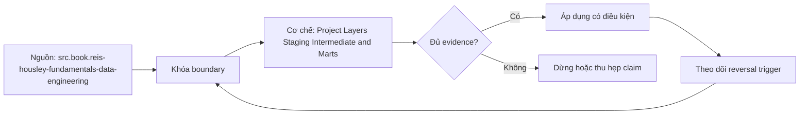

# Project Layers Staging Intermediate and Marts

> [!abstract] Câu hỏi trung tâm
> Staging, intermediate và marts chia ownership cùng semantic responsibility thế nào mà không biến thành ba thư mục hình thức?

## 1. Layer là trách nhiệm

Staging chuẩn hóa source-facing names/types và giữ grain gần nguồn; intermediate biểu diễn reusable transformations hoặc domain logic chưa phải consumer contract; marts công bố entity/fact/metric-ready outputs theo use case. Prefix hay folder chỉ là signal. Một model được xếp layer từ contract, grain, owner và consumer, không từ số CTE. Layering nhằm làm change impact rõ và tránh vừa chuẩn hóa nguồn vừa định nghĩa KPI trong một node khó kiểm.

## 2. Staging boundary

Mỗi staging model thường bám một source relation, rename/cast/dedup có semantics đã nêu, thêm provenance cần thiết và không join nhiều business domains. Không che mất raw anomalies bằng `coalesce` hoặc filter không giải thích. Source freshness, schema tests và accepted values ở đây chỉ kiểm contract gần nguồn. Nếu source có nested/repeated structure, unpack có thể tạo grain mới và phải ghi rõ, không gọi staging như cũ.

## 3. Intermediate không phải kho đồ thừa

Intermediate đáng tồn tại khi một transformation có concept rõ, được nhiều downstream dùng hoặc cô lập complexity/test boundary. Model một lần dùng chỉ để giảm chiều dài SQL có thể là CTE. Intermediate public ngoài ý muốn tạo coupling và migration burden. Đặt explicit grain, primary key candidate, inputs/outputs và materialization rationale. Tránh chuỗi `int_a`, `int_b` không nói domain semantics.

## 4. Marts là contract consumer

Mart có grain và business meaning ổn định, ownership, tests, documentation, freshness, access và migration policy. Fact/dimension hay wide table là design choice theo workload. Không để mỗi dashboard tự định nghĩa joins và KPI khác nhau. Một mart không tự trở thành truth chỉ vì nằm trong folder marts; phải reconcile với business rule, expose lineage và quản lý breaking change.

## 5. Dependency direction

Flow mặc định source to staging to intermediate to marts; exceptions cần ADR. Mart-to-mart reference có thể hợp lý nếu upstream mart là contracted domain product, nhưng dễ tạo graph tangled. Staging không phụ thuộc marts. Dùng graph checks để phát hiện layer violations và fanout hubs. Layer access schemas/grants có thể reinforce boundary, song physical schemas không thay semantic review.

## 6. Refactor lab

Cho một query monolith trộn casting, joins, dedup và KPI. Tách thành minimal models; tại mỗi boundary ghi grain/key, owned transformation, tests và consumer. So compiled SQL, graph, row/hash result và query plan trước–sau. Inject source rename và KPI change để đo blast radius. Đạt khi layers giảm coupling có chứng cứ, không chỉ tăng file count.

## 7. Ma trận kiểm chứng từng mệnh đề

Trong `Project Layers Staging Intermediate and Marts`, mỗi claim phải nối được tới input boundary, compiled hoặc executed artifact, trạng thái trước–sau, failure signal và independent oracle. Một command kết thúc với exit code 0 không tự chứng minh dữ liệu đúng, đầy đủ hoặc phù hợp với consumer contract. Protocol nền của bài này: Dựng fixture và project tối thiểu có exact graph/input boundary; chạy command hoặc protocol theo thứ tự, rồi đối soát relation, key set, typed hash và business invariant với full/reference computation.

### 7.1. Layering probe 1: responsibility, grain, owner, dependency direction và change blast radius phải rõ

**Mệnh đề cần kiểm.** Layering probe 1: responsibility, grain, owner, dependency direction và change blast radius phải rõ.

**Thiết kế phép thử cho `wiki.transformation.dbt-project-layers`.** Với `Layering probe 1: responsibility, grain, owner, dependency direction và change blast radius phải rõ`, Bắt đầu bằng ca nhỏ nhất có thể làm mệnh đề sai; chỉ thêm dữ liệu sau khi failure signal đã xuất hiện đúng chỗ. Cách này phân biệt một assertion có lực với một bài demo chỉ đi qua happy path. Khóa versions, target và input boundary có liên quan; lưu command, compiled SQL hoặc scheduler context cùng query IDs và timestamps.

**Bằng chứng cần giữ.** Hồ sơ của `Layering probe 1: responsibility, grain, owner, dependency direction và change blast radius phải rõ` phải cho thấy: Giữ fixture tối thiểu, raw failure rows và câu lệnh tái hiện; ảnh chụp màn hình một trạng thái xanh không đủ. Nếu sandbox chưa chạy, mục này vẫn là protocol; không đổi expected result thành observation.

### 7.2. Layering probe 2: responsibility, grain, owner, dependency direction và change blast radius phải rõ

**Mệnh đề cần kiểm.** Layering probe 2: responsibility, grain, owner, dependency direction và change blast radius phải rõ.

**Thiết kế phép thử cho `wiki.transformation.dbt-project-layers`.** Với `Layering probe 2: responsibility, grain, owner, dependency direction và change blast radius phải rõ`, Giữ nguyên input rồi đổi đúng một tham số cấu hình liên quan. Nếu output đổi theo nhiều hướng cùng lúc, phép thử chưa cô lập được nguyên nhân và phải thu hẹp lại. Khóa versions, target và input boundary có liên quan; lưu command, compiled SQL hoặc scheduler context cùng query IDs và timestamps.

**Bằng chứng cần giữ.** Hồ sơ của `Layering probe 2: responsibility, grain, owner, dependency direction và change blast radius phải rõ` phải cho thấy: Báo cả giá trị trước–sau của tham số, compiled artifact và diff đầu ra để reviewer thấy biến nào thực sự đổi. Nếu sandbox chưa chạy, mục này vẫn là protocol; không đổi expected result thành observation.

### 7.3. Layering probe 3: responsibility, grain, owner, dependency direction và change blast radius phải rõ

**Mệnh đề cần kiểm.** Layering probe 3: responsibility, grain, owner, dependency direction và change blast radius phải rõ.

**Thiết kế phép thử cho `wiki.transformation.dbt-project-layers`.** Với `Layering probe 3: responsibility, grain, owner, dependency direction và change blast radius phải rõ`, Chạy cặp đối chứng: một input phải được chấp nhận và một input chỉ lệch tại boundary phải bị chặn hoặc được phân loại. Hai ca dùng chung code path để tránh so hai hệ thống khác nhau. Khóa versions, target và input boundary có liên quan; lưu command, compiled SQL hoặc scheduler context cùng query IDs và timestamps.

**Bằng chứng cần giữ.** Hồ sơ của `Layering probe 3: responsibility, grain, owner, dependency direction và change blast radius phải rõ` phải cho thấy: Pass khi positive control đi qua, negative control dừng đúng lớp và không có side effect ngoài scope. Nếu sandbox chưa chạy, mục này vẫn là protocol; không đổi expected result thành observation.

### 7.4. Layering probe 4: responsibility, grain, owner, dependency direction và change blast radius phải rõ

**Mệnh đề cần kiểm.** Layering probe 4: responsibility, grain, owner, dependency direction và change blast radius phải rõ.

**Thiết kế phép thử cho `wiki.transformation.dbt-project-layers`.** Với `Layering probe 4: responsibility, grain, owner, dependency direction và change blast radius phải rõ`, Đặt kill point ngay trước và ngay sau durable boundary. So trạng thái sau restart để biết hệ thống tạo replay có kiểm soát, silent gap hay một trạng thái nửa vời mà dashboard không báo. Khóa versions, target và input boundary có liên quan; lưu command, compiled SQL hoặc scheduler context cùng query IDs và timestamps.

**Bằng chứng cần giữ.** Hồ sơ của `Layering probe 4: responsibility, grain, owner, dependency direction và change blast radius phải rõ` phải cho thấy: Run ledger phải cho biết commit/checkpoint nào bền vững; sau rerun, key set và side-effect ledger cùng hội tụ. Nếu sandbox chưa chạy, mục này vẫn là protocol; không đổi expected result thành observation.

### 7.5. Layering probe 5: responsibility, grain, owner, dependency direction và change blast radius phải rõ

**Mệnh đề cần kiểm.** Layering probe 5: responsibility, grain, owner, dependency direction và change blast radius phải rõ.

**Thiết kế phép thử cho `wiki.transformation.dbt-project-layers`.** Với `Layering probe 5: responsibility, grain, owner, dependency direction và change blast radius phải rõ`, Đảo thứ tự input và thay concurrency nhưng giữ logical population. Kết quả khác nhau cho thấy thiết kế đang phụ thuộc physical order hoặc race thay vì contract đã công bố. Khóa versions, target và input boundary có liên quan; lưu command, compiled SQL hoặc scheduler context cùng query IDs và timestamps.

**Bằng chứng cần giữ.** Hồ sơ của `Layering probe 5: responsibility, grain, owner, dependency direction và change blast radius phải rõ` phải cho thấy: Hash chuẩn hóa và business totals phải giống nhau giữa các thứ tự; chênh lệch được giữ như finding, không làm tròn mất. Nếu sandbox chưa chạy, mục này vẫn là protocol; không đổi expected result thành observation.

### 7.6. Layering probe 6: responsibility, grain, owner, dependency direction và change blast radius phải rõ

**Mệnh đề cần kiểm.** Layering probe 6: responsibility, grain, owner, dependency direction và change blast radius phải rõ.

**Thiết kế phép thử cho `wiki.transformation.dbt-project-layers`.** Với `Layering probe 6: responsibility, grain, owner, dependency direction và change blast radius phải rõ`, Cho cùng logical identity xuất hiện hai lần: trước hết cùng payload, sau đó payload khác. Trường hợp đầu phải hội tụ; trường hợp sau phải lộ collision thay vì âm thầm chọn một bản. Khóa versions, target và input boundary có liên quan; lưu command, compiled SQL hoặc scheduler context cùng query IDs và timestamps.

**Bằng chứng cần giữ.** Hồ sơ của `Layering probe 6: responsibility, grain, owner, dependency direction và change blast radius phải rõ` phải cho thấy: Same-content replay được đếm nhưng không nhân state; different-content collision có reason code và đường xử lý riêng. Nếu sandbox chưa chạy, mục này vẫn là protocol; không đổi expected result thành observation.

### 7.7. Layering probe 7: responsibility, grain, owner, dependency direction và change blast radius phải rõ

**Mệnh đề cần kiểm.** Layering probe 7: responsibility, grain, owner, dependency direction và change blast radius phải rõ.

**Thiết kế phép thử cho `wiki.transformation.dbt-project-layers`.** Với `Layering probe 7: responsibility, grain, owner, dependency direction và change blast radius phải rõ`, Mở rộng fixture bằng một record tới trễ ngay trong horizon và một record nằm ngoài horizon. Ghi rõ record nào được sửa, record nào bị loại và metric nào khiến operator biết có mất coverage. Khóa versions, target và input boundary có liên quan; lưu command, compiled SQL hoặc scheduler context cùng query IDs và timestamps.

**Bằng chứng cần giữ.** Hồ sơ của `Layering probe 7: responsibility, grain, owner, dependency direction và change blast radius phải rõ` phải cho thấy: Evidence ghi accepted-late, rejected-late và oldest outstanding timestamp; thiếu một nhóm được báo là coverage gap. Nếu sandbox chưa chạy, mục này vẫn là protocol; không đổi expected result thành observation.

### 7.8. Layering probe 8: responsibility, grain, owner, dependency direction và change blast radius phải rõ

**Mệnh đề cần kiểm.** Layering probe 8: responsibility, grain, owner, dependency direction và change blast radius phải rõ.

**Thiết kế phép thử cho `wiki.transformation.dbt-project-layers`.** Với `Layering probe 8: responsibility, grain, owner, dependency direction và change blast radius phải rõ`, Dùng một schema change tương thích và một thay đổi phá vỡ key, type hoặc meaning. Kết quả phải chỉ ra khác biệt giữa parse được, chạy được và vẫn giữ đúng semantics. Khóa versions, target và input boundary có liên quan; lưu command, compiled SQL hoặc scheduler context cùng query IDs và timestamps.

**Bằng chứng cần giữ.** Hồ sơ của `Layering probe 8: responsibility, grain, owner, dependency direction và change blast radius phải rõ` phải cho thấy: Lưu schema trước–sau, classification, compiled SQL và target state; một migration chạy xong nhưng đổi meaning vẫn fail. Nếu sandbox chưa chạy, mục này vẫn là protocol; không đổi expected result thành observation.

### 7.9. Layering probe 9: responsibility, grain, owner, dependency direction và change blast radius phải rõ

**Mệnh đề cần kiểm.** Layering probe 9: responsibility, grain, owner, dependency direction và change blast radius phải rõ.

**Thiết kế phép thử cho `wiki.transformation.dbt-project-layers`.** Với `Layering probe 9: responsibility, grain, owner, dependency direction và change blast radius phải rõ`, Tạo bảng rỗng, bảng một row và bảng có duplicate bù cho missing row. Đây là ba ca dễ làm count hoặc aggregate xanh dù invariant thực tế đã hỏng. Khóa versions, target và input boundary có liên quan; lưu command, compiled SQL hoặc scheduler context cùng query IDs và timestamps.

**Bằng chứng cần giữ.** Hồ sơ của `Layering probe 9: responsibility, grain, owner, dependency direction và change blast radius phải rõ` phải cho thấy: Oracle so count, key multiset và typed hashes. Ca missing-plus-duplicate phải bị phát hiện dù tổng row count không đổi. Nếu sandbox chưa chạy, mục này vẫn là protocol; không đổi expected result thành observation.

### 7.10. Layering probe 10: responsibility, grain, owner, dependency direction và change blast radius phải rõ

**Mệnh đề cần kiểm.** Layering probe 10: responsibility, grain, owner, dependency direction và change blast radius phải rõ.

**Thiết kế phép thử cho `wiki.transformation.dbt-project-layers`.** Với `Layering probe 10: responsibility, grain, owner, dependency direction và change blast radius phải rõ`, Cho reviewer chỉ artifacts, không cho xem lời giải thích của tác giả. Nếu họ không dựng lại được input, decision và diff thì evidence package chưa đủ để bàn giao. Khóa versions, target và input boundary có liên quan; lưu command, compiled SQL hoặc scheduler context cùng query IDs và timestamps.

**Bằng chứng cần giữ.** Hồ sơ của `Layering probe 10: responsibility, grain, owner, dependency direction và change blast radius phải rõ` phải cho thấy: Artifact package đạt khi reviewer tái hiện đúng diff và chỉ ra được limitation mà không cần hỏi tác giả về state ẩn. Nếu sandbox chưa chạy, mục này vẫn là protocol; không đổi expected result thành observation.

### 7.11. Layering probe 11: responsibility, grain, owner, dependency direction và change blast radius phải rõ

**Mệnh đề cần kiểm.** Layering probe 11: responsibility, grain, owner, dependency direction và change blast radius phải rõ.

**Thiết kế phép thử cho `wiki.transformation.dbt-project-layers`.** Với `Layering probe 11: responsibility, grain, owner, dependency direction và change blast radius phải rõ`, So output với một cách tính độc lập không tái sử dụng macro, filter hoặc intermediate relation đang được kiểm. Hai phép tính dùng chung lỗi chỉ tạo sự đồng thuận giả. Khóa versions, target và input boundary có liên quan; lưu command, compiled SQL hoặc scheduler context cùng query IDs và timestamps.

**Bằng chứng cần giữ.** Hồ sơ của `Layering probe 11: responsibility, grain, owner, dependency direction và change blast radius phải rõ` phải cho thấy: Independent result phải khớp ở key/grain đã định; nếu chỉ khớp aggregate cao hơn thì drill-down chưa hoàn tất. Nếu sandbox chưa chạy, mục này vẫn là protocol; không đổi expected result thành observation.

### 7.12. Layering probe 12: responsibility, grain, owner, dependency direction và change blast radius phải rõ

**Mệnh đề cần kiểm.** Layering probe 12: responsibility, grain, owner, dependency direction và change blast radius phải rõ.

**Thiết kế phép thử cho `wiki.transformation.dbt-project-layers`.** Với `Layering probe 12: responsibility, grain, owner, dependency direction và change blast radius phải rõ`, Thử trên hai scope: selection hẹp dùng trong CI và population đầy đủ dùng khi phát hành. Ghi phần coverage bị bỏ qua; tốc độ của CI không được biến thành tuyên bố kiểm toàn bộ dữ liệu. Khóa versions, target và input boundary có liên quan; lưu command, compiled SQL hoặc scheduler context cùng query IDs và timestamps.

**Bằng chứng cần giữ.** Hồ sơ của `Layering probe 12: responsibility, grain, owner, dependency direction và change blast radius phải rõ` phải cho thấy: Kết quả nêu numerator, denominator và excluded nodes/partitions; không dùng từ `all` khi selection không phủ toàn graph. Nếu sandbox chưa chạy, mục này vẫn là protocol; không đổi expected result thành observation.

### 7.13. Layering probe 13: responsibility, grain, owner, dependency direction và change blast radius phải rõ

**Mệnh đề cần kiểm.** Layering probe 13: responsibility, grain, owner, dependency direction và change blast radius phải rõ.

**Thiết kế phép thử cho `wiki.transformation.dbt-project-layers`.** Với `Layering probe 13: responsibility, grain, owner, dependency direction và change blast radius phải rõ`, Đẩy một giá trị tới sát giới hạn precision, timezone, partition hoặc threshold. Boundary phải được viết half-open hay inclusive rõ ràng, không suy từ một ví dụ ở giữa khoảng. Khóa versions, target và input boundary có liên quan; lưu command, compiled SQL hoặc scheduler context cùng query IDs và timestamps.

**Bằng chứng cần giữ.** Hồ sơ của `Layering probe 13: responsibility, grain, owner, dependency direction và change blast radius phải rõ` phải cho thấy: Hai phía của boundary đều có expected result và raw observation. Sai đúng một đơn vị phải làm test fail có chẩn đoán. Nếu sandbox chưa chạy, mục này vẫn là protocol; không đổi expected result thành observation.

### 7.14. Layering probe 14: responsibility, grain, owner, dependency direction và change blast radius phải rõ

**Mệnh đề cần kiểm.** Layering probe 14: responsibility, grain, owner, dependency direction và change blast radius phải rõ.

**Thiết kế phép thử cho `wiki.transformation.dbt-project-layers`.** Với `Layering probe 14: responsibility, grain, owner, dependency direction và change blast radius phải rõ`, Thay constraint quan trọng nhất bằng giá trị đủ để decision phải đảo. Nếu thiết kế vẫn đưa cùng lựa chọn mà không giải thích, decision rule đang là khẩu hiệu chứ chưa phải rule. Khóa versions, target và input boundary có liên quan; lưu command, compiled SQL hoặc scheduler context cùng query IDs và timestamps.

**Bằng chứng cần giữ.** Hồ sơ của `Layering probe 14: responsibility, grain, owner, dependency direction và change blast radius phải rõ` phải cho thấy: ADR hoặc rule chỉ pass khi changed constraint tạo lựa chọn mới đúng như đã dự báo và reversal threshold được lưu. Nếu sandbox chưa chạy, mục này vẫn là protocol; không đổi expected result thành observation.

### 7.15. Layering probe 15: responsibility, grain, owner, dependency direction và change blast radius phải rõ

**Mệnh đề cần kiểm.** Layering probe 15: responsibility, grain, owner, dependency direction và change blast radius phải rõ.

**Thiết kế phép thử cho `wiki.transformation.dbt-project-layers`.** Với `Layering probe 15: responsibility, grain, owner, dependency direction và change blast radius phải rõ`, Lặp lại phép thử từ môi trường sạch bằng seed và versions đã lưu. Một kết quả chỉ tái hiện được trên workspace của tác giả không đủ làm release evidence. Khóa versions, target và input boundary có liên quan; lưu command, compiled SQL hoặc scheduler context cùng query IDs và timestamps.

**Bằng chứng cần giữ.** Hồ sơ của `Layering probe 15: responsibility, grain, owner, dependency direction và change blast radius phải rõ` phải cho thấy: Lần chạy sạch phải tạo cùng canonical state; khác biệt do timestamp, file order hoặc generated IDs phải được loại hoặc giải thích. Nếu sandbox chưa chạy, mục này vẫn là protocol; không đổi expected result thành observation.

## 8. Quy trình phản biện

Áp dụng sáu bước sau cho `Project Layers Staging Intermediate and Marts`; nếu một bước không phù hợp, ghi lý do thay vì bỏ qua im lặng.

1. Với `wiki.transformation.dbt-project-layers`, chốt grain, identity, time boundary và consumer-visible invariant trước câu lệnh.
2. Tách parse/compile state, warehouse execution và publication state.
3. Pin dbt core, adapter, warehouse hoặc orchestrator version cùng configuration có ảnh hưởng.
4. Kiểm correctness bằng key set, typed hash và business invariant trước performance.
5. Chạy negative case, kill point hoặc changed assumption; green path đơn lẻ không đủ.
6. Phân loại source fact, project convention, curriculum synthesis và untested hypothesis.

## 9. Câu hỏi tự kiểm tra

1. `Layering probe 1: responsibility, grain, owner, dependency direction và change blast radius phải rõ` sẽ thất bại trước tiên ở boundary nào?
2. Với `Layering probe 2: responsibility, grain, owner, dependency direction và change blast radius phải rõ`, artifact nào là nguồn bằng chứng mạnh nhất?
3. Counterexample nhỏ nhất cho `Layering probe 3: responsibility, grain, owner, dependency direction và change blast radius phải rõ` gồm những row hoặc state nào?
4. `Layering probe 4: responsibility, grain, owner, dependency direction và change blast radius phải rõ` có thể xanh giả trong tình huống nào?
5. Version, adapter, timezone hoặc state nào làm `Layering probe 5: responsibility, grain, owner, dependency direction và change blast radius phải rõ` đổi nghĩa?
6. Phần nào của `Layering probe 6: responsibility, grain, owner, dependency direction và change blast radius phải rõ` hiện mới là protocol, chưa phải observation?

## 10. Giới hạn và điều chưa cho phép kết luận

- Lab của `Project Layers Staging Intermediate and Marts` chưa chạy trên warehouse, dbt project hoặc orchestrator production; các mục kiểm chứng vẫn là protocol và expected evidence.
- Các claim gắn `wiki.transformation.dbt-project-layers` phải kiểm lại theo dbt core, adapter, warehouse và scheduler version được chọn.
- Decision matrix, failure campaign và ngưỡng review là curriculum synthesis, không phải cam kết của vendor.
- Note giữ trạng thái `review` cho tới khi chủ dự án duyệt semantic meaning và learner artifact.

## Reference
1. [[SRC-REIS-HOUSLEY-FUNDAMENTALS-DATA-ENGINEERING]]
2. [[SRC-DBT-COMMAND-REFERENCE]]

## Source coverage

| Source slice | Nội dung sử dụng | Trạng thái |
|---|---|---|
| [[SRC-REIS-HOUSLEY-FUNDAMENTALS-DATA-ENGINEERING]] | Cơ chế, contract hoặc giới hạn liên quan | Đã đọc locator; claim theo version/configuration |
| [[SRC-DBT-COMMAND-REFERENCE]] | Cơ chế, contract hoặc giới hạn liên quan | Đã đọc locator; claim theo version/configuration |

## Key takeaways
- Staging, intermediate và marts là boundaries về trách nhiệm, grain và consumer contract; ba tên thư mục không tạo ra architecture.
- Với `Project Layers Staging Intermediate and Marts`, compiled intent và observed state phải được lưu tách biệt; trộn hai lớp sẽ che failure window.
- Oracle của bài phải bám câu hỏi trung tâm: Staging, intermediate và marts chia ownership cùng semantic responsibility thế nào mà không biến thành ba thư mục hình thức?
- Các source IDs `src.book.reis-housley-fundamentals-data-engineering, src.web.dbt-command-reference` đặt ranh giới cho claim; phần synthesis không được gán nguyên văn cho vendor.
- Trước khi lab chạy, note này là giáo trình đã kiểm cấu trúc và provenance, chưa phải chứng nhận production.

<!-- ATOMIC-EXECUTION-CAPSULE:START -->

## Execution capsule — kiểm chứng `wiki.transformation.dbt-project-layers`

> [!important] Phân loại mệnh đề
> Với `wiki.transformation.dbt-project-layers`, sơ đồ, ví dụ và artifact về **Project Layers Staging Intermediate and Marts** là **synthesis để kiểm chứng**; chúng không phải trích dẫn hay case nguyên văn của nguồn.

### Sơ đồ cơ chế và điểm kiểm soát



Đọc sơ đồ `wiki.transformation.dbt-project-layers` từ trái sang phải: source chỉ cung cấp claim ban đầu cho **Project Layers Staging Intermediate and Marts**; quyết định chỉ được đi tiếp sau khi boundary, evidence và điều kiện đảo quyết định đã hiện hữu.

### Artifact thực thi tối thiểu

```sql
-- Verification harness for: Project Layers Staging Intermediate and Marts
WITH evidence AS (
    SELECT 'wiki.transformation.dbt-project-layers' AS concept_id,
           'boundary_declared' AS check_name, 1 AS passed
    UNION ALL
    SELECT 'wiki.transformation.dbt-project-layers', 'independent_oracle', 1
    UNION ALL
    SELECT 'wiki.transformation.dbt-project-layers', 'reversal_trigger_recorded', 1
)
SELECT concept_id,
       MIN(passed) AS all_hard_checks_pass,
       COUNT(*) AS evidence_items
FROM evidence
GROUP BY concept_id
HAVING MIN(passed) = 1;
```

Artifact của `wiki.transformation.dbt-project-layers` buộc người dùng ghi boundary, oracle và reversal trigger cho **Project Layers Staging Intermediate and Marts**. Các giá trị minh họa phải được thay bằng evidence thật trước khi dùng cho quyết định.

### Tự kiểm tra trước khi tái sử dụng

1. Bạn có thể trả lời `Staging, intermediate và marts chia ownership cùng semantic responsibility thế nào mà không biến thành ba thư mục hình thức?` bằng một câu mà không kéo thêm concept thứ hai không?
2. Source locator nào đỡ cho claim, và phần nào chỉ là synthesis trong note?
3. Observation nào khiến bạn dừng, thu hẹp hoặc đảo quyết định?
4. Artifact nào cho phép một reviewer độc lập tái hiện kết quả?

<!-- ATOMIC-EXECUTION-CAPSULE:END -->
