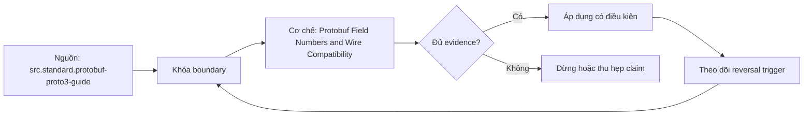

# Protobuf Field Numbers and Wire Compatibility

> [!abstract] Câu hỏi trung tâm
> Field numbers và wire types quyết định Protobuf compatibility thế nào, kể cả khi parse không báo lỗi?

## 1. Tag là identity trên wire

Binary key combines field number and wire type; field name absent. Rename in `.proto` preserves binary wire identity when number/type unchanged, nhưng generated API, JSON/TextFormat names và reflection users có thể break. Renumber equals delete plus add. Numbers 1-15 encode compactly; optimization không bao giờ biện minh renumber deployed fields.

## 2. Wire types không phải semantic types

VARINT, I32, I64 và LEN describe encoding families. Nhiều declared types share wire type, nên reused number có thể parse bytes under wrong semantic definition without error. Same wire type is not proof of safe change. Even documented wire-compatible numeric conversions may truncate or reinterpret values. Test boundary values and application invariants, not only parser return code.

## 3. Add delete reserve

Adding a new field number is binary wire-safe under guide rules, while application exhaustive switches/defaults may still break. Deleting requires reserving number; reserve name as protection for JSON/TextFormat paths. Never unreserve/reuse. Old reader treats new field unknown; new reader sees default presence semantics for missing old data. Proto2/proto3/editions presence behavior and generated language APIs must be pinned.

## 4. Unknown fields

Modern proto3 binary messages preserve unknown fields through parse and binary reserialization, but conversion to JSON, field-by-field copy, reflection filters or older/specific runtime paths may discard them. A relay compatibility test must execute the exact parse-transform-serialize path. Unknown preservation does not mean application understands or validates the field.

## 5. oneof enum map boundaries

Moving fields into existing oneof can alter presence and clear behavior. Adding enum values may be wire-safe yet break exhaustive source code or application policy. Maps encode entry messages; changing key/value semantics needs separate analysis. Required-like application validation is outside wire format. Compatibility report separates binary wire, generated source, JSON/TextFormat and semantic layers.

## 6. Reuse failure lab

v1 encodes retired field N using old definition; v2 reuses N under another compatible wire type. Decode through v2 and show wrong value, parse error or corruption depending pair. Include old→new, new→old and relay round-trip. Reserve N then prove compiler blocks reuse. Preserve raw bytes/Protoscope, schema hashes and runtime versions. Done when silent reinterpretation is traced to tag and semantic oracle catches it.

## 7. Ma trận kiểm chứng từng mệnh đề

Mỗi claim cần fixture, versioned contract, counterexample và oracle ở đúng tầng. Parse/decode success, registry acceptance hoặc feature name không tự chứng minh semantic correctness.

### 7.1. Protobuf change 1 phải kiểm binary wire, generated API, JSON/TextFormat, relay và semantic layers

**Mệnh đề cần kiểm.** Protobuf change 1 phải kiểm binary wire, generated API, JSON/TextFormat, relay và semantic layers.

**Protocol cho `wiki.serialization.protobuf-field-numbers-wire-compatibility`.** Khóa source/schema versions, producer-consumer path, configuration và canonical meaning. Chạy positive, boundary và negative fixtures; lưu raw bytes/files, hashes, logs, typed output và exact failing cell. Đổi một assumption rồi ghi reversal condition.

**Bằng chứng đạt cho `wiki.serialization.protobuf-field-numbers-wire-compatibility`.** Kết quả structural và semantic được báo riêng, có independent oracle, repetitions khi đo performance, reviewer và limitation. Lab chưa chạy chỉ được ghi protocol, không ghi expected behavior như observation.

### 7.2. Protobuf change 2 phải kiểm binary wire, generated API, JSON/TextFormat, relay và semantic layers

**Mệnh đề cần kiểm.** Protobuf change 2 phải kiểm binary wire, generated API, JSON/TextFormat, relay và semantic layers.

**Protocol cho `wiki.serialization.protobuf-field-numbers-wire-compatibility`.** Khóa source/schema versions, producer-consumer path, configuration và canonical meaning. Chạy positive, boundary và negative fixtures; lưu raw bytes/files, hashes, logs, typed output và exact failing cell. Đổi một assumption rồi ghi reversal condition.

**Bằng chứng đạt cho `wiki.serialization.protobuf-field-numbers-wire-compatibility`.** Kết quả structural và semantic được báo riêng, có independent oracle, repetitions khi đo performance, reviewer và limitation. Lab chưa chạy chỉ được ghi protocol, không ghi expected behavior như observation.

### 7.3. Protobuf change 3 phải kiểm binary wire, generated API, JSON/TextFormat, relay và semantic layers

**Mệnh đề cần kiểm.** Protobuf change 3 phải kiểm binary wire, generated API, JSON/TextFormat, relay và semantic layers.

**Protocol cho `wiki.serialization.protobuf-field-numbers-wire-compatibility`.** Khóa source/schema versions, producer-consumer path, configuration và canonical meaning. Chạy positive, boundary và negative fixtures; lưu raw bytes/files, hashes, logs, typed output và exact failing cell. Đổi một assumption rồi ghi reversal condition.

**Bằng chứng đạt cho `wiki.serialization.protobuf-field-numbers-wire-compatibility`.** Kết quả structural và semantic được báo riêng, có independent oracle, repetitions khi đo performance, reviewer và limitation. Lab chưa chạy chỉ được ghi protocol, không ghi expected behavior như observation.

### 7.4. Protobuf change 4 phải kiểm binary wire, generated API, JSON/TextFormat, relay và semantic layers

**Mệnh đề cần kiểm.** Protobuf change 4 phải kiểm binary wire, generated API, JSON/TextFormat, relay và semantic layers.

**Protocol cho `wiki.serialization.protobuf-field-numbers-wire-compatibility`.** Khóa source/schema versions, producer-consumer path, configuration và canonical meaning. Chạy positive, boundary và negative fixtures; lưu raw bytes/files, hashes, logs, typed output và exact failing cell. Đổi một assumption rồi ghi reversal condition.

**Bằng chứng đạt cho `wiki.serialization.protobuf-field-numbers-wire-compatibility`.** Kết quả structural và semantic được báo riêng, có independent oracle, repetitions khi đo performance, reviewer và limitation. Lab chưa chạy chỉ được ghi protocol, không ghi expected behavior như observation.

### 7.5. Protobuf change 5 phải kiểm binary wire, generated API, JSON/TextFormat, relay và semantic layers

**Mệnh đề cần kiểm.** Protobuf change 5 phải kiểm binary wire, generated API, JSON/TextFormat, relay và semantic layers.

**Protocol cho `wiki.serialization.protobuf-field-numbers-wire-compatibility`.** Khóa source/schema versions, producer-consumer path, configuration và canonical meaning. Chạy positive, boundary và negative fixtures; lưu raw bytes/files, hashes, logs, typed output và exact failing cell. Đổi một assumption rồi ghi reversal condition.

**Bằng chứng đạt cho `wiki.serialization.protobuf-field-numbers-wire-compatibility`.** Kết quả structural và semantic được báo riêng, có independent oracle, repetitions khi đo performance, reviewer và limitation. Lab chưa chạy chỉ được ghi protocol, không ghi expected behavior như observation.

### 7.6. Protobuf change 6 phải kiểm binary wire, generated API, JSON/TextFormat, relay và semantic layers

**Mệnh đề cần kiểm.** Protobuf change 6 phải kiểm binary wire, generated API, JSON/TextFormat, relay và semantic layers.

**Protocol cho `wiki.serialization.protobuf-field-numbers-wire-compatibility`.** Khóa source/schema versions, producer-consumer path, configuration và canonical meaning. Chạy positive, boundary và negative fixtures; lưu raw bytes/files, hashes, logs, typed output và exact failing cell. Đổi một assumption rồi ghi reversal condition.

**Bằng chứng đạt cho `wiki.serialization.protobuf-field-numbers-wire-compatibility`.** Kết quả structural và semantic được báo riêng, có independent oracle, repetitions khi đo performance, reviewer và limitation. Lab chưa chạy chỉ được ghi protocol, không ghi expected behavior như observation.

### 7.7. Protobuf change 7 phải kiểm binary wire, generated API, JSON/TextFormat, relay và semantic layers

**Mệnh đề cần kiểm.** Protobuf change 7 phải kiểm binary wire, generated API, JSON/TextFormat, relay và semantic layers.

**Protocol cho `wiki.serialization.protobuf-field-numbers-wire-compatibility`.** Khóa source/schema versions, producer-consumer path, configuration và canonical meaning. Chạy positive, boundary và negative fixtures; lưu raw bytes/files, hashes, logs, typed output và exact failing cell. Đổi một assumption rồi ghi reversal condition.

**Bằng chứng đạt cho `wiki.serialization.protobuf-field-numbers-wire-compatibility`.** Kết quả structural và semantic được báo riêng, có independent oracle, repetitions khi đo performance, reviewer và limitation. Lab chưa chạy chỉ được ghi protocol, không ghi expected behavior như observation.

### 7.8. Protobuf change 8 phải kiểm binary wire, generated API, JSON/TextFormat, relay và semantic layers

**Mệnh đề cần kiểm.** Protobuf change 8 phải kiểm binary wire, generated API, JSON/TextFormat, relay và semantic layers.

**Protocol cho `wiki.serialization.protobuf-field-numbers-wire-compatibility`.** Khóa source/schema versions, producer-consumer path, configuration và canonical meaning. Chạy positive, boundary và negative fixtures; lưu raw bytes/files, hashes, logs, typed output và exact failing cell. Đổi một assumption rồi ghi reversal condition.

**Bằng chứng đạt cho `wiki.serialization.protobuf-field-numbers-wire-compatibility`.** Kết quả structural và semantic được báo riêng, có independent oracle, repetitions khi đo performance, reviewer và limitation. Lab chưa chạy chỉ được ghi protocol, không ghi expected behavior như observation.

### 7.9. Protobuf change 9 phải kiểm binary wire, generated API, JSON/TextFormat, relay và semantic layers

**Mệnh đề cần kiểm.** Protobuf change 9 phải kiểm binary wire, generated API, JSON/TextFormat, relay và semantic layers.

**Protocol cho `wiki.serialization.protobuf-field-numbers-wire-compatibility`.** Khóa source/schema versions, producer-consumer path, configuration và canonical meaning. Chạy positive, boundary và negative fixtures; lưu raw bytes/files, hashes, logs, typed output và exact failing cell. Đổi một assumption rồi ghi reversal condition.

**Bằng chứng đạt cho `wiki.serialization.protobuf-field-numbers-wire-compatibility`.** Kết quả structural và semantic được báo riêng, có independent oracle, repetitions khi đo performance, reviewer và limitation. Lab chưa chạy chỉ được ghi protocol, không ghi expected behavior như observation.

### 7.10. Protobuf change 10 phải kiểm binary wire, generated API, JSON/TextFormat, relay và semantic layers

**Mệnh đề cần kiểm.** Protobuf change 10 phải kiểm binary wire, generated API, JSON/TextFormat, relay và semantic layers.

**Protocol cho `wiki.serialization.protobuf-field-numbers-wire-compatibility`.** Khóa source/schema versions, producer-consumer path, configuration và canonical meaning. Chạy positive, boundary và negative fixtures; lưu raw bytes/files, hashes, logs, typed output và exact failing cell. Đổi một assumption rồi ghi reversal condition.

**Bằng chứng đạt cho `wiki.serialization.protobuf-field-numbers-wire-compatibility`.** Kết quả structural và semantic được báo riêng, có independent oracle, repetitions khi đo performance, reviewer và limitation. Lab chưa chạy chỉ được ghi protocol, không ghi expected behavior như observation.

### 7.11. Protobuf change 11 phải kiểm binary wire, generated API, JSON/TextFormat, relay và semantic layers

**Mệnh đề cần kiểm.** Protobuf change 11 phải kiểm binary wire, generated API, JSON/TextFormat, relay và semantic layers.

**Protocol cho `wiki.serialization.protobuf-field-numbers-wire-compatibility`.** Khóa source/schema versions, producer-consumer path, configuration và canonical meaning. Chạy positive, boundary và negative fixtures; lưu raw bytes/files, hashes, logs, typed output và exact failing cell. Đổi một assumption rồi ghi reversal condition.

**Bằng chứng đạt cho `wiki.serialization.protobuf-field-numbers-wire-compatibility`.** Kết quả structural và semantic được báo riêng, có independent oracle, repetitions khi đo performance, reviewer và limitation. Lab chưa chạy chỉ được ghi protocol, không ghi expected behavior như observation.

### 7.12. Protobuf change 12 phải kiểm binary wire, generated API, JSON/TextFormat, relay và semantic layers

**Mệnh đề cần kiểm.** Protobuf change 12 phải kiểm binary wire, generated API, JSON/TextFormat, relay và semantic layers.

**Protocol cho `wiki.serialization.protobuf-field-numbers-wire-compatibility`.** Khóa source/schema versions, producer-consumer path, configuration và canonical meaning. Chạy positive, boundary và negative fixtures; lưu raw bytes/files, hashes, logs, typed output và exact failing cell. Đổi một assumption rồi ghi reversal condition.

**Bằng chứng đạt cho `wiki.serialization.protobuf-field-numbers-wire-compatibility`.** Kết quả structural và semantic được báo riêng, có independent oracle, repetitions khi đo performance, reviewer và limitation. Lab chưa chạy chỉ được ghi protocol, không ghi expected behavior như observation.

### 7.13. Protobuf change 13 phải kiểm binary wire, generated API, JSON/TextFormat, relay và semantic layers

**Mệnh đề cần kiểm.** Protobuf change 13 phải kiểm binary wire, generated API, JSON/TextFormat, relay và semantic layers.

**Protocol cho `wiki.serialization.protobuf-field-numbers-wire-compatibility`.** Khóa source/schema versions, producer-consumer path, configuration và canonical meaning. Chạy positive, boundary và negative fixtures; lưu raw bytes/files, hashes, logs, typed output và exact failing cell. Đổi một assumption rồi ghi reversal condition.

**Bằng chứng đạt cho `wiki.serialization.protobuf-field-numbers-wire-compatibility`.** Kết quả structural và semantic được báo riêng, có independent oracle, repetitions khi đo performance, reviewer và limitation. Lab chưa chạy chỉ được ghi protocol, không ghi expected behavior như observation.

### 7.14. Protobuf change 14 phải kiểm binary wire, generated API, JSON/TextFormat, relay và semantic layers

**Mệnh đề cần kiểm.** Protobuf change 14 phải kiểm binary wire, generated API, JSON/TextFormat, relay và semantic layers.

**Protocol cho `wiki.serialization.protobuf-field-numbers-wire-compatibility`.** Khóa source/schema versions, producer-consumer path, configuration và canonical meaning. Chạy positive, boundary và negative fixtures; lưu raw bytes/files, hashes, logs, typed output và exact failing cell. Đổi một assumption rồi ghi reversal condition.

**Bằng chứng đạt cho `wiki.serialization.protobuf-field-numbers-wire-compatibility`.** Kết quả structural và semantic được báo riêng, có independent oracle, repetitions khi đo performance, reviewer và limitation. Lab chưa chạy chỉ được ghi protocol, không ghi expected behavior như observation.

### 7.15. Protobuf change 15 phải kiểm binary wire, generated API, JSON/TextFormat, relay và semantic layers

**Mệnh đề cần kiểm.** Protobuf change 15 phải kiểm binary wire, generated API, JSON/TextFormat, relay và semantic layers.

**Protocol cho `wiki.serialization.protobuf-field-numbers-wire-compatibility`.** Khóa source/schema versions, producer-consumer path, configuration và canonical meaning. Chạy positive, boundary và negative fixtures; lưu raw bytes/files, hashes, logs, typed output và exact failing cell. Đổi một assumption rồi ghi reversal condition.

**Bằng chứng đạt cho `wiki.serialization.protobuf-field-numbers-wire-compatibility`.** Kết quả structural và semantic được báo riêng, có independent oracle, repetitions khi đo performance, reviewer và limitation. Lab chưa chạy chỉ được ghi protocol, không ghi expected behavior như observation.

## 8. Quy trình phản biện

1. Tách syntax/wire, structural compatibility, generated API và business semantics.
2. Ghi direction bằng writer-reader versions, không chỉ dùng nhãn backward/forward.
3. Khóa canonical meaning và negative fixtures trước implementation.
4. Giữ source bytes/schema fingerprints để tái hiện.
5. Mọi default, cache, inference hoặc registry policy đều là explicit configuration.
6. Viết rollout, rollback và reversal condition trước merge.

## 9. Câu hỏi tự kiểm tra

1. Identity nằm ở name, position, field number hay stable ID?
2. Parser biết điều gì và application phải biết điều gì?
3. Cell/version nào chưa được test?
4. Decode sạch có thể sai nghĩa ở đâu?
5. Intermediate system có làm mất thông tin không?
6. Evidence nào mới là protocol?

## 10. Giới hạn và điều chưa cho phép kết luận

- Chưa chạy benchmark engine hoặc compatibility matrix bằng libraries/registry thật.
- Specifications được kiểm ngày 2026-10-01; library, generated API và registry behavior cần pin version.
- Curriculum matrices là synthesis; không gán nguyên văn cho một source.
- Note giữ trạng thái `review` tới khi chủ dự án duyệt.

## Reference
1. [[SRC-PROTOBUF-PROTO3-GUIDE]]
2. [[SRC-PROTOBUF-WIRE-ENCODING]]

## Source coverage

| Source slice | Nội dung sử dụng | Trạng thái |
|---|---|---|
| [[SRC-PROTOBUF-PROTO3-GUIDE]] | Normative rule, architecture boundary hoặc decision evidence | Đã đọc locator; không suy ngoài phạm vi |
| [[SRC-PROTOBUF-WIRE-ENCODING]] | Normative rule, architecture boundary hoặc decision evidence | Đã đọc locator; không suy ngoài phạm vi |

## Key takeaways
- Structural success và semantic correctness là hai gates riêng.
- Writer-reader direction, version history và exact fixtures phải hiện trong evidence.
- Defaults, aliases, unknown fields và registry modes có scope cụ thể; không dùng như bảo đảm chung.
- Chưa chạy lab thì note là giáo trình/protocol, chưa phải production certification.

<!-- ATOMIC-EXECUTION-CAPSULE:START -->

## Execution capsule: kiểm chứng `wiki.serialization.protobuf-field-numbers-wire-compatibility`

> [!important] Phân loại mệnh đề
> Với `wiki.serialization.protobuf-field-numbers-wire-compatibility`, sơ đồ, ví dụ và artifact về **Protobuf Field Numbers and Wire Compatibility** là **synthesis để kiểm chứng**; chúng không phải trích dẫn hay case nguyên văn của nguồn.

### Sơ đồ cơ chế và điểm kiểm soát



Đọc sơ đồ `wiki.serialization.protobuf-field-numbers-wire-compatibility` từ trái sang phải: source chỉ cung cấp claim ban đầu cho **Protobuf Field Numbers and Wire Compatibility**; quyết định chỉ được đi tiếp sau khi boundary, evidence và điều kiện đảo quyết định đã hiện hữu.

### Ví dụ làm việc có thể bác bỏ

**Input.** Một đội cần trả lời: Field numbers và wire types quyết định Protobuf compatibility thế nào, kể cả khi parse không báo lỗi? cho một phạm vi nhỏ, có owner và deadline rõ.

**Decision.** Đội áp dụng **Protobuf Field Numbers and Wire Compatibility** trên control và variant chỉ khác một assumption; expected result và hard constraints được khóa trước khi chạy.

**Outcome.** Với `wiki.serialization.protobuf-field-numbers-wire-compatibility`, nếu observation vi phạm hard constraint hoặc oracle độc lập không xác nhận **Protobuf Field Numbers and Wire Compatibility**, đội thu hẹp claim hay đảo quyết định. Nếu đạt, kết luận vẫn kèm scope, version và review date; một lần thành công không được nâng thành quy luật phổ quát.

### Artifact thực thi tối thiểu

```sql
-- Verification harness for: Protobuf Field Numbers and Wire Compatibility
WITH evidence AS (
    SELECT 'wiki.serialization.protobuf-field-numbers-wire-compatibility' AS concept_id,
           'boundary_declared' AS check_name, 1 AS passed
    UNION ALL
    SELECT 'wiki.serialization.protobuf-field-numbers-wire-compatibility', 'independent_oracle', 1
    UNION ALL
    SELECT 'wiki.serialization.protobuf-field-numbers-wire-compatibility', 'reversal_trigger_recorded', 1
)
SELECT concept_id,
       MIN(passed) AS all_hard_checks_pass,
       COUNT(*) AS evidence_items
FROM evidence
GROUP BY concept_id
HAVING MIN(passed) = 1;
```

Artifact của `wiki.serialization.protobuf-field-numbers-wire-compatibility` buộc người dùng ghi boundary, oracle và reversal trigger cho **Protobuf Field Numbers and Wire Compatibility**. Các giá trị minh họa phải được thay bằng evidence thật trước khi dùng cho quyết định.

### Tự kiểm tra trước khi tái sử dụng

1. Bạn có thể trả lời `Field numbers và wire types quyết định Protobuf compatibility thế nào, kể cả khi parse không báo lỗi?` bằng một câu mà không kéo thêm concept thứ hai không?
2. Source locator nào đỡ cho claim, và phần nào chỉ là synthesis trong note?
3. Observation nào khiến bạn dừng, thu hẹp hoặc đảo quyết định?
4. Artifact nào cho phép một reviewer độc lập tái hiện kết quả?

<!-- ATOMIC-EXECUTION-CAPSULE:END -->
