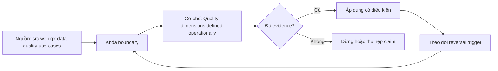

# Quality dimensions defined operationally

> [!abstract] Câu hỏi trung tâm
> Bảy chiều chất lượng được biến thành phép quan sát có grain, population và nguồn thẩm quyền như thế nào?

## 1. Completeness

Đầy đủ phải nói expected population, required fields và denominator; null rate không phát hiện record chưa từng đến. Đừng bắt đầu bằng tên công cụ. Hãy bắt đầu bằng đối tượng được bảo vệ, boundary quan sát được và hậu quả nếu kết luận sai. Trong bài `Quality dimensions defined operationally`, câu hỏi thực dụng là: Bảy chiều chất lượng được biến thành phép quan sát có grain, population và nguồn thẩm quyền như thế nào? Ta ghi rõ grain, population, time window, owner và hành động sau failure; nếu một trường chưa biết thì đánh dấu unknown thay vì lấp bằng mặc định. Bằng chứng tối thiểu gồm fixture có version, cấu hình hoặc rule đã resolve, raw observation, expected result và limitation. Phần này là curriculum synthesis dựa trên các nguồn đã định danh, không phải lời hứa rằng mọi adapter hay deployment đều có cùng hành vi.

## 2. Validity

Hợp lệ kiểm type, format, domain và range đã công bố nhưng một giá trị hợp lệ vẫn có thể sai ngoài đời. Điểm khó không nằm ở cú pháp mà ở identity và scope. Hai phép đo cùng tên vẫn có thể nói về hai population hoặc hai thời điểm khác nhau. Trong bài `Quality dimensions defined operationally`, câu hỏi thực dụng là: Bảy chiều chất lượng được biến thành phép quan sát có grain, population và nguồn thẩm quyền như thế nào? Ta ghi rõ grain, population, time window, owner và hành động sau failure; nếu một trường chưa biết thì đánh dấu unknown thay vì lấp bằng mặc định. Bằng chứng tối thiểu gồm fixture có version, cấu hình hoặc rule đã resolve, raw observation, expected result và limitation. Phần này là curriculum synthesis dựa trên các nguồn đã định danh, không phải lời hứa rằng mọi adapter hay deployment đều có cùng hành vi.

## 3. Uniqueness

Duy nhất phụ thuộc entity/event identity và scope thời gian; DISTINCT trên một cột không thay business key. Một dashboard xanh chỉ là tín hiệu. Muốn biến nó thành bằng chứng phải giữ input, phiên bản, rule, trạng thái trước-sau và cách tính độc lập. Trong bài `Quality dimensions defined operationally`, câu hỏi thực dụng là: Bảy chiều chất lượng được biến thành phép quan sát có grain, population và nguồn thẩm quyền như thế nào? Ta ghi rõ grain, population, time window, owner và hành động sau failure; nếu một trường chưa biết thì đánh dấu unknown thay vì lấp bằng mặc định. Bằng chứng tối thiểu gồm fixture có version, cấu hình hoặc rule đã resolve, raw observation, expected result và limitation. Phần này là curriculum synthesis dựa trên các nguồn đã định danh, không phải lời hứa rằng mọi adapter hay deployment đều có cùng hành vi.

## 4. Consistency and integrity

Nhất quán so representations; toàn vẹn kiểm quan hệ và state transition, cả hai cần authority và timing rõ. Thiết kế tốt phải chịu được counterexample. Hãy chủ động tạo case sát boundary, case thiếu dữ liệu và case replay thay vì chỉ chạy happy path. Trong bài `Quality dimensions defined operationally`, câu hỏi thực dụng là: Bảy chiều chất lượng được biến thành phép quan sát có grain, population và nguồn thẩm quyền như thế nào? Ta ghi rõ grain, population, time window, owner và hành động sau failure; nếu một trường chưa biết thì đánh dấu unknown thay vì lấp bằng mặc định. Bằng chứng tối thiểu gồm fixture có version, cấu hình hoặc rule đã resolve, raw observation, expected result và limitation. Phần này là curriculum synthesis dựa trên các nguồn đã định danh, không phải lời hứa rằng mọi adapter hay deployment đều có cùng hành vi.

## 5. Timeliness

Kịp thời gắn consumer deadline, event/arrival/publish time và late policy thay vì age chung chung. Chi phí vận hành thuộc contract. Một rule đúng nhưng quá đắt, quá ồn hoặc không có owner sẽ nhanh chóng bị tắt và mất tác dụng. Trong bài `Quality dimensions defined operationally`, câu hỏi thực dụng là: Bảy chiều chất lượng được biến thành phép quan sát có grain, population và nguồn thẩm quyền như thế nào? Ta ghi rõ grain, population, time window, owner và hành động sau failure; nếu một trường chưa biết thì đánh dấu unknown thay vì lấp bằng mặc định. Bằng chứng tối thiểu gồm fixture có version, cấu hình hoặc rule đã resolve, raw observation, expected result và limitation. Phần này là curriculum synthesis dựa trên các nguồn đã định danh, không phải lời hứa rằng mọi adapter hay deployment đều có cùng hành vi.

## 6. Accuracy boundary

Chính xác cần ground truth hoặc nguồn có thẩm quyền; nếu chỉ có proxy phải ghi proxy và giới hạn nhận thức. Kết luận cần có điều kiện đảo chiều. Khi volume, latency, nguồn thẩm quyền hoặc topology đổi, quyết định cũ phải được xem xét lại bằng cùng một oracle. Trong bài `Quality dimensions defined operationally`, câu hỏi thực dụng là: Bảy chiều chất lượng được biến thành phép quan sát có grain, population và nguồn thẩm quyền như thế nào? Ta ghi rõ grain, population, time window, owner và hành động sau failure; nếu một trường chưa biết thì đánh dấu unknown thay vì lấp bằng mặc định. Bằng chứng tối thiểu gồm fixture có version, cấu hình hoặc rule đã resolve, raw observation, expected result và limitation. Phần này là curriculum synthesis dựa trên các nguồn đã định danh, không phải lời hứa rằng mọi adapter hay deployment đều có cùng hành vi.

## 7. Ma trận kiểm chứng từng mệnh đề

Với `wiki.data-quality.dimensions-operational`, command thành công không tự chứng minh dữ liệu đúng. Protocol riêng của bài là: Dựng fixture có run/data identity rõ, tiêm một failure tại boundary quan trọng và đối soát state bằng oracle độc lập. Mỗi probe dưới đây phải nối input boundary với failure signal và oracle có thể phản bác kết luận.

### 7.1. Quality dimensions defined operationally: kiểm `Completeness` bằng case 1, cụ thể đầy đủ phải nói expected population, required fields và denominator; null rate không phát hiện record chưa từng đến

**Mệnh đề cần kiểm.** Quality dimensions defined operationally: kiểm `Completeness` bằng case 1, cụ thể đầy đủ phải nói expected population, required fields và denominator; null rate không phát hiện record chưa từng đến.

**Thiết kế phép thử cho `wiki.data-quality.dimensions-operational`.** Trong ngữ cảnh `wiki.data-quality.dimensions-operational`, tạo positive control và negative control chỉ khác đúng một điều kiện. Khóa input snapshot, phiên bản và owner của rule; chạy đúng population được bài `Quality dimensions defined operationally` công bố.

**Bằng chứng cần giữ.** Đối với probe 1 của `Quality dimensions defined operationally`, giữ fixture, raw failing rows và lệnh tái hiện. Nếu chưa chạy lab, ghi expected evidence và giữ trạng thái review; không biến protocol thành observation.

### 7.2. Quality dimensions defined operationally: kiểm `Validity` bằng case 2, cụ thể hợp lệ kiểm type, format, domain và range đã công bố nhưng một giá trị hợp lệ vẫn có thể sai ngoài đời

**Mệnh đề cần kiểm.** Quality dimensions defined operationally: kiểm `Validity` bằng case 2, cụ thể hợp lệ kiểm type, format, domain và range đã công bố nhưng một giá trị hợp lệ vẫn có thể sai ngoài đời.

**Thiết kế phép thử cho `wiki.data-quality.dimensions-operational`.** Trong ngữ cảnh `wiki.data-quality.dimensions-operational`, đổi grain nhưng giữ tổng số dòng để lộ phép đo sai cấp. Khóa input snapshot, phiên bản và owner của rule; chạy đúng population được bài `Quality dimensions defined operationally` công bố.

**Bằng chứng cần giữ.** Đối với probe 2 của `Quality dimensions defined operationally`, báo numerator, denominator và key set ở cả hai grain. Nếu chưa chạy lab, ghi expected evidence và giữ trạng thái review; không biến protocol thành observation.

### 7.3. Quality dimensions defined operationally: kiểm `Uniqueness` bằng case 3, cụ thể duy nhất phụ thuộc entity/event identity và scope thời gian; distinct trên một cột không thay business key

**Mệnh đề cần kiểm.** Quality dimensions defined operationally: kiểm `Uniqueness` bằng case 3, cụ thể duy nhất phụ thuộc entity/event identity và scope thời gian; distinct trên một cột không thay business key.

**Thiết kế phép thử cho `wiki.data-quality.dimensions-operational`.** Trong ngữ cảnh `wiki.data-quality.dimensions-operational`, đưa một giá trị tới đúng boundary và một giá trị vượt boundary. Khóa input snapshot, phiên bản và owner của rule; chạy đúng population được bài `Quality dimensions defined operationally` công bố.

**Bằng chứng cần giữ.** Đối với probe 3 của `Quality dimensions defined operationally`, lưu hai observed values cùng rule đã resolve. Nếu chưa chạy lab, ghi expected evidence và giữ trạng thái review; không biến protocol thành observation.

### 7.4. Quality dimensions defined operationally: kiểm `Consistency and integrity` bằng case 4, cụ thể nhất quán so representations; toàn vẹn kiểm quan hệ và state transition, cả hai cần authority và timing rõ

**Mệnh đề cần kiểm.** Quality dimensions defined operationally: kiểm `Consistency and integrity` bằng case 4, cụ thể nhất quán so representations; toàn vẹn kiểm quan hệ và state transition, cả hai cần authority và timing rõ.

**Thiết kế phép thử cho `wiki.data-quality.dimensions-operational`.** Trong ngữ cảnh `wiki.data-quality.dimensions-operational`, kill tiến trình ngay trước rồi ngay sau durable side effect. Khóa input snapshot, phiên bản và owner của rule; chạy đúng population được bài `Quality dimensions defined operationally` công bố.

**Bằng chứng cần giữ.** Đối với probe 4 của `Quality dimensions defined operationally`, lưu checkpoint, external ledger và trạng thái sau restart. Nếu chưa chạy lab, ghi expected evidence và giữ trạng thái review; không biến protocol thành observation.

### 7.5. Quality dimensions defined operationally: kiểm `Timeliness` bằng case 5, cụ thể kịp thời gắn consumer deadline, event/arrival/publish time và late policy thay vì age chung chung

**Mệnh đề cần kiểm.** Quality dimensions defined operationally: kiểm `Timeliness` bằng case 5, cụ thể kịp thời gắn consumer deadline, event/arrival/publish time và late policy thay vì age chung chung.

**Thiết kế phép thử cho `wiki.data-quality.dimensions-operational`.** Trong ngữ cảnh `wiki.data-quality.dimensions-operational`, đảo thứ tự input và concurrency nhưng giữ logical population. Khóa input snapshot, phiên bản và owner của rule; chạy đúng population được bài `Quality dimensions defined operationally` công bố.

**Bằng chứng cần giữ.** Đối với probe 5 của `Quality dimensions defined operationally`, so canonical hash và business totals giữa các thứ tự. Nếu chưa chạy lab, ghi expected evidence và giữ trạng thái review; không biến protocol thành observation.

### 7.6. Quality dimensions defined operationally: kiểm `Accuracy boundary` bằng case 6, cụ thể chính xác cần ground truth hoặc nguồn có thẩm quyền; nếu chỉ có proxy phải ghi proxy và giới hạn nhận thức

**Mệnh đề cần kiểm.** Quality dimensions defined operationally: kiểm `Accuracy boundary` bằng case 6, cụ thể chính xác cần ground truth hoặc nguồn có thẩm quyền; nếu chỉ có proxy phải ghi proxy và giới hạn nhận thức.

**Thiết kế phép thử cho `wiki.data-quality.dimensions-operational`.** Trong ngữ cảnh `wiki.data-quality.dimensions-operational`, replay cùng identity với payload giống rồi payload xung đột. Khóa input snapshot, phiên bản và owner của rule; chạy đúng population được bài `Quality dimensions defined operationally` công bố.

**Bằng chứng cần giữ.** Đối với probe 6 của `Quality dimensions defined operationally`, tách duplicate replay khỏi identity collision bằng reason code. Nếu chưa chạy lab, ghi expected evidence và giữ trạng thái review; không biến protocol thành observation.

### 7.7. Quality dimensions defined operationally: kiểm `Completeness` bằng case 7, cụ thể đầy đủ phải nói expected population, required fields và denominator; null rate không phát hiện record chưa từng đến

**Mệnh đề cần kiểm.** Quality dimensions defined operationally: kiểm `Completeness` bằng case 7, cụ thể đầy đủ phải nói expected population, required fields và denominator; null rate không phát hiện record chưa từng đến.

**Thiết kế phép thử cho `wiki.data-quality.dimensions-operational`.** Trong ngữ cảnh `wiki.data-quality.dimensions-operational`, thêm record tới trễ trong horizon và ngoài horizon. Khóa input snapshot, phiên bản và owner của rule; chạy đúng population được bài `Quality dimensions defined operationally` công bố.

**Bằng chứng cần giữ.** Đối với probe 7 của `Quality dimensions defined operationally`, báo accepted-late, rejected-late và oldest outstanding timestamp. Nếu chưa chạy lab, ghi expected evidence và giữ trạng thái review; không biến protocol thành observation.

### 7.8. Quality dimensions defined operationally: kiểm `Validity` bằng case 8, cụ thể hợp lệ kiểm type, format, domain và range đã công bố nhưng một giá trị hợp lệ vẫn có thể sai ngoài đời

**Mệnh đề cần kiểm.** Quality dimensions defined operationally: kiểm `Validity` bằng case 8, cụ thể hợp lệ kiểm type, format, domain và range đã công bố nhưng một giá trị hợp lệ vẫn có thể sai ngoài đời.

**Thiết kế phép thử cho `wiki.data-quality.dimensions-operational`.** Trong ngữ cảnh `wiki.data-quality.dimensions-operational`, đổi schema theo một cách tương thích rồi một cách phá vỡ semantics. Khóa input snapshot, phiên bản và owner của rule; chạy đúng population được bài `Quality dimensions defined operationally` công bố.

**Bằng chứng cần giữ.** Đối với probe 8 của `Quality dimensions defined operationally`, giữ schema diff, classification và consumer-visible result. Nếu chưa chạy lab, ghi expected evidence và giữ trạng thái review; không biến protocol thành observation.

### 7.9. Quality dimensions defined operationally: kiểm `Uniqueness` bằng case 9, cụ thể duy nhất phụ thuộc entity/event identity và scope thời gian; distinct trên một cột không thay business key

**Mệnh đề cần kiểm.** Quality dimensions defined operationally: kiểm `Uniqueness` bằng case 9, cụ thể duy nhất phụ thuộc entity/event identity và scope thời gian; distinct trên một cột không thay business key.

**Thiết kế phép thử cho `wiki.data-quality.dimensions-operational`.** Trong ngữ cảnh `wiki.data-quality.dimensions-operational`, tạo missing và duplicate bù nhau để count tổng không đổi. Khóa input snapshot, phiên bản và owner của rule; chạy đúng population được bài `Quality dimensions defined operationally` công bố.

**Bằng chứng cần giữ.** Đối với probe 9 của `Quality dimensions defined operationally`, so key multiset và typed hashes thay vì chỉ row count. Nếu chưa chạy lab, ghi expected evidence và giữ trạng thái review; không biến protocol thành observation.

### 7.10. Quality dimensions defined operationally: kiểm `Consistency and integrity` bằng case 10, cụ thể nhất quán so representations; toàn vẹn kiểm quan hệ và state transition, cả hai cần authority và timing rõ

**Mệnh đề cần kiểm.** Quality dimensions defined operationally: kiểm `Consistency and integrity` bằng case 10, cụ thể nhất quán so representations; toàn vẹn kiểm quan hệ và state transition, cả hai cần authority và timing rõ.

**Thiết kế phép thử cho `wiki.data-quality.dimensions-operational`.** Trong ngữ cảnh `wiki.data-quality.dimensions-operational`, cho reviewer tái hiện chỉ từ evidence package. Khóa input snapshot, phiên bản và owner của rule; chạy đúng population được bài `Quality dimensions defined operationally` công bố.

**Bằng chứng cần giữ.** Đối với probe 10 của `Quality dimensions defined operationally`, package phải đủ để người khác dựng lại decision và limitation. Nếu chưa chạy lab, ghi expected evidence và giữ trạng thái review; không biến protocol thành observation.

### 7.11. Quality dimensions defined operationally: kiểm `Timeliness` bằng case 11, cụ thể kịp thời gắn consumer deadline, event/arrival/publish time và late policy thay vì age chung chung

**Mệnh đề cần kiểm.** Quality dimensions defined operationally: kiểm `Timeliness` bằng case 11, cụ thể kịp thời gắn consumer deadline, event/arrival/publish time và late policy thay vì age chung chung.

**Thiết kế phép thử cho `wiki.data-quality.dimensions-operational`.** Trong ngữ cảnh `wiki.data-quality.dimensions-operational`, so với oracle độc lập không dùng chung query hoặc parser. Khóa input snapshot, phiên bản và owner của rule; chạy đúng population được bài `Quality dimensions defined operationally` công bố.

**Bằng chứng cần giữ.** Đối với probe 11 của `Quality dimensions defined operationally`, independent result phải khớp ở grain đã công bố. Nếu chưa chạy lab, ghi expected evidence và giữ trạng thái review; không biến protocol thành observation.

### 7.12. Quality dimensions defined operationally: kiểm `Accuracy boundary` bằng case 12, cụ thể chính xác cần ground truth hoặc nguồn có thẩm quyền; nếu chỉ có proxy phải ghi proxy và giới hạn nhận thức

**Mệnh đề cần kiểm.** Quality dimensions defined operationally: kiểm `Accuracy boundary` bằng case 12, cụ thể chính xác cần ground truth hoặc nguồn có thẩm quyền; nếu chỉ có proxy phải ghi proxy và giới hạn nhận thức.

**Thiết kế phép thử cho `wiki.data-quality.dimensions-operational`.** Trong ngữ cảnh `wiki.data-quality.dimensions-operational`, chạy scope hẹp và population đầy đủ rồi công bố phần bị loại. Khóa input snapshot, phiên bản và owner của rule; chạy đúng population được bài `Quality dimensions defined operationally` công bố.

**Bằng chứng cần giữ.** Đối với probe 12 của `Quality dimensions defined operationally`, coverage phải nêu rõ excluded nodes, partitions hoặc incidents. Nếu chưa chạy lab, ghi expected evidence và giữ trạng thái review; không biến protocol thành observation.

### 7.13. Quality dimensions defined operationally: kiểm `Completeness` bằng case 13, cụ thể đầy đủ phải nói expected population, required fields và denominator; null rate không phát hiện record chưa từng đến

**Mệnh đề cần kiểm.** Quality dimensions defined operationally: kiểm `Completeness` bằng case 13, cụ thể đầy đủ phải nói expected population, required fields và denominator; null rate không phát hiện record chưa từng đến.

**Thiết kế phép thử cho `wiki.data-quality.dimensions-operational`.** Trong ngữ cảnh `wiki.data-quality.dimensions-operational`, thử timezone, precision hoặc partition ở hai phía của ranh giới. Khóa input snapshot, phiên bản và owner của rule; chạy đúng population được bài `Quality dimensions defined operationally` công bố.

**Bằng chứng cần giữ.** Đối với probe 13 của `Quality dimensions defined operationally`, UTC/local interval và rounding policy phải hiện trong output. Nếu chưa chạy lab, ghi expected evidence và giữ trạng thái review; không biến protocol thành observation.

### 7.14. Quality dimensions defined operationally: kiểm `Validity` bằng case 14, cụ thể hợp lệ kiểm type, format, domain và range đã công bố nhưng một giá trị hợp lệ vẫn có thể sai ngoài đời

**Mệnh đề cần kiểm.** Quality dimensions defined operationally: kiểm `Validity` bằng case 14, cụ thể hợp lệ kiểm type, format, domain và range đã công bố nhưng một giá trị hợp lệ vẫn có thể sai ngoài đời.

**Thiết kế phép thử cho `wiki.data-quality.dimensions-operational`.** Trong ngữ cảnh `wiki.data-quality.dimensions-operational`, đổi constraint đủ lớn để quyết định phải đảo. Khóa input snapshot, phiên bản và owner của rule; chạy đúng population được bài `Quality dimensions defined operationally` công bố.

**Bằng chứng cần giữ.** Đối với probe 14 của `Quality dimensions defined operationally`, ADR phải lưu changed constraint và reversal threshold. Nếu chưa chạy lab, ghi expected evidence và giữ trạng thái review; không biến protocol thành observation.

### 7.15. Quality dimensions defined operationally: kiểm `Uniqueness` bằng case 15, cụ thể duy nhất phụ thuộc entity/event identity và scope thời gian; distinct trên một cột không thay business key

**Mệnh đề cần kiểm.** Quality dimensions defined operationally: kiểm `Uniqueness` bằng case 15, cụ thể duy nhất phụ thuộc entity/event identity và scope thời gian; distinct trên một cột không thay business key.

**Thiết kế phép thử cho `wiki.data-quality.dimensions-operational`.** Trong ngữ cảnh `wiki.data-quality.dimensions-operational`, chạy lại từ môi trường sạch với versions và seed đã khóa. Khóa input snapshot, phiên bản và owner của rule; chạy đúng population được bài `Quality dimensions defined operationally` công bố.

**Bằng chứng cần giữ.** Đối với probe 15 của `Quality dimensions defined operationally`, canonical result phải ổn định hoặc mọi nondeterminism phải được giải thích. Nếu chưa chạy lab, ghi expected evidence và giữ trạng thái review; không biến protocol thành observation.

## 8. Quy trình phản biện

1. Viết consumer-visible invariant cho `Quality dimensions defined operationally` trước khi chọn query hoặc tool.
2. Khóa grain, identity, population, time window và authoritative source.
3. Phân biệt declared configuration, executed state và published state.
4. Chạy negative control, replay hoặc changed-assumption case phù hợp.
5. Đối soát bằng oracle độc lập; công bố coverage và phần không quan sát được.
6. Gắn owner, hành động, reversal trigger và hạn review cho kết luận.

## 9. Câu hỏi tự kiểm tra

1. `Quality dimensions defined operationally: kiểm `Completeness` bằng case 1, cụ thể đầy đủ phải nói expected population, required fields và denominator; null rate không phát hiện record chưa từng đến` thất bại đầu tiên ở boundary nào?
2. Artifact nào mạnh nhất để trả lời `Quality dimensions defined operationally: kiểm `Uniqueness` bằng case 3, cụ thể duy nhất phụ thuộc entity/event identity và scope thời gian; distinct trên một cột không thay business key`?
3. Counterexample nhỏ nhất cho `Quality dimensions defined operationally: kiểm `Accuracy boundary` bằng case 6, cụ thể chính xác cần ground truth hoặc nguồn có thẩm quyền; nếu chỉ có proxy phải ghi proxy và giới hạn nhận thức` gồm những state nào?
4. `Quality dimensions defined operationally: kiểm `Uniqueness` bằng case 9, cụ thể duy nhất phụ thuộc entity/event identity và scope thời gian; distinct trên một cột không thay business key` có thể xanh giả ra sao?
5. Constraint nào khiến quyết định ở `Quality dimensions defined operationally: kiểm `Validity` bằng case 14, cụ thể hợp lệ kiểm type, format, domain và range đã công bố nhưng một giá trị hợp lệ vẫn có thể sai ngoài đời` phải đảo?
6. Phần nào của `Quality dimensions defined operationally: kiểm `Uniqueness` bằng case 15, cụ thể duy nhất phụ thuộc entity/event identity và scope thời gian; distinct trên một cột không thay business key` mới là protocol, chưa phải observation?

## 10. Giới hạn và điều chưa cho phép kết luận

- Lab của `Quality dimensions defined operationally` chưa chạy trên hệ thống production; nội dung là giáo trình và expected evidence.
- Hành vi phụ thuộc phiên bản, connector, scheduler, warehouse và catalog configuration phải được kiểm lại.
- Các ma trận, ladder và threshold do giáo trình tổng hợp không được gán nguyên văn cho vendor.
- Note giữ trạng thái `review` cho tới khi owner duyệt semantics và learner artifact.

## Reference
1. [[SRC-GX-DATA-QUALITY-USE-CASES]]

## Source coverage

| Source slice | Nội dung sử dụng | Trạng thái |
|---|---|---|
| [[SRC-GX-DATA-QUALITY-USE-CASES]] | Contract hoặc cơ chế liên quan trực tiếp tới `Quality dimensions defined operationally` | Đã đọc locator; cần pin version khi chạy lab |

## Key takeaways
- Quality dimension chỉ hữu ích khi biến thành phép đo có grain, denominator và authority.
- Với `wiki.data-quality.dimensions-operational`, quality của kết luận phụ thuộc identity, coverage và oracle chứ không phụ thuộc màu dashboard.
- Câu hỏi `Bảy chiều chất lượng được biến thành phép quan sát có grain, population và nguồn thẩm quyền như thế nào?` chỉ được trả lời trong scope và version đã ghi.
- Các source IDs `src.web.gx-data-quality-use-cases` đặt ranh giới cho source fact; phần còn lại là synthesis có nhãn.
- Trước khi lab chạy, đây là note đã kiểm cấu trúc và provenance, chưa phải chứng nhận production.

<!-- ATOMIC-EXECUTION-CAPSULE:START -->

## Execution capsule: kiểm chứng `wiki.data-quality.dimensions-operational`

> [!important] Phân loại mệnh đề
> Với `wiki.data-quality.dimensions-operational`, sơ đồ, ví dụ và artifact về **Quality dimensions defined operationally** là **synthesis để kiểm chứng**; chúng không phải trích dẫn hay case nguyên văn của nguồn.

### Sơ đồ cơ chế và điểm kiểm soát



Đọc sơ đồ `wiki.data-quality.dimensions-operational` từ trái sang phải: source chỉ cung cấp claim ban đầu cho **Quality dimensions defined operationally**; quyết định chỉ được đi tiếp sau khi boundary, evidence và điều kiện đảo quyết định đã hiện hữu.

### Artifact thực thi tối thiểu

```sql
-- Verification harness for: Quality dimensions defined operationally
WITH evidence AS (
    SELECT 'wiki.data-quality.dimensions-operational' AS concept_id,
           'boundary_declared' AS check_name, 1 AS passed
    UNION ALL
    SELECT 'wiki.data-quality.dimensions-operational', 'independent_oracle', 1
    UNION ALL
    SELECT 'wiki.data-quality.dimensions-operational', 'reversal_trigger_recorded', 1
)
SELECT concept_id,
       MIN(passed) AS all_hard_checks_pass,
       COUNT(*) AS evidence_items
FROM evidence
GROUP BY concept_id
HAVING MIN(passed) = 1;
```

Artifact của `wiki.data-quality.dimensions-operational` buộc người dùng ghi boundary, oracle và reversal trigger cho **Quality dimensions defined operationally**. Các giá trị minh họa phải được thay bằng evidence thật trước khi dùng cho quyết định.

### Tự kiểm tra trước khi tái sử dụng

1. Bạn có thể trả lời `Bảy chiều chất lượng được biến thành phép quan sát có grain, population và nguồn thẩm quyền như thế nào?` bằng một câu mà không kéo thêm concept thứ hai không?
2. Source locator nào đỡ cho claim, và phần nào chỉ là synthesis trong note?
3. Observation nào khiến bạn dừng, thu hẹp hoặc đảo quyết định?
4. Artifact nào cho phép một reviewer độc lập tái hiện kết quả?

<!-- ATOMIC-EXECUTION-CAPSULE:END -->
