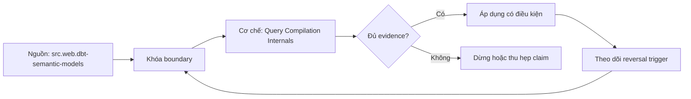

# Query Compilation Internals

> [!abstract] Câu hỏi trung tâm
> Một semantic query được hạ từ yêu cầu metric-dimension thành SQL qua những bước nào, và làm sao xác định đúng bước gây sai số hoặc chi phí?

## 1. Compiler nhận một câu hỏi có kiểu

Đầu vào không nên được xem là chuỗi tên metric và dimension. Nó là yêu cầu có metric versions, requested grain, filters, time range, ordering, limit, consumer context và security context. Compiler phải phân giải tên thành stable identifiers, kiểm compatibility, mở rộng dependencies của ratio/derived/cumulative metrics và đóng băng semantic manifest version. Nếu resolution chọn nhầm version hoặc dimension role, mọi bước sau có thể hợp lệ về cú pháp nhưng trả lời câu hỏi khác. Vì vậy trace bắt đầu từ canonical request, không bắt đầu từ SQL cuối.

## 2. Từ dependency graph đến logical dataflow

Sau resolution, planner dựng directed acyclic graph cho metric dependencies: base expressions, intrinsic filters, numerator/denominator, time spine và derived operations. Chu trình ở graph này là lỗi vì không thể xác định thứ tự tính. Entity relationship graph lại có thể chứa cycle hợp lệ; vấn đề là một request có nhiều đường mang nghĩa khác nhau. Planner phải chọn allowed role-qualified path hoặc reject ambiguity. Hai loại graph không được dùng chung quy tắc không có chu trình.

## 3. Chọn source, path và common grain

Planner tìm semantic models chứa base facts, xác định join keys/cardinality và tính common grain thấp nhất đủ trả requested dimensions. Mỗi source subplan phải giữ population, intrinsic filters, event-time semantics và base grain. Khi hai facts cùng tham gia, aggregate-before-join đưa mỗi fact về common grain rồi mới nối để tránh tích Descartes theo key. Cách này chỉ đúng nếu common grain bảo toàn dimensions và operators cần thiết; pre-aggregate sớm có thể làm mất distinct entities, percentile state hoặc SCD time validity.

## 4. Hạ plan thành SQL

Logical nodes được hạ thành scans, filters, projections, joins, grouped aggregates, windows và final projection theo dialect. CTE boundaries giúp đọc nhưng không đảm bảo materialization. Predicate pushdown, join reordering và expression simplification phải bảo toàn outer-join, window và time-boundary semantics. Generated SQL là một serialization của plan; warehouse optimizer còn biến đổi nó thành physical plan. Vì vậy cần lưu cả semantic/dataflow plan, SQL và warehouse execution plan thay vì gọi cả ba là kế hoạch.

## 5. Ba lớp nguyên nhân của kết quả lạ

Lỗi contract/config gồm sai population, grain, entity role, aggregation hoặc time policy. Lỗi compiler là plan không tuân declaration đúng. Lỗi warehouse/runtime gồm data drift, RLS context, timezone/session setting hoặc optimizer/runtime defect. Chẩn đoán bằng earliest-divergence: so canonical request, resolved nodes, selected path, per-source aggregates và final aggregation với independent oracle. Không viết SQL tay để né semantic layer trước khi biết divergence; workaround đó che lỗi và làm hai nguồn sự thật.

## 6. Tối ưu mà không đổi nghĩa

Đo cold/warm p50/p95, bytes scanned, rows after each stage, spill/shuffle và cost trước sửa. Ba pattern thường đắt là quét lặp cùng fact cho nhiều metric, join ở grain quá chi tiết rồi mới gộp, và time spine/window rộng hơn request. Can thiệp có thể hợp nhất scans, push safe filters, chỉnh path/cardinality, tạo pre-aggregation hoặc saved query. Mọi phương án phải chạy semantic parity trên cùng fixture; nhanh hơn nhưng đổi population, freshness hoặc metric version là thất bại.

## 7. Lab ba tình huống có hồ sơ bằng chứng

Case một chọn nhầm role-playing path; case hai gộp ratio/balance sai; case ba chậm vì scan và join ở grain quá thấp. Với mỗi case, ghi canonical request, manifest hash, dataflow stages, generated SQL hash, oracle và earliest divergent node. Case hiệu năng lưu trước-sau trên cùng warehouse size/cache state. Kết luận chỉ đạt khi tìm đúng nguyên nhân ít nhất hai case và case chậm cải thiện có số đo mà output cùng contract version không đổi.

## 8. Ma trận kiểm chứng từng mệnh đề

Mọi mệnh đề dưới đây cần fixture, invariant, independent oracle và output lưu được. Compile thành công hoặc con số nhìn hợp lý không đủ làm bằng chứng.

### 8.1. canonical request phải mang metric version và security context

**Mệnh đề cần kiểm.** canonical request phải mang metric version và security context.

**Cách kiểm.** Dựng trace từ canonical request qua resolved nodes, selected paths, per-source aggregates, SQL và physical plan. Inject wrong path, wrong aggregation và one slow-plan defect; so earliest divergence với independent oracle và đo before/after. Với mệnh đề này, ghi data shape gây lỗi, expected result và failure signal. Không dùng generated query làm oracle cho chính nó.

**Bằng chứng đạt cho `wiki.semantic-layer.query-compilation-internals`.** Lưu contract/graph/config version, seed snapshot, command/SQL, raw output, row/multiplicity ledger và semantic diff. Nếu chưa chạy tool/lab, trạng thái chỉ là test protocol.

### 8.2. metric dependency graph phải acyclic

**Mệnh đề cần kiểm.** metric dependency graph phải acyclic.

**Cách kiểm.** Dựng trace từ canonical request qua resolved nodes, selected paths, per-source aggregates, SQL và physical plan. Inject wrong path, wrong aggregation và one slow-plan defect; so earliest divergence với independent oracle và đo before/after. Với mệnh đề này, ghi data shape gây lỗi, expected result và failure signal. Không dùng generated query làm oracle cho chính nó.

**Bằng chứng đạt cho `wiki.semantic-layer.query-compilation-internals`.** Lưu contract/graph/config version, seed snapshot, command/SQL, raw output, row/multiplicity ledger và semantic diff. Nếu chưa chạy tool/lab, trạng thái chỉ là test protocol.

### 8.3. entity graph cycle không tự động là lỗi

**Mệnh đề cần kiểm.** entity graph cycle không tự động là lỗi.

**Cách kiểm.** Dựng trace từ canonical request qua resolved nodes, selected paths, per-source aggregates, SQL và physical plan. Inject wrong path, wrong aggregation và one slow-plan defect; so earliest divergence với independent oracle và đo before/after. Với mệnh đề này, ghi data shape gây lỗi, expected result và failure signal. Không dùng generated query làm oracle cho chính nó.

**Bằng chứng đạt cho `wiki.semantic-layer.query-compilation-internals`.** Lưu contract/graph/config version, seed snapshot, command/SQL, raw output, row/multiplicity ledger và semantic diff. Nếu chưa chạy tool/lab, trạng thái chỉ là test protocol.

### 8.4. path ambiguity phải reject hoặc role-qualify

**Mệnh đề cần kiểm.** path ambiguity phải reject hoặc role-qualify.

**Cách kiểm.** Dựng trace từ canonical request qua resolved nodes, selected paths, per-source aggregates, SQL và physical plan. Inject wrong path, wrong aggregation và one slow-plan defect; so earliest divergence với independent oracle và đo before/after. Với mệnh đề này, ghi data shape gây lỗi, expected result và failure signal. Không dùng generated query làm oracle cho chính nó.

**Bằng chứng đạt cho `wiki.semantic-layer.query-compilation-internals`.** Lưu contract/graph/config version, seed snapshot, command/SQL, raw output, row/multiplicity ledger và semantic diff. Nếu chưa chạy tool/lab, trạng thái chỉ là test protocol.

### 8.5. common grain phải bảo toàn requested semantics

**Mệnh đề cần kiểm.** common grain phải bảo toàn requested semantics.

**Cách kiểm.** Dựng trace từ canonical request qua resolved nodes, selected paths, per-source aggregates, SQL và physical plan. Inject wrong path, wrong aggregation và one slow-plan defect; so earliest divergence với independent oracle và đo before/after. Với mệnh đề này, ghi data shape gây lỗi, expected result và failure signal. Không dùng generated query làm oracle cho chính nó.

**Bằng chứng đạt cho `wiki.semantic-layer.query-compilation-internals`.** Lưu contract/graph/config version, seed snapshot, command/SQL, raw output, row/multiplicity ledger và semantic diff. Nếu chưa chạy tool/lab, trạng thái chỉ là test protocol.

### 8.6. aggregate-before-join tránh chasm khi đủ điều kiện

**Mệnh đề cần kiểm.** aggregate-before-join tránh chasm khi đủ điều kiện.

**Cách kiểm.** Dựng trace từ canonical request qua resolved nodes, selected paths, per-source aggregates, SQL và physical plan. Inject wrong path, wrong aggregation và one slow-plan defect; so earliest divergence với independent oracle và đo before/after. Với mệnh đề này, ghi data shape gây lỗi, expected result và failure signal. Không dùng generated query làm oracle cho chính nó.

**Bằng chứng đạt cho `wiki.semantic-layer.query-compilation-internals`.** Lưu contract/graph/config version, seed snapshot, command/SQL, raw output, row/multiplicity ledger và semantic diff. Nếu chưa chạy tool/lab, trạng thái chỉ là test protocol.

### 8.7. preaggregation có thể làm mất distinct state

**Mệnh đề cần kiểm.** preaggregation có thể làm mất distinct state.

**Cách kiểm.** Dựng trace từ canonical request qua resolved nodes, selected paths, per-source aggregates, SQL và physical plan. Inject wrong path, wrong aggregation và one slow-plan defect; so earliest divergence với independent oracle và đo before/after. Với mệnh đề này, ghi data shape gây lỗi, expected result và failure signal. Không dùng generated query làm oracle cho chính nó.

**Bằng chứng đạt cho `wiki.semantic-layer.query-compilation-internals`.** Lưu contract/graph/config version, seed snapshot, command/SQL, raw output, row/multiplicity ledger và semantic diff. Nếu chưa chạy tool/lab, trạng thái chỉ là test protocol.

### 8.8. logical plan khác generated SQL

**Mệnh đề cần kiểm.** logical plan khác generated SQL.

**Cách kiểm.** Dựng trace từ canonical request qua resolved nodes, selected paths, per-source aggregates, SQL và physical plan. Inject wrong path, wrong aggregation và one slow-plan defect; so earliest divergence với independent oracle và đo before/after. Với mệnh đề này, ghi data shape gây lỗi, expected result và failure signal. Không dùng generated query làm oracle cho chính nó.

**Bằng chứng đạt cho `wiki.semantic-layer.query-compilation-internals`.** Lưu contract/graph/config version, seed snapshot, command/SQL, raw output, row/multiplicity ledger và semantic diff. Nếu chưa chạy tool/lab, trạng thái chỉ là test protocol.

### 8.9. generated SQL khác physical plan

**Mệnh đề cần kiểm.** generated SQL khác physical plan.

**Cách kiểm.** Dựng trace từ canonical request qua resolved nodes, selected paths, per-source aggregates, SQL và physical plan. Inject wrong path, wrong aggregation và one slow-plan defect; so earliest divergence với independent oracle và đo before/after. Với mệnh đề này, ghi data shape gây lỗi, expected result và failure signal. Không dùng generated query làm oracle cho chính nó.

**Bằng chứng đạt cho `wiki.semantic-layer.query-compilation-internals`.** Lưu contract/graph/config version, seed snapshot, command/SQL, raw output, row/multiplicity ledger và semantic diff. Nếu chưa chạy tool/lab, trạng thái chỉ là test protocol.

### 8.10. outer-join predicate pushdown có thể đổi population

**Mệnh đề cần kiểm.** outer-join predicate pushdown có thể đổi population.

**Cách kiểm.** Dựng trace từ canonical request qua resolved nodes, selected paths, per-source aggregates, SQL và physical plan. Inject wrong path, wrong aggregation và one slow-plan defect; so earliest divergence với independent oracle và đo before/after. Với mệnh đề này, ghi data shape gây lỗi, expected result và failure signal. Không dùng generated query làm oracle cho chính nó.

**Bằng chứng đạt cho `wiki.semantic-layer.query-compilation-internals`.** Lưu contract/graph/config version, seed snapshot, command/SQL, raw output, row/multiplicity ledger và semantic diff. Nếu chưa chạy tool/lab, trạng thái chỉ là test protocol.

### 8.11. earliest divergence khoanh đúng layer

**Mệnh đề cần kiểm.** earliest divergence khoanh đúng layer.

**Cách kiểm.** Dựng trace từ canonical request qua resolved nodes, selected paths, per-source aggregates, SQL và physical plan. Inject wrong path, wrong aggregation và one slow-plan defect; so earliest divergence với independent oracle và đo before/after. Với mệnh đề này, ghi data shape gây lỗi, expected result và failure signal. Không dùng generated query làm oracle cho chính nó.

**Bằng chứng đạt cho `wiki.semantic-layer.query-compilation-internals`.** Lưu contract/graph/config version, seed snapshot, command/SQL, raw output, row/multiplicity ledger và semantic diff. Nếu chưa chạy tool/lab, trạng thái chỉ là test protocol.

### 8.12. RLS/session context có thể đổi kết quả

**Mệnh đề cần kiểm.** RLS/session context có thể đổi kết quả.

**Cách kiểm.** Dựng trace từ canonical request qua resolved nodes, selected paths, per-source aggregates, SQL và physical plan. Inject wrong path, wrong aggregation và one slow-plan defect; so earliest divergence với independent oracle và đo before/after. Với mệnh đề này, ghi data shape gây lỗi, expected result và failure signal. Không dùng generated query làm oracle cho chính nó.

**Bằng chứng đạt cho `wiki.semantic-layer.query-compilation-internals`.** Lưu contract/graph/config version, seed snapshot, command/SQL, raw output, row/multiplicity ledger và semantic diff. Nếu chưa chạy tool/lab, trạng thái chỉ là test protocol.

### 8.13. performance baseline phải khóa cache state

**Mệnh đề cần kiểm.** performance baseline phải khóa cache state.

**Cách kiểm.** Dựng trace từ canonical request qua resolved nodes, selected paths, per-source aggregates, SQL và physical plan. Inject wrong path, wrong aggregation và one slow-plan defect; so earliest divergence với independent oracle và đo before/after. Với mệnh đề này, ghi data shape gây lỗi, expected result và failure signal. Không dùng generated query làm oracle cho chính nó.

**Bằng chứng đạt cho `wiki.semantic-layer.query-compilation-internals`.** Lưu contract/graph/config version, seed snapshot, command/SQL, raw output, row/multiplicity ledger và semantic diff. Nếu chưa chạy tool/lab, trạng thái chỉ là test protocol.

### 8.14. preaggregate fix cần semantic parity

**Mệnh đề cần kiểm.** preaggregate fix cần semantic parity.

**Cách kiểm.** Dựng trace từ canonical request qua resolved nodes, selected paths, per-source aggregates, SQL và physical plan. Inject wrong path, wrong aggregation và one slow-plan defect; so earliest divergence với independent oracle và đo before/after. Với mệnh đề này, ghi data shape gây lỗi, expected result và failure signal. Không dùng generated query làm oracle cho chính nó.

**Bằng chứng đạt cho `wiki.semantic-layer.query-compilation-internals`.** Lưu contract/graph/config version, seed snapshot, command/SQL, raw output, row/multiplicity ledger và semantic diff. Nếu chưa chạy tool/lab, trạng thái chỉ là test protocol.

### 8.15. manual SQL workaround không sửa source of truth

**Mệnh đề cần kiểm.** manual SQL workaround không sửa source of truth.

**Cách kiểm.** Dựng trace từ canonical request qua resolved nodes, selected paths, per-source aggregates, SQL và physical plan. Inject wrong path, wrong aggregation và one slow-plan defect; so earliest divergence với independent oracle và đo before/after. Với mệnh đề này, ghi data shape gây lỗi, expected result và failure signal. Không dùng generated query làm oracle cho chính nó.

**Bằng chứng đạt cho `wiki.semantic-layer.query-compilation-internals`.** Lưu contract/graph/config version, seed snapshot, command/SQL, raw output, row/multiplicity ledger và semantic diff. Nếu chưa chạy tool/lab, trạng thái chỉ là test protocol.

## 9. Quy trình phản biện

1. Viết population, grain, identities, time và aggregation trước tool syntax.
2. Gắn metric/dimension với qualified entity role và allowed path.
3. Đếm rows, distinct base keys, unmatched và match multiplicity sau từng join edge.
4. Dùng independent oracle từ atomic facts; so intermediate components trước final value.
5. Chạy invalid cases cùng valid siblings để bắt underblocking và overblocking.
6. Khóa exact tool/config/mart versions; compile output và diagnostics là version-specific evidence.
7. Lưu failed runs, limitations và trigger làm certification hết hiệu lực.

## 10. Câu hỏi tự kiểm tra

1. Join path nào được chọn và business role nào biện minh cho nó?
2. Base fact keys có bị nhân hoặc mất sau từng edge không?
3. Dimension có reachable, đúng grain và compatible với aggregation không?
4. Parse/validate/compile/reconciliation xác nhận những lớp khác nhau nào?
5. Generated SQL khác contract ở population, filter, path hay aggregation nào?
6. Bằng chứng nào độc lập với engine output đang được kiểm?

## 11. Giới hạn và điều chưa cho phép kết luận

- Chưa chạy MetricFlow, warehouse queries, execution plans hoặc labs; note mô tả protocol và expected evidence.
- dbt/MetricFlow docs được kiểm ngày 2026-10-01; commands và YAML phụ thuộc engine/version/environment.
- Thuật ngữ fan/chasm có thể khác giữa sản phẩm; invariant của bài là grain, multiplicity, population và semantic path.
- Kimball-Ross và PostgreSQL hỗ trợ modeling/SQL mechanics; compatibility/certification workflow là curriculum synthesis.
- Owner chưa phê duyệt semantic meaning nên note giữ trạng thái `review`.

## Reference
1. [[SRC-DBT-SEMANTIC-MODELS]]
2. [[SRC-POSTGRESQL-17-QUERY-EXPRESSIONS]]
3. [[SRC-REIS-HOUSLEY-FUNDAMENTALS-DATA-ENGINEERING]]

## Source coverage

| Source slice | Nội dung sử dụng | Trạng thái |
|---|---|---|
| [[SRC-DBT-SEMANTIC-MODELS]] | Modeling, SQL behavior hoặc current product semantics liên quan | Đã đọc phạm vi có locator; không suy ngoài phạm vi |
| [[SRC-POSTGRESQL-17-QUERY-EXPRESSIONS]] | Modeling, SQL behavior hoặc current product semantics liên quan | Đã đọc phạm vi có locator; không suy ngoài phạm vi |
| [[SRC-REIS-HOUSLEY-FUNDAMENTALS-DATA-ENGINEERING]] | Modeling, SQL behavior hoặc current product semantics liên quan | Đã đọc phạm vi có locator; không suy ngoài phạm vi |

## Key takeaways
- Join correctness phải được chứng minh bằng grain, multiplicity, unmatched ledger và independent oracle.
- Metric-dimension compatibility là rule ba trạng thái có lý do, không phải danh sách field tùy ý.
- Parse/validate/compile không thay reconciliation với business contract.
- Generated SQL phải được đọc theo population, path, aggregation và time/filter semantics.
- Chưa chạy protocol thì note là tài liệu học thuật có truy nguồn, không phải chứng nhận production.

<!-- ATOMIC-EXECUTION-CAPSULE:START -->

## Execution capsule: kiểm chứng `wiki.semantic-layer.query-compilation-internals`

> [!important] Phân loại mệnh đề
> Với `wiki.semantic-layer.query-compilation-internals`, sơ đồ, ví dụ và artifact về **Query Compilation Internals** là **synthesis để kiểm chứng**; chúng không phải trích dẫn hay case nguyên văn của nguồn.

### Sơ đồ cơ chế và điểm kiểm soát



Đọc sơ đồ `wiki.semantic-layer.query-compilation-internals` từ trái sang phải: source chỉ cung cấp claim ban đầu cho **Query Compilation Internals**; quyết định chỉ được đi tiếp sau khi boundary, evidence và điều kiện đảo quyết định đã hiện hữu.

### Ví dụ làm việc có thể bác bỏ

**Input.** Một đội cần trả lời: Một semantic query được hạ từ yêu cầu metric-dimension thành SQL qua những bước nào, và làm sao xác định đúng bước gây sai số hoặc chi phí? cho một phạm vi nhỏ, có owner và deadline rõ.

**Decision.** Đội áp dụng **Query Compilation Internals** trên control và variant chỉ khác một assumption; expected result và hard constraints được khóa trước khi chạy.

**Outcome.** Với `wiki.semantic-layer.query-compilation-internals`, nếu observation vi phạm hard constraint hoặc oracle độc lập không xác nhận **Query Compilation Internals**, đội thu hẹp claim hay đảo quyết định. Nếu đạt, kết luận vẫn kèm scope, version và review date; một lần thành công không được nâng thành quy luật phổ quát.

### Artifact thực thi tối thiểu

```sql
-- Verification harness for: Query Compilation Internals
WITH evidence AS (
    SELECT 'wiki.semantic-layer.query-compilation-internals' AS concept_id,
           'boundary_declared' AS check_name, 1 AS passed
    UNION ALL
    SELECT 'wiki.semantic-layer.query-compilation-internals', 'independent_oracle', 1
    UNION ALL
    SELECT 'wiki.semantic-layer.query-compilation-internals', 'reversal_trigger_recorded', 1
)
SELECT concept_id,
       MIN(passed) AS all_hard_checks_pass,
       COUNT(*) AS evidence_items
FROM evidence
GROUP BY concept_id
HAVING MIN(passed) = 1;
```

Artifact của `wiki.semantic-layer.query-compilation-internals` buộc người dùng ghi boundary, oracle và reversal trigger cho **Query Compilation Internals**. Các giá trị minh họa phải được thay bằng evidence thật trước khi dùng cho quyết định.

### Tự kiểm tra trước khi tái sử dụng

1. Bạn có thể trả lời `Một semantic query được hạ từ yêu cầu metric-dimension thành SQL qua những bước nào, và làm sao xác định đúng bước gây sai số hoặc chi phí?` bằng một câu mà không kéo thêm concept thứ hai không?
2. Source locator nào đỡ cho claim, và phần nào chỉ là synthesis trong note?
3. Observation nào khiến bạn dừng, thu hẹp hoặc đảo quyết định?
4. Artifact nào cho phép một reviewer độc lập tái hiện kết quả?

<!-- ATOMIC-EXECUTION-CAPSULE:END -->
