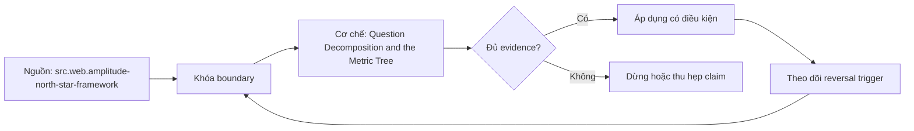

# Question Decomposition and the Metric Tree

> [!abstract] Câu hỏi trung tâm
> Làm sao phân rã một decision thành metric tree mà mỗi node có contract, mỗi leaf có owner/lever và mọi causal assumption được kiểm thay vì ngụy trang thành phép toán?

## 1. Đi từ decision chứ không đi từ danh sách KPI

Decision contract của L185 xác định action branches, decider và cadence. Metric tree chỉ hữu ích nếu root đo outcome liên quan trực tiếp đến decision đó. Một North Star hoặc revenue metric nổi tiếng nhưng không đổi action hiện tại không phải root thích hợp. Ghi root contract, time horizon và counterfactual: nếu root đổi, quyết định nào đổi. Không làm bước này, cây trở thành taxonomy số liệu không có operational purpose.

## 2. Ba loại cạnh phải phân biệt

Identity edge là phương trình định nghĩa, như revenue = orders × average order value trong điều kiện denominator rõ. Accounting decomposition là tổng các partition mutually exclusive/exhaustive. Causal/hypothesis edge nói một input thay đổi có thể làm outcome đổi. Hai loại đầu kiểm bằng algebra/data reconciliation; loại ba cần experiment, quasi-experiment hoặc evidence khác. Vẽ mọi cạnh bằng cùng mũi tên dễ tạo ảo giác causal.

## 3. Phân rã tới controllable leaves

Leaf đạt khi một owner có quyền và mechanism tác động trong horizon của decision: pricing team đổi discount rule, lifecycle team đổi retention intervention. Market conditions có predictive value nhưng không controllable; nó là context/risk factor, không action leaf. Owner cần tên role/person và decision right, lever cần action, expected direction, latency và guardrail. Không ép mọi driver thành controllable; giữ external factors riêng.

## 4. Leading và lagging không phải thuộc tính tuyệt đối

Metric leading với outcome dài hạn có thể lagging với step trước nó. Classification phải ghi target outcome và horizon. Input metric sớm nhưng dễ game không tốt hơn output metric chậm. Pair mỗi lever metric với outcome/guardrail để tránh local optimization: tăng order frequency bằng spam có thể giảm retention hoặc margin. Dashboard chỉ lagging metrics báo sau sự kiện; chỉ leading metrics có thể mất business result.

## 5. Mỗi node là contract chứ không là nhãn

Node link stable metric ID/version với population, grain, time, aggregation, owner và allowed dimensions. Formula trên tree phải resolve exact versions. Shared nodes không được copy formula; dùng reference để definition change có impact graph. Units/dimensions phải cân: revenue currency/period không thể nhân tùy ý với customer count nếu average value/time scope khác. Null, zero denominator và negative refunds được nêu.

## 6. Kiểm cây bằng dữ liệu và thay đổi ràng buộc

Reconcile root từ leaves trên fixed dataset; kiểm partition coverage, duplicate contribution và time alignment. Với causal edges, ghi confidence/evidence/status thay vì pass algebra. Thay cadence monthly→daily, owner hoặc refund policy để xem nodes/contracts nào đổi. Một tree tốt trả được why node exists, who acts, what changes, evidence type và when relation fails.

## 7. Lab ba tầng

Chọn decision thật từ L185; root, drivers, leaves tối thiểu ba levels. Annotate edge type, owner, lever, leading/lagging relative to named outcome, guardrail và contract link. Có ít nhất một external factor không giả thành lever, một causal assumption chưa chứng minh và một invalid decomposition để negative test. Done when mọi leaf actionable hoặc explicitly contextual và toàn bộ nodes resolve contracts.

## 8. Ma trận kiểm chứng từng mệnh đề

Mỗi mệnh đề dưới đây cần observation, fixture hoặc artifact có thể lưu. Tên công nghệ, consensus hoặc output nhìn hợp lý không tự là bằng chứng.

### 8.1. root phải trace tới decision action

**Mệnh đề cần kiểm.** root phải trace tới decision action.

**Cách kiểm.** Dựng three-level tree từ one decision, annotate identity/partition/causal edges, owners, levers, horizons, guardrails và contract IDs. Reconcile arithmetic on fixed data and challenge one causal assumption plus one changed constraint. Với riêng mệnh đề này, ghi input/context, expected observation, failure signal và boundary làm kết luận không còn đúng.

**Bằng chứng đạt cho `wiki.data-product.metric-tree`.** Lưu contract/decision version, fixture hoặc interview evidence, command/checklist output, reviewer và artifact hash. Nếu chưa thực hiện lab, trạng thái chỉ là protocol; không ghi thành kết quả đã quan sát.

### 8.2. identity edge khác causal edge

**Mệnh đề cần kiểm.** identity edge khác causal edge.

**Cách kiểm.** Dựng three-level tree từ one decision, annotate identity/partition/causal edges, owners, levers, horizons, guardrails và contract IDs. Reconcile arithmetic on fixed data and challenge one causal assumption plus one changed constraint. Với riêng mệnh đề này, ghi input/context, expected observation, failure signal và boundary làm kết luận không còn đúng.

**Bằng chứng đạt cho `wiki.data-product.metric-tree`.** Lưu contract/decision version, fixture hoặc interview evidence, command/checklist output, reviewer và artifact hash. Nếu chưa thực hiện lab, trạng thái chỉ là protocol; không ghi thành kết quả đã quan sát.

### 8.3. partition cần exhaustive and mutually exclusive

**Mệnh đề cần kiểm.** partition cần exhaustive and mutually exclusive.

**Cách kiểm.** Dựng three-level tree từ one decision, annotate identity/partition/causal edges, owners, levers, horizons, guardrails và contract IDs. Reconcile arithmetic on fixed data and challenge one causal assumption plus one changed constraint. Với riêng mệnh đề này, ghi input/context, expected observation, failure signal và boundary làm kết luận không còn đúng.

**Bằng chứng đạt cho `wiki.data-product.metric-tree`.** Lưu contract/decision version, fixture hoặc interview evidence, command/checklist output, reviewer và artifact hash. Nếu chưa thực hiện lab, trạng thái chỉ là protocol; không ghi thành kết quả đã quan sát.

### 8.4. algebra không chứng minh causality

**Mệnh đề cần kiểm.** algebra không chứng minh causality.

**Cách kiểm.** Dựng three-level tree từ one decision, annotate identity/partition/causal edges, owners, levers, horizons, guardrails và contract IDs. Reconcile arithmetic on fixed data and challenge one causal assumption plus one changed constraint. Với riêng mệnh đề này, ghi input/context, expected observation, failure signal và boundary làm kết luận không còn đúng.

**Bằng chứng đạt cho `wiki.data-product.metric-tree`.** Lưu contract/decision version, fixture hoặc interview evidence, command/checklist output, reviewer và artifact hash. Nếu chưa thực hiện lab, trạng thái chỉ là protocol; không ghi thành kết quả đã quan sát.

### 8.5. leaf cần owner decision right

**Mệnh đề cần kiểm.** leaf cần owner decision right.

**Cách kiểm.** Dựng three-level tree từ one decision, annotate identity/partition/causal edges, owners, levers, horizons, guardrails và contract IDs. Reconcile arithmetic on fixed data and challenge one causal assumption plus one changed constraint. Với riêng mệnh đề này, ghi input/context, expected observation, failure signal và boundary làm kết luận không còn đúng.

**Bằng chứng đạt cho `wiki.data-product.metric-tree`.** Lưu contract/decision version, fixture hoặc interview evidence, command/checklist output, reviewer và artifact hash. Nếu chưa thực hiện lab, trạng thái chỉ là protocol; không ghi thành kết quả đã quan sát.

### 8.6. lever cần action and latency

**Mệnh đề cần kiểm.** lever cần action and latency.

**Cách kiểm.** Dựng three-level tree từ one decision, annotate identity/partition/causal edges, owners, levers, horizons, guardrails và contract IDs. Reconcile arithmetic on fixed data and challenge one causal assumption plus one changed constraint. Với riêng mệnh đề này, ghi input/context, expected observation, failure signal và boundary làm kết luận không còn đúng.

**Bằng chứng đạt cho `wiki.data-product.metric-tree`.** Lưu contract/decision version, fixture hoặc interview evidence, command/checklist output, reviewer và artifact hash. Nếu chưa thực hiện lab, trạng thái chỉ là protocol; không ghi thành kết quả đã quan sát.

### 8.7. external factor không giả thành controllable

**Mệnh đề cần kiểm.** external factor không giả thành controllable.

**Cách kiểm.** Dựng three-level tree từ one decision, annotate identity/partition/causal edges, owners, levers, horizons, guardrails và contract IDs. Reconcile arithmetic on fixed data and challenge one causal assumption plus one changed constraint. Với riêng mệnh đề này, ghi input/context, expected observation, failure signal và boundary làm kết luận không còn đúng.

**Bằng chứng đạt cho `wiki.data-product.metric-tree`.** Lưu contract/decision version, fixture hoặc interview evidence, command/checklist output, reviewer và artifact hash. Nếu chưa thực hiện lab, trạng thái chỉ là protocol; không ghi thành kết quả đã quan sát.

### 8.8. leading status depends on outcome horizon

**Mệnh đề cần kiểm.** leading status depends on outcome horizon.

**Cách kiểm.** Dựng three-level tree từ one decision, annotate identity/partition/causal edges, owners, levers, horizons, guardrails và contract IDs. Reconcile arithmetic on fixed data and challenge one causal assumption plus one changed constraint. Với riêng mệnh đề này, ghi input/context, expected observation, failure signal và boundary làm kết luận không còn đúng.

**Bằng chứng đạt cho `wiki.data-product.metric-tree`.** Lưu contract/decision version, fixture hoặc interview evidence, command/checklist output, reviewer và artifact hash. Nếu chưa thực hiện lab, trạng thái chỉ là protocol; không ghi thành kết quả đã quan sát.

### 8.9. leading metric cần guardrail

**Mệnh đề cần kiểm.** leading metric cần guardrail.

**Cách kiểm.** Dựng three-level tree từ one decision, annotate identity/partition/causal edges, owners, levers, horizons, guardrails và contract IDs. Reconcile arithmetic on fixed data and challenge one causal assumption plus one changed constraint. Với riêng mệnh đề này, ghi input/context, expected observation, failure signal và boundary làm kết luận không còn đúng.

**Bằng chứng đạt cho `wiki.data-product.metric-tree`.** Lưu contract/decision version, fixture hoặc interview evidence, command/checklist output, reviewer và artifact hash. Nếu chưa thực hiện lab, trạng thái chỉ là protocol; không ghi thành kết quả đã quan sát.

### 8.10. shared node uses stable reference

**Mệnh đề cần kiểm.** shared node uses stable reference.

**Cách kiểm.** Dựng three-level tree từ one decision, annotate identity/partition/causal edges, owners, levers, horizons, guardrails và contract IDs. Reconcile arithmetic on fixed data and challenge one causal assumption plus one changed constraint. Với riêng mệnh đề này, ghi input/context, expected observation, failure signal và boundary làm kết luận không còn đúng.

**Bằng chứng đạt cho `wiki.data-product.metric-tree`.** Lưu contract/decision version, fixture hoặc interview evidence, command/checklist output, reviewer và artifact hash. Nếu chưa thực hiện lab, trạng thái chỉ là protocol; không ghi thành kết quả đã quan sát.

### 8.11. every node resolves contract version

**Mệnh đề cần kiểm.** every node resolves contract version.

**Cách kiểm.** Dựng three-level tree từ one decision, annotate identity/partition/causal edges, owners, levers, horizons, guardrails và contract IDs. Reconcile arithmetic on fixed data and challenge one causal assumption plus one changed constraint. Với riêng mệnh đề này, ghi input/context, expected observation, failure signal và boundary làm kết luận không còn đúng.

**Bằng chứng đạt cho `wiki.data-product.metric-tree`.** Lưu contract/decision version, fixture hoặc interview evidence, command/checklist output, reviewer và artifact hash. Nếu chưa thực hiện lab, trạng thái chỉ là protocol; không ghi thành kết quả đã quan sát.

### 8.12. units and time scopes must balance

**Mệnh đề cần kiểm.** units and time scopes must balance.

**Cách kiểm.** Dựng three-level tree từ one decision, annotate identity/partition/causal edges, owners, levers, horizons, guardrails và contract IDs. Reconcile arithmetic on fixed data and challenge one causal assumption plus one changed constraint. Với riêng mệnh đề này, ghi input/context, expected observation, failure signal và boundary làm kết luận không còn đúng.

**Bằng chứng đạt cho `wiki.data-product.metric-tree`.** Lưu contract/decision version, fixture hoặc interview evidence, command/checklist output, reviewer và artifact hash. Nếu chưa thực hiện lab, trạng thái chỉ là protocol; không ghi thành kết quả đã quan sát.

### 8.13. refunds affect decomposition signs

**Mệnh đề cần kiểm.** refunds affect decomposition signs.

**Cách kiểm.** Dựng three-level tree từ one decision, annotate identity/partition/causal edges, owners, levers, horizons, guardrails và contract IDs. Reconcile arithmetic on fixed data and challenge one causal assumption plus one changed constraint. Với riêng mệnh đề này, ghi input/context, expected observation, failure signal và boundary làm kết luận không còn đúng.

**Bằng chứng đạt cho `wiki.data-product.metric-tree`.** Lưu contract/decision version, fixture hoặc interview evidence, command/checklist output, reviewer và artifact hash. Nếu chưa thực hiện lab, trạng thái chỉ là protocol; không ghi thành kết quả đã quan sát.

### 8.14. fixed-data reconciliation tests arithmetic

**Mệnh đề cần kiểm.** fixed-data reconciliation tests arithmetic.

**Cách kiểm.** Dựng three-level tree từ one decision, annotate identity/partition/causal edges, owners, levers, horizons, guardrails và contract IDs. Reconcile arithmetic on fixed data and challenge one causal assumption plus one changed constraint. Với riêng mệnh đề này, ghi input/context, expected observation, failure signal và boundary làm kết luận không còn đúng.

**Bằng chứng đạt cho `wiki.data-product.metric-tree`.** Lưu contract/decision version, fixture hoặc interview evidence, command/checklist output, reviewer và artifact hash. Nếu chưa thực hiện lab, trạng thái chỉ là protocol; không ghi thành kết quả đã quan sát.

### 8.15. changed constraint tests tree adaptability

**Mệnh đề cần kiểm.** changed constraint tests tree adaptability.

**Cách kiểm.** Dựng three-level tree từ one decision, annotate identity/partition/causal edges, owners, levers, horizons, guardrails và contract IDs. Reconcile arithmetic on fixed data and challenge one causal assumption plus one changed constraint. Với riêng mệnh đề này, ghi input/context, expected observation, failure signal và boundary làm kết luận không còn đúng.

**Bằng chứng đạt cho `wiki.data-product.metric-tree`.** Lưu contract/decision version, fixture hoặc interview evidence, command/checklist output, reviewer và artifact hash. Nếu chưa thực hiện lab, trạng thái chỉ là protocol; không ghi thành kết quả đã quan sát.

## 9. Quy trình phản biện

1. Viết decision, consumer, contract và constraints trước khi chọn tool hoặc implementation.
2. Tách source fact, curriculum synthesis và organizational choice.
3. Dùng counterexample và changed constraint để kiểm quyết định có đảo đúng lúc.
4. Gắn mọi approval/certification với exact version, evidence và scope.
5. Kiểm cả valid path lẫn negative/failure path; không chỉ demo happy path.
6. Ghi limitation của telemetry, test environment và source authority.
7. Chưa có execution evidence thì giữ trạng thái `review`.

## 10. Câu hỏi tự kiểm tra

1. Decision hoặc invariant nào đang được bảo vệ?
2. Evidence nào độc lập với implementation đang được đánh giá?
3. Điều kiện nào làm lựa chọn hiện tại phải đảo?
4. Ai có quyền quyết nghĩa, ai triển khai và ai giữ quy trình?
5. Thay đổi nào ảnh hưởng consumer dù interface vẫn chạy?
6. Failure mode nào còn chưa có automated detector?

## 11. Giới hạn và điều chưa cho phép kết luận

- Chưa chạy các lab, migration, workload benchmark hoặc fault-injection; note mô tả protocol và expected evidence.
- Tài liệu sản phẩm web được kiểm ngày 2026-10-02; feature, syntax, license và integration có thể đổi.
- Các scorecard, lifecycle gates, failure matrix và decision contract là curriculum synthesis từ nguồn đã nêu; không gán nguyên văn cho một tác giả.
- Ví dụ tổ chức không thay discovery thực tế, threat model, cost model hoặc owner approval.
- Note giữ trạng thái `review` cho tới khi chủ dự án duyệt semantic meaning.

## Reference
1. [[SRC-AMPLITUDE-NORTH-STAR-FRAMEWORK]]
2. [[SRC-REIS-HOUSLEY-FUNDAMENTALS-DATA-ENGINEERING]]
3. [[SRC-GOVUK-DATA-ANALYTICS-TOOLS-GUIDANCE]]

## Source coverage

| Source slice | Nội dung sử dụng | Trạng thái |
|---|---|---|
| [[SRC-AMPLITUDE-NORTH-STAR-FRAMEWORK]] | Khái niệm, cơ chế hoặc decision boundary liên quan | Đã đọc locator được ghi trong source record; không suy ngoài phạm vi |
| [[SRC-REIS-HOUSLEY-FUNDAMENTALS-DATA-ENGINEERING]] | Khái niệm, cơ chế hoặc decision boundary liên quan | Đã đọc locator được ghi trong source record; không suy ngoài phạm vi |
| [[SRC-GOVUK-DATA-ANALYTICS-TOOLS-GUIDANCE]] | Khái niệm, cơ chế hoặc decision boundary liên quan | Đã đọc locator được ghi trong source record; không suy ngoài phạm vi |

## Key takeaways
- Chọn kiến trúc và data product từ decision/constraints, không từ độ mới của công nghệ.
- Metric governance cần versioned evidence, lifecycle gates và owner có quyền rõ.
- Failure matrix chỉ hữu dụng khi mỗi dòng có detector hoặc control kiểm được.
- Capstone là hồ sơ bằng chứng tích hợp, không phải bộ YAML hay dashboard trình diễn.
- Discovery phải cho phép kết luận không xây analytics product.

<!-- ATOMIC-EXECUTION-CAPSULE:START -->

## Execution capsule: kiểm chứng `wiki.data-product.metric-tree`

> [!important] Phân loại mệnh đề
> Với `wiki.data-product.metric-tree`, sơ đồ, ví dụ và artifact về **Question Decomposition and the Metric Tree** là **synthesis để kiểm chứng**; chúng không phải trích dẫn hay case nguyên văn của nguồn.

### Sơ đồ cơ chế và điểm kiểm soát



Đọc sơ đồ `wiki.data-product.metric-tree` từ trái sang phải: source chỉ cung cấp claim ban đầu cho **Question Decomposition and the Metric Tree**; quyết định chỉ được đi tiếp sau khi boundary, evidence và điều kiện đảo quyết định đã hiện hữu.

### Artifact thực thi tối thiểu

```sql
-- Verification harness for: Question Decomposition and the Metric Tree
WITH evidence AS (
    SELECT 'wiki.data-product.metric-tree' AS concept_id,
           'boundary_declared' AS check_name, 1 AS passed
    UNION ALL
    SELECT 'wiki.data-product.metric-tree', 'independent_oracle', 1
    UNION ALL
    SELECT 'wiki.data-product.metric-tree', 'reversal_trigger_recorded', 1
)
SELECT concept_id,
       MIN(passed) AS all_hard_checks_pass,
       COUNT(*) AS evidence_items
FROM evidence
GROUP BY concept_id
HAVING MIN(passed) = 1;
```

Artifact của `wiki.data-product.metric-tree` buộc người dùng ghi boundary, oracle và reversal trigger cho **Question Decomposition and the Metric Tree**. Các giá trị minh họa phải được thay bằng evidence thật trước khi dùng cho quyết định.

### Tự kiểm tra trước khi tái sử dụng

1. Bạn có thể trả lời `Làm sao phân rã một decision thành metric tree mà mỗi node có contract, mỗi leaf có owner/lever và mọi causal assumption được kiểm thay vì ngụy trang thành phép toán?` bằng một câu mà không kéo thêm concept thứ hai không?
2. Source locator nào đỡ cho claim, và phần nào chỉ là synthesis trong note?
3. Observation nào khiến bạn dừng, thu hẹp hoặc đảo quyết định?
4. Artifact nào cho phép một reviewer độc lập tái hiện kết quả?

<!-- ATOMIC-EXECUTION-CAPSULE:END -->
