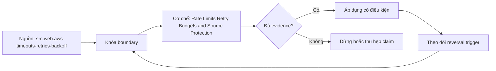

# Rate Limits Retry Budgets and Source Protection

> [!abstract] Câu hỏi trung tâm
> Giữ throughput mà không biến retry thành tải tấn công lên source bằng những control nào?

## 1. Limit contract

Phân biệt quota theo account/token/IP/endpoint, fixed/sliding/token bucket, request versus cost units, burst và reset clock. Response headers/doc are hints; observed enforcement có thể khác tier. Client tracks server limits and local conservative budget. Timezone/reset and clock skew are explicit. Separate source-protection SLO from pipeline freshness.

## 2. Error classification

Retry transport ambiguity, timeout, selected 5xx/429 only when semantics allow. Auth, validation and deterministic business errors fail fast or quarantine. HTTP method idempotence is intended effect; POST needs application idempotency key/dedup state. A 2xx body can contain business failure. Classification logs exact status, error code, retry-after and request identity.

## 3. Retry budget

Bound attempts, cumulative elapsed deadline and retry-token budget per run/partition. Exponential backoff with jitter spreads synchronized clients; cap prevents unbounded delay. Nested SDK/orchestrator/application retries multiply load, so choose one owner or compose budgets. Stop when remaining deadline cannot cover next attempt. Retries are measured as amplification ratio and successful recovery, not hidden.

## 4. Adaptive concurrency

Limiter controls in-flight requests independently of retry delay. Adjust from throttling, latency and server hints with floor/ceiling and slow recovery; avoid oscillation. Partition fairness prevents one stream consuming budget. Circuit/bulkhead bounds repeated failure and preserves health/reconciliation calls. Backfill gets separate quota so daily ingest retains SLO.

## 5. Ambiguous writes

Timeout after send leaves unknown outcome. Idempotency key binds same operation/payload and server stores result/dedup window. Client retry with same key, never generate new key. If API lacks support, query by stable business operation ID or require reconciliation/manual handling. Key expiry and payload mismatch are failure cases. Exactly-once effect is scoped to dedup system and retention.

## 6. Load test

Simulator enforces documented model, random transient errors, reset timezone and lost responses. Generate open-loop and bounded workers; assert zero contract violations, retry amplification within budget, latency/freshness and no duplicate side effects. Inject 429 with/without Retry-After, 5xx burst, auth failure and timeout-after-commit. Save request ledger, limiter state and source counters.

## 7. Ma trận kiểm chứng từng mệnh đề

Mỗi claim phải gắn source/entity boundary, exact fixture, checkpoint/input state, counterexample và independent reconciliation oracle. Connector chạy thành công hoặc API trả 2xx chưa chứng minh completeness.

### 7.1. Source-protection probe 1: limit scope, error class, retry budget, concurrency state và side-effect oracle phải đủ

**Mệnh đề cần kiểm.** Source-protection probe 1: limit scope, error class, retry budget, concurrency state và side-effect oracle phải đủ.

**Thiết kế phép thử cho `wiki.ingestion.rate-limits-retry-budgets-source-protection`.** Khóa source/API version, entity, grain/key, time boundary, schema, pagination/cursor configuration và failure schedule. Tạo positive, boundary và negative fixtures; thay đổi đúng một assumption. Lưu request/query, response/raw extract hash, checkpoint trước/sau, landing objects, target state và source-at-boundary oracle.

**Điều kiện chấp nhận cho `wiki.ingestion.rate-limits-retry-budgets-source-protection`.** Count, key set, typed field hash và delete state khớp contract; duplicates được giải thích và dedup có identity rõ. Observation, inference và unknown được báo riêng. Lab chưa chạy chỉ là protocol.

### 7.2. Source-protection probe 2: limit scope, error class, retry budget, concurrency state và side-effect oracle phải đủ

**Mệnh đề cần kiểm.** Source-protection probe 2: limit scope, error class, retry budget, concurrency state và side-effect oracle phải đủ.

**Thiết kế phép thử cho `wiki.ingestion.rate-limits-retry-budgets-source-protection`.** Khóa source/API version, entity, grain/key, time boundary, schema, pagination/cursor configuration và failure schedule. Tạo positive, boundary và negative fixtures; thay đổi đúng một assumption. Lưu request/query, response/raw extract hash, checkpoint trước/sau, landing objects, target state và source-at-boundary oracle.

**Điều kiện chấp nhận cho `wiki.ingestion.rate-limits-retry-budgets-source-protection`.** Count, key set, typed field hash và delete state khớp contract; duplicates được giải thích và dedup có identity rõ. Observation, inference và unknown được báo riêng. Lab chưa chạy chỉ là protocol.

### 7.3. Source-protection probe 3: limit scope, error class, retry budget, concurrency state và side-effect oracle phải đủ

**Mệnh đề cần kiểm.** Source-protection probe 3: limit scope, error class, retry budget, concurrency state và side-effect oracle phải đủ.

**Thiết kế phép thử cho `wiki.ingestion.rate-limits-retry-budgets-source-protection`.** Khóa source/API version, entity, grain/key, time boundary, schema, pagination/cursor configuration và failure schedule. Tạo positive, boundary và negative fixtures; thay đổi đúng một assumption. Lưu request/query, response/raw extract hash, checkpoint trước/sau, landing objects, target state và source-at-boundary oracle.

**Điều kiện chấp nhận cho `wiki.ingestion.rate-limits-retry-budgets-source-protection`.** Count, key set, typed field hash và delete state khớp contract; duplicates được giải thích và dedup có identity rõ. Observation, inference và unknown được báo riêng. Lab chưa chạy chỉ là protocol.

### 7.4. Source-protection probe 4: limit scope, error class, retry budget, concurrency state và side-effect oracle phải đủ

**Mệnh đề cần kiểm.** Source-protection probe 4: limit scope, error class, retry budget, concurrency state và side-effect oracle phải đủ.

**Thiết kế phép thử cho `wiki.ingestion.rate-limits-retry-budgets-source-protection`.** Khóa source/API version, entity, grain/key, time boundary, schema, pagination/cursor configuration và failure schedule. Tạo positive, boundary và negative fixtures; thay đổi đúng một assumption. Lưu request/query, response/raw extract hash, checkpoint trước/sau, landing objects, target state và source-at-boundary oracle.

**Điều kiện chấp nhận cho `wiki.ingestion.rate-limits-retry-budgets-source-protection`.** Count, key set, typed field hash và delete state khớp contract; duplicates được giải thích và dedup có identity rõ. Observation, inference và unknown được báo riêng. Lab chưa chạy chỉ là protocol.

### 7.5. Source-protection probe 5: limit scope, error class, retry budget, concurrency state và side-effect oracle phải đủ

**Mệnh đề cần kiểm.** Source-protection probe 5: limit scope, error class, retry budget, concurrency state và side-effect oracle phải đủ.

**Thiết kế phép thử cho `wiki.ingestion.rate-limits-retry-budgets-source-protection`.** Khóa source/API version, entity, grain/key, time boundary, schema, pagination/cursor configuration và failure schedule. Tạo positive, boundary và negative fixtures; thay đổi đúng một assumption. Lưu request/query, response/raw extract hash, checkpoint trước/sau, landing objects, target state và source-at-boundary oracle.

**Điều kiện chấp nhận cho `wiki.ingestion.rate-limits-retry-budgets-source-protection`.** Count, key set, typed field hash và delete state khớp contract; duplicates được giải thích và dedup có identity rõ. Observation, inference và unknown được báo riêng. Lab chưa chạy chỉ là protocol.

### 7.6. Source-protection probe 6: limit scope, error class, retry budget, concurrency state và side-effect oracle phải đủ

**Mệnh đề cần kiểm.** Source-protection probe 6: limit scope, error class, retry budget, concurrency state và side-effect oracle phải đủ.

**Thiết kế phép thử cho `wiki.ingestion.rate-limits-retry-budgets-source-protection`.** Khóa source/API version, entity, grain/key, time boundary, schema, pagination/cursor configuration và failure schedule. Tạo positive, boundary và negative fixtures; thay đổi đúng một assumption. Lưu request/query, response/raw extract hash, checkpoint trước/sau, landing objects, target state và source-at-boundary oracle.

**Điều kiện chấp nhận cho `wiki.ingestion.rate-limits-retry-budgets-source-protection`.** Count, key set, typed field hash và delete state khớp contract; duplicates được giải thích và dedup có identity rõ. Observation, inference và unknown được báo riêng. Lab chưa chạy chỉ là protocol.

### 7.7. Source-protection probe 7: limit scope, error class, retry budget, concurrency state và side-effect oracle phải đủ

**Mệnh đề cần kiểm.** Source-protection probe 7: limit scope, error class, retry budget, concurrency state và side-effect oracle phải đủ.

**Thiết kế phép thử cho `wiki.ingestion.rate-limits-retry-budgets-source-protection`.** Khóa source/API version, entity, grain/key, time boundary, schema, pagination/cursor configuration và failure schedule. Tạo positive, boundary và negative fixtures; thay đổi đúng một assumption. Lưu request/query, response/raw extract hash, checkpoint trước/sau, landing objects, target state và source-at-boundary oracle.

**Điều kiện chấp nhận cho `wiki.ingestion.rate-limits-retry-budgets-source-protection`.** Count, key set, typed field hash và delete state khớp contract; duplicates được giải thích và dedup có identity rõ. Observation, inference và unknown được báo riêng. Lab chưa chạy chỉ là protocol.

### 7.8. Source-protection probe 8: limit scope, error class, retry budget, concurrency state và side-effect oracle phải đủ

**Mệnh đề cần kiểm.** Source-protection probe 8: limit scope, error class, retry budget, concurrency state và side-effect oracle phải đủ.

**Thiết kế phép thử cho `wiki.ingestion.rate-limits-retry-budgets-source-protection`.** Khóa source/API version, entity, grain/key, time boundary, schema, pagination/cursor configuration và failure schedule. Tạo positive, boundary và negative fixtures; thay đổi đúng một assumption. Lưu request/query, response/raw extract hash, checkpoint trước/sau, landing objects, target state và source-at-boundary oracle.

**Điều kiện chấp nhận cho `wiki.ingestion.rate-limits-retry-budgets-source-protection`.** Count, key set, typed field hash và delete state khớp contract; duplicates được giải thích và dedup có identity rõ. Observation, inference và unknown được báo riêng. Lab chưa chạy chỉ là protocol.

### 7.9. Source-protection probe 9: limit scope, error class, retry budget, concurrency state và side-effect oracle phải đủ

**Mệnh đề cần kiểm.** Source-protection probe 9: limit scope, error class, retry budget, concurrency state và side-effect oracle phải đủ.

**Thiết kế phép thử cho `wiki.ingestion.rate-limits-retry-budgets-source-protection`.** Khóa source/API version, entity, grain/key, time boundary, schema, pagination/cursor configuration và failure schedule. Tạo positive, boundary và negative fixtures; thay đổi đúng một assumption. Lưu request/query, response/raw extract hash, checkpoint trước/sau, landing objects, target state và source-at-boundary oracle.

**Điều kiện chấp nhận cho `wiki.ingestion.rate-limits-retry-budgets-source-protection`.** Count, key set, typed field hash và delete state khớp contract; duplicates được giải thích và dedup có identity rõ. Observation, inference và unknown được báo riêng. Lab chưa chạy chỉ là protocol.

### 7.10. Source-protection probe 10: limit scope, error class, retry budget, concurrency state và side-effect oracle phải đủ

**Mệnh đề cần kiểm.** Source-protection probe 10: limit scope, error class, retry budget, concurrency state và side-effect oracle phải đủ.

**Thiết kế phép thử cho `wiki.ingestion.rate-limits-retry-budgets-source-protection`.** Khóa source/API version, entity, grain/key, time boundary, schema, pagination/cursor configuration và failure schedule. Tạo positive, boundary và negative fixtures; thay đổi đúng một assumption. Lưu request/query, response/raw extract hash, checkpoint trước/sau, landing objects, target state và source-at-boundary oracle.

**Điều kiện chấp nhận cho `wiki.ingestion.rate-limits-retry-budgets-source-protection`.** Count, key set, typed field hash và delete state khớp contract; duplicates được giải thích và dedup có identity rõ. Observation, inference và unknown được báo riêng. Lab chưa chạy chỉ là protocol.

### 7.11. Source-protection probe 11: limit scope, error class, retry budget, concurrency state và side-effect oracle phải đủ

**Mệnh đề cần kiểm.** Source-protection probe 11: limit scope, error class, retry budget, concurrency state và side-effect oracle phải đủ.

**Thiết kế phép thử cho `wiki.ingestion.rate-limits-retry-budgets-source-protection`.** Khóa source/API version, entity, grain/key, time boundary, schema, pagination/cursor configuration và failure schedule. Tạo positive, boundary và negative fixtures; thay đổi đúng một assumption. Lưu request/query, response/raw extract hash, checkpoint trước/sau, landing objects, target state và source-at-boundary oracle.

**Điều kiện chấp nhận cho `wiki.ingestion.rate-limits-retry-budgets-source-protection`.** Count, key set, typed field hash và delete state khớp contract; duplicates được giải thích và dedup có identity rõ. Observation, inference và unknown được báo riêng. Lab chưa chạy chỉ là protocol.

### 7.12. Source-protection probe 12: limit scope, error class, retry budget, concurrency state và side-effect oracle phải đủ

**Mệnh đề cần kiểm.** Source-protection probe 12: limit scope, error class, retry budget, concurrency state và side-effect oracle phải đủ.

**Thiết kế phép thử cho `wiki.ingestion.rate-limits-retry-budgets-source-protection`.** Khóa source/API version, entity, grain/key, time boundary, schema, pagination/cursor configuration và failure schedule. Tạo positive, boundary và negative fixtures; thay đổi đúng một assumption. Lưu request/query, response/raw extract hash, checkpoint trước/sau, landing objects, target state và source-at-boundary oracle.

**Điều kiện chấp nhận cho `wiki.ingestion.rate-limits-retry-budgets-source-protection`.** Count, key set, typed field hash và delete state khớp contract; duplicates được giải thích và dedup có identity rõ. Observation, inference và unknown được báo riêng. Lab chưa chạy chỉ là protocol.

### 7.13. Source-protection probe 13: limit scope, error class, retry budget, concurrency state và side-effect oracle phải đủ

**Mệnh đề cần kiểm.** Source-protection probe 13: limit scope, error class, retry budget, concurrency state và side-effect oracle phải đủ.

**Thiết kế phép thử cho `wiki.ingestion.rate-limits-retry-budgets-source-protection`.** Khóa source/API version, entity, grain/key, time boundary, schema, pagination/cursor configuration và failure schedule. Tạo positive, boundary và negative fixtures; thay đổi đúng một assumption. Lưu request/query, response/raw extract hash, checkpoint trước/sau, landing objects, target state và source-at-boundary oracle.

**Điều kiện chấp nhận cho `wiki.ingestion.rate-limits-retry-budgets-source-protection`.** Count, key set, typed field hash và delete state khớp contract; duplicates được giải thích và dedup có identity rõ. Observation, inference và unknown được báo riêng. Lab chưa chạy chỉ là protocol.

### 7.14. Source-protection probe 14: limit scope, error class, retry budget, concurrency state và side-effect oracle phải đủ

**Mệnh đề cần kiểm.** Source-protection probe 14: limit scope, error class, retry budget, concurrency state và side-effect oracle phải đủ.

**Thiết kế phép thử cho `wiki.ingestion.rate-limits-retry-budgets-source-protection`.** Khóa source/API version, entity, grain/key, time boundary, schema, pagination/cursor configuration và failure schedule. Tạo positive, boundary và negative fixtures; thay đổi đúng một assumption. Lưu request/query, response/raw extract hash, checkpoint trước/sau, landing objects, target state và source-at-boundary oracle.

**Điều kiện chấp nhận cho `wiki.ingestion.rate-limits-retry-budgets-source-protection`.** Count, key set, typed field hash và delete state khớp contract; duplicates được giải thích và dedup có identity rõ. Observation, inference và unknown được báo riêng. Lab chưa chạy chỉ là protocol.

### 7.15. Source-protection probe 15: limit scope, error class, retry budget, concurrency state và side-effect oracle phải đủ

**Mệnh đề cần kiểm.** Source-protection probe 15: limit scope, error class, retry budget, concurrency state và side-effect oracle phải đủ.

**Thiết kế phép thử cho `wiki.ingestion.rate-limits-retry-budgets-source-protection`.** Khóa source/API version, entity, grain/key, time boundary, schema, pagination/cursor configuration và failure schedule. Tạo positive, boundary và negative fixtures; thay đổi đúng một assumption. Lưu request/query, response/raw extract hash, checkpoint trước/sau, landing objects, target state và source-at-boundary oracle.

**Điều kiện chấp nhận cho `wiki.ingestion.rate-limits-retry-budgets-source-protection`.** Count, key set, typed field hash và delete state khớp contract; duplicates được giải thích và dedup có identity rõ. Observation, inference và unknown được báo riêng. Lab chưa chạy chỉ là protocol.

## 8. Quy trình phản biện

1. Chốt entity, grain, identity và immutable boundary.
2. Tách source fact, documentation claim và observed behavior.
3. Viết delete, retry, checkpoint và replay semantics trước code.
4. Dùng key/typed-hash reconciliation, không chỉ row count.
5. Pin version, retention, timezone, ordering và rate limits.
6. Ghi assumption bị falsify và extraction pattern thay thế.

## 9. Câu hỏi tự kiểm tra

1. Source thay đổi row/entity theo những operation nào?
2. Boundary nào định nghĩa complete?
3. Delete có xuất hiện trong interface không?
4. Cursor/order có total và immutable không?
5. Crash ở checkpoint boundary gây replay hay gap?
6. Bằng chứng nào chưa được chạy?

## 10. Giới hạn và điều chưa cho phép kết luận

- Chưa chạy mutation/pagination/watermark lab trên source thật.
- Product behavior phải pin version, retention và configuration.
- Decision matrices và failure protocols là synthesis của giáo trình.
- Note giữ trạng thái `review` tới khi chủ dự án duyệt.

## Reference
1. [[SRC-AWS-TIMEOUTS-RETRIES-BACKOFF]]
2. [[SRC-STRIPE-IDEMPOTENT-REQUESTS]]
3. [[SRC-RFC9110-HTTP-SEMANTICS]]
4. [[SRC-REIS-HOUSLEY-FUNDAMENTALS-DATA-ENGINEERING]]

## Source coverage

| Source slice | Nội dung sử dụng | Trạng thái |
|---|---|---|
| [[SRC-AWS-TIMEOUTS-RETRIES-BACKOFF]] | Source/change/API contract hoặc engineering context | Đã đọc locator; không suy ngoài phạm vi |
| [[SRC-STRIPE-IDEMPOTENT-REQUESTS]] | Source/change/API contract hoặc engineering context | Đã đọc locator; không suy ngoài phạm vi |
| [[SRC-RFC9110-HTTP-SEMANTICS]] | Source/change/API contract hoặc engineering context | Đã đọc locator; không suy ngoài phạm vi |
| [[SRC-REIS-HOUSLEY-FUNDAMENTALS-DATA-ENGINEERING]] | Source/change/API contract hoặc engineering context | Đã đọc locator; không suy ngoài phạm vi |

## Key takeaways
- Extraction pattern chỉ đúng khi source assumptions đúng.
- Completeness cần immutable boundary và reconciliation oracle.
- Retry/checkpoint ưu tiên replay có kiểm soát hơn silent gap.
- Connector không chuyển giao ownership về tính đúng.

<!-- ATOMIC-EXECUTION-CAPSULE:START -->

## Execution capsule: kiểm chứng `wiki.ingestion.rate-limits-retry-budgets-source-protection`

> [!important] Phân loại mệnh đề
> Với `wiki.ingestion.rate-limits-retry-budgets-source-protection`, sơ đồ, ví dụ và artifact về **Rate Limits Retry Budgets and Source Protection** là **synthesis để kiểm chứng**; chúng không phải trích dẫn hay case nguyên văn của nguồn.

### Sơ đồ cơ chế và điểm kiểm soát



Đọc sơ đồ `wiki.ingestion.rate-limits-retry-budgets-source-protection` từ trái sang phải: source chỉ cung cấp claim ban đầu cho **Rate Limits Retry Budgets and Source Protection**; quyết định chỉ được đi tiếp sau khi boundary, evidence và điều kiện đảo quyết định đã hiện hữu.

### Ví dụ làm việc có thể bác bỏ

**Input.** Một đội cần trả lời: Giữ throughput mà không biến retry thành tải tấn công lên source bằng những control nào? cho một phạm vi nhỏ, có owner và deadline rõ.

**Decision.** Đội áp dụng **Rate Limits Retry Budgets and Source Protection** trên control và variant chỉ khác một assumption; expected result và hard constraints được khóa trước khi chạy.

**Outcome.** Với `wiki.ingestion.rate-limits-retry-budgets-source-protection`, nếu observation vi phạm hard constraint hoặc oracle độc lập không xác nhận **Rate Limits Retry Budgets and Source Protection**, đội thu hẹp claim hay đảo quyết định. Nếu đạt, kết luận vẫn kèm scope, version và review date; một lần thành công không được nâng thành quy luật phổ quát.

### Artifact thực thi tối thiểu

```sql
-- Verification harness for: Rate Limits Retry Budgets and Source Protection
WITH evidence AS (
    SELECT 'wiki.ingestion.rate-limits-retry-budgets-source-protection' AS concept_id,
           'boundary_declared' AS check_name, 1 AS passed
    UNION ALL
    SELECT 'wiki.ingestion.rate-limits-retry-budgets-source-protection', 'independent_oracle', 1
    UNION ALL
    SELECT 'wiki.ingestion.rate-limits-retry-budgets-source-protection', 'reversal_trigger_recorded', 1
)
SELECT concept_id,
       MIN(passed) AS all_hard_checks_pass,
       COUNT(*) AS evidence_items
FROM evidence
GROUP BY concept_id
HAVING MIN(passed) = 1;
```

Artifact của `wiki.ingestion.rate-limits-retry-budgets-source-protection` buộc người dùng ghi boundary, oracle và reversal trigger cho **Rate Limits Retry Budgets and Source Protection**. Các giá trị minh họa phải được thay bằng evidence thật trước khi dùng cho quyết định.

### Tự kiểm tra trước khi tái sử dụng

1. Bạn có thể trả lời `Giữ throughput mà không biến retry thành tải tấn công lên source bằng những control nào?` bằng một câu mà không kéo thêm concept thứ hai không?
2. Source locator nào đỡ cho claim, và phần nào chỉ là synthesis trong note?
3. Observation nào khiến bạn dừng, thu hẹp hoặc đảo quyết định?
4. Artifact nào cho phép một reviewer độc lập tái hiện kết quả?

<!-- ATOMIC-EXECUTION-CAPSULE:END -->
