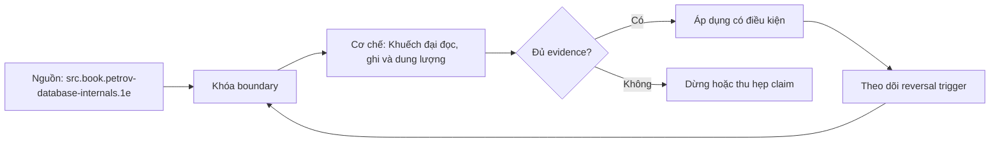

# Khuếch đại đọc, ghi và dung lượng

> [!abstract] Câu hỏi trung tâm
> Một thao tác logic khiến hệ thống thực hiện bao nhiêu công việc vật lý, và phép đo nào tách được cấu trúc lưu trữ khỏi cache, WAL, compaction, filesystem và thiết bị?

## 1. Vì sao throughput không đủ

Hai engine có cùng throughput nhưng tạo lượng I/O, dung lượng và background debt rất khác. Một engine có thể nhận ghi nhanh bằng cách dồn compaction về sau; benchmark kết thúc trước khi debt được xử lý sẽ báo thành tích không bền vững. Engine khác có thể dùng nhiều cache để che read work.

Amplification biến câu “nhanh” thành câu hỏi về lượng công việc: một read logic chạm bao nhiêu blocks/sources; một byte dữ liệu logic làm bao nhiêu bytes được ghi; một byte live data chiếm bao nhiêu bytes physical. Ba tỷ số không thay latency/throughput mà giải thích chúng.

## 2. Phải khóa đơn vị và ranh giới

Mọi tỷ số cần numerator, denominator, thời gian và layer. “Write bytes” có thể là bytes engine gửi filesystem, bytes block device ghi, NAND bytes sau FTL hoặc cả replicated bytes. “Logical bytes” có thể là request payload, encoded row, live value size hoặc database growth. Trộn layer làm số vô nghĩa.

Một báo cáo tối thiểu ghi: engine/version; cấu hình durability/compression; logical operation definition; physical counter source; measurement window; warm-up; cache regime; dataset; key/value distribution; concurrency; compaction state và storage stack.

## 3. Read amplification

Read amplification đo physical work cần để trả một logical read. Với point lookup, có thể dùng data/index blocks read hoặc SSTable candidates/data blocks touched trên mỗi lookup. Với range scan, dùng bytes/blocks read chia bytes/rows trả về. Một số đơn giản:

$$
RA_{bytes} = \frac{\text{physical bytes read trong cửa sổ}}{\text{logical result bytes trong cửa sổ}}
$$

Denominator bằng zero cần report riêng cho negative lookup. Với workload đó, dùng blocks/candidates per request, không chia cho result bytes. Cache hit có thể làm device reads bằng zero dù engine vẫn kiểm nhiều components; nên báo cả logical component probes, buffer reads và device reads.

## 4. Read amplification trong B-tree và LSM

B-tree point lookup thường đi qua số page xấp xỉ độ sâu rồi truy cập heap/value tùy layout. Cache có thể giữ upper levels. Range scan tận dụng leaf ordering và locality nhưng heap lookup có thể ngẫu nhiên.

LSM point lookup có thể kiểm memtable, L0 và candidates ở các levels. Range metadata và Bloom filter loại nhiều tệp; block cache loại device I/O. Negative lookup nhạy với false positives. Range scan cần merge iterators và có thể đọc các phiên bản bị shadow trước khi trả ít rows.

Không kết luận LSM “đọc N lần vì có N levels” nếu chưa tính non-overlap, filter và cache. Cũng không gọi B-tree “một lần đọc” nếu index/heap/visibility cần nhiều pages.

## 5. Write amplification

Write amplification đo tổng physical bytes written trên logical bytes accepted hoặc live bytes created:

$$
WA_{layer} = \frac{\text{physical bytes written tại layer đã chọn}}{\text{logical bytes committed}}
$$

Numerator có thể gồm WAL, data/index pages, compaction output, temporary spill, filesystem journal, replica network/disk và SSD NAND. Báo riêng từng layer trước khi cộng. Một logical transaction nhỏ có header/index/alignment overhead lớn; ratio phụ thuộc payload size.

Với B-tree, page rewrite, split, secondary indexes, WAL/full-page image, vacuum/rebuild tạo work. Với LSM, WAL + flush + repeated compaction + tombstone/GC tạo work. Không thể suy bên nào thấp hơn chỉ từ tên cấu trúc.

## 6. Space amplification

Space amplification đo physical footprint so với live logical dataset:

$$
SA = \frac{\text{physical bytes đang chiếm}}{\text{live logical bytes}}
$$

Phải nói numerator gồm gì: active files, obsolete-but-pinned files, WAL retained, temporary compaction output, indexes, metadata, snapshots/backups và free-but-allocated space. Denominator cần định nghĩa live records sau delete/update, encoding và compression.

B-tree giữ free space trong pages, dead tuples/entries và multiple indexes. LSM giữ old versions, tombstones, overlapping compaction inputs/outputs và WAL. Trong lúc compaction, temporary peak space có thể cao hơn steady state; capacity plan phải dùng peak.

## 7. Ba tỷ số có quan hệ đánh đổi

Compaction tích cực loại phiên bản cũ sớm, giảm read candidates và space, nhưng viết lại nhiều hơn. Compaction chậm giảm immediate write work nhưng tăng read/space debt. Bloom filter và cache giảm device read đổi lấy memory/CPU. Fillfactor thấp giảm page split đổi lấy space.

RUM conjecture nhắc rằng read, update và memory overhead không thể đồng thời tối ưu tuyệt đối. Đây là khung reasoning, không phải công thức benchmark thay thế. Còn có latency distribution, CPU, availability, consistency, implementation complexity và operational work.

## 8. Workload là một phần của phép đo

Tỷ lệ read/write, point/range, hit/miss, key skew, update/delete rate, value size và transaction batching đổi amplification. Uniform random keys khác monotonically increasing; overwrite-heavy khác insert-only; TTL/time-series khác long-lived keys.

Tạo ít nhất hai workload như contract: write-heavy và random-read-heavy. Tuy vậy, cả hai phải có specification cụ thể, không chỉ nhãn. Ghi operation mix, distributions, target rate, concurrency, duration và steady-state criterion.

## 9. Durability parity

So engine A synchronous durable với engine B asynchronous hoặc fsync disabled là sai. Cần cùng acknowledgment contract: commit success sống sót qua process crash hay power loss; replication có nằm trong commit hay không; checksums/compression giống mức nào.

WAL bytes không phải overhead có thể tùy ý bỏ khỏi phép đo. Nếu đo storage-engine data path riêng, báo WAL tách riêng nhưng vẫn giữ durability mode. Nếu tắt WAL cho một engine, ghi rõ benchmark không so production contract.

## 10. Cache regime

Warm cache đo repeated working set; cold cache đo read path khi thiếu residency. Không phá cache production để tạo cold test. Dùng instance/máy thử nghiệm, recreate/restart theo protocol và ghi OS/device cache limitation.

Một engine có block cache riêng còn engine kia dùng OS cache khiến resident memory khác. Cần giới hạn tổng cache budget hoặc ít nhất report process RSS, engine cache và OS cache. Device bytes phải lấy từ cgroup/device counters nếu có, không suy từ application elapsed.

## 11. Compaction và maintenance debt

Benchmark phải chạy đủ lâu để đạt steady state hoặc có drain phase. Nếu LSM còn pending compaction bytes khi đo kết thúc, throughput foreground đã vay I/O tương lai. Nếu PostgreSQL chưa vacuum/checkpoint xong, write cost cũng chưa đầy đủ.

Ghi metrics trong workload và sau workload: compaction/checkpoint/vacuum bytes, duration, backlog, stalls và disk usage. Có thể report hai kết quả: foreground window và full-accounting window đến khi debt trở về baseline.

## 12. Đo read amplification thực tế

Tạo dataset lớn hơn cache nếu muốn quan sát device reads. Chọn positive hot, positive cold, negative và range classes. Với mỗi class, chạy fixed request count/rate, lưu result parity, engine counters, block/device bytes và latency distribution.

LSM: SSTables checked, Bloom useful/false positive, data/index/filter block reads, block cache hit, bytes read. PostgreSQL: `EXPLAIN (ANALYZE, BUFFERS)`, `pg_stat_io`/views phù hợp phiên bản, OS/device counters. `shared read` không tự bằng disk read; cần ghi tầng đo.

## 13. Đo write amplification thực tế

Chụp counters trước/sau, chạy deterministic committed workload và chờ maintenance theo protocol. Thu logical payload/row bytes, WAL/redo bytes, data/index writes, compaction bytes, filesystem/device bytes. Với SSD telemetry nếu có, NAND writes cho device-level WA.

Reset/recreate dataset giữa variants. Giữ batch size, indexes, compression, sync mode, concurrency và value distribution. Một engine tạo data compression mạnh có thể viết ít bytes dù nhiều passes; report cả logical rewrite passes và physical compressed bytes.

## 14. Đo space amplification thực tế

Xây live-set oracle từ key/value generator hoặc canonical export. Sau inserts/updates/deletes và maintenance quiescence, đo active data/index files, retained WAL và temporary/obsolete files. Ghi peak trong compaction và steady state sau cleanup.

Không dùng database directory size duy nhất nếu chứa logs, snapshots hoặc unrelated databases. Không dùng table logical row count làm live bytes nếu values variable/compressed. Lưu cách tính bằng script tái chạy được.

## 15. Thiết kế so sánh hai engine

Đầu tiên định nghĩa semantic parity: keys, values, update/delete semantics, transaction durability và consistency. Sau đó khóa hardware, filesystem, dataset, workload generator, rate/concurrency, cache budget và measurement window. Mỗi engine có tuning hợp lý nhưng mọi khác biệt phải công bố.

Chạy warm-up, measurement, drain/maintenance và cooldown. Lặp đủ lần, randomize order để giảm time bias. Báo median cùng p95/p99 hoặc confidence interval phù hợp. Không chọn run tốt nhất.

## 16. Bảng evidence sáu ô

Mỗi ô không chỉ chứa một số. Nó cần value, unit, layer, numerator, denominator, window và counter source. Bảng chính gồm RA/WA/SA × hai engine; phụ lục giữ raw counters và scripts.

Lựa chọn engine phải dẫn từ workload: ví dụ point-read SLO, ingest rate, retention, disk budget, recovery và operations. Nếu một engine thắng throughput nhưng vi phạm p99 hoặc disk headroom, không gọi là thắng chung.

## 17. Các bẫy diễn giải

- Throughput cao không chứng minh amplification thấp.
- Sequential logical writes không chứng minh NAND writes thấp.
- Compaction đang chạy không làm số “vô hiệu”; nó là state phải kiểm soát và báo.
- Cache hit cao không loại bỏ component probes/CPU.
- Directory size ngay sau load không đại diện steady state.
- Tỷ số thấp hơn không có nghĩa latency thấp hơn nếu queueing/CPU khác.
- Một workload không cho phép xếp hạng engine toàn cục.

## 18. Câu hỏi tự kiểm tra

1. Numerator/denominator của ba tỷ số là gì?
2. Vì sao negative lookup cần metric riêng?
3. Làm sao nhận biết benchmark đã vay compaction debt?
4. Vì sao `shared read` không bằng physical disk read?
5. Durability parity phải khóa những gì?
6. Khi nào cần báo peak space thay vì steady-state space?

## 19. Giới hạn và điều chưa cho phép kết luận

- Không có benchmark thực thi nên chưa có sáu số amplification.
- Counter names và semantics phụ thuộc engine/version.
- So PostgreSQL với một LSM KV store còn khác transaction/query layer, không cô lập tuyệt đối cấu trúc.
- Device-level WA cần telemetry phần cứng; nếu thiếu phải ghi chưa đo.
- Lab và lựa chọn engine thuộc `after-note.md`, không được suy từ ví dụ sách.

## Reference
1. [[SRC-PETROV-DATABASE-INTERNALS-1E]] — nguồn amplification trong B-tree/LSM, compaction và log stacking.
2. [[SRC-KLEPPMANN-DDIA-1E]] — B-tree/LSM write/read trade-off và compaction debt.
3. [[SRC-SILBERSCHATZ-DATABASE-SYSTEM-CONCEPTS-7E]] — LSM variants và write-amplification model.

## Source coverage

| Source slice | Nội dung phải giữ | Vị trí trong note | Trạng thái |
|---|---|---|---|
| [[SRC-PETROV-DATABASE-INTERNALS-1E]], PDF 167–210 | RA/WA/SA, RUM, compaction, log stacking | §§3–7, 11–14 | Đã tách layer và debt |
| [[SRC-KLEPPMANN-DDIA-1E]], PDF 94–106 | read/write comparison, compaction contention | §§4–5, 8–11 | Đã loại rule tuyệt đối |
| [[SRC-SILBERSCHATZ-DATABASE-SYSTEM-CONCEPTS-7E]], PDF 2982–3002 | write cost, LSM variants và lookup trade-off | §§4–7, 15 | Đã giữ assumptions |
| DE-L136 contract | bảng 3×2 và lựa chọn theo hai workload | §§12–16 | Chưa chạy, chuyển after-note |

## Key takeaways
- Amplification là tỷ số công việc vật lý trên công việc logic; phải ghi layer và đơn vị.
- Cache, WAL, compaction và maintenance debt có thể làm benchmark ngắn sai lệch.
- Không có cấu trúc thắng đồng thời read, write và space cho mọi workload.
- So sánh hợp lệ cần semantic/durability parity và steady-state accounting.
- Bảng sáu ô chỉ có giá trị khi mỗi ô truy được về raw counters và protocol.

<!-- ATOMIC-EXECUTION-CAPSULE:START -->

## Execution capsule — kiểm chứng `wiki.database.read-write-space-amplification`

> [!important] Phân loại mệnh đề
> Với `wiki.database.read-write-space-amplification`, sơ đồ, ví dụ và artifact về **Khuếch đại đọc, ghi và dung lượng** là **synthesis để kiểm chứng**; chúng không phải trích dẫn hay case nguyên văn của nguồn.

### Sơ đồ cơ chế và điểm kiểm soát



Đọc sơ đồ `wiki.database.read-write-space-amplification` từ trái sang phải: source chỉ cung cấp claim ban đầu cho **Khuếch đại đọc, ghi và dung lượng**; quyết định chỉ được đi tiếp sau khi boundary, evidence và điều kiện đảo quyết định đã hiện hữu.

### Artifact thực thi tối thiểu

```sql
-- Verification harness for: Khuếch đại đọc, ghi và dung lượng
WITH evidence AS (
    SELECT 'wiki.database.read-write-space-amplification' AS concept_id,
           'boundary_declared' AS check_name, 1 AS passed
    UNION ALL
    SELECT 'wiki.database.read-write-space-amplification', 'independent_oracle', 1
    UNION ALL
    SELECT 'wiki.database.read-write-space-amplification', 'reversal_trigger_recorded', 1
)
SELECT concept_id,
       MIN(passed) AS all_hard_checks_pass,
       COUNT(*) AS evidence_items
FROM evidence
GROUP BY concept_id
HAVING MIN(passed) = 1;
```

Artifact của `wiki.database.read-write-space-amplification` buộc người dùng ghi boundary, oracle và reversal trigger cho **Khuếch đại đọc, ghi và dung lượng**. Các giá trị minh họa phải được thay bằng evidence thật trước khi dùng cho quyết định.

### Tự kiểm tra trước khi tái sử dụng

1. Bạn có thể trả lời `Định nghĩa và đo read, write, space amplification thế nào để so storage engines mà không nhầm throughput, cache và background work?` bằng một câu mà không kéo thêm concept thứ hai không?
2. Source locator nào đỡ cho claim, và phần nào chỉ là synthesis trong note?
3. Observation nào khiến bạn dừng, thu hẹp hoặc đảo quyết định?
4. Artifact nào cho phép một reviewer độc lập tái hiện kết quả?

<!-- ATOMIC-EXECUTION-CAPSULE:END -->
