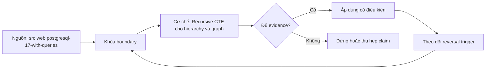

# Recursive CTE cho hierarchy và graph

> [!abstract] Câu hỏi trung tâm
> Anchor tạo frontier ban đầu nào, recursive term mở rộng theo edge nào, khi nào dừng, cách nào ngăn cycle, và output được kiểm chứng thế nào?

## 1. Mô hình dữ liệu trước cú pháp

Hierarchy là graph có ràng buộc mạnh hơn: thường mỗi node có tối đa một parent, có root và không có cycle. Graph tổng quát có thể nhiều parent, nhiều path và cycle. Một bảng adjacency list `edge(parent_id, child_id)` không tự đảm bảo đó là cây.

Trước khi viết recursion, xác định node identity, edge direction, loại graph, semantics của path, có cho phép node xuất hiện qua nhiều path hay không, và output grain. Một row mỗi node khác một row mỗi path tới node. Dùng `UNION` để deduplicate node có thể làm mất các path hợp lệ; dùng `UNION ALL` giữ path nhưng có thể nổ tổ hợp.

Hierarchy tổ chức, bill of materials, category tree, dependency graph và lineage graph có rule khác nhau. Không tái sử dụng query nếu chưa đối chiếu semantics.

## 2. Hình dạng recursive CTE

Recursive CTE gồm non-recursive term, toán tử `UNION` hoặc `UNION ALL`, và recursive term tham chiếu chính CTE. Anchor tạo hàng khởi đầu. Recursive term join frontier hiện tại với edge để tạo frontier tiếp theo. Engine lặp đến khi iteration không sinh row mới.

Cách đánh giá được mô tả theo working table: chạy anchor, đưa result vào output và working table; khi working table còn row, chạy recursive term với các row ấy, rồi thay bằng intermediate table. Cú pháp đệ quy nhưng evaluation là iterative.

Termination không đến từ từ khóa `RECURSIVE`; nó đến từ việc frontier cuối cùng rỗng hoặc duplicate elimination chặn row. Nếu graph cycle và state tiếp tục đổi như depth/path, `UNION` không nhất thiết dừng.

## 3. Chọn anchor đúng

Descendants của node X dùng X làm anchor, rồi join `edge.parent_id = current.node_id` để đi xuống. Ancestors đảo chiều join. Tìm mọi root dùng node không có parent làm anchor, nhưng dirty data có cycle component không có root sẽ bị bỏ sót.

Anchor phải project cùng số cột và kiểu tương thích với recursive term. Cần cast path/text/array đủ kiểu ngay anchor nếu giá trị recursive lớn hơn. PostgreSQL có thể suy luận type từ anchor và gây lỗi/truncation ở hệ khác.

Nếu anchor có duplicate, recursion nhân ngay từ vòng đầu. Assert identity hoặc deduplicate có chủ đích. Parameter root không tồn tại nên trả empty hay error là API policy, không để query quyết định ngầm.

## 4. Descendants

Output descendants thường mang root, node, parent, depth và path. Anchor có thể là root depth 0; recursive term thêm child depth+1. Quyết định có gồm root trong kết quả hay chỉ descendants phải được ghi.

Nếu cần một row/node, graph có nhiều path đòi rule chọn path: shortest depth, lexicographic, cheapest weight hoặc all paths. `DISTINCT node_id` cuối query bỏ path ngẫu nhiên nếu vẫn chọn depth khác; dùng ranking với rule rõ.

Kiểm đúng bằng fixture nhỏ vẽ tay, expected set và expected depth. Thêm leaf, node nhiều child, node nhiều parent, disconnected component, self-loop và multi-node cycle.

## 5. Ancestors

Ancestors đi ngược edge. Trong cây, mỗi node có một path lên root. Trong DAG, một node có thể có nhiều ancestors qua nhiều path. Output grain lại phải chọn node hay path.

Branch budget có thể là tổng cost trên path. Recursive state mang accumulated cost và dừng mở rộng nếu vượt budget. Nếu edge weight âm, monotonic budget assumption hỏng; query có thể cần thuật toán khác. SQL recursion không tự là shortest-path solver.

Với temporal hierarchy, edge có validity interval. Mỗi bước phải áp cùng as-of timestamp; ghép phiên bản hiện tại với lịch sử tạo path không từng tồn tại.

## 6. Depth limit

Depth limit là safety bound và đôi khi là requirement. Predicate `depth < :max_depth` phải nằm ở recursive term để ngăn sinh tầng tiếp. Lọc depth chỉ ở final SELECT không giảm work và không bảo vệ recursion.

Giới hạn độ sâu không sửa cycle; nó chỉ bảo đảm query dừng hữu hạn. Output có thể bị cắt. Trả cờ `truncated` hoặc kiểm tồn tại outgoing edge ở boundary để consumer biết kết quả chưa hoàn chỉnh.

Chọn limit theo domain hoặc budget vận hành, không số tùy ý. Organization chart có thể giới hạn thấp; lineage graph có thể sâu hơn. Log max depth quan sát và số branch bị chặn.

## 7. Cycle detection bằng path

Mang array các node đã thăm. Trước khi mở rộng child, kiểm child chưa nằm trong path. Khi phát hiện, có thể bỏ edge, phát row `is_cycle=true`, hoặc fail pipeline. Policy phụ thuộc domain: cycle trong category tree là lỗi dữ liệu; cycle trong network graph có thể hợp lệ nhưng traversal path phải tránh lặp vô hạn.

Path cần lưu identity đầy đủ. Nếu node nhận dạng bởi nhiều cột, dùng array row/composite hoặc encoded key không collision. Chỉ kiểm display name là sai.

Path làm row rộng dần và membership check có chi phí. Với graph lớn, closure table, graph engine hoặc preprocessing có thể phù hợp hơn.

## 8. UNION không phải cycle protection tổng quát

`UNION` loại duplicate complete rows giữa các iterations. Nếu row gồm `(node_id, depth)`, quay lại cùng node ở depth mới vẫn là row khác; cycle tiếp tục. Nếu row chỉ có node ID, UNION có thể dừng nhưng mất multiple-path information và các accumulated attributes.

Do đó không ghi đổi UNION ALL thành UNION là hết cycle như quy tắc chung. Cycle detection phải dựa vào visited identity/path hoặc dùng `CYCLE` clause phù hợp.

Trong PostgreSQL, cycle detection có thể viết thủ công hoặc dùng cú pháp `CYCLE`; vẫn cần hiểu cột mark/path được sinh và output semantics.

## 9. SEARCH và thứ tự output

Depth-first và breadth-first thường được biểu đạt bằng cột ordering sau khi traversal: path cho depth-first, depth cho breadth-first. PostgreSQL hỗ trợ `SEARCH DEPTH FIRST/BREADTH FIRST BY ... SET ordercol` để tạo cột sắp xếp.

Điểm quan trọng: đây là cách tính khóa để `ORDER BY`, không bảo đảm engine thật sự thăm node theo thứ tự ấy. Không dùng output order như side effect hoặc performance guarantee.

Sibling order cần tie-break ổn định như node ID. Nếu chỉ sort depth, thứ tự trong cùng tầng không xác định.

## 10. Cycle clause

`CYCLE id SET is_cycle USING path` cung cấp cơ chế theo dõi đã thăm và đánh dấu cycle. Cần đọc expansion semantics và chọn columns đại diện identity. Search depth-first và cycle path có thể trùng computation; tài liệu PostgreSQL lưu ý cân nhắc chỉ dùng cycle path rồi order.

Có cột `is_cycle` không tự quyết định xử lý. Consumer cần lọc, báo lỗi hoặc hiển thị edge gây cycle. Lưu path offending giúp remediation.

DBMS portability của `SEARCH`/`CYCLE` không đồng nhất. Nếu chương trình nhắm nhiều engine, giữ phiên bản manual và test dialect.

## 11. Thử nghiệm query không an toàn

Không chạy recursion không termination trong session không giới hạn. Trong lab, dùng database/container cô lập, transaction read-only nếu có thể, `SET LOCAL statement_timeout` ngắn, fixture rất nhỏ và giám sát. Expected result là query bị cancel bởi timeout, không phải đợi xem có treo.

Pattern parent `LIMIT` đôi khi giúp kiểm tra nhưng không phải bảo vệ production; outer sort/join có thể buộc lấy toàn bộ output trước limit. Timeout là lớp cuối, không thay cycle/depth guard.

Sau timeout, rollback transaction và xác nhận connection usable. Lưu error code/duration. Không để test làm cạn worker pool.

## 12. Bùng nổ số path

DAG không cycle vẫn có thể có số path tăng theo cấp số nhân. Path-grain output có thể khổng lồ dù số node nhỏ. Dự toán branching factor, depth và upper bound. Đặt row budget ngoài depth budget.

Nếu chỉ cần reachability, deduplicate visited nodes sớm. Nếu cần all paths, xác nhận business có thật sự cần và giới hạn. Nếu cần shortest path có weight, recursive SQL đơn giản có thể không hiệu quả hoặc không đúng với negative weights.

Theo dõi rows per iteration, max frontier, temp spill và execution time. Execution plan một mình không thể hiện mọi tăng trưởng trên data khác.

## 13. Closure table và materialized path

Closure table lưu mọi cặp ancestor-descendant cùng depth. Read descendants/ancestors nhanh và dễ constrain, nhưng update cây phải duy trì nhiều rows. Materialized path lưu đường dẫn trong node, hỗ trợ prefix query nhưng move subtree cần update paths.

Adjacency list + recursive CTE phù hợp khi write đơn giản, graph vừa và traversal linh hoạt. Closure phù hợp read-heavy, stable hierarchy. Không chọn mô hình chỉ vì query demo ngắn.

Với lineage enterprise hoặc graph lớn, graph-specific store/algorithm có thể cần thiết. Decision dựa workload, consistency, update pattern và query classes.

## 14. Kiểm chứng kết quả

Ba bài lab: descendants, ancestors và branch budget. Mỗi bài có fixture vẽ tay và expected rows. So result bằng set/path theo declared grain, không chỉ row count. Kiểm depth, path endpoints, accumulated budget và no repeated node trong safe path.

Đưa một cycle vào fixture. Safe query phải dừng, đánh dấu hoặc bỏ edge theo policy. Unsafe variant chạy dưới `statement_timeout` phải bị cancel. Đây là bằng chứng về guard, không cho phép query treo tự do.

Thêm disconnected component để chắc anchor scope đúng. Thêm diamond graph A→B, A→C, B→D, C→D để phân biệt node-grain và path-grain.

## 15. Quan sát vận hành

Production query cần giới hạn input, timeout, max depth/rows và metrics. Log root, returned nodes, max depth, truncation/cycle count, duration và query version; tránh log path nhạy cảm nếu node chứa PII.

Nếu traversal nằm trên API, pagination không đơn giản vì recursive result/order có thể đổi khi graph mutation. Snapshot/as-of hoặc version phải rõ. Cache cần invalidation theo edge changes.

Data-quality job có thể quét self-loop, cycle, orphan, multiple parent và unreachable node trước khi query phục vụ.

## 16. Anti-patterns

Các lỗi chính: không termination condition; không cycle protection; depth limit chỉ ở outer query; giả định UNION luôn chữa cycle; nhầm SEARCH với visit order; dùng recursion cho graph khổng lồ không budget; dùng display name làm identity; bỏ qua multiple paths; chạy unsafe query không timeout.

Một lỗi khác là trả path đã cắt mà không báo truncation, khiến downstream coi kết quả là đầy đủ.

## 17. Câu hỏi tự kiểm tra

1. Anchor, working table và recursive term phối hợp ra sao?
2. Vì sao `UNION` không luôn ngăn cycle?
3. Depth limit phải đặt ở đâu để giảm work?
4. Node-grain và path-grain khác nhau thế nào trên diamond graph?
5. `SEARCH` bảo đảm output ordering hay evaluation order?
6. Lab unsafe recursion cần lớp bảo vệ nào?

## 18. Giới hạn và điều chưa cho phép kết luận

- Query recursion đúng trên fixture nhỏ chưa chứng minh scale trên graph thật.
- Depth limit bảo đảm dừng nhưng có thể trả kết quả không đầy đủ.
- Path-based cycle detection tăng memory và có thể không phù hợp graph lớn.
- `SEARCH`/`CYCLE` và plan details được neo vào PostgreSQL 17.
- Knowledge note không chạy query unsafe; việc đó chỉ được phép trong lab cô lập có timeout.

## Reference
1. [[SRC-POSTGRESQL-17-WITH-QUERIES]]: recursive evaluation, search order, cycle detection và materialization.

## Source coverage

| Source slice | Nội dung phải giữ | Vị trí trong note | Trạng thái |
|---|---|---|---|
| [[SRC-POSTGRESQL-17-WITH-QUERIES]] | anchor/recursive term, working table, SEARCH, CYCLE | §§2, 7-11 | Đã giữ semantics PostgreSQL 17 |
| Tổng hợp DE-L122 | descendants, ancestors, budget, safe lab | §§3-6, 12-16 | Đã chuyển thành quy trình kiểm được |

## Key takeaways
- Trước recursion phải chốt output grain là node hay path.
- Termination cần frontier rỗng, cycle guard và safety budget; `RECURSIVE` tự nó không bảo vệ.
- `UNION` chỉ loại duplicate complete row, không phải cycle protection tổng quát.
- `SEARCH` tạo khóa sắp xếp output, không điều khiển evaluation order.
- Query cố ý không dừng chỉ được chạy trong môi trường cô lập dưới `statement_timeout`.

<!-- ATOMIC-EXECUTION-CAPSULE:START -->

## Execution capsule: kiểm chứng `wiki.database.recursive-ctes-hierarchies-graphs`

> [!important] Phân loại mệnh đề
> Với `wiki.database.recursive-ctes-hierarchies-graphs`, sơ đồ, ví dụ và artifact về **Recursive CTE cho hierarchy và graph** là **synthesis để kiểm chứng**; chúng không phải trích dẫn hay case nguyên văn của nguồn.

### Sơ đồ cơ chế và điểm kiểm soát



Đọc sơ đồ `wiki.database.recursive-ctes-hierarchies-graphs` từ trái sang phải: source chỉ cung cấp claim ban đầu cho **Recursive CTE cho hierarchy và graph**; quyết định chỉ được đi tiếp sau khi boundary, evidence và điều kiện đảo quyết định đã hiện hữu.

### Ví dụ làm việc có thể bác bỏ

**Input.** Một đội cần trả lời: Làm sao duyệt hierarchy hoặc graph bằng recursive CTE mà có termination, cycle protection, depth budget và bằng chứng kết quả? cho một phạm vi nhỏ, có owner và deadline rõ.

**Decision.** Đội áp dụng **Recursive CTE cho hierarchy và graph** trên control và variant chỉ khác một assumption; expected result và hard constraints được khóa trước khi chạy.

**Outcome.** Với `wiki.database.recursive-ctes-hierarchies-graphs`, nếu observation vi phạm hard constraint hoặc oracle độc lập không xác nhận **Recursive CTE cho hierarchy và graph**, đội thu hẹp claim hay đảo quyết định. Nếu đạt, kết luận vẫn kèm scope, version và review date; một lần thành công không được nâng thành quy luật phổ quát.

### Artifact thực thi tối thiểu

```sql
-- Verification harness for: Recursive CTE cho hierarchy và graph
WITH evidence AS (
    SELECT 'wiki.database.recursive-ctes-hierarchies-graphs' AS concept_id,
           'boundary_declared' AS check_name, 1 AS passed
    UNION ALL
    SELECT 'wiki.database.recursive-ctes-hierarchies-graphs', 'independent_oracle', 1
    UNION ALL
    SELECT 'wiki.database.recursive-ctes-hierarchies-graphs', 'reversal_trigger_recorded', 1
)
SELECT concept_id,
       MIN(passed) AS all_hard_checks_pass,
       COUNT(*) AS evidence_items
FROM evidence
GROUP BY concept_id
HAVING MIN(passed) = 1;
```

Artifact của `wiki.database.recursive-ctes-hierarchies-graphs` buộc người dùng ghi boundary, oracle và reversal trigger cho **Recursive CTE cho hierarchy và graph**. Các giá trị minh họa phải được thay bằng evidence thật trước khi dùng cho quyết định.

### Tự kiểm tra trước khi tái sử dụng

1. Bạn có thể trả lời `Làm sao duyệt hierarchy hoặc graph bằng recursive CTE mà có termination, cycle protection, depth budget và bằng chứng kết quả?` bằng một câu mà không kéo thêm concept thứ hai không?
2. Source locator nào đỡ cho claim, và phần nào chỉ là synthesis trong note?
3. Observation nào khiến bạn dừng, thu hẹp hoặc đảo quyết định?
4. Artifact nào cho phép một reviewer độc lập tái hiện kết quả?

<!-- ATOMIC-EXECUTION-CAPSULE:END -->
