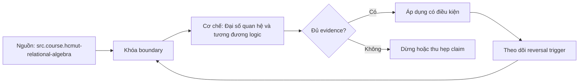

# Đại số quan hệ và tương đương logic

> [!abstract] Câu hỏi trung tâm
> Hai truy vấn viết khác nhau khi nào cho cùng multiset kết quả dưới SQL có duplicate và NULL, và phép biến đổi nào giảm cardinality trung gian mà không đổi nghĩa?

## 1. Đại số là ngôn ngữ biểu diễn, không phải thứ tự chạy

Đại số quan hệ cung cấp toán tử nhận relation và trả relation, nên biểu thức có thể lồng và biến đổi. Optimizer chuyển query thành logical tree rồi chọn physical operators. Logical tree nói kết quả cần có; physical plan nói scan, hash, sort, nested loop hoặc thuật toán cụ thể.

Không được nhìn thứ tự mệnh đề SQL rồi kết luận engine chạy tuần tự như code. Cũng không được nói mọi optimizer đều làm cùng rewrite. Mục tiêu người viết là semantics rõ, constraint đủ và biểu thức sargable; optimizer quyết định trong search space và statistics của nó.

## 2. Sáu nhóm toán tử

- Selection $\sigma_p(R)$ giữ tuple thỏa predicate p.
- Projection $\pi_A(R)$ giữ tập thuộc tính A; trong đại số set, duplicate bị loại, còn SQL `SELECT` mặc định giữ duplicate.
- Product $R\times S$ tạo mọi cặp.
- Join kết hợp product với selection và có nhiều biến thể.
- Union/difference/intersection yêu cầu union-compatible schema.
- Grouping/aggregation là mở rộng cần cho SQL analytics.

Rename giải quyết tên thuộc tính và self-join. Closure cho phép output tiếp tục làm input. Mỗi toán tử có schema, cardinality bound và duplicate semantics cần ghi.

## 3. Set semantics và SQL bag semantics

Nhiều luật algebra được phát biểu trên set. SQL không có `DISTINCT` dùng bag: projection không loại duplicate, UNION ALL khác UNION, EXCEPT ALL khác EXCEPT. NULL thêm three-valued logic. Vì vậy tương đương trong algebra chưa đủ; phải kiểm:

1. duplicate multiplicity;
2. NULL/UNKNOWN;
3. outer-join preserved side;
4. aggregate/window;
5. volatile functions và error timing;
6. ordering/limit.

Chỉ đối soát set bằng `EXCEPT` có thể bỏ sót multiplicity; dùng `EXCEPT ALL` hai chiều hoặc group theo toàn bộ cột và so count.

## 4. Selection pushdown

Nếu predicate chỉ dùng thuộc tính của R, có thể đẩy selection xuống trước join trong inner-join context:

$$
\sigma_{p(R)}(R\bowtie S) \equiv \sigma_p(R)\bowtie S
$$

Lợi ích là giảm rows trước join, memory/hash/probe và I/O. Nhưng với outer join, predicate trên null-supplying side đặt sau join có thể loại null-extended rows và đổi left join thành inner-like result. Predicate trong ON và WHERE không hoán đổi tự do.

Pushdown qua aggregate chỉ hợp lệ nếu predicate phụ thuộc grouping keys và không cần aggregate result. Điều kiện `SUM(x)>100` thuộc HAVING, không thể đẩy nguyên dạng vào WHERE.

## 5. Projection pushdown

Giữ chỉ columns cần thiết sớm giúp giảm row width, memory và I/O. Nhưng phải giữ join keys, filter columns, grouping/order keys và columns cần về sau. Projection trong SQL bag không tự DISTINCT; thêm DISTINCT để giảm row có thể đổi multiplicity và tốn sort/hash.

`SELECT *` làm dataflow rộng, coupling schema và network payload. Tuy nhiên optimizer có thể tự pruning columns; viết cột rõ vẫn cải thiện contract và tránh downstream accidental use.

## 6. Join associativity và commutativity

Inner join với điều kiện phù hợp thường cho phép reorder. Optimizer dùng statistics để đặt relation nhỏ/selective trước. Outer join, semi/anti join, lateral/correlation và volatile expressions hạn chế reorder. Join graph đúng và constraints PK/FK giúp cardinality estimation.

Người viết không tối ưu bằng đổi thứ tự FROM một cách mê tín. Hãy kiểm EXPLAIN plan và actual rows. Nếu planner chọn sai do statistics, sửa statistics/schema/predicate hoặc viết lại để lộ semantics; không dựa vào formatting.

## 7. Correlated subquery và decorrelation

Một correlated subquery có thể thực thi logic cho mỗi outer row nếu optimizer không decorrelate. Nhiều EXISTS tương đương semi-join; NOT EXISTS tương đương anti-join dưới conditions rõ. Scalar subquery đòi tối đa một row và không tự tương đương regular join nếu join nhân rows.

Viết lại cần chứng minh cardinality: subquery có unique key không, NULL behavior của IN/NOT IN ra sao, duplicate bên phải có ảnh hưởng output không. `EXISTS` chỉ quan tâm tồn tại; inner join có thể nhân left row. Không thay máy móc.

## 8. DISTINCT không phải thuốc chữa grain sai

Nếu join nhân rows vì relationship 1:N nhưng output cần grain customer, `DISTINCT` có thể che lỗi tạm thời hoặc làm mất legitimate duplicates. Phải định nghĩa grain từng input/output, aggregate/deduplicate bên N theo rule có thứ tự, hoặc dùng EXISTS nếu chỉ cần existence.

DISTINCT hợp lệ khi contract thật là set. Evidence phải có duplicate diagnostics trước và sau, không chỉ output trông đúng.

## 9. Sargability và hàm bọc cột

Predicate `date(created_at)=DATE '2026-01-01'` có thể khó dùng ordinary index hơn range:

```sql
created_at >= TIMESTAMP '2026-01-01'
AND created_at < TIMESTAMP '2026-01-02'
```

Hai dạng chỉ tương đương khi timezone/type/boundary được xác định. Expression index là alternative nhưng tăng write/storage cost. Sargability là khả năng predicate khớp access path, không phải luật tuyệt đối không dùng function.

## 10. Aggregate rewrite

Đẩy partial aggregation trước join có thể giảm rows, nhưng chỉ đúng nếu measure/grain giữ nguyên. Join 1:N trước SUM có thể nhân measure phía 1. Cách an toàn là aggregate mỗi fact ở grain mong muốn rồi join dimensions/aggregates. Filter row dùng WHERE; filter group dùng HAVING.

`COUNT(*)`, `COUNT(col)`, `COUNT(DISTINCT col)` không thay nhau. Rewrite phải giữ NULL và multiplicity.

## 11. Equivalence proof bằng dữ liệu phản ví dụ

Không chứng minh bằng một dataset thuận lợi. Bộ test tối thiểu có duplicate, NULL, no-match, multi-match, empty input, boundary date và ties. Đối soát:

```sql
(original EXCEPT ALL rewritten)
UNION ALL
(rewritten EXCEPT ALL original)
```

Kết quả rỗng trên test không phải proof hình thức, nhưng tìm được phản ví dụ. Kết hợp reasoning law + constraints + adversarial dataset + property test.

## 12. Cost evidence

`EXPLAIN (ANALYZE, BUFFERS)` có execution side effects cho DML và thực thi query; dùng môi trường an toàn. So actual rows, loops, buffers, temp spill, planning/execution time và plan shape. Estimated cost là đơn vị nội bộ, không phải millisecond và không so giữa server/config khác một cách thô.

Chạy warm/cold nhiều lần, giữ cùng dataset/config. Một run thấp hơn không đủ. Rewrite đạt bài khi result equivalence giữ và resource/time giảm có ý nghĩa trong envelope.

## 13. Ba dạng rewrite cần tự làm

1. correlated existence → EXISTS/semi-join khi semantics cho phép;
2. bỏ DISTINCT thừa chỉ sau khi constraint/grain chứng minh uniqueness;
3. biến function-wrapped indexed column thành range/type-correct predicate.

Không giả định optimizer thiếu khả năng; dùng plan để biết rewrite có thay đổi. Giá trị lớn nhất thường là làm semantics và constraints rõ hơn.

## 13.1. Case study: doanh thu và khách có giao dịch

Giả sử query lấy customer cùng doanh thu, nhưng join trực tiếp customer→orders→lines→payments. Lines và payments đều 1:N theo order nên tích chéo làm doanh thu nhân. Rewrite đúng không phải đổi thứ tự JOIN trong text hoặc thêm DISTINCT. Trước hết xác định output grain customer; aggregate lines về order, aggregate payments về order nếu measure cần, sau đó join hai relations một-row-mỗi-order rồi group customer. Algebraically, ta thay join của hai bag chi tiết bằng join của hai grouped projections có key order_id.

Nếu yêu cầu chỉ là customer có ít nhất một paid order, correlated `EXISTS` diễn đạt semi-join và giữ mỗi customer một lần. Rewrite sang inner join chỉ tương đương khi projection/multiplicity không quan trọng hoặc có uniqueness proof. Bộ test phải có customer zero, one và many paid orders; order nhiều lines/payments; duplicate business key; NULL status. Đối soát cả key counts và measure.

Plan review ghi estimated/actual rows tại từng node. Nếu estimates sai ngay ở base filter, xem statistics/skew. Nếu sai tại join dù keys đã declared, xem condition/correlation. Sau rewrite, yêu cầu không chỉ execution time thấp hơn mà intermediate rows/buffers giảm theo causal prediction. Nếu plan vốn đã decorrelate thành semi join, hai query có thể cùng plan; kết luận khi đó là optimizer đã làm rewrite, không phải bản text thứ hai nhanh hơn.

## 13.2. Hồ sơ chứng minh tương đương

Mỗi rewrite lưu original/rewrite SQL, statement về equivalence conditions, constraints được dựa vào, adversarial dataset, `EXCEPT ALL` hai chiều, aggregate checksums, plans và benchmark repetitions. Ghi những điều không được bảo đảm: output order nếu thiếu ORDER BY, volatile function calls, error timing, locks và snapshot khác nhau giữa hai lần chạy. Chạy hai query trong cùng repeatable snapshot khi cần so dữ liệu biến động.

Nếu rewrite đổi type coercion hoặc timestamp boundary, property test sinh values quanh midnight, daylight-saving transition và NULL. Nếu bỏ DISTINCT dựa trên uniqueness, thêm test migration làm constraint fail khi duplicate. Bằng chứng tốt nối luật đại số với database constraint; sample sạch đơn lẻ không đủ.

## 14. Câu hỏi tự kiểm tra

1. Projection trong algebra và SQL SELECT khác duplicate semantics thế nào?
2. Khi nào selection pushdown qua LEFT JOIN làm đổi nghĩa?
3. EXISTS và inner join khác cardinality output ra sao?
4. Vì sao EXCEPT thay vì EXCEPT ALL có thể bỏ sót lỗi multiplicity?
5. Sargability phụ thuộc type/timezone/index thế nào?
6. Estimated cost khác elapsed time ở đâu?

## 15. Giới hạn và điều chưa cho phép kết luận

- Các luật set algebra không được áp máy móc cho SQL bag/NULL semantics.
- Plan/cost là PostgreSQL-version/config/data dependent.
- Logical equivalence không hứa performance tốt hơn trên mọi distribution.
- Volatile function, error timing, LIMIT/order và concurrency có thể làm rewrite observably khác.

## Reference
1. [[SRC-HCMUT-RELATIONAL-ALGEBRA]]: PDF 4-50.
2. [[SRC-HCMUT-SQL]]: PDF 29-32, 61-79.
3. [[SRC-POSTGRESQL-17-QUERY-EXPRESSIONS]]: table expressions và SELECT processing.

## Source coverage

| Source slice | Nội dung phải giữ | Vị trí trong note | Trạng thái |
|---|---|---|---|
| [[SRC-HCMUT-RELATIONAL-ALGEBRA]], PDF 4-50 | operators, set operations và joins | §§1-6 | Đã giữ formal model và nêu bag gap |
| [[SRC-HCMUT-SQL]], PDF 29-32, 61-79 | SELECT/JOIN/GROUP semantics | §§3, 7-10 | Đã nối algebra với SQL |
| [[SRC-POSTGRESQL-17-QUERY-EXPRESSIONS]] | logical pipeline và joins | §§4, 6-7 | Đã giữ PostgreSQL scope |
| Tổng hợp DE-L115 | rewrite/proof/cost workflow | §§8-13 | Đã ghi thành evidence kiểm được |

## Key takeaways
- Logical expression không phải physical execution order.
- Tương đương phải giữ duplicate, NULL, outer-join và aggregate semantics.
- Push selection/projection chỉ khi dependency và preserved side cho phép.
- DISTINCT không sửa grain sai; EXISTS không đồng nghĩa inner join trong mọi trường hợp.
- Rewrite chỉ đạt khi vừa đối soát kết quả vừa đo plan/resource trên cùng envelope.

<!-- ATOMIC-EXECUTION-CAPSULE:START -->

## Execution capsule: kiểm chứng `wiki.database.relational-algebra-logical-equivalence`

> [!important] Phân loại mệnh đề
> Với `wiki.database.relational-algebra-logical-equivalence`, sơ đồ, ví dụ và artifact về **Đại số quan hệ và tương đương logic** là **synthesis để kiểm chứng**; chúng không phải trích dẫn hay case nguyên văn của nguồn.

### Sơ đồ cơ chế và điểm kiểm soát



Đọc sơ đồ `wiki.database.relational-algebra-logical-equivalence` từ trái sang phải: source chỉ cung cấp claim ban đầu cho **Đại số quan hệ và tương đương logic**; quyết định chỉ được đi tiếp sau khi boundary, evidence và điều kiện đảo quyết định đã hiện hữu.

### Tự kiểm tra trước khi tái sử dụng

1. Bạn có thể trả lời `Dùng đại số quan hệ và điều kiện tương đương nào để viết lại SQL đúng nghĩa nhưng giảm dữ liệu trung gian và mở đường cho optimizer?` bằng một câu mà không kéo thêm concept thứ hai không?
2. Source locator nào đỡ cho claim, và phần nào chỉ là synthesis trong note?
3. Observation nào khiến bạn dừng, thu hẹp hoặc đảo quyết định?
4. Artifact nào cho phép một reviewer độc lập tái hiện kết quả?

<!-- ATOMIC-EXECUTION-CAPSULE:END -->
