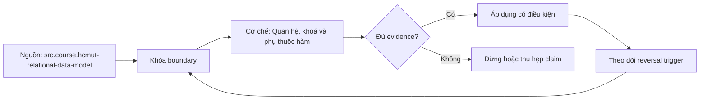

# Quan hệ, khoá và phụ thuộc hàm

> [!abstract] Câu hỏi trung tâm
> Từ quy tắc nghiệp vụ, làm sao xác định tuple nào là cùng một thực thể, thuộc tính nào quyết định thuộc tính nào, và ràng buộc nào phải được database bảo vệ trước mọi write path?

## 1. Quan hệ hình thức và bảng SQL

Một relation schema $R(A_1,\ldots,A_n)$ đặt tên tập thuộc tính và domain. Một relation state là tập tuple phù hợp schema tại một thời điểm. Trong mô hình hình thức, tuple không có thứ tự, thứ tự thuộc tính không mang ý nghĩa, và vì là tập nên không có hai tuple hoàn toàn giống nhau.

SQL table gần với relation nhưng không đồng nhất. Nếu không có key/unique constraint, table có thể chứa duplicate rows. Query result thường có bag semantics và không có thứ tự đảm bảo nếu thiếu `ORDER BY`. Vì vậy câu bảng không có thứ tự và không trùng phải tách: không có logical order là nguyên lý đúng; không trùng chỉ đúng khi schema/constraint bảo đảm hoặc đang nói relation hình thức.

`NULL` còn làm logic SQL khác logic hai giá trị của mô hình giản lược. Bài này dùng PostgreSQL 17 cho phép thử và luôn kiểm semantics constraint cụ thể.

## 2. Domain, degree và cardinality

Domain mô tả tập giá trị hợp lệ về kiểu và ý nghĩa, không chỉ kiểu vật lý. Hai cột đều `text` không có nghĩa có thể so sánh nếu một cột là email, cột kia là currency code. Degree là số thuộc tính; cardinality là số tuple trong một state. Cardinality thay đổi theo dữ liệu; degree thay đổi theo schema evolution.

Domain constraint có thể biểu diễn bằng type, NOT NULL, CHECK, FK hoặc domain type. CHECK phù hợp điều kiện trên một row; PostgreSQL không khuyến nghị dùng CHECK để tham chiếu tùy ý sang row khác vì dump/restore và thay đổi dữ liệu có thể phá giả định.

## 3. Superkey, candidate key và primary key

Superkey là tập thuộc tính xác định duy nhất tuple trong mọi state hợp lệ. Candidate key là superkey tối thiểu: bỏ bất kỳ thuộc tính nào cũng mất tính duy nhất. Một relation có thể có nhiều candidate key. Designer chọn một primary key; các key còn lại là alternate keys và vẫn cần UNIQUE/constraint nếu là invariant.

Ví dụ `Employee(employee_id, national_id, email, name)` có thể có ba candidate key nếu nghiệp vụ cam kết cả ba trường duy nhất, ổn định và non-null theo policy. Chọn surrogate `employee_id` làm primary key không làm `national_id` hoặc normalized email hết là alternate key. Không enforce chúng cho phép duplicate business identity.

Tính tối thiểu quan trọng. `(employee_id, name)` là superkey nếu `employee_id` đã unique, nhưng không phải candidate key vì `name` thừa.

## 4. Dữ liệu mẫu chỉ bác bỏ, không chứng minh

Query `GROUP BY ... HAVING count(*) > 1` tìm duplicate hiện có. Nếu thấy duplicate, thuộc tính chắc chắn không là key của state đó. Nếu không thấy, ta chỉ biết sample hiện tại chưa có phản ví dụ; ngày mai hai khách hàng có thể cùng tên. Candidate key đến từ domain semantics và valid-state rules, sau đó sample profiling dùng để phát hiện vi phạm trước migration.

Quy trình đúng:

1. phỏng vấn/đọc contract để lập candidate;
2. kiểm minimality về mặt nghiệp vụ;
3. profile dữ liệu cho null/duplicate/format;
4. làm sạch hoặc quyết định exception;
5. thêm constraint;
6. tạo write path thứ hai để chứng minh DB chặn vi phạm.

## 5. Functional dependency

Với relation schema $R$, $X \to Y$ nghĩa là trong **mọi relation state hợp lệ**, hai tuple bằng nhau trên $X$ thì cũng bằng nhau trên $Y$. Đây là phát biểu về semantics của valid states, không chỉ correlation của dataset hôm nay.

Candidate key $K$ xác định mọi thuộc tính của relation: $K \to R$. Nhưng determinant không nhất thiết là key; `postal_code -> province` có thể đúng trong một domain cụ thể trong khi postal_code không xác định từng address. Cần ghi assumptions về quốc gia/thời kỳ.

FD trivial khi $Y \subseteq X$. Full dependency nghĩa mọi thuộc tính trong determinant đều cần; partial dependency tồn tại khi một phần determinant đã xác định dependent. Transitive dependency xuất hiện khi $X\to Y$ và $Y\to Z$, khiến $X\to Z$ qua $Y$ trong điều kiện phù hợp.

## 6. Armstrong axioms và suy diễn

Ba tiên đề sound và complete cho FD implication:

- reflexivity: nếu $Y\subseteq X$ thì $X\to Y$;
- augmentation: $X\to Y$ suy ra $XZ\to YZ$;
- transitivity: $X\to Y$ và $Y\to Z$ suy ra $X\to Z$.

Từ đó có union, decomposition và pseudotransitivity. Chúng giúp trả lời một FD có được suy ra từ tập $F$ hay không, thay vì kiểm vài dòng dữ liệu.

## 7. Attribute closure để tìm key

$X^+$ dưới $F$ là tập thuộc tính suy ra từ $X$. Khởi tạo $X^+=X$; lặp qua mỗi $Y\to Z$, nếu $Y\subseteq X^+$ thì thêm $Z$; dừng khi không đổi. Nếu $X^+$ chứa toàn bộ thuộc tính của $R$, $X$ là superkey. Sau đó bỏ lần lượt thuộc tính để kiểm minimality.

Ví dụ $R(A,B,C,D)$ với $A\to B$, $B\to C$, $AC\to D$. $A^+$ nhận B, rồi C, sau đó vì có A và C nhận D; vậy A là key. Kết luận này dựa trên FDs giả định đúng, không dựa vào row count.

## 8. Constraint mapping trong PostgreSQL

- `PRIMARY KEY`: unique + not null, một primary key được chỉ định cho table.
- `UNIQUE`: bảo vệ alternate key; semantics với NULL cần kiểm, có thể dùng `NULLS NOT DISTINCT` nếu contract yêu cầu.
- `NOT NULL`: thuộc tính bắt buộc.
- `FOREIGN KEY`: giá trị tham chiếu phải tồn tại theo action policy.
- `CHECK`: predicate cục bộ phù hợp row.

FD tổng quát không phải lúc nào biểu diễn bằng một constraint đơn giản. Có thể cần decomposition, reference table, trigger cẩn trọng hoặc transaction logic. Ưu tiên schema làm trạng thái sai khó biểu diễn.

## 9. Database constraint và application validation

Application validation cho error message sớm và domain UX. Database constraint là tuyến cuối cho mọi write path: API khác, migration, import, admin tool và concurrent request. Chỉ validation ứng dụng tạo race check-then-insert và dễ bị bypass.

Hai tầng nên dùng cùng invariant. App có thể kiểm trước, nhưng vẫn bắt unique/FK/check violation và ánh xạ thành domain error. Không bỏ constraint vì service duy nhất đang ghi; hệ thống tiến hoá và script vận hành vẫn là write path.

## 10. Surrogate và natural key

Surrogate key nhỏ, ổn định và thuận tiện join. Natural key mang ý nghĩa nghiệp vụ và có thể rộng/thay đổi. Chọn surrogate primary key thường hợp lý, nhưng phải ghi natural candidate keys và enforce khi chúng thật sự là identity rule. Nếu email có thể đổi hoặc tái sử dụng, nó có thể không phải key bền; cần domain-specific identifier khác.

Không đưa dữ liệu nhạy cảm như national ID vào mọi foreign key chỉ vì natural. Dùng surrogate cho reference nhưng unique/secure alternate identity tại owner table.

## 11. Referential integrity và update semantics

Foreign key không chỉ có cột ID. Nó quy định referenced key, nullability và action khi parent update/delete: restrict, cascade, set null hay policy khác. Cascade rộng có thể xoá ngoài ý muốn; restrict có thể làm workflow khó. Quyết định dựa trên aggregate lifecycle.

Orphan query trước migration, index phục vụ join/check khi cần và transaction test cho concurrent delete/insert là phần triển khai. Constraint name phải rõ để error mapping ổn định.

## 12. Lab ba bảng

Với mỗi bảng: mô tả valid states; liệt kê superkey/candidate key; nêu FDs kèm căn cứ nghiệp vụ; chạy profiling chỉ để tìm phản ví dụ; viết DDL constraint. Sau đó tạo write path A qua application và write path B bằng SQL/import bypass application. Cả hai phải bị cùng DB invariant chặn.

Ít nhất một ví dụ có composite key để kiểm minimality, một ví dụ có surrogate + alternate natural key, và một ví dụ có FK/action. Ghi rõ constraint nào chưa biểu diễn được trực tiếp và strategy thay thế.

## 13. Lỗi thường gặp

- coi row order hiện tại là contract;
- suy ra key từ sample không duplicate;
- chọn surrogate rồi bỏ natural uniqueness;
- dùng application validation như constraint duy nhất;
- coi mọi correlation là FD;
- thêm cột thừa vào candidate key;
- dùng CHECK để kiểm cross-row invariant tùy ý;
- dùng `SELECT *`/không `ORDER BY` rồi dựa vào vị trí row.

## 14. Câu hỏi tự kiểm tra

1. Một tập thuộc tính unique trong sample khác candidate key về lượng từ nào?
2. Vì sao mọi candidate key là superkey nhưng không phải mọi superkey là candidate key?
3. Tính $X^+$ theo Armstrong axioms giúp kiểm điều gì?
4. Surrogate primary key có làm natural alternate key biến mất không?
5. Write path thứ hai chứng minh vai trò database constraint thế nào?

## 15. Giới hạn và điều chưa cho phép kết luận

- Note chưa đi sâu normalization/decomposition; phần đó thuộc các lesson sau.
- FD phải dựa trên domain semantics; các ví dụ chỉ minh hoạ cách suy diễn.
- PostgreSQL 17 là DBMS kiểm chứng; NULL, deferred constraint và index behavior phải kiểm lại khi đổi hệ.
- Không quan sát duplicate trong sample không chứng minh uniqueness ở mọi valid state.

## Source coverage

| Source slice | Nội dung phải giữ | Vị trí trong note | Trạng thái |
|---|---|---|---|
| [[SRC-HCMUT-RELATIONAL-DATA-MODEL]], PDF 4-28 | relation, tuple, domain, keys và integrity | §§1-3, 8, 11 | Đã giữ và tách khỏi SQL bag semantics |
| [[SRC-HCMUT-FUNCTIONAL-DEPENDENCIES]], PDF 5-37 | FD, Armstrong axioms và closure | §§5-7 | Đã trình bày, không suy từ sample |
| [[SRC-POSTGRESQL-17-CONSTRAINTS]] | CHECK, NOT NULL, UNIQUE, PK, FK | §§8-11 | Đã ghi rõ scope PostgreSQL 17 |
| Tổng hợp DE-L113 | discovery/profile/enforcement và hai write path | §§4, 9, 12 | Đã gắn nhãn synthesis và evidence |

## Key takeaways
- Relation hình thức là set; SQL table/query có thể có duplicate và không có order mặc định.
- Candidate key là minimal superkey; surrogate PK không xoá alternate keys.
- Sample data chỉ tìm phản ví dụ, không chứng minh key hay FD.
- FD là phát biểu trên mọi valid state; closure kiểm implication/key.
- Constraint phải ở database để mọi write path cùng chịu invariant.

## Reference
1. [[SRC-HCMUT-RELATIONAL-DATA-MODEL]]: PDF 4-28.
2. [[SRC-HCMUT-FUNCTIONAL-DEPENDENCIES]]: PDF 5-37.
3. [[SRC-POSTGRESQL-17-CONSTRAINTS]]: PostgreSQL 17 constraints.

<!-- ATOMIC-EXECUTION-CAPSULE:START -->

## Execution capsule: kiểm chứng `wiki.database.relations-keys-functional-dependencies`

> [!important] Phân loại mệnh đề
> Với `wiki.database.relations-keys-functional-dependencies`, sơ đồ, ví dụ và artifact về **Quan hệ, khoá và phụ thuộc hàm** là **synthesis để kiểm chứng**; chúng không phải trích dẫn hay case nguyên văn của nguồn.

### Sơ đồ cơ chế và điểm kiểm soát



Đọc sơ đồ `wiki.database.relations-keys-functional-dependencies` từ trái sang phải: source chỉ cung cấp claim ban đầu cho **Quan hệ, khoá và phụ thuộc hàm**; quyết định chỉ được đi tiếp sau khi boundary, evidence và điều kiện đảo quyết định đã hiện hữu.

### Artifact thực thi tối thiểu

```sql
-- Verification harness for: Quan hệ, khoá và phụ thuộc hàm
WITH evidence AS (
    SELECT 'wiki.database.relations-keys-functional-dependencies' AS concept_id,
           'boundary_declared' AS check_name, 1 AS passed
    UNION ALL
    SELECT 'wiki.database.relations-keys-functional-dependencies', 'independent_oracle', 1
    UNION ALL
    SELECT 'wiki.database.relations-keys-functional-dependencies', 'reversal_trigger_recorded', 1
)
SELECT concept_id,
       MIN(passed) AS all_hard_checks_pass,
       COUNT(*) AS evidence_items
FROM evidence
GROUP BY concept_id
HAVING MIN(passed) = 1;
```

Artifact của `wiki.database.relations-keys-functional-dependencies` buộc người dùng ghi boundary, oracle và reversal trigger cho **Quan hệ, khoá và phụ thuộc hàm**. Các giá trị minh họa phải được thay bằng evidence thật trước khi dùng cho quyết định.

### Tự kiểm tra trước khi tái sử dụng

1. Bạn có thể trả lời `Phân biệt quan hệ hình thức với bảng SQL, xác định candidate key và functional dependency thế nào để đặt đúng ràng buộc trong database?` bằng một câu mà không kéo thêm concept thứ hai không?
2. Source locator nào đỡ cho claim, và phần nào chỉ là synthesis trong note?
3. Observation nào khiến bạn dừng, thu hẹp hoặc đảo quyết định?
4. Artifact nào cho phép một reviewer độc lập tái hiện kết quả?

<!-- ATOMIC-EXECUTION-CAPSULE:END -->
