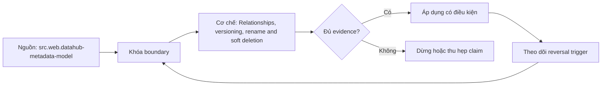

# Relationships, versioning, rename and soft deletion

> [!abstract] Câu hỏi trung tâm
> Metadata graph xử lý relationship versioning, rename và soft deletion mà không mất lịch sử hay tạo ghost edge ra sao?

## 1. Typed relationships

Edge có source, target, type, direction, valid/effective time và producer; generic related-to khó vận hành. Đừng bắt đầu bằng tên công cụ. Hãy bắt đầu bằng đối tượng được bảo vệ, boundary quan sát được và hậu quả nếu kết luận sai. Trong bài `Relationships, versioning, rename and soft deletion`, câu hỏi thực dụng là: Metadata graph xử lý relationship versioning, rename và soft deletion mà không mất lịch sử hay tạo ghost edge ra sao? Ta ghi rõ grain, population, time window, owner và hành động sau failure; nếu một trường chưa biết thì đánh dấu unknown thay vì lấp bằng mặc định. Bằng chứng tối thiểu gồm fixture có version, cấu hình hoặc rule đã resolve, raw observation, expected result và limitation. Phần này là curriculum synthesis dựa trên các nguồn đã định danh, không phải lời hứa rằng mọi adapter hay deployment đều có cùng hành vi.

## 2. Aspect versioning

Latest state phục vụ search nhưng change log hoặc version record cần cho audit và time-aware reasoning. Điểm khó không nằm ở cú pháp mà ở identity và scope. Hai phép đo cùng tên vẫn có thể nói về hai population hoặc hai thời điểm khác nhau. Trong bài `Relationships, versioning, rename and soft deletion`, câu hỏi thực dụng là: Metadata graph xử lý relationship versioning, rename và soft deletion mà không mất lịch sử hay tạo ghost edge ra sao? Ta ghi rõ grain, population, time window, owner và hành động sau failure; nếu một trường chưa biết thì đánh dấu unknown thay vì lấp bằng mặc định. Bằng chứng tối thiểu gồm fixture có version, cấu hình hoặc rule đã resolve, raw observation, expected result và limitation. Phần này là curriculum synthesis dựa trên các nguồn đã định danh, không phải lời hứa rằng mọi adapter hay deployment đều có cùng hành vi.

## 3. Rename semantics

Rename có thể là identity-preserving alias hoặc delete/create tùy source; connector không được tự chọn khi thiếu native signal. Một dashboard xanh chỉ là tín hiệu. Muốn biến nó thành bằng chứng phải giữ input, phiên bản, rule, trạng thái trước–sau và cách tính độc lập. Trong bài `Relationships, versioning, rename and soft deletion`, câu hỏi thực dụng là: Metadata graph xử lý relationship versioning, rename và soft deletion mà không mất lịch sử hay tạo ghost edge ra sao? Ta ghi rõ grain, population, time window, owner và hành động sau failure; nếu một trường chưa biết thì đánh dấu unknown thay vì lấp bằng mặc định. Bằng chứng tối thiểu gồm fixture có version, cấu hình hoặc rule đã resolve, raw observation, expected result và limitation. Phần này là curriculum synthesis dựa trên các nguồn đã định danh, không phải lời hứa rằng mọi adapter hay deployment đều có cùng hành vi.

## 4. Soft deletion

Mark removed/status giữ identity và backlinks trong retention window; hard delete cần authority và impact check. Thiết kế tốt phải chịu được counterexample. Hãy chủ động tạo case sát boundary, case thiếu dữ liệu và case replay thay vì chỉ chạy happy path. Trong bài `Relationships, versioning, rename and soft deletion`, câu hỏi thực dụng là: Metadata graph xử lý relationship versioning, rename và soft deletion mà không mất lịch sử hay tạo ghost edge ra sao? Ta ghi rõ grain, population, time window, owner và hành động sau failure; nếu một trường chưa biết thì đánh dấu unknown thay vì lấp bằng mặc định. Bằng chứng tối thiểu gồm fixture có version, cấu hình hoặc rule đã resolve, raw observation, expected result và limitation. Phần này là curriculum synthesis dựa trên các nguồn đã định danh, không phải lời hứa rằng mọi adapter hay deployment đều có cùng hành vi.

## 5. Edge cleanup

Khi entity mất, stale outgoing/incoming edges cần producer-scoped reconciliation để không xóa manual annotations. Chi phí vận hành thuộc contract. Một rule đúng nhưng quá đắt, quá ồn hoặc không có owner sẽ nhanh chóng bị tắt và mất tác dụng. Trong bài `Relationships, versioning, rename and soft deletion`, câu hỏi thực dụng là: Metadata graph xử lý relationship versioning, rename và soft deletion mà không mất lịch sử hay tạo ghost edge ra sao? Ta ghi rõ grain, population, time window, owner và hành động sau failure; nếu một trường chưa biết thì đánh dấu unknown thay vì lấp bằng mặc định. Bằng chứng tối thiểu gồm fixture có version, cấu hình hoặc rule đã resolve, raw observation, expected result và limitation. Phần này là curriculum synthesis dựa trên các nguồn đã định danh, không phải lời hứa rằng mọi adapter hay deployment đều có cùng hành vi.

## 6. Lifecycle tests

Rename, move, delete, recreate và out-of-order events được replay để kiểm search, lineage và historical trace. Kết luận cần có điều kiện đảo chiều. Khi volume, latency, nguồn thẩm quyền hoặc topology đổi, quyết định cũ phải được xem xét lại bằng cùng một oracle. Trong bài `Relationships, versioning, rename and soft deletion`, câu hỏi thực dụng là: Metadata graph xử lý relationship versioning, rename và soft deletion mà không mất lịch sử hay tạo ghost edge ra sao? Ta ghi rõ grain, population, time window, owner và hành động sau failure; nếu một trường chưa biết thì đánh dấu unknown thay vì lấp bằng mặc định. Bằng chứng tối thiểu gồm fixture có version, cấu hình hoặc rule đã resolve, raw observation, expected result và limitation. Phần này là curriculum synthesis dựa trên các nguồn đã định danh, không phải lời hứa rằng mọi adapter hay deployment đều có cùng hành vi.

## 7. Ma trận kiểm chứng từng mệnh đề

Với `wiki.metadata.relationships-versioning-lifecycle`, command thành công không tự chứng minh dữ liệu đúng. Protocol riêng của bài là: Dựng fixture có identity và version rõ, inject defect/lifecycle event rồi so canonical graph hoặc recovery state với expected manifest. Mỗi probe dưới đây phải nối input boundary với failure signal và oracle có thể phản bác kết luận.

### 7.1. Relationships, versioning, rename and soft deletion: kiểm `Typed relationships` bằng case 1, cụ thể edge có source, target, type, direction, valid/effective time và producer; generic related-to khó vận hành

**Mệnh đề cần kiểm.** Relationships, versioning, rename and soft deletion: kiểm `Typed relationships` bằng case 1, cụ thể edge có source, target, type, direction, valid/effective time và producer; generic related-to khó vận hành.

**Thiết kế phép thử cho `wiki.metadata.relationships-versioning-lifecycle`.** Trong ngữ cảnh `wiki.metadata.relationships-versioning-lifecycle`, tạo positive control và negative control chỉ khác đúng một điều kiện. Khóa input snapshot, phiên bản và owner của rule; chạy đúng population được bài `Relationships, versioning, rename and soft deletion` công bố.

**Bằng chứng cần giữ.** Đối với probe 1 của `Relationships, versioning, rename and soft deletion`, giữ fixture, raw failing rows và lệnh tái hiện. Nếu chưa chạy lab, ghi expected evidence và giữ trạng thái review; không biến protocol thành observation.

### 7.2. Relationships, versioning, rename and soft deletion: kiểm `Aspect versioning` bằng case 2, cụ thể latest state phục vụ search nhưng change log hoặc version record cần cho audit và time-aware reasoning

**Mệnh đề cần kiểm.** Relationships, versioning, rename and soft deletion: kiểm `Aspect versioning` bằng case 2, cụ thể latest state phục vụ search nhưng change log hoặc version record cần cho audit và time-aware reasoning.

**Thiết kế phép thử cho `wiki.metadata.relationships-versioning-lifecycle`.** Trong ngữ cảnh `wiki.metadata.relationships-versioning-lifecycle`, đổi grain nhưng giữ tổng số dòng để lộ phép đo sai cấp. Khóa input snapshot, phiên bản và owner của rule; chạy đúng population được bài `Relationships, versioning, rename and soft deletion` công bố.

**Bằng chứng cần giữ.** Đối với probe 2 của `Relationships, versioning, rename and soft deletion`, báo numerator, denominator và key set ở cả hai grain. Nếu chưa chạy lab, ghi expected evidence và giữ trạng thái review; không biến protocol thành observation.

### 7.3. Relationships, versioning, rename and soft deletion: kiểm `Rename semantics` bằng case 3, cụ thể rename có thể là identity-preserving alias hoặc delete/create tùy source; connector không được tự chọn khi thiếu native signal

**Mệnh đề cần kiểm.** Relationships, versioning, rename and soft deletion: kiểm `Rename semantics` bằng case 3, cụ thể rename có thể là identity-preserving alias hoặc delete/create tùy source; connector không được tự chọn khi thiếu native signal.

**Thiết kế phép thử cho `wiki.metadata.relationships-versioning-lifecycle`.** Trong ngữ cảnh `wiki.metadata.relationships-versioning-lifecycle`, đưa một giá trị tới đúng boundary và một giá trị vượt boundary. Khóa input snapshot, phiên bản và owner của rule; chạy đúng population được bài `Relationships, versioning, rename and soft deletion` công bố.

**Bằng chứng cần giữ.** Đối với probe 3 của `Relationships, versioning, rename and soft deletion`, lưu hai observed values cùng rule đã resolve. Nếu chưa chạy lab, ghi expected evidence và giữ trạng thái review; không biến protocol thành observation.

### 7.4. Relationships, versioning, rename and soft deletion: kiểm `Soft deletion` bằng case 4, cụ thể mark removed/status giữ identity và backlinks trong retention window; hard delete cần authority và impact check

**Mệnh đề cần kiểm.** Relationships, versioning, rename and soft deletion: kiểm `Soft deletion` bằng case 4, cụ thể mark removed/status giữ identity và backlinks trong retention window; hard delete cần authority và impact check.

**Thiết kế phép thử cho `wiki.metadata.relationships-versioning-lifecycle`.** Trong ngữ cảnh `wiki.metadata.relationships-versioning-lifecycle`, kill tiến trình ngay trước rồi ngay sau durable side effect. Khóa input snapshot, phiên bản và owner của rule; chạy đúng population được bài `Relationships, versioning, rename and soft deletion` công bố.

**Bằng chứng cần giữ.** Đối với probe 4 của `Relationships, versioning, rename and soft deletion`, lưu checkpoint, external ledger và trạng thái sau restart. Nếu chưa chạy lab, ghi expected evidence và giữ trạng thái review; không biến protocol thành observation.

### 7.5. Relationships, versioning, rename and soft deletion: kiểm `Edge cleanup` bằng case 5, cụ thể khi entity mất, stale outgoing/incoming edges cần producer-scoped reconciliation để không xóa manual annotations

**Mệnh đề cần kiểm.** Relationships, versioning, rename and soft deletion: kiểm `Edge cleanup` bằng case 5, cụ thể khi entity mất, stale outgoing/incoming edges cần producer-scoped reconciliation để không xóa manual annotations.

**Thiết kế phép thử cho `wiki.metadata.relationships-versioning-lifecycle`.** Trong ngữ cảnh `wiki.metadata.relationships-versioning-lifecycle`, đảo thứ tự input và concurrency nhưng giữ logical population. Khóa input snapshot, phiên bản và owner của rule; chạy đúng population được bài `Relationships, versioning, rename and soft deletion` công bố.

**Bằng chứng cần giữ.** Đối với probe 5 của `Relationships, versioning, rename and soft deletion`, so canonical hash và business totals giữa các thứ tự. Nếu chưa chạy lab, ghi expected evidence và giữ trạng thái review; không biến protocol thành observation.

### 7.6. Relationships, versioning, rename and soft deletion: kiểm `Lifecycle tests` bằng case 6, cụ thể rename, move, delete, recreate và out-of-order events được replay để kiểm search, lineage và historical trace

**Mệnh đề cần kiểm.** Relationships, versioning, rename and soft deletion: kiểm `Lifecycle tests` bằng case 6, cụ thể rename, move, delete, recreate và out-of-order events được replay để kiểm search, lineage và historical trace.

**Thiết kế phép thử cho `wiki.metadata.relationships-versioning-lifecycle`.** Trong ngữ cảnh `wiki.metadata.relationships-versioning-lifecycle`, replay cùng identity với payload giống rồi payload xung đột. Khóa input snapshot, phiên bản và owner của rule; chạy đúng population được bài `Relationships, versioning, rename and soft deletion` công bố.

**Bằng chứng cần giữ.** Đối với probe 6 của `Relationships, versioning, rename and soft deletion`, tách duplicate replay khỏi identity collision bằng reason code. Nếu chưa chạy lab, ghi expected evidence và giữ trạng thái review; không biến protocol thành observation.

### 7.7. Relationships, versioning, rename and soft deletion: kiểm `Typed relationships` bằng case 7, cụ thể edge có source, target, type, direction, valid/effective time và producer; generic related-to khó vận hành

**Mệnh đề cần kiểm.** Relationships, versioning, rename and soft deletion: kiểm `Typed relationships` bằng case 7, cụ thể edge có source, target, type, direction, valid/effective time và producer; generic related-to khó vận hành.

**Thiết kế phép thử cho `wiki.metadata.relationships-versioning-lifecycle`.** Trong ngữ cảnh `wiki.metadata.relationships-versioning-lifecycle`, thêm record tới trễ trong horizon và ngoài horizon. Khóa input snapshot, phiên bản và owner của rule; chạy đúng population được bài `Relationships, versioning, rename and soft deletion` công bố.

**Bằng chứng cần giữ.** Đối với probe 7 của `Relationships, versioning, rename and soft deletion`, báo accepted-late, rejected-late và oldest outstanding timestamp. Nếu chưa chạy lab, ghi expected evidence và giữ trạng thái review; không biến protocol thành observation.

### 7.8. Relationships, versioning, rename and soft deletion: kiểm `Aspect versioning` bằng case 8, cụ thể latest state phục vụ search nhưng change log hoặc version record cần cho audit và time-aware reasoning

**Mệnh đề cần kiểm.** Relationships, versioning, rename and soft deletion: kiểm `Aspect versioning` bằng case 8, cụ thể latest state phục vụ search nhưng change log hoặc version record cần cho audit và time-aware reasoning.

**Thiết kế phép thử cho `wiki.metadata.relationships-versioning-lifecycle`.** Trong ngữ cảnh `wiki.metadata.relationships-versioning-lifecycle`, đổi schema theo một cách tương thích rồi một cách phá vỡ semantics. Khóa input snapshot, phiên bản và owner của rule; chạy đúng population được bài `Relationships, versioning, rename and soft deletion` công bố.

**Bằng chứng cần giữ.** Đối với probe 8 của `Relationships, versioning, rename and soft deletion`, giữ schema diff, classification và consumer-visible result. Nếu chưa chạy lab, ghi expected evidence và giữ trạng thái review; không biến protocol thành observation.

### 7.9. Relationships, versioning, rename and soft deletion: kiểm `Rename semantics` bằng case 9, cụ thể rename có thể là identity-preserving alias hoặc delete/create tùy source; connector không được tự chọn khi thiếu native signal

**Mệnh đề cần kiểm.** Relationships, versioning, rename and soft deletion: kiểm `Rename semantics` bằng case 9, cụ thể rename có thể là identity-preserving alias hoặc delete/create tùy source; connector không được tự chọn khi thiếu native signal.

**Thiết kế phép thử cho `wiki.metadata.relationships-versioning-lifecycle`.** Trong ngữ cảnh `wiki.metadata.relationships-versioning-lifecycle`, tạo missing và duplicate bù nhau để count tổng không đổi. Khóa input snapshot, phiên bản và owner của rule; chạy đúng population được bài `Relationships, versioning, rename and soft deletion` công bố.

**Bằng chứng cần giữ.** Đối với probe 9 của `Relationships, versioning, rename and soft deletion`, so key multiset và typed hashes thay vì chỉ row count. Nếu chưa chạy lab, ghi expected evidence và giữ trạng thái review; không biến protocol thành observation.

### 7.10. Relationships, versioning, rename and soft deletion: kiểm `Soft deletion` bằng case 10, cụ thể mark removed/status giữ identity và backlinks trong retention window; hard delete cần authority và impact check

**Mệnh đề cần kiểm.** Relationships, versioning, rename and soft deletion: kiểm `Soft deletion` bằng case 10, cụ thể mark removed/status giữ identity và backlinks trong retention window; hard delete cần authority và impact check.

**Thiết kế phép thử cho `wiki.metadata.relationships-versioning-lifecycle`.** Trong ngữ cảnh `wiki.metadata.relationships-versioning-lifecycle`, cho reviewer tái hiện chỉ từ evidence package. Khóa input snapshot, phiên bản và owner của rule; chạy đúng population được bài `Relationships, versioning, rename and soft deletion` công bố.

**Bằng chứng cần giữ.** Đối với probe 10 của `Relationships, versioning, rename and soft deletion`, package phải đủ để người khác dựng lại decision và limitation. Nếu chưa chạy lab, ghi expected evidence và giữ trạng thái review; không biến protocol thành observation.

### 7.11. Relationships, versioning, rename and soft deletion: kiểm `Edge cleanup` bằng case 11, cụ thể khi entity mất, stale outgoing/incoming edges cần producer-scoped reconciliation để không xóa manual annotations

**Mệnh đề cần kiểm.** Relationships, versioning, rename and soft deletion: kiểm `Edge cleanup` bằng case 11, cụ thể khi entity mất, stale outgoing/incoming edges cần producer-scoped reconciliation để không xóa manual annotations.

**Thiết kế phép thử cho `wiki.metadata.relationships-versioning-lifecycle`.** Trong ngữ cảnh `wiki.metadata.relationships-versioning-lifecycle`, so với oracle độc lập không dùng chung query hoặc parser. Khóa input snapshot, phiên bản và owner của rule; chạy đúng population được bài `Relationships, versioning, rename and soft deletion` công bố.

**Bằng chứng cần giữ.** Đối với probe 11 của `Relationships, versioning, rename and soft deletion`, independent result phải khớp ở grain đã công bố. Nếu chưa chạy lab, ghi expected evidence và giữ trạng thái review; không biến protocol thành observation.

### 7.12. Relationships, versioning, rename and soft deletion: kiểm `Lifecycle tests` bằng case 12, cụ thể rename, move, delete, recreate và out-of-order events được replay để kiểm search, lineage và historical trace

**Mệnh đề cần kiểm.** Relationships, versioning, rename and soft deletion: kiểm `Lifecycle tests` bằng case 12, cụ thể rename, move, delete, recreate và out-of-order events được replay để kiểm search, lineage và historical trace.

**Thiết kế phép thử cho `wiki.metadata.relationships-versioning-lifecycle`.** Trong ngữ cảnh `wiki.metadata.relationships-versioning-lifecycle`, chạy scope hẹp và population đầy đủ rồi công bố phần bị loại. Khóa input snapshot, phiên bản và owner của rule; chạy đúng population được bài `Relationships, versioning, rename and soft deletion` công bố.

**Bằng chứng cần giữ.** Đối với probe 12 của `Relationships, versioning, rename and soft deletion`, coverage phải nêu rõ excluded nodes, partitions hoặc incidents. Nếu chưa chạy lab, ghi expected evidence và giữ trạng thái review; không biến protocol thành observation.

### 7.13. Relationships, versioning, rename and soft deletion: kiểm `Typed relationships` bằng case 13, cụ thể edge có source, target, type, direction, valid/effective time và producer; generic related-to khó vận hành

**Mệnh đề cần kiểm.** Relationships, versioning, rename and soft deletion: kiểm `Typed relationships` bằng case 13, cụ thể edge có source, target, type, direction, valid/effective time và producer; generic related-to khó vận hành.

**Thiết kế phép thử cho `wiki.metadata.relationships-versioning-lifecycle`.** Trong ngữ cảnh `wiki.metadata.relationships-versioning-lifecycle`, thử timezone, precision hoặc partition ở hai phía của ranh giới. Khóa input snapshot, phiên bản và owner của rule; chạy đúng population được bài `Relationships, versioning, rename and soft deletion` công bố.

**Bằng chứng cần giữ.** Đối với probe 13 của `Relationships, versioning, rename and soft deletion`, UTC/local interval và rounding policy phải hiện trong output. Nếu chưa chạy lab, ghi expected evidence và giữ trạng thái review; không biến protocol thành observation.

### 7.14. Relationships, versioning, rename and soft deletion: kiểm `Aspect versioning` bằng case 14, cụ thể latest state phục vụ search nhưng change log hoặc version record cần cho audit và time-aware reasoning

**Mệnh đề cần kiểm.** Relationships, versioning, rename and soft deletion: kiểm `Aspect versioning` bằng case 14, cụ thể latest state phục vụ search nhưng change log hoặc version record cần cho audit và time-aware reasoning.

**Thiết kế phép thử cho `wiki.metadata.relationships-versioning-lifecycle`.** Trong ngữ cảnh `wiki.metadata.relationships-versioning-lifecycle`, đổi constraint đủ lớn để quyết định phải đảo. Khóa input snapshot, phiên bản và owner của rule; chạy đúng population được bài `Relationships, versioning, rename and soft deletion` công bố.

**Bằng chứng cần giữ.** Đối với probe 14 của `Relationships, versioning, rename and soft deletion`, ADR phải lưu changed constraint và reversal threshold. Nếu chưa chạy lab, ghi expected evidence và giữ trạng thái review; không biến protocol thành observation.

### 7.15. Relationships, versioning, rename and soft deletion: kiểm `Rename semantics` bằng case 15, cụ thể rename có thể là identity-preserving alias hoặc delete/create tùy source; connector không được tự chọn khi thiếu native signal

**Mệnh đề cần kiểm.** Relationships, versioning, rename and soft deletion: kiểm `Rename semantics` bằng case 15, cụ thể rename có thể là identity-preserving alias hoặc delete/create tùy source; connector không được tự chọn khi thiếu native signal.

**Thiết kế phép thử cho `wiki.metadata.relationships-versioning-lifecycle`.** Trong ngữ cảnh `wiki.metadata.relationships-versioning-lifecycle`, chạy lại từ môi trường sạch với versions và seed đã khóa. Khóa input snapshot, phiên bản và owner của rule; chạy đúng population được bài `Relationships, versioning, rename and soft deletion` công bố.

**Bằng chứng cần giữ.** Đối với probe 15 của `Relationships, versioning, rename and soft deletion`, canonical result phải ổn định hoặc mọi nondeterminism phải được giải thích. Nếu chưa chạy lab, ghi expected evidence và giữ trạng thái review; không biến protocol thành observation.

## 8. Quy trình phản biện

1. Viết consumer-visible invariant cho `Relationships, versioning, rename and soft deletion` trước khi chọn query hoặc tool.
2. Khóa grain, identity, population, time window và authoritative source.
3. Phân biệt declared configuration, executed state và published state.
4. Chạy negative control, replay hoặc changed-assumption case phù hợp.
5. Đối soát bằng oracle độc lập; công bố coverage và phần không quan sát được.
6. Gắn owner, hành động, reversal trigger và hạn review cho kết luận.

## 9. Câu hỏi tự kiểm tra

1. `Relationships, versioning, rename and soft deletion: kiểm `Typed relationships` bằng case 1, cụ thể edge có source, target, type, direction, valid/effective time và producer; generic related-to khó vận hành` thất bại đầu tiên ở boundary nào?
2. Artifact nào mạnh nhất để trả lời `Relationships, versioning, rename and soft deletion: kiểm `Rename semantics` bằng case 3, cụ thể rename có thể là identity-preserving alias hoặc delete/create tùy source; connector không được tự chọn khi thiếu native signal`?
3. Counterexample nhỏ nhất cho `Relationships, versioning, rename and soft deletion: kiểm `Lifecycle tests` bằng case 6, cụ thể rename, move, delete, recreate và out-of-order events được replay để kiểm search, lineage và historical trace` gồm những state nào?
4. `Relationships, versioning, rename and soft deletion: kiểm `Rename semantics` bằng case 9, cụ thể rename có thể là identity-preserving alias hoặc delete/create tùy source; connector không được tự chọn khi thiếu native signal` có thể xanh giả ra sao?
5. Constraint nào khiến quyết định ở `Relationships, versioning, rename and soft deletion: kiểm `Aspect versioning` bằng case 14, cụ thể latest state phục vụ search nhưng change log hoặc version record cần cho audit và time-aware reasoning` phải đảo?
6. Phần nào của `Relationships, versioning, rename and soft deletion: kiểm `Rename semantics` bằng case 15, cụ thể rename có thể là identity-preserving alias hoặc delete/create tùy source; connector không được tự chọn khi thiếu native signal` mới là protocol, chưa phải observation?

## 10. Giới hạn và điều chưa cho phép kết luận

- Lab của `Relationships, versioning, rename and soft deletion` chưa chạy trên hệ thống production; nội dung là giáo trình và expected evidence.
- Hành vi phụ thuộc phiên bản, connector, scheduler, warehouse và catalog configuration phải được kiểm lại.
- Các ma trận, ladder và threshold do giáo trình tổng hợp không được gán nguyên văn cho vendor.
- Note giữ trạng thái `review` cho tới khi owner duyệt semantics và learner artifact.

## Reference
1. [[SRC-DATAHUB-METADATA-MODEL]]
2. [[SRC-DATAHUB-LINEAGE]]

## Source coverage

| Source slice | Nội dung sử dụng | Trạng thái |
|---|---|---|
| [[SRC-DATAHUB-METADATA-MODEL]] | Contract hoặc cơ chế liên quan trực tiếp tới `Relationships, versioning, rename and soft deletion` | Đã đọc locator; cần pin version khi chạy lab |
| [[SRC-DATAHUB-LINEAGE]] | Contract hoặc cơ chế liên quan trực tiếp tới `Relationships, versioning, rename and soft deletion` | Đã đọc locator; cần pin version khi chạy lab |

## Key takeaways
- Rename và deletion cần lifecycle semantics cùng producer-scoped edge reconciliation.
- Với `wiki.metadata.relationships-versioning-lifecycle`, quality của kết luận phụ thuộc identity, coverage và oracle chứ không phụ thuộc màu dashboard.
- Câu hỏi `Metadata graph xử lý relationship versioning, rename và soft deletion mà không mất lịch sử hay tạo ghost edge ra sao?` chỉ được trả lời trong scope và version đã ghi.
- Các source IDs `src.web.datahub-metadata-model, src.web.datahub-lineage` đặt ranh giới cho source fact; phần còn lại là synthesis có nhãn.
- Trước khi lab chạy, đây là note đã kiểm cấu trúc và provenance, chưa phải chứng nhận production.

<!-- ATOMIC-EXECUTION-CAPSULE:START -->

## Execution capsule — kiểm chứng `wiki.metadata.relationships-versioning-lifecycle`

> [!important] Phân loại mệnh đề
> Với `wiki.metadata.relationships-versioning-lifecycle`, sơ đồ, ví dụ và artifact về **Relationships, versioning, rename and soft deletion** là **synthesis để kiểm chứng**; chúng không phải trích dẫn hay case nguyên văn của nguồn.

### Sơ đồ cơ chế và điểm kiểm soát



Đọc sơ đồ `wiki.metadata.relationships-versioning-lifecycle` từ trái sang phải: source chỉ cung cấp claim ban đầu cho **Relationships, versioning, rename and soft deletion**; quyết định chỉ được đi tiếp sau khi boundary, evidence và điều kiện đảo quyết định đã hiện hữu.

### Artifact thực thi tối thiểu

```sql
-- Verification harness for: Relationships, versioning, rename and soft deletion
WITH evidence AS (
    SELECT 'wiki.metadata.relationships-versioning-lifecycle' AS concept_id,
           'boundary_declared' AS check_name, 1 AS passed
    UNION ALL
    SELECT 'wiki.metadata.relationships-versioning-lifecycle', 'independent_oracle', 1
    UNION ALL
    SELECT 'wiki.metadata.relationships-versioning-lifecycle', 'reversal_trigger_recorded', 1
)
SELECT concept_id,
       MIN(passed) AS all_hard_checks_pass,
       COUNT(*) AS evidence_items
FROM evidence
GROUP BY concept_id
HAVING MIN(passed) = 1;
```

Artifact của `wiki.metadata.relationships-versioning-lifecycle` buộc người dùng ghi boundary, oracle và reversal trigger cho **Relationships, versioning, rename and soft deletion**. Các giá trị minh họa phải được thay bằng evidence thật trước khi dùng cho quyết định.

### Tự kiểm tra trước khi tái sử dụng

1. Bạn có thể trả lời `Metadata graph xử lý relationship versioning, rename và soft deletion mà không mất lịch sử hay tạo ghost edge ra sao?` bằng một câu mà không kéo thêm concept thứ hai không?
2. Source locator nào đỡ cho claim, và phần nào chỉ là synthesis trong note?
3. Observation nào khiến bạn dừng, thu hẹp hoặc đảo quyết định?
4. Artifact nào cho phép một reviewer độc lập tái hiện kết quả?

<!-- ATOMIC-EXECUTION-CAPSULE:END -->
