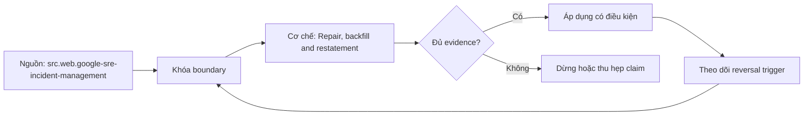

# Repair, backfill and restatement

> [!abstract] Câu hỏi trung tâm
> Chọn repair, backfill hay restatement dựa trên corrupted scope và consumer-visible history ra sao?

## 1. Scope the defect

Xác định first/last bad interval, affected keys, transformations, consumers và authoritative correction source. Đừng bắt đầu bằng tên công cụ. Hãy bắt đầu bằng đối tượng được bảo vệ, boundary quan sát được và hậu quả nếu kết luận sai. Trong bài `Repair, backfill and restatement`, câu hỏi thực dụng là: Chọn repair, backfill hay restatement dựa trên corrupted scope và consumer-visible history ra sao? Ta ghi rõ grain, population, time window, owner và hành động sau failure; nếu một trường chưa biết thì đánh dấu unknown thay vì lấp bằng mặc định. Bằng chứng tối thiểu gồm fixture có version, cấu hình hoặc rule đã resolve, raw observation, expected result và limitation. Phần này là curriculum synthesis dựa trên các nguồn đã định danh, không phải lời hứa rằng mọi adapter hay deployment đều có cùng hành vi.

## 2. Repair modes

In-place repair phù hợp state giới hạn; backfill tái xử lý intervals; rebuild/restatement thay candidate rộng hơn. Điểm khó không nằm ở cú pháp mà ở identity và scope. Hai phép đo cùng tên vẫn có thể nói về hai population hoặc hai thời điểm khác nhau. Trong bài `Repair, backfill and restatement`, câu hỏi thực dụng là: Chọn repair, backfill hay restatement dựa trên corrupted scope và consumer-visible history ra sao? Ta ghi rõ grain, population, time window, owner và hành động sau failure; nếu một trường chưa biết thì đánh dấu unknown thay vì lấp bằng mặc định. Bằng chứng tối thiểu gồm fixture có version, cấu hình hoặc rule đã resolve, raw observation, expected result và limitation. Phần này là curriculum synthesis dựa trên các nguồn đã định danh, không phải lời hứa rằng mọi adapter hay deployment đều có cùng hành vi.

## 3. Version pinning

Ghi code, config, source snapshot và reference data version dùng cho correction; latest không mặc nhiên đúng lịch sử. Một dashboard xanh chỉ là tín hiệu. Muốn biến nó thành bằng chứng phải giữ input, phiên bản, rule, trạng thái trước-sau và cách tính độc lập. Trong bài `Repair, backfill and restatement`, câu hỏi thực dụng là: Chọn repair, backfill hay restatement dựa trên corrupted scope và consumer-visible history ra sao? Ta ghi rõ grain, population, time window, owner và hành động sau failure; nếu một trường chưa biết thì đánh dấu unknown thay vì lấp bằng mặc định. Bằng chứng tối thiểu gồm fixture có version, cấu hình hoặc rule đã resolve, raw observation, expected result và limitation. Phần này là curriculum synthesis dựa trên các nguồn đã định danh, không phải lời hứa rằng mọi adapter hay deployment đều có cùng hành vi.

## 4. Isolation

Chạy vào candidate hoặc partition staging, giới hạn concurrency và bảo vệ daily path. Thiết kế tốt phải chịu được counterexample. Hãy chủ động tạo case sát boundary, case thiếu dữ liệu và case replay thay vì chỉ chạy happy path. Trong bài `Repair, backfill and restatement`, câu hỏi thực dụng là: Chọn repair, backfill hay restatement dựa trên corrupted scope và consumer-visible history ra sao? Ta ghi rõ grain, population, time window, owner và hành động sau failure; nếu một trường chưa biết thì đánh dấu unknown thay vì lấp bằng mặc định. Bằng chứng tối thiểu gồm fixture có version, cấu hình hoặc rule đã resolve, raw observation, expected result và limitation. Phần này là curriculum synthesis dựa trên các nguồn đã định danh, không phải lời hứa rằng mọi adapter hay deployment đều có cùng hành vi.

## 5. Reconcile and publish

So key sets, totals, hashes và consumer invariants; publish có atomicity hoặc explicit partial-state protocol. Chi phí vận hành thuộc contract. Một rule đúng nhưng quá đắt, quá ồn hoặc không có owner sẽ nhanh chóng bị tắt và mất tác dụng. Trong bài `Repair, backfill and restatement`, câu hỏi thực dụng là: Chọn repair, backfill hay restatement dựa trên corrupted scope và consumer-visible history ra sao? Ta ghi rõ grain, population, time window, owner và hành động sau failure; nếu một trường chưa biết thì đánh dấu unknown thay vì lấp bằng mặc định. Bằng chứng tối thiểu gồm fixture có version, cấu hình hoặc rule đã resolve, raw observation, expected result và limitation. Phần này là curriculum synthesis dựa trên các nguồn đã định danh, không phải lời hứa rằng mọi adapter hay deployment đều có cùng hành vi.

## 6. Notify and lineage

Restatement cần consumer notification, correction version, old/new lineage, rerun dependencies và closure evidence. Kết luận cần có điều kiện đảo chiều. Khi volume, latency, nguồn thẩm quyền hoặc topology đổi, quyết định cũ phải được xem xét lại bằng cùng một oracle. Trong bài `Repair, backfill and restatement`, câu hỏi thực dụng là: Chọn repair, backfill hay restatement dựa trên corrupted scope và consumer-visible history ra sao? Ta ghi rõ grain, population, time window, owner và hành động sau failure; nếu một trường chưa biết thì đánh dấu unknown thay vì lấp bằng mặc định. Bằng chứng tối thiểu gồm fixture có version, cấu hình hoặc rule đã resolve, raw observation, expected result và limitation. Phần này là curriculum synthesis dựa trên các nguồn đã định danh, không phải lời hứa rằng mọi adapter hay deployment đều có cùng hành vi.

## 7. Ma trận kiểm chứng từng mệnh đề

Với `wiki.data-quality.repair-backfill-restatement`, command thành công không tự chứng minh dữ liệu đúng. Protocol riêng của bài là: Replay một cửa sổ có good/bad events hoặc incident state, tính lại metric độc lập và kiểm action/routing đúng policy. Mỗi probe dưới đây phải nối input boundary với failure signal và oracle có thể phản bác kết luận.

### 7.1. Repair, backfill and restatement: kiểm `Scope the defect` bằng case 1, cụ thể xác định first/last bad interval, affected keys, transformations, consumers và authoritative correction source

**Mệnh đề cần kiểm.** Repair, backfill and restatement: kiểm `Scope the defect` bằng case 1, cụ thể xác định first/last bad interval, affected keys, transformations, consumers và authoritative correction source.

**Thiết kế phép thử cho `wiki.data-quality.repair-backfill-restatement`.** Trong ngữ cảnh `wiki.data-quality.repair-backfill-restatement`, tạo positive control và negative control chỉ khác đúng một điều kiện. Khóa input snapshot, phiên bản và owner của rule; chạy đúng population được bài `Repair, backfill and restatement` công bố.

**Bằng chứng cần giữ.** Đối với probe 1 của `Repair, backfill and restatement`, giữ fixture, raw failing rows và lệnh tái hiện. Nếu chưa chạy lab, ghi expected evidence và giữ trạng thái review; không biến protocol thành observation.

### 7.2. Repair, backfill and restatement: kiểm `Repair modes` bằng case 2, cụ thể in-place repair phù hợp state giới hạn; backfill tái xử lý intervals; rebuild/restatement thay candidate rộng hơn

**Mệnh đề cần kiểm.** Repair, backfill and restatement: kiểm `Repair modes` bằng case 2, cụ thể in-place repair phù hợp state giới hạn; backfill tái xử lý intervals; rebuild/restatement thay candidate rộng hơn.

**Thiết kế phép thử cho `wiki.data-quality.repair-backfill-restatement`.** Trong ngữ cảnh `wiki.data-quality.repair-backfill-restatement`, đổi grain nhưng giữ tổng số dòng để lộ phép đo sai cấp. Khóa input snapshot, phiên bản và owner của rule; chạy đúng population được bài `Repair, backfill and restatement` công bố.

**Bằng chứng cần giữ.** Đối với probe 2 của `Repair, backfill and restatement`, báo numerator, denominator và key set ở cả hai grain. Nếu chưa chạy lab, ghi expected evidence và giữ trạng thái review; không biến protocol thành observation.

### 7.3. Repair, backfill and restatement: kiểm `Version pinning` bằng case 3, cụ thể ghi code, config, source snapshot và reference data version dùng cho correction; latest không mặc nhiên đúng lịch sử

**Mệnh đề cần kiểm.** Repair, backfill and restatement: kiểm `Version pinning` bằng case 3, cụ thể ghi code, config, source snapshot và reference data version dùng cho correction; latest không mặc nhiên đúng lịch sử.

**Thiết kế phép thử cho `wiki.data-quality.repair-backfill-restatement`.** Trong ngữ cảnh `wiki.data-quality.repair-backfill-restatement`, đưa một giá trị tới đúng boundary và một giá trị vượt boundary. Khóa input snapshot, phiên bản và owner của rule; chạy đúng population được bài `Repair, backfill and restatement` công bố.

**Bằng chứng cần giữ.** Đối với probe 3 của `Repair, backfill and restatement`, lưu hai observed values cùng rule đã resolve. Nếu chưa chạy lab, ghi expected evidence và giữ trạng thái review; không biến protocol thành observation.

### 7.4. Repair, backfill and restatement: kiểm `Isolation` bằng case 4, cụ thể chạy vào candidate hoặc partition staging, giới hạn concurrency và bảo vệ daily path

**Mệnh đề cần kiểm.** Repair, backfill and restatement: kiểm `Isolation` bằng case 4, cụ thể chạy vào candidate hoặc partition staging, giới hạn concurrency và bảo vệ daily path.

**Thiết kế phép thử cho `wiki.data-quality.repair-backfill-restatement`.** Trong ngữ cảnh `wiki.data-quality.repair-backfill-restatement`, kill tiến trình ngay trước rồi ngay sau durable side effect. Khóa input snapshot, phiên bản và owner của rule; chạy đúng population được bài `Repair, backfill and restatement` công bố.

**Bằng chứng cần giữ.** Đối với probe 4 của `Repair, backfill and restatement`, lưu checkpoint, external ledger và trạng thái sau restart. Nếu chưa chạy lab, ghi expected evidence và giữ trạng thái review; không biến protocol thành observation.

### 7.5. Repair, backfill and restatement: kiểm `Reconcile and publish` bằng case 5, cụ thể so key sets, totals, hashes và consumer invariants; publish có atomicity hoặc explicit partial-state protocol

**Mệnh đề cần kiểm.** Repair, backfill and restatement: kiểm `Reconcile and publish` bằng case 5, cụ thể so key sets, totals, hashes và consumer invariants; publish có atomicity hoặc explicit partial-state protocol.

**Thiết kế phép thử cho `wiki.data-quality.repair-backfill-restatement`.** Trong ngữ cảnh `wiki.data-quality.repair-backfill-restatement`, đảo thứ tự input và concurrency nhưng giữ logical population. Khóa input snapshot, phiên bản và owner của rule; chạy đúng population được bài `Repair, backfill and restatement` công bố.

**Bằng chứng cần giữ.** Đối với probe 5 của `Repair, backfill and restatement`, so canonical hash và business totals giữa các thứ tự. Nếu chưa chạy lab, ghi expected evidence và giữ trạng thái review; không biến protocol thành observation.

### 7.6. Repair, backfill and restatement: kiểm `Notify and lineage` bằng case 6, cụ thể restatement cần consumer notification, correction version, old/new lineage, rerun dependencies và closure evidence

**Mệnh đề cần kiểm.** Repair, backfill and restatement: kiểm `Notify and lineage` bằng case 6, cụ thể restatement cần consumer notification, correction version, old/new lineage, rerun dependencies và closure evidence.

**Thiết kế phép thử cho `wiki.data-quality.repair-backfill-restatement`.** Trong ngữ cảnh `wiki.data-quality.repair-backfill-restatement`, replay cùng identity với payload giống rồi payload xung đột. Khóa input snapshot, phiên bản và owner của rule; chạy đúng population được bài `Repair, backfill and restatement` công bố.

**Bằng chứng cần giữ.** Đối với probe 6 của `Repair, backfill and restatement`, tách duplicate replay khỏi identity collision bằng reason code. Nếu chưa chạy lab, ghi expected evidence và giữ trạng thái review; không biến protocol thành observation.

### 7.7. Repair, backfill and restatement: kiểm `Scope the defect` bằng case 7, cụ thể xác định first/last bad interval, affected keys, transformations, consumers và authoritative correction source

**Mệnh đề cần kiểm.** Repair, backfill and restatement: kiểm `Scope the defect` bằng case 7, cụ thể xác định first/last bad interval, affected keys, transformations, consumers và authoritative correction source.

**Thiết kế phép thử cho `wiki.data-quality.repair-backfill-restatement`.** Trong ngữ cảnh `wiki.data-quality.repair-backfill-restatement`, thêm record tới trễ trong horizon và ngoài horizon. Khóa input snapshot, phiên bản và owner của rule; chạy đúng population được bài `Repair, backfill and restatement` công bố.

**Bằng chứng cần giữ.** Đối với probe 7 của `Repair, backfill and restatement`, báo accepted-late, rejected-late và oldest outstanding timestamp. Nếu chưa chạy lab, ghi expected evidence và giữ trạng thái review; không biến protocol thành observation.

### 7.8. Repair, backfill and restatement: kiểm `Repair modes` bằng case 8, cụ thể in-place repair phù hợp state giới hạn; backfill tái xử lý intervals; rebuild/restatement thay candidate rộng hơn

**Mệnh đề cần kiểm.** Repair, backfill and restatement: kiểm `Repair modes` bằng case 8, cụ thể in-place repair phù hợp state giới hạn; backfill tái xử lý intervals; rebuild/restatement thay candidate rộng hơn.

**Thiết kế phép thử cho `wiki.data-quality.repair-backfill-restatement`.** Trong ngữ cảnh `wiki.data-quality.repair-backfill-restatement`, đổi schema theo một cách tương thích rồi một cách phá vỡ semantics. Khóa input snapshot, phiên bản và owner của rule; chạy đúng population được bài `Repair, backfill and restatement` công bố.

**Bằng chứng cần giữ.** Đối với probe 8 của `Repair, backfill and restatement`, giữ schema diff, classification và consumer-visible result. Nếu chưa chạy lab, ghi expected evidence và giữ trạng thái review; không biến protocol thành observation.

### 7.9. Repair, backfill and restatement: kiểm `Version pinning` bằng case 9, cụ thể ghi code, config, source snapshot và reference data version dùng cho correction; latest không mặc nhiên đúng lịch sử

**Mệnh đề cần kiểm.** Repair, backfill and restatement: kiểm `Version pinning` bằng case 9, cụ thể ghi code, config, source snapshot và reference data version dùng cho correction; latest không mặc nhiên đúng lịch sử.

**Thiết kế phép thử cho `wiki.data-quality.repair-backfill-restatement`.** Trong ngữ cảnh `wiki.data-quality.repair-backfill-restatement`, tạo missing và duplicate bù nhau để count tổng không đổi. Khóa input snapshot, phiên bản và owner của rule; chạy đúng population được bài `Repair, backfill and restatement` công bố.

**Bằng chứng cần giữ.** Đối với probe 9 của `Repair, backfill and restatement`, so key multiset và typed hashes thay vì chỉ row count. Nếu chưa chạy lab, ghi expected evidence và giữ trạng thái review; không biến protocol thành observation.

### 7.10. Repair, backfill and restatement: kiểm `Isolation` bằng case 10, cụ thể chạy vào candidate hoặc partition staging, giới hạn concurrency và bảo vệ daily path

**Mệnh đề cần kiểm.** Repair, backfill and restatement: kiểm `Isolation` bằng case 10, cụ thể chạy vào candidate hoặc partition staging, giới hạn concurrency và bảo vệ daily path.

**Thiết kế phép thử cho `wiki.data-quality.repair-backfill-restatement`.** Trong ngữ cảnh `wiki.data-quality.repair-backfill-restatement`, cho reviewer tái hiện chỉ từ evidence package. Khóa input snapshot, phiên bản và owner của rule; chạy đúng population được bài `Repair, backfill and restatement` công bố.

**Bằng chứng cần giữ.** Đối với probe 10 của `Repair, backfill and restatement`, package phải đủ để người khác dựng lại decision và limitation. Nếu chưa chạy lab, ghi expected evidence và giữ trạng thái review; không biến protocol thành observation.

### 7.11. Repair, backfill and restatement: kiểm `Reconcile and publish` bằng case 11, cụ thể so key sets, totals, hashes và consumer invariants; publish có atomicity hoặc explicit partial-state protocol

**Mệnh đề cần kiểm.** Repair, backfill and restatement: kiểm `Reconcile and publish` bằng case 11, cụ thể so key sets, totals, hashes và consumer invariants; publish có atomicity hoặc explicit partial-state protocol.

**Thiết kế phép thử cho `wiki.data-quality.repair-backfill-restatement`.** Trong ngữ cảnh `wiki.data-quality.repair-backfill-restatement`, so với oracle độc lập không dùng chung query hoặc parser. Khóa input snapshot, phiên bản và owner của rule; chạy đúng population được bài `Repair, backfill and restatement` công bố.

**Bằng chứng cần giữ.** Đối với probe 11 của `Repair, backfill and restatement`, independent result phải khớp ở grain đã công bố. Nếu chưa chạy lab, ghi expected evidence và giữ trạng thái review; không biến protocol thành observation.

### 7.12. Repair, backfill and restatement: kiểm `Notify and lineage` bằng case 12, cụ thể restatement cần consumer notification, correction version, old/new lineage, rerun dependencies và closure evidence

**Mệnh đề cần kiểm.** Repair, backfill and restatement: kiểm `Notify and lineage` bằng case 12, cụ thể restatement cần consumer notification, correction version, old/new lineage, rerun dependencies và closure evidence.

**Thiết kế phép thử cho `wiki.data-quality.repair-backfill-restatement`.** Trong ngữ cảnh `wiki.data-quality.repair-backfill-restatement`, chạy scope hẹp và population đầy đủ rồi công bố phần bị loại. Khóa input snapshot, phiên bản và owner của rule; chạy đúng population được bài `Repair, backfill and restatement` công bố.

**Bằng chứng cần giữ.** Đối với probe 12 của `Repair, backfill and restatement`, coverage phải nêu rõ excluded nodes, partitions hoặc incidents. Nếu chưa chạy lab, ghi expected evidence và giữ trạng thái review; không biến protocol thành observation.

### 7.13. Repair, backfill and restatement: kiểm `Scope the defect` bằng case 13, cụ thể xác định first/last bad interval, affected keys, transformations, consumers và authoritative correction source

**Mệnh đề cần kiểm.** Repair, backfill and restatement: kiểm `Scope the defect` bằng case 13, cụ thể xác định first/last bad interval, affected keys, transformations, consumers và authoritative correction source.

**Thiết kế phép thử cho `wiki.data-quality.repair-backfill-restatement`.** Trong ngữ cảnh `wiki.data-quality.repair-backfill-restatement`, thử timezone, precision hoặc partition ở hai phía của ranh giới. Khóa input snapshot, phiên bản và owner của rule; chạy đúng population được bài `Repair, backfill and restatement` công bố.

**Bằng chứng cần giữ.** Đối với probe 13 của `Repair, backfill and restatement`, UTC/local interval và rounding policy phải hiện trong output. Nếu chưa chạy lab, ghi expected evidence và giữ trạng thái review; không biến protocol thành observation.

### 7.14. Repair, backfill and restatement: kiểm `Repair modes` bằng case 14, cụ thể in-place repair phù hợp state giới hạn; backfill tái xử lý intervals; rebuild/restatement thay candidate rộng hơn

**Mệnh đề cần kiểm.** Repair, backfill and restatement: kiểm `Repair modes` bằng case 14, cụ thể in-place repair phù hợp state giới hạn; backfill tái xử lý intervals; rebuild/restatement thay candidate rộng hơn.

**Thiết kế phép thử cho `wiki.data-quality.repair-backfill-restatement`.** Trong ngữ cảnh `wiki.data-quality.repair-backfill-restatement`, đổi constraint đủ lớn để quyết định phải đảo. Khóa input snapshot, phiên bản và owner của rule; chạy đúng population được bài `Repair, backfill and restatement` công bố.

**Bằng chứng cần giữ.** Đối với probe 14 của `Repair, backfill and restatement`, ADR phải lưu changed constraint và reversal threshold. Nếu chưa chạy lab, ghi expected evidence và giữ trạng thái review; không biến protocol thành observation.

### 7.15. Repair, backfill and restatement: kiểm `Version pinning` bằng case 15, cụ thể ghi code, config, source snapshot và reference data version dùng cho correction; latest không mặc nhiên đúng lịch sử

**Mệnh đề cần kiểm.** Repair, backfill and restatement: kiểm `Version pinning` bằng case 15, cụ thể ghi code, config, source snapshot và reference data version dùng cho correction; latest không mặc nhiên đúng lịch sử.

**Thiết kế phép thử cho `wiki.data-quality.repair-backfill-restatement`.** Trong ngữ cảnh `wiki.data-quality.repair-backfill-restatement`, chạy lại từ môi trường sạch với versions và seed đã khóa. Khóa input snapshot, phiên bản và owner của rule; chạy đúng population được bài `Repair, backfill and restatement` công bố.

**Bằng chứng cần giữ.** Đối với probe 15 của `Repair, backfill and restatement`, canonical result phải ổn định hoặc mọi nondeterminism phải được giải thích. Nếu chưa chạy lab, ghi expected evidence và giữ trạng thái review; không biến protocol thành observation.

## 8. Quy trình phản biện

1. Viết consumer-visible invariant cho `Repair, backfill and restatement` trước khi chọn query hoặc tool.
2. Khóa grain, identity, population, time window và authoritative source.
3. Phân biệt declared configuration, executed state và published state.
4. Chạy negative control, replay hoặc changed-assumption case phù hợp.
5. Đối soát bằng oracle độc lập; công bố coverage và phần không quan sát được.
6. Gắn owner, hành động, reversal trigger và hạn review cho kết luận.

## 9. Câu hỏi tự kiểm tra

1. `Repair, backfill and restatement: kiểm `Scope the defect` bằng case 1, cụ thể xác định first/last bad interval, affected keys, transformations, consumers và authoritative correction source` thất bại đầu tiên ở boundary nào?
2. Artifact nào mạnh nhất để trả lời `Repair, backfill and restatement: kiểm `Version pinning` bằng case 3, cụ thể ghi code, config, source snapshot và reference data version dùng cho correction; latest không mặc nhiên đúng lịch sử`?
3. Counterexample nhỏ nhất cho `Repair, backfill and restatement: kiểm `Notify and lineage` bằng case 6, cụ thể restatement cần consumer notification, correction version, old/new lineage, rerun dependencies và closure evidence` gồm những state nào?
4. `Repair, backfill and restatement: kiểm `Version pinning` bằng case 9, cụ thể ghi code, config, source snapshot và reference data version dùng cho correction; latest không mặc nhiên đúng lịch sử` có thể xanh giả ra sao?
5. Constraint nào khiến quyết định ở `Repair, backfill and restatement: kiểm `Repair modes` bằng case 14, cụ thể in-place repair phù hợp state giới hạn; backfill tái xử lý intervals; rebuild/restatement thay candidate rộng hơn` phải đảo?
6. Phần nào của `Repair, backfill and restatement: kiểm `Version pinning` bằng case 15, cụ thể ghi code, config, source snapshot và reference data version dùng cho correction; latest không mặc nhiên đúng lịch sử` mới là protocol, chưa phải observation?

## 10. Giới hạn và điều chưa cho phép kết luận

- Lab của `Repair, backfill and restatement` chưa chạy trên hệ thống production; nội dung là giáo trình và expected evidence.
- Hành vi phụ thuộc phiên bản, connector, scheduler, warehouse và catalog configuration phải được kiểm lại.
- Các ma trận, ladder và threshold do giáo trình tổng hợp không được gán nguyên văn cho vendor.
- Note giữ trạng thái `review` cho tới khi owner duyệt semantics và learner artifact.

## Reference
1. [[SRC-GOOGLE-SRE-INCIDENT-MANAGEMENT]]
2. [[SRC-GX-DATA-QUALITY-USE-CASES]]

## Source coverage

| Source slice | Nội dung sử dụng | Trạng thái |
|---|---|---|
| [[SRC-GOOGLE-SRE-INCIDENT-MANAGEMENT]] | Contract hoặc cơ chế liên quan trực tiếp tới `Repair, backfill and restatement` | Đã đọc locator; cần pin version khi chạy lab |
| [[SRC-GX-DATA-QUALITY-USE-CASES]] | Contract hoặc cơ chế liên quan trực tiếp tới `Repair, backfill and restatement` | Đã đọc locator; cần pin version khi chạy lab |

## Key takeaways
- Correction chỉ hoàn tất khi phạm vi, version, reconciliation và consumer restatement đều rõ.
- Với `wiki.data-quality.repair-backfill-restatement`, quality của kết luận phụ thuộc identity, coverage và oracle chứ không phụ thuộc màu dashboard.
- Câu hỏi `Chọn repair, backfill hay restatement dựa trên corrupted scope và consumer-visible history ra sao?` chỉ được trả lời trong scope và version đã ghi.
- Các source IDs `src.web.google-sre-incident-management, src.web.gx-data-quality-use-cases` đặt ranh giới cho source fact; phần còn lại là synthesis có nhãn.
- Trước khi lab chạy, đây là note đã kiểm cấu trúc và provenance, chưa phải chứng nhận production.

<!-- ATOMIC-EXECUTION-CAPSULE:START -->

## Execution capsule: kiểm chứng `wiki.data-quality.repair-backfill-restatement`

> [!important] Phân loại mệnh đề
> Với `wiki.data-quality.repair-backfill-restatement`, sơ đồ, ví dụ và artifact về **Repair, backfill and restatement** là **synthesis để kiểm chứng**; chúng không phải trích dẫn hay case nguyên văn của nguồn.

### Sơ đồ cơ chế và điểm kiểm soát



Đọc sơ đồ `wiki.data-quality.repair-backfill-restatement` từ trái sang phải: source chỉ cung cấp claim ban đầu cho **Repair, backfill and restatement**; quyết định chỉ được đi tiếp sau khi boundary, evidence và điều kiện đảo quyết định đã hiện hữu.

### Artifact thực thi tối thiểu

```sql
-- Verification harness for: Repair, backfill and restatement
WITH evidence AS (
    SELECT 'wiki.data-quality.repair-backfill-restatement' AS concept_id,
           'boundary_declared' AS check_name, 1 AS passed
    UNION ALL
    SELECT 'wiki.data-quality.repair-backfill-restatement', 'independent_oracle', 1
    UNION ALL
    SELECT 'wiki.data-quality.repair-backfill-restatement', 'reversal_trigger_recorded', 1
)
SELECT concept_id,
       MIN(passed) AS all_hard_checks_pass,
       COUNT(*) AS evidence_items
FROM evidence
GROUP BY concept_id
HAVING MIN(passed) = 1;
```

Artifact của `wiki.data-quality.repair-backfill-restatement` buộc người dùng ghi boundary, oracle và reversal trigger cho **Repair, backfill and restatement**. Các giá trị minh họa phải được thay bằng evidence thật trước khi dùng cho quyết định.

### Tự kiểm tra trước khi tái sử dụng

1. Bạn có thể trả lời `Chọn repair, backfill hay restatement dựa trên corrupted scope và consumer-visible history ra sao?` bằng một câu mà không kéo thêm concept thứ hai không?
2. Source locator nào đỡ cho claim, và phần nào chỉ là synthesis trong note?
3. Observation nào khiến bạn dừng, thu hẹp hoặc đảo quyết định?
4. Artifact nào cho phép một reviewer độc lập tái hiện kết quả?

<!-- ATOMIC-EXECUTION-CAPSULE:END -->
