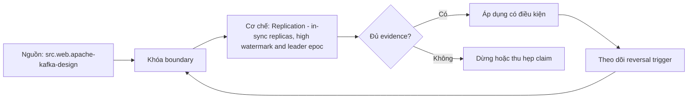

# Replication - in-sync replicas, high watermark and leader epoch

> [!abstract] Câu hỏi trung tâm
> ISR, high watermark và leader epoch phối hợp xác định committed visibility và recovery như thế nào?

## 1. Leader/follower log

Leader handles partition operations while followers fetch; replicas may have different log ends during failures. Đừng bắt đầu bằng tên công cụ. Hãy bắt đầu bằng đối tượng được bảo vệ, boundary quan sát được và hậu quả nếu kết luận sai. Trong bài `Replication - in-sync replicas, high watermark and leader epoch`, câu hỏi thực dụng là: ISR, high watermark và leader epoch phối hợp xác định committed visibility và recovery như thế nào? Ta ghi rõ grain, population, time window, owner và hành động sau failure; nếu một trường chưa biết thì đánh dấu unknown thay vì lấp bằng mặc định. Bằng chứng tối thiểu gồm fixture có version, cấu hình hoặc rule đã resolve, raw observation, expected result và limitation. Phần này là curriculum synthesis dựa trên các nguồn đã định danh, không phải lời hứa rằng mọi adapter hay deployment đều có cùng hành vi.

## 2. ISR

In-sync membership reflects lag/timing policy, not an immutable set; min ISR plus acks constrains accepted writes. Điểm khó không nằm ở cú pháp mà ở identity và scope. Hai phép đo cùng tên vẫn có thể nói về hai population hoặc hai thời điểm khác nhau. Trong bài `Replication - in-sync replicas, high watermark and leader epoch`, câu hỏi thực dụng là: ISR, high watermark và leader epoch phối hợp xác định committed visibility và recovery như thế nào? Ta ghi rõ grain, population, time window, owner và hành động sau failure; nếu một trường chưa biết thì đánh dấu unknown thay vì lấp bằng mặc định. Bằng chứng tối thiểu gồm fixture có version, cấu hình hoặc rule đã resolve, raw observation, expected result và limitation. Phần này là curriculum synthesis dựa trên các nguồn đã định danh, không phải lời hứa rằng mọi adapter hay deployment đều có cùng hành vi.

## 3. High watermark

Records below committed visibility boundary are safe for normal consumers under replication protocol; log end may be ahead. Một dashboard xanh chỉ là tín hiệu. Muốn biến nó thành bằng chứng phải giữ input, phiên bản, rule, trạng thái trước–sau và cách tính độc lập. Trong bài `Replication - in-sync replicas, high watermark and leader epoch`, câu hỏi thực dụng là: ISR, high watermark và leader epoch phối hợp xác định committed visibility và recovery như thế nào? Ta ghi rõ grain, population, time window, owner và hành động sau failure; nếu một trường chưa biết thì đánh dấu unknown thay vì lấp bằng mặc định. Bằng chứng tối thiểu gồm fixture có version, cấu hình hoặc rule đã resolve, raw observation, expected result và limitation. Phần này là curriculum synthesis dựa trên các nguồn đã định danh, không phải lời hứa rằng mọi adapter hay deployment đều có cùng hành vi.

## 4. Leader epoch

Epoch identifies leadership generation and helps detect/truncate divergent log tails after failover. Thiết kế tốt phải chịu được counterexample. Hãy chủ động tạo case sát boundary, case thiếu dữ liệu và case replay thay vì chỉ chạy happy path. Trong bài `Replication - in-sync replicas, high watermark and leader epoch`, câu hỏi thực dụng là: ISR, high watermark và leader epoch phối hợp xác định committed visibility và recovery như thế nào? Ta ghi rõ grain, population, time window, owner và hành động sau failure; nếu một trường chưa biết thì đánh dấu unknown thay vì lấp bằng mặc định. Bằng chứng tối thiểu gồm fixture có version, cấu hình hoặc rule đã resolve, raw observation, expected result và limitation. Phần này là curriculum synthesis dựa trên các nguồn đã định danh, không phải lời hứa rằng mọi adapter hay deployment đều có cùng hành vi.

## 5. Unclean election

Choosing out-of-sync replica trades availability for potential data loss; setting/version and incident evidence matter. Chi phí vận hành thuộc contract. Một rule đúng nhưng quá đắt, quá ồn hoặc không có owner sẽ nhanh chóng bị tắt và mất tác dụng. Trong bài `Replication - in-sync replicas, high watermark and leader epoch`, câu hỏi thực dụng là: ISR, high watermark và leader epoch phối hợp xác định committed visibility và recovery như thế nào? Ta ghi rõ grain, population, time window, owner và hành động sau failure; nếu một trường chưa biết thì đánh dấu unknown thay vì lấp bằng mặc định. Bằng chứng tối thiểu gồm fixture có version, cấu hình hoặc rule đã resolve, raw observation, expected result và limitation. Phần này là curriculum synthesis dựa trên các nguồn đã định danh, không phải lời hứa rằng mọi adapter hay deployment đều có cùng hành vi.

## 6. Failure lab

Pause followers, shrink ISR, append, fail leader and recover; inspect epochs, HW/LEO, acknowledged records and consumer visibility. Kết luận cần có điều kiện đảo chiều. Khi volume, latency, nguồn thẩm quyền hoặc topology đổi, quyết định cũ phải được xem xét lại bằng cùng một oracle. Trong bài `Replication - in-sync replicas, high watermark and leader epoch`, câu hỏi thực dụng là: ISR, high watermark và leader epoch phối hợp xác định committed visibility và recovery như thế nào? Ta ghi rõ grain, population, time window, owner và hành động sau failure; nếu một trường chưa biết thì đánh dấu unknown thay vì lấp bằng mặc định. Bằng chứng tối thiểu gồm fixture có version, cấu hình hoặc rule đã resolve, raw observation, expected result và limitation. Phần này là curriculum synthesis dựa trên các nguồn đã định danh, không phải lời hứa rằng mọi adapter hay deployment đều có cùng hành vi.

## 7. Ma trận kiểm chứng từng mệnh đề

Với `wiki.streaming.kafka-isr-high-watermark-epoch`, command thành công không tự chứng minh dữ liệu đúng. Protocol riêng của bài là: Chạy Kafka 4.2-compatible sandbox hoặc protocol fixture, inject precise kill/failover point and compare visible records, offsets or metadata state. Mỗi probe dưới đây phải nối input boundary với failure signal và oracle có thể phản bác kết luận.

### 7.1. Replication - in-sync replicas, high watermark and leader epoch: kiểm `Leader/follower log` bằng case 1, cụ thể leader handles partition operations while followers fetch; replicas may have different log ends during failures

**Mệnh đề cần kiểm.** Replication - in-sync replicas, high watermark and leader epoch: kiểm `Leader/follower log` bằng case 1, cụ thể leader handles partition operations while followers fetch; replicas may have different log ends during failures.

**Thiết kế phép thử cho `wiki.streaming.kafka-isr-high-watermark-epoch`.** Trong ngữ cảnh `wiki.streaming.kafka-isr-high-watermark-epoch`, tạo positive control và negative control chỉ khác đúng một điều kiện. Khóa input snapshot, phiên bản và owner của rule; chạy đúng population được bài `Replication - in-sync replicas, high watermark and leader epoch` công bố.

**Bằng chứng cần giữ.** Đối với probe 1 của `Replication - in-sync replicas, high watermark and leader epoch`, giữ fixture, raw failing rows và lệnh tái hiện. Nếu chưa chạy lab, ghi expected evidence và giữ trạng thái review; không biến protocol thành observation.

### 7.2. Replication - in-sync replicas, high watermark and leader epoch: kiểm `ISR` bằng case 2, cụ thể in-sync membership reflects lag/timing policy, not an immutable set; min isr plus acks constrains accepted writes

**Mệnh đề cần kiểm.** Replication - in-sync replicas, high watermark and leader epoch: kiểm `ISR` bằng case 2, cụ thể in-sync membership reflects lag/timing policy, not an immutable set; min isr plus acks constrains accepted writes.

**Thiết kế phép thử cho `wiki.streaming.kafka-isr-high-watermark-epoch`.** Trong ngữ cảnh `wiki.streaming.kafka-isr-high-watermark-epoch`, đổi grain nhưng giữ tổng số dòng để lộ phép đo sai cấp. Khóa input snapshot, phiên bản và owner của rule; chạy đúng population được bài `Replication - in-sync replicas, high watermark and leader epoch` công bố.

**Bằng chứng cần giữ.** Đối với probe 2 của `Replication - in-sync replicas, high watermark and leader epoch`, báo numerator, denominator và key set ở cả hai grain. Nếu chưa chạy lab, ghi expected evidence và giữ trạng thái review; không biến protocol thành observation.

### 7.3. Replication - in-sync replicas, high watermark and leader epoch: kiểm `High watermark` bằng case 3, cụ thể records below committed visibility boundary are safe for normal consumers under replication protocol; log end may be ahead

**Mệnh đề cần kiểm.** Replication - in-sync replicas, high watermark and leader epoch: kiểm `High watermark` bằng case 3, cụ thể records below committed visibility boundary are safe for normal consumers under replication protocol; log end may be ahead.

**Thiết kế phép thử cho `wiki.streaming.kafka-isr-high-watermark-epoch`.** Trong ngữ cảnh `wiki.streaming.kafka-isr-high-watermark-epoch`, đưa một giá trị tới đúng boundary và một giá trị vượt boundary. Khóa input snapshot, phiên bản và owner của rule; chạy đúng population được bài `Replication - in-sync replicas, high watermark and leader epoch` công bố.

**Bằng chứng cần giữ.** Đối với probe 3 của `Replication - in-sync replicas, high watermark and leader epoch`, lưu hai observed values cùng rule đã resolve. Nếu chưa chạy lab, ghi expected evidence và giữ trạng thái review; không biến protocol thành observation.

### 7.4. Replication - in-sync replicas, high watermark and leader epoch: kiểm `Leader epoch` bằng case 4, cụ thể epoch identifies leadership generation and helps detect/truncate divergent log tails after failover

**Mệnh đề cần kiểm.** Replication - in-sync replicas, high watermark and leader epoch: kiểm `Leader epoch` bằng case 4, cụ thể epoch identifies leadership generation and helps detect/truncate divergent log tails after failover.

**Thiết kế phép thử cho `wiki.streaming.kafka-isr-high-watermark-epoch`.** Trong ngữ cảnh `wiki.streaming.kafka-isr-high-watermark-epoch`, kill tiến trình ngay trước rồi ngay sau durable side effect. Khóa input snapshot, phiên bản và owner của rule; chạy đúng population được bài `Replication - in-sync replicas, high watermark and leader epoch` công bố.

**Bằng chứng cần giữ.** Đối với probe 4 của `Replication - in-sync replicas, high watermark and leader epoch`, lưu checkpoint, external ledger và trạng thái sau restart. Nếu chưa chạy lab, ghi expected evidence và giữ trạng thái review; không biến protocol thành observation.

### 7.5. Replication - in-sync replicas, high watermark and leader epoch: kiểm `Unclean election` bằng case 5, cụ thể choosing out-of-sync replica trades availability for potential data loss; setting/version and incident evidence matter

**Mệnh đề cần kiểm.** Replication - in-sync replicas, high watermark and leader epoch: kiểm `Unclean election` bằng case 5, cụ thể choosing out-of-sync replica trades availability for potential data loss; setting/version and incident evidence matter.

**Thiết kế phép thử cho `wiki.streaming.kafka-isr-high-watermark-epoch`.** Trong ngữ cảnh `wiki.streaming.kafka-isr-high-watermark-epoch`, đảo thứ tự input và concurrency nhưng giữ logical population. Khóa input snapshot, phiên bản và owner của rule; chạy đúng population được bài `Replication - in-sync replicas, high watermark and leader epoch` công bố.

**Bằng chứng cần giữ.** Đối với probe 5 của `Replication - in-sync replicas, high watermark and leader epoch`, so canonical hash và business totals giữa các thứ tự. Nếu chưa chạy lab, ghi expected evidence và giữ trạng thái review; không biến protocol thành observation.

### 7.6. Replication - in-sync replicas, high watermark and leader epoch: kiểm `Failure lab` bằng case 6, cụ thể pause followers, shrink isr, append, fail leader and recover; inspect epochs, hw/leo, acknowledged records and consumer visibility

**Mệnh đề cần kiểm.** Replication - in-sync replicas, high watermark and leader epoch: kiểm `Failure lab` bằng case 6, cụ thể pause followers, shrink isr, append, fail leader and recover; inspect epochs, hw/leo, acknowledged records and consumer visibility.

**Thiết kế phép thử cho `wiki.streaming.kafka-isr-high-watermark-epoch`.** Trong ngữ cảnh `wiki.streaming.kafka-isr-high-watermark-epoch`, replay cùng identity với payload giống rồi payload xung đột. Khóa input snapshot, phiên bản và owner của rule; chạy đúng population được bài `Replication - in-sync replicas, high watermark and leader epoch` công bố.

**Bằng chứng cần giữ.** Đối với probe 6 của `Replication - in-sync replicas, high watermark and leader epoch`, tách duplicate replay khỏi identity collision bằng reason code. Nếu chưa chạy lab, ghi expected evidence và giữ trạng thái review; không biến protocol thành observation.

### 7.7. Replication - in-sync replicas, high watermark and leader epoch: kiểm `Leader/follower log` bằng case 7, cụ thể leader handles partition operations while followers fetch; replicas may have different log ends during failures

**Mệnh đề cần kiểm.** Replication - in-sync replicas, high watermark and leader epoch: kiểm `Leader/follower log` bằng case 7, cụ thể leader handles partition operations while followers fetch; replicas may have different log ends during failures.

**Thiết kế phép thử cho `wiki.streaming.kafka-isr-high-watermark-epoch`.** Trong ngữ cảnh `wiki.streaming.kafka-isr-high-watermark-epoch`, thêm record tới trễ trong horizon và ngoài horizon. Khóa input snapshot, phiên bản và owner của rule; chạy đúng population được bài `Replication - in-sync replicas, high watermark and leader epoch` công bố.

**Bằng chứng cần giữ.** Đối với probe 7 của `Replication - in-sync replicas, high watermark and leader epoch`, báo accepted-late, rejected-late và oldest outstanding timestamp. Nếu chưa chạy lab, ghi expected evidence và giữ trạng thái review; không biến protocol thành observation.

### 7.8. Replication - in-sync replicas, high watermark and leader epoch: kiểm `ISR` bằng case 8, cụ thể in-sync membership reflects lag/timing policy, not an immutable set; min isr plus acks constrains accepted writes

**Mệnh đề cần kiểm.** Replication - in-sync replicas, high watermark and leader epoch: kiểm `ISR` bằng case 8, cụ thể in-sync membership reflects lag/timing policy, not an immutable set; min isr plus acks constrains accepted writes.

**Thiết kế phép thử cho `wiki.streaming.kafka-isr-high-watermark-epoch`.** Trong ngữ cảnh `wiki.streaming.kafka-isr-high-watermark-epoch`, đổi schema theo một cách tương thích rồi một cách phá vỡ semantics. Khóa input snapshot, phiên bản và owner của rule; chạy đúng population được bài `Replication - in-sync replicas, high watermark and leader epoch` công bố.

**Bằng chứng cần giữ.** Đối với probe 8 của `Replication - in-sync replicas, high watermark and leader epoch`, giữ schema diff, classification và consumer-visible result. Nếu chưa chạy lab, ghi expected evidence và giữ trạng thái review; không biến protocol thành observation.

### 7.9. Replication - in-sync replicas, high watermark and leader epoch: kiểm `High watermark` bằng case 9, cụ thể records below committed visibility boundary are safe for normal consumers under replication protocol; log end may be ahead

**Mệnh đề cần kiểm.** Replication - in-sync replicas, high watermark and leader epoch: kiểm `High watermark` bằng case 9, cụ thể records below committed visibility boundary are safe for normal consumers under replication protocol; log end may be ahead.

**Thiết kế phép thử cho `wiki.streaming.kafka-isr-high-watermark-epoch`.** Trong ngữ cảnh `wiki.streaming.kafka-isr-high-watermark-epoch`, tạo missing và duplicate bù nhau để count tổng không đổi. Khóa input snapshot, phiên bản và owner của rule; chạy đúng population được bài `Replication - in-sync replicas, high watermark and leader epoch` công bố.

**Bằng chứng cần giữ.** Đối với probe 9 của `Replication - in-sync replicas, high watermark and leader epoch`, so key multiset và typed hashes thay vì chỉ row count. Nếu chưa chạy lab, ghi expected evidence và giữ trạng thái review; không biến protocol thành observation.

### 7.10. Replication - in-sync replicas, high watermark and leader epoch: kiểm `Leader epoch` bằng case 10, cụ thể epoch identifies leadership generation and helps detect/truncate divergent log tails after failover

**Mệnh đề cần kiểm.** Replication - in-sync replicas, high watermark and leader epoch: kiểm `Leader epoch` bằng case 10, cụ thể epoch identifies leadership generation and helps detect/truncate divergent log tails after failover.

**Thiết kế phép thử cho `wiki.streaming.kafka-isr-high-watermark-epoch`.** Trong ngữ cảnh `wiki.streaming.kafka-isr-high-watermark-epoch`, cho reviewer tái hiện chỉ từ evidence package. Khóa input snapshot, phiên bản và owner của rule; chạy đúng population được bài `Replication - in-sync replicas, high watermark and leader epoch` công bố.

**Bằng chứng cần giữ.** Đối với probe 10 của `Replication - in-sync replicas, high watermark and leader epoch`, package phải đủ để người khác dựng lại decision và limitation. Nếu chưa chạy lab, ghi expected evidence và giữ trạng thái review; không biến protocol thành observation.

### 7.11. Replication - in-sync replicas, high watermark and leader epoch: kiểm `Unclean election` bằng case 11, cụ thể choosing out-of-sync replica trades availability for potential data loss; setting/version and incident evidence matter

**Mệnh đề cần kiểm.** Replication - in-sync replicas, high watermark and leader epoch: kiểm `Unclean election` bằng case 11, cụ thể choosing out-of-sync replica trades availability for potential data loss; setting/version and incident evidence matter.

**Thiết kế phép thử cho `wiki.streaming.kafka-isr-high-watermark-epoch`.** Trong ngữ cảnh `wiki.streaming.kafka-isr-high-watermark-epoch`, so với oracle độc lập không dùng chung query hoặc parser. Khóa input snapshot, phiên bản và owner của rule; chạy đúng population được bài `Replication - in-sync replicas, high watermark and leader epoch` công bố.

**Bằng chứng cần giữ.** Đối với probe 11 của `Replication - in-sync replicas, high watermark and leader epoch`, independent result phải khớp ở grain đã công bố. Nếu chưa chạy lab, ghi expected evidence và giữ trạng thái review; không biến protocol thành observation.

### 7.12. Replication - in-sync replicas, high watermark and leader epoch: kiểm `Failure lab` bằng case 12, cụ thể pause followers, shrink isr, append, fail leader and recover; inspect epochs, hw/leo, acknowledged records and consumer visibility

**Mệnh đề cần kiểm.** Replication - in-sync replicas, high watermark and leader epoch: kiểm `Failure lab` bằng case 12, cụ thể pause followers, shrink isr, append, fail leader and recover; inspect epochs, hw/leo, acknowledged records and consumer visibility.

**Thiết kế phép thử cho `wiki.streaming.kafka-isr-high-watermark-epoch`.** Trong ngữ cảnh `wiki.streaming.kafka-isr-high-watermark-epoch`, chạy scope hẹp và population đầy đủ rồi công bố phần bị loại. Khóa input snapshot, phiên bản và owner của rule; chạy đúng population được bài `Replication - in-sync replicas, high watermark and leader epoch` công bố.

**Bằng chứng cần giữ.** Đối với probe 12 của `Replication - in-sync replicas, high watermark and leader epoch`, coverage phải nêu rõ excluded nodes, partitions hoặc incidents. Nếu chưa chạy lab, ghi expected evidence và giữ trạng thái review; không biến protocol thành observation.

### 7.13. Replication - in-sync replicas, high watermark and leader epoch: kiểm `Leader/follower log` bằng case 13, cụ thể leader handles partition operations while followers fetch; replicas may have different log ends during failures

**Mệnh đề cần kiểm.** Replication - in-sync replicas, high watermark and leader epoch: kiểm `Leader/follower log` bằng case 13, cụ thể leader handles partition operations while followers fetch; replicas may have different log ends during failures.

**Thiết kế phép thử cho `wiki.streaming.kafka-isr-high-watermark-epoch`.** Trong ngữ cảnh `wiki.streaming.kafka-isr-high-watermark-epoch`, thử timezone, precision hoặc partition ở hai phía của ranh giới. Khóa input snapshot, phiên bản và owner của rule; chạy đúng population được bài `Replication - in-sync replicas, high watermark and leader epoch` công bố.

**Bằng chứng cần giữ.** Đối với probe 13 của `Replication - in-sync replicas, high watermark and leader epoch`, UTC/local interval và rounding policy phải hiện trong output. Nếu chưa chạy lab, ghi expected evidence và giữ trạng thái review; không biến protocol thành observation.

### 7.14. Replication - in-sync replicas, high watermark and leader epoch: kiểm `ISR` bằng case 14, cụ thể in-sync membership reflects lag/timing policy, not an immutable set; min isr plus acks constrains accepted writes

**Mệnh đề cần kiểm.** Replication - in-sync replicas, high watermark and leader epoch: kiểm `ISR` bằng case 14, cụ thể in-sync membership reflects lag/timing policy, not an immutable set; min isr plus acks constrains accepted writes.

**Thiết kế phép thử cho `wiki.streaming.kafka-isr-high-watermark-epoch`.** Trong ngữ cảnh `wiki.streaming.kafka-isr-high-watermark-epoch`, đổi constraint đủ lớn để quyết định phải đảo. Khóa input snapshot, phiên bản và owner của rule; chạy đúng population được bài `Replication - in-sync replicas, high watermark and leader epoch` công bố.

**Bằng chứng cần giữ.** Đối với probe 14 của `Replication - in-sync replicas, high watermark and leader epoch`, ADR phải lưu changed constraint và reversal threshold. Nếu chưa chạy lab, ghi expected evidence và giữ trạng thái review; không biến protocol thành observation.

### 7.15. Replication - in-sync replicas, high watermark and leader epoch: kiểm `High watermark` bằng case 15, cụ thể records below committed visibility boundary are safe for normal consumers under replication protocol; log end may be ahead

**Mệnh đề cần kiểm.** Replication - in-sync replicas, high watermark and leader epoch: kiểm `High watermark` bằng case 15, cụ thể records below committed visibility boundary are safe for normal consumers under replication protocol; log end may be ahead.

**Thiết kế phép thử cho `wiki.streaming.kafka-isr-high-watermark-epoch`.** Trong ngữ cảnh `wiki.streaming.kafka-isr-high-watermark-epoch`, chạy lại từ môi trường sạch với versions và seed đã khóa. Khóa input snapshot, phiên bản và owner của rule; chạy đúng population được bài `Replication - in-sync replicas, high watermark and leader epoch` công bố.

**Bằng chứng cần giữ.** Đối với probe 15 của `Replication - in-sync replicas, high watermark and leader epoch`, canonical result phải ổn định hoặc mọi nondeterminism phải được giải thích. Nếu chưa chạy lab, ghi expected evidence và giữ trạng thái review; không biến protocol thành observation.

## 8. Quy trình phản biện

1. Viết consumer-visible invariant cho `Replication - in-sync replicas, high watermark and leader epoch` trước khi chọn query hoặc tool.
2. Khóa grain, identity, population, time window và authoritative source.
3. Phân biệt declared configuration, executed state và published state.
4. Chạy negative control, replay hoặc changed-assumption case phù hợp.
5. Đối soát bằng oracle độc lập; công bố coverage và phần không quan sát được.
6. Gắn owner, hành động, reversal trigger và hạn review cho kết luận.

## 9. Câu hỏi tự kiểm tra

1. `Replication - in-sync replicas, high watermark and leader epoch: kiểm `Leader/follower log` bằng case 1, cụ thể leader handles partition operations while followers fetch; replicas may have different log ends during failures` thất bại đầu tiên ở boundary nào?
2. Artifact nào mạnh nhất để trả lời `Replication - in-sync replicas, high watermark and leader epoch: kiểm `High watermark` bằng case 3, cụ thể records below committed visibility boundary are safe for normal consumers under replication protocol; log end may be ahead`?
3. Counterexample nhỏ nhất cho `Replication - in-sync replicas, high watermark and leader epoch: kiểm `Failure lab` bằng case 6, cụ thể pause followers, shrink isr, append, fail leader and recover; inspect epochs, hw/leo, acknowledged records and consumer visibility` gồm những state nào?
4. `Replication - in-sync replicas, high watermark and leader epoch: kiểm `High watermark` bằng case 9, cụ thể records below committed visibility boundary are safe for normal consumers under replication protocol; log end may be ahead` có thể xanh giả ra sao?
5. Constraint nào khiến quyết định ở `Replication - in-sync replicas, high watermark and leader epoch: kiểm `ISR` bằng case 14, cụ thể in-sync membership reflects lag/timing policy, not an immutable set; min isr plus acks constrains accepted writes` phải đảo?
6. Phần nào của `Replication - in-sync replicas, high watermark and leader epoch: kiểm `High watermark` bằng case 15, cụ thể records below committed visibility boundary are safe for normal consumers under replication protocol; log end may be ahead` mới là protocol, chưa phải observation?

## 10. Giới hạn và điều chưa cho phép kết luận

- Lab của `Replication - in-sync replicas, high watermark and leader epoch` chưa chạy trên hệ thống production; nội dung là giáo trình và expected evidence.
- Hành vi phụ thuộc phiên bản, connector, scheduler, warehouse và catalog configuration phải được kiểm lại.
- Các ma trận, ladder và threshold do giáo trình tổng hợp không được gán nguyên văn cho vendor.
- Note giữ trạng thái `review` cho tới khi owner duyệt semantics và learner artifact.

## Reference
1. [[SRC-APACHE-KAFKA-DESIGN]]
2. [[SRC-APACHE-KAFKA-BROKER-CONFIG]]

## Source coverage

| Source slice | Nội dung sử dụng | Trạng thái |
|---|---|---|
| [[SRC-APACHE-KAFKA-DESIGN]] | Contract hoặc cơ chế liên quan trực tiếp tới `Replication - in-sync replicas, high watermark and leader epoch` | Đã đọc locator; cần pin version khi chạy lab |
| [[SRC-APACHE-KAFKA-BROKER-CONFIG]] | Contract hoặc cơ chế liên quan trực tiếp tới `Replication - in-sync replicas, high watermark and leader epoch` | Đã đọc locator; cần pin version khi chạy lab |

## Key takeaways
- ISR, high watermark and leader epoch jointly govern acknowledged/visible/recovered records.
- Với `wiki.streaming.kafka-isr-high-watermark-epoch`, quality của kết luận phụ thuộc identity, coverage và oracle chứ không phụ thuộc màu dashboard.
- Câu hỏi `ISR, high watermark và leader epoch phối hợp xác định committed visibility và recovery như thế nào?` chỉ được trả lời trong scope và version đã ghi.
- Các source IDs `src.web.apache-kafka-design, src.web.apache-kafka-broker-config` đặt ranh giới cho source fact; phần còn lại là synthesis có nhãn.
- Trước khi lab chạy, đây là note đã kiểm cấu trúc và provenance, chưa phải chứng nhận production.

<!-- ATOMIC-EXECUTION-CAPSULE:START -->

## Execution capsule — kiểm chứng `wiki.streaming.kafka-isr-high-watermark-epoch`

> [!important] Phân loại mệnh đề
> Với `wiki.streaming.kafka-isr-high-watermark-epoch`, sơ đồ, ví dụ và artifact về **Replication - in-sync replicas, high watermark and leader epoch** là **synthesis để kiểm chứng**; chúng không phải trích dẫn hay case nguyên văn của nguồn.

### Sơ đồ cơ chế và điểm kiểm soát



Đọc sơ đồ `wiki.streaming.kafka-isr-high-watermark-epoch` từ trái sang phải: source chỉ cung cấp claim ban đầu cho **Replication - in-sync replicas, high watermark and leader epoch**; quyết định chỉ được đi tiếp sau khi boundary, evidence và điều kiện đảo quyết định đã hiện hữu.

### Artifact thực thi tối thiểu

```sql
-- Verification harness for: Replication - in-sync replicas, high watermark and leader epoch
WITH evidence AS (
    SELECT 'wiki.streaming.kafka-isr-high-watermark-epoch' AS concept_id,
           'boundary_declared' AS check_name, 1 AS passed
    UNION ALL
    SELECT 'wiki.streaming.kafka-isr-high-watermark-epoch', 'independent_oracle', 1
    UNION ALL
    SELECT 'wiki.streaming.kafka-isr-high-watermark-epoch', 'reversal_trigger_recorded', 1
)
SELECT concept_id,
       MIN(passed) AS all_hard_checks_pass,
       COUNT(*) AS evidence_items
FROM evidence
GROUP BY concept_id
HAVING MIN(passed) = 1;
```

Artifact của `wiki.streaming.kafka-isr-high-watermark-epoch` buộc người dùng ghi boundary, oracle và reversal trigger cho **Replication - in-sync replicas, high watermark and leader epoch**. Các giá trị minh họa phải được thay bằng evidence thật trước khi dùng cho quyết định.

### Tự kiểm tra trước khi tái sử dụng

1. Bạn có thể trả lời `ISR, high watermark và leader epoch phối hợp xác định committed visibility và recovery như thế nào?` bằng một câu mà không kéo thêm concept thứ hai không?
2. Source locator nào đỡ cho claim, và phần nào chỉ là synthesis trong note?
3. Observation nào khiến bạn dừng, thu hẹp hoặc đảo quyết định?
4. Artifact nào cho phép một reviewer độc lập tái hiện kết quả?

<!-- ATOMIC-EXECUTION-CAPSULE:END -->
