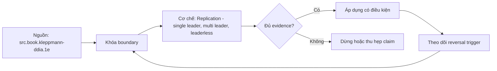

# Replication - single leader, multi leader, leaderless

> [!abstract] Câu hỏi trung tâm
> Single-leader, multi-leader và leaderless replication phân bổ write authority, conflicts và failure recovery khác nhau ra sao?

## 1. Single leader

Một write authority đơn giản hóa order nhưng failover, stale replicas và split-brain fencing vẫn khó. Đừng bắt đầu bằng tên công cụ. Hãy bắt đầu bằng đối tượng được bảo vệ, boundary quan sát được và hậu quả nếu kết luận sai. Trong bài `Replication - single leader, multi leader, leaderless`, câu hỏi thực dụng là: Single-leader, multi-leader và leaderless replication phân bổ write authority, conflicts và failure recovery khác nhau ra sao? Ta ghi rõ grain, population, time window, owner và hành động sau failure; nếu một trường chưa biết thì đánh dấu unknown thay vì lấp bằng mặc định. Bằng chứng tối thiểu gồm fixture có version, cấu hình hoặc rule đã resolve, raw observation, expected result và limitation. Phần này là curriculum synthesis dựa trên các nguồn đã định danh, không phải lời hứa rằng mọi adapter hay deployment đều có cùng hành vi.

## 2. Multi leader

Nhiều regions nhận write giảm local latency/offline constraints nhưng tạo concurrent conflicts và topology complexity. Điểm khó không nằm ở cú pháp mà ở identity và scope. Hai phép đo cùng tên vẫn có thể nói về hai population hoặc hai thời điểm khác nhau. Trong bài `Replication - single leader, multi leader, leaderless`, câu hỏi thực dụng là: Single-leader, multi-leader và leaderless replication phân bổ write authority, conflicts và failure recovery khác nhau ra sao? Ta ghi rõ grain, population, time window, owner và hành động sau failure; nếu một trường chưa biết thì đánh dấu unknown thay vì lấp bằng mặc định. Bằng chứng tối thiểu gồm fixture có version, cấu hình hoặc rule đã resolve, raw observation, expected result và limitation. Phần này là curriculum synthesis dựa trên các nguồn đã định danh, không phải lời hứa rằng mọi adapter hay deployment đều có cùng hành vi.

## 3. Leaderless

Client/coordinator gửi nhiều replicas và resolve versions; sloppy quorum, hinted handoff và read repair đổi semantics. Một dashboard xanh chỉ là tín hiệu. Muốn biến nó thành bằng chứng phải giữ input, phiên bản, rule, trạng thái trước-sau và cách tính độc lập. Trong bài `Replication - single leader, multi leader, leaderless`, câu hỏi thực dụng là: Single-leader, multi-leader và leaderless replication phân bổ write authority, conflicts và failure recovery khác nhau ra sao? Ta ghi rõ grain, population, time window, owner và hành động sau failure; nếu một trường chưa biết thì đánh dấu unknown thay vì lấp bằng mặc định. Bằng chứng tối thiểu gồm fixture có version, cấu hình hoặc rule đã resolve, raw observation, expected result và limitation. Phần này là curriculum synthesis dựa trên các nguồn đã định danh, không phải lời hứa rằng mọi adapter hay deployment đều có cùng hành vi.

## 4. Replication lag

Async replication tạo stale reads, monotonic/read-your-writes violations và recovery-point exposure. Thiết kế tốt phải chịu được counterexample. Hãy chủ động tạo case sát boundary, case thiếu dữ liệu và case replay thay vì chỉ chạy happy path. Trong bài `Replication - single leader, multi leader, leaderless`, câu hỏi thực dụng là: Single-leader, multi-leader và leaderless replication phân bổ write authority, conflicts và failure recovery khác nhau ra sao? Ta ghi rõ grain, population, time window, owner và hành động sau failure; nếu một trường chưa biết thì đánh dấu unknown thay vì lấp bằng mặc định. Bằng chứng tối thiểu gồm fixture có version, cấu hình hoặc rule đã resolve, raw observation, expected result và limitation. Phần này là curriculum synthesis dựa trên các nguồn đã định danh, không phải lời hứa rằng mọi adapter hay deployment đều có cùng hành vi.

## 5. Conflict semantics

Last-write-wins dựa clock có thể mất updates; merge, CRDT hay app resolution cần domain rule. Chi phí vận hành thuộc contract. Một rule đúng nhưng quá đắt, quá ồn hoặc không có owner sẽ nhanh chóng bị tắt và mất tác dụng. Trong bài `Replication - single leader, multi leader, leaderless`, câu hỏi thực dụng là: Single-leader, multi-leader và leaderless replication phân bổ write authority, conflicts và failure recovery khác nhau ra sao? Ta ghi rõ grain, population, time window, owner và hành động sau failure; nếu một trường chưa biết thì đánh dấu unknown thay vì lấp bằng mặc định. Bằng chứng tối thiểu gồm fixture có version, cấu hình hoặc rule đã resolve, raw observation, expected result và limitation. Phần này là curriculum synthesis dựa trên các nguồn đã định danh, không phải lời hứa rằng mọi adapter hay deployment đều có cùng hành vi.

## 6. Comparison lab

Chạy cùng history qua ba topologies với partition/restart, ghi accepted writes, visible reads, conflicts và convergence. Kết luận cần có điều kiện đảo chiều. Khi volume, latency, nguồn thẩm quyền hoặc topology đổi, quyết định cũ phải được xem xét lại bằng cùng một oracle. Trong bài `Replication - single leader, multi leader, leaderless`, câu hỏi thực dụng là: Single-leader, multi-leader và leaderless replication phân bổ write authority, conflicts và failure recovery khác nhau ra sao? Ta ghi rõ grain, population, time window, owner và hành động sau failure; nếu một trường chưa biết thì đánh dấu unknown thay vì lấp bằng mặc định. Bằng chứng tối thiểu gồm fixture có version, cấu hình hoặc rule đã resolve, raw observation, expected result và limitation. Phần này là curriculum synthesis dựa trên các nguồn đã định danh, không phải lời hứa rằng mọi adapter hay deployment đều có cùng hành vi.

## 7. Ma trận kiểm chứng từng mệnh đề

Với `wiki.distributed.replication-topologies`, command thành công không tự chứng minh dữ liệu đúng. Protocol riêng của bài là: Sinh bounded histories có invocation/response, network schedule và node state; kiểm invariant bằng model/oracle tách khỏi implementation. Mỗi probe dưới đây phải nối input boundary với failure signal và oracle có thể phản bác kết luận.

### 7.1. Replication - single leader, multi leader, leaderless: kiểm `Single leader` bằng case 1, cụ thể một write authority đơn giản hóa order nhưng failover, stale replicas và split-brain fencing vẫn khó

**Mệnh đề cần kiểm.** Replication - single leader, multi leader, leaderless: kiểm `Single leader` bằng case 1, cụ thể một write authority đơn giản hóa order nhưng failover, stale replicas và split-brain fencing vẫn khó.

**Thiết kế phép thử cho `wiki.distributed.replication-topologies`.** Trong ngữ cảnh `wiki.distributed.replication-topologies`, tạo positive control và negative control chỉ khác đúng một điều kiện. Khóa input snapshot, phiên bản và owner của rule; chạy đúng population được bài `Replication - single leader, multi leader, leaderless` công bố.

**Bằng chứng cần giữ.** Đối với probe 1 của `Replication - single leader, multi leader, leaderless`, giữ fixture, raw failing rows và lệnh tái hiện. Nếu chưa chạy lab, ghi expected evidence và giữ trạng thái review; không biến protocol thành observation.

### 7.2. Replication - single leader, multi leader, leaderless: kiểm `Multi leader` bằng case 2, cụ thể nhiều regions nhận write giảm local latency/offline constraints nhưng tạo concurrent conflicts và topology complexity

**Mệnh đề cần kiểm.** Replication - single leader, multi leader, leaderless: kiểm `Multi leader` bằng case 2, cụ thể nhiều regions nhận write giảm local latency/offline constraints nhưng tạo concurrent conflicts và topology complexity.

**Thiết kế phép thử cho `wiki.distributed.replication-topologies`.** Trong ngữ cảnh `wiki.distributed.replication-topologies`, đổi grain nhưng giữ tổng số dòng để lộ phép đo sai cấp. Khóa input snapshot, phiên bản và owner của rule; chạy đúng population được bài `Replication - single leader, multi leader, leaderless` công bố.

**Bằng chứng cần giữ.** Đối với probe 2 của `Replication - single leader, multi leader, leaderless`, báo numerator, denominator và key set ở cả hai grain. Nếu chưa chạy lab, ghi expected evidence và giữ trạng thái review; không biến protocol thành observation.

### 7.3. Replication - single leader, multi leader, leaderless: kiểm `Leaderless` bằng case 3, cụ thể client/coordinator gửi nhiều replicas và resolve versions; sloppy quorum, hinted handoff và read repair đổi semantics

**Mệnh đề cần kiểm.** Replication - single leader, multi leader, leaderless: kiểm `Leaderless` bằng case 3, cụ thể client/coordinator gửi nhiều replicas và resolve versions; sloppy quorum, hinted handoff và read repair đổi semantics.

**Thiết kế phép thử cho `wiki.distributed.replication-topologies`.** Trong ngữ cảnh `wiki.distributed.replication-topologies`, đưa một giá trị tới đúng boundary và một giá trị vượt boundary. Khóa input snapshot, phiên bản và owner của rule; chạy đúng population được bài `Replication - single leader, multi leader, leaderless` công bố.

**Bằng chứng cần giữ.** Đối với probe 3 của `Replication - single leader, multi leader, leaderless`, lưu hai observed values cùng rule đã resolve. Nếu chưa chạy lab, ghi expected evidence và giữ trạng thái review; không biến protocol thành observation.

### 7.4. Replication - single leader, multi leader, leaderless: kiểm `Replication lag` bằng case 4, cụ thể async replication tạo stale reads, monotonic/read-your-writes violations và recovery-point exposure

**Mệnh đề cần kiểm.** Replication - single leader, multi leader, leaderless: kiểm `Replication lag` bằng case 4, cụ thể async replication tạo stale reads, monotonic/read-your-writes violations và recovery-point exposure.

**Thiết kế phép thử cho `wiki.distributed.replication-topologies`.** Trong ngữ cảnh `wiki.distributed.replication-topologies`, kill tiến trình ngay trước rồi ngay sau durable side effect. Khóa input snapshot, phiên bản và owner của rule; chạy đúng population được bài `Replication - single leader, multi leader, leaderless` công bố.

**Bằng chứng cần giữ.** Đối với probe 4 của `Replication - single leader, multi leader, leaderless`, lưu checkpoint, external ledger và trạng thái sau restart. Nếu chưa chạy lab, ghi expected evidence và giữ trạng thái review; không biến protocol thành observation.

### 7.5. Replication - single leader, multi leader, leaderless: kiểm `Conflict semantics` bằng case 5, cụ thể last-write-wins dựa clock có thể mất updates; merge, crdt hay app resolution cần domain rule

**Mệnh đề cần kiểm.** Replication - single leader, multi leader, leaderless: kiểm `Conflict semantics` bằng case 5, cụ thể last-write-wins dựa clock có thể mất updates; merge, crdt hay app resolution cần domain rule.

**Thiết kế phép thử cho `wiki.distributed.replication-topologies`.** Trong ngữ cảnh `wiki.distributed.replication-topologies`, đảo thứ tự input và concurrency nhưng giữ logical population. Khóa input snapshot, phiên bản và owner của rule; chạy đúng population được bài `Replication - single leader, multi leader, leaderless` công bố.

**Bằng chứng cần giữ.** Đối với probe 5 của `Replication - single leader, multi leader, leaderless`, so canonical hash và business totals giữa các thứ tự. Nếu chưa chạy lab, ghi expected evidence và giữ trạng thái review; không biến protocol thành observation.

### 7.6. Replication - single leader, multi leader, leaderless: kiểm `Comparison lab` bằng case 6, cụ thể chạy cùng history qua ba topologies với partition/restart, ghi accepted writes, visible reads, conflicts và convergence

**Mệnh đề cần kiểm.** Replication - single leader, multi leader, leaderless: kiểm `Comparison lab` bằng case 6, cụ thể chạy cùng history qua ba topologies với partition/restart, ghi accepted writes, visible reads, conflicts và convergence.

**Thiết kế phép thử cho `wiki.distributed.replication-topologies`.** Trong ngữ cảnh `wiki.distributed.replication-topologies`, replay cùng identity với payload giống rồi payload xung đột. Khóa input snapshot, phiên bản và owner của rule; chạy đúng population được bài `Replication - single leader, multi leader, leaderless` công bố.

**Bằng chứng cần giữ.** Đối với probe 6 của `Replication - single leader, multi leader, leaderless`, tách duplicate replay khỏi identity collision bằng reason code. Nếu chưa chạy lab, ghi expected evidence và giữ trạng thái review; không biến protocol thành observation.

### 7.7. Replication - single leader, multi leader, leaderless: kiểm `Single leader` bằng case 7, cụ thể một write authority đơn giản hóa order nhưng failover, stale replicas và split-brain fencing vẫn khó

**Mệnh đề cần kiểm.** Replication - single leader, multi leader, leaderless: kiểm `Single leader` bằng case 7, cụ thể một write authority đơn giản hóa order nhưng failover, stale replicas và split-brain fencing vẫn khó.

**Thiết kế phép thử cho `wiki.distributed.replication-topologies`.** Trong ngữ cảnh `wiki.distributed.replication-topologies`, thêm record tới trễ trong horizon và ngoài horizon. Khóa input snapshot, phiên bản và owner của rule; chạy đúng population được bài `Replication - single leader, multi leader, leaderless` công bố.

**Bằng chứng cần giữ.** Đối với probe 7 của `Replication - single leader, multi leader, leaderless`, báo accepted-late, rejected-late và oldest outstanding timestamp. Nếu chưa chạy lab, ghi expected evidence và giữ trạng thái review; không biến protocol thành observation.

### 7.8. Replication - single leader, multi leader, leaderless: kiểm `Multi leader` bằng case 8, cụ thể nhiều regions nhận write giảm local latency/offline constraints nhưng tạo concurrent conflicts và topology complexity

**Mệnh đề cần kiểm.** Replication - single leader, multi leader, leaderless: kiểm `Multi leader` bằng case 8, cụ thể nhiều regions nhận write giảm local latency/offline constraints nhưng tạo concurrent conflicts và topology complexity.

**Thiết kế phép thử cho `wiki.distributed.replication-topologies`.** Trong ngữ cảnh `wiki.distributed.replication-topologies`, đổi schema theo một cách tương thích rồi một cách phá vỡ semantics. Khóa input snapshot, phiên bản và owner của rule; chạy đúng population được bài `Replication - single leader, multi leader, leaderless` công bố.

**Bằng chứng cần giữ.** Đối với probe 8 của `Replication - single leader, multi leader, leaderless`, giữ schema diff, classification và consumer-visible result. Nếu chưa chạy lab, ghi expected evidence và giữ trạng thái review; không biến protocol thành observation.

### 7.9. Replication - single leader, multi leader, leaderless: kiểm `Leaderless` bằng case 9, cụ thể client/coordinator gửi nhiều replicas và resolve versions; sloppy quorum, hinted handoff và read repair đổi semantics

**Mệnh đề cần kiểm.** Replication - single leader, multi leader, leaderless: kiểm `Leaderless` bằng case 9, cụ thể client/coordinator gửi nhiều replicas và resolve versions; sloppy quorum, hinted handoff và read repair đổi semantics.

**Thiết kế phép thử cho `wiki.distributed.replication-topologies`.** Trong ngữ cảnh `wiki.distributed.replication-topologies`, tạo missing và duplicate bù nhau để count tổng không đổi. Khóa input snapshot, phiên bản và owner của rule; chạy đúng population được bài `Replication - single leader, multi leader, leaderless` công bố.

**Bằng chứng cần giữ.** Đối với probe 9 của `Replication - single leader, multi leader, leaderless`, so key multiset và typed hashes thay vì chỉ row count. Nếu chưa chạy lab, ghi expected evidence và giữ trạng thái review; không biến protocol thành observation.

### 7.10. Replication - single leader, multi leader, leaderless: kiểm `Replication lag` bằng case 10, cụ thể async replication tạo stale reads, monotonic/read-your-writes violations và recovery-point exposure

**Mệnh đề cần kiểm.** Replication - single leader, multi leader, leaderless: kiểm `Replication lag` bằng case 10, cụ thể async replication tạo stale reads, monotonic/read-your-writes violations và recovery-point exposure.

**Thiết kế phép thử cho `wiki.distributed.replication-topologies`.** Trong ngữ cảnh `wiki.distributed.replication-topologies`, cho reviewer tái hiện chỉ từ evidence package. Khóa input snapshot, phiên bản và owner của rule; chạy đúng population được bài `Replication - single leader, multi leader, leaderless` công bố.

**Bằng chứng cần giữ.** Đối với probe 10 của `Replication - single leader, multi leader, leaderless`, package phải đủ để người khác dựng lại decision và limitation. Nếu chưa chạy lab, ghi expected evidence và giữ trạng thái review; không biến protocol thành observation.

### 7.11. Replication - single leader, multi leader, leaderless: kiểm `Conflict semantics` bằng case 11, cụ thể last-write-wins dựa clock có thể mất updates; merge, crdt hay app resolution cần domain rule

**Mệnh đề cần kiểm.** Replication - single leader, multi leader, leaderless: kiểm `Conflict semantics` bằng case 11, cụ thể last-write-wins dựa clock có thể mất updates; merge, crdt hay app resolution cần domain rule.

**Thiết kế phép thử cho `wiki.distributed.replication-topologies`.** Trong ngữ cảnh `wiki.distributed.replication-topologies`, so với oracle độc lập không dùng chung query hoặc parser. Khóa input snapshot, phiên bản và owner của rule; chạy đúng population được bài `Replication - single leader, multi leader, leaderless` công bố.

**Bằng chứng cần giữ.** Đối với probe 11 của `Replication - single leader, multi leader, leaderless`, independent result phải khớp ở grain đã công bố. Nếu chưa chạy lab, ghi expected evidence và giữ trạng thái review; không biến protocol thành observation.

### 7.12. Replication - single leader, multi leader, leaderless: kiểm `Comparison lab` bằng case 12, cụ thể chạy cùng history qua ba topologies với partition/restart, ghi accepted writes, visible reads, conflicts và convergence

**Mệnh đề cần kiểm.** Replication - single leader, multi leader, leaderless: kiểm `Comparison lab` bằng case 12, cụ thể chạy cùng history qua ba topologies với partition/restart, ghi accepted writes, visible reads, conflicts và convergence.

**Thiết kế phép thử cho `wiki.distributed.replication-topologies`.** Trong ngữ cảnh `wiki.distributed.replication-topologies`, chạy scope hẹp và population đầy đủ rồi công bố phần bị loại. Khóa input snapshot, phiên bản và owner của rule; chạy đúng population được bài `Replication - single leader, multi leader, leaderless` công bố.

**Bằng chứng cần giữ.** Đối với probe 12 của `Replication - single leader, multi leader, leaderless`, coverage phải nêu rõ excluded nodes, partitions hoặc incidents. Nếu chưa chạy lab, ghi expected evidence và giữ trạng thái review; không biến protocol thành observation.

### 7.13. Replication - single leader, multi leader, leaderless: kiểm `Single leader` bằng case 13, cụ thể một write authority đơn giản hóa order nhưng failover, stale replicas và split-brain fencing vẫn khó

**Mệnh đề cần kiểm.** Replication - single leader, multi leader, leaderless: kiểm `Single leader` bằng case 13, cụ thể một write authority đơn giản hóa order nhưng failover, stale replicas và split-brain fencing vẫn khó.

**Thiết kế phép thử cho `wiki.distributed.replication-topologies`.** Trong ngữ cảnh `wiki.distributed.replication-topologies`, thử timezone, precision hoặc partition ở hai phía của ranh giới. Khóa input snapshot, phiên bản và owner của rule; chạy đúng population được bài `Replication - single leader, multi leader, leaderless` công bố.

**Bằng chứng cần giữ.** Đối với probe 13 của `Replication - single leader, multi leader, leaderless`, UTC/local interval và rounding policy phải hiện trong output. Nếu chưa chạy lab, ghi expected evidence và giữ trạng thái review; không biến protocol thành observation.

### 7.14. Replication - single leader, multi leader, leaderless: kiểm `Multi leader` bằng case 14, cụ thể nhiều regions nhận write giảm local latency/offline constraints nhưng tạo concurrent conflicts và topology complexity

**Mệnh đề cần kiểm.** Replication - single leader, multi leader, leaderless: kiểm `Multi leader` bằng case 14, cụ thể nhiều regions nhận write giảm local latency/offline constraints nhưng tạo concurrent conflicts và topology complexity.

**Thiết kế phép thử cho `wiki.distributed.replication-topologies`.** Trong ngữ cảnh `wiki.distributed.replication-topologies`, đổi constraint đủ lớn để quyết định phải đảo. Khóa input snapshot, phiên bản và owner của rule; chạy đúng population được bài `Replication - single leader, multi leader, leaderless` công bố.

**Bằng chứng cần giữ.** Đối với probe 14 của `Replication - single leader, multi leader, leaderless`, ADR phải lưu changed constraint và reversal threshold. Nếu chưa chạy lab, ghi expected evidence và giữ trạng thái review; không biến protocol thành observation.

### 7.15. Replication - single leader, multi leader, leaderless: kiểm `Leaderless` bằng case 15, cụ thể client/coordinator gửi nhiều replicas và resolve versions; sloppy quorum, hinted handoff và read repair đổi semantics

**Mệnh đề cần kiểm.** Replication - single leader, multi leader, leaderless: kiểm `Leaderless` bằng case 15, cụ thể client/coordinator gửi nhiều replicas và resolve versions; sloppy quorum, hinted handoff và read repair đổi semantics.

**Thiết kế phép thử cho `wiki.distributed.replication-topologies`.** Trong ngữ cảnh `wiki.distributed.replication-topologies`, chạy lại từ môi trường sạch với versions và seed đã khóa. Khóa input snapshot, phiên bản và owner của rule; chạy đúng population được bài `Replication - single leader, multi leader, leaderless` công bố.

**Bằng chứng cần giữ.** Đối với probe 15 của `Replication - single leader, multi leader, leaderless`, canonical result phải ổn định hoặc mọi nondeterminism phải được giải thích. Nếu chưa chạy lab, ghi expected evidence và giữ trạng thái review; không biến protocol thành observation.

## 8. Quy trình phản biện

1. Viết consumer-visible invariant cho `Replication - single leader, multi leader, leaderless` trước khi chọn query hoặc tool.
2. Khóa grain, identity, population, time window và authoritative source.
3. Phân biệt declared configuration, executed state và published state.
4. Chạy negative control, replay hoặc changed-assumption case phù hợp.
5. Đối soát bằng oracle độc lập; công bố coverage và phần không quan sát được.
6. Gắn owner, hành động, reversal trigger và hạn review cho kết luận.

## 9. Câu hỏi tự kiểm tra

1. `Replication - single leader, multi leader, leaderless: kiểm `Single leader` bằng case 1, cụ thể một write authority đơn giản hóa order nhưng failover, stale replicas và split-brain fencing vẫn khó` thất bại đầu tiên ở boundary nào?
2. Artifact nào mạnh nhất để trả lời `Replication - single leader, multi leader, leaderless: kiểm `Leaderless` bằng case 3, cụ thể client/coordinator gửi nhiều replicas và resolve versions; sloppy quorum, hinted handoff và read repair đổi semantics`?
3. Counterexample nhỏ nhất cho `Replication - single leader, multi leader, leaderless: kiểm `Comparison lab` bằng case 6, cụ thể chạy cùng history qua ba topologies với partition/restart, ghi accepted writes, visible reads, conflicts và convergence` gồm những state nào?
4. `Replication - single leader, multi leader, leaderless: kiểm `Leaderless` bằng case 9, cụ thể client/coordinator gửi nhiều replicas và resolve versions; sloppy quorum, hinted handoff và read repair đổi semantics` có thể xanh giả ra sao?
5. Constraint nào khiến quyết định ở `Replication - single leader, multi leader, leaderless: kiểm `Multi leader` bằng case 14, cụ thể nhiều regions nhận write giảm local latency/offline constraints nhưng tạo concurrent conflicts và topology complexity` phải đảo?
6. Phần nào của `Replication - single leader, multi leader, leaderless: kiểm `Leaderless` bằng case 15, cụ thể client/coordinator gửi nhiều replicas và resolve versions; sloppy quorum, hinted handoff và read repair đổi semantics` mới là protocol, chưa phải observation?

## 10. Giới hạn và điều chưa cho phép kết luận

- Lab của `Replication - single leader, multi leader, leaderless` chưa chạy trên hệ thống production; nội dung là giáo trình và expected evidence.
- Hành vi phụ thuộc phiên bản, connector, scheduler, warehouse và catalog configuration phải được kiểm lại.
- Các ma trận, ladder và threshold do giáo trình tổng hợp không được gán nguyên văn cho vendor.
- Note giữ trạng thái `review` cho tới khi owner duyệt semantics và learner artifact.

## Reference
1. [[SRC-KLEPPMANN-DDIA-1E]]

## Source coverage

| Source slice | Nội dung sử dụng | Trạng thái |
|---|---|---|
| [[SRC-KLEPPMANN-DDIA-1E]] | Contract hoặc cơ chế liên quan trực tiếp tới `Replication - single leader, multi leader, leaderless` | Đã đọc locator; cần pin version khi chạy lab |

## Key takeaways
- Replication topology quyết định write authority, conflict và failover semantics.
- Với `wiki.distributed.replication-topologies`, quality của kết luận phụ thuộc identity, coverage và oracle chứ không phụ thuộc màu dashboard.
- Câu hỏi `Single-leader, multi-leader và leaderless replication phân bổ write authority, conflicts và failure recovery khác nhau ra sao?` chỉ được trả lời trong scope và version đã ghi.
- Các source IDs `src.book.kleppmann-ddia.1e` đặt ranh giới cho source fact; phần còn lại là synthesis có nhãn.
- Trước khi lab chạy, đây là note đã kiểm cấu trúc và provenance, chưa phải chứng nhận production.

<!-- ATOMIC-EXECUTION-CAPSULE:START -->

## Execution capsule: kiểm chứng `wiki.distributed.replication-topologies`

> [!important] Phân loại mệnh đề
> Với `wiki.distributed.replication-topologies`, sơ đồ, ví dụ và artifact về **Replication - single leader, multi leader, leaderless** là **synthesis để kiểm chứng**; chúng không phải trích dẫn hay case nguyên văn của nguồn.

### Sơ đồ cơ chế và điểm kiểm soát



Đọc sơ đồ `wiki.distributed.replication-topologies` từ trái sang phải: source chỉ cung cấp claim ban đầu cho **Replication - single leader, multi leader, leaderless**; quyết định chỉ được đi tiếp sau khi boundary, evidence và điều kiện đảo quyết định đã hiện hữu.

### Artifact thực thi tối thiểu

```sql
-- Verification harness for: Replication - single leader, multi leader, leaderless
WITH evidence AS (
    SELECT 'wiki.distributed.replication-topologies' AS concept_id,
           'boundary_declared' AS check_name, 1 AS passed
    UNION ALL
    SELECT 'wiki.distributed.replication-topologies', 'independent_oracle', 1
    UNION ALL
    SELECT 'wiki.distributed.replication-topologies', 'reversal_trigger_recorded', 1
)
SELECT concept_id,
       MIN(passed) AS all_hard_checks_pass,
       COUNT(*) AS evidence_items
FROM evidence
GROUP BY concept_id
HAVING MIN(passed) = 1;
```

Artifact của `wiki.distributed.replication-topologies` buộc người dùng ghi boundary, oracle và reversal trigger cho **Replication - single leader, multi leader, leaderless**. Các giá trị minh họa phải được thay bằng evidence thật trước khi dùng cho quyết định.

### Tự kiểm tra trước khi tái sử dụng

1. Bạn có thể trả lời `Single-leader, multi-leader và leaderless replication phân bổ write authority, conflicts và failure recovery khác nhau ra sao?` bằng một câu mà không kéo thêm concept thứ hai không?
2. Source locator nào đỡ cho claim, và phần nào chỉ là synthesis trong note?
3. Observation nào khiến bạn dừng, thu hẹp hoặc đảo quyết định?
4. Artifact nào cho phép một reviewer độc lập tái hiện kết quả?

<!-- ATOMIC-EXECUTION-CAPSULE:END -->
