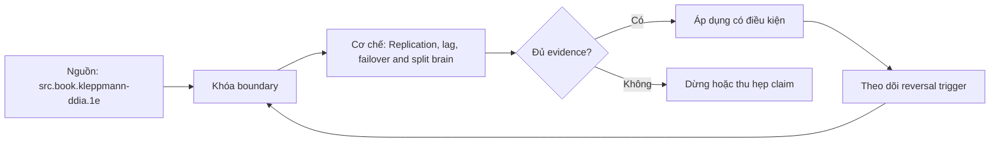

# Replication, lag, failover and split brain

> [!abstract] Câu hỏi trung tâm
> Replication acknowledgment, lag, promotion và fencing ghép thành RPO/RTO có thể kiểm như thế nào?

## 1. Replication có nhiều mục tiêu

Replica có thể phục vụ availability, read scaling, disaster recovery hoặc data distribution; một topology không tối ưu đồng thời mọi mục tiêu. Physical streaming phát WAL/block-level changes và giữ cluster gần giống primary; logical replication phát changes theo logical identity, cho selective replication/version use cases nhưng có constraint/conflict semantics riêng. Replica không phải backup vì operator error có thể được nhân bản.

## 2. Acknowledgment boundary

Asynchronous replication cho primary ACK trước khi standby durable/apply, tạo cửa sổ mất acknowledged commits khi failover. Synchronous replication chờ theo synchronous_commit/synchronous_standby_names và mode remote_write/flush/apply tương ứng; không được rút gọn thành 'sync không mất dữ liệu'. Nó vẫn phụ thuộc số standby/quorum, storage, config reload, network partition và việc chọn candidate.

## 3. Lag là vector

Byte/LSN lag, send lag, write lag, flush lag, replay lag và wall-clock visibility trả lời câu hỏi khác nhau. Zero byte lag tại một thời điểm không chứng minh replica đủ an toàn nếu monitoring stale hoặc timeline khác. Read-after-write trên replica cần routing/session token/wait-until-LSN hoặc đọc primary; eventual catch-up không tạo guarantee tự động.

## 4. Failover là protocol

Phát hiện primary không phản hồi chưa chứng minh primary chết. Promotion chọn standby, tạo timeline mới, cập nhật routing và phải ngăn primary cũ nhận writes. Fencing bằng STONITH, lease/quorum hoặc control plane đáng tin ngăn split brain. Sau promotion cần reconcile clients, slots, WAL archive, old-primary rejoin và backup lineage.

## 5. RPO và RTO

RPO là lượng dữ liệu được phép mất theo điểm thời gian/operation set; RTO là thời gian dịch vụ khôi phục. Đo bằng operation-ID ledger: xác định ACKed IDs trước fault và IDs hiện diện sau failover. Chỉ đếm row có thể sai nếu retry/duplicate. RTO phải có mốc fault detection, decision, promotion, route convergence và application readiness.

## 6. Thiết kế game day

Chỉ chạy trên cluster cô lập. Xác nhận restore path, fencing và stop conditions trước fault injection. Tải ghi có operation IDs; capture primary/standby LSN cùng timestamps; kill/isolate primary theo kịch bản; promote; kiểm accepted writes, lost/duplicate IDs và stale reads. Không tuyên bố synchronous RPO=0 nếu chưa test đúng mode/failure class.

## 7. Ma trận kiểm chứng từng mệnh đề

Mỗi mệnh đề dưới đây phải được kiểm bằng một schedule hoặc phép đo có điều kiện đầu vào rõ ràng. Không dùng một ảnh màn hình cuối làm bằng chứng thay cho lệnh, timestamp, cấu hình và raw output.

### 7.1. async ACK trước remote durability tạo acknowledged-write loss window

**Giả thuyết.** async ACK trước remote durability tạo acknowledged-write loss window. **Cách kiểm.** Cố định phiên bản database, cấu hình, dữ liệu seed và thứ tự thao tác; ghi operation ID, transaction/session ID, thời điểm bắt đầu–kết thúc và trạng thái commit/abort. **Đối chứng.** Chạy một biến thể bỏ đúng yếu tố đang xét, không đổi đồng thời nhiều tham số. **Bằng chứng đạt cho `wiki.database.replication-lag-failover`.** Lưu command/script, raw result và counter trước–sau; giải thích cơ chế tạo ra quan sát. Một lần không tái hiện không đủ bác bỏ hiện tượng concurrency; cần barrier xác định và lặp có giới hạn.

### 7.2. synchronous remote_write khác remote_flush và remote_apply

**Giả thuyết.** synchronous remote_write khác remote_flush và remote_apply. **Cách kiểm.** Cố định phiên bản database, cấu hình, dữ liệu seed và thứ tự thao tác; ghi operation ID, transaction/session ID, thời điểm bắt đầu–kết thúc và trạng thái commit/abort. **Đối chứng.** Chạy một biến thể bỏ đúng yếu tố đang xét, không đổi đồng thời nhiều tham số. **Bằng chứng đạt cho `wiki.database.replication-lag-failover`.** Lưu command/script, raw result và counter trước–sau; giải thích cơ chế tạo ra quan sát. Một lần không tái hiện không đủ bác bỏ hiện tượng concurrency; cần barrier xác định và lặp có giới hạn.

### 7.3. một synchronous standby cấu hình nhưng không available có thể chặn commit hoặc làm mode thay đổi theo policy

**Giả thuyết.** một synchronous standby cấu hình nhưng không available có thể chặn commit hoặc làm mode thay đổi theo policy. **Cách kiểm.** Cố định phiên bản database, cấu hình, dữ liệu seed và thứ tự thao tác; ghi operation ID, transaction/session ID, thời điểm bắt đầu–kết thúc và trạng thái commit/abort. **Đối chứng.** Chạy một biến thể bỏ đúng yếu tố đang xét, không đổi đồng thời nhiều tham số. **Bằng chứng đạt cho `wiki.database.replication-lag-failover`.** Lưu command/script, raw result và counter trước–sau; giải thích cơ chế tạo ra quan sát. Một lần không tái hiện không đủ bác bỏ hiện tượng concurrency; cần barrier xác định và lặp có giới hạn.

### 7.4. replication lag bytes khác replay time lag

**Giả thuyết.** replication lag bytes khác replay time lag. **Cách kiểm.** Cố định phiên bản database, cấu hình, dữ liệu seed và thứ tự thao tác; ghi operation ID, transaction/session ID, thời điểm bắt đầu–kết thúc và trạng thái commit/abort. **Đối chứng.** Chạy một biến thể bỏ đúng yếu tố đang xét, không đổi đồng thời nhiều tham số. **Bằng chứng đạt cho `wiki.database.replication-lag-failover`.** Lưu command/script, raw result và counter trước–sau; giải thích cơ chế tạo ra quan sát. Một lần không tái hiện không đủ bác bỏ hiện tượng concurrency; cần barrier xác định và lặp có giới hạn.

### 7.5. read-after-write trên follower có thể thất bại dù primary commit thành công

**Giả thuyết.** read-after-write trên follower có thể thất bại dù primary commit thành công. **Cách kiểm.** Cố định phiên bản database, cấu hình, dữ liệu seed và thứ tự thao tác; ghi operation ID, transaction/session ID, thời điểm bắt đầu–kết thúc và trạng thái commit/abort. **Đối chứng.** Chạy một biến thể bỏ đúng yếu tố đang xét, không đổi đồng thời nhiều tham số. **Bằng chứng đạt cho `wiki.database.replication-lag-failover`.** Lưu command/script, raw result và counter trước–sau; giải thích cơ chế tạo ra quan sát. Một lần không tái hiện không đủ bác bỏ hiện tượng concurrency; cần barrier xác định và lặp có giới hạn.

### 7.6. monitoring connection up không chứng minh replay caught up

**Giả thuyết.** monitoring connection up không chứng minh replay caught up. **Cách kiểm.** Cố định phiên bản database, cấu hình, dữ liệu seed và thứ tự thao tác; ghi operation ID, transaction/session ID, thời điểm bắt đầu–kết thúc và trạng thái commit/abort. **Đối chứng.** Chạy một biến thể bỏ đúng yếu tố đang xét, không đổi đồng thời nhiều tham số. **Bằng chứng đạt cho `wiki.database.replication-lag-failover`.** Lưu command/script, raw result và counter trước–sau; giải thích cơ chế tạo ra quan sát. Một lần không tái hiện không đủ bác bỏ hiện tượng concurrency; cần barrier xác định và lặp có giới hạn.

### 7.7. network partition tạo primary ambiguity và cần quorum/fencing

**Giả thuyết.** network partition tạo primary ambiguity và cần quorum/fencing. **Cách kiểm.** Cố định phiên bản database, cấu hình, dữ liệu seed và thứ tự thao tác; ghi operation ID, transaction/session ID, thời điểm bắt đầu–kết thúc và trạng thái commit/abort. **Đối chứng.** Chạy một biến thể bỏ đúng yếu tố đang xét, không đổi đồng thời nhiều tham số. **Bằng chứng đạt cho `wiki.database.replication-lag-failover`.** Lưu command/script, raw result và counter trước–sau; giải thích cơ chế tạo ra quan sát. Một lần không tái hiện không đủ bác bỏ hiện tượng concurrency; cần barrier xác định và lặp có giới hạn.

### 7.8. promotion không tự tắt old primary

**Giả thuyết.** promotion không tự tắt old primary. **Cách kiểm.** Cố định phiên bản database, cấu hình, dữ liệu seed và thứ tự thao tác; ghi operation ID, transaction/session ID, thời điểm bắt đầu–kết thúc và trạng thái commit/abort. **Đối chứng.** Chạy một biến thể bỏ đúng yếu tố đang xét, không đổi đồng thời nhiều tham số. **Bằng chứng đạt cho `wiki.database.replication-lag-failover`.** Lưu command/script, raw result và counter trước–sau; giải thích cơ chế tạo ra quan sát. Một lần không tái hiện không đủ bác bỏ hiện tượng concurrency; cần barrier xác định và lặp có giới hạn.

### 7.9. split brain có thể tạo divergent timelines không merge tự động

**Giả thuyết.** split brain có thể tạo divergent timelines không merge tự động. **Cách kiểm.** Cố định phiên bản database, cấu hình, dữ liệu seed và thứ tự thao tác; ghi operation ID, transaction/session ID, thời điểm bắt đầu–kết thúc và trạng thái commit/abort. **Đối chứng.** Chạy một biến thể bỏ đúng yếu tố đang xét, không đổi đồng thời nhiều tham số. **Bằng chứng đạt cho `wiki.database.replication-lag-failover`.** Lưu command/script, raw result và counter trước–sau; giải thích cơ chế tạo ra quan sát. Một lần không tái hiện không đủ bác bỏ hiện tượng concurrency; cần barrier xác định và lặp có giới hạn.

### 7.10. logical replication không sao chép mọi DDL/sequence/large-object semantics như physical

**Giả thuyết.** logical replication không sao chép mọi DDL/sequence/large-object semantics như physical. **Cách kiểm.** Cố định phiên bản database, cấu hình, dữ liệu seed và thứ tự thao tác; ghi operation ID, transaction/session ID, thời điểm bắt đầu–kết thúc và trạng thái commit/abort. **Đối chứng.** Chạy một biến thể bỏ đúng yếu tố đang xét, không đổi đồng thời nhiều tham số. **Bằng chứng đạt cho `wiki.database.replication-lag-failover`.** Lưu command/script, raw result và counter trước–sau; giải thích cơ chế tạo ra quan sát. Một lần không tái hiện không đủ bác bỏ hiện tượng concurrency; cần barrier xác định và lặp có giới hạn.

### 7.11. replica truyền operator DELETE nên không thay point-in-time backup

**Giả thuyết.** replica truyền operator DELETE nên không thay point-in-time backup. **Cách kiểm.** Cố định phiên bản database, cấu hình, dữ liệu seed và thứ tự thao tác; ghi operation ID, transaction/session ID, thời điểm bắt đầu–kết thúc và trạng thái commit/abort. **Đối chứng.** Chạy một biến thể bỏ đúng yếu tố đang xét, không đổi đồng thời nhiều tham số. **Bằng chứng đạt cho `wiki.database.replication-lag-failover`.** Lưu command/script, raw result và counter trước–sau; giải thích cơ chế tạo ra quan sát. Một lần không tái hiện không đủ bác bỏ hiện tượng concurrency; cần barrier xác định và lặp có giới hạn.

### 7.12. WAL archive/slot retention có thể đầy disk khi consumer lag

**Giả thuyết.** WAL archive/slot retention có thể đầy disk khi consumer lag. **Cách kiểm.** Cố định phiên bản database, cấu hình, dữ liệu seed và thứ tự thao tác; ghi operation ID, transaction/session ID, thời điểm bắt đầu–kết thúc và trạng thái commit/abort. **Đối chứng.** Chạy một biến thể bỏ đúng yếu tố đang xét, không đổi đồng thời nhiều tham số. **Bằng chứng đạt cho `wiki.database.replication-lag-failover`.** Lưu command/script, raw result và counter trước–sau; giải thích cơ chế tạo ra quan sát. Một lần không tái hiện không đủ bác bỏ hiện tượng concurrency; cần barrier xác định và lặp có giới hạn.

### 7.13. RPO đo trên ACK ledger, không đo bằng cảm giác về sync/async

**Giả thuyết.** RPO đo trên ACK ledger, không đo bằng cảm giác về sync/async. **Cách kiểm.** Cố định phiên bản database, cấu hình, dữ liệu seed và thứ tự thao tác; ghi operation ID, transaction/session ID, thời điểm bắt đầu–kết thúc và trạng thái commit/abort. **Đối chứng.** Chạy một biến thể bỏ đúng yếu tố đang xét, không đổi đồng thời nhiều tham số. **Bằng chứng đạt cho `wiki.database.replication-lag-failover`.** Lưu command/script, raw result và counter trước–sau; giải thích cơ chế tạo ra quan sát. Một lần không tái hiện không đủ bác bỏ hiện tượng concurrency; cần barrier xác định và lặp có giới hạn.

### 7.14. RTO gồm client/DNS/pool convergence chứ không chỉ promote command

**Giả thuyết.** RTO gồm client/DNS/pool convergence chứ không chỉ promote command. **Cách kiểm.** Cố định phiên bản database, cấu hình, dữ liệu seed và thứ tự thao tác; ghi operation ID, transaction/session ID, thời điểm bắt đầu–kết thúc và trạng thái commit/abort. **Đối chứng.** Chạy một biến thể bỏ đúng yếu tố đang xét, không đổi đồng thời nhiều tham số. **Bằng chứng đạt cho `wiki.database.replication-lag-failover`.** Lưu command/script, raw result và counter trước–sau; giải thích cơ chế tạo ra quan sát. Một lần không tái hiện không đủ bác bỏ hiện tượng concurrency; cần barrier xác định và lặp có giới hạn.

### 7.15. rejoin old primary cần rewind/rebuild và kiểm timeline

**Giả thuyết.** rejoin old primary cần rewind/rebuild và kiểm timeline. **Cách kiểm.** Cố định phiên bản database, cấu hình, dữ liệu seed và thứ tự thao tác; ghi operation ID, transaction/session ID, thời điểm bắt đầu–kết thúc và trạng thái commit/abort. **Đối chứng.** Chạy một biến thể bỏ đúng yếu tố đang xét, không đổi đồng thời nhiều tham số. **Bằng chứng đạt cho `wiki.database.replication-lag-failover`.** Lưu command/script, raw result và counter trước–sau; giải thích cơ chế tạo ra quan sát. Một lần không tái hiện không đủ bác bỏ hiện tượng concurrency; cần barrier xác định và lặp có giới hạn.

## 8. Khung chẩn đoán

1. Viết hiện tượng quan sát được và mốc thời gian, không nhảy thẳng tới nguyên nhân.
2. Ghi exact DBMS/version, topology, isolation/durability mode và workload.
3. Dựng state hoặc dependency graph nhỏ nhất giải thích hiện tượng.
4. Thu evidence ở cả client, engine và storage/replica nếu có.
5. Nêu giả thuyết có dự đoán phân biệt được; đổi một biến và chạy lại.
6. Phân biệt biện pháp giảm triệu chứng, sửa nguyên nhân và control ngăn tái diễn.
7. Giữ failed run; không xoá evidence chỉ vì kết quả không như dự kiến.

## 9. Câu hỏi tự kiểm tra

1. Contract chính của cơ chế trong bài là gì và failure class nào nằm ngoài contract?
2. Counter hoặc graph nào phân biệt symptom với root cause?
3. Một phát biểu nào chỉ đúng cho PostgreSQL, không được khái quát thành SQL chung?
4. Abort hoặc stale read khi nào là hành vi đúng theo cấu hình?
5. Lab cần barrier, operation ID và đối chứng nào để tái hiện được?
6. Biện pháp vận hành nào nguy hiểm nếu áp dụng trực tiếp lên production?

## 10. Giới hạn và điều chưa cho phép kết luận

- Chưa chạy lab database; mọi số đo phải được học viên tạo trong môi trường cô lập.
- Hành vi theo version/dialect phải kiểm manual đúng hệ; note không thay runbook production.
- Không suy benchmark, ngưỡng alert hay SLO phổ quát từ sách.
- Không coi synchronous, serializable, vacuum hoặc partitioning là bảo đảm tuyệt đối ngoài cấu hình và failure model đã nêu.

## Reference
1. [[SRC-KLEPPMANN-DDIA-1E]]
2. [[SRC-POSTGRESQL-17-10-MANUAL]]
3. [[SRC-ROGOV-POSTGRESQL-14-INTERNALS]]
4. [[SRC-SILBERSCHATZ-DATABASE-SYSTEM-CONCEPTS-7E]]

## Source coverage

| Source slice | Nội dung sử dụng | Trạng thái |
|---|---|---|
| [[SRC-KLEPPMANN-DDIA-1E]] | Cơ chế, ranh giới và phản ví dụ liên quan đến bài | Đã đọc phạm vi có locator và diễn giải |
| [[SRC-POSTGRESQL-17-10-MANUAL]] | Cơ chế, ranh giới và phản ví dụ liên quan đến bài | Đã đọc phạm vi có locator và diễn giải |
| [[SRC-ROGOV-POSTGRESQL-14-INTERNALS]] | Cơ chế, ranh giới và phản ví dụ liên quan đến bài | Đã đọc phạm vi có locator và diễn giải |
| [[SRC-SILBERSCHATZ-DATABASE-SYSTEM-CONCEPTS-7E]] | Cơ chế, ranh giới và phản ví dụ liên quan đến bài | Đã đọc phạm vi có locator và diễn giải |

## Key takeaways
- Bắt đầu từ invariant/failure model và bằng chứng, không bắt đầu từ tên tính năng.
- Phân biệt contract chung với hành vi PostgreSQL cụ thể.
- Concurrency và failover test phải có schedule, operation ID và raw output tái lập được.
- Một control làm giảm rủi ro này có thể tăng latency, abort, coordination hoặc chi phí vận hành khác.
- Chưa chạy lab thì trạng thái là tài liệu học thuật đã kiểm cấu trúc, không phải chứng nhận production.

<!-- ATOMIC-EXECUTION-CAPSULE:START -->

## Execution capsule — kiểm chứng `wiki.database.replication-lag-failover`

> [!important] Phân loại mệnh đề
> Với `wiki.database.replication-lag-failover`, sơ đồ, ví dụ và artifact về **Replication, lag, failover and split brain** là **synthesis để kiểm chứng**; chúng không phải trích dẫn hay case nguyên văn của nguồn.

### Sơ đồ cơ chế và điểm kiểm soát



Đọc sơ đồ `wiki.database.replication-lag-failover` từ trái sang phải: source chỉ cung cấp claim ban đầu cho **Replication, lag, failover and split brain**; quyết định chỉ được đi tiếp sau khi boundary, evidence và điều kiện đảo quyết định đã hiện hữu.

### Artifact thực thi tối thiểu

```sql
-- Verification harness for: Replication, lag, failover and split brain
WITH evidence AS (
    SELECT 'wiki.database.replication-lag-failover' AS concept_id,
           'boundary_declared' AS check_name, 1 AS passed
    UNION ALL
    SELECT 'wiki.database.replication-lag-failover', 'independent_oracle', 1
    UNION ALL
    SELECT 'wiki.database.replication-lag-failover', 'reversal_trigger_recorded', 1
)
SELECT concept_id,
       MIN(passed) AS all_hard_checks_pass,
       COUNT(*) AS evidence_items
FROM evidence
GROUP BY concept_id
HAVING MIN(passed) = 1;
```

Artifact của `wiki.database.replication-lag-failover` buộc người dùng ghi boundary, oracle và reversal trigger cho **Replication, lag, failover and split brain**. Các giá trị minh họa phải được thay bằng evidence thật trước khi dùng cho quyết định.

### Tự kiểm tra trước khi tái sử dụng

1. Bạn có thể trả lời `Replication acknowledgment, lag, promotion và fencing ghép thành RPO/RTO có thể kiểm như thế nào?` bằng một câu mà không kéo thêm concept thứ hai không?
2. Source locator nào đỡ cho claim, và phần nào chỉ là synthesis trong note?
3. Observation nào khiến bạn dừng, thu hẹp hoặc đảo quyết định?
4. Artifact nào cho phép một reviewer độc lập tái hiện kết quả?

<!-- ATOMIC-EXECUTION-CAPSULE:END -->
