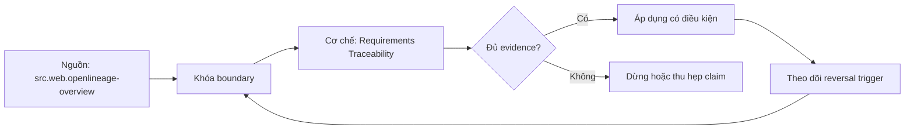

# Requirements Traceability

> [!abstract] Câu hỏi trung tâm
> Làm sao duy trì chuỗi hai chiều decision → question → metric → model → source để impact analysis và deletion decisions có bằng chứng?

## 1. Năm mắt và stable identifiers

Decision record, analytical question, metric contract, semantic/physical model và source asset đều có ID/version/owner. Matrix lưu typed edges như answers, computes, materializes, derives-from; không chỉ dấu X. Path phải giữ conditions như environment, effective date và consumer scope. Tên/path thay đổi không làm mất identity. Một mắt không ID khiến impact query dựa text matching và nhanh chóng sai.

## 2. Forward và backward traversal

Forward từ decision liệt kê questions, metrics, models, sources và quality/security dependencies để biết blast radius. Backward từ source/model/column tìm decisions/consumers có thể bị ảnh hưởng. Hai chiều không tự đồng nhất nếu edges chỉ khai một phía; validator kiểm reciprocal reachability và dangling IDs. Câu hỏi nằm giữa decision và metric vì một decision có nhiều uncertainty questions, một metric có thể trả nhiều questions.

## 3. Traceability khác technical lineage

OpenLineage thu datasets, jobs và runs, hữu ích cho cách dữ liệu được tạo, use và impact technical changes. Nó không tự biết decision, business question hoặc lý do metric tồn tại. Requirements matrix nối business intent với semantic artifacts; technical lineage nối transformation execution. Integrate bằng model/source IDs, nhưng không gọi bảng-to-bảng graph là decision traceability hoàn chỉnh.

## 4. Ma trận như code

YAML/CSV/JSON hoặc generated graph nằm trong repository, schema-validated và reviewed cùng change. PR thêm metric/model/source phải cập nhật edges hoặc fail. Generated parts từ dbt/OpenLineage không được sửa tay; decision/question edges được owner duyệt. CI kiểm unique IDs, allowed edge types, no dangling nodes, required paths và orphan policy. Render docs là projection, không source of truth.

## 5. Impact analysis khi source đổi

Schema/type/semantics/freshness/access change từ source đi qua transformation, model, metric, question, decision và consumers. Report phân biệt definitely affected, potentially affected vì dynamic SQL/manual exports và unknown do telemetry gap. Severity dựa decision stakes/cadence chứ không chỉ row count. Owner notification lấy từ graph nhưng cần deduplicate/escalation. Missing edge phải hiện như uncertainty, không silently conclude no impact.

## 6. Deletion và orphan evidence

Bảng không reachable từ active decision có thể là candidate, không mặc nhiên xóa. Kiểm scheduled jobs, regulatory retention, operational use, ML consumers, manual extracts và recent query logs. Zero usage trong window có coverage limit. Safe deletion theo deprecate, notify, observe, remove, rollback. Matrix giúp đặt câu hỏi và owner; không thay authority hoặc data-retention policy.

## 7. Ba truy vấn nghiệm thu

Q1 source S đổi: decisions/owners nào; Q2 decision D phụ thuộc sources/models nào; Q3 assets nào không phục vụ active decision. Seed known graph và expected paths, thêm one dangling edge, one technical-only asset và hidden consumer. Test exact set, path explanation và uncertainty. Done when cả hai chiều đúng và orphan candidate có evidence plan thay vì xóa ngay.

## 8. Ma trận kiểm chứng từng mệnh đề

Mỗi mệnh đề dưới đây cần observation, fixture hoặc artifact có thể lưu. Tên công nghệ, consensus hoặc output nhìn hợp lý không tự là bằng chứng.

### 8.1. every node needs stable ID and version

**Mệnh đề cần kiểm.** every node needs stable ID and version.

**Cách kiểm.** Build typed five-node trace graph with stable IDs; run three forward/backward queries against expected paths. Inject dangling edge, technical-only asset and hidden consumer; report definite, potential and unknown impacts. Với riêng mệnh đề này, ghi input/context, expected observation, failure signal và boundary làm kết luận không còn đúng.

**Bằng chứng đạt cho `wiki.data-product.requirements-traceability`.** Lưu contract/decision version, fixture hoặc interview evidence, command/checklist output, reviewer và artifact hash. Nếu chưa thực hiện lab, trạng thái chỉ là protocol; không ghi thành kết quả đã quan sát.

### 8.2. edges need types not generic links

**Mệnh đề cần kiểm.** edges need types not generic links.

**Cách kiểm.** Build typed five-node trace graph with stable IDs; run three forward/backward queries against expected paths. Inject dangling edge, technical-only asset and hidden consumer; report definite, potential and unknown impacts. Với riêng mệnh đề này, ghi input/context, expected observation, failure signal và boundary làm kết luận không còn đúng.

**Bằng chứng đạt cho `wiki.data-product.requirements-traceability`.** Lưu contract/decision version, fixture hoặc interview evidence, command/checklist output, reviewer và artifact hash. Nếu chưa thực hiện lab, trạng thái chỉ là protocol; không ghi thành kết quả đã quan sát.

### 8.3. path may have effective dates

**Mệnh đề cần kiểm.** path may have effective dates.

**Cách kiểm.** Build typed five-node trace graph with stable IDs; run three forward/backward queries against expected paths. Inject dangling edge, technical-only asset and hidden consumer; report definite, potential and unknown impacts. Với riêng mệnh đề này, ghi input/context, expected observation, failure signal và boundary làm kết luận không còn đúng.

**Bằng chứng đạt cho `wiki.data-product.requirements-traceability`.** Lưu contract/decision version, fixture hoặc interview evidence, command/checklist output, reviewer và artifact hash. Nếu chưa thực hiện lab, trạng thái chỉ là protocol; không ghi thành kết quả đã quan sát.

### 8.4. forward traversal finds dependencies

**Mệnh đề cần kiểm.** forward traversal finds dependencies.

**Cách kiểm.** Build typed five-node trace graph with stable IDs; run three forward/backward queries against expected paths. Inject dangling edge, technical-only asset and hidden consumer; report definite, potential and unknown impacts. Với riêng mệnh đề này, ghi input/context, expected observation, failure signal và boundary làm kết luận không còn đúng.

**Bằng chứng đạt cho `wiki.data-product.requirements-traceability`.** Lưu contract/decision version, fixture hoặc interview evidence, command/checklist output, reviewer và artifact hash. Nếu chưa thực hiện lab, trạng thái chỉ là protocol; không ghi thành kết quả đã quan sát.

### 8.5. backward traversal finds affected decisions

**Mệnh đề cần kiểm.** backward traversal finds affected decisions.

**Cách kiểm.** Build typed five-node trace graph with stable IDs; run three forward/backward queries against expected paths. Inject dangling edge, technical-only asset and hidden consumer; report definite, potential and unknown impacts. Với riêng mệnh đề này, ghi input/context, expected observation, failure signal và boundary làm kết luận không còn đúng.

**Bằng chứng đạt cho `wiki.data-product.requirements-traceability`.** Lưu contract/decision version, fixture hoặc interview evidence, command/checklist output, reviewer và artifact hash. Nếu chưa thực hiện lab, trạng thái chỉ là protocol; không ghi thành kết quả đã quan sát.

### 8.6. reciprocal reachability must validate

**Mệnh đề cần kiểm.** reciprocal reachability must validate.

**Cách kiểm.** Build typed five-node trace graph with stable IDs; run three forward/backward queries against expected paths. Inject dangling edge, technical-only asset and hidden consumer; report definite, potential and unknown impacts. Với riêng mệnh đề này, ghi input/context, expected observation, failure signal và boundary làm kết luận không còn đúng.

**Bằng chứng đạt cho `wiki.data-product.requirements-traceability`.** Lưu contract/decision version, fixture hoặc interview evidence, command/checklist output, reviewer và artifact hash. Nếu chưa thực hiện lab, trạng thái chỉ là protocol; không ghi thành kết quả đã quan sát.

### 8.7. question layer cannot be skipped

**Mệnh đề cần kiểm.** question layer cannot be skipped.

**Cách kiểm.** Build typed five-node trace graph with stable IDs; run three forward/backward queries against expected paths. Inject dangling edge, technical-only asset and hidden consumer; report definite, potential and unknown impacts. Với riêng mệnh đề này, ghi input/context, expected observation, failure signal và boundary làm kết luận không còn đúng.

**Bằng chứng đạt cho `wiki.data-product.requirements-traceability`.** Lưu contract/decision version, fixture hoặc interview evidence, command/checklist output, reviewer và artifact hash. Nếu chưa thực hiện lab, trạng thái chỉ là protocol; không ghi thành kết quả đã quan sát.

### 8.8. technical lineage differs from decision traceability

**Mệnh đề cần kiểm.** technical lineage differs from decision traceability.

**Cách kiểm.** Build typed five-node trace graph with stable IDs; run three forward/backward queries against expected paths. Inject dangling edge, technical-only asset and hidden consumer; report definite, potential and unknown impacts. Với riêng mệnh đề này, ghi input/context, expected observation, failure signal và boundary làm kết luận không còn đúng.

**Bằng chứng đạt cho `wiki.data-product.requirements-traceability`.** Lưu contract/decision version, fixture hoặc interview evidence, command/checklist output, reviewer và artifact hash. Nếu chưa thực hiện lab, trạng thái chỉ là protocol; không ghi thành kết quả đã quan sát.

### 8.9. OpenLineage tracks datasets jobs runs

**Mệnh đề cần kiểm.** OpenLineage tracks datasets jobs runs.

**Cách kiểm.** Build typed five-node trace graph with stable IDs; run three forward/backward queries against expected paths. Inject dangling edge, technical-only asset and hidden consumer; report definite, potential and unknown impacts. Với riêng mệnh đề này, ghi input/context, expected observation, failure signal và boundary làm kết luận không còn đúng.

**Bằng chứng đạt cho `wiki.data-product.requirements-traceability`.** Lưu contract/decision version, fixture hoặc interview evidence, command/checklist output, reviewer và artifact hash. Nếu chưa thực hiện lab, trạng thái chỉ là protocol; không ghi thành kết quả đã quan sát.

### 8.10. generated lineage is not edited manually

**Mệnh đề cần kiểm.** generated lineage is not edited manually.

**Cách kiểm.** Build typed five-node trace graph with stable IDs; run three forward/backward queries against expected paths. Inject dangling edge, technical-only asset and hidden consumer; report definite, potential and unknown impacts. Với riêng mệnh đề này, ghi input/context, expected observation, failure signal và boundary làm kết luận không còn đúng.

**Bằng chứng đạt cho `wiki.data-product.requirements-traceability`.** Lưu contract/decision version, fixture hoặc interview evidence, command/checklist output, reviewer và artifact hash. Nếu chưa thực hiện lab, trạng thái chỉ là protocol; không ghi thành kết quả đã quan sát.

### 8.11. CI blocks dangling IDs

**Mệnh đề cần kiểm.** CI blocks dangling IDs.

**Cách kiểm.** Build typed five-node trace graph with stable IDs; run three forward/backward queries against expected paths. Inject dangling edge, technical-only asset and hidden consumer; report definite, potential and unknown impacts. Với riêng mệnh đề này, ghi input/context, expected observation, failure signal và boundary làm kết luận không còn đúng.

**Bằng chứng đạt cho `wiki.data-product.requirements-traceability`.** Lưu contract/decision version, fixture hoặc interview evidence, command/checklist output, reviewer và artifact hash. Nếu chưa thực hiện lab, trạng thái chỉ là protocol; không ghi thành kết quả đã quan sát.

### 8.12. impact report needs definite potential unknown

**Mệnh đề cần kiểm.** impact report needs definite potential unknown.

**Cách kiểm.** Build typed five-node trace graph with stable IDs; run three forward/backward queries against expected paths. Inject dangling edge, technical-only asset and hidden consumer; report definite, potential and unknown impacts. Với riêng mệnh đề này, ghi input/context, expected observation, failure signal và boundary làm kết luận không còn đúng.

**Bằng chứng đạt cho `wiki.data-product.requirements-traceability`.** Lưu contract/decision version, fixture hoặc interview evidence, command/checklist output, reviewer và artifact hash. Nếu chưa thực hiện lab, trạng thái chỉ là protocol; không ghi thành kết quả đã quan sát.

### 8.13. decision stakes affect severity

**Mệnh đề cần kiểm.** decision stakes affect severity.

**Cách kiểm.** Build typed five-node trace graph with stable IDs; run three forward/backward queries against expected paths. Inject dangling edge, technical-only asset and hidden consumer; report definite, potential and unknown impacts. Với riêng mệnh đề này, ghi input/context, expected observation, failure signal và boundary làm kết luận không còn đúng.

**Bằng chứng đạt cho `wiki.data-product.requirements-traceability`.** Lưu contract/decision version, fixture hoặc interview evidence, command/checklist output, reviewer và artifact hash. Nếu chưa thực hiện lab, trạng thái chỉ là protocol; không ghi thành kết quả đã quan sát.

### 8.14. zero query usage does not prove unused

**Mệnh đề cần kiểm.** zero query usage does not prove unused.

**Cách kiểm.** Build typed five-node trace graph with stable IDs; run three forward/backward queries against expected paths. Inject dangling edge, technical-only asset and hidden consumer; report definite, potential and unknown impacts. Với riêng mệnh đề này, ghi input/context, expected observation, failure signal và boundary làm kết luận không còn đúng.

**Bằng chứng đạt cho `wiki.data-product.requirements-traceability`.** Lưu contract/decision version, fixture hoặc interview evidence, command/checklist output, reviewer và artifact hash. Nếu chưa thực hiện lab, trạng thái chỉ là protocol; không ghi thành kết quả đã quan sát.

### 8.15. deletion needs deprecation and rollback

**Mệnh đề cần kiểm.** deletion needs deprecation and rollback.

**Cách kiểm.** Build typed five-node trace graph with stable IDs; run three forward/backward queries against expected paths. Inject dangling edge, technical-only asset and hidden consumer; report definite, potential and unknown impacts. Với riêng mệnh đề này, ghi input/context, expected observation, failure signal và boundary làm kết luận không còn đúng.

**Bằng chứng đạt cho `wiki.data-product.requirements-traceability`.** Lưu contract/decision version, fixture hoặc interview evidence, command/checklist output, reviewer và artifact hash. Nếu chưa thực hiện lab, trạng thái chỉ là protocol; không ghi thành kết quả đã quan sát.

## 9. Quy trình phản biện

1. Viết decision, consumer, contract và constraints trước khi chọn tool hoặc implementation.
2. Tách source fact, curriculum synthesis và organizational choice.
3. Dùng counterexample và changed constraint để kiểm quyết định có đảo đúng lúc.
4. Gắn mọi approval/certification với exact version, evidence và scope.
5. Kiểm cả valid path lẫn negative/failure path; không chỉ demo happy path.
6. Ghi limitation của telemetry, test environment và source authority.
7. Chưa có execution evidence thì giữ trạng thái `review`.

## 10. Câu hỏi tự kiểm tra

1. Decision hoặc invariant nào đang được bảo vệ?
2. Evidence nào độc lập với implementation đang được đánh giá?
3. Điều kiện nào làm lựa chọn hiện tại phải đảo?
4. Ai có quyền quyết nghĩa, ai triển khai và ai giữ quy trình?
5. Thay đổi nào ảnh hưởng consumer dù interface vẫn chạy?
6. Failure mode nào còn chưa có automated detector?

## 11. Giới hạn và điều chưa cho phép kết luận

- Chưa chạy các lab, migration, workload benchmark hoặc fault-injection; note mô tả protocol và expected evidence.
- Tài liệu sản phẩm web được kiểm ngày 2026-10-02; feature, syntax, license và integration có thể đổi.
- Các scorecard, lifecycle gates, failure matrix và decision contract là curriculum synthesis từ nguồn đã nêu; không gán nguyên văn cho một tác giả.
- Ví dụ tổ chức không thay discovery thực tế, threat model, cost model hoặc owner approval.
- Note giữ trạng thái `review` cho tới khi chủ dự án duyệt semantic meaning.

## Reference
1. [[SRC-OPENLINEAGE-OVERVIEW]]
2. [[SRC-SOMMERVILLE-SOFTWARE-ENGINEERING-10E]]
3. [[SRC-REIS-HOUSLEY-FUNDAMENTALS-DATA-ENGINEERING]]

## Source coverage

| Source slice | Nội dung sử dụng | Trạng thái |
|---|---|---|
| [[SRC-OPENLINEAGE-OVERVIEW]] | Khái niệm, cơ chế hoặc decision boundary liên quan | Đã đọc locator được ghi trong source record; không suy ngoài phạm vi |
| [[SRC-SOMMERVILLE-SOFTWARE-ENGINEERING-10E]] | Khái niệm, cơ chế hoặc decision boundary liên quan | Đã đọc locator được ghi trong source record; không suy ngoài phạm vi |
| [[SRC-REIS-HOUSLEY-FUNDAMENTALS-DATA-ENGINEERING]] | Khái niệm, cơ chế hoặc decision boundary liên quan | Đã đọc locator được ghi trong source record; không suy ngoài phạm vi |

## Key takeaways
- Chọn kiến trúc và data product từ decision/constraints, không từ độ mới của công nghệ.
- Metric governance cần versioned evidence, lifecycle gates và owner có quyền rõ.
- Failure matrix chỉ hữu dụng khi mỗi dòng có detector hoặc control kiểm được.
- Capstone là hồ sơ bằng chứng tích hợp, không phải bộ YAML hay dashboard trình diễn.
- Discovery phải cho phép kết luận không xây analytics product.

<!-- ATOMIC-EXECUTION-CAPSULE:START -->

## Execution capsule: kiểm chứng `wiki.data-product.requirements-traceability`

> [!important] Phân loại mệnh đề
> Với `wiki.data-product.requirements-traceability`, sơ đồ, ví dụ và artifact về **Requirements Traceability** là **synthesis để kiểm chứng**; chúng không phải trích dẫn hay case nguyên văn của nguồn.

### Sơ đồ cơ chế và điểm kiểm soát



Đọc sơ đồ `wiki.data-product.requirements-traceability` từ trái sang phải: source chỉ cung cấp claim ban đầu cho **Requirements Traceability**; quyết định chỉ được đi tiếp sau khi boundary, evidence và điều kiện đảo quyết định đã hiện hữu.

### Artifact thực thi tối thiểu

```sql
-- Verification harness for: Requirements Traceability
WITH evidence AS (
    SELECT 'wiki.data-product.requirements-traceability' AS concept_id,
           'boundary_declared' AS check_name, 1 AS passed
    UNION ALL
    SELECT 'wiki.data-product.requirements-traceability', 'independent_oracle', 1
    UNION ALL
    SELECT 'wiki.data-product.requirements-traceability', 'reversal_trigger_recorded', 1
)
SELECT concept_id,
       MIN(passed) AS all_hard_checks_pass,
       COUNT(*) AS evidence_items
FROM evidence
GROUP BY concept_id
HAVING MIN(passed) = 1;
```

Artifact của `wiki.data-product.requirements-traceability` buộc người dùng ghi boundary, oracle và reversal trigger cho **Requirements Traceability**. Các giá trị minh họa phải được thay bằng evidence thật trước khi dùng cho quyết định.

### Tự kiểm tra trước khi tái sử dụng

1. Bạn có thể trả lời `Làm sao duy trì chuỗi hai chiều decision → question → metric → model → source để impact analysis và deletion decisions có bằng chứng?` bằng một câu mà không kéo thêm concept thứ hai không?
2. Source locator nào đỡ cho claim, và phần nào chỉ là synthesis trong note?
3. Observation nào khiến bạn dừng, thu hẹp hoặc đảo quyết định?
4. Artifact nào cho phép một reviewer độc lập tái hiện kết quả?

<!-- ATOMIC-EXECUTION-CAPSULE:END -->
