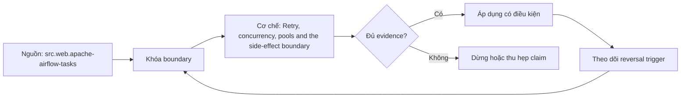

# Retry, concurrency, pools and the side-effect boundary

> [!abstract] Câu hỏi trung tâm
> Retry, concurrency và pools phải được đặt quanh side-effect boundary thế nào để replay không nhân tác động?

## 1. Failure classification

Transient, permanent, throttling, invalid input và unknown failure cần action khác nhau; retry mọi exception tạo retry storm. Đừng bắt đầu bằng tên công cụ. Hãy bắt đầu bằng đối tượng được bảo vệ, boundary quan sát được và hậu quả nếu kết luận sai. Trong bài `Retry, concurrency, pools and the side-effect boundary`, câu hỏi thực dụng là: Retry, concurrency và pools phải được đặt quanh side-effect boundary thế nào để replay không nhân tác động? Ta ghi rõ grain, population, time window, owner và hành động sau failure; nếu một trường chưa biết thì đánh dấu unknown thay vì lấp bằng mặc định. Bằng chứng tối thiểu gồm fixture có version, cấu hình hoặc rule đã resolve, raw observation, expected result và limitation. Phần này là curriculum synthesis dựa trên các nguồn đã định danh, không phải lời hứa rằng mọi adapter hay deployment đều có cùng hành vi.

## 2. Side-effect boundary

Commit ở API, database, object store hay message broker có thể hoàn tất trước khi task ghi success vào scheduler. Điểm khó không nằm ở cú pháp mà ở identity và scope. Hai phép đo cùng tên vẫn có thể nói về hai population hoặc hai thời điểm khác nhau. Trong bài `Retry, concurrency, pools and the side-effect boundary`, câu hỏi thực dụng là: Retry, concurrency và pools phải được đặt quanh side-effect boundary thế nào để replay không nhân tác động? Ta ghi rõ grain, population, time window, owner và hành động sau failure; nếu một trường chưa biết thì đánh dấu unknown thay vì lấp bằng mặc định. Bằng chứng tối thiểu gồm fixture có version, cấu hình hoặc rule đã resolve, raw observation, expected result và limitation. Phần này là curriculum synthesis dựa trên các nguồn đã định danh, không phải lời hứa rằng mọi adapter hay deployment đều có cùng hành vi.

## 3. Idempotency identity

Replay an toàn cần business operation key, conflict policy và durable ledger chứ không chỉ task instance ID. Một dashboard xanh chỉ là tín hiệu. Muốn biến nó thành bằng chứng phải giữ input, phiên bản, rule, trạng thái trước-sau và cách tính độc lập. Trong bài `Retry, concurrency, pools and the side-effect boundary`, câu hỏi thực dụng là: Retry, concurrency và pools phải được đặt quanh side-effect boundary thế nào để replay không nhân tác động? Ta ghi rõ grain, population, time window, owner và hành động sau failure; nếu một trường chưa biết thì đánh dấu unknown thay vì lấp bằng mặc định. Bằng chứng tối thiểu gồm fixture có version, cấu hình hoặc rule đã resolve, raw observation, expected result và limitation. Phần này là curriculum synthesis dựa trên các nguồn đã định danh, không phải lời hứa rằng mọi adapter hay deployment đều có cùng hành vi.

## 4. Concurrency contract

Parallelism phải tôn trọng source quota, destination locks, partition ownership và shared dependency capacity. Thiết kế tốt phải chịu được counterexample. Hãy chủ động tạo case sát boundary, case thiếu dữ liệu và case replay thay vì chỉ chạy happy path. Trong bài `Retry, concurrency, pools and the side-effect boundary`, câu hỏi thực dụng là: Retry, concurrency và pools phải được đặt quanh side-effect boundary thế nào để replay không nhân tác động? Ta ghi rõ grain, population, time window, owner và hành động sau failure; nếu một trường chưa biết thì đánh dấu unknown thay vì lấp bằng mặc định. Bằng chứng tối thiểu gồm fixture có version, cấu hình hoặc rule đã resolve, raw observation, expected result và limitation. Phần này là curriculum synthesis dựa trên các nguồn đã định danh, không phải lời hứa rằng mọi adapter hay deployment đều có cùng hành vi.

## 5. Pools and fairness

Pool bảo vệ tài nguyên hữu hạn nhưng slot count sai có thể gây starvation, head-of-line blocking hoặc throughput giả. Chi phí vận hành thuộc contract. Một rule đúng nhưng quá đắt, quá ồn hoặc không có owner sẽ nhanh chóng bị tắt và mất tác dụng. Trong bài `Retry, concurrency, pools and the side-effect boundary`, câu hỏi thực dụng là: Retry, concurrency và pools phải được đặt quanh side-effect boundary thế nào để replay không nhân tác động? Ta ghi rõ grain, population, time window, owner và hành động sau failure; nếu một trường chưa biết thì đánh dấu unknown thay vì lấp bằng mặc định. Bằng chứng tối thiểu gồm fixture có version, cấu hình hoặc rule đã resolve, raw observation, expected result và limitation. Phần này là curriculum synthesis dựa trên các nguồn đã định danh, không phải lời hứa rằng mọi adapter hay deployment đều có cùng hành vi.

## 6. Kill-point proof

Dừng worker trước/sau commit và chạy lại để chứng minh state hội tụ, side effect không nhân và operator nhìn thấy ambiguity. Kết luận cần có điều kiện đảo chiều. Khi volume, latency, nguồn thẩm quyền hoặc topology đổi, quyết định cũ phải được xem xét lại bằng cùng một oracle. Trong bài `Retry, concurrency, pools and the side-effect boundary`, câu hỏi thực dụng là: Retry, concurrency và pools phải được đặt quanh side-effect boundary thế nào để replay không nhân tác động? Ta ghi rõ grain, population, time window, owner và hành động sau failure; nếu một trường chưa biết thì đánh dấu unknown thay vì lấp bằng mặc định. Bằng chứng tối thiểu gồm fixture có version, cấu hình hoặc rule đã resolve, raw observation, expected result và limitation. Phần này là curriculum synthesis dựa trên các nguồn đã định danh, không phải lời hứa rằng mọi adapter hay deployment đều có cùng hành vi.

## 7. Ma trận kiểm chứng từng mệnh đề

Với `wiki.orchestration.retry-concurrency-pools-side-effects`, command thành công không tự chứng minh dữ liệu đúng. Protocol riêng của bài là: Dựng fixture có run/data identity rõ, tiêm một failure tại boundary quan trọng và đối soát state bằng oracle độc lập. Mỗi probe dưới đây phải nối input boundary với failure signal và oracle có thể phản bác kết luận.

### 7.1. Retry, concurrency, pools and the side-effect boundary: kiểm `Failure classification` bằng case 1, cụ thể transient, permanent, throttling, invalid input và unknown failure cần action khác nhau; retry mọi exception tạo retry storm

**Mệnh đề cần kiểm.** Retry, concurrency, pools and the side-effect boundary: kiểm `Failure classification` bằng case 1, cụ thể transient, permanent, throttling, invalid input và unknown failure cần action khác nhau; retry mọi exception tạo retry storm.

**Thiết kế phép thử cho `wiki.orchestration.retry-concurrency-pools-side-effects`.** Trong ngữ cảnh `wiki.orchestration.retry-concurrency-pools-side-effects`, tạo positive control và negative control chỉ khác đúng một điều kiện. Khóa input snapshot, phiên bản và owner của rule; chạy đúng population được bài `Retry, concurrency, pools and the side-effect boundary` công bố.

**Bằng chứng cần giữ.** Đối với probe 1 của `Retry, concurrency, pools and the side-effect boundary`, giữ fixture, raw failing rows và lệnh tái hiện. Nếu chưa chạy lab, ghi expected evidence và giữ trạng thái review; không biến protocol thành observation.

### 7.2. Retry, concurrency, pools and the side-effect boundary: kiểm `Side-effect boundary` bằng case 2, cụ thể commit ở api, database, object store hay message broker có thể hoàn tất trước khi task ghi success vào scheduler

**Mệnh đề cần kiểm.** Retry, concurrency, pools and the side-effect boundary: kiểm `Side-effect boundary` bằng case 2, cụ thể commit ở api, database, object store hay message broker có thể hoàn tất trước khi task ghi success vào scheduler.

**Thiết kế phép thử cho `wiki.orchestration.retry-concurrency-pools-side-effects`.** Trong ngữ cảnh `wiki.orchestration.retry-concurrency-pools-side-effects`, đổi grain nhưng giữ tổng số dòng để lộ phép đo sai cấp. Khóa input snapshot, phiên bản và owner của rule; chạy đúng population được bài `Retry, concurrency, pools and the side-effect boundary` công bố.

**Bằng chứng cần giữ.** Đối với probe 2 của `Retry, concurrency, pools and the side-effect boundary`, báo numerator, denominator và key set ở cả hai grain. Nếu chưa chạy lab, ghi expected evidence và giữ trạng thái review; không biến protocol thành observation.

### 7.3. Retry, concurrency, pools and the side-effect boundary: kiểm `Idempotency identity` bằng case 3, cụ thể replay an toàn cần business operation key, conflict policy và durable ledger chứ không chỉ task instance id

**Mệnh đề cần kiểm.** Retry, concurrency, pools and the side-effect boundary: kiểm `Idempotency identity` bằng case 3, cụ thể replay an toàn cần business operation key, conflict policy và durable ledger chứ không chỉ task instance id.

**Thiết kế phép thử cho `wiki.orchestration.retry-concurrency-pools-side-effects`.** Trong ngữ cảnh `wiki.orchestration.retry-concurrency-pools-side-effects`, đưa một giá trị tới đúng boundary và một giá trị vượt boundary. Khóa input snapshot, phiên bản và owner của rule; chạy đúng population được bài `Retry, concurrency, pools and the side-effect boundary` công bố.

**Bằng chứng cần giữ.** Đối với probe 3 của `Retry, concurrency, pools and the side-effect boundary`, lưu hai observed values cùng rule đã resolve. Nếu chưa chạy lab, ghi expected evidence và giữ trạng thái review; không biến protocol thành observation.

### 7.4. Retry, concurrency, pools and the side-effect boundary: kiểm `Concurrency contract` bằng case 4, cụ thể parallelism phải tôn trọng source quota, destination locks, partition ownership và shared dependency capacity

**Mệnh đề cần kiểm.** Retry, concurrency, pools and the side-effect boundary: kiểm `Concurrency contract` bằng case 4, cụ thể parallelism phải tôn trọng source quota, destination locks, partition ownership và shared dependency capacity.

**Thiết kế phép thử cho `wiki.orchestration.retry-concurrency-pools-side-effects`.** Trong ngữ cảnh `wiki.orchestration.retry-concurrency-pools-side-effects`, kill tiến trình ngay trước rồi ngay sau durable side effect. Khóa input snapshot, phiên bản và owner của rule; chạy đúng population được bài `Retry, concurrency, pools and the side-effect boundary` công bố.

**Bằng chứng cần giữ.** Đối với probe 4 của `Retry, concurrency, pools and the side-effect boundary`, lưu checkpoint, external ledger và trạng thái sau restart. Nếu chưa chạy lab, ghi expected evidence và giữ trạng thái review; không biến protocol thành observation.

### 7.5. Retry, concurrency, pools and the side-effect boundary: kiểm `Pools and fairness` bằng case 5, cụ thể pool bảo vệ tài nguyên hữu hạn nhưng slot count sai có thể gây starvation, head-of-line blocking hoặc throughput giả

**Mệnh đề cần kiểm.** Retry, concurrency, pools and the side-effect boundary: kiểm `Pools and fairness` bằng case 5, cụ thể pool bảo vệ tài nguyên hữu hạn nhưng slot count sai có thể gây starvation, head-of-line blocking hoặc throughput giả.

**Thiết kế phép thử cho `wiki.orchestration.retry-concurrency-pools-side-effects`.** Trong ngữ cảnh `wiki.orchestration.retry-concurrency-pools-side-effects`, đảo thứ tự input và concurrency nhưng giữ logical population. Khóa input snapshot, phiên bản và owner của rule; chạy đúng population được bài `Retry, concurrency, pools and the side-effect boundary` công bố.

**Bằng chứng cần giữ.** Đối với probe 5 của `Retry, concurrency, pools and the side-effect boundary`, so canonical hash và business totals giữa các thứ tự. Nếu chưa chạy lab, ghi expected evidence và giữ trạng thái review; không biến protocol thành observation.

### 7.6. Retry, concurrency, pools and the side-effect boundary: kiểm `Kill-point proof` bằng case 6, cụ thể dừng worker trước/sau commit và chạy lại để chứng minh state hội tụ, side effect không nhân và operator nhìn thấy ambiguity

**Mệnh đề cần kiểm.** Retry, concurrency, pools and the side-effect boundary: kiểm `Kill-point proof` bằng case 6, cụ thể dừng worker trước/sau commit và chạy lại để chứng minh state hội tụ, side effect không nhân và operator nhìn thấy ambiguity.

**Thiết kế phép thử cho `wiki.orchestration.retry-concurrency-pools-side-effects`.** Trong ngữ cảnh `wiki.orchestration.retry-concurrency-pools-side-effects`, replay cùng identity với payload giống rồi payload xung đột. Khóa input snapshot, phiên bản và owner của rule; chạy đúng population được bài `Retry, concurrency, pools and the side-effect boundary` công bố.

**Bằng chứng cần giữ.** Đối với probe 6 của `Retry, concurrency, pools and the side-effect boundary`, tách duplicate replay khỏi identity collision bằng reason code. Nếu chưa chạy lab, ghi expected evidence và giữ trạng thái review; không biến protocol thành observation.

### 7.7. Retry, concurrency, pools and the side-effect boundary: kiểm `Failure classification` bằng case 7, cụ thể transient, permanent, throttling, invalid input và unknown failure cần action khác nhau; retry mọi exception tạo retry storm

**Mệnh đề cần kiểm.** Retry, concurrency, pools and the side-effect boundary: kiểm `Failure classification` bằng case 7, cụ thể transient, permanent, throttling, invalid input và unknown failure cần action khác nhau; retry mọi exception tạo retry storm.

**Thiết kế phép thử cho `wiki.orchestration.retry-concurrency-pools-side-effects`.** Trong ngữ cảnh `wiki.orchestration.retry-concurrency-pools-side-effects`, thêm record tới trễ trong horizon và ngoài horizon. Khóa input snapshot, phiên bản và owner của rule; chạy đúng population được bài `Retry, concurrency, pools and the side-effect boundary` công bố.

**Bằng chứng cần giữ.** Đối với probe 7 của `Retry, concurrency, pools and the side-effect boundary`, báo accepted-late, rejected-late và oldest outstanding timestamp. Nếu chưa chạy lab, ghi expected evidence và giữ trạng thái review; không biến protocol thành observation.

### 7.8. Retry, concurrency, pools and the side-effect boundary: kiểm `Side-effect boundary` bằng case 8, cụ thể commit ở api, database, object store hay message broker có thể hoàn tất trước khi task ghi success vào scheduler

**Mệnh đề cần kiểm.** Retry, concurrency, pools and the side-effect boundary: kiểm `Side-effect boundary` bằng case 8, cụ thể commit ở api, database, object store hay message broker có thể hoàn tất trước khi task ghi success vào scheduler.

**Thiết kế phép thử cho `wiki.orchestration.retry-concurrency-pools-side-effects`.** Trong ngữ cảnh `wiki.orchestration.retry-concurrency-pools-side-effects`, đổi schema theo một cách tương thích rồi một cách phá vỡ semantics. Khóa input snapshot, phiên bản và owner của rule; chạy đúng population được bài `Retry, concurrency, pools and the side-effect boundary` công bố.

**Bằng chứng cần giữ.** Đối với probe 8 của `Retry, concurrency, pools and the side-effect boundary`, giữ schema diff, classification và consumer-visible result. Nếu chưa chạy lab, ghi expected evidence và giữ trạng thái review; không biến protocol thành observation.

### 7.9. Retry, concurrency, pools and the side-effect boundary: kiểm `Idempotency identity` bằng case 9, cụ thể replay an toàn cần business operation key, conflict policy và durable ledger chứ không chỉ task instance id

**Mệnh đề cần kiểm.** Retry, concurrency, pools and the side-effect boundary: kiểm `Idempotency identity` bằng case 9, cụ thể replay an toàn cần business operation key, conflict policy và durable ledger chứ không chỉ task instance id.

**Thiết kế phép thử cho `wiki.orchestration.retry-concurrency-pools-side-effects`.** Trong ngữ cảnh `wiki.orchestration.retry-concurrency-pools-side-effects`, tạo missing và duplicate bù nhau để count tổng không đổi. Khóa input snapshot, phiên bản và owner của rule; chạy đúng population được bài `Retry, concurrency, pools and the side-effect boundary` công bố.

**Bằng chứng cần giữ.** Đối với probe 9 của `Retry, concurrency, pools and the side-effect boundary`, so key multiset và typed hashes thay vì chỉ row count. Nếu chưa chạy lab, ghi expected evidence và giữ trạng thái review; không biến protocol thành observation.

### 7.10. Retry, concurrency, pools and the side-effect boundary: kiểm `Concurrency contract` bằng case 10, cụ thể parallelism phải tôn trọng source quota, destination locks, partition ownership và shared dependency capacity

**Mệnh đề cần kiểm.** Retry, concurrency, pools and the side-effect boundary: kiểm `Concurrency contract` bằng case 10, cụ thể parallelism phải tôn trọng source quota, destination locks, partition ownership và shared dependency capacity.

**Thiết kế phép thử cho `wiki.orchestration.retry-concurrency-pools-side-effects`.** Trong ngữ cảnh `wiki.orchestration.retry-concurrency-pools-side-effects`, cho reviewer tái hiện chỉ từ evidence package. Khóa input snapshot, phiên bản và owner của rule; chạy đúng population được bài `Retry, concurrency, pools and the side-effect boundary` công bố.

**Bằng chứng cần giữ.** Đối với probe 10 của `Retry, concurrency, pools and the side-effect boundary`, package phải đủ để người khác dựng lại decision và limitation. Nếu chưa chạy lab, ghi expected evidence và giữ trạng thái review; không biến protocol thành observation.

### 7.11. Retry, concurrency, pools and the side-effect boundary: kiểm `Pools and fairness` bằng case 11, cụ thể pool bảo vệ tài nguyên hữu hạn nhưng slot count sai có thể gây starvation, head-of-line blocking hoặc throughput giả

**Mệnh đề cần kiểm.** Retry, concurrency, pools and the side-effect boundary: kiểm `Pools and fairness` bằng case 11, cụ thể pool bảo vệ tài nguyên hữu hạn nhưng slot count sai có thể gây starvation, head-of-line blocking hoặc throughput giả.

**Thiết kế phép thử cho `wiki.orchestration.retry-concurrency-pools-side-effects`.** Trong ngữ cảnh `wiki.orchestration.retry-concurrency-pools-side-effects`, so với oracle độc lập không dùng chung query hoặc parser. Khóa input snapshot, phiên bản và owner của rule; chạy đúng population được bài `Retry, concurrency, pools and the side-effect boundary` công bố.

**Bằng chứng cần giữ.** Đối với probe 11 của `Retry, concurrency, pools and the side-effect boundary`, independent result phải khớp ở grain đã công bố. Nếu chưa chạy lab, ghi expected evidence và giữ trạng thái review; không biến protocol thành observation.

### 7.12. Retry, concurrency, pools and the side-effect boundary: kiểm `Kill-point proof` bằng case 12, cụ thể dừng worker trước/sau commit và chạy lại để chứng minh state hội tụ, side effect không nhân và operator nhìn thấy ambiguity

**Mệnh đề cần kiểm.** Retry, concurrency, pools and the side-effect boundary: kiểm `Kill-point proof` bằng case 12, cụ thể dừng worker trước/sau commit và chạy lại để chứng minh state hội tụ, side effect không nhân và operator nhìn thấy ambiguity.

**Thiết kế phép thử cho `wiki.orchestration.retry-concurrency-pools-side-effects`.** Trong ngữ cảnh `wiki.orchestration.retry-concurrency-pools-side-effects`, chạy scope hẹp và population đầy đủ rồi công bố phần bị loại. Khóa input snapshot, phiên bản và owner của rule; chạy đúng population được bài `Retry, concurrency, pools and the side-effect boundary` công bố.

**Bằng chứng cần giữ.** Đối với probe 12 của `Retry, concurrency, pools and the side-effect boundary`, coverage phải nêu rõ excluded nodes, partitions hoặc incidents. Nếu chưa chạy lab, ghi expected evidence và giữ trạng thái review; không biến protocol thành observation.

### 7.13. Retry, concurrency, pools and the side-effect boundary: kiểm `Failure classification` bằng case 13, cụ thể transient, permanent, throttling, invalid input và unknown failure cần action khác nhau; retry mọi exception tạo retry storm

**Mệnh đề cần kiểm.** Retry, concurrency, pools and the side-effect boundary: kiểm `Failure classification` bằng case 13, cụ thể transient, permanent, throttling, invalid input và unknown failure cần action khác nhau; retry mọi exception tạo retry storm.

**Thiết kế phép thử cho `wiki.orchestration.retry-concurrency-pools-side-effects`.** Trong ngữ cảnh `wiki.orchestration.retry-concurrency-pools-side-effects`, thử timezone, precision hoặc partition ở hai phía của ranh giới. Khóa input snapshot, phiên bản và owner của rule; chạy đúng population được bài `Retry, concurrency, pools and the side-effect boundary` công bố.

**Bằng chứng cần giữ.** Đối với probe 13 của `Retry, concurrency, pools and the side-effect boundary`, UTC/local interval và rounding policy phải hiện trong output. Nếu chưa chạy lab, ghi expected evidence và giữ trạng thái review; không biến protocol thành observation.

### 7.14. Retry, concurrency, pools and the side-effect boundary: kiểm `Side-effect boundary` bằng case 14, cụ thể commit ở api, database, object store hay message broker có thể hoàn tất trước khi task ghi success vào scheduler

**Mệnh đề cần kiểm.** Retry, concurrency, pools and the side-effect boundary: kiểm `Side-effect boundary` bằng case 14, cụ thể commit ở api, database, object store hay message broker có thể hoàn tất trước khi task ghi success vào scheduler.

**Thiết kế phép thử cho `wiki.orchestration.retry-concurrency-pools-side-effects`.** Trong ngữ cảnh `wiki.orchestration.retry-concurrency-pools-side-effects`, đổi constraint đủ lớn để quyết định phải đảo. Khóa input snapshot, phiên bản và owner của rule; chạy đúng population được bài `Retry, concurrency, pools and the side-effect boundary` công bố.

**Bằng chứng cần giữ.** Đối với probe 14 của `Retry, concurrency, pools and the side-effect boundary`, ADR phải lưu changed constraint và reversal threshold. Nếu chưa chạy lab, ghi expected evidence và giữ trạng thái review; không biến protocol thành observation.

### 7.15. Retry, concurrency, pools and the side-effect boundary: kiểm `Idempotency identity` bằng case 15, cụ thể replay an toàn cần business operation key, conflict policy và durable ledger chứ không chỉ task instance id

**Mệnh đề cần kiểm.** Retry, concurrency, pools and the side-effect boundary: kiểm `Idempotency identity` bằng case 15, cụ thể replay an toàn cần business operation key, conflict policy và durable ledger chứ không chỉ task instance id.

**Thiết kế phép thử cho `wiki.orchestration.retry-concurrency-pools-side-effects`.** Trong ngữ cảnh `wiki.orchestration.retry-concurrency-pools-side-effects`, chạy lại từ môi trường sạch với versions và seed đã khóa. Khóa input snapshot, phiên bản và owner của rule; chạy đúng population được bài `Retry, concurrency, pools and the side-effect boundary` công bố.

**Bằng chứng cần giữ.** Đối với probe 15 của `Retry, concurrency, pools and the side-effect boundary`, canonical result phải ổn định hoặc mọi nondeterminism phải được giải thích. Nếu chưa chạy lab, ghi expected evidence và giữ trạng thái review; không biến protocol thành observation.

## 8. Quy trình phản biện

1. Viết consumer-visible invariant cho `Retry, concurrency, pools and the side-effect boundary` trước khi chọn query hoặc tool.
2. Khóa grain, identity, population, time window và authoritative source.
3. Phân biệt declared configuration, executed state và published state.
4. Chạy negative control, replay hoặc changed-assumption case phù hợp.
5. Đối soát bằng oracle độc lập; công bố coverage và phần không quan sát được.
6. Gắn owner, hành động, reversal trigger và hạn review cho kết luận.

## 9. Câu hỏi tự kiểm tra

1. `Retry, concurrency, pools and the side-effect boundary: kiểm `Failure classification` bằng case 1, cụ thể transient, permanent, throttling, invalid input và unknown failure cần action khác nhau; retry mọi exception tạo retry storm` thất bại đầu tiên ở boundary nào?
2. Artifact nào mạnh nhất để trả lời `Retry, concurrency, pools and the side-effect boundary: kiểm `Idempotency identity` bằng case 3, cụ thể replay an toàn cần business operation key, conflict policy và durable ledger chứ không chỉ task instance id`?
3. Counterexample nhỏ nhất cho `Retry, concurrency, pools and the side-effect boundary: kiểm `Kill-point proof` bằng case 6, cụ thể dừng worker trước/sau commit và chạy lại để chứng minh state hội tụ, side effect không nhân và operator nhìn thấy ambiguity` gồm những state nào?
4. `Retry, concurrency, pools and the side-effect boundary: kiểm `Idempotency identity` bằng case 9, cụ thể replay an toàn cần business operation key, conflict policy và durable ledger chứ không chỉ task instance id` có thể xanh giả ra sao?
5. Constraint nào khiến quyết định ở `Retry, concurrency, pools and the side-effect boundary: kiểm `Side-effect boundary` bằng case 14, cụ thể commit ở api, database, object store hay message broker có thể hoàn tất trước khi task ghi success vào scheduler` phải đảo?
6. Phần nào của `Retry, concurrency, pools and the side-effect boundary: kiểm `Idempotency identity` bằng case 15, cụ thể replay an toàn cần business operation key, conflict policy và durable ledger chứ không chỉ task instance id` mới là protocol, chưa phải observation?

## 10. Giới hạn và điều chưa cho phép kết luận

- Lab của `Retry, concurrency, pools and the side-effect boundary` chưa chạy trên hệ thống production; nội dung là giáo trình và expected evidence.
- Hành vi phụ thuộc phiên bản, connector, scheduler, warehouse và catalog configuration phải được kiểm lại.
- Các ma trận, ladder và threshold do giáo trình tổng hợp không được gán nguyên văn cho vendor.
- Note giữ trạng thái `review` cho tới khi owner duyệt semantics và learner artifact.

## Reference
1. [[SRC-APACHE-AIRFLOW-TASKS]]
2. [[SRC-AWS-TIMEOUTS-RETRIES-BACKOFF]]

## Source coverage

| Source slice | Nội dung sử dụng | Trạng thái |
|---|---|---|
| [[SRC-APACHE-AIRFLOW-TASKS]] | Contract hoặc cơ chế liên quan trực tiếp tới `Retry, concurrency, pools and the side-effect boundary` | Đã đọc locator; cần pin version khi chạy lab |
| [[SRC-AWS-TIMEOUTS-RETRIES-BACKOFF]] | Contract hoặc cơ chế liên quan trực tiếp tới `Retry, concurrency, pools and the side-effect boundary` | Đã đọc locator; cần pin version khi chạy lab |

## Key takeaways
- Retry chỉ an toàn khi side-effect identity và replay policy bền vững.
- Với `wiki.orchestration.retry-concurrency-pools-side-effects`, quality của kết luận phụ thuộc identity, coverage và oracle chứ không phụ thuộc màu dashboard.
- Câu hỏi `Retry, concurrency và pools phải được đặt quanh side-effect boundary thế nào để replay không nhân tác động?` chỉ được trả lời trong scope và version đã ghi.
- Các source IDs `src.web.apache-airflow-tasks, src.web.aws-timeouts-retries-backoff` đặt ranh giới cho source fact; phần còn lại là synthesis có nhãn.
- Trước khi lab chạy, đây là note đã kiểm cấu trúc và provenance, chưa phải chứng nhận production.

<!-- ATOMIC-EXECUTION-CAPSULE:START -->

## Execution capsule: kiểm chứng `wiki.orchestration.retry-concurrency-pools-side-effects`

> [!important] Phân loại mệnh đề
> Với `wiki.orchestration.retry-concurrency-pools-side-effects`, sơ đồ, ví dụ và artifact về **Retry, concurrency, pools and the side-effect boundary** là **synthesis để kiểm chứng**; chúng không phải trích dẫn hay case nguyên văn của nguồn.

### Sơ đồ cơ chế và điểm kiểm soát



Đọc sơ đồ `wiki.orchestration.retry-concurrency-pools-side-effects` từ trái sang phải: source chỉ cung cấp claim ban đầu cho **Retry, concurrency, pools and the side-effect boundary**; quyết định chỉ được đi tiếp sau khi boundary, evidence và điều kiện đảo quyết định đã hiện hữu.

### Artifact thực thi tối thiểu

```sql
-- Verification harness for: Retry, concurrency, pools and the side-effect boundary
WITH evidence AS (
    SELECT 'wiki.orchestration.retry-concurrency-pools-side-effects' AS concept_id,
           'boundary_declared' AS check_name, 1 AS passed
    UNION ALL
    SELECT 'wiki.orchestration.retry-concurrency-pools-side-effects', 'independent_oracle', 1
    UNION ALL
    SELECT 'wiki.orchestration.retry-concurrency-pools-side-effects', 'reversal_trigger_recorded', 1
)
SELECT concept_id,
       MIN(passed) AS all_hard_checks_pass,
       COUNT(*) AS evidence_items
FROM evidence
GROUP BY concept_id
HAVING MIN(passed) = 1;
```

Artifact của `wiki.orchestration.retry-concurrency-pools-side-effects` buộc người dùng ghi boundary, oracle và reversal trigger cho **Retry, concurrency, pools and the side-effect boundary**. Các giá trị minh họa phải được thay bằng evidence thật trước khi dùng cho quyết định.

### Tự kiểm tra trước khi tái sử dụng

1. Bạn có thể trả lời `Retry, concurrency và pools phải được đặt quanh side-effect boundary thế nào để replay không nhân tác động?` bằng một câu mà không kéo thêm concept thứ hai không?
2. Source locator nào đỡ cho claim, và phần nào chỉ là synthesis trong note?
3. Observation nào khiến bạn dừng, thu hẹp hoặc đảo quyết định?
4. Artifact nào cho phép một reviewer độc lập tái hiện kết quả?

<!-- ATOMIC-EXECUTION-CAPSULE:END -->
