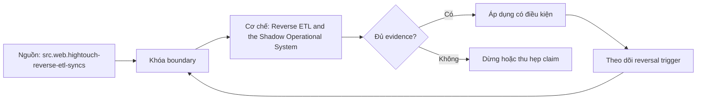

# Reverse ETL and the Shadow Operational System

> [!abstract] Câu hỏi trung tâm
> Reverse ETL được thiết kế thế nào để giữ system-of-record boundary, identity và retry safety, purpose limitation và vòng phản hồi có thể truy vết?

## 1. Activation khác system of record

Reverse ETL chuyển warehouse-derived rows, scores hoặc audiences sang CRM, support, marketing hoặc operational tools để hành động. Warehouse có thể là authoritative computation cho derived attribute nhưng không mặc nhiên là owner của customer consent, order state hoặc workflow truth. Với mỗi field ghi system of record, calculation owner, destination use, write authority và conflict rule. Destination edits có được phép không; nếu có, chúng quay về đâu. Shadow operational system xuất hiện khi daily workflow phụ thuộc sync nhưng ownership, SLO, incident response và state authority vẫn được đối xử như analytics batch.

## 2. Identity, matching và delete semantics

Stable destination key phải unique, immutable trong horizon và map được với consent/tenant context. `user_id` không đủ cho event nếu nhiều events cùng user; composite/event ID cần uniqueness. Hightouch docs cho thấy CDC dựa primary key và key change có thể tạo add/remove ngoài dự kiến. Chốt insert/update/upsert/archive/all, field mapping, null semantics, record leaving segment và hard/soft delete. Một removed warehouse row không mặc nhiên có nghĩa xóa customer ở CRM. Trước full resync cần biết destination side effects và duplicate risk.

## 3. Idempotency và retry boundary

Network timeout không cho biết destination đã áp write hay chưa. Operation có deterministic idempotency key theo business action/version, request fingerprint và durable outcome record; retry cùng intent không tạo side effect mới. Stripe documentation minh họa idempotency key cho request retry, nhưng mỗi destination có semantics/retention khác. Upsert record có thể idempotent về final fields nhưng trigger email, campaign enrollment hoặc webhook không idempotent. Tách state synchronization khỏi commands/events; action side effect cần command ID, dedupe và replay policy.

## 4. Purpose limitation và field minimization

Dữ liệu được thu cho analytics không tự được phép dùng để target, deny service hoặc trigger outreach. ICO guidance yêu cầu specified purposes và review further processing; legal basis, notice và jurisdiction do owner pháp lý xác định. Mỗi sync có purpose ID, approved fields, sensitive/protected attributes, recipient, retention và allowed action. Không sync field chỉ vì có sẵn. Derived score có thể tiết lộ sensitive inference dù input đã aggregate. Test denied mapping và purpose mismatch, đồng thời kiểm destination admins/exports.

## 5. Feedback loop làm đổi dữ liệu

Ví dụ warehouse tính churn score, sync sang CRM; agent gọi ưu đãi, outcome quay vào source rồi model học rằng nhóm score cao có retention tốt. Intervention làm thay distribution và outcome, nên score-performance drift không chỉ do model. Gắn exposure/intervention ID, policy/version, assignment/time và suppress re-entry khi cần. Phân biệt organic outcome với treated outcome; causal evaluation cần design phù hợp. Lineage graph phải có vòng destination action → operational event → ingestion → model, không dừng ở một chiều warehouse → CRM.

## 6. SLO và dấu hiệu shadow system

Theo dõi source cutoff, model run, CDC baseline, queued operations, destination accepted/rejected, retry age, duplicate/conflict, privacy block và end-to-end action latency. Ba dấu hiệu mạnh: workflow không chạy nếu analytics sync trễ; team hứa operational SLO nhưng không có on-call/recovery; không rõ state nào thắng khi warehouse và destination khác nhau. Bổ sung manual override, backfill/resync runbook, destination rate-limit/partial failure handling và reconciliation. Completed sync với rejected rows không phải success toàn phần.

## 7. Architecture review ba trường hợp

Case A sync descriptive account tier vào CRM với SoR rõ và idempotent upsert. Case B sync audience membership rồi auto-send message, cần purpose/consent, command dedupe và intervention logging. Case C sync operational status từ warehouse rồi agents sửa destination và ingest ngược, tạo bi-directional conflict/feedback. Với mỗi case vẽ nodes/edges, state authority, identity, retry/delete, privacy purpose, feedback và SLO owner. Chỉ ra violated constraint và smallest control; nếu operational criticality vượt platform capability, chuyển state computation/write vào operational service.

## 8. Ma trận kiểm chứng từng mệnh đề

Mọi kết luận cần raw artifact, version và failure signal. Một dashboard xanh, sync completed, catalog label hoặc bảng cost có số không tự chứng minh correctness, security, value hay readiness.

### 8.1. warehouse-derived field không mặc nhiên là operational source of truth

**Mệnh đề cần kiểm.** warehouse-derived field không mặc nhiên là operational source of truth.

**Cách kiểm.** Vẽ source-model-sync-destination-action-event loop; inject timeout-after-commit, duplicate key, key change, removed row, purpose mismatch và rejected destination rows. Kiểm idempotency, authority, privacy, reconciliation và intervention lineage. Với mệnh đề này, ghi environment/product/policy version, input shape, expected observation, failure signal và boundary làm kết luận không còn đúng.

**Bằng chứng đạt cho `wiki.data-product.reverse-etl-shadow-system`.** Lưu contract/policy, fixture hoặc event extract, command/query, raw output, numerator-denominator hoặc cost reconciliation, reviewer và artifact hash. Nếu chưa chạy lab trên hệ được phép, chỉ ghi protocol; không biến expected result thành evidence.

### 8.2. mỗi field có authority và conflict rule

**Mệnh đề cần kiểm.** mỗi field có authority và conflict rule.

**Cách kiểm.** Vẽ source-model-sync-destination-action-event loop; inject timeout-after-commit, duplicate key, key change, removed row, purpose mismatch và rejected destination rows. Kiểm idempotency, authority, privacy, reconciliation và intervention lineage. Với mệnh đề này, ghi environment/product/policy version, input shape, expected observation, failure signal và boundary làm kết luận không còn đúng.

**Bằng chứng đạt cho `wiki.data-product.reverse-etl-shadow-system`.** Lưu contract/policy, fixture hoặc event extract, command/query, raw output, numerator-denominator hoặc cost reconciliation, reviewer và artifact hash. Nếu chưa chạy lab trên hệ được phép, chỉ ghi protocol; không biến expected result thành evidence.

### 8.3. primary key change làm CDC identity đổi

**Mệnh đề cần kiểm.** primary key change làm CDC identity đổi.

**Cách kiểm.** Vẽ source-model-sync-destination-action-event loop; inject timeout-after-commit, duplicate key, key change, removed row, purpose mismatch và rejected destination rows. Kiểm idempotency, authority, privacy, reconciliation và intervention lineage. Với mệnh đề này, ghi environment/product/policy version, input shape, expected observation, failure signal và boundary làm kết luận không còn đúng.

**Bằng chứng đạt cho `wiki.data-product.reverse-etl-shadow-system`.** Lưu contract/policy, fixture hoặc event extract, command/query, raw output, numerator-denominator hoặc cost reconciliation, reviewer và artifact hash. Nếu chưa chạy lab trên hệ được phép, chỉ ghi protocol; không biến expected result thành evidence.

### 8.4. record leaving segment không mặc nhiên hard delete

**Mệnh đề cần kiểm.** record leaving segment không mặc nhiên hard delete.

**Cách kiểm.** Vẽ source-model-sync-destination-action-event loop; inject timeout-after-commit, duplicate key, key change, removed row, purpose mismatch và rejected destination rows. Kiểm idempotency, authority, privacy, reconciliation và intervention lineage. Với mệnh đề này, ghi environment/product/policy version, input shape, expected observation, failure signal và boundary làm kết luận không còn đúng.

**Bằng chứng đạt cho `wiki.data-product.reverse-etl-shadow-system`.** Lưu contract/policy, fixture hoặc event extract, command/query, raw output, numerator-denominator hoặc cost reconciliation, reviewer và artifact hash. Nếu chưa chạy lab trên hệ được phép, chỉ ghi protocol; không biến expected result thành evidence.

### 8.5. full resync có thể duplicate side effects

**Mệnh đề cần kiểm.** full resync có thể duplicate side effects.

**Cách kiểm.** Vẽ source-model-sync-destination-action-event loop; inject timeout-after-commit, duplicate key, key change, removed row, purpose mismatch và rejected destination rows. Kiểm idempotency, authority, privacy, reconciliation và intervention lineage. Với mệnh đề này, ghi environment/product/policy version, input shape, expected observation, failure signal và boundary làm kết luận không còn đúng.

**Bằng chứng đạt cho `wiki.data-product.reverse-etl-shadow-system`.** Lưu contract/policy, fixture hoặc event extract, command/query, raw output, numerator-denominator hoặc cost reconciliation, reviewer và artifact hash. Nếu chưa chạy lab trên hệ được phép, chỉ ghi protocol; không biến expected result thành evidence.

### 8.6. retry timeout cần idempotency key and outcome record

**Mệnh đề cần kiểm.** retry timeout cần idempotency key and outcome record.

**Cách kiểm.** Vẽ source-model-sync-destination-action-event loop; inject timeout-after-commit, duplicate key, key change, removed row, purpose mismatch và rejected destination rows. Kiểm idempotency, authority, privacy, reconciliation và intervention lineage. Với mệnh đề này, ghi environment/product/policy version, input shape, expected observation, failure signal và boundary làm kết luận không còn đúng.

**Bằng chứng đạt cho `wiki.data-product.reverse-etl-shadow-system`.** Lưu contract/policy, fixture hoặc event extract, command/query, raw output, numerator-denominator hoặc cost reconciliation, reviewer và artifact hash. Nếu chưa chạy lab trên hệ được phép, chỉ ghi protocol; không biến expected result thành evidence.

### 8.7. upsert state khác action command

**Mệnh đề cần kiểm.** upsert state khác action command.

**Cách kiểm.** Vẽ source-model-sync-destination-action-event loop; inject timeout-after-commit, duplicate key, key change, removed row, purpose mismatch và rejected destination rows. Kiểm idempotency, authority, privacy, reconciliation và intervention lineage. Với mệnh đề này, ghi environment/product/policy version, input shape, expected observation, failure signal và boundary làm kết luận không còn đúng.

**Bằng chứng đạt cho `wiki.data-product.reverse-etl-shadow-system`.** Lưu contract/policy, fixture hoặc event extract, command/query, raw output, numerator-denominator hoặc cost reconciliation, reviewer và artifact hash. Nếu chưa chạy lab trên hệ được phép, chỉ ghi protocol; không biến expected result thành evidence.

### 8.8. purpose limitation áp cho further processing

**Mệnh đề cần kiểm.** purpose limitation áp cho further processing.

**Cách kiểm.** Vẽ source-model-sync-destination-action-event loop; inject timeout-after-commit, duplicate key, key change, removed row, purpose mismatch và rejected destination rows. Kiểm idempotency, authority, privacy, reconciliation và intervention lineage. Với mệnh đề này, ghi environment/product/policy version, input shape, expected observation, failure signal và boundary làm kết luận không còn đúng.

**Bằng chứng đạt cho `wiki.data-product.reverse-etl-shadow-system`.** Lưu contract/policy, fixture hoặc event extract, command/query, raw output, numerator-denominator hoặc cost reconciliation, reviewer và artifact hash. Nếu chưa chạy lab trên hệ được phép, chỉ ghi protocol; không biến expected result thành evidence.

### 8.9. derived score có thể là sensitive inference

**Mệnh đề cần kiểm.** derived score có thể là sensitive inference.

**Cách kiểm.** Vẽ source-model-sync-destination-action-event loop; inject timeout-after-commit, duplicate key, key change, removed row, purpose mismatch và rejected destination rows. Kiểm idempotency, authority, privacy, reconciliation và intervention lineage. Với mệnh đề này, ghi environment/product/policy version, input shape, expected observation, failure signal và boundary làm kết luận không còn đúng.

**Bằng chứng đạt cho `wiki.data-product.reverse-etl-shadow-system`.** Lưu contract/policy, fixture hoặc event extract, command/query, raw output, numerator-denominator hoặc cost reconciliation, reviewer và artifact hash. Nếu chưa chạy lab trên hệ được phép, chỉ ghi protocol; không biến expected result thành evidence.

### 8.10. sync cần approved-field allowlist

**Mệnh đề cần kiểm.** sync cần approved-field allowlist.

**Cách kiểm.** Vẽ source-model-sync-destination-action-event loop; inject timeout-after-commit, duplicate key, key change, removed row, purpose mismatch và rejected destination rows. Kiểm idempotency, authority, privacy, reconciliation và intervention lineage. Với mệnh đề này, ghi environment/product/policy version, input shape, expected observation, failure signal và boundary làm kết luận không còn đúng.

**Bằng chứng đạt cho `wiki.data-product.reverse-etl-shadow-system`.** Lưu contract/policy, fixture hoặc event extract, command/query, raw output, numerator-denominator hoặc cost reconciliation, reviewer và artifact hash. Nếu chưa chạy lab trên hệ được phép, chỉ ghi protocol; không biến expected result thành evidence.

### 8.11. intervention làm thay outcome distribution

**Mệnh đề cần kiểm.** intervention làm thay outcome distribution.

**Cách kiểm.** Vẽ source-model-sync-destination-action-event loop; inject timeout-after-commit, duplicate key, key change, removed row, purpose mismatch và rejected destination rows. Kiểm idempotency, authority, privacy, reconciliation và intervention lineage. Với mệnh đề này, ghi environment/product/policy version, input shape, expected observation, failure signal và boundary làm kết luận không còn đúng.

**Bằng chứng đạt cho `wiki.data-product.reverse-etl-shadow-system`.** Lưu contract/policy, fixture hoặc event extract, command/query, raw output, numerator-denominator hoặc cost reconciliation, reviewer và artifact hash. Nếu chưa chạy lab trên hệ được phép, chỉ ghi protocol; không biến expected result thành evidence.

### 8.12. feedback lineage phải quay từ destination về source

**Mệnh đề cần kiểm.** feedback lineage phải quay từ destination về source.

**Cách kiểm.** Vẽ source-model-sync-destination-action-event loop; inject timeout-after-commit, duplicate key, key change, removed row, purpose mismatch và rejected destination rows. Kiểm idempotency, authority, privacy, reconciliation và intervention lineage. Với mệnh đề này, ghi environment/product/policy version, input shape, expected observation, failure signal và boundary làm kết luận không còn đúng.

**Bằng chứng đạt cho `wiki.data-product.reverse-etl-shadow-system`.** Lưu contract/policy, fixture hoặc event extract, command/query, raw output, numerator-denominator hoặc cost reconciliation, reviewer và artifact hash. Nếu chưa chạy lab trên hệ được phép, chỉ ghi protocol; không biến expected result thành evidence.

### 8.13. completed with rejected rows không phải full success

**Mệnh đề cần kiểm.** completed with rejected rows không phải full success.

**Cách kiểm.** Vẽ source-model-sync-destination-action-event loop; inject timeout-after-commit, duplicate key, key change, removed row, purpose mismatch và rejected destination rows. Kiểm idempotency, authority, privacy, reconciliation và intervention lineage. Với mệnh đề này, ghi environment/product/policy version, input shape, expected observation, failure signal và boundary làm kết luận không còn đúng.

**Bằng chứng đạt cho `wiki.data-product.reverse-etl-shadow-system`.** Lưu contract/policy, fixture hoặc event extract, command/query, raw output, numerator-denominator hoặc cost reconciliation, reviewer và artifact hash. Nếu chưa chạy lab trên hệ được phép, chỉ ghi protocol; không biến expected result thành evidence.

### 8.14. operational SLO cần on-call and recovery

**Mệnh đề cần kiểm.** operational SLO cần on-call and recovery.

**Cách kiểm.** Vẽ source-model-sync-destination-action-event loop; inject timeout-after-commit, duplicate key, key change, removed row, purpose mismatch và rejected destination rows. Kiểm idempotency, authority, privacy, reconciliation và intervention lineage. Với mệnh đề này, ghi environment/product/policy version, input shape, expected observation, failure signal và boundary làm kết luận không còn đúng.

**Bằng chứng đạt cho `wiki.data-product.reverse-etl-shadow-system`.** Lưu contract/policy, fixture hoặc event extract, command/query, raw output, numerator-denominator hoặc cost reconciliation, reviewer và artifact hash. Nếu chưa chạy lab trên hệ được phép, chỉ ghi protocol; không biến expected result thành evidence.

### 8.15. bidirectional edits cần explicit conflict resolution

**Mệnh đề cần kiểm.** bidirectional edits cần explicit conflict resolution.

**Cách kiểm.** Vẽ source-model-sync-destination-action-event loop; inject timeout-after-commit, duplicate key, key change, removed row, purpose mismatch và rejected destination rows. Kiểm idempotency, authority, privacy, reconciliation và intervention lineage. Với mệnh đề này, ghi environment/product/policy version, input shape, expected observation, failure signal và boundary làm kết luận không còn đúng.

**Bằng chứng đạt cho `wiki.data-product.reverse-etl-shadow-system`.** Lưu contract/policy, fixture hoặc event extract, command/query, raw output, numerator-denominator hoặc cost reconciliation, reviewer và artifact hash. Nếu chưa chạy lab trên hệ được phép, chỉ ghi protocol; không biến expected result thành evidence.

## 9. Quy trình phản biện

1. Chốt product, consumer, decision, environment và criticality trước khi chọn metric hoặc control.
2. Tách tool capability, configured policy, observed behavior và business outcome.
3. Ghi stable IDs, versions, time window, denominator, allocation hoặc identity rules.
4. Kiểm negative/failure path, overload, retry, stale state, hidden consumer và changed constraint.
5. Phân loại source fact, curriculum synthesis, organizational policy và untested hypothesis.
6. Lưu uncertainty, unallocated/unknown set và stop condition; không ép bảng phải cho kết luận.
7. Chưa có execution evidence thì giữ trạng thái `review`.

## 10. Câu hỏi tự kiểm tra

1. Invariant hoặc decision nào đang được bảo vệ?
2. Chủ thể, resource, event hay cost unit được định danh bằng gì?
3. Denominator, time window và unknown/unallocated set là gì?
4. Failure nào vẫn cho tín hiệu xanh hoặc completed?
5. Thay đổi nào làm policy, metric, allocation hoặc state transition phải xem lại?
6. Ai có quyền duyệt, ai vận hành và bằng chứng nào còn chưa chạy?

## 11. Giới hạn và điều chưa cho phép kết luận

- Chưa chạy security/load test, adoption analysis, cost allocation, reverse-ETL fault injection hoặc lifecycle exercise; note mô tả protocol và expected evidence.
- Tài liệu web được kiểm ngày 2026-10-01; feature, pricing, law/guidance và vendor behavior có thể đổi.
- Metrics, cost categories, shadow-system constraints và six-state lifecycle là curriculum synthesis; không gán nguyên văn cho một nguồn.
- Guidance privacy không thay legal review; performance/security examples không thay threat model và production authorization.
- Note giữ trạng thái `review` cho tới khi chủ dự án duyệt semantic meaning.

## Reference
1. [[SRC-HIGHTOUCH-REVERSE-ETL-SYNCS]]
2. [[SRC-ICO-PURPOSE-LIMITATION]]
3. [[SRC-STRIPE-IDEMPOTENT-REQUESTS]]

## Source coverage

| Source slice | Nội dung sử dụng | Trạng thái |
|---|---|---|
| [[SRC-HIGHTOUCH-REVERSE-ETL-SYNCS]] | Khái niệm, mechanism hoặc governance boundary liên quan | Đã đọc locator trong source record; không suy ngoài phạm vi |
| [[SRC-ICO-PURPOSE-LIMITATION]] | Khái niệm, mechanism hoặc governance boundary liên quan | Đã đọc locator trong source record; không suy ngoài phạm vi |
| [[SRC-STRIPE-IDEMPOTENT-REQUESTS]] | Khái niệm, mechanism hoặc governance boundary liên quan | Đã đọc locator trong source record; không suy ngoài phạm vi |

## Key takeaways
- Reverse ETL an toàn cần authority, identity, idempotency, purpose và feedback lineage rõ trước operational use.
- Mọi phép đo hoặc gate cần stable version, owner, denominator/scope và failure evidence.
- Signal dễ lấy không được dùng thay decision outcome, correctness hoặc user safety.
- Unknown consumers, unallocated costs, rejected rows và expired evidence phải hiển thị, không mặc định bằng zero.
- Chưa chạy lab thì artifact là tài liệu học thuật đã kiểm cấu trúc, không phải chứng nhận production.

<!-- ATOMIC-EXECUTION-CAPSULE:START -->

## Execution capsule: kiểm chứng `wiki.data-product.reverse-etl-shadow-system`

> [!important] Phân loại mệnh đề
> Với `wiki.data-product.reverse-etl-shadow-system`, sơ đồ, ví dụ và artifact về **Reverse ETL and the Shadow Operational System** là **synthesis để kiểm chứng**; chúng không phải trích dẫn hay case nguyên văn của nguồn.

### Sơ đồ cơ chế và điểm kiểm soát



Đọc sơ đồ `wiki.data-product.reverse-etl-shadow-system` từ trái sang phải: source chỉ cung cấp claim ban đầu cho **Reverse ETL and the Shadow Operational System**; quyết định chỉ được đi tiếp sau khi boundary, evidence và điều kiện đảo quyết định đã hiện hữu.

### Artifact thực thi tối thiểu

```sql
-- Verification harness for: Reverse ETL and the Shadow Operational System
WITH evidence AS (
    SELECT 'wiki.data-product.reverse-etl-shadow-system' AS concept_id,
           'boundary_declared' AS check_name, 1 AS passed
    UNION ALL
    SELECT 'wiki.data-product.reverse-etl-shadow-system', 'independent_oracle', 1
    UNION ALL
    SELECT 'wiki.data-product.reverse-etl-shadow-system', 'reversal_trigger_recorded', 1
)
SELECT concept_id,
       MIN(passed) AS all_hard_checks_pass,
       COUNT(*) AS evidence_items
FROM evidence
GROUP BY concept_id
HAVING MIN(passed) = 1;
```

Artifact của `wiki.data-product.reverse-etl-shadow-system` buộc người dùng ghi boundary, oracle và reversal trigger cho **Reverse ETL and the Shadow Operational System**. Các giá trị minh họa phải được thay bằng evidence thật trước khi dùng cho quyết định.

### Tự kiểm tra trước khi tái sử dụng

1. Bạn có thể trả lời `Reverse ETL được thiết kế thế nào để giữ system-of-record boundary, identity và retry safety, purpose limitation và vòng phản hồi có thể truy vết?` bằng một câu mà không kéo thêm concept thứ hai không?
2. Source locator nào đỡ cho claim, và phần nào chỉ là synthesis trong note?
3. Observation nào khiến bạn dừng, thu hẹp hoặc đảo quyết định?
4. Artifact nào cho phép một reviewer độc lập tái hiện kết quả?

<!-- ATOMIC-EXECUTION-CAPSULE:END -->
