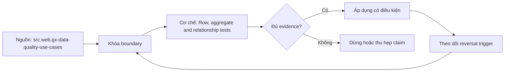

# Row, aggregate and relationship tests

> [!abstract] Câu hỏi trung tâm
> Chọn row, aggregate và relationship tests ra sao để không bỏ lọt lỗi bù trừ hoặc tạo scan thừa?

## 1. Row predicates

Row test định vị record vi phạm tốt nhưng cần null semantics, conditional population và stable failure identity. Đừng bắt đầu bằng tên công cụ. Hãy bắt đầu bằng đối tượng được bảo vệ, boundary quan sát được và hậu quả nếu kết luận sai. Trong bài `Row, aggregate and relationship tests`, câu hỏi thực dụng là: Chọn row, aggregate và relationship tests ra sao để không bỏ lọt lỗi bù trừ hoặc tạo scan thừa? Ta ghi rõ grain, population, time window, owner và hành động sau failure; nếu một trường chưa biết thì đánh dấu unknown thay vì lấp bằng mặc định. Bằng chứng tối thiểu gồm fixture có version, cấu hình hoặc rule đã resolve, raw observation, expected result và limitation. Phần này là curriculum synthesis dựa trên các nguồn đã định danh, không phải lời hứa rằng mọi adapter hay deployment đều có cùng hành vi.

## 2. Aggregate controls

Count, sum, distribution và ratio thấy drift toàn cục nhưng missing và duplicate có thể bù nhau. Điểm khó không nằm ở cú pháp mà ở identity và scope. Hai phép đo cùng tên vẫn có thể nói về hai population hoặc hai thời điểm khác nhau. Trong bài `Row, aggregate and relationship tests`, câu hỏi thực dụng là: Chọn row, aggregate và relationship tests ra sao để không bỏ lọt lỗi bù trừ hoặc tạo scan thừa? Ta ghi rõ grain, population, time window, owner và hành động sau failure; nếu một trường chưa biết thì đánh dấu unknown thay vì lấp bằng mặc định. Bằng chứng tối thiểu gồm fixture có version, cấu hình hoặc rule đã resolve, raw observation, expected result và limitation. Phần này là curriculum synthesis dựa trên các nguồn đã định danh, không phải lời hứa rằng mọi adapter hay deployment đều có cùng hành vi.

## 3. Relationship checks

Referential, temporal và many-to-many constraints cần key normalization, effective-time alignment và orphan policy. Một dashboard xanh chỉ là tín hiệu. Muốn biến nó thành bằng chứng phải giữ input, phiên bản, rule, trạng thái trước-sau và cách tính độc lập. Trong bài `Row, aggregate and relationship tests`, câu hỏi thực dụng là: Chọn row, aggregate và relationship tests ra sao để không bỏ lọt lỗi bù trừ hoặc tạo scan thừa? Ta ghi rõ grain, population, time window, owner và hành động sau failure; nếu một trường chưa biết thì đánh dấu unknown thay vì lấp bằng mặc định. Bằng chứng tối thiểu gồm fixture có version, cấu hình hoặc rule đã resolve, raw observation, expected result và limitation. Phần này là curriculum synthesis dựa trên các nguồn đã định danh, không phải lời hứa rằng mọi adapter hay deployment đều có cùng hành vi.

## 4. Cross-level triangulation

Kết hợp row samples, group totals và key-set anti-join để một lớp bù điểm mù của lớp kia. Thiết kế tốt phải chịu được counterexample. Hãy chủ động tạo case sát boundary, case thiếu dữ liệu và case replay thay vì chỉ chạy happy path. Trong bài `Row, aggregate and relationship tests`, câu hỏi thực dụng là: Chọn row, aggregate và relationship tests ra sao để không bỏ lọt lỗi bù trừ hoặc tạo scan thừa? Ta ghi rõ grain, population, time window, owner và hành động sau failure; nếu một trường chưa biết thì đánh dấu unknown thay vì lấp bằng mặc định. Bằng chứng tối thiểu gồm fixture có version, cấu hình hoặc rule đã resolve, raw observation, expected result và limitation. Phần này là curriculum synthesis dựa trên các nguồn đã định danh, không phải lời hứa rằng mọi adapter hay deployment đều có cùng hành vi.

## 5. Execution economics

Incremental partitions, sampled warning và full release check có coverage khác nhau phải được công bố. Chi phí vận hành thuộc contract. Một rule đúng nhưng quá đắt, quá ồn hoặc không có owner sẽ nhanh chóng bị tắt và mất tác dụng. Trong bài `Row, aggregate and relationship tests`, câu hỏi thực dụng là: Chọn row, aggregate và relationship tests ra sao để không bỏ lọt lỗi bù trừ hoặc tạo scan thừa? Ta ghi rõ grain, population, time window, owner và hành động sau failure; nếu một trường chưa biết thì đánh dấu unknown thay vì lấp bằng mặc định. Bằng chứng tối thiểu gồm fixture có version, cấu hình hoặc rule đã resolve, raw observation, expected result và limitation. Phần này là curriculum synthesis dựa trên các nguồn đã định danh, không phải lời hứa rằng mọi adapter hay deployment đều có cùng hành vi.

## 6. Failure outputs

Result giữ failed keys, group dimensions, expected/observed metrics và query version để remediation khả thi. Kết luận cần có điều kiện đảo chiều. Khi volume, latency, nguồn thẩm quyền hoặc topology đổi, quyết định cũ phải được xem xét lại bằng cùng một oracle. Trong bài `Row, aggregate and relationship tests`, câu hỏi thực dụng là: Chọn row, aggregate và relationship tests ra sao để không bỏ lọt lỗi bù trừ hoặc tạo scan thừa? Ta ghi rõ grain, population, time window, owner và hành động sau failure; nếu một trường chưa biết thì đánh dấu unknown thay vì lấp bằng mặc định. Bằng chứng tối thiểu gồm fixture có version, cấu hình hoặc rule đã resolve, raw observation, expected result và limitation. Phần này là curriculum synthesis dựa trên các nguồn đã định danh, không phải lời hứa rằng mọi adapter hay deployment đều có cùng hành vi.

## 7. Ma trận kiểm chứng từng mệnh đề

Với `wiki.data-quality.row-aggregate-relationship-tests`, command thành công không tự chứng minh dữ liệu đúng. Protocol riêng của bài là: Tạo positive/negative fixture ở đúng grain, chạy rule đã version hóa và so failing keys/metrics với một oracle độc lập. Mỗi probe dưới đây phải nối input boundary với failure signal và oracle có thể phản bác kết luận.

### 7.1. Row, aggregate and relationship tests: kiểm `Row predicates` bằng case 1, cụ thể row test định vị record vi phạm tốt nhưng cần null semantics, conditional population và stable failure identity

**Mệnh đề cần kiểm.** Row, aggregate and relationship tests: kiểm `Row predicates` bằng case 1, cụ thể row test định vị record vi phạm tốt nhưng cần null semantics, conditional population và stable failure identity.

**Thiết kế phép thử cho `wiki.data-quality.row-aggregate-relationship-tests`.** Trong ngữ cảnh `wiki.data-quality.row-aggregate-relationship-tests`, tạo positive control và negative control chỉ khác đúng một điều kiện. Khóa input snapshot, phiên bản và owner của rule; chạy đúng population được bài `Row, aggregate and relationship tests` công bố.

**Bằng chứng cần giữ.** Đối với probe 1 của `Row, aggregate and relationship tests`, giữ fixture, raw failing rows và lệnh tái hiện. Nếu chưa chạy lab, ghi expected evidence và giữ trạng thái review; không biến protocol thành observation.

### 7.2. Row, aggregate and relationship tests: kiểm `Aggregate controls` bằng case 2, cụ thể count, sum, distribution và ratio thấy drift toàn cục nhưng missing và duplicate có thể bù nhau

**Mệnh đề cần kiểm.** Row, aggregate and relationship tests: kiểm `Aggregate controls` bằng case 2, cụ thể count, sum, distribution và ratio thấy drift toàn cục nhưng missing và duplicate có thể bù nhau.

**Thiết kế phép thử cho `wiki.data-quality.row-aggregate-relationship-tests`.** Trong ngữ cảnh `wiki.data-quality.row-aggregate-relationship-tests`, đổi grain nhưng giữ tổng số dòng để lộ phép đo sai cấp. Khóa input snapshot, phiên bản và owner của rule; chạy đúng population được bài `Row, aggregate and relationship tests` công bố.

**Bằng chứng cần giữ.** Đối với probe 2 của `Row, aggregate and relationship tests`, báo numerator, denominator và key set ở cả hai grain. Nếu chưa chạy lab, ghi expected evidence và giữ trạng thái review; không biến protocol thành observation.

### 7.3. Row, aggregate and relationship tests: kiểm `Relationship checks` bằng case 3, cụ thể referential, temporal và many-to-many constraints cần key normalization, effective-time alignment và orphan policy

**Mệnh đề cần kiểm.** Row, aggregate and relationship tests: kiểm `Relationship checks` bằng case 3, cụ thể referential, temporal và many-to-many constraints cần key normalization, effective-time alignment và orphan policy.

**Thiết kế phép thử cho `wiki.data-quality.row-aggregate-relationship-tests`.** Trong ngữ cảnh `wiki.data-quality.row-aggregate-relationship-tests`, đưa một giá trị tới đúng boundary và một giá trị vượt boundary. Khóa input snapshot, phiên bản và owner của rule; chạy đúng population được bài `Row, aggregate and relationship tests` công bố.

**Bằng chứng cần giữ.** Đối với probe 3 của `Row, aggregate and relationship tests`, lưu hai observed values cùng rule đã resolve. Nếu chưa chạy lab, ghi expected evidence và giữ trạng thái review; không biến protocol thành observation.

### 7.4. Row, aggregate and relationship tests: kiểm `Cross-level triangulation` bằng case 4, cụ thể kết hợp row samples, group totals và key-set anti-join để một lớp bù điểm mù của lớp kia

**Mệnh đề cần kiểm.** Row, aggregate and relationship tests: kiểm `Cross-level triangulation` bằng case 4, cụ thể kết hợp row samples, group totals và key-set anti-join để một lớp bù điểm mù của lớp kia.

**Thiết kế phép thử cho `wiki.data-quality.row-aggregate-relationship-tests`.** Trong ngữ cảnh `wiki.data-quality.row-aggregate-relationship-tests`, kill tiến trình ngay trước rồi ngay sau durable side effect. Khóa input snapshot, phiên bản và owner của rule; chạy đúng population được bài `Row, aggregate and relationship tests` công bố.

**Bằng chứng cần giữ.** Đối với probe 4 của `Row, aggregate and relationship tests`, lưu checkpoint, external ledger và trạng thái sau restart. Nếu chưa chạy lab, ghi expected evidence và giữ trạng thái review; không biến protocol thành observation.

### 7.5. Row, aggregate and relationship tests: kiểm `Execution economics` bằng case 5, cụ thể incremental partitions, sampled warning và full release check có coverage khác nhau phải được công bố

**Mệnh đề cần kiểm.** Row, aggregate and relationship tests: kiểm `Execution economics` bằng case 5, cụ thể incremental partitions, sampled warning và full release check có coverage khác nhau phải được công bố.

**Thiết kế phép thử cho `wiki.data-quality.row-aggregate-relationship-tests`.** Trong ngữ cảnh `wiki.data-quality.row-aggregate-relationship-tests`, đảo thứ tự input và concurrency nhưng giữ logical population. Khóa input snapshot, phiên bản và owner của rule; chạy đúng population được bài `Row, aggregate and relationship tests` công bố.

**Bằng chứng cần giữ.** Đối với probe 5 của `Row, aggregate and relationship tests`, so canonical hash và business totals giữa các thứ tự. Nếu chưa chạy lab, ghi expected evidence và giữ trạng thái review; không biến protocol thành observation.

### 7.6. Row, aggregate and relationship tests: kiểm `Failure outputs` bằng case 6, cụ thể result giữ failed keys, group dimensions, expected/observed metrics và query version để remediation khả thi

**Mệnh đề cần kiểm.** Row, aggregate and relationship tests: kiểm `Failure outputs` bằng case 6, cụ thể result giữ failed keys, group dimensions, expected/observed metrics và query version để remediation khả thi.

**Thiết kế phép thử cho `wiki.data-quality.row-aggregate-relationship-tests`.** Trong ngữ cảnh `wiki.data-quality.row-aggregate-relationship-tests`, replay cùng identity với payload giống rồi payload xung đột. Khóa input snapshot, phiên bản và owner của rule; chạy đúng population được bài `Row, aggregate and relationship tests` công bố.

**Bằng chứng cần giữ.** Đối với probe 6 của `Row, aggregate and relationship tests`, tách duplicate replay khỏi identity collision bằng reason code. Nếu chưa chạy lab, ghi expected evidence và giữ trạng thái review; không biến protocol thành observation.

### 7.7. Row, aggregate and relationship tests: kiểm `Row predicates` bằng case 7, cụ thể row test định vị record vi phạm tốt nhưng cần null semantics, conditional population và stable failure identity

**Mệnh đề cần kiểm.** Row, aggregate and relationship tests: kiểm `Row predicates` bằng case 7, cụ thể row test định vị record vi phạm tốt nhưng cần null semantics, conditional population và stable failure identity.

**Thiết kế phép thử cho `wiki.data-quality.row-aggregate-relationship-tests`.** Trong ngữ cảnh `wiki.data-quality.row-aggregate-relationship-tests`, thêm record tới trễ trong horizon và ngoài horizon. Khóa input snapshot, phiên bản và owner của rule; chạy đúng population được bài `Row, aggregate and relationship tests` công bố.

**Bằng chứng cần giữ.** Đối với probe 7 của `Row, aggregate and relationship tests`, báo accepted-late, rejected-late và oldest outstanding timestamp. Nếu chưa chạy lab, ghi expected evidence và giữ trạng thái review; không biến protocol thành observation.

### 7.8. Row, aggregate and relationship tests: kiểm `Aggregate controls` bằng case 8, cụ thể count, sum, distribution và ratio thấy drift toàn cục nhưng missing và duplicate có thể bù nhau

**Mệnh đề cần kiểm.** Row, aggregate and relationship tests: kiểm `Aggregate controls` bằng case 8, cụ thể count, sum, distribution và ratio thấy drift toàn cục nhưng missing và duplicate có thể bù nhau.

**Thiết kế phép thử cho `wiki.data-quality.row-aggregate-relationship-tests`.** Trong ngữ cảnh `wiki.data-quality.row-aggregate-relationship-tests`, đổi schema theo một cách tương thích rồi một cách phá vỡ semantics. Khóa input snapshot, phiên bản và owner của rule; chạy đúng population được bài `Row, aggregate and relationship tests` công bố.

**Bằng chứng cần giữ.** Đối với probe 8 của `Row, aggregate and relationship tests`, giữ schema diff, classification và consumer-visible result. Nếu chưa chạy lab, ghi expected evidence và giữ trạng thái review; không biến protocol thành observation.

### 7.9. Row, aggregate and relationship tests: kiểm `Relationship checks` bằng case 9, cụ thể referential, temporal và many-to-many constraints cần key normalization, effective-time alignment và orphan policy

**Mệnh đề cần kiểm.** Row, aggregate and relationship tests: kiểm `Relationship checks` bằng case 9, cụ thể referential, temporal và many-to-many constraints cần key normalization, effective-time alignment và orphan policy.

**Thiết kế phép thử cho `wiki.data-quality.row-aggregate-relationship-tests`.** Trong ngữ cảnh `wiki.data-quality.row-aggregate-relationship-tests`, tạo missing và duplicate bù nhau để count tổng không đổi. Khóa input snapshot, phiên bản và owner của rule; chạy đúng population được bài `Row, aggregate and relationship tests` công bố.

**Bằng chứng cần giữ.** Đối với probe 9 của `Row, aggregate and relationship tests`, so key multiset và typed hashes thay vì chỉ row count. Nếu chưa chạy lab, ghi expected evidence và giữ trạng thái review; không biến protocol thành observation.

### 7.10. Row, aggregate and relationship tests: kiểm `Cross-level triangulation` bằng case 10, cụ thể kết hợp row samples, group totals và key-set anti-join để một lớp bù điểm mù của lớp kia

**Mệnh đề cần kiểm.** Row, aggregate and relationship tests: kiểm `Cross-level triangulation` bằng case 10, cụ thể kết hợp row samples, group totals và key-set anti-join để một lớp bù điểm mù của lớp kia.

**Thiết kế phép thử cho `wiki.data-quality.row-aggregate-relationship-tests`.** Trong ngữ cảnh `wiki.data-quality.row-aggregate-relationship-tests`, cho reviewer tái hiện chỉ từ evidence package. Khóa input snapshot, phiên bản và owner của rule; chạy đúng population được bài `Row, aggregate and relationship tests` công bố.

**Bằng chứng cần giữ.** Đối với probe 10 của `Row, aggregate and relationship tests`, package phải đủ để người khác dựng lại decision và limitation. Nếu chưa chạy lab, ghi expected evidence và giữ trạng thái review; không biến protocol thành observation.

### 7.11. Row, aggregate and relationship tests: kiểm `Execution economics` bằng case 11, cụ thể incremental partitions, sampled warning và full release check có coverage khác nhau phải được công bố

**Mệnh đề cần kiểm.** Row, aggregate and relationship tests: kiểm `Execution economics` bằng case 11, cụ thể incremental partitions, sampled warning và full release check có coverage khác nhau phải được công bố.

**Thiết kế phép thử cho `wiki.data-quality.row-aggregate-relationship-tests`.** Trong ngữ cảnh `wiki.data-quality.row-aggregate-relationship-tests`, so với oracle độc lập không dùng chung query hoặc parser. Khóa input snapshot, phiên bản và owner của rule; chạy đúng population được bài `Row, aggregate and relationship tests` công bố.

**Bằng chứng cần giữ.** Đối với probe 11 của `Row, aggregate and relationship tests`, independent result phải khớp ở grain đã công bố. Nếu chưa chạy lab, ghi expected evidence và giữ trạng thái review; không biến protocol thành observation.

### 7.12. Row, aggregate and relationship tests: kiểm `Failure outputs` bằng case 12, cụ thể result giữ failed keys, group dimensions, expected/observed metrics và query version để remediation khả thi

**Mệnh đề cần kiểm.** Row, aggregate and relationship tests: kiểm `Failure outputs` bằng case 12, cụ thể result giữ failed keys, group dimensions, expected/observed metrics và query version để remediation khả thi.

**Thiết kế phép thử cho `wiki.data-quality.row-aggregate-relationship-tests`.** Trong ngữ cảnh `wiki.data-quality.row-aggregate-relationship-tests`, chạy scope hẹp và population đầy đủ rồi công bố phần bị loại. Khóa input snapshot, phiên bản và owner của rule; chạy đúng population được bài `Row, aggregate and relationship tests` công bố.

**Bằng chứng cần giữ.** Đối với probe 12 của `Row, aggregate and relationship tests`, coverage phải nêu rõ excluded nodes, partitions hoặc incidents. Nếu chưa chạy lab, ghi expected evidence và giữ trạng thái review; không biến protocol thành observation.

### 7.13. Row, aggregate and relationship tests: kiểm `Row predicates` bằng case 13, cụ thể row test định vị record vi phạm tốt nhưng cần null semantics, conditional population và stable failure identity

**Mệnh đề cần kiểm.** Row, aggregate and relationship tests: kiểm `Row predicates` bằng case 13, cụ thể row test định vị record vi phạm tốt nhưng cần null semantics, conditional population và stable failure identity.

**Thiết kế phép thử cho `wiki.data-quality.row-aggregate-relationship-tests`.** Trong ngữ cảnh `wiki.data-quality.row-aggregate-relationship-tests`, thử timezone, precision hoặc partition ở hai phía của ranh giới. Khóa input snapshot, phiên bản và owner của rule; chạy đúng population được bài `Row, aggregate and relationship tests` công bố.

**Bằng chứng cần giữ.** Đối với probe 13 của `Row, aggregate and relationship tests`, UTC/local interval và rounding policy phải hiện trong output. Nếu chưa chạy lab, ghi expected evidence và giữ trạng thái review; không biến protocol thành observation.

### 7.14. Row, aggregate and relationship tests: kiểm `Aggregate controls` bằng case 14, cụ thể count, sum, distribution và ratio thấy drift toàn cục nhưng missing và duplicate có thể bù nhau

**Mệnh đề cần kiểm.** Row, aggregate and relationship tests: kiểm `Aggregate controls` bằng case 14, cụ thể count, sum, distribution và ratio thấy drift toàn cục nhưng missing và duplicate có thể bù nhau.

**Thiết kế phép thử cho `wiki.data-quality.row-aggregate-relationship-tests`.** Trong ngữ cảnh `wiki.data-quality.row-aggregate-relationship-tests`, đổi constraint đủ lớn để quyết định phải đảo. Khóa input snapshot, phiên bản và owner của rule; chạy đúng population được bài `Row, aggregate and relationship tests` công bố.

**Bằng chứng cần giữ.** Đối với probe 14 của `Row, aggregate and relationship tests`, ADR phải lưu changed constraint và reversal threshold. Nếu chưa chạy lab, ghi expected evidence và giữ trạng thái review; không biến protocol thành observation.

### 7.15. Row, aggregate and relationship tests: kiểm `Relationship checks` bằng case 15, cụ thể referential, temporal và many-to-many constraints cần key normalization, effective-time alignment và orphan policy

**Mệnh đề cần kiểm.** Row, aggregate and relationship tests: kiểm `Relationship checks` bằng case 15, cụ thể referential, temporal và many-to-many constraints cần key normalization, effective-time alignment và orphan policy.

**Thiết kế phép thử cho `wiki.data-quality.row-aggregate-relationship-tests`.** Trong ngữ cảnh `wiki.data-quality.row-aggregate-relationship-tests`, chạy lại từ môi trường sạch với versions và seed đã khóa. Khóa input snapshot, phiên bản và owner của rule; chạy đúng population được bài `Row, aggregate and relationship tests` công bố.

**Bằng chứng cần giữ.** Đối với probe 15 của `Row, aggregate and relationship tests`, canonical result phải ổn định hoặc mọi nondeterminism phải được giải thích. Nếu chưa chạy lab, ghi expected evidence và giữ trạng thái review; không biến protocol thành observation.

## 8. Quy trình phản biện

1. Viết consumer-visible invariant cho `Row, aggregate and relationship tests` trước khi chọn query hoặc tool.
2. Khóa grain, identity, population, time window và authoritative source.
3. Phân biệt declared configuration, executed state và published state.
4. Chạy negative control, replay hoặc changed-assumption case phù hợp.
5. Đối soát bằng oracle độc lập; công bố coverage và phần không quan sát được.
6. Gắn owner, hành động, reversal trigger và hạn review cho kết luận.

## 9. Câu hỏi tự kiểm tra

1. `Row, aggregate and relationship tests: kiểm `Row predicates` bằng case 1, cụ thể row test định vị record vi phạm tốt nhưng cần null semantics, conditional population và stable failure identity` thất bại đầu tiên ở boundary nào?
2. Artifact nào mạnh nhất để trả lời `Row, aggregate and relationship tests: kiểm `Relationship checks` bằng case 3, cụ thể referential, temporal và many-to-many constraints cần key normalization, effective-time alignment và orphan policy`?
3. Counterexample nhỏ nhất cho `Row, aggregate and relationship tests: kiểm `Failure outputs` bằng case 6, cụ thể result giữ failed keys, group dimensions, expected/observed metrics và query version để remediation khả thi` gồm những state nào?
4. `Row, aggregate and relationship tests: kiểm `Relationship checks` bằng case 9, cụ thể referential, temporal và many-to-many constraints cần key normalization, effective-time alignment và orphan policy` có thể xanh giả ra sao?
5. Constraint nào khiến quyết định ở `Row, aggregate and relationship tests: kiểm `Aggregate controls` bằng case 14, cụ thể count, sum, distribution và ratio thấy drift toàn cục nhưng missing và duplicate có thể bù nhau` phải đảo?
6. Phần nào của `Row, aggregate and relationship tests: kiểm `Relationship checks` bằng case 15, cụ thể referential, temporal và many-to-many constraints cần key normalization, effective-time alignment và orphan policy` mới là protocol, chưa phải observation?

## 10. Giới hạn và điều chưa cho phép kết luận

- Lab của `Row, aggregate and relationship tests` chưa chạy trên hệ thống production; nội dung là giáo trình và expected evidence.
- Hành vi phụ thuộc phiên bản, connector, scheduler, warehouse và catalog configuration phải được kiểm lại.
- Các ma trận, ladder và threshold do giáo trình tổng hợp không được gán nguyên văn cho vendor.
- Note giữ trạng thái `review` cho tới khi owner duyệt semantics và learner artifact.

## Reference
1. [[SRC-GX-DATA-QUALITY-USE-CASES]]
2. [[SRC-GX-EXPECTATIONS]]

## Source coverage

| Source slice | Nội dung sử dụng | Trạng thái |
|---|---|---|
| [[SRC-GX-DATA-QUALITY-USE-CASES]] | Contract hoặc cơ chế liên quan trực tiếp tới `Row, aggregate and relationship tests` | Đã đọc locator; cần pin version khi chạy lab |
| [[SRC-GX-EXPECTATIONS]] | Contract hoặc cơ chế liên quan trực tiếp tới `Row, aggregate and relationship tests` | Đã đọc locator; cần pin version khi chạy lab |

## Key takeaways
- Row, aggregate và relationship tests cần triangulate vì mỗi lớp có điểm mù.
- Với `wiki.data-quality.row-aggregate-relationship-tests`, quality của kết luận phụ thuộc identity, coverage và oracle chứ không phụ thuộc màu dashboard.
- Câu hỏi `Chọn row, aggregate và relationship tests ra sao để không bỏ lọt lỗi bù trừ hoặc tạo scan thừa?` chỉ được trả lời trong scope và version đã ghi.
- Các source IDs `src.web.gx-data-quality-use-cases, src.web.gx-expectations` đặt ranh giới cho source fact; phần còn lại là synthesis có nhãn.
- Trước khi lab chạy, đây là note đã kiểm cấu trúc và provenance, chưa phải chứng nhận production.

<!-- ATOMIC-EXECUTION-CAPSULE:START -->

## Execution capsule: kiểm chứng `wiki.data-quality.row-aggregate-relationship-tests`

> [!important] Phân loại mệnh đề
> Với `wiki.data-quality.row-aggregate-relationship-tests`, sơ đồ, ví dụ và artifact về **Row, aggregate and relationship tests** là **synthesis để kiểm chứng**; chúng không phải trích dẫn hay case nguyên văn của nguồn.

### Sơ đồ cơ chế và điểm kiểm soát



Đọc sơ đồ `wiki.data-quality.row-aggregate-relationship-tests` từ trái sang phải: source chỉ cung cấp claim ban đầu cho **Row, aggregate and relationship tests**; quyết định chỉ được đi tiếp sau khi boundary, evidence và điều kiện đảo quyết định đã hiện hữu.

### Artifact thực thi tối thiểu

```sql
-- Verification harness for: Row, aggregate and relationship tests
WITH evidence AS (
    SELECT 'wiki.data-quality.row-aggregate-relationship-tests' AS concept_id,
           'boundary_declared' AS check_name, 1 AS passed
    UNION ALL
    SELECT 'wiki.data-quality.row-aggregate-relationship-tests', 'independent_oracle', 1
    UNION ALL
    SELECT 'wiki.data-quality.row-aggregate-relationship-tests', 'reversal_trigger_recorded', 1
)
SELECT concept_id,
       MIN(passed) AS all_hard_checks_pass,
       COUNT(*) AS evidence_items
FROM evidence
GROUP BY concept_id
HAVING MIN(passed) = 1;
```

Artifact của `wiki.data-quality.row-aggregate-relationship-tests` buộc người dùng ghi boundary, oracle và reversal trigger cho **Row, aggregate and relationship tests**. Các giá trị minh họa phải được thay bằng evidence thật trước khi dùng cho quyết định.

### Tự kiểm tra trước khi tái sử dụng

1. Bạn có thể trả lời `Chọn row, aggregate và relationship tests ra sao để không bỏ lọt lỗi bù trừ hoặc tạo scan thừa?` bằng một câu mà không kéo thêm concept thứ hai không?
2. Source locator nào đỡ cho claim, và phần nào chỉ là synthesis trong note?
3. Observation nào khiến bạn dừng, thu hẹp hoặc đảo quyết định?
4. Artifact nào cho phép một reviewer độc lập tái hiện kết quả?

<!-- ATOMIC-EXECUTION-CAPSULE:END -->
