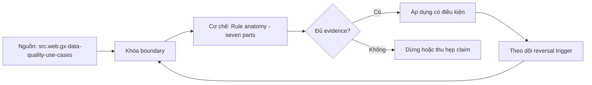

# Rule anatomy - seven parts

> [!abstract] Câu hỏi trung tâm
> Một data-quality rule cần đủ bảy phần nào để có thể chạy, giải thích, vận hành và thay đổi an toàn?

## 1. Asset and population

Rule phải chỉ đúng asset, partition, filter và exclusions; tên bảng đơn lẻ không định nghĩa population. Đừng bắt đầu bằng tên công cụ. Hãy bắt đầu bằng đối tượng được bảo vệ, boundary quan sát được và hậu quả nếu kết luận sai. Trong bài `Rule anatomy - seven parts`, câu hỏi thực dụng là: Một data-quality rule cần đủ bảy phần nào để có thể chạy, giải thích, vận hành và thay đổi an toàn? Ta ghi rõ grain, population, time window, owner và hành động sau failure; nếu một trường chưa biết thì đánh dấu unknown thay vì lấp bằng mặc định. Bằng chứng tối thiểu gồm fixture có version, cấu hình hoặc rule đã resolve, raw observation, expected result và limitation. Phần này là curriculum synthesis dựa trên các nguồn đã định danh, không phải lời hứa rằng mọi adapter hay deployment đều có cùng hành vi.

## 2. Grain and subject

Đơn vị đánh giá có thể là row, key, group, interval hoặc whole asset; trộn grain làm denominator vô nghĩa. Điểm khó không nằm ở cú pháp mà ở identity và scope. Hai phép đo cùng tên vẫn có thể nói về hai population hoặc hai thời điểm khác nhau. Trong bài `Rule anatomy - seven parts`, câu hỏi thực dụng là: Một data-quality rule cần đủ bảy phần nào để có thể chạy, giải thích, vận hành và thay đổi an toàn? Ta ghi rõ grain, population, time window, owner và hành động sau failure; nếu một trường chưa biết thì đánh dấu unknown thay vì lấp bằng mặc định. Bằng chứng tối thiểu gồm fixture có version, cấu hình hoặc rule đã resolve, raw observation, expected result và limitation. Phần này là curriculum synthesis dựa trên các nguồn đã định danh, không phải lời hứa rằng mọi adapter hay deployment đều có cùng hành vi.

## 3. Predicate and metric

Logic phải nêu phép đo, typed comparison, null semantics và cách xử lý lỗi thực thi. Một dashboard xanh chỉ là tín hiệu. Muốn biến nó thành bằng chứng phải giữ input, phiên bản, rule, trạng thái trước-sau và cách tính độc lập. Trong bài `Rule anatomy - seven parts`, câu hỏi thực dụng là: Một data-quality rule cần đủ bảy phần nào để có thể chạy, giải thích, vận hành và thay đổi an toàn? Ta ghi rõ grain, population, time window, owner và hành động sau failure; nếu một trường chưa biết thì đánh dấu unknown thay vì lấp bằng mặc định. Bằng chứng tối thiểu gồm fixture có version, cấu hình hoặc rule đã resolve, raw observation, expected result và limitation. Phần này là curriculum synthesis dựa trên các nguồn đã định danh, không phải lời hứa rằng mọi adapter hay deployment đều có cùng hành vi.

## 4. Threshold and severity

Threshold có unit, inclusive boundary, warning/fail class và lý do kinh doanh; số đẹp không phải policy. Thiết kế tốt phải chịu được counterexample. Hãy chủ động tạo case sát boundary, case thiếu dữ liệu và case replay thay vì chỉ chạy happy path. Trong bài `Rule anatomy - seven parts`, câu hỏi thực dụng là: Một data-quality rule cần đủ bảy phần nào để có thể chạy, giải thích, vận hành và thay đổi an toàn? Ta ghi rõ grain, population, time window, owner và hành động sau failure; nếu một trường chưa biết thì đánh dấu unknown thay vì lấp bằng mặc định. Bằng chứng tối thiểu gồm fixture có version, cấu hình hoặc rule đã resolve, raw observation, expected result và limitation. Phần này là curriculum synthesis dựa trên các nguồn đã định danh, không phải lời hứa rằng mọi adapter hay deployment đều có cùng hành vi.

## 5. Owner and action

Failure cần owner, routing, containment, remediation và deadline; rule không có hành động chỉ tạo noise. Chi phí vận hành thuộc contract. Một rule đúng nhưng quá đắt, quá ồn hoặc không có owner sẽ nhanh chóng bị tắt và mất tác dụng. Trong bài `Rule anatomy - seven parts`, câu hỏi thực dụng là: Một data-quality rule cần đủ bảy phần nào để có thể chạy, giải thích, vận hành và thay đổi an toàn? Ta ghi rõ grain, population, time window, owner và hành động sau failure; nếu một trường chưa biết thì đánh dấu unknown thay vì lấp bằng mặc định. Bằng chứng tối thiểu gồm fixture có version, cấu hình hoặc rule đã resolve, raw observation, expected result và limitation. Phần này là curriculum synthesis dựa trên các nguồn đã định danh, không phải lời hứa rằng mọi adapter hay deployment đều có cùng hành vi.

## 6. Version and evidence

Lưu rule version, parameters, input snapshot, observed value, failing samples và exception state. Kết luận cần có điều kiện đảo chiều. Khi volume, latency, nguồn thẩm quyền hoặc topology đổi, quyết định cũ phải được xem xét lại bằng cùng một oracle. Trong bài `Rule anatomy - seven parts`, câu hỏi thực dụng là: Một data-quality rule cần đủ bảy phần nào để có thể chạy, giải thích, vận hành và thay đổi an toàn? Ta ghi rõ grain, population, time window, owner và hành động sau failure; nếu một trường chưa biết thì đánh dấu unknown thay vì lấp bằng mặc định. Bằng chứng tối thiểu gồm fixture có version, cấu hình hoặc rule đã resolve, raw observation, expected result và limitation. Phần này là curriculum synthesis dựa trên các nguồn đã định danh, không phải lời hứa rằng mọi adapter hay deployment đều có cùng hành vi.

## 7. Ma trận kiểm chứng từng mệnh đề

Với `wiki.data-quality.rule-anatomy`, command thành công không tự chứng minh dữ liệu đúng. Protocol riêng của bài là: Tạo positive/negative fixture ở đúng grain, chạy rule đã version hóa và so failing keys/metrics với một oracle độc lập. Mỗi probe dưới đây phải nối input boundary với failure signal và oracle có thể phản bác kết luận.

### 7.1. Rule anatomy - seven parts: kiểm `Asset and population` bằng case 1, cụ thể rule phải chỉ đúng asset, partition, filter và exclusions; tên bảng đơn lẻ không định nghĩa population

**Mệnh đề cần kiểm.** Rule anatomy - seven parts: kiểm `Asset and population` bằng case 1, cụ thể rule phải chỉ đúng asset, partition, filter và exclusions; tên bảng đơn lẻ không định nghĩa population.

**Thiết kế phép thử cho `wiki.data-quality.rule-anatomy`.** Trong ngữ cảnh `wiki.data-quality.rule-anatomy`, tạo positive control và negative control chỉ khác đúng một điều kiện. Khóa input snapshot, phiên bản và owner của rule; chạy đúng population được bài `Rule anatomy - seven parts` công bố.

**Bằng chứng cần giữ.** Đối với probe 1 của `Rule anatomy - seven parts`, giữ fixture, raw failing rows và lệnh tái hiện. Nếu chưa chạy lab, ghi expected evidence và giữ trạng thái review; không biến protocol thành observation.

### 7.2. Rule anatomy - seven parts: kiểm `Grain and subject` bằng case 2, cụ thể đơn vị đánh giá có thể là row, key, group, interval hoặc whole asset; trộn grain làm denominator vô nghĩa

**Mệnh đề cần kiểm.** Rule anatomy - seven parts: kiểm `Grain and subject` bằng case 2, cụ thể đơn vị đánh giá có thể là row, key, group, interval hoặc whole asset; trộn grain làm denominator vô nghĩa.

**Thiết kế phép thử cho `wiki.data-quality.rule-anatomy`.** Trong ngữ cảnh `wiki.data-quality.rule-anatomy`, đổi grain nhưng giữ tổng số dòng để lộ phép đo sai cấp. Khóa input snapshot, phiên bản và owner của rule; chạy đúng population được bài `Rule anatomy - seven parts` công bố.

**Bằng chứng cần giữ.** Đối với probe 2 của `Rule anatomy - seven parts`, báo numerator, denominator và key set ở cả hai grain. Nếu chưa chạy lab, ghi expected evidence và giữ trạng thái review; không biến protocol thành observation.

### 7.3. Rule anatomy - seven parts: kiểm `Predicate and metric` bằng case 3, cụ thể logic phải nêu phép đo, typed comparison, null semantics và cách xử lý lỗi thực thi

**Mệnh đề cần kiểm.** Rule anatomy - seven parts: kiểm `Predicate and metric` bằng case 3, cụ thể logic phải nêu phép đo, typed comparison, null semantics và cách xử lý lỗi thực thi.

**Thiết kế phép thử cho `wiki.data-quality.rule-anatomy`.** Trong ngữ cảnh `wiki.data-quality.rule-anatomy`, đưa một giá trị tới đúng boundary và một giá trị vượt boundary. Khóa input snapshot, phiên bản và owner của rule; chạy đúng population được bài `Rule anatomy - seven parts` công bố.

**Bằng chứng cần giữ.** Đối với probe 3 của `Rule anatomy - seven parts`, lưu hai observed values cùng rule đã resolve. Nếu chưa chạy lab, ghi expected evidence và giữ trạng thái review; không biến protocol thành observation.

### 7.4. Rule anatomy - seven parts: kiểm `Threshold and severity` bằng case 4, cụ thể threshold có unit, inclusive boundary, warning/fail class và lý do kinh doanh; số đẹp không phải policy

**Mệnh đề cần kiểm.** Rule anatomy - seven parts: kiểm `Threshold and severity` bằng case 4, cụ thể threshold có unit, inclusive boundary, warning/fail class và lý do kinh doanh; số đẹp không phải policy.

**Thiết kế phép thử cho `wiki.data-quality.rule-anatomy`.** Trong ngữ cảnh `wiki.data-quality.rule-anatomy`, kill tiến trình ngay trước rồi ngay sau durable side effect. Khóa input snapshot, phiên bản và owner của rule; chạy đúng population được bài `Rule anatomy - seven parts` công bố.

**Bằng chứng cần giữ.** Đối với probe 4 của `Rule anatomy - seven parts`, lưu checkpoint, external ledger và trạng thái sau restart. Nếu chưa chạy lab, ghi expected evidence và giữ trạng thái review; không biến protocol thành observation.

### 7.5. Rule anatomy - seven parts: kiểm `Owner and action` bằng case 5, cụ thể failure cần owner, routing, containment, remediation và deadline; rule không có hành động chỉ tạo noise

**Mệnh đề cần kiểm.** Rule anatomy - seven parts: kiểm `Owner and action` bằng case 5, cụ thể failure cần owner, routing, containment, remediation và deadline; rule không có hành động chỉ tạo noise.

**Thiết kế phép thử cho `wiki.data-quality.rule-anatomy`.** Trong ngữ cảnh `wiki.data-quality.rule-anatomy`, đảo thứ tự input và concurrency nhưng giữ logical population. Khóa input snapshot, phiên bản và owner của rule; chạy đúng population được bài `Rule anatomy - seven parts` công bố.

**Bằng chứng cần giữ.** Đối với probe 5 của `Rule anatomy - seven parts`, so canonical hash và business totals giữa các thứ tự. Nếu chưa chạy lab, ghi expected evidence và giữ trạng thái review; không biến protocol thành observation.

### 7.6. Rule anatomy - seven parts: kiểm `Version and evidence` bằng case 6, cụ thể lưu rule version, parameters, input snapshot, observed value, failing samples và exception state

**Mệnh đề cần kiểm.** Rule anatomy - seven parts: kiểm `Version and evidence` bằng case 6, cụ thể lưu rule version, parameters, input snapshot, observed value, failing samples và exception state.

**Thiết kế phép thử cho `wiki.data-quality.rule-anatomy`.** Trong ngữ cảnh `wiki.data-quality.rule-anatomy`, replay cùng identity với payload giống rồi payload xung đột. Khóa input snapshot, phiên bản và owner của rule; chạy đúng population được bài `Rule anatomy - seven parts` công bố.

**Bằng chứng cần giữ.** Đối với probe 6 của `Rule anatomy - seven parts`, tách duplicate replay khỏi identity collision bằng reason code. Nếu chưa chạy lab, ghi expected evidence và giữ trạng thái review; không biến protocol thành observation.

### 7.7. Rule anatomy - seven parts: kiểm `Asset and population` bằng case 7, cụ thể rule phải chỉ đúng asset, partition, filter và exclusions; tên bảng đơn lẻ không định nghĩa population

**Mệnh đề cần kiểm.** Rule anatomy - seven parts: kiểm `Asset and population` bằng case 7, cụ thể rule phải chỉ đúng asset, partition, filter và exclusions; tên bảng đơn lẻ không định nghĩa population.

**Thiết kế phép thử cho `wiki.data-quality.rule-anatomy`.** Trong ngữ cảnh `wiki.data-quality.rule-anatomy`, thêm record tới trễ trong horizon và ngoài horizon. Khóa input snapshot, phiên bản và owner của rule; chạy đúng population được bài `Rule anatomy - seven parts` công bố.

**Bằng chứng cần giữ.** Đối với probe 7 của `Rule anatomy - seven parts`, báo accepted-late, rejected-late và oldest outstanding timestamp. Nếu chưa chạy lab, ghi expected evidence và giữ trạng thái review; không biến protocol thành observation.

### 7.8. Rule anatomy - seven parts: kiểm `Grain and subject` bằng case 8, cụ thể đơn vị đánh giá có thể là row, key, group, interval hoặc whole asset; trộn grain làm denominator vô nghĩa

**Mệnh đề cần kiểm.** Rule anatomy - seven parts: kiểm `Grain and subject` bằng case 8, cụ thể đơn vị đánh giá có thể là row, key, group, interval hoặc whole asset; trộn grain làm denominator vô nghĩa.

**Thiết kế phép thử cho `wiki.data-quality.rule-anatomy`.** Trong ngữ cảnh `wiki.data-quality.rule-anatomy`, đổi schema theo một cách tương thích rồi một cách phá vỡ semantics. Khóa input snapshot, phiên bản và owner của rule; chạy đúng population được bài `Rule anatomy - seven parts` công bố.

**Bằng chứng cần giữ.** Đối với probe 8 của `Rule anatomy - seven parts`, giữ schema diff, classification và consumer-visible result. Nếu chưa chạy lab, ghi expected evidence và giữ trạng thái review; không biến protocol thành observation.

### 7.9. Rule anatomy - seven parts: kiểm `Predicate and metric` bằng case 9, cụ thể logic phải nêu phép đo, typed comparison, null semantics và cách xử lý lỗi thực thi

**Mệnh đề cần kiểm.** Rule anatomy - seven parts: kiểm `Predicate and metric` bằng case 9, cụ thể logic phải nêu phép đo, typed comparison, null semantics và cách xử lý lỗi thực thi.

**Thiết kế phép thử cho `wiki.data-quality.rule-anatomy`.** Trong ngữ cảnh `wiki.data-quality.rule-anatomy`, tạo missing và duplicate bù nhau để count tổng không đổi. Khóa input snapshot, phiên bản và owner của rule; chạy đúng population được bài `Rule anatomy - seven parts` công bố.

**Bằng chứng cần giữ.** Đối với probe 9 của `Rule anatomy - seven parts`, so key multiset và typed hashes thay vì chỉ row count. Nếu chưa chạy lab, ghi expected evidence và giữ trạng thái review; không biến protocol thành observation.

### 7.10. Rule anatomy - seven parts: kiểm `Threshold and severity` bằng case 10, cụ thể threshold có unit, inclusive boundary, warning/fail class và lý do kinh doanh; số đẹp không phải policy

**Mệnh đề cần kiểm.** Rule anatomy - seven parts: kiểm `Threshold and severity` bằng case 10, cụ thể threshold có unit, inclusive boundary, warning/fail class và lý do kinh doanh; số đẹp không phải policy.

**Thiết kế phép thử cho `wiki.data-quality.rule-anatomy`.** Trong ngữ cảnh `wiki.data-quality.rule-anatomy`, cho reviewer tái hiện chỉ từ evidence package. Khóa input snapshot, phiên bản và owner của rule; chạy đúng population được bài `Rule anatomy - seven parts` công bố.

**Bằng chứng cần giữ.** Đối với probe 10 của `Rule anatomy - seven parts`, package phải đủ để người khác dựng lại decision và limitation. Nếu chưa chạy lab, ghi expected evidence và giữ trạng thái review; không biến protocol thành observation.

### 7.11. Rule anatomy - seven parts: kiểm `Owner and action` bằng case 11, cụ thể failure cần owner, routing, containment, remediation và deadline; rule không có hành động chỉ tạo noise

**Mệnh đề cần kiểm.** Rule anatomy - seven parts: kiểm `Owner and action` bằng case 11, cụ thể failure cần owner, routing, containment, remediation và deadline; rule không có hành động chỉ tạo noise.

**Thiết kế phép thử cho `wiki.data-quality.rule-anatomy`.** Trong ngữ cảnh `wiki.data-quality.rule-anatomy`, so với oracle độc lập không dùng chung query hoặc parser. Khóa input snapshot, phiên bản và owner của rule; chạy đúng population được bài `Rule anatomy - seven parts` công bố.

**Bằng chứng cần giữ.** Đối với probe 11 của `Rule anatomy - seven parts`, independent result phải khớp ở grain đã công bố. Nếu chưa chạy lab, ghi expected evidence và giữ trạng thái review; không biến protocol thành observation.

### 7.12. Rule anatomy - seven parts: kiểm `Version and evidence` bằng case 12, cụ thể lưu rule version, parameters, input snapshot, observed value, failing samples và exception state

**Mệnh đề cần kiểm.** Rule anatomy - seven parts: kiểm `Version and evidence` bằng case 12, cụ thể lưu rule version, parameters, input snapshot, observed value, failing samples và exception state.

**Thiết kế phép thử cho `wiki.data-quality.rule-anatomy`.** Trong ngữ cảnh `wiki.data-quality.rule-anatomy`, chạy scope hẹp và population đầy đủ rồi công bố phần bị loại. Khóa input snapshot, phiên bản và owner của rule; chạy đúng population được bài `Rule anatomy - seven parts` công bố.

**Bằng chứng cần giữ.** Đối với probe 12 của `Rule anatomy - seven parts`, coverage phải nêu rõ excluded nodes, partitions hoặc incidents. Nếu chưa chạy lab, ghi expected evidence và giữ trạng thái review; không biến protocol thành observation.

### 7.13. Rule anatomy - seven parts: kiểm `Asset and population` bằng case 13, cụ thể rule phải chỉ đúng asset, partition, filter và exclusions; tên bảng đơn lẻ không định nghĩa population

**Mệnh đề cần kiểm.** Rule anatomy - seven parts: kiểm `Asset and population` bằng case 13, cụ thể rule phải chỉ đúng asset, partition, filter và exclusions; tên bảng đơn lẻ không định nghĩa population.

**Thiết kế phép thử cho `wiki.data-quality.rule-anatomy`.** Trong ngữ cảnh `wiki.data-quality.rule-anatomy`, thử timezone, precision hoặc partition ở hai phía của ranh giới. Khóa input snapshot, phiên bản và owner của rule; chạy đúng population được bài `Rule anatomy - seven parts` công bố.

**Bằng chứng cần giữ.** Đối với probe 13 của `Rule anatomy - seven parts`, UTC/local interval và rounding policy phải hiện trong output. Nếu chưa chạy lab, ghi expected evidence và giữ trạng thái review; không biến protocol thành observation.

### 7.14. Rule anatomy - seven parts: kiểm `Grain and subject` bằng case 14, cụ thể đơn vị đánh giá có thể là row, key, group, interval hoặc whole asset; trộn grain làm denominator vô nghĩa

**Mệnh đề cần kiểm.** Rule anatomy - seven parts: kiểm `Grain and subject` bằng case 14, cụ thể đơn vị đánh giá có thể là row, key, group, interval hoặc whole asset; trộn grain làm denominator vô nghĩa.

**Thiết kế phép thử cho `wiki.data-quality.rule-anatomy`.** Trong ngữ cảnh `wiki.data-quality.rule-anatomy`, đổi constraint đủ lớn để quyết định phải đảo. Khóa input snapshot, phiên bản và owner của rule; chạy đúng population được bài `Rule anatomy - seven parts` công bố.

**Bằng chứng cần giữ.** Đối với probe 14 của `Rule anatomy - seven parts`, ADR phải lưu changed constraint và reversal threshold. Nếu chưa chạy lab, ghi expected evidence và giữ trạng thái review; không biến protocol thành observation.

### 7.15. Rule anatomy - seven parts: kiểm `Predicate and metric` bằng case 15, cụ thể logic phải nêu phép đo, typed comparison, null semantics và cách xử lý lỗi thực thi

**Mệnh đề cần kiểm.** Rule anatomy - seven parts: kiểm `Predicate and metric` bằng case 15, cụ thể logic phải nêu phép đo, typed comparison, null semantics và cách xử lý lỗi thực thi.

**Thiết kế phép thử cho `wiki.data-quality.rule-anatomy`.** Trong ngữ cảnh `wiki.data-quality.rule-anatomy`, chạy lại từ môi trường sạch với versions và seed đã khóa. Khóa input snapshot, phiên bản và owner của rule; chạy đúng population được bài `Rule anatomy - seven parts` công bố.

**Bằng chứng cần giữ.** Đối với probe 15 của `Rule anatomy - seven parts`, canonical result phải ổn định hoặc mọi nondeterminism phải được giải thích. Nếu chưa chạy lab, ghi expected evidence và giữ trạng thái review; không biến protocol thành observation.

## 8. Quy trình phản biện

1. Viết consumer-visible invariant cho `Rule anatomy - seven parts` trước khi chọn query hoặc tool.
2. Khóa grain, identity, population, time window và authoritative source.
3. Phân biệt declared configuration, executed state và published state.
4. Chạy negative control, replay hoặc changed-assumption case phù hợp.
5. Đối soát bằng oracle độc lập; công bố coverage và phần không quan sát được.
6. Gắn owner, hành động, reversal trigger và hạn review cho kết luận.

## 9. Câu hỏi tự kiểm tra

1. `Rule anatomy - seven parts: kiểm `Asset and population` bằng case 1, cụ thể rule phải chỉ đúng asset, partition, filter và exclusions; tên bảng đơn lẻ không định nghĩa population` thất bại đầu tiên ở boundary nào?
2. Artifact nào mạnh nhất để trả lời `Rule anatomy - seven parts: kiểm `Predicate and metric` bằng case 3, cụ thể logic phải nêu phép đo, typed comparison, null semantics và cách xử lý lỗi thực thi`?
3. Counterexample nhỏ nhất cho `Rule anatomy - seven parts: kiểm `Version and evidence` bằng case 6, cụ thể lưu rule version, parameters, input snapshot, observed value, failing samples và exception state` gồm những state nào?
4. `Rule anatomy - seven parts: kiểm `Predicate and metric` bằng case 9, cụ thể logic phải nêu phép đo, typed comparison, null semantics và cách xử lý lỗi thực thi` có thể xanh giả ra sao?
5. Constraint nào khiến quyết định ở `Rule anatomy - seven parts: kiểm `Grain and subject` bằng case 14, cụ thể đơn vị đánh giá có thể là row, key, group, interval hoặc whole asset; trộn grain làm denominator vô nghĩa` phải đảo?
6. Phần nào của `Rule anatomy - seven parts: kiểm `Predicate and metric` bằng case 15, cụ thể logic phải nêu phép đo, typed comparison, null semantics và cách xử lý lỗi thực thi` mới là protocol, chưa phải observation?

## 10. Giới hạn và điều chưa cho phép kết luận

- Lab của `Rule anatomy - seven parts` chưa chạy trên hệ thống production; nội dung là giáo trình và expected evidence.
- Hành vi phụ thuộc phiên bản, connector, scheduler, warehouse và catalog configuration phải được kiểm lại.
- Các ma trận, ladder và threshold do giáo trình tổng hợp không được gán nguyên văn cho vendor.
- Note giữ trạng thái `review` cho tới khi owner duyệt semantics và learner artifact.

## Reference
1. [[SRC-GX-DATA-QUALITY-USE-CASES]]
2. [[SRC-GX-EXPECTATIONS]]

## Source coverage

| Source slice | Nội dung sử dụng | Trạng thái |
|---|---|---|
| [[SRC-GX-DATA-QUALITY-USE-CASES]] | Contract hoặc cơ chế liên quan trực tiếp tới `Rule anatomy - seven parts` | Đã đọc locator; cần pin version khi chạy lab |
| [[SRC-GX-EXPECTATIONS]] | Contract hoặc cơ chế liên quan trực tiếp tới `Rule anatomy - seven parts` | Đã đọc locator; cần pin version khi chạy lab |

## Key takeaways
- Rule vận hành được cần population, grain, logic, threshold, severity, owner/action và versioned evidence.
- Với `wiki.data-quality.rule-anatomy`, quality của kết luận phụ thuộc identity, coverage và oracle chứ không phụ thuộc màu dashboard.
- Câu hỏi `Một data-quality rule cần đủ bảy phần nào để có thể chạy, giải thích, vận hành và thay đổi an toàn?` chỉ được trả lời trong scope và version đã ghi.
- Các source IDs `src.web.gx-data-quality-use-cases, src.web.gx-expectations` đặt ranh giới cho source fact; phần còn lại là synthesis có nhãn.
- Trước khi lab chạy, đây là note đã kiểm cấu trúc và provenance, chưa phải chứng nhận production.

<!-- ATOMIC-EXECUTION-CAPSULE:START -->

## Execution capsule: kiểm chứng `wiki.data-quality.rule-anatomy`

> [!important] Phân loại mệnh đề
> Với `wiki.data-quality.rule-anatomy`, sơ đồ, ví dụ và artifact về **Rule anatomy - seven parts** là **synthesis để kiểm chứng**; chúng không phải trích dẫn hay case nguyên văn của nguồn.

### Sơ đồ cơ chế và điểm kiểm soát



Đọc sơ đồ `wiki.data-quality.rule-anatomy` từ trái sang phải: source chỉ cung cấp claim ban đầu cho **Rule anatomy - seven parts**; quyết định chỉ được đi tiếp sau khi boundary, evidence và điều kiện đảo quyết định đã hiện hữu.

### Artifact thực thi tối thiểu

```sql
-- Verification harness for: Rule anatomy - seven parts
WITH evidence AS (
    SELECT 'wiki.data-quality.rule-anatomy' AS concept_id,
           'boundary_declared' AS check_name, 1 AS passed
    UNION ALL
    SELECT 'wiki.data-quality.rule-anatomy', 'independent_oracle', 1
    UNION ALL
    SELECT 'wiki.data-quality.rule-anatomy', 'reversal_trigger_recorded', 1
)
SELECT concept_id,
       MIN(passed) AS all_hard_checks_pass,
       COUNT(*) AS evidence_items
FROM evidence
GROUP BY concept_id
HAVING MIN(passed) = 1;
```

Artifact của `wiki.data-quality.rule-anatomy` buộc người dùng ghi boundary, oracle và reversal trigger cho **Rule anatomy - seven parts**. Các giá trị minh họa phải được thay bằng evidence thật trước khi dùng cho quyết định.

### Tự kiểm tra trước khi tái sử dụng

1. Bạn có thể trả lời `Một data-quality rule cần đủ bảy phần nào để có thể chạy, giải thích, vận hành và thay đổi an toàn?` bằng một câu mà không kéo thêm concept thứ hai không?
2. Source locator nào đỡ cho claim, và phần nào chỉ là synthesis trong note?
3. Observation nào khiến bạn dừng, thu hẹp hoặc đảo quyết định?
4. Artifact nào cho phép một reviewer độc lập tái hiện kết quả?

<!-- ATOMIC-EXECUTION-CAPSULE:END -->
