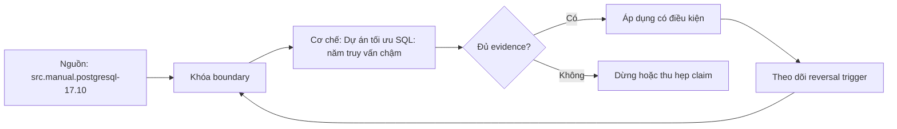

# Dự án tối ưu SQL: năm truy vấn chậm

> [!abstract] Câu hỏi trung tâm
> Làm sao biến tuning từ thử mẹo thành thí nghiệm có baseline, giả thuyết, parity, performance distribution, review và rollback?

## 1. Tuning là công việc thực nghiệm

Một tối ưu hợp lệ phải chứng minh ba điều: kết quả/contract không đổi, resource/latency mục tiêu cải thiện, và cải thiện nối được với observation trong plan/runtime. Chạy nhanh hơn máy tôi thiếu cả ba nếu môi trường và variance không ghi.

Quy trình chuẩn: capture → reproduce → inspect → hypothesize → change one variable → verify parity → measure → decide. Nếu hypothesis sai, giữ evidence và quay lại, không stack fixes.

Năm truy vấn trong dự án đại diện năm failure classes, nhưng workflow phải dùng được cho query thứ sáu chưa thấy.

## 2. Success contract trước khi sửa

Mỗi query cần owner/consumer, SQL/result schema, parameters classes, freshness/isolation, ordering guarantee, expected grain, latency SLO, throughput/concurrency và resource budget. Nhanh hơn không có pass/fail.

Ngưỡng dự án có thể là p95 giảm X%, buffers/temp giảm, hoặc hết timeout dưới representative load. Giá trị X do bài giao, không lấy từ sách. Ít nhất 4/5 đạt nhưng cả 5 phải giữ correctness.

Non-goals: đổi business meaning, approximate result, cache stale hoặc tăng global memory không kiểm soát.

## 3. Reproducible environment

Lưu PostgreSQL version, extensions, hardware/container limits, config, schema/index DDL, statistics targets/last analyze, data generator/snapshot checksum, query text và parameters. Seed phải deterministic, đủ skew/correlation/size.

Tách warm/cold regime; chạy nhiều lần, report median/p95/min/max, không một elapsed. Kiểm background load. Production-like không có nghĩa copy dữ liệu nhạy; dùng synthetic/anonymized snapshot.

Artifacts phải chạy lại bằng script hoặc documented commands. Screenshot chỉ phụ trợ.

## 4. Baseline

Trước sửa, chạy result capture/checksum và `EXPLAIN (ANALYZE, BUFFERS, WAL, SETTINGS, FORMAT JSON)` trong môi trường an toàn. Với read query, lưu rows/schema/order contract; với DML cần rollback/test clone và side-effect audit.

Ghi planning/execution/app elapsed, estimated/actual rows, loops, shared hit/read, temp, heap fetches, sort/hash details và query frequency. Baseline nhiều runs.

Không ANALYZE production query đắt nếu risk chưa duyệt; có thể bắt đầu EXPLAIN estimates/pg_stat_statements.

## 5. Parity mạnh hơn row count

Equal row count không chứng minh equal rows. Dùng multiset equality hai chiều (`EXCEPT ALL`) khi types cho phép, deterministic canonical serialization + strong hash, hoặc per-key/full column comparison. Preserve NULL, duplicates, types, scale/timezone và ordering nếu contract.

`EXCEPT` không ALL che duplicate differences. Hash collision risk cần row count/schema và sampling/full diff. Floating-point cần explicit tolerance nếu domain cho phép; khớp tuyệt đối thì không tolerance.

Với non-deterministic columns như now/random, freeze/remove theo contract; không bỏ qua âm thầm.

## 6. Query A: estimation error

Observation: earliest node estimate/actual lệch nhiều bậc, downstream join/order sai. Hypotheses: stale stats, skew, column dependency, expression, parameter plan. Chọn đúng remediation: ANALYZE/target/extended stats/query shape.

Evidence after: error factor giảm, plan/work/latency cải thiện, result identical. Nếu plan không đổi nhưng runtime cải thiện do cache, hypothesis chưa được chứng minh.

Không thêm index đầu tiên nếu root là stats; index có thể che symptom và thêm write cost.

## 7. Query B: missing access path

Observation: selective predicate trên bảng lớn, seq scan đọc nhiều blocks/filters nhiều rows; workload frequency/SLO biện minh index. Thiết kế key/order/include/predicate theo query family.

After: Index Cond phù hợp, buffers/work giảm, latency distribution cải thiện. Đo index size/build risk và write throughput. Một read gain không đủ nếu write budget vỡ.

Không kết luận missing index chỉ từ seq scan; compare alternative path/cost.

## 8. Query C: composite order sai

Observation: index tồn tại nhưng predicate/order không khớp leading keys; plan scan rộng, filter/sort. Candidate reorder theo equality/range/order. Giữ nuance skip scan PostgreSQL 17.

After: access bounds tốt hơn hoặc sort biến mất, nhưng kiểm các queries khác bị ảnh hưởng. Không thay một index dùng chung mà không portfolio analysis.

Lab cố ý sai order phải được chứng minh trên fixture, không thành luật universal.

## 9. Query D: non-sargable predicate

Observation: transform/cast/pattern ở Filter, nhiều rows fetched. Rewrite half-open range/cast parameter hoặc expression/trigram index theo semantics.

Parity tests đặc biệt cho NULL, timezone, boundary, collation và invalid inputs. Query nhanh nhưng sai ngày cuối không đạt.

After evidence: condition/access work đổi đúng dự đoán, buffers và latency giảm.

## 10. Query E: spill

Observation: Sort Method disk, Hash Batches >1, temp read/write. Root có thể là estimate sai, row width/input quá lớn hoặc work_mem scoped thấp.

Fix ưu tiên giảm rows/width sớm nếu semantics; session-local work_mem nếu budget. Không tăng global. Đo concurrency worst-case.

After: temp giảm/hết, memory within budget, latency improves. No-spill không bắt buộc nếu spill nhỏ và system objective tốt hơn.

## 11. One-variable discipline

Mỗi iteration ghi hypothesis, predicted plan change, exact diff, result parity và measurements. Nếu đồng thời tạo index, ANALYZE và rewrite, causal attribution mất.

Sau một thay đổi thành công có thể làm iteration tiếp, nhưng baseline mới được version hóa. Cuối cùng chạy ablation hoặc explain causal chain.

Ba attempts không hỗ trợ hypothesis là tín hiệu xem lại model/problem framing, không tiếp tục random tuning.

## 12. Plan observation → action map

Estimate error → inspect stats/parameters. High filtered blocks → predicate/access. High loops → outer cardinality/inner lookup. Spill → input estimate/width/memory. Heap Fetches → visibility/update regime. Lock wait → concurrency, không chỉ plan. Client gap → fetch/network.

Map là routing, không prescription. Mỗi action cần predicted observation. Hash join chậm → tắt hash join không đạt.

Root cause có thể nằm upstream: join fanout tạo rows làm sort spill; tăng memory chỉ che.

## 13. Performance measurement

Report p50/p95/p99 hoặc distribution phù hợp, runs/warm-up/cache, rows returned và system load. Throughput và latency dưới concurrency có thể khác single query. Planning overhead quan trọng query ngắn/prepared.

Use server execution, application end-to-end, buffers/I/O/temp/CPU. Không so cost với ms. Track regression ở other workload if adding index/config.

Định nghĩa practical significance, không chỉ % lớn trên microsecond query.

## 14. Review dossier mỗi query

Gồm requirement; baseline SQL/plan/result fingerprint; four-number summary; hypothesis; change diff; post plan/result; measurement table; trade-offs; rollback; conclusion/limitations. Machine-readable plans và scripts được link.

Một câu dẫn chứng có cấu trúc: Vì node X underestimates Y× dẫn planner chọn Z và inner loops N; sau extended stats error còn A×, plan đổi B, buffers giảm C.

Không viết thêm index nên nhanh.

## 15. Peer review

Reviewer chọn ngẫu nhiên một optimization, chạy từ clean setup, kiểm parity và hỏi observation nào dẫn action. Reviewer thử parameter khác/boundary và tìm regression. Author không được giải thích bằng thông tin ngoài dossier.

Findings phân loại correctness, reproducibility, attribution, measurement và operability. Correctness failure là hard fail dù performance tốt.

Review không thay owner approval cho production.

## 16. Rollback và rollout

Index build có disk/lock/replica risk; stats/config change có plan blast radius; query deployment cần feature flag/canary. Ghi reverse action và trigger rollback theo SLO/error.

Staging win không authorize production. Production rollout là task R3 riêng với approval, smoke/reconciliation/monitoring.

Không giữ unused experiment indexes/settings sau project.

## 17. Scoring rubric

Correctness parity là gate. Sau đó chấm reproducibility, root-cause evidence, one-variable discipline, improvement threshold, trade-off/rollback và communication. ≥4/5 query đạt performance; 5/5 parity.

Một query không đạt nhưng investigation đúng vẫn được ghi failed, không pass vì học được. Dự án hoàn tất học thuật có thể có bounded failure nhưng Done when cụ thể quyết định.

Không dùng LOC hoặc số index làm điểm.

## 17.1. Bảng evidence tối thiểu

Mỗi hàng query cần: query ID/fingerprint; parameter class; baseline p50/p95 và run count; estimated/actual factor tại node đầu tiên sai; total rows×loops ở critical node; shared hit/read; temp read/write; result row count và strong checksum; thay đổi duy nhất; post metrics; write/storage side effect; quyết định và rollback. Units và cache regime phải nằm trong header.

Bảng không thay plans/scripts nhưng cho reviewer đối chiếu nhanh. Nếu latency cải thiện mà buffers/work tăng, cần giải thích cache/concurrency; nếu cost giảm mà elapsed không đổi, cost không phải outcome. Nếu checksum giống nhưng schema/type/order contract đổi, parity vẫn fail. Tất cả năm queries phải có row even khi performance target không đạt; không xóa failed case khỏi summary. Peer reviewer ký exact artifact/version đã chạy và ghi deviation của môi trường. Nhờ vậy dự án đánh giá khả năng điều tra có kiểm soát, không chỉ may mắn tìm được một mẹo nhanh.

Artifacts nên được đóng gói theo query ID và iteration: SQL đầu vào, parameters đã ẩn dữ liệu nhạy cảm, plan JSON, output fingerprint, metrics CSV, schema/index snapshot và nhận xét. Tên tệp phải cho biết baseline hay candidate; checksum của artifact được ghi vào dossier để lần review sau không vô tình đọc kết quả khác. Khi dữ liệu production không thể sao chép, phải mô tả phương pháp tạo distribution đại diện và ghi rõ những đặc tính chưa tái tạo được, chẳng hạn correlation, skew, table churn hoặc concurrency. Thiếu những thông tin này thì benchmark chỉ chứng minh thay đổi tốt trên fixture, chưa chứng minh tốt cho workload mục tiêu.

## 18. Câu hỏi tự kiểm tra

1. Vì sao equal row count không chứng minh parity?
2. Một optimization dossier cần artifacts nào?
3. Làm sao chứng minh causal link khi có nhiều iterations?
4. Spill nên chữa input hay memory trước?
5. Tại sao staging benchmark không cho phép production rollout?
6. Peer reviewer phải retest parameter/boundary nào?

## 19. Giới hạn và điều chưa cho phép kết luận

- Năm failure classes không bao phủ locks, network, pool, bloat và storage throttling.
- Synthetic benchmark không tự đại diện production distribution/concurrency.
- Plan/timing PostgreSQL-specific và version-sensitive.
- Project note không thực thi năm query; số đo thuộc `after-note.md`.
- Owner approval production không nằm trong phạm vi bài học.

## Reference
1. [[SRC-POSTGRESQL-17-10-MANUAL]]: EXPLAIN, statistics, indexes và prepared plans.
2. [[SRC-MASTERING-POSTGRESQL-17-6E]]: cost model, plan reading, joins và indexes.
3. [[SRC-ROGOV-POSTGRESQL-14-INTERNALS]]: physical operators, stats và index mechanisms.

## Source coverage

| Source slice | Nội dung phải giữ | Vị trí trong note | Trạng thái |
|---|---|---|---|
| [[SRC-POSTGRESQL-17-10-MANUAL]], PDF 488-498, 559-580, 2018-2030, 2643-2650 | evidence fields và remediation mechanics | §§4-13 | Đã giữ measurement boundaries |
| [[SRC-MASTERING-POSTGRESQL-17-6E]], PDF 87-112, 223-270 | indexes/cost/plans | §§6-14 | Đã chuyển thành experiments |
| [[SRC-ROGOV-POSTGRESQL-14-INTERNALS]], PDF 271-407 | stats/scans/joins/spill mechanics | §§6-12 | Đã dùng cho causal model |
| Tổng hợp DE-L132 | parity, dossier, peer review, rollback | §§2-17 | Đã thành project protocol |

## Key takeaways
- Tuning chỉ đạt khi correctness, causal evidence và performance cùng đạt.
- Baseline và result parity phải được khóa trước thay đổi.
- Mỗi iteration thay một material variable và ghi predicted observation.
- Năm queries cần dossier tái hiện, không chỉ ảnh plans hoặc elapsed.
- Production rollout là công việc riêng có approval/monitoring/rollback.

<!-- ATOMIC-EXECUTION-CAPSULE:START -->

## Execution capsule: kiểm chứng `wiki.database.sql-tuning-project-five-queries`

> [!important] Phân loại mệnh đề
> Với `wiki.database.sql-tuning-project-five-queries`, sơ đồ, ví dụ và artifact về **Dự án tối ưu SQL: năm truy vấn chậm** là **synthesis để kiểm chứng**; chúng không phải trích dẫn hay case nguyên văn của nguồn.

### Sơ đồ cơ chế và điểm kiểm soát



Đọc sơ đồ `wiki.database.sql-tuning-project-five-queries` từ trái sang phải: source chỉ cung cấp claim ban đầu cho **Dự án tối ưu SQL: năm truy vấn chậm**; quyết định chỉ được đi tiếp sau khi boundary, evidence và điều kiện đảo quyết định đã hiện hữu.

### Ví dụ làm việc có thể bác bỏ

**Input.** Một đội cần trả lời: Làm sao tối ưu năm truy vấn bằng quy trình giả thuyết-một thay đổi-đo lại mà giữ kết quả và tạo evidence có thể review? cho một phạm vi nhỏ, có owner và deadline rõ.

**Decision.** Đội áp dụng **Dự án tối ưu SQL: năm truy vấn chậm** trên control và variant chỉ khác một assumption; expected result và hard constraints được khóa trước khi chạy.

**Outcome.** Với `wiki.database.sql-tuning-project-five-queries`, nếu observation vi phạm hard constraint hoặc oracle độc lập không xác nhận **Dự án tối ưu SQL: năm truy vấn chậm**, đội thu hẹp claim hay đảo quyết định. Nếu đạt, kết luận vẫn kèm scope, version và review date; một lần thành công không được nâng thành quy luật phổ quát.

### Artifact thực thi tối thiểu

```sql
-- Verification harness for: Dự án tối ưu SQL: năm truy vấn chậm
WITH evidence AS (
    SELECT 'wiki.database.sql-tuning-project-five-queries' AS concept_id,
           'boundary_declared' AS check_name, 1 AS passed
    UNION ALL
    SELECT 'wiki.database.sql-tuning-project-five-queries', 'independent_oracle', 1
    UNION ALL
    SELECT 'wiki.database.sql-tuning-project-five-queries', 'reversal_trigger_recorded', 1
)
SELECT concept_id,
       MIN(passed) AS all_hard_checks_pass,
       COUNT(*) AS evidence_items
FROM evidence
GROUP BY concept_id
HAVING MIN(passed) = 1;
```

Artifact của `wiki.database.sql-tuning-project-five-queries` buộc người dùng ghi boundary, oracle và reversal trigger cho **Dự án tối ưu SQL: năm truy vấn chậm**. Các giá trị minh họa phải được thay bằng evidence thật trước khi dùng cho quyết định.

### Tự kiểm tra trước khi tái sử dụng

1. Bạn có thể trả lời `Làm sao tối ưu năm truy vấn bằng quy trình giả thuyết-một thay đổi-đo lại mà giữ kết quả và tạo evidence có thể review?` bằng một câu mà không kéo thêm concept thứ hai không?
2. Source locator nào đỡ cho claim, và phần nào chỉ là synthesis trong note?
3. Observation nào khiến bạn dừng, thu hẹp hoặc đảo quyết định?
4. Artifact nào cho phép một reviewer độc lập tái hiện kết quả?

<!-- ATOMIC-EXECUTION-CAPSULE:END -->
