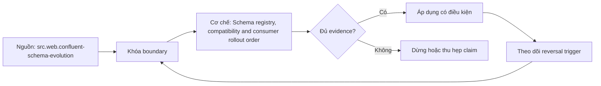

# Schema registry, compatibility and consumer rollout order

> [!abstract] Câu hỏi trung tâm
> Schema registry compatibility mode và thứ tự rollout producer/consumer phối hợp thế nào để tránh breaking change?

## 1. Schema identity

Subject/name strategy, schema ID, record name và topic binding quyết định compatibility scope; registry không hiểu business meaning. Đừng bắt đầu bằng tên công cụ. Hãy bắt đầu bằng đối tượng được bảo vệ, boundary quan sát được và hậu quả nếu kết luận sai. Trong bài `Schema registry, compatibility and consumer rollout order`, câu hỏi thực dụng là: Schema registry compatibility mode và thứ tự rollout producer/consumer phối hợp thế nào để tránh breaking change? Ta ghi rõ grain, population, time window, owner và hành động sau failure; nếu một trường chưa biết thì đánh dấu unknown thay vì lấp bằng mặc định. Bằng chứng tối thiểu gồm fixture có version, cấu hình hoặc rule đã resolve, raw observation, expected result và limitation. Phần này là curriculum synthesis dựa trên các nguồn đã định danh, không phải lời hứa rằng mọi adapter hay deployment đều có cùng hành vi.

## 2. Backward compatibility

New reader đọc old data cần defaults/optional handling phù hợp; field rename hoặc semantic reuse vẫn có thể phá dù schema pass. Điểm khó không nằm ở cú pháp mà ở identity và scope. Hai phép đo cùng tên vẫn có thể nói về hai population hoặc hai thời điểm khác nhau. Trong bài `Schema registry, compatibility and consumer rollout order`, câu hỏi thực dụng là: Schema registry compatibility mode và thứ tự rollout producer/consumer phối hợp thế nào để tránh breaking change? Ta ghi rõ grain, population, time window, owner và hành động sau failure; nếu một trường chưa biết thì đánh dấu unknown thay vì lấp bằng mặc định. Bằng chứng tối thiểu gồm fixture có version, cấu hình hoặc rule đã resolve, raw observation, expected result và limitation. Phần này là curriculum synthesis dựa trên các nguồn đã định danh, không phải lời hứa rằng mọi adapter hay deployment đều có cùng hành vi.

## 3. Forward compatibility

Old reader đọc new data phụ thuộc unknown-field handling và evolution rules; không phải format nào cũng giống nhau. Một dashboard xanh chỉ là tín hiệu. Muốn biến nó thành bằng chứng phải giữ input, phiên bản, rule, trạng thái trước-sau và cách tính độc lập. Trong bài `Schema registry, compatibility and consumer rollout order`, câu hỏi thực dụng là: Schema registry compatibility mode và thứ tự rollout producer/consumer phối hợp thế nào để tránh breaking change? Ta ghi rõ grain, population, time window, owner và hành động sau failure; nếu một trường chưa biết thì đánh dấu unknown thay vì lấp bằng mặc định. Bằng chứng tối thiểu gồm fixture có version, cấu hình hoặc rule đã resolve, raw observation, expected result và limitation. Phần này là curriculum synthesis dựa trên các nguồn đã định danh, không phải lời hứa rằng mọi adapter hay deployment đều có cùng hành vi.

## 4. Full and transitive

Full kiểm hai chiều; transitive so với toàn history thay vì latest, quan trọng khi consumers nâng cấp không đồng loạt. Thiết kế tốt phải chịu được counterexample. Hãy chủ động tạo case sát boundary, case thiếu dữ liệu và case replay thay vì chỉ chạy happy path. Trong bài `Schema registry, compatibility and consumer rollout order`, câu hỏi thực dụng là: Schema registry compatibility mode và thứ tự rollout producer/consumer phối hợp thế nào để tránh breaking change? Ta ghi rõ grain, population, time window, owner và hành động sau failure; nếu một trường chưa biết thì đánh dấu unknown thay vì lấp bằng mặc định. Bằng chứng tối thiểu gồm fixture có version, cấu hình hoặc rule đã resolve, raw observation, expected result và limitation. Phần này là curriculum synthesis dựa trên các nguồn đã định danh, không phải lời hứa rằng mọi adapter hay deployment đều có cùng hành vi.

## 5. Rollout order

Backward-compatible change thường deploy consumer trước producer; removal cần deprecation, telemetry và multi-version window. Chi phí vận hành thuộc contract. Một rule đúng nhưng quá đắt, quá ồn hoặc không có owner sẽ nhanh chóng bị tắt và mất tác dụng. Trong bài `Schema registry, compatibility and consumer rollout order`, câu hỏi thực dụng là: Schema registry compatibility mode và thứ tự rollout producer/consumer phối hợp thế nào để tránh breaking change? Ta ghi rõ grain, population, time window, owner và hành động sau failure; nếu một trường chưa biết thì đánh dấu unknown thay vì lấp bằng mặc định. Bằng chứng tối thiểu gồm fixture có version, cấu hình hoặc rule đã resolve, raw observation, expected result và limitation. Phần này là curriculum synthesis dựa trên các nguồn đã định danh, không phải lời hứa rằng mọi adapter hay deployment đều có cùng hành vi.

## 6. Proof

Replay old/new encoded fixtures qua consumer versions, registry rules và rollback; lưu schema IDs, verdicts và semantic assertions. Kết luận cần có điều kiện đảo chiều. Khi volume, latency, nguồn thẩm quyền hoặc topology đổi, quyết định cũ phải được xem xét lại bằng cùng một oracle. Trong bài `Schema registry, compatibility and consumer rollout order`, câu hỏi thực dụng là: Schema registry compatibility mode và thứ tự rollout producer/consumer phối hợp thế nào để tránh breaking change? Ta ghi rõ grain, population, time window, owner và hành động sau failure; nếu một trường chưa biết thì đánh dấu unknown thay vì lấp bằng mặc định. Bằng chứng tối thiểu gồm fixture có version, cấu hình hoặc rule đã resolve, raw observation, expected result và limitation. Phần này là curriculum synthesis dựa trên các nguồn đã định danh, không phải lời hứa rằng mọi adapter hay deployment đều có cùng hành vi.

## 7. Ma trận kiểm chứng từng mệnh đề

Với `wiki.streaming.schema-compatibility-rollout`, command thành công không tự chứng minh dữ liệu đúng. Protocol riêng của bài là: Dựng version-pinned fixture, inject compatibility/capacity/failure/change case và đối soát emitted/visible state bằng oracle độc lập. Mỗi probe dưới đây phải nối input boundary với failure signal và oracle có thể phản bác kết luận.

### 7.1. Schema registry, compatibility and consumer rollout order: kiểm `Schema identity` bằng case 1, cụ thể subject/name strategy, schema id, record name và topic binding quyết định compatibility scope; registry không hiểu business meaning

**Mệnh đề cần kiểm.** Schema registry, compatibility and consumer rollout order: kiểm `Schema identity` bằng case 1, cụ thể subject/name strategy, schema id, record name và topic binding quyết định compatibility scope; registry không hiểu business meaning.

**Thiết kế phép thử cho `wiki.streaming.schema-compatibility-rollout`.** Trong ngữ cảnh `wiki.streaming.schema-compatibility-rollout`, tạo positive control và negative control chỉ khác đúng một điều kiện. Khóa input snapshot, phiên bản và owner của rule; chạy đúng population được bài `Schema registry, compatibility and consumer rollout order` công bố.

**Bằng chứng cần giữ.** Đối với probe 1 của `Schema registry, compatibility and consumer rollout order`, giữ fixture, raw failing rows và lệnh tái hiện. Nếu chưa chạy lab, ghi expected evidence và giữ trạng thái review; không biến protocol thành observation.

### 7.2. Schema registry, compatibility and consumer rollout order: kiểm `Backward compatibility` bằng case 2, cụ thể new reader đọc old data cần defaults/optional handling phù hợp; field rename hoặc semantic reuse vẫn có thể phá dù schema pass

**Mệnh đề cần kiểm.** Schema registry, compatibility and consumer rollout order: kiểm `Backward compatibility` bằng case 2, cụ thể new reader đọc old data cần defaults/optional handling phù hợp; field rename hoặc semantic reuse vẫn có thể phá dù schema pass.

**Thiết kế phép thử cho `wiki.streaming.schema-compatibility-rollout`.** Trong ngữ cảnh `wiki.streaming.schema-compatibility-rollout`, đổi grain nhưng giữ tổng số dòng để lộ phép đo sai cấp. Khóa input snapshot, phiên bản và owner của rule; chạy đúng population được bài `Schema registry, compatibility and consumer rollout order` công bố.

**Bằng chứng cần giữ.** Đối với probe 2 của `Schema registry, compatibility and consumer rollout order`, báo numerator, denominator và key set ở cả hai grain. Nếu chưa chạy lab, ghi expected evidence và giữ trạng thái review; không biến protocol thành observation.

### 7.3. Schema registry, compatibility and consumer rollout order: kiểm `Forward compatibility` bằng case 3, cụ thể old reader đọc new data phụ thuộc unknown-field handling và evolution rules; không phải format nào cũng giống nhau

**Mệnh đề cần kiểm.** Schema registry, compatibility and consumer rollout order: kiểm `Forward compatibility` bằng case 3, cụ thể old reader đọc new data phụ thuộc unknown-field handling và evolution rules; không phải format nào cũng giống nhau.

**Thiết kế phép thử cho `wiki.streaming.schema-compatibility-rollout`.** Trong ngữ cảnh `wiki.streaming.schema-compatibility-rollout`, đưa một giá trị tới đúng boundary và một giá trị vượt boundary. Khóa input snapshot, phiên bản và owner của rule; chạy đúng population được bài `Schema registry, compatibility and consumer rollout order` công bố.

**Bằng chứng cần giữ.** Đối với probe 3 của `Schema registry, compatibility and consumer rollout order`, lưu hai observed values cùng rule đã resolve. Nếu chưa chạy lab, ghi expected evidence và giữ trạng thái review; không biến protocol thành observation.

### 7.4. Schema registry, compatibility and consumer rollout order: kiểm `Full and transitive` bằng case 4, cụ thể full kiểm hai chiều; transitive so với toàn history thay vì latest, quan trọng khi consumers nâng cấp không đồng loạt

**Mệnh đề cần kiểm.** Schema registry, compatibility and consumer rollout order: kiểm `Full and transitive` bằng case 4, cụ thể full kiểm hai chiều; transitive so với toàn history thay vì latest, quan trọng khi consumers nâng cấp không đồng loạt.

**Thiết kế phép thử cho `wiki.streaming.schema-compatibility-rollout`.** Trong ngữ cảnh `wiki.streaming.schema-compatibility-rollout`, kill tiến trình ngay trước rồi ngay sau durable side effect. Khóa input snapshot, phiên bản và owner của rule; chạy đúng population được bài `Schema registry, compatibility and consumer rollout order` công bố.

**Bằng chứng cần giữ.** Đối với probe 4 của `Schema registry, compatibility and consumer rollout order`, lưu checkpoint, external ledger và trạng thái sau restart. Nếu chưa chạy lab, ghi expected evidence và giữ trạng thái review; không biến protocol thành observation.

### 7.5. Schema registry, compatibility and consumer rollout order: kiểm `Rollout order` bằng case 5, cụ thể backward-compatible change thường deploy consumer trước producer; removal cần deprecation, telemetry và multi-version window

**Mệnh đề cần kiểm.** Schema registry, compatibility and consumer rollout order: kiểm `Rollout order` bằng case 5, cụ thể backward-compatible change thường deploy consumer trước producer; removal cần deprecation, telemetry và multi-version window.

**Thiết kế phép thử cho `wiki.streaming.schema-compatibility-rollout`.** Trong ngữ cảnh `wiki.streaming.schema-compatibility-rollout`, đảo thứ tự input và concurrency nhưng giữ logical population. Khóa input snapshot, phiên bản và owner của rule; chạy đúng population được bài `Schema registry, compatibility and consumer rollout order` công bố.

**Bằng chứng cần giữ.** Đối với probe 5 của `Schema registry, compatibility and consumer rollout order`, so canonical hash và business totals giữa các thứ tự. Nếu chưa chạy lab, ghi expected evidence và giữ trạng thái review; không biến protocol thành observation.

### 7.6. Schema registry, compatibility and consumer rollout order: kiểm `Proof` bằng case 6, cụ thể replay old/new encoded fixtures qua consumer versions, registry rules và rollback; lưu schema ids, verdicts và semantic assertions

**Mệnh đề cần kiểm.** Schema registry, compatibility and consumer rollout order: kiểm `Proof` bằng case 6, cụ thể replay old/new encoded fixtures qua consumer versions, registry rules và rollback; lưu schema ids, verdicts và semantic assertions.

**Thiết kế phép thử cho `wiki.streaming.schema-compatibility-rollout`.** Trong ngữ cảnh `wiki.streaming.schema-compatibility-rollout`, replay cùng identity với payload giống rồi payload xung đột. Khóa input snapshot, phiên bản và owner của rule; chạy đúng population được bài `Schema registry, compatibility and consumer rollout order` công bố.

**Bằng chứng cần giữ.** Đối với probe 6 của `Schema registry, compatibility and consumer rollout order`, tách duplicate replay khỏi identity collision bằng reason code. Nếu chưa chạy lab, ghi expected evidence và giữ trạng thái review; không biến protocol thành observation.

### 7.7. Schema registry, compatibility and consumer rollout order: kiểm `Schema identity` bằng case 7, cụ thể subject/name strategy, schema id, record name và topic binding quyết định compatibility scope; registry không hiểu business meaning

**Mệnh đề cần kiểm.** Schema registry, compatibility and consumer rollout order: kiểm `Schema identity` bằng case 7, cụ thể subject/name strategy, schema id, record name và topic binding quyết định compatibility scope; registry không hiểu business meaning.

**Thiết kế phép thử cho `wiki.streaming.schema-compatibility-rollout`.** Trong ngữ cảnh `wiki.streaming.schema-compatibility-rollout`, thêm record tới trễ trong horizon và ngoài horizon. Khóa input snapshot, phiên bản và owner của rule; chạy đúng population được bài `Schema registry, compatibility and consumer rollout order` công bố.

**Bằng chứng cần giữ.** Đối với probe 7 của `Schema registry, compatibility and consumer rollout order`, báo accepted-late, rejected-late và oldest outstanding timestamp. Nếu chưa chạy lab, ghi expected evidence và giữ trạng thái review; không biến protocol thành observation.

### 7.8. Schema registry, compatibility and consumer rollout order: kiểm `Backward compatibility` bằng case 8, cụ thể new reader đọc old data cần defaults/optional handling phù hợp; field rename hoặc semantic reuse vẫn có thể phá dù schema pass

**Mệnh đề cần kiểm.** Schema registry, compatibility and consumer rollout order: kiểm `Backward compatibility` bằng case 8, cụ thể new reader đọc old data cần defaults/optional handling phù hợp; field rename hoặc semantic reuse vẫn có thể phá dù schema pass.

**Thiết kế phép thử cho `wiki.streaming.schema-compatibility-rollout`.** Trong ngữ cảnh `wiki.streaming.schema-compatibility-rollout`, đổi schema theo một cách tương thích rồi một cách phá vỡ semantics. Khóa input snapshot, phiên bản và owner của rule; chạy đúng population được bài `Schema registry, compatibility and consumer rollout order` công bố.

**Bằng chứng cần giữ.** Đối với probe 8 của `Schema registry, compatibility and consumer rollout order`, giữ schema diff, classification và consumer-visible result. Nếu chưa chạy lab, ghi expected evidence và giữ trạng thái review; không biến protocol thành observation.

### 7.9. Schema registry, compatibility and consumer rollout order: kiểm `Forward compatibility` bằng case 9, cụ thể old reader đọc new data phụ thuộc unknown-field handling và evolution rules; không phải format nào cũng giống nhau

**Mệnh đề cần kiểm.** Schema registry, compatibility and consumer rollout order: kiểm `Forward compatibility` bằng case 9, cụ thể old reader đọc new data phụ thuộc unknown-field handling và evolution rules; không phải format nào cũng giống nhau.

**Thiết kế phép thử cho `wiki.streaming.schema-compatibility-rollout`.** Trong ngữ cảnh `wiki.streaming.schema-compatibility-rollout`, tạo missing và duplicate bù nhau để count tổng không đổi. Khóa input snapshot, phiên bản và owner của rule; chạy đúng population được bài `Schema registry, compatibility and consumer rollout order` công bố.

**Bằng chứng cần giữ.** Đối với probe 9 của `Schema registry, compatibility and consumer rollout order`, so key multiset và typed hashes thay vì chỉ row count. Nếu chưa chạy lab, ghi expected evidence và giữ trạng thái review; không biến protocol thành observation.

### 7.10. Schema registry, compatibility and consumer rollout order: kiểm `Full and transitive` bằng case 10, cụ thể full kiểm hai chiều; transitive so với toàn history thay vì latest, quan trọng khi consumers nâng cấp không đồng loạt

**Mệnh đề cần kiểm.** Schema registry, compatibility and consumer rollout order: kiểm `Full and transitive` bằng case 10, cụ thể full kiểm hai chiều; transitive so với toàn history thay vì latest, quan trọng khi consumers nâng cấp không đồng loạt.

**Thiết kế phép thử cho `wiki.streaming.schema-compatibility-rollout`.** Trong ngữ cảnh `wiki.streaming.schema-compatibility-rollout`, cho reviewer tái hiện chỉ từ evidence package. Khóa input snapshot, phiên bản và owner của rule; chạy đúng population được bài `Schema registry, compatibility and consumer rollout order` công bố.

**Bằng chứng cần giữ.** Đối với probe 10 của `Schema registry, compatibility and consumer rollout order`, package phải đủ để người khác dựng lại decision và limitation. Nếu chưa chạy lab, ghi expected evidence và giữ trạng thái review; không biến protocol thành observation.

### 7.11. Schema registry, compatibility and consumer rollout order: kiểm `Rollout order` bằng case 11, cụ thể backward-compatible change thường deploy consumer trước producer; removal cần deprecation, telemetry và multi-version window

**Mệnh đề cần kiểm.** Schema registry, compatibility and consumer rollout order: kiểm `Rollout order` bằng case 11, cụ thể backward-compatible change thường deploy consumer trước producer; removal cần deprecation, telemetry và multi-version window.

**Thiết kế phép thử cho `wiki.streaming.schema-compatibility-rollout`.** Trong ngữ cảnh `wiki.streaming.schema-compatibility-rollout`, so với oracle độc lập không dùng chung query hoặc parser. Khóa input snapshot, phiên bản và owner của rule; chạy đúng population được bài `Schema registry, compatibility and consumer rollout order` công bố.

**Bằng chứng cần giữ.** Đối với probe 11 của `Schema registry, compatibility and consumer rollout order`, independent result phải khớp ở grain đã công bố. Nếu chưa chạy lab, ghi expected evidence và giữ trạng thái review; không biến protocol thành observation.

### 7.12. Schema registry, compatibility and consumer rollout order: kiểm `Proof` bằng case 12, cụ thể replay old/new encoded fixtures qua consumer versions, registry rules và rollback; lưu schema ids, verdicts và semantic assertions

**Mệnh đề cần kiểm.** Schema registry, compatibility and consumer rollout order: kiểm `Proof` bằng case 12, cụ thể replay old/new encoded fixtures qua consumer versions, registry rules và rollback; lưu schema ids, verdicts và semantic assertions.

**Thiết kế phép thử cho `wiki.streaming.schema-compatibility-rollout`.** Trong ngữ cảnh `wiki.streaming.schema-compatibility-rollout`, chạy scope hẹp và population đầy đủ rồi công bố phần bị loại. Khóa input snapshot, phiên bản và owner của rule; chạy đúng population được bài `Schema registry, compatibility and consumer rollout order` công bố.

**Bằng chứng cần giữ.** Đối với probe 12 của `Schema registry, compatibility and consumer rollout order`, coverage phải nêu rõ excluded nodes, partitions hoặc incidents. Nếu chưa chạy lab, ghi expected evidence và giữ trạng thái review; không biến protocol thành observation.

### 7.13. Schema registry, compatibility and consumer rollout order: kiểm `Schema identity` bằng case 13, cụ thể subject/name strategy, schema id, record name và topic binding quyết định compatibility scope; registry không hiểu business meaning

**Mệnh đề cần kiểm.** Schema registry, compatibility and consumer rollout order: kiểm `Schema identity` bằng case 13, cụ thể subject/name strategy, schema id, record name và topic binding quyết định compatibility scope; registry không hiểu business meaning.

**Thiết kế phép thử cho `wiki.streaming.schema-compatibility-rollout`.** Trong ngữ cảnh `wiki.streaming.schema-compatibility-rollout`, thử timezone, precision hoặc partition ở hai phía của ranh giới. Khóa input snapshot, phiên bản và owner của rule; chạy đúng population được bài `Schema registry, compatibility and consumer rollout order` công bố.

**Bằng chứng cần giữ.** Đối với probe 13 của `Schema registry, compatibility and consumer rollout order`, UTC/local interval và rounding policy phải hiện trong output. Nếu chưa chạy lab, ghi expected evidence và giữ trạng thái review; không biến protocol thành observation.

### 7.14. Schema registry, compatibility and consumer rollout order: kiểm `Backward compatibility` bằng case 14, cụ thể new reader đọc old data cần defaults/optional handling phù hợp; field rename hoặc semantic reuse vẫn có thể phá dù schema pass

**Mệnh đề cần kiểm.** Schema registry, compatibility and consumer rollout order: kiểm `Backward compatibility` bằng case 14, cụ thể new reader đọc old data cần defaults/optional handling phù hợp; field rename hoặc semantic reuse vẫn có thể phá dù schema pass.

**Thiết kế phép thử cho `wiki.streaming.schema-compatibility-rollout`.** Trong ngữ cảnh `wiki.streaming.schema-compatibility-rollout`, đổi constraint đủ lớn để quyết định phải đảo. Khóa input snapshot, phiên bản và owner của rule; chạy đúng population được bài `Schema registry, compatibility and consumer rollout order` công bố.

**Bằng chứng cần giữ.** Đối với probe 14 của `Schema registry, compatibility and consumer rollout order`, ADR phải lưu changed constraint và reversal threshold. Nếu chưa chạy lab, ghi expected evidence và giữ trạng thái review; không biến protocol thành observation.

### 7.15. Schema registry, compatibility and consumer rollout order: kiểm `Forward compatibility` bằng case 15, cụ thể old reader đọc new data phụ thuộc unknown-field handling và evolution rules; không phải format nào cũng giống nhau

**Mệnh đề cần kiểm.** Schema registry, compatibility and consumer rollout order: kiểm `Forward compatibility` bằng case 15, cụ thể old reader đọc new data phụ thuộc unknown-field handling và evolution rules; không phải format nào cũng giống nhau.

**Thiết kế phép thử cho `wiki.streaming.schema-compatibility-rollout`.** Trong ngữ cảnh `wiki.streaming.schema-compatibility-rollout`, chạy lại từ môi trường sạch với versions và seed đã khóa. Khóa input snapshot, phiên bản và owner của rule; chạy đúng population được bài `Schema registry, compatibility and consumer rollout order` công bố.

**Bằng chứng cần giữ.** Đối với probe 15 của `Schema registry, compatibility and consumer rollout order`, canonical result phải ổn định hoặc mọi nondeterminism phải được giải thích. Nếu chưa chạy lab, ghi expected evidence và giữ trạng thái review; không biến protocol thành observation.

## 8. Quy trình phản biện

1. Viết consumer-visible invariant cho `Schema registry, compatibility and consumer rollout order` trước khi chọn query hoặc tool.
2. Khóa grain, identity, population, time window và authoritative source.
3. Phân biệt declared configuration, executed state và published state.
4. Chạy negative control, replay hoặc changed-assumption case phù hợp.
5. Đối soát bằng oracle độc lập; công bố coverage và phần không quan sát được.
6. Gắn owner, hành động, reversal trigger và hạn review cho kết luận.

## 9. Câu hỏi tự kiểm tra

1. `Schema registry, compatibility and consumer rollout order: kiểm `Schema identity` bằng case 1, cụ thể subject/name strategy, schema id, record name và topic binding quyết định compatibility scope; registry không hiểu business meaning` thất bại đầu tiên ở boundary nào?
2. Artifact nào mạnh nhất để trả lời `Schema registry, compatibility and consumer rollout order: kiểm `Forward compatibility` bằng case 3, cụ thể old reader đọc new data phụ thuộc unknown-field handling và evolution rules; không phải format nào cũng giống nhau`?
3. Counterexample nhỏ nhất cho `Schema registry, compatibility and consumer rollout order: kiểm `Proof` bằng case 6, cụ thể replay old/new encoded fixtures qua consumer versions, registry rules và rollback; lưu schema ids, verdicts và semantic assertions` gồm những state nào?
4. `Schema registry, compatibility and consumer rollout order: kiểm `Forward compatibility` bằng case 9, cụ thể old reader đọc new data phụ thuộc unknown-field handling và evolution rules; không phải format nào cũng giống nhau` có thể xanh giả ra sao?
5. Constraint nào khiến quyết định ở `Schema registry, compatibility and consumer rollout order: kiểm `Backward compatibility` bằng case 14, cụ thể new reader đọc old data cần defaults/optional handling phù hợp; field rename hoặc semantic reuse vẫn có thể phá dù schema pass` phải đảo?
6. Phần nào của `Schema registry, compatibility and consumer rollout order: kiểm `Forward compatibility` bằng case 15, cụ thể old reader đọc new data phụ thuộc unknown-field handling và evolution rules; không phải format nào cũng giống nhau` mới là protocol, chưa phải observation?

## 10. Giới hạn và điều chưa cho phép kết luận

- Lab của `Schema registry, compatibility and consumer rollout order` chưa chạy trên hệ thống production; nội dung là giáo trình và expected evidence.
- Hành vi phụ thuộc phiên bản, connector, scheduler, warehouse và catalog configuration phải được kiểm lại.
- Các ma trận, ladder và threshold do giáo trình tổng hợp không được gán nguyên văn cho vendor.
- Note giữ trạng thái `review` cho tới khi owner duyệt semantics và learner artifact.

## Reference
1. [[SRC-CONFLUENT-SCHEMA-EVOLUTION]]
2. [[SRC-APACHE-KAFKA-DESIGN]]

## Source coverage

| Source slice | Nội dung sử dụng | Trạng thái |
|---|---|---|
| [[SRC-CONFLUENT-SCHEMA-EVOLUTION]] | Contract hoặc cơ chế liên quan trực tiếp tới `Schema registry, compatibility and consumer rollout order` | Đã đọc locator; cần pin version khi chạy lab |
| [[SRC-APACHE-KAFKA-DESIGN]] | Contract hoặc cơ chế liên quan trực tiếp tới `Schema registry, compatibility and consumer rollout order` | Đã đọc locator; cần pin version khi chạy lab |

## Key takeaways
- Compatibility check không thay semantic review; rollout order phải theo reader/writer direction.
- Với `wiki.streaming.schema-compatibility-rollout`, quality của kết luận phụ thuộc identity, coverage và oracle chứ không phụ thuộc màu dashboard.
- Câu hỏi `Schema registry compatibility mode và thứ tự rollout producer/consumer phối hợp thế nào để tránh breaking change?` chỉ được trả lời trong scope và version đã ghi.
- Các source IDs `src.web.confluent-schema-evolution, src.web.apache-kafka-design` đặt ranh giới cho source fact; phần còn lại là synthesis có nhãn.
- Trước khi lab chạy, đây là note đã kiểm cấu trúc và provenance, chưa phải chứng nhận production.

<!-- ATOMIC-EXECUTION-CAPSULE:START -->

## Execution capsule: kiểm chứng `wiki.streaming.schema-compatibility-rollout`

> [!important] Phân loại mệnh đề
> Với `wiki.streaming.schema-compatibility-rollout`, sơ đồ, ví dụ và artifact về **Schema registry, compatibility and consumer rollout order** là **synthesis để kiểm chứng**; chúng không phải trích dẫn hay case nguyên văn của nguồn.

### Sơ đồ cơ chế và điểm kiểm soát



Đọc sơ đồ `wiki.streaming.schema-compatibility-rollout` từ trái sang phải: source chỉ cung cấp claim ban đầu cho **Schema registry, compatibility and consumer rollout order**; quyết định chỉ được đi tiếp sau khi boundary, evidence và điều kiện đảo quyết định đã hiện hữu.

### Artifact thực thi tối thiểu

```sql
-- Verification harness for: Schema registry, compatibility and consumer rollout order
WITH evidence AS (
    SELECT 'wiki.streaming.schema-compatibility-rollout' AS concept_id,
           'boundary_declared' AS check_name, 1 AS passed
    UNION ALL
    SELECT 'wiki.streaming.schema-compatibility-rollout', 'independent_oracle', 1
    UNION ALL
    SELECT 'wiki.streaming.schema-compatibility-rollout', 'reversal_trigger_recorded', 1
)
SELECT concept_id,
       MIN(passed) AS all_hard_checks_pass,
       COUNT(*) AS evidence_items
FROM evidence
GROUP BY concept_id
HAVING MIN(passed) = 1;
```

Artifact của `wiki.streaming.schema-compatibility-rollout` buộc người dùng ghi boundary, oracle và reversal trigger cho **Schema registry, compatibility and consumer rollout order**. Các giá trị minh họa phải được thay bằng evidence thật trước khi dùng cho quyết định.

### Tự kiểm tra trước khi tái sử dụng

1. Bạn có thể trả lời `Schema registry compatibility mode và thứ tự rollout producer/consumer phối hợp thế nào để tránh breaking change?` bằng một câu mà không kéo thêm concept thứ hai không?
2. Source locator nào đỡ cho claim, và phần nào chỉ là synthesis trong note?
3. Observation nào khiến bạn dừng, thu hẹp hoặc đảo quyết định?
4. Artifact nào cho phép một reviewer độc lập tái hiện kết quả?

<!-- ATOMIC-EXECUTION-CAPSULE:END -->
