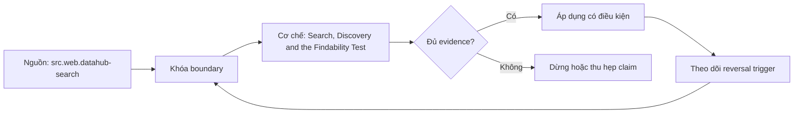

# Search, Discovery and the Findability Test

> [!abstract] Câu hỏi trung tâm
> Findability của data product được đo bằng tác vụ tìm kiếm, query logs và failed vocabulary như thế nào mà không đánh đồng catalog coverage với kết quả người dùng?

## 1. Findability là outcome của một nhu cầu

Một asset chỉ được xem là tìm thấy khi người dùng có nhu cầu xác định, truy cập từ điểm bắt đầu thực tế, chọn đúng product trong giới hạn thời gian và giải thích được vì sao nó phù hợp. Số assets đã ingest, số trường metadata hay việc search endpoint trả 200 chỉ là input/capability. Denominator phải là search tasks hợp lệ; numerator là tasks tìm đúng product mà không có trợ giúp ngoài protocol. Nếu product không tồn tại hoặc user không có quyền thấy nó, task phải được phân loại riêng thay vì tính như lỗi ranking.

## 2. Bốn bề mặt metadata

Name dùng business vocabulary và tránh mã pipeline làm primary label. One-line description nêu population, outcome/use case và time scope. Domain/tags/glossary terms hỗ trợ synonyms và filter nhưng cần governance để không thành tag soup. Trust state nêu certified, experimental, deprecated hoặc restricted cùng owner và evidence date. DataHub search cho thấy engine có thể match names, descriptions, tags, terms, owners và columns; kết quả tốt hơn khi metadata liên quan được ingest. Đây là mechanism, không phải bằng chứng findability.

## 3. Thiết kế task và tập người dùng

Task viết theo intent, không đưa tên product hoặc keyword mà metadata đang dùng; ví dụ “tìm nguồn trả lời tỷ lệ khách hàng quay lại theo cohort” thay vì “tìm mart customer_retention”. Bao phủ distinct roles, vocabulary và access contexts. Mỗi participant bắt đầu từ catalog/search entry point họ thực sự dùng. Với formative vòng nhỏ, báo observed rate cùng n và từng case; không biến 3/5 thành ước lượng population chính xác. Nếu so hai vòng bằng hai nhóm khác nhau, giữ task difficulty và recruitment criteria tương đương.

## 4. Failed-query vocabulary là evidence

Ghi raw query, reformulations, clicked results, rank của target, filters, time, abandon, wrong selection và câu hỏi hỗ trợ. Phân loại failure: vocabulary mismatch, missing metadata, ranking, trust ambiguity, permission visibility, duplicate product, stale/deprecated result hoặc product gap. Sửa đúng nguyên nhân: thêm synonym khi mismatch, không nhồi mọi keyword vào title; hide/de-rank deprecated assets thay vì chỉ thêm badge; hợp nhất duplicates hoặc chỉ canonical product. Query logs không có intent đầy đủ nên cần session observation.

## 5. Ranking, access và trust tương tác

Text relevance cao không đủ nếu top result stale, inaccessible hoặc không certified. Usage signal có thể củng cố popularity bias: product cũ tiếp tục đứng cao vì đã phổ biến, product tốt hơn không được khám phá. Certification boost có thể che product phù hợp ngách. Search evaluation cần relevance judgments theo task, permission-aware expected set và trust-state policy. Một product bị loại vì không có quyền nhưng hiện kết quả không thể hành động tạo frustration; ẩn hoàn toàn lại che path xin quyền. Thiết kế phải nói rõ trạng thái và next action.

## 6. Hai vòng sửa có kiểm soát

Baseline đóng băng catalog snapshot, tasks, expected products, participant criteria và timebox. Sau vòng một, tạo change log nối failure class với name/description/tag/ranking/trust fix. Vòng hai dùng participants mới để giảm learning effect; giữ task semantics tương đương. So task-level completion, median/time distribution, wrong-product rate và assistance count; với mẫu nhỏ, mô tả quan sát và case evidence thay vì tuyên bố significance. Nếu tỷ lệ tăng vì task dễ hơn hoặc target được gợi ý, không được ghi là product cải thiện.

## 7. Findability không kết thúc ở click

Người dùng có thể click đúng asset nhưng không xác nhận grain, freshness hoặc limitation, nên discovery success cần một explain-back ngắn. Success funnel gồm search attempt → target visible → target selected → fit verified → access/use next step. L192 tập trung đoạn đầu nhưng phải ghi rơi rụng ở đoạn sau để chuyển cho L191, L194 và L195. Duplicate self-built assets là signal cần điều tra: đôi khi do không tìm thấy, đôi khi do trust, performance, access hoặc contract không phù hợp; không gán mọi bản sao cho search failure.

## 8. Ma trận kiểm chứng từng mệnh đề

Mỗi mệnh đề dưới đây cần artifact hoặc observation lưu được. Một trang tài liệu tồn tại, catalog có search box hoặc người dùng nói ‘dễ’ không tự là bằng chứng.

### 8.1. catalog coverage khác findability outcome

**Mệnh đề cần kiểm.** catalog coverage khác findability outcome.

**Cách kiểm.** Đóng băng catalog snapshot và năm intent tasks; ghi raw queries, clicks, rank, time, wrong selection, trust/access state và assistance. Sửa theo failure taxonomy rồi chạy lại với participants mới, giữ task difficulty và recruitment criteria. Với mệnh đề này, ghi participant/task hoặc artifact version, điều kiện đầu vào, expected observation, failure signal và yếu tố làm kết luận không còn đúng.

**Bằng chứng đạt cho `wiki.data-product.findability-test`.** Lưu protocol hoặc command, raw observations, numerator/denominator nếu có, exact product/docs version, reviewer và artifact hash. Nếu chưa chạy study/lab, chỉ ghi đây là protocol; không biến expected result thành kết quả quan sát.

### 8.2. denominator là valid user-needs tasks

**Mệnh đề cần kiểm.** denominator là valid user-needs tasks.

**Cách kiểm.** Đóng băng catalog snapshot và năm intent tasks; ghi raw queries, clicks, rank, time, wrong selection, trust/access state và assistance. Sửa theo failure taxonomy rồi chạy lại với participants mới, giữ task difficulty và recruitment criteria. Với mệnh đề này, ghi participant/task hoặc artifact version, điều kiện đầu vào, expected observation, failure signal và yếu tố làm kết luận không còn đúng.

**Bằng chứng đạt cho `wiki.data-product.findability-test`.** Lưu protocol hoặc command, raw observations, numerator/denominator nếu có, exact product/docs version, reviewer và artifact hash. Nếu chưa chạy study/lab, chỉ ghi đây là protocol; không biến expected result thành kết quả quan sát.

### 8.3. product gap không được tính như ranking failure

**Mệnh đề cần kiểm.** product gap không được tính như ranking failure.

**Cách kiểm.** Đóng băng catalog snapshot và năm intent tasks; ghi raw queries, clicks, rank, time, wrong selection, trust/access state và assistance. Sửa theo failure taxonomy rồi chạy lại với participants mới, giữ task difficulty và recruitment criteria. Với mệnh đề này, ghi participant/task hoặc artifact version, điều kiện đầu vào, expected observation, failure signal và yếu tố làm kết luận không còn đúng.

**Bằng chứng đạt cho `wiki.data-product.findability-test`.** Lưu protocol hoặc command, raw observations, numerator/denominator nếu có, exact product/docs version, reviewer và artifact hash. Nếu chưa chạy study/lab, chỉ ghi đây là protocol; không biến expected result thành kết quả quan sát.

### 8.4. business names không dùng technical table code làm primary label

**Mệnh đề cần kiểm.** business names không dùng technical table code làm primary label.

**Cách kiểm.** Đóng băng catalog snapshot và năm intent tasks; ghi raw queries, clicks, rank, time, wrong selection, trust/access state và assistance. Sửa theo failure taxonomy rồi chạy lại với participants mới, giữ task difficulty và recruitment criteria. Với mệnh đề này, ghi participant/task hoặc artifact version, điều kiện đầu vào, expected observation, failure signal và yếu tố làm kết luận không còn đúng.

**Bằng chứng đạt cho `wiki.data-product.findability-test`.** Lưu protocol hoặc command, raw observations, numerator/denominator nếu có, exact product/docs version, reviewer và artifact hash. Nếu chưa chạy study/lab, chỉ ghi đây là protocol; không biến expected result thành kết quả quan sát.

### 8.5. description phải nêu population use case và time scope

**Mệnh đề cần kiểm.** description phải nêu population use case và time scope.

**Cách kiểm.** Đóng băng catalog snapshot và năm intent tasks; ghi raw queries, clicks, rank, time, wrong selection, trust/access state và assistance. Sửa theo failure taxonomy rồi chạy lại với participants mới, giữ task difficulty và recruitment criteria. Với mệnh đề này, ghi participant/task hoặc artifact version, điều kiện đầu vào, expected observation, failure signal và yếu tố làm kết luận không còn đúng.

**Bằng chứng đạt cho `wiki.data-product.findability-test`.** Lưu protocol hoặc command, raw observations, numerator/denominator nếu có, exact product/docs version, reviewer và artifact hash. Nếu chưa chạy study/lab, chỉ ghi đây là protocol; không biến expected result thành kết quả quan sát.

### 8.6. tags cần controlled vocabulary

**Mệnh đề cần kiểm.** tags cần controlled vocabulary.

**Cách kiểm.** Đóng băng catalog snapshot và năm intent tasks; ghi raw queries, clicks, rank, time, wrong selection, trust/access state và assistance. Sửa theo failure taxonomy rồi chạy lại với participants mới, giữ task difficulty và recruitment criteria. Với mệnh đề này, ghi participant/task hoặc artifact version, điều kiện đầu vào, expected observation, failure signal và yếu tố làm kết luận không còn đúng.

**Bằng chứng đạt cho `wiki.data-product.findability-test`.** Lưu protocol hoặc command, raw observations, numerator/denominator nếu có, exact product/docs version, reviewer và artifact hash. Nếu chưa chạy study/lab, chỉ ghi đây là protocol; không biến expected result thành kết quả quan sát.

### 8.7. trust state có owner và evidence date

**Mệnh đề cần kiểm.** trust state có owner và evidence date.

**Cách kiểm.** Đóng băng catalog snapshot và năm intent tasks; ghi raw queries, clicks, rank, time, wrong selection, trust/access state và assistance. Sửa theo failure taxonomy rồi chạy lại với participants mới, giữ task difficulty và recruitment criteria. Với mệnh đề này, ghi participant/task hoặc artifact version, điều kiện đầu vào, expected observation, failure signal và yếu tố làm kết luận không còn đúng.

**Bằng chứng đạt cho `wiki.data-product.findability-test`.** Lưu protocol hoặc command, raw observations, numerator/denominator nếu có, exact product/docs version, reviewer và artifact hash. Nếu chưa chạy study/lab, chỉ ghi đây là protocol; không biến expected result thành kết quả quan sát.

### 8.8. task không được lộ tên product

**Mệnh đề cần kiểm.** task không được lộ tên product.

**Cách kiểm.** Đóng băng catalog snapshot và năm intent tasks; ghi raw queries, clicks, rank, time, wrong selection, trust/access state và assistance. Sửa theo failure taxonomy rồi chạy lại với participants mới, giữ task difficulty và recruitment criteria. Với mệnh đề này, ghi participant/task hoặc artifact version, điều kiện đầu vào, expected observation, failure signal và yếu tố làm kết luận không còn đúng.

**Bằng chứng đạt cho `wiki.data-product.findability-test`.** Lưu protocol hoặc command, raw observations, numerator/denominator nếu có, exact product/docs version, reviewer và artifact hash. Nếu chưa chạy study/lab, chỉ ghi đây là protocol; không biến expected result thành kết quả quan sát.

### 8.9. small sample rate phải kèm numerator denominator

**Mệnh đề cần kiểm.** small sample rate phải kèm numerator denominator.

**Cách kiểm.** Đóng băng catalog snapshot và năm intent tasks; ghi raw queries, clicks, rank, time, wrong selection, trust/access state và assistance. Sửa theo failure taxonomy rồi chạy lại với participants mới, giữ task difficulty và recruitment criteria. Với mệnh đề này, ghi participant/task hoặc artifact version, điều kiện đầu vào, expected observation, failure signal và yếu tố làm kết luận không còn đúng.

**Bằng chứng đạt cho `wiki.data-product.findability-test`.** Lưu protocol hoặc command, raw observations, numerator/denominator nếu có, exact product/docs version, reviewer và artifact hash. Nếu chưa chạy study/lab, chỉ ghi đây là protocol; không biến expected result thành kết quả quan sát.

### 8.10. failed terms cần raw query và reformulation

**Mệnh đề cần kiểm.** failed terms cần raw query và reformulation.

**Cách kiểm.** Đóng băng catalog snapshot và năm intent tasks; ghi raw queries, clicks, rank, time, wrong selection, trust/access state và assistance. Sửa theo failure taxonomy rồi chạy lại với participants mới, giữ task difficulty và recruitment criteria. Với mệnh đề này, ghi participant/task hoặc artifact version, điều kiện đầu vào, expected observation, failure signal và yếu tố làm kết luận không còn đúng.

**Bằng chứng đạt cho `wiki.data-product.findability-test`.** Lưu protocol hoặc command, raw observations, numerator/denominator nếu có, exact product/docs version, reviewer và artifact hash. Nếu chưa chạy study/lab, chỉ ghi đây là protocol; không biến expected result thành kết quả quan sát.

### 8.11. usage ranking có popularity bias

**Mệnh đề cần kiểm.** usage ranking có popularity bias.

**Cách kiểm.** Đóng băng catalog snapshot và năm intent tasks; ghi raw queries, clicks, rank, time, wrong selection, trust/access state và assistance. Sửa theo failure taxonomy rồi chạy lại với participants mới, giữ task difficulty và recruitment criteria. Với mệnh đề này, ghi participant/task hoặc artifact version, điều kiện đầu vào, expected observation, failure signal và yếu tố làm kết luận không còn đúng.

**Bằng chứng đạt cho `wiki.data-product.findability-test`.** Lưu protocol hoặc command, raw observations, numerator/denominator nếu có, exact product/docs version, reviewer và artifact hash. Nếu chưa chạy study/lab, chỉ ghi đây là protocol; không biến expected result thành kết quả quan sát.

### 8.12. permission state ảnh hưởng discovery actionability

**Mệnh đề cần kiểm.** permission state ảnh hưởng discovery actionability.

**Cách kiểm.** Đóng băng catalog snapshot và năm intent tasks; ghi raw queries, clicks, rank, time, wrong selection, trust/access state và assistance. Sửa theo failure taxonomy rồi chạy lại với participants mới, giữ task difficulty và recruitment criteria. Với mệnh đề này, ghi participant/task hoặc artifact version, điều kiện đầu vào, expected observation, failure signal và yếu tố làm kết luận không còn đúng.

**Bằng chứng đạt cho `wiki.data-product.findability-test`.** Lưu protocol hoặc command, raw observations, numerator/denominator nếu có, exact product/docs version, reviewer và artifact hash. Nếu chưa chạy study/lab, chỉ ghi đây là protocol; không biến expected result thành kết quả quan sát.

### 8.13. round comparison giữ task difficulty tương đương

**Mệnh đề cần kiểm.** round comparison giữ task difficulty tương đương.

**Cách kiểm.** Đóng băng catalog snapshot và năm intent tasks; ghi raw queries, clicks, rank, time, wrong selection, trust/access state và assistance. Sửa theo failure taxonomy rồi chạy lại với participants mới, giữ task difficulty và recruitment criteria. Với mệnh đề này, ghi participant/task hoặc artifact version, điều kiện đầu vào, expected observation, failure signal và yếu tố làm kết luận không còn đúng.

**Bằng chứng đạt cho `wiki.data-product.findability-test`.** Lưu protocol hoặc command, raw observations, numerator/denominator nếu có, exact product/docs version, reviewer và artifact hash. Nếu chưa chạy study/lab, chỉ ghi đây là protocol; không biến expected result thành kết quả quan sát.

### 8.14. click đúng nhưng hiểu sai chưa phải success

**Mệnh đề cần kiểm.** click đúng nhưng hiểu sai chưa phải success.

**Cách kiểm.** Đóng băng catalog snapshot và năm intent tasks; ghi raw queries, clicks, rank, time, wrong selection, trust/access state và assistance. Sửa theo failure taxonomy rồi chạy lại với participants mới, giữ task difficulty và recruitment criteria. Với mệnh đề này, ghi participant/task hoặc artifact version, điều kiện đầu vào, expected observation, failure signal và yếu tố làm kết luận không còn đúng.

**Bằng chứng đạt cho `wiki.data-product.findability-test`.** Lưu protocol hoặc command, raw observations, numerator/denominator nếu có, exact product/docs version, reviewer và artifact hash. Nếu chưa chạy study/lab, chỉ ghi đây là protocol; không biến expected result thành kết quả quan sát.

### 8.15. duplicate asset không luôn là findability failure

**Mệnh đề cần kiểm.** duplicate asset không luôn là findability failure.

**Cách kiểm.** Đóng băng catalog snapshot và năm intent tasks; ghi raw queries, clicks, rank, time, wrong selection, trust/access state và assistance. Sửa theo failure taxonomy rồi chạy lại với participants mới, giữ task difficulty và recruitment criteria. Với mệnh đề này, ghi participant/task hoặc artifact version, điều kiện đầu vào, expected observation, failure signal và yếu tố làm kết luận không còn đúng.

**Bằng chứng đạt cho `wiki.data-product.findability-test`.** Lưu protocol hoặc command, raw observations, numerator/denominator nếu có, exact product/docs version, reviewer và artifact hash. Nếu chưa chạy study/lab, chỉ ghi đây là protocol; không biến expected result thành kết quả quan sát.

## 9. Quy trình phản biện

1. Viết user need, task, persona, stakes và scope trước khi chọn catalog, tài liệu hoặc metric.
2. Tách source fact, curriculum synthesis, organizational policy và observation từ study.
3. Khóa task/protocol/oracle trước khi đo; mọi deviation phải được ghi.
4. Kiểm correct outcome và interpretation, không chỉ completion hoặc cảm nhận.
5. Phân loại lỗi theo cơ chế để sửa đúng lớp: metadata, docs, interface, trust, access hay skill.
6. Kiểm changed user group, changed task và degraded state trước khi khái quát.
7. Chưa có execution evidence thì giữ trạng thái `review`.

## 10. Câu hỏi tự kiểm tra

1. User task nào đang được hỗ trợ, và điều gì nằm ngoài scope?
2. Oracle nào xác định product hoặc kết quả đúng?
3. Số đo dùng denominator nào và loại invalid attempt theo rule nào?
4. Điểm nào cần automation, điểm nào bắt buộc human judgment?
5. Một kết quả nhanh nhưng sai nghĩa được phát hiện ở đâu?
6. Điều kiện nào làm kết luận từ sample hoặc catalog hiện tại không còn áp dụng?

## 11. Giới hạn và điều chưa cho phép kết luận

- Chưa chạy user study, catalog experiment, documentation CI hoặc support-boundary exercise; note mô tả protocol và expected evidence.
- Tài liệu web được kiểm ngày 2026-10-01; tính năng, giao diện, license và guidance có thể đổi.
- Bốn tầng documentation, bốn điều kiện self-service và bốn số đo của module là curriculum synthesis; không gán nguyên văn cho một nguồn.
- Cỡ mẫu nhỏ cho formative discovery không cho phép kết luận tỷ lệ toàn population hoặc statistical significance.
- Dữ liệu người tham gia, recording và screen capture cần consent, minimization, retention và access controls riêng.
- Note giữ trạng thái `review` cho tới khi chủ dự án duyệt semantic meaning.

## Reference
1. [[SRC-DATAHUB-SEARCH]]
2. [[SRC-DEHGHANI-DATA-MESH-PRINCIPLES]]
3. [[SRC-GOVUK-UNDERSTAND-USER-NEEDS]]

## Source coverage

| Source slice | Nội dung sử dụng | Trạng thái |
|---|---|---|
| [[SRC-DATAHUB-SEARCH]] | Khái niệm, mechanism hoặc study boundary liên quan | Đã đọc locator trong source record; không suy ngoài phạm vi |
| [[SRC-DEHGHANI-DATA-MESH-PRINCIPLES]] | Khái niệm, mechanism hoặc study boundary liên quan | Đã đọc locator trong source record; không suy ngoài phạm vi |
| [[SRC-GOVUK-UNDERSTAND-USER-NEEDS]] | Khái niệm, mechanism hoặc study boundary liên quan | Đã đọc locator trong source record; không suy ngoài phạm vi |

## Key takeaways
- Đo khả năng tìm đúng product cho intent; inventory, search endpoint và click không tự là success.
- Chỉ số phải gắn task, persona, product version, protocol và denominator.
- Correct completion gồm cả kết quả và cách diễn giải đúng; confident-wrong là failure nghiêm trọng.
- Công cụ catalog, docs generator và CI cung cấp mechanism, không tự chứng minh outcome.
- Chưa chạy study hoặc lab thì artifact là tài liệu học thuật đã kiểm cấu trúc, không phải chứng nhận thực tế.

<!-- ATOMIC-EXECUTION-CAPSULE:START -->

## Execution capsule — kiểm chứng `wiki.data-product.findability-test`

> [!important] Phân loại mệnh đề
> Với `wiki.data-product.findability-test`, sơ đồ, ví dụ và artifact về **Search, Discovery and the Findability Test** là **synthesis để kiểm chứng**; chúng không phải trích dẫn hay case nguyên văn của nguồn.

### Sơ đồ cơ chế và điểm kiểm soát



Đọc sơ đồ `wiki.data-product.findability-test` từ trái sang phải: source chỉ cung cấp claim ban đầu cho **Search, Discovery and the Findability Test**; quyết định chỉ được đi tiếp sau khi boundary, evidence và điều kiện đảo quyết định đã hiện hữu.

### Artifact thực thi tối thiểu

```sql
-- Verification harness for: Search, Discovery and the Findability Test
WITH evidence AS (
    SELECT 'wiki.data-product.findability-test' AS concept_id,
           'boundary_declared' AS check_name, 1 AS passed
    UNION ALL
    SELECT 'wiki.data-product.findability-test', 'independent_oracle', 1
    UNION ALL
    SELECT 'wiki.data-product.findability-test', 'reversal_trigger_recorded', 1
)
SELECT concept_id,
       MIN(passed) AS all_hard_checks_pass,
       COUNT(*) AS evidence_items
FROM evidence
GROUP BY concept_id
HAVING MIN(passed) = 1;
```

Artifact của `wiki.data-product.findability-test` buộc người dùng ghi boundary, oracle và reversal trigger cho **Search, Discovery and the Findability Test**. Các giá trị minh họa phải được thay bằng evidence thật trước khi dùng cho quyết định.

### Tự kiểm tra trước khi tái sử dụng

1. Bạn có thể trả lời `Findability của data product được đo bằng tác vụ tìm kiếm, query logs và failed vocabulary như thế nào mà không đánh đồng catalog coverage với kết quả người dùng?` bằng một câu mà không kéo thêm concept thứ hai không?
2. Source locator nào đỡ cho claim, và phần nào chỉ là synthesis trong note?
3. Observation nào khiến bạn dừng, thu hẹp hoặc đảo quyết định?
4. Artifact nào cho phép một reviewer độc lập tái hiện kết quả?

<!-- ATOMIC-EXECUTION-CAPSULE:END -->
