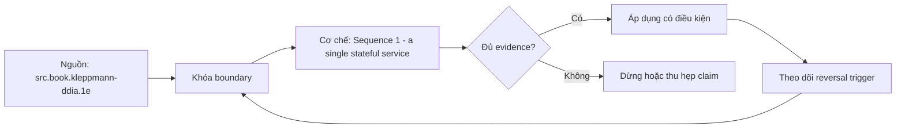

# Sequence 1 - a single stateful service

> [!abstract] Câu hỏi trung tâm
> Làm thế nào mô hình, kiểm chứng và vận hành single stateful service sequence, durability boundary và recovery path mà không khẳng định vượt quá evidence?

## 1. Mechanism

Mô hình single stateful service sequence, durability boundary và recovery path phải nêu actors, identities, state transitions và authority thay vì chỉ liệt kê components. Đừng bắt đầu bằng tên công cụ. Hãy bắt đầu bằng đối tượng được bảo vệ, boundary quan sát được và hậu quả nếu kết luận sai. Trong bài `Sequence 1 - a single stateful service`, câu hỏi thực dụng là: Làm thế nào mô hình, kiểm chứng và vận hành single stateful service sequence, durability boundary và recovery path mà không khẳng định vượt quá evidence? Ta ghi rõ grain, population, time window, owner và hành động sau failure; nếu một trường chưa biết thì đánh dấu unknown thay vì lấp bằng mặc định. Bằng chứng tối thiểu gồm fixture có version, cấu hình hoặc rule đã resolve, raw observation, expected result và limitation. Phần này là curriculum synthesis dựa trên các nguồn đã định danh, không phải lời hứa rằng mọi adapter hay deployment đều có cùng hành vi.

## 2. Boundary

Guarantee của single stateful service sequence, durability boundary và recovery path chỉ đúng trong workload, failure model, time window, trust boundary và version đã khóa. Điểm khó không nằm ở cú pháp mà ở identity và scope. Hai phép đo cùng tên vẫn có thể nói về hai population hoặc hai thời điểm khác nhau. Trong bài `Sequence 1 - a single stateful service`, câu hỏi thực dụng là: Làm thế nào mô hình, kiểm chứng và vận hành single stateful service sequence, durability boundary và recovery path mà không khẳng định vượt quá evidence? Ta ghi rõ grain, population, time window, owner và hành động sau failure; nếu một trường chưa biết thì đánh dấu unknown thay vì lấp bằng mặc định. Bằng chứng tối thiểu gồm fixture có version, cấu hình hoặc rule đã resolve, raw observation, expected result và limitation. Phần này là curriculum synthesis dựa trên các nguồn đã định danh, không phải lời hứa rằng mọi adapter hay deployment đều có cùng hành vi.

## 3. Failure mode

Phân tích single stateful service sequence, durability boundary và recovery path cần tìm earliest controllable failure, propagation path, blast radius và durable state còn tin cậy. Một dashboard xanh chỉ là tín hiệu. Muốn biến nó thành bằng chứng phải giữ input, phiên bản, rule, trạng thái trước-sau và cách tính độc lập. Trong bài `Sequence 1 - a single stateful service`, câu hỏi thực dụng là: Làm thế nào mô hình, kiểm chứng và vận hành single stateful service sequence, durability boundary và recovery path mà không khẳng định vượt quá evidence? Ta ghi rõ grain, population, time window, owner và hành động sau failure; nếu một trường chưa biết thì đánh dấu unknown thay vì lấp bằng mặc định. Bằng chứng tối thiểu gồm fixture có version, cấu hình hoặc rule đã resolve, raw observation, expected result và limitation. Phần này là curriculum synthesis dựa trên các nguồn đã định danh, không phải lời hứa rằng mọi adapter hay deployment đều có cùng hành vi.

## 4. Decision rule

Quyết định về single stateful service sequence, durability boundary và recovery path phải nối quantified requirements với alternatives, cost, complexity và reversal trigger. Thiết kế tốt phải chịu được counterexample. Hãy chủ động tạo case sát boundary, case thiếu dữ liệu và case replay thay vì chỉ chạy happy path. Trong bài `Sequence 1 - a single stateful service`, câu hỏi thực dụng là: Làm thế nào mô hình, kiểm chứng và vận hành single stateful service sequence, durability boundary và recovery path mà không khẳng định vượt quá evidence? Ta ghi rõ grain, population, time window, owner và hành động sau failure; nếu một trường chưa biết thì đánh dấu unknown thay vì lấp bằng mặc định. Bằng chứng tối thiểu gồm fixture có version, cấu hình hoặc rule đã resolve, raw observation, expected result và limitation. Phần này là curriculum synthesis dựa trên các nguồn đã định danh, không phải lời hứa rằng mọi adapter hay deployment đều có cùng hành vi.

## 5. Evidence

Bằng chứng cho single stateful service sequence, durability boundary và recovery path gồm input assumptions, stable identity, resolved design/config, raw observations và independent oracle. Chi phí vận hành thuộc contract. Một rule đúng nhưng quá đắt, quá ồn hoặc không có owner sẽ nhanh chóng bị tắt và mất tác dụng. Trong bài `Sequence 1 - a single stateful service`, câu hỏi thực dụng là: Làm thế nào mô hình, kiểm chứng và vận hành single stateful service sequence, durability boundary và recovery path mà không khẳng định vượt quá evidence? Ta ghi rõ grain, population, time window, owner và hành động sau failure; nếu một trường chưa biết thì đánh dấu unknown thay vì lấp bằng mặc định. Bằng chứng tối thiểu gồm fixture có version, cấu hình hoặc rule đã resolve, raw observation, expected result và limitation. Phần này là curriculum synthesis dựa trên các nguồn đã định danh, không phải lời hứa rằng mọi adapter hay deployment đều có cùng hành vi.

## 6. Recovery lab

Lab single stateful service sequence, durability boundary và recovery path phải inject failure hoặc đổi một assumption, phục hồi theo runbook rồi reconcile outcome với invariants. Kết luận cần có điều kiện đảo chiều. Khi volume, latency, nguồn thẩm quyền hoặc topology đổi, quyết định cũ phải được xem xét lại bằng cùng một oracle. Trong bài `Sequence 1 - a single stateful service`, câu hỏi thực dụng là: Làm thế nào mô hình, kiểm chứng và vận hành single stateful service sequence, durability boundary và recovery path mà không khẳng định vượt quá evidence? Ta ghi rõ grain, population, time window, owner và hành động sau failure; nếu một trường chưa biết thì đánh dấu unknown thay vì lấp bằng mặc định. Bằng chứng tối thiểu gồm fixture có version, cấu hình hoặc rule đã resolve, raw observation, expected result và limitation. Phần này là curriculum synthesis dựa trên các nguồn đã định danh, không phải lời hứa rằng mọi adapter hay deployment đều có cùng hành vi.

## 7. Ma trận kiểm chứng từng mệnh đề

Với `wiki.system-design.single-stateful-service`, command thành công không tự chứng minh dữ liệu đúng. Protocol riêng của bài là: Run a version-pinned model, sandbox or replayable fixture, change one assumption or inject one failure, retain raw state and event evidence, then reconcile the result against an independent invariant oracle. Mỗi probe dưới đây phải nối input boundary với failure signal và oracle có thể phản bác kết luận.

### 7.1. Sequence 1 - a single stateful service: kiểm `Mechanism` bằng case 1, cụ thể mô hình single stateful service sequence, durability boundary và recovery path phải nêu actors, identities, state transitions và authority thay vì chỉ liệt kê components

**Mệnh đề cần kiểm.** Sequence 1 - a single stateful service: kiểm `Mechanism` bằng case 1, cụ thể mô hình single stateful service sequence, durability boundary và recovery path phải nêu actors, identities, state transitions và authority thay vì chỉ liệt kê components.

**Thiết kế phép thử cho `wiki.system-design.single-stateful-service`.** Trong ngữ cảnh `wiki.system-design.single-stateful-service`, tạo positive control và negative control chỉ khác đúng một điều kiện. Khóa input snapshot, phiên bản và owner của rule; chạy đúng population được bài `Sequence 1 - a single stateful service` công bố.

**Bằng chứng cần giữ.** Đối với probe 1 của `Sequence 1 - a single stateful service`, giữ fixture, raw failing rows và lệnh tái hiện. Nếu chưa chạy lab, ghi expected evidence và giữ trạng thái review; không biến protocol thành observation.

### 7.2. Sequence 1 - a single stateful service: kiểm `Boundary` bằng case 2, cụ thể guarantee của single stateful service sequence, durability boundary và recovery path chỉ đúng trong workload, failure model, time window, trust boundary và version đã khóa

**Mệnh đề cần kiểm.** Sequence 1 - a single stateful service: kiểm `Boundary` bằng case 2, cụ thể guarantee của single stateful service sequence, durability boundary và recovery path chỉ đúng trong workload, failure model, time window, trust boundary và version đã khóa.

**Thiết kế phép thử cho `wiki.system-design.single-stateful-service`.** Trong ngữ cảnh `wiki.system-design.single-stateful-service`, đổi grain nhưng giữ tổng số dòng để lộ phép đo sai cấp. Khóa input snapshot, phiên bản và owner của rule; chạy đúng population được bài `Sequence 1 - a single stateful service` công bố.

**Bằng chứng cần giữ.** Đối với probe 2 của `Sequence 1 - a single stateful service`, báo numerator, denominator và key set ở cả hai grain. Nếu chưa chạy lab, ghi expected evidence và giữ trạng thái review; không biến protocol thành observation.

### 7.3. Sequence 1 - a single stateful service: kiểm `Failure mode` bằng case 3, cụ thể phân tích single stateful service sequence, durability boundary và recovery path cần tìm earliest controllable failure, propagation path, blast radius và durable state còn tin cậy

**Mệnh đề cần kiểm.** Sequence 1 - a single stateful service: kiểm `Failure mode` bằng case 3, cụ thể phân tích single stateful service sequence, durability boundary và recovery path cần tìm earliest controllable failure, propagation path, blast radius và durable state còn tin cậy.

**Thiết kế phép thử cho `wiki.system-design.single-stateful-service`.** Trong ngữ cảnh `wiki.system-design.single-stateful-service`, đưa một giá trị tới đúng boundary và một giá trị vượt boundary. Khóa input snapshot, phiên bản và owner của rule; chạy đúng population được bài `Sequence 1 - a single stateful service` công bố.

**Bằng chứng cần giữ.** Đối với probe 3 của `Sequence 1 - a single stateful service`, lưu hai observed values cùng rule đã resolve. Nếu chưa chạy lab, ghi expected evidence và giữ trạng thái review; không biến protocol thành observation.

### 7.4. Sequence 1 - a single stateful service: kiểm `Decision rule` bằng case 4, cụ thể quyết định về single stateful service sequence, durability boundary và recovery path phải nối quantified requirements với alternatives, cost, complexity và reversal trigger

**Mệnh đề cần kiểm.** Sequence 1 - a single stateful service: kiểm `Decision rule` bằng case 4, cụ thể quyết định về single stateful service sequence, durability boundary và recovery path phải nối quantified requirements với alternatives, cost, complexity và reversal trigger.

**Thiết kế phép thử cho `wiki.system-design.single-stateful-service`.** Trong ngữ cảnh `wiki.system-design.single-stateful-service`, kill tiến trình ngay trước rồi ngay sau durable side effect. Khóa input snapshot, phiên bản và owner của rule; chạy đúng population được bài `Sequence 1 - a single stateful service` công bố.

**Bằng chứng cần giữ.** Đối với probe 4 của `Sequence 1 - a single stateful service`, lưu checkpoint, external ledger và trạng thái sau restart. Nếu chưa chạy lab, ghi expected evidence và giữ trạng thái review; không biến protocol thành observation.

### 7.5. Sequence 1 - a single stateful service: kiểm `Evidence` bằng case 5, cụ thể bằng chứng cho single stateful service sequence, durability boundary và recovery path gồm input assumptions, stable identity, resolved design/config, raw observations và independent oracle

**Mệnh đề cần kiểm.** Sequence 1 - a single stateful service: kiểm `Evidence` bằng case 5, cụ thể bằng chứng cho single stateful service sequence, durability boundary và recovery path gồm input assumptions, stable identity, resolved design/config, raw observations và independent oracle.

**Thiết kế phép thử cho `wiki.system-design.single-stateful-service`.** Trong ngữ cảnh `wiki.system-design.single-stateful-service`, đảo thứ tự input và concurrency nhưng giữ logical population. Khóa input snapshot, phiên bản và owner của rule; chạy đúng population được bài `Sequence 1 - a single stateful service` công bố.

**Bằng chứng cần giữ.** Đối với probe 5 của `Sequence 1 - a single stateful service`, so canonical hash và business totals giữa các thứ tự. Nếu chưa chạy lab, ghi expected evidence và giữ trạng thái review; không biến protocol thành observation.

### 7.6. Sequence 1 - a single stateful service: kiểm `Recovery lab` bằng case 6, cụ thể lab single stateful service sequence, durability boundary và recovery path phải inject failure hoặc đổi một assumption, phục hồi theo runbook rồi reconcile outcome với invariants

**Mệnh đề cần kiểm.** Sequence 1 - a single stateful service: kiểm `Recovery lab` bằng case 6, cụ thể lab single stateful service sequence, durability boundary và recovery path phải inject failure hoặc đổi một assumption, phục hồi theo runbook rồi reconcile outcome với invariants.

**Thiết kế phép thử cho `wiki.system-design.single-stateful-service`.** Trong ngữ cảnh `wiki.system-design.single-stateful-service`, replay cùng identity với payload giống rồi payload xung đột. Khóa input snapshot, phiên bản và owner của rule; chạy đúng population được bài `Sequence 1 - a single stateful service` công bố.

**Bằng chứng cần giữ.** Đối với probe 6 của `Sequence 1 - a single stateful service`, tách duplicate replay khỏi identity collision bằng reason code. Nếu chưa chạy lab, ghi expected evidence và giữ trạng thái review; không biến protocol thành observation.

### 7.7. Sequence 1 - a single stateful service: kiểm `Mechanism` bằng case 7, cụ thể mô hình single stateful service sequence, durability boundary và recovery path phải nêu actors, identities, state transitions và authority thay vì chỉ liệt kê components

**Mệnh đề cần kiểm.** Sequence 1 - a single stateful service: kiểm `Mechanism` bằng case 7, cụ thể mô hình single stateful service sequence, durability boundary và recovery path phải nêu actors, identities, state transitions và authority thay vì chỉ liệt kê components.

**Thiết kế phép thử cho `wiki.system-design.single-stateful-service`.** Trong ngữ cảnh `wiki.system-design.single-stateful-service`, thêm record tới trễ trong horizon và ngoài horizon. Khóa input snapshot, phiên bản và owner của rule; chạy đúng population được bài `Sequence 1 - a single stateful service` công bố.

**Bằng chứng cần giữ.** Đối với probe 7 của `Sequence 1 - a single stateful service`, báo accepted-late, rejected-late và oldest outstanding timestamp. Nếu chưa chạy lab, ghi expected evidence và giữ trạng thái review; không biến protocol thành observation.

### 7.8. Sequence 1 - a single stateful service: kiểm `Boundary` bằng case 8, cụ thể guarantee của single stateful service sequence, durability boundary và recovery path chỉ đúng trong workload, failure model, time window, trust boundary và version đã khóa

**Mệnh đề cần kiểm.** Sequence 1 - a single stateful service: kiểm `Boundary` bằng case 8, cụ thể guarantee của single stateful service sequence, durability boundary và recovery path chỉ đúng trong workload, failure model, time window, trust boundary và version đã khóa.

**Thiết kế phép thử cho `wiki.system-design.single-stateful-service`.** Trong ngữ cảnh `wiki.system-design.single-stateful-service`, đổi schema theo một cách tương thích rồi một cách phá vỡ semantics. Khóa input snapshot, phiên bản và owner của rule; chạy đúng population được bài `Sequence 1 - a single stateful service` công bố.

**Bằng chứng cần giữ.** Đối với probe 8 của `Sequence 1 - a single stateful service`, giữ schema diff, classification và consumer-visible result. Nếu chưa chạy lab, ghi expected evidence và giữ trạng thái review; không biến protocol thành observation.

### 7.9. Sequence 1 - a single stateful service: kiểm `Failure mode` bằng case 9, cụ thể phân tích single stateful service sequence, durability boundary và recovery path cần tìm earliest controllable failure, propagation path, blast radius và durable state còn tin cậy

**Mệnh đề cần kiểm.** Sequence 1 - a single stateful service: kiểm `Failure mode` bằng case 9, cụ thể phân tích single stateful service sequence, durability boundary và recovery path cần tìm earliest controllable failure, propagation path, blast radius và durable state còn tin cậy.

**Thiết kế phép thử cho `wiki.system-design.single-stateful-service`.** Trong ngữ cảnh `wiki.system-design.single-stateful-service`, tạo missing và duplicate bù nhau để count tổng không đổi. Khóa input snapshot, phiên bản và owner của rule; chạy đúng population được bài `Sequence 1 - a single stateful service` công bố.

**Bằng chứng cần giữ.** Đối với probe 9 của `Sequence 1 - a single stateful service`, so key multiset và typed hashes thay vì chỉ row count. Nếu chưa chạy lab, ghi expected evidence và giữ trạng thái review; không biến protocol thành observation.

### 7.10. Sequence 1 - a single stateful service: kiểm `Decision rule` bằng case 10, cụ thể quyết định về single stateful service sequence, durability boundary và recovery path phải nối quantified requirements với alternatives, cost, complexity và reversal trigger

**Mệnh đề cần kiểm.** Sequence 1 - a single stateful service: kiểm `Decision rule` bằng case 10, cụ thể quyết định về single stateful service sequence, durability boundary và recovery path phải nối quantified requirements với alternatives, cost, complexity và reversal trigger.

**Thiết kế phép thử cho `wiki.system-design.single-stateful-service`.** Trong ngữ cảnh `wiki.system-design.single-stateful-service`, cho reviewer tái hiện chỉ từ evidence package. Khóa input snapshot, phiên bản và owner của rule; chạy đúng population được bài `Sequence 1 - a single stateful service` công bố.

**Bằng chứng cần giữ.** Đối với probe 10 của `Sequence 1 - a single stateful service`, package phải đủ để người khác dựng lại decision và limitation. Nếu chưa chạy lab, ghi expected evidence và giữ trạng thái review; không biến protocol thành observation.

### 7.11. Sequence 1 - a single stateful service: kiểm `Evidence` bằng case 11, cụ thể bằng chứng cho single stateful service sequence, durability boundary và recovery path gồm input assumptions, stable identity, resolved design/config, raw observations và independent oracle

**Mệnh đề cần kiểm.** Sequence 1 - a single stateful service: kiểm `Evidence` bằng case 11, cụ thể bằng chứng cho single stateful service sequence, durability boundary và recovery path gồm input assumptions, stable identity, resolved design/config, raw observations và independent oracle.

**Thiết kế phép thử cho `wiki.system-design.single-stateful-service`.** Trong ngữ cảnh `wiki.system-design.single-stateful-service`, so với oracle độc lập không dùng chung query hoặc parser. Khóa input snapshot, phiên bản và owner của rule; chạy đúng population được bài `Sequence 1 - a single stateful service` công bố.

**Bằng chứng cần giữ.** Đối với probe 11 của `Sequence 1 - a single stateful service`, independent result phải khớp ở grain đã công bố. Nếu chưa chạy lab, ghi expected evidence và giữ trạng thái review; không biến protocol thành observation.

### 7.12. Sequence 1 - a single stateful service: kiểm `Recovery lab` bằng case 12, cụ thể lab single stateful service sequence, durability boundary và recovery path phải inject failure hoặc đổi một assumption, phục hồi theo runbook rồi reconcile outcome với invariants

**Mệnh đề cần kiểm.** Sequence 1 - a single stateful service: kiểm `Recovery lab` bằng case 12, cụ thể lab single stateful service sequence, durability boundary và recovery path phải inject failure hoặc đổi một assumption, phục hồi theo runbook rồi reconcile outcome với invariants.

**Thiết kế phép thử cho `wiki.system-design.single-stateful-service`.** Trong ngữ cảnh `wiki.system-design.single-stateful-service`, chạy scope hẹp và population đầy đủ rồi công bố phần bị loại. Khóa input snapshot, phiên bản và owner của rule; chạy đúng population được bài `Sequence 1 - a single stateful service` công bố.

**Bằng chứng cần giữ.** Đối với probe 12 của `Sequence 1 - a single stateful service`, coverage phải nêu rõ excluded nodes, partitions hoặc incidents. Nếu chưa chạy lab, ghi expected evidence và giữ trạng thái review; không biến protocol thành observation.

### 7.13. Sequence 1 - a single stateful service: kiểm `Mechanism` bằng case 13, cụ thể mô hình single stateful service sequence, durability boundary và recovery path phải nêu actors, identities, state transitions và authority thay vì chỉ liệt kê components

**Mệnh đề cần kiểm.** Sequence 1 - a single stateful service: kiểm `Mechanism` bằng case 13, cụ thể mô hình single stateful service sequence, durability boundary và recovery path phải nêu actors, identities, state transitions và authority thay vì chỉ liệt kê components.

**Thiết kế phép thử cho `wiki.system-design.single-stateful-service`.** Trong ngữ cảnh `wiki.system-design.single-stateful-service`, thử timezone, precision hoặc partition ở hai phía của ranh giới. Khóa input snapshot, phiên bản và owner của rule; chạy đúng population được bài `Sequence 1 - a single stateful service` công bố.

**Bằng chứng cần giữ.** Đối với probe 13 của `Sequence 1 - a single stateful service`, UTC/local interval và rounding policy phải hiện trong output. Nếu chưa chạy lab, ghi expected evidence và giữ trạng thái review; không biến protocol thành observation.

### 7.14. Sequence 1 - a single stateful service: kiểm `Boundary` bằng case 14, cụ thể guarantee của single stateful service sequence, durability boundary và recovery path chỉ đúng trong workload, failure model, time window, trust boundary và version đã khóa

**Mệnh đề cần kiểm.** Sequence 1 - a single stateful service: kiểm `Boundary` bằng case 14, cụ thể guarantee của single stateful service sequence, durability boundary và recovery path chỉ đúng trong workload, failure model, time window, trust boundary và version đã khóa.

**Thiết kế phép thử cho `wiki.system-design.single-stateful-service`.** Trong ngữ cảnh `wiki.system-design.single-stateful-service`, đổi constraint đủ lớn để quyết định phải đảo. Khóa input snapshot, phiên bản và owner của rule; chạy đúng population được bài `Sequence 1 - a single stateful service` công bố.

**Bằng chứng cần giữ.** Đối với probe 14 của `Sequence 1 - a single stateful service`, ADR phải lưu changed constraint và reversal threshold. Nếu chưa chạy lab, ghi expected evidence và giữ trạng thái review; không biến protocol thành observation.

### 7.15. Sequence 1 - a single stateful service: kiểm `Failure mode` bằng case 15, cụ thể phân tích single stateful service sequence, durability boundary và recovery path cần tìm earliest controllable failure, propagation path, blast radius và durable state còn tin cậy

**Mệnh đề cần kiểm.** Sequence 1 - a single stateful service: kiểm `Failure mode` bằng case 15, cụ thể phân tích single stateful service sequence, durability boundary và recovery path cần tìm earliest controllable failure, propagation path, blast radius và durable state còn tin cậy.

**Thiết kế phép thử cho `wiki.system-design.single-stateful-service`.** Trong ngữ cảnh `wiki.system-design.single-stateful-service`, chạy lại từ môi trường sạch với versions và seed đã khóa. Khóa input snapshot, phiên bản và owner của rule; chạy đúng population được bài `Sequence 1 - a single stateful service` công bố.

**Bằng chứng cần giữ.** Đối với probe 15 của `Sequence 1 - a single stateful service`, canonical result phải ổn định hoặc mọi nondeterminism phải được giải thích. Nếu chưa chạy lab, ghi expected evidence và giữ trạng thái review; không biến protocol thành observation.

## 8. Quy trình phản biện

1. Viết consumer-visible invariant cho `Sequence 1 - a single stateful service` trước khi chọn query hoặc tool.
2. Khóa grain, identity, population, time window và authoritative source.
3. Phân biệt declared configuration, executed state và published state.
4. Chạy negative control, replay hoặc changed-assumption case phù hợp.
5. Đối soát bằng oracle độc lập; công bố coverage và phần không quan sát được.
6. Gắn owner, hành động, reversal trigger và hạn review cho kết luận.

## 9. Câu hỏi tự kiểm tra

1. `Sequence 1 - a single stateful service: kiểm `Mechanism` bằng case 1, cụ thể mô hình single stateful service sequence, durability boundary và recovery path phải nêu actors, identities, state transitions và authority thay vì chỉ liệt kê components` thất bại đầu tiên ở boundary nào?
2. Artifact nào mạnh nhất để trả lời `Sequence 1 - a single stateful service: kiểm `Failure mode` bằng case 3, cụ thể phân tích single stateful service sequence, durability boundary và recovery path cần tìm earliest controllable failure, propagation path, blast radius và durable state còn tin cậy`?
3. Counterexample nhỏ nhất cho `Sequence 1 - a single stateful service: kiểm `Recovery lab` bằng case 6, cụ thể lab single stateful service sequence, durability boundary và recovery path phải inject failure hoặc đổi một assumption, phục hồi theo runbook rồi reconcile outcome với invariants` gồm những state nào?
4. `Sequence 1 - a single stateful service: kiểm `Failure mode` bằng case 9, cụ thể phân tích single stateful service sequence, durability boundary và recovery path cần tìm earliest controllable failure, propagation path, blast radius và durable state còn tin cậy` có thể xanh giả ra sao?
5. Constraint nào khiến quyết định ở `Sequence 1 - a single stateful service: kiểm `Boundary` bằng case 14, cụ thể guarantee của single stateful service sequence, durability boundary và recovery path chỉ đúng trong workload, failure model, time window, trust boundary và version đã khóa` phải đảo?
6. Phần nào của `Sequence 1 - a single stateful service: kiểm `Failure mode` bằng case 15, cụ thể phân tích single stateful service sequence, durability boundary và recovery path cần tìm earliest controllable failure, propagation path, blast radius và durable state còn tin cậy` mới là protocol, chưa phải observation?

## 10. Giới hạn và điều chưa cho phép kết luận

- Lab của `Sequence 1 - a single stateful service` chưa chạy trên hệ thống production; nội dung là giáo trình và expected evidence.
- Hành vi phụ thuộc phiên bản, connector, scheduler, warehouse và catalog configuration phải được kiểm lại.
- Các ma trận, ladder và threshold do giáo trình tổng hợp không được gán nguyên văn cho vendor.
- Note giữ trạng thái `review` cho tới khi owner duyệt semantics và learner artifact.

## Reference
1. [[SRC-KLEPPMANN-DDIA-1E]]
2. [[SRC-AWS-WELL-ARCHITECTED-RELIABILITY]]

## Source coverage

| Source slice | Nội dung sử dụng | Trạng thái |
|---|---|---|
| [[SRC-KLEPPMANN-DDIA-1E]] | Contract hoặc cơ chế liên quan trực tiếp tới `Sequence 1 - a single stateful service` | Đã đọc locator; cần pin version khi chạy lab |
| [[SRC-AWS-WELL-ARCHITECTED-RELIABILITY]] | Contract hoặc cơ chế liên quan trực tiếp tới `Sequence 1 - a single stateful service` | Đã đọc locator; cần pin version khi chạy lab |

## Key takeaways
- Single stateful service sequence, durability boundary và recovery path phải được bảo vệ bằng quantified boundary, counterexample và evidence có thể phản bác.
- Với `wiki.system-design.single-stateful-service`, quality của kết luận phụ thuộc identity, coverage và oracle chứ không phụ thuộc màu dashboard.
- Câu hỏi `Làm thế nào mô hình, kiểm chứng và vận hành single stateful service sequence, durability boundary và recovery path mà không khẳng định vượt quá evidence?` chỉ được trả lời trong scope và version đã ghi.
- Các source IDs `src.book.kleppmann-ddia.1e, src.web.aws-well-architected-reliability` đặt ranh giới cho source fact; phần còn lại là synthesis có nhãn.
- Trước khi lab chạy, đây là note đã kiểm cấu trúc và provenance, chưa phải chứng nhận production.

<!-- ATOMIC-EXECUTION-CAPSULE:START -->

## Execution capsule: kiểm chứng `wiki.system-design.single-stateful-service`

> [!important] Phân loại mệnh đề
> Với `wiki.system-design.single-stateful-service`, sơ đồ, ví dụ và artifact về **Sequence 1 - a single stateful service** là **synthesis để kiểm chứng**; chúng không phải trích dẫn hay case nguyên văn của nguồn.

### Sơ đồ cơ chế và điểm kiểm soát



Đọc sơ đồ `wiki.system-design.single-stateful-service` từ trái sang phải: source chỉ cung cấp claim ban đầu cho **Sequence 1 - a single stateful service**; quyết định chỉ được đi tiếp sau khi boundary, evidence và điều kiện đảo quyết định đã hiện hữu.

### Artifact thực thi tối thiểu

```sql
-- Verification harness for: Sequence 1 - a single stateful service
WITH evidence AS (
    SELECT 'wiki.system-design.single-stateful-service' AS concept_id,
           'boundary_declared' AS check_name, 1 AS passed
    UNION ALL
    SELECT 'wiki.system-design.single-stateful-service', 'independent_oracle', 1
    UNION ALL
    SELECT 'wiki.system-design.single-stateful-service', 'reversal_trigger_recorded', 1
)
SELECT concept_id,
       MIN(passed) AS all_hard_checks_pass,
       COUNT(*) AS evidence_items
FROM evidence
GROUP BY concept_id
HAVING MIN(passed) = 1;
```

Artifact của `wiki.system-design.single-stateful-service` buộc người dùng ghi boundary, oracle và reversal trigger cho **Sequence 1 - a single stateful service**. Các giá trị minh họa phải được thay bằng evidence thật trước khi dùng cho quyết định.

### Tự kiểm tra trước khi tái sử dụng

1. Bạn có thể trả lời `Làm thế nào mô hình, kiểm chứng và vận hành single stateful service sequence, durability boundary và recovery path mà không khẳng định vượt quá evidence?` bằng một câu mà không kéo thêm concept thứ hai không?
2. Source locator nào đỡ cho claim, và phần nào chỉ là synthesis trong note?
3. Observation nào khiến bạn dừng, thu hẹp hoặc đảo quyết định?
4. Artifact nào cho phép một reviewer độc lập tái hiện kết quả?

<!-- ATOMIC-EXECUTION-CAPSULE:END -->
