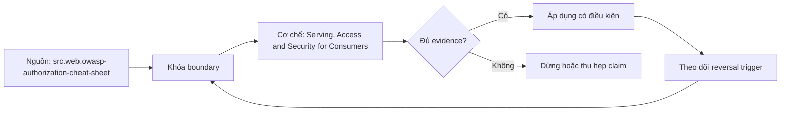

# Serving, Access and Security for Consumers

> [!abstract] Câu hỏi trung tâm
> Làm sao chứng minh BI, SQL và API cùng thi hành một access policy, đáp ứng workload contract và không biến dữ liệu thử nghiệm thành một bản sao nhạy cảm không kiểm soát?

## 1. Ba bề mặt, một policy intent

BI, direct SQL và API có identity propagation, query semantics, caching và export behavior khác nhau. Cấu hình có thể khác nhưng policy intent phải thống nhất: persona nào được xem product, rows, columns, metrics và operations nào trong context nào. Tạo policy matrix với subject class, resource, action, condition và expected decision; mỗi surface có adapter mapping về cùng stable rule ID. Nếu BI dùng extract, SQL dùng live warehouse còn API dùng cache, phép thử phải chạm cả ba execution path thay vì chỉ kiểm source table.

## 2. Deny by default và quyền theo vai

OWASP khuyến nghị least privilege, deny by default và kiểm authorization ở mọi request. Role/group entitlement nên có owner, business purpose, approver, review cadence và expiry cho quyền tạm. Cấp trực tiếp theo cá nhân tạo ngoại lệ khó rà nhưng RBAC quá rộng cũng không an toàn; attributes như region, purpose hoặc sensitivity có thể cần ABAC. Service accounts được quản trị như principals riêng, không mượn user role. Break-glass access cần timebox, audit và post-use review; việc đăng nhập thành công không chứng minh authorization đúng.

## 3. Negative tests và policy parity

Fixture có ít nhất hai tenants, public/sensitive columns, certified/restricted metrics và principals: allowed, denied, expired, service, privileged. Với mỗi rule chạy positive control và negative attempt ở BI, SQL, API; so decision code, visible row/field set, aggregation/inference behavior và audit event. Kết quả không nhất thiết giống error text, nhưng không surface nào được trả dữ liệu rộng hơn contract. Test owner/admin path riêng vì database owner, superuser hoặc bypass capability có thể không chịu row policy như ordinary principal.

## 4. Performance contract phải có workload

p95 không có nghĩa nếu thiếu query/task mix, arrival/concurrency model, dataset/cardinality, cache state, timeout, warm-up và observation window. k6 scenarios, metrics và thresholds minh họa cách mã hóa load shape cùng pass/fail criteria; BI interaction và warehouse SQL có thể cần harness khác nhưng vẫn dùng cùng principle. Đo latency, throughput/concurrency, error/timeout, queue/saturation, cost và result correctness. Cache làm p95 đẹp nhưng có thể trả stale hoặc cross-principal data; mỗi test cần semantic/security assertions, không chỉ response time.

## 5. Overload là một phần của interface

Hệ thống phải nêu behavior khi vượt capacity: queue có bound, reject/throttle với signal rõ, degrade feature có kiểm soát hoặc shed low-priority workload. Unlimited queue thường biến overload thành timeout dài và retry amplification. Fairness giữa BI refresh, analyst query và API caller cần quota/priorities; một tenant không được chiếm toàn concurrency. Thử ramp, steady và spike; ghi recovery sau khi load giảm. Success là giữ invariants và bounded failure, không phải ép mọi request thành công. Load test chỉ chạy trong environment có capacity và stop conditions được phép.

## 6. Masking không đồng nghĩa de-identification

Xóa tên/email nhưng giữ ZIP, timestamp, rare behavior hoặc stable pseudonym vẫn cho phép linkage. NIST SP 800-188 phân biệt nhiều sharing models và nhấn mạnh disclosure-risk governance; synthetic data hoặc controlled query/enclave có thể phù hợp hơn một masked copy. Non-production data policy phải lập inventory direct/quasi-identifiers, threat model, utility need, transformation, re-identification test, retention và egress restriction. Tokenization/pseudonymization hữu ích nhưng reversible mapping/key trở thành sensitive asset.

## 7. Audit, export và bằng chứng hoàn thành

Access log cần actor/service principal, purpose/context nếu có, resource/version, decision, query/API action, rows/bytes/export và timestamp; không ghi secrets hoặc raw sensitive predicates vô hạn. Log phải phân biệt denied attempt, empty authorized result và system error. Export từ BI hoặc SQL tạo bản sao ngoài policy boundary nên cần watermark/retention/DLP hoặc restricted path theo risk. Lab đạt khi negative matrix parity đúng ở ba surfaces, workload thresholds và overload behavior có raw evidence, non-production fixture qua de-identification review; chưa chạy thì chỉ là protocol.

## 8. Ma trận kiểm chứng từng mệnh đề

Mọi kết luận cần raw artifact, version và failure signal. Một dashboard xanh, sync completed, catalog label hoặc bảng cost có số không tự chứng minh correctness, security, value hay readiness.

### 8.1. policy intent dùng chung nhưng adapters theo từng surface

**Mệnh đề cần kiểm.** policy intent dùng chung nhưng adapters theo từng surface.

**Cách kiểm.** Dựng policy matrix và synthetic principals; chạy positive/negative cases ở BI, SQL và API. Chạy workload scenarios có p95/concurrency/overload thresholds, result/security assertions và de-identification risk review trên fixture non-production. Với mệnh đề này, ghi environment/product/policy version, input shape, expected observation, failure signal và boundary làm kết luận không còn đúng.

**Bằng chứng đạt cho `wiki.data-product.serving-access-security`.** Lưu contract/policy, fixture hoặc event extract, command/query, raw output, numerator-denominator hoặc cost reconciliation, reviewer và artifact hash. Nếu chưa chạy lab trên hệ được phép, chỉ ghi protocol; không biến expected result thành evidence.

### 8.2. BI extract có thể lệch live warehouse policy

**Mệnh đề cần kiểm.** BI extract có thể lệch live warehouse policy.

**Cách kiểm.** Dựng policy matrix và synthetic principals; chạy positive/negative cases ở BI, SQL và API. Chạy workload scenarios có p95/concurrency/overload thresholds, result/security assertions và de-identification risk review trên fixture non-production. Với mệnh đề này, ghi environment/product/policy version, input shape, expected observation, failure signal và boundary làm kết luận không còn đúng.

**Bằng chứng đạt cho `wiki.data-product.serving-access-security`.** Lưu contract/policy, fixture hoặc event extract, command/query, raw output, numerator-denominator hoặc cost reconciliation, reviewer và artifact hash. Nếu chưa chạy lab trên hệ được phép, chỉ ghi protocol; không biến expected result thành evidence.

### 8.3. deny by default cần explicit grants

**Mệnh đề cần kiểm.** deny by default cần explicit grants.

**Cách kiểm.** Dựng policy matrix và synthetic principals; chạy positive/negative cases ở BI, SQL và API. Chạy workload scenarios có p95/concurrency/overload thresholds, result/security assertions và de-identification risk review trên fixture non-production. Với mệnh đề này, ghi environment/product/policy version, input shape, expected observation, failure signal và boundary làm kết luận không còn đúng.

**Bằng chứng đạt cho `wiki.data-product.serving-access-security`.** Lưu contract/policy, fixture hoặc event extract, command/query, raw output, numerator-denominator hoặc cost reconciliation, reviewer và artifact hash. Nếu chưa chạy lab trên hệ được phép, chỉ ghi protocol; không biến expected result thành evidence.

### 8.4. RBAC quá rộng vẫn vi phạm least privilege

**Mệnh đề cần kiểm.** RBAC quá rộng vẫn vi phạm least privilege.

**Cách kiểm.** Dựng policy matrix và synthetic principals; chạy positive/negative cases ở BI, SQL và API. Chạy workload scenarios có p95/concurrency/overload thresholds, result/security assertions và de-identification risk review trên fixture non-production. Với mệnh đề này, ghi environment/product/policy version, input shape, expected observation, failure signal và boundary làm kết luận không còn đúng.

**Bằng chứng đạt cho `wiki.data-product.serving-access-security`.** Lưu contract/policy, fixture hoặc event extract, command/query, raw output, numerator-denominator hoặc cost reconciliation, reviewer và artifact hash. Nếu chưa chạy lab trên hệ được phép, chỉ ghi protocol; không biến expected result thành evidence.

### 8.5. temporary access cần expiry và review

**Mệnh đề cần kiểm.** temporary access cần expiry và review.

**Cách kiểm.** Dựng policy matrix và synthetic principals; chạy positive/negative cases ở BI, SQL và API. Chạy workload scenarios có p95/concurrency/overload thresholds, result/security assertions và de-identification risk review trên fixture non-production. Với mệnh đề này, ghi environment/product/policy version, input shape, expected observation, failure signal và boundary làm kết luận không còn đúng.

**Bằng chứng đạt cho `wiki.data-product.serving-access-security`.** Lưu contract/policy, fixture hoặc event extract, command/query, raw output, numerator-denominator hoặc cost reconciliation, reviewer và artifact hash. Nếu chưa chạy lab trên hệ được phép, chỉ ghi protocol; không biến expected result thành evidence.

### 8.6. service account là principal riêng

**Mệnh đề cần kiểm.** service account là principal riêng.

**Cách kiểm.** Dựng policy matrix và synthetic principals; chạy positive/negative cases ở BI, SQL và API. Chạy workload scenarios có p95/concurrency/overload thresholds, result/security assertions và de-identification risk review trên fixture non-production. Với mệnh đề này, ghi environment/product/policy version, input shape, expected observation, failure signal và boundary làm kết luận không còn đúng.

**Bằng chứng đạt cho `wiki.data-product.serving-access-security`.** Lưu contract/policy, fixture hoặc event extract, command/query, raw output, numerator-denominator hoặc cost reconciliation, reviewer và artifact hash. Nếu chưa chạy lab trên hệ được phép, chỉ ghi protocol; không biến expected result thành evidence.

### 8.7. negative tests chạy trên BI SQL và API

**Mệnh đề cần kiểm.** negative tests chạy trên BI SQL và API.

**Cách kiểm.** Dựng policy matrix và synthetic principals; chạy positive/negative cases ở BI, SQL và API. Chạy workload scenarios có p95/concurrency/overload thresholds, result/security assertions và de-identification risk review trên fixture non-production. Với mệnh đề này, ghi environment/product/policy version, input shape, expected observation, failure signal và boundary làm kết luận không còn đúng.

**Bằng chứng đạt cho `wiki.data-product.serving-access-security`.** Lưu contract/policy, fixture hoặc event extract, command/query, raw output, numerator-denominator hoặc cost reconciliation, reviewer và artifact hash. Nếu chưa chạy lab trên hệ được phép, chỉ ghi protocol; không biến expected result thành evidence.

### 8.8. admin path không đại diện ordinary principal

**Mệnh đề cần kiểm.** admin path không đại diện ordinary principal.

**Cách kiểm.** Dựng policy matrix và synthetic principals; chạy positive/negative cases ở BI, SQL và API. Chạy workload scenarios có p95/concurrency/overload thresholds, result/security assertions và de-identification risk review trên fixture non-production. Với mệnh đề này, ghi environment/product/policy version, input shape, expected observation, failure signal và boundary làm kết luận không còn đúng.

**Bằng chứng đạt cho `wiki.data-product.serving-access-security`.** Lưu contract/policy, fixture hoặc event extract, command/query, raw output, numerator-denominator hoặc cost reconciliation, reviewer và artifact hash. Nếu chưa chạy lab trên hệ được phép, chỉ ghi protocol; không biến expected result thành evidence.

### 8.9. p95 cần workload và observation window

**Mệnh đề cần kiểm.** p95 cần workload và observation window.

**Cách kiểm.** Dựng policy matrix và synthetic principals; chạy positive/negative cases ở BI, SQL và API. Chạy workload scenarios có p95/concurrency/overload thresholds, result/security assertions và de-identification risk review trên fixture non-production. Với mệnh đề này, ghi environment/product/policy version, input shape, expected observation, failure signal và boundary làm kết luận không còn đúng.

**Bằng chứng đạt cho `wiki.data-product.serving-access-security`.** Lưu contract/policy, fixture hoặc event extract, command/query, raw output, numerator-denominator hoặc cost reconciliation, reviewer và artifact hash. Nếu chưa chạy lab trên hệ được phép, chỉ ghi protocol; không biến expected result thành evidence.

### 8.10. cache test cần security context và freshness

**Mệnh đề cần kiểm.** cache test cần security context và freshness.

**Cách kiểm.** Dựng policy matrix và synthetic principals; chạy positive/negative cases ở BI, SQL và API. Chạy workload scenarios có p95/concurrency/overload thresholds, result/security assertions và de-identification risk review trên fixture non-production. Với mệnh đề này, ghi environment/product/policy version, input shape, expected observation, failure signal và boundary làm kết luận không còn đúng.

**Bằng chứng đạt cho `wiki.data-product.serving-access-security`.** Lưu contract/policy, fixture hoặc event extract, command/query, raw output, numerator-denominator hoặc cost reconciliation, reviewer và artifact hash. Nếu chưa chạy lab trên hệ được phép, chỉ ghi protocol; không biến expected result thành evidence.

### 8.11. overload cần bounded failure behavior

**Mệnh đề cần kiểm.** overload cần bounded failure behavior.

**Cách kiểm.** Dựng policy matrix và synthetic principals; chạy positive/negative cases ở BI, SQL và API. Chạy workload scenarios có p95/concurrency/overload thresholds, result/security assertions và de-identification risk review trên fixture non-production. Với mệnh đề này, ghi environment/product/policy version, input shape, expected observation, failure signal và boundary làm kết luận không còn đúng.

**Bằng chứng đạt cho `wiki.data-product.serving-access-security`.** Lưu contract/policy, fixture hoặc event extract, command/query, raw output, numerator-denominator hoặc cost reconciliation, reviewer và artifact hash. Nếu chưa chạy lab trên hệ được phép, chỉ ghi protocol; không biến expected result thành evidence.

### 8.12. unlimited queue có thể khuếch đại timeout

**Mệnh đề cần kiểm.** unlimited queue có thể khuếch đại timeout.

**Cách kiểm.** Dựng policy matrix và synthetic principals; chạy positive/negative cases ở BI, SQL và API. Chạy workload scenarios có p95/concurrency/overload thresholds, result/security assertions và de-identification risk review trên fixture non-production. Với mệnh đề này, ghi environment/product/policy version, input shape, expected observation, failure signal và boundary làm kết luận không còn đúng.

**Bằng chứng đạt cho `wiki.data-product.serving-access-security`.** Lưu contract/policy, fixture hoặc event extract, command/query, raw output, numerator-denominator hoặc cost reconciliation, reviewer và artifact hash. Nếu chưa chạy lab trên hệ được phép, chỉ ghi protocol; không biến expected result thành evidence.

### 8.13. mask direct identifier chưa đủ de-identification

**Mệnh đề cần kiểm.** mask direct identifier chưa đủ de-identification.

**Cách kiểm.** Dựng policy matrix và synthetic principals; chạy positive/negative cases ở BI, SQL và API. Chạy workload scenarios có p95/concurrency/overload thresholds, result/security assertions và de-identification risk review trên fixture non-production. Với mệnh đề này, ghi environment/product/policy version, input shape, expected observation, failure signal và boundary làm kết luận không còn đúng.

**Bằng chứng đạt cho `wiki.data-product.serving-access-security`.** Lưu contract/policy, fixture hoặc event extract, command/query, raw output, numerator-denominator hoặc cost reconciliation, reviewer và artifact hash. Nếu chưa chạy lab trên hệ được phép, chỉ ghi protocol; không biến expected result thành evidence.

### 8.14. quasi-identifiers tạo re-identification risk

**Mệnh đề cần kiểm.** quasi-identifiers tạo re-identification risk.

**Cách kiểm.** Dựng policy matrix và synthetic principals; chạy positive/negative cases ở BI, SQL và API. Chạy workload scenarios có p95/concurrency/overload thresholds, result/security assertions và de-identification risk review trên fixture non-production. Với mệnh đề này, ghi environment/product/policy version, input shape, expected observation, failure signal và boundary làm kết luận không còn đúng.

**Bằng chứng đạt cho `wiki.data-product.serving-access-security`.** Lưu contract/policy, fixture hoặc event extract, command/query, raw output, numerator-denominator hoặc cost reconciliation, reviewer và artifact hash. Nếu chưa chạy lab trên hệ được phép, chỉ ghi protocol; không biến expected result thành evidence.

### 8.15. export tạo policy boundary mới

**Mệnh đề cần kiểm.** export tạo policy boundary mới.

**Cách kiểm.** Dựng policy matrix và synthetic principals; chạy positive/negative cases ở BI, SQL và API. Chạy workload scenarios có p95/concurrency/overload thresholds, result/security assertions và de-identification risk review trên fixture non-production. Với mệnh đề này, ghi environment/product/policy version, input shape, expected observation, failure signal và boundary làm kết luận không còn đúng.

**Bằng chứng đạt cho `wiki.data-product.serving-access-security`.** Lưu contract/policy, fixture hoặc event extract, command/query, raw output, numerator-denominator hoặc cost reconciliation, reviewer và artifact hash. Nếu chưa chạy lab trên hệ được phép, chỉ ghi protocol; không biến expected result thành evidence.

## 9. Quy trình phản biện

1. Chốt product, consumer, decision, environment và criticality trước khi chọn metric hoặc control.
2. Tách tool capability, configured policy, observed behavior và business outcome.
3. Ghi stable IDs, versions, time window, denominator, allocation hoặc identity rules.
4. Kiểm negative/failure path, overload, retry, stale state, hidden consumer và changed constraint.
5. Phân loại source fact, curriculum synthesis, organizational policy và untested hypothesis.
6. Lưu uncertainty, unallocated/unknown set và stop condition; không ép bảng phải cho kết luận.
7. Chưa có execution evidence thì giữ trạng thái `review`.

## 10. Câu hỏi tự kiểm tra

1. Invariant hoặc decision nào đang được bảo vệ?
2. Chủ thể, resource, event hay cost unit được định danh bằng gì?
3. Denominator, time window và unknown/unallocated set là gì?
4. Failure nào vẫn cho tín hiệu xanh hoặc completed?
5. Thay đổi nào làm policy, metric, allocation hoặc state transition phải xem lại?
6. Ai có quyền duyệt, ai vận hành và bằng chứng nào còn chưa chạy?

## 11. Giới hạn và điều chưa cho phép kết luận

- Chưa chạy security/load test, adoption analysis, cost allocation, reverse-ETL fault injection hoặc lifecycle exercise; note mô tả protocol và expected evidence.
- Tài liệu web được kiểm ngày 2026-10-01; feature, pricing, law/guidance và vendor behavior có thể đổi.
- Metrics, cost categories, shadow-system constraints và six-state lifecycle là curriculum synthesis; không gán nguyên văn cho một nguồn.
- Guidance privacy không thay legal review; performance/security examples không thay threat model và production authorization.
- Note giữ trạng thái `review` cho tới khi chủ dự án duyệt semantic meaning.

## Reference
1. [[SRC-OWASP-AUTHORIZATION-CHEAT-SHEET]]
2. [[SRC-NIST-SP-800-188-DEIDENTIFICATION]]
3. [[SRC-GRAFANA-K6-PERFORMANCE-TESTING]]

## Source coverage

| Source slice | Nội dung sử dụng | Trạng thái |
|---|---|---|
| [[SRC-OWASP-AUTHORIZATION-CHEAT-SHEET]] | Khái niệm, mechanism hoặc governance boundary liên quan | Đã đọc locator trong source record; không suy ngoài phạm vi |
| [[SRC-NIST-SP-800-188-DEIDENTIFICATION]] | Khái niệm, mechanism hoặc governance boundary liên quan | Đã đọc locator trong source record; không suy ngoài phạm vi |
| [[SRC-GRAFANA-K6-PERFORMANCE-TESTING]] | Khái niệm, mechanism hoặc governance boundary liên quan | Đã đọc locator trong source record; không suy ngoài phạm vi |

## Key takeaways
- Policy parity cần negative evidence ở từng serving surface; performance và de-identification là hai gates riêng.
- Mọi phép đo hoặc gate cần stable version, owner, denominator/scope và failure evidence.
- Signal dễ lấy không được dùng thay decision outcome, correctness hoặc user safety.
- Unknown consumers, unallocated costs, rejected rows và expired evidence phải hiển thị, không mặc định bằng zero.
- Chưa chạy lab thì artifact là tài liệu học thuật đã kiểm cấu trúc, không phải chứng nhận production.

<!-- ATOMIC-EXECUTION-CAPSULE:START -->

## Execution capsule: kiểm chứng `wiki.data-product.serving-access-security`

> [!important] Phân loại mệnh đề
> Với `wiki.data-product.serving-access-security`, sơ đồ, ví dụ và artifact về **Serving, Access and Security for Consumers** là **synthesis để kiểm chứng**; chúng không phải trích dẫn hay case nguyên văn của nguồn.

### Sơ đồ cơ chế và điểm kiểm soát



Đọc sơ đồ `wiki.data-product.serving-access-security` từ trái sang phải: source chỉ cung cấp claim ban đầu cho **Serving, Access and Security for Consumers**; quyết định chỉ được đi tiếp sau khi boundary, evidence và điều kiện đảo quyết định đã hiện hữu.

### Ví dụ làm việc có thể bác bỏ

**Input.** Một đội cần trả lời: Làm sao chứng minh BI, SQL và API cùng thi hành một access policy, đáp ứng workload contract và không biến dữ liệu thử nghiệm thành một bản sao nhạy cảm không kiểm soát? cho một phạm vi nhỏ, có owner và deadline rõ.

**Decision.** Đội áp dụng **Serving, Access and Security for Consumers** trên control và variant chỉ khác một assumption; expected result và hard constraints được khóa trước khi chạy.

**Outcome.** Với `wiki.data-product.serving-access-security`, nếu observation vi phạm hard constraint hoặc oracle độc lập không xác nhận **Serving, Access and Security for Consumers**, đội thu hẹp claim hay đảo quyết định. Nếu đạt, kết luận vẫn kèm scope, version và review date; một lần thành công không được nâng thành quy luật phổ quát.

### Artifact thực thi tối thiểu

```sql
-- Verification harness for: Serving, Access and Security for Consumers
WITH evidence AS (
    SELECT 'wiki.data-product.serving-access-security' AS concept_id,
           'boundary_declared' AS check_name, 1 AS passed
    UNION ALL
    SELECT 'wiki.data-product.serving-access-security', 'independent_oracle', 1
    UNION ALL
    SELECT 'wiki.data-product.serving-access-security', 'reversal_trigger_recorded', 1
)
SELECT concept_id,
       MIN(passed) AS all_hard_checks_pass,
       COUNT(*) AS evidence_items
FROM evidence
GROUP BY concept_id
HAVING MIN(passed) = 1;
```

Artifact của `wiki.data-product.serving-access-security` buộc người dùng ghi boundary, oracle và reversal trigger cho **Serving, Access and Security for Consumers**. Các giá trị minh họa phải được thay bằng evidence thật trước khi dùng cho quyết định.

### Tự kiểm tra trước khi tái sử dụng

1. Bạn có thể trả lời `Làm sao chứng minh BI, SQL và API cùng thi hành một access policy, đáp ứng workload contract và không biến dữ liệu thử nghiệm thành một bản sao nhạy cảm không kiểm soát?` bằng một câu mà không kéo thêm concept thứ hai không?
2. Source locator nào đỡ cho claim, và phần nào chỉ là synthesis trong note?
3. Observation nào khiến bạn dừng, thu hẹp hoặc đảo quyết định?
4. Artifact nào cho phép một reviewer độc lập tái hiện kết quả?

<!-- ATOMIC-EXECUTION-CAPSULE:END -->
