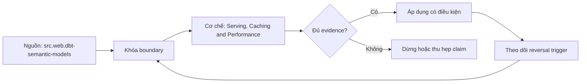

# Serving, Caching and Performance

> [!abstract] Câu hỏi trung tâm
> Làm sao phục vụ cùng semantic contract qua BI, SQL và API với latency/freshness/cost có số đo mà cache không vượt ranh giới quyền?

## 1. Ba đường phục vụ, một contract

BI integration, SQL/JDBC endpoint và API có transport, pagination, type conversion và retry behavior khác nhau. Parity test phải canonicalize cùng metric version, dimensions, filters, timezone, as-of và security principal rồi so schema/value/freshness. Cùng tên metric chưa đủ nếu một client gửi default filter hoặc timezone khác. Response nên mang request ID, semantic version, data cutoff và policy scope để consumer biết số thuộc snapshot nào.

## 2. Baseline trước tối ưu

Bộ 20 queries đại diện phải có frequency, weight và consumer owner; không chọn toàn queries dễ cache. Chạy cold và warm theo controlled cache state, ghi p50/p95/p99, warehouse/runtime, queue time, bytes/partitions scanned, cost/query, concurrency và error/timeout. Latency SLO có workload và measurement window; một lần chạy nhanh không chứng minh p95. Freshness SLO phải đo data cutoff/lag, không suy từ cache TTL.

## 3. Pre-aggregation và giới hạn đại số

Naive roll-up từ preaggregate an toàn nhất cho fully additive measures theo các dimensions/time đã hỗ trợ. Semi-additive và non-additive metrics có thể tăng tốc nếu lưu đúng mergeable state/components và engine có operator contract, nhưng không được SUM balance, average averages hoặc merge exact distinct counts tùy ý. Chọn grain là trade-off giữa hit coverage, storage/build cost và freshness. Mỗi preaggregate có compatibility matrix và parity tests với base plan.

## 4. Hai kiểu cache và invalidation

Result cache của warehouse tái dùng cùng SQL theo quy tắc platform. Declarative cache materialize saved query/export và được refresh/invalidate theo upstream metadata/schedule. Key logic cần canonical request, semantic definition version, source/data snapshot, filters, grains, timezone và authorization/security context. TTL chỉ giới hạn tuổi; definition change, policy change hoặc revoked access cần event/version invalidation. Stampede control và single-flight tránh nhiều misses cùng rebuild.

## 5. Ranh giới bảo mật của cache

Tài liệu dbt hiện hành cảnh báo cached tables tách khỏi underlying models và security context không áp tại query time cho dữ liệu lấy từ cache. Vì vậy không giả định product cache tự cách ly. Cache entry phải partition theo effective authorization context/policy version hoặc chỉ chứa dataset đã được bảo vệ ở storage với least-privilege credential. Negative test dùng hai principals có cùng query text nhưng khác scope; kiểm key, physical access và returned rows, không chỉ object identity.

## 6. Concurrency, admission và degradation

Rate limit, per-tenant quotas, bounded queue, timeout/cancellation và workload classes bảo vệ warehouse. Admission dựa cost estimate tốt hơn chỉ đếm requests vì một query wide-time-range khác query point lookup. Theo dõi active/queued, saturation, spill, retries và rejected requests. Degradation phải explicit: stale-within-SLO, narrowed range hoặc asynchronous job; không âm thầm trả partial/stale data như current truth.

## 7. Nghiệm thu trước-sau

Chạy cùng 20-query suite, same warehouse size, seed, semantic version và concurrency profile. Báo cáo từng query cùng aggregate p95, hit rate, concurrency và cost/query; tách cold/warm. Hai consumer paths phải cùng values và cutoff. Definition version bump phải miss/invalidate old entry. Hai principals khác quyền không share effective result. Performance pass chỉ khi latency đạt threshold, freshness đạt SLO và semantic parity giữ nguyên.

## 8. Ma trận kiểm chứng từng mệnh đề

Mọi mệnh đề dưới đây cần fixture, invariant, independent oracle và output lưu được. Compile thành công hoặc con số nhìn hợp lý không đủ làm bằng chứng.

### 8.1. consumer parity cần cùng canonical request

**Mệnh đề cần kiểm.** consumer parity cần cùng canonical request.

**Cách kiểm.** Chạy controlled 20-query suite cold/warm và concurrent qua two consumer paths. So p95/freshness/cost/parity, version invalidation và two-principal cache isolation trên cùng semantic/data snapshots. Với mệnh đề này, ghi data shape gây lỗi, expected result và failure signal. Không dùng generated query làm oracle cho chính nó.

**Bằng chứng đạt cho `wiki.semantic-layer.serving-caching-performance`.** Lưu contract/graph/config version, seed snapshot, command/SQL, raw output, row/multiplicity ledger và semantic diff. Nếu chưa chạy tool/lab, trạng thái chỉ là test protocol.

### 8.2. response cần semantic version và cutoff

**Mệnh đề cần kiểm.** response cần semantic version và cutoff.

**Cách kiểm.** Chạy controlled 20-query suite cold/warm và concurrent qua two consumer paths. So p95/freshness/cost/parity, version invalidation và two-principal cache isolation trên cùng semantic/data snapshots. Với mệnh đề này, ghi data shape gây lỗi, expected result và failure signal. Không dùng generated query làm oracle cho chính nó.

**Bằng chứng đạt cho `wiki.semantic-layer.serving-caching-performance`.** Lưu contract/graph/config version, seed snapshot, command/SQL, raw output, row/multiplicity ledger và semantic diff. Nếu chưa chạy tool/lab, trạng thái chỉ là test protocol.

### 8.3. p95 cần workload window không phải một sample

**Mệnh đề cần kiểm.** p95 cần workload window không phải một sample.

**Cách kiểm.** Chạy controlled 20-query suite cold/warm và concurrent qua two consumer paths. So p95/freshness/cost/parity, version invalidation và two-principal cache isolation trên cùng semantic/data snapshots. Với mệnh đề này, ghi data shape gây lỗi, expected result và failure signal. Không dùng generated query làm oracle cho chính nó.

**Bằng chứng đạt cho `wiki.semantic-layer.serving-caching-performance`.** Lưu contract/graph/config version, seed snapshot, command/SQL, raw output, row/multiplicity ledger và semantic diff. Nếu chưa chạy tool/lab, trạng thái chỉ là test protocol.

### 8.4. freshness khác TTL

**Mệnh đề cần kiểm.** freshness khác TTL.

**Cách kiểm.** Chạy controlled 20-query suite cold/warm và concurrent qua two consumer paths. So p95/freshness/cost/parity, version invalidation và two-principal cache isolation trên cùng semantic/data snapshots. Với mệnh đề này, ghi data shape gây lỗi, expected result và failure signal. Không dùng generated query làm oracle cho chính nó.

**Bằng chứng đạt cho `wiki.semantic-layer.serving-caching-performance`.** Lưu contract/graph/config version, seed snapshot, command/SQL, raw output, row/multiplicity ledger và semantic diff. Nếu chưa chạy tool/lab, trạng thái chỉ là test protocol.

### 8.5. preaggregate cần compatibility matrix

**Mệnh đề cần kiểm.** preaggregate cần compatibility matrix.

**Cách kiểm.** Chạy controlled 20-query suite cold/warm và concurrent qua two consumer paths. So p95/freshness/cost/parity, version invalidation và two-principal cache isolation trên cùng semantic/data snapshots. Với mệnh đề này, ghi data shape gây lỗi, expected result và failure signal. Không dùng generated query làm oracle cho chính nó.

**Bằng chứng đạt cho `wiki.semantic-layer.serving-caching-performance`.** Lưu contract/graph/config version, seed snapshot, command/SQL, raw output, row/multiplicity ledger và semantic diff. Nếu chưa chạy tool/lab, trạng thái chỉ là test protocol.

### 8.6. fully additive cho phép naive rollup

**Mệnh đề cần kiểm.** fully additive cho phép naive rollup.

**Cách kiểm.** Chạy controlled 20-query suite cold/warm và concurrent qua two consumer paths. So p95/freshness/cost/parity, version invalidation và two-principal cache isolation trên cùng semantic/data snapshots. Với mệnh đề này, ghi data shape gây lỗi, expected result và failure signal. Không dùng generated query làm oracle cho chính nó.

**Bằng chứng đạt cho `wiki.semantic-layer.serving-caching-performance`.** Lưu contract/graph/config version, seed snapshot, command/SQL, raw output, row/multiplicity ledger và semantic diff. Nếu chưa chạy tool/lab, trạng thái chỉ là test protocol.

### 8.7. nonadditive cần mergeable state/operator

**Mệnh đề cần kiểm.** nonadditive cần mergeable state/operator.

**Cách kiểm.** Chạy controlled 20-query suite cold/warm và concurrent qua two consumer paths. So p95/freshness/cost/parity, version invalidation và two-principal cache isolation trên cùng semantic/data snapshots. Với mệnh đề này, ghi data shape gây lỗi, expected result và failure signal. Không dùng generated query làm oracle cho chính nó.

**Bằng chứng đạt cho `wiki.semantic-layer.serving-caching-performance`.** Lưu contract/graph/config version, seed snapshot, command/SQL, raw output, row/multiplicity ledger và semantic diff. Nếu chưa chạy tool/lab, trạng thái chỉ là test protocol.

### 8.8. warehouse result cache khác declarative cache

**Mệnh đề cần kiểm.** warehouse result cache khác declarative cache.

**Cách kiểm.** Chạy controlled 20-query suite cold/warm và concurrent qua two consumer paths. So p95/freshness/cost/parity, version invalidation và two-principal cache isolation trên cùng semantic/data snapshots. Với mệnh đề này, ghi data shape gây lỗi, expected result và failure signal. Không dùng generated query làm oracle cho chính nó.

**Bằng chứng đạt cho `wiki.semantic-layer.serving-caching-performance`.** Lưu contract/graph/config version, seed snapshot, command/SQL, raw output, row/multiplicity ledger và semantic diff. Nếu chưa chạy tool/lab, trạng thái chỉ là test protocol.

### 8.9. cache key cần semantic version

**Mệnh đề cần kiểm.** cache key cần semantic version.

**Cách kiểm.** Chạy controlled 20-query suite cold/warm và concurrent qua two consumer paths. So p95/freshness/cost/parity, version invalidation và two-principal cache isolation trên cùng semantic/data snapshots. Với mệnh đề này, ghi data shape gây lỗi, expected result và failure signal. Không dùng generated query làm oracle cho chính nó.

**Bằng chứng đạt cho `wiki.semantic-layer.serving-caching-performance`.** Lưu contract/graph/config version, seed snapshot, command/SQL, raw output, row/multiplicity ledger và semantic diff. Nếu chưa chạy tool/lab, trạng thái chỉ là test protocol.

### 8.10. cache key cần authorization context

**Mệnh đề cần kiểm.** cache key cần authorization context.

**Cách kiểm.** Chạy controlled 20-query suite cold/warm và concurrent qua two consumer paths. So p95/freshness/cost/parity, version invalidation và two-principal cache isolation trên cùng semantic/data snapshots. Với mệnh đề này, ghi data shape gây lỗi, expected result và failure signal. Không dùng generated query làm oracle cho chính nó.

**Bằng chứng đạt cho `wiki.semantic-layer.serving-caching-performance`.** Lưu contract/graph/config version, seed snapshot, command/SQL, raw output, row/multiplicity ledger và semantic diff. Nếu chưa chạy tool/lab, trạng thái chỉ là test protocol.

### 8.11. policy revocation cần invalidation

**Mệnh đề cần kiểm.** policy revocation cần invalidation.

**Cách kiểm.** Chạy controlled 20-query suite cold/warm và concurrent qua two consumer paths. So p95/freshness/cost/parity, version invalidation và two-principal cache isolation trên cùng semantic/data snapshots. Với mệnh đề này, ghi data shape gây lỗi, expected result và failure signal. Không dùng generated query làm oracle cho chính nó.

**Bằng chứng đạt cho `wiki.semantic-layer.serving-caching-performance`.** Lưu contract/graph/config version, seed snapshot, command/SQL, raw output, row/multiplicity ledger và semantic diff. Nếu chưa chạy tool/lab, trạng thái chỉ là test protocol.

### 8.12. dbt cached table không áp security context query time

**Mệnh đề cần kiểm.** dbt cached table không áp security context query time.

**Cách kiểm.** Chạy controlled 20-query suite cold/warm và concurrent qua two consumer paths. So p95/freshness/cost/parity, version invalidation và two-principal cache isolation trên cùng semantic/data snapshots. Với mệnh đề này, ghi data shape gây lỗi, expected result và failure signal. Không dùng generated query làm oracle cho chính nó.

**Bằng chứng đạt cho `wiki.semantic-layer.serving-caching-performance`.** Lưu contract/graph/config version, seed snapshot, command/SQL, raw output, row/multiplicity ledger và semantic diff. Nếu chưa chạy tool/lab, trạng thái chỉ là test protocol.

### 8.13. rate limit nên xét query cost

**Mệnh đề cần kiểm.** rate limit nên xét query cost.

**Cách kiểm.** Chạy controlled 20-query suite cold/warm và concurrent qua two consumer paths. So p95/freshness/cost/parity, version invalidation và two-principal cache isolation trên cùng semantic/data snapshots. Với mệnh đề này, ghi data shape gây lỗi, expected result và failure signal. Không dùng generated query làm oracle cho chính nó.

**Bằng chứng đạt cho `wiki.semantic-layer.serving-caching-performance`.** Lưu contract/graph/config version, seed snapshot, command/SQL, raw output, row/multiplicity ledger và semantic diff. Nếu chưa chạy tool/lab, trạng thái chỉ là test protocol.

### 8.14. degradation phải explicit

**Mệnh đề cần kiểm.** degradation phải explicit.

**Cách kiểm.** Chạy controlled 20-query suite cold/warm và concurrent qua two consumer paths. So p95/freshness/cost/parity, version invalidation và two-principal cache isolation trên cùng semantic/data snapshots. Với mệnh đề này, ghi data shape gây lỗi, expected result và failure signal. Không dùng generated query làm oracle cho chính nó.

**Bằng chứng đạt cho `wiki.semantic-layer.serving-caching-performance`.** Lưu contract/graph/config version, seed snapshot, command/SQL, raw output, row/multiplicity ledger và semantic diff. Nếu chưa chạy tool/lab, trạng thái chỉ là test protocol.

### 8.15. before-after phải khóa warehouse/cache conditions

**Mệnh đề cần kiểm.** before-after phải khóa warehouse/cache conditions.

**Cách kiểm.** Chạy controlled 20-query suite cold/warm và concurrent qua two consumer paths. So p95/freshness/cost/parity, version invalidation và two-principal cache isolation trên cùng semantic/data snapshots. Với mệnh đề này, ghi data shape gây lỗi, expected result và failure signal. Không dùng generated query làm oracle cho chính nó.

**Bằng chứng đạt cho `wiki.semantic-layer.serving-caching-performance`.** Lưu contract/graph/config version, seed snapshot, command/SQL, raw output, row/multiplicity ledger và semantic diff. Nếu chưa chạy tool/lab, trạng thái chỉ là test protocol.

## 9. Quy trình phản biện

1. Viết population, grain, identities, time và aggregation trước tool syntax.
2. Gắn metric/dimension với qualified entity role và allowed path.
3. Đếm rows, distinct base keys, unmatched và match multiplicity sau từng join edge.
4. Dùng independent oracle từ atomic facts; so intermediate components trước final value.
5. Chạy invalid cases cùng valid siblings để bắt underblocking và overblocking.
6. Khóa exact tool/config/mart versions; compile output và diagnostics là version-specific evidence.
7. Lưu failed runs, limitations và trigger làm certification hết hiệu lực.

## 10. Câu hỏi tự kiểm tra

1. Join path nào được chọn và business role nào biện minh cho nó?
2. Base fact keys có bị nhân hoặc mất sau từng edge không?
3. Dimension có reachable, đúng grain và compatible với aggregation không?
4. Parse/validate/compile/reconciliation xác nhận những lớp khác nhau nào?
5. Generated SQL khác contract ở population, filter, path hay aggregation nào?
6. Bằng chứng nào độc lập với engine output đang được kiểm?

## 11. Giới hạn và điều chưa cho phép kết luận

- Chưa chạy MetricFlow, warehouse queries, execution plans hoặc labs; note mô tả protocol và expected evidence.
- dbt/MetricFlow docs được kiểm ngày 2026-10-01; commands và YAML phụ thuộc engine/version/environment.
- Thuật ngữ fan/chasm có thể khác giữa sản phẩm; invariant của bài là grain, multiplicity, population và semantic path.
- Kimball-Ross và PostgreSQL hỗ trợ modeling/SQL mechanics; compatibility/certification workflow là curriculum synthesis.
- Owner chưa phê duyệt semantic meaning nên note giữ trạng thái `review`.

## Reference
1. [[SRC-DBT-SEMANTIC-MODELS]]
2. [[SRC-REIS-HOUSLEY-FUNDAMENTALS-DATA-ENGINEERING]]
3. [[SRC-KIMBALL-ROSS-DW-TOOLKIT-3E]]

## Source coverage

| Source slice | Nội dung sử dụng | Trạng thái |
|---|---|---|
| [[SRC-DBT-SEMANTIC-MODELS]] | Modeling, SQL behavior hoặc current product semantics liên quan | Đã đọc phạm vi có locator; không suy ngoài phạm vi |
| [[SRC-REIS-HOUSLEY-FUNDAMENTALS-DATA-ENGINEERING]] | Modeling, SQL behavior hoặc current product semantics liên quan | Đã đọc phạm vi có locator; không suy ngoài phạm vi |
| [[SRC-KIMBALL-ROSS-DW-TOOLKIT-3E]] | Modeling, SQL behavior hoặc current product semantics liên quan | Đã đọc phạm vi có locator; không suy ngoài phạm vi |

## Key takeaways
- Join correctness phải được chứng minh bằng grain, multiplicity, unmatched ledger và independent oracle.
- Metric-dimension compatibility là rule ba trạng thái có lý do, không phải danh sách field tùy ý.
- Parse/validate/compile không thay reconciliation với business contract.
- Generated SQL phải được đọc theo population, path, aggregation và time/filter semantics.
- Chưa chạy protocol thì note là tài liệu học thuật có truy nguồn, không phải chứng nhận production.

<!-- ATOMIC-EXECUTION-CAPSULE:START -->

## Execution capsule: kiểm chứng `wiki.semantic-layer.serving-caching-performance`

> [!important] Phân loại mệnh đề
> Với `wiki.semantic-layer.serving-caching-performance`, sơ đồ, ví dụ và artifact về **Serving, Caching and Performance** là **synthesis để kiểm chứng**; chúng không phải trích dẫn hay case nguyên văn của nguồn.

### Sơ đồ cơ chế và điểm kiểm soát



Đọc sơ đồ `wiki.semantic-layer.serving-caching-performance` từ trái sang phải: source chỉ cung cấp claim ban đầu cho **Serving, Caching and Performance**; quyết định chỉ được đi tiếp sau khi boundary, evidence và điều kiện đảo quyết định đã hiện hữu.

### Ví dụ làm việc có thể bác bỏ

**Input.** Một đội cần trả lời: Làm sao phục vụ cùng semantic contract qua BI, SQL và API với latency/freshness/cost có số đo mà cache không vượt ranh giới quyền? cho một phạm vi nhỏ, có owner và deadline rõ.

**Decision.** Đội áp dụng **Serving, Caching and Performance** trên control và variant chỉ khác một assumption; expected result và hard constraints được khóa trước khi chạy.

**Outcome.** Với `wiki.semantic-layer.serving-caching-performance`, nếu observation vi phạm hard constraint hoặc oracle độc lập không xác nhận **Serving, Caching and Performance**, đội thu hẹp claim hay đảo quyết định. Nếu đạt, kết luận vẫn kèm scope, version và review date; một lần thành công không được nâng thành quy luật phổ quát.

### Artifact thực thi tối thiểu

```sql
-- Verification harness for: Serving, Caching and Performance
WITH evidence AS (
    SELECT 'wiki.semantic-layer.serving-caching-performance' AS concept_id,
           'boundary_declared' AS check_name, 1 AS passed
    UNION ALL
    SELECT 'wiki.semantic-layer.serving-caching-performance', 'independent_oracle', 1
    UNION ALL
    SELECT 'wiki.semantic-layer.serving-caching-performance', 'reversal_trigger_recorded', 1
)
SELECT concept_id,
       MIN(passed) AS all_hard_checks_pass,
       COUNT(*) AS evidence_items
FROM evidence
GROUP BY concept_id
HAVING MIN(passed) = 1;
```

Artifact của `wiki.semantic-layer.serving-caching-performance` buộc người dùng ghi boundary, oracle và reversal trigger cho **Serving, Caching and Performance**. Các giá trị minh họa phải được thay bằng evidence thật trước khi dùng cho quyết định.

### Tự kiểm tra trước khi tái sử dụng

1. Bạn có thể trả lời `Làm sao phục vụ cùng semantic contract qua BI, SQL và API với latency/freshness/cost có số đo mà cache không vượt ranh giới quyền?` bằng một câu mà không kéo thêm concept thứ hai không?
2. Source locator nào đỡ cho claim, và phần nào chỉ là synthesis trong note?
3. Observation nào khiến bạn dừng, thu hẹp hoặc đảo quyết định?
4. Artifact nào cho phép một reviewer độc lập tái hiện kết quả?

<!-- ATOMIC-EXECUTION-CAPSULE:END -->
