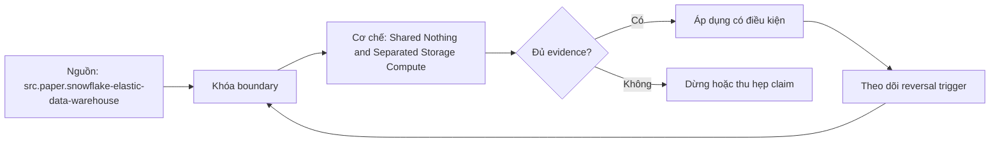

# Shared Nothing and Separated Storage Compute

> [!abstract] Câu hỏi trung tâm
> So sánh shared-nothing với separated storage/compute bằng failure, scaling, cache và metadata boundaries nào để tránh benchmark nóng-lạnh sai?

## 1. Shared-nothing contract

Mỗi node sở hữu compute, memory và local data partitions; parallel scan tận dụng locality, distributed join dựa distribution contract. Scale/membership change có thể yêu cầu redistribute/rebalance persistent data, nhưng mức độ và online behavior phụ thuộc engine: replication, elastic resize, remote tier hay managed automation có thể thay đổi. Không đồng nhất mọi MPP provisioned system với pure shared-nothing. Đánh giá bằng locality hit, redistribution bytes/time, degraded capacity, recovery semantics và operational procedure.

## 2. Separated storage and compute

Persistent table data nằm ở shared durable storage; ephemeral/elastic compute đọc ranges và giữ local caches/temp. Compute groups có thể scale và isolate independently trong giới hạn service. Câu 'mọi lần đọc qua network' quá thô: cache hit đọc local, metadata/result cache có thể tránh data scan, còn cache miss đọc remote. Network vẫn là boundary chính để populate cache. Ghi source bytes, local cache bytes/hit, remote requests, temp spill và result reuse; không suy cache state từ runtime một mình.

## 3. Ba lớp cache

Result cache trả prior result khi text, data freshness, role/session và engine rules phù hợp; data cache giữ table files/columns/blocks; metadata/plan cache giữ catalog/statistics/compiled state. Chúng có invalidation và scope khác nhau. Result-cache hit không đo engine execution. Data-cache warm không bảo đảm metadata warm hoặc warehouse process đã khởi động. Benchmark cần disable/bypass result cache khi có thể, log hit flag, và định nghĩa cold/warm riêng cho từng layer.

## 4. Cold không có một nghĩa duy nhất

Cold warehouse có thể gồm compute resume/provision, empty local cache, cold object/CDN path, cold metadata/JIT và DNS/TLS setup. Người dùng thường chỉ kiểm một phần. Không được tuyên bố globally cold nếu service không cung cấp eviction/isolated fresh warehouse. Dùng operational definitions: fresh compute identifier, no result-cache hit, first access to immutable snapshot, measured remote bytes. Warm series chạy same snapshot/query family trên same warehouse sau priming. Báo unknown layers thay vì giả vờ kiểm soát.

## 5. Isolation và shared control plane

Tách compute groups giảm competition CPU/memory/cache giữa workloads, nhưng storage service, catalog, metadata, transaction manager, identity, quota và network có thể vẫn shared. Vì vậy isolation không tuyệt đối. Test cross-workload interference ở compute, remote storage throughput và metadata latency. Một warehouse riêng có thể làm cache duplication và cost tăng. Shared-nothing cũng có WLM queues và resource groups; architecture không tự quyết toàn bộ isolation policy.

## 6. Scaling và data movement

Pure shared-nothing scale-out cần rebalance persistent partitions hoặc chỉ dùng capacity mới cho future data/replicas tùy product. Shared-data scale-out tránh base-data rebalance nhưng phải provision workers, schedule splits và warm local cache; resize có thể giảm cache affinity. Scale-in cần drain/cancel semantics và temp state handling. So time-to-capacity, bytes moved/read, cache recovery, availability và cost during transition. Không chỉ đo steady-state query.

## 7. Metadata là data path

Catalog maps snapshots/tables to files, statistics, permissions, transactions và pruning. Shared-data compute phụ thuộc control/metadata services để lập kế hoạch; shared-nothing cũng cần catalogs/coordinators. Bottleneck có thể xuất hiện ở listing, manifest, planning, locks hoặc service quotas trước scan. Capture planning/queue separately from execution, catalog request count/latency nếu có. Cache metadata có consistency contract; stale cache không được dùng để đổi correctness lấy speed.

## 8. Phép đo công bằng

Chọn immutable snapshot và query suite, khóa engine/version/region/worker shape/concurrency. Tạo four cells: cold-result/cold-data theo operational definition, result-cache disabled; warm-data; explicit result-cache case; resize/resume case. Interleave trials để tránh diurnal drift, log provisioning separately, verify result hash. Với shared-nothing, thêm after-rebalance state. Với shared-data, ghi remote/local bytes. Kết luận cần distributions, cost và reversal conditions; một cold run với một warm run không hợp lệ.

## 9. Ma trận kiểm chứng từng mệnh đề

Mỗi mệnh đề về latency, scaling, cache, concurrency hoặc cost cần counterfactual, correctness oracle và counter ở đúng boundary. Tên kiến trúc, plan label, elapsed time hoặc rate card riêng lẻ chưa đủ để quy nguyên nhân.

### 9.1. pure shared nothing gắn persistent partitions với nodes

**Mệnh đề cần kiểm.** pure shared nothing gắn persistent partitions với nodes.

**Cách kiểm.** Định nghĩa result/data/metadata cache states; chạy interleaved cold/warm/result-cache/resize cells, lưu remote/local bytes, provisioning, planning và output hash. Ghi engine/version, workload shape, controlled variables, expected counter, failure signal và reversal condition.

**Bằng chứng đạt cho `wiki.olap.shared-nothing-separated-storage-compute`.** Lưu source/query/config hashes, plans/profiles, raw counters, result oracle, repetitions, units và reviewer. Khi lab chưa chạy, chỉ giữ protocol và expected observations; không viết chúng như kết quả thực nghiệm.

### 9.2. managed variants có thể không cần full eager rebalance

**Mệnh đề cần kiểm.** managed variants có thể không cần full eager rebalance.

**Cách kiểm.** Định nghĩa result/data/metadata cache states; chạy interleaved cold/warm/result-cache/resize cells, lưu remote/local bytes, provisioning, planning và output hash. Ghi engine/version, workload shape, controlled variables, expected counter, failure signal và reversal condition.

**Bằng chứng đạt cho `wiki.olap.shared-nothing-separated-storage-compute`.** Lưu source/query/config hashes, plans/profiles, raw counters, result oracle, repetitions, units và reviewer. Khi lab chưa chạy, chỉ giữ protocol và expected observations; không viết chúng như kết quả thực nghiệm.

### 9.3. shared data không có nghĩa mọi read luôn từ remote storage

**Mệnh đề cần kiểm.** shared data không có nghĩa mọi read luôn từ remote storage.

**Cách kiểm.** Định nghĩa result/data/metadata cache states; chạy interleaved cold/warm/result-cache/resize cells, lưu remote/local bytes, provisioning, planning và output hash. Ghi engine/version, workload shape, controlled variables, expected counter, failure signal và reversal condition.

**Bằng chứng đạt cho `wiki.olap.shared-nothing-separated-storage-compute`.** Lưu source/query/config hashes, plans/profiles, raw counters, result oracle, repetitions, units và reviewer. Khi lab chưa chạy, chỉ giữ protocol và expected observations; không viết chúng như kết quả thực nghiệm.

### 9.4. result data metadata và plan caches phải tách

**Mệnh đề cần kiểm.** result data metadata và plan caches phải tách.

**Cách kiểm.** Định nghĩa result/data/metadata cache states; chạy interleaved cold/warm/result-cache/resize cells, lưu remote/local bytes, provisioning, planning và output hash. Ghi engine/version, workload shape, controlled variables, expected counter, failure signal và reversal condition.

**Bằng chứng đạt cho `wiki.olap.shared-nothing-separated-storage-compute`.** Lưu source/query/config hashes, plans/profiles, raw counters, result oracle, repetitions, units và reviewer. Khi lab chưa chạy, chỉ giữ protocol và expected observations; không viết chúng như kết quả thực nghiệm.

### 9.5. result cache hit không đo query execution

**Mệnh đề cần kiểm.** result cache hit không đo query execution.

**Cách kiểm.** Định nghĩa result/data/metadata cache states; chạy interleaved cold/warm/result-cache/resize cells, lưu remote/local bytes, provisioning, planning và output hash. Ghi engine/version, workload shape, controlled variables, expected counter, failure signal và reversal condition.

**Bằng chứng đạt cho `wiki.olap.shared-nothing-separated-storage-compute`.** Lưu source/query/config hashes, plans/profiles, raw counters, result oracle, repetitions, units và reviewer. Khi lab chưa chạy, chỉ giữ protocol và expected observations; không viết chúng như kết quả thực nghiệm.

### 9.6. cold cache cần operational definition

**Mệnh đề cần kiểm.** cold cache cần operational definition.

**Cách kiểm.** Định nghĩa result/data/metadata cache states; chạy interleaved cold/warm/result-cache/resize cells, lưu remote/local bytes, provisioning, planning và output hash. Ghi engine/version, workload shape, controlled variables, expected counter, failure signal và reversal condition.

**Bằng chứng đạt cho `wiki.olap.shared-nothing-separated-storage-compute`.** Lưu source/query/config hashes, plans/profiles, raw counters, result oracle, repetitions, units và reviewer. Khi lab chưa chạy, chỉ giữ protocol và expected observations; không viết chúng như kết quả thực nghiệm.

### 9.7. không có eviction authority thì không tuyên bố globally cold

**Mệnh đề cần kiểm.** không có eviction authority thì không tuyên bố globally cold.

**Cách kiểm.** Định nghĩa result/data/metadata cache states; chạy interleaved cold/warm/result-cache/resize cells, lưu remote/local bytes, provisioning, planning và output hash. Ghi engine/version, workload shape, controlled variables, expected counter, failure signal và reversal condition.

**Bằng chứng đạt cho `wiki.olap.shared-nothing-separated-storage-compute`.** Lưu source/query/config hashes, plans/profiles, raw counters, result oracle, repetitions, units và reviewer. Khi lab chưa chạy, chỉ giữ protocol và expected observations; không viết chúng như kết quả thực nghiệm.

### 9.8. fresh compute có thể thêm provisioning latency

**Mệnh đề cần kiểm.** fresh compute có thể thêm provisioning latency.

**Cách kiểm.** Định nghĩa result/data/metadata cache states; chạy interleaved cold/warm/result-cache/resize cells, lưu remote/local bytes, provisioning, planning và output hash. Ghi engine/version, workload shape, controlled variables, expected counter, failure signal và reversal condition.

**Bằng chứng đạt cho `wiki.olap.shared-nothing-separated-storage-compute`.** Lưu source/query/config hashes, plans/profiles, raw counters, result oracle, repetitions, units và reviewer. Khi lab chưa chạy, chỉ giữ protocol và expected observations; không viết chúng như kết quả thực nghiệm.

### 9.9. warm cache phải giữ same snapshot và warehouse identity

**Mệnh đề cần kiểm.** warm cache phải giữ same snapshot và warehouse identity.

**Cách kiểm.** Định nghĩa result/data/metadata cache states; chạy interleaved cold/warm/result-cache/resize cells, lưu remote/local bytes, provisioning, planning và output hash. Ghi engine/version, workload shape, controlled variables, expected counter, failure signal và reversal condition.

**Bằng chứng đạt cho `wiki.olap.shared-nothing-separated-storage-compute`.** Lưu source/query/config hashes, plans/profiles, raw counters, result oracle, repetitions, units và reviewer. Khi lab chưa chạy, chỉ giữ protocol và expected observations; không viết chúng như kết quả thực nghiệm.

### 9.10. compute isolation không tách shared metadata storage và quotas

**Mệnh đề cần kiểm.** compute isolation không tách shared metadata storage và quotas.

**Cách kiểm.** Định nghĩa result/data/metadata cache states; chạy interleaved cold/warm/result-cache/resize cells, lưu remote/local bytes, provisioning, planning và output hash. Ghi engine/version, workload shape, controlled variables, expected counter, failure signal và reversal condition.

**Bằng chứng đạt cho `wiki.olap.shared-nothing-separated-storage-compute`.** Lưu source/query/config hashes, plans/profiles, raw counters, result oracle, repetitions, units và reviewer. Khi lab chưa chạy, chỉ giữ protocol và expected observations; không viết chúng như kết quả thực nghiệm.

### 9.11. separate warehouses có cache duplication cost

**Mệnh đề cần kiểm.** separate warehouses có cache duplication cost.

**Cách kiểm.** Định nghĩa result/data/metadata cache states; chạy interleaved cold/warm/result-cache/resize cells, lưu remote/local bytes, provisioning, planning và output hash. Ghi engine/version, workload shape, controlled variables, expected counter, failure signal và reversal condition.

**Bằng chứng đạt cho `wiki.olap.shared-nothing-separated-storage-compute`.** Lưu source/query/config hashes, plans/profiles, raw counters, result oracle, repetitions, units và reviewer. Khi lab chưa chạy, chỉ giữ protocol và expected observations; không viết chúng như kết quả thực nghiệm.

### 9.12. scale out shared data vẫn có provisioning và cache warmup

**Mệnh đề cần kiểm.** scale out shared data vẫn có provisioning và cache warmup.

**Cách kiểm.** Định nghĩa result/data/metadata cache states; chạy interleaved cold/warm/result-cache/resize cells, lưu remote/local bytes, provisioning, planning và output hash. Ghi engine/version, workload shape, controlled variables, expected counter, failure signal và reversal condition.

**Bằng chứng đạt cho `wiki.olap.shared-nothing-separated-storage-compute`.** Lưu source/query/config hashes, plans/profiles, raw counters, result oracle, repetitions, units và reviewer. Khi lab chưa chạy, chỉ giữ protocol và expected observations; không viết chúng như kết quả thực nghiệm.

### 9.13. resize có thể đổi cache affinity

**Mệnh đề cần kiểm.** resize có thể đổi cache affinity.

**Cách kiểm.** Định nghĩa result/data/metadata cache states; chạy interleaved cold/warm/result-cache/resize cells, lưu remote/local bytes, provisioning, planning và output hash. Ghi engine/version, workload shape, controlled variables, expected counter, failure signal và reversal condition.

**Bằng chứng đạt cho `wiki.olap.shared-nothing-separated-storage-compute`.** Lưu source/query/config hashes, plans/profiles, raw counters, result oracle, repetitions, units và reviewer. Khi lab chưa chạy, chỉ giữ protocol và expected observations; không viết chúng như kết quả thực nghiệm.

### 9.14. planning metadata time phải tách execution

**Mệnh đề cần kiểm.** planning metadata time phải tách execution.

**Cách kiểm.** Định nghĩa result/data/metadata cache states; chạy interleaved cold/warm/result-cache/resize cells, lưu remote/local bytes, provisioning, planning và output hash. Ghi engine/version, workload shape, controlled variables, expected counter, failure signal và reversal condition.

**Bằng chứng đạt cho `wiki.olap.shared-nothing-separated-storage-compute`.** Lưu source/query/config hashes, plans/profiles, raw counters, result oracle, repetitions, units và reviewer. Khi lab chưa chạy, chỉ giữ protocol và expected observations; không viết chúng như kết quả thực nghiệm.

### 9.15. fair comparison cần interleaved repetitions và result oracle

**Mệnh đề cần kiểm.** fair comparison cần interleaved repetitions và result oracle.

**Cách kiểm.** Định nghĩa result/data/metadata cache states; chạy interleaved cold/warm/result-cache/resize cells, lưu remote/local bytes, provisioning, planning và output hash. Ghi engine/version, workload shape, controlled variables, expected counter, failure signal và reversal condition.

**Bằng chứng đạt cho `wiki.olap.shared-nothing-separated-storage-compute`.** Lưu source/query/config hashes, plans/profiles, raw counters, result oracle, repetitions, units và reviewer. Khi lab chưa chạy, chỉ giữ protocol và expected observations; không viết chúng như kết quả thực nghiệm.

## 10. Quy trình phản biện

1. Viết câu hỏi đo lường và decision cần hỗ trợ trước khi chọn metric.
2. Khóa query semantics, snapshot, output oracle và unit của mọi số.
3. Vẽ boundaries: client, queue, planner, source, worker, exchange, cache, spill và billing.
4. Thay một cơ chế; ghi mọi thay đổi algorithm/config do engine tự thực hiện.
5. Dùng distribution và critical path; không để average che tails hoặc skew.
6. Viết counterexample, reversal condition và stop threshold trước khi chạy.
7. Tách estimate, configured intent, runtime observation và invoice fact.
8. Nếu không kiểm soát được cache, resource hoặc rate contract, ghi giới hạn thay vì kết luận nhân quả.

## 11. Câu hỏi tự kiểm tra

1. Mệnh đề đang nằm ở tầng kiến trúc, scheduler, operator, hardware hay billing?
2. Counter nào quan sát trực tiếp cơ chế đó và proxy nào dễ gây nhầm?
3. Correctness/SLO nào phải giữ trước khi gọi một phương án tốt hơn?
4. Cache, concurrency, statistics, data shape hay rate card nào có thể đảo kết luận?
5. Intervention nào bác bỏ diagnosis hiện tại?
6. Kết luận nào mới là protocol, chưa phải observation?

## 12. Giới hạn và điều chưa cho phép kết luận

- Chưa chạy cluster scaling, join/spill, cache, concurrency hoặc billing reconciliation lab; note mô tả protocol và evidence contract.
- Tài liệu sản phẩm được kiểm ngày 2026-10-01; field, feature, pricing và behavior có thể đổi theo version, region và contract.
- Amdahl, Gustafson, workload matrices và cost equations là mô hình; chúng không thay runtime counters hay invoice export.
- Không suy vendor superiority từ paper hoặc một benchmark; workload, correctness, SLO, operation và price contract phải cùng phạm vi.
- Note giữ trạng thái `review` cho tới khi chủ dự án duyệt semantic meaning.

## Reference
1. [[SRC-SNOWFLAKE-ELASTIC-DATA-WAREHOUSE]]
2. [[SRC-PRESTO-SQL-ON-EVERYTHING]]
3. [[SRC-TRINO-DISTRIBUTED-PLANS]]

## Source coverage

| Source slice | Nội dung sử dụng | Trạng thái |
|---|---|---|
| [[SRC-SNOWFLAKE-ELASTIC-DATA-WAREHOUSE]] | Khái niệm, mechanism hoặc evidence boundary liên quan | Đã đọc locator trong source record; không suy ngoài phạm vi |
| [[SRC-PRESTO-SQL-ON-EVERYTHING]] | Khái niệm, mechanism hoặc evidence boundary liên quan | Đã đọc locator trong source record; không suy ngoài phạm vi |
| [[SRC-TRINO-DISTRIBUTED-PLANS]] | Khái niệm, mechanism hoặc evidence boundary liên quan | Đã đọc locator trong source record; không suy ngoài phạm vi |

## Key takeaways
- So kiến trúc chỉ hợp lệ khi result, data, metadata cache và provisioning state có operational definition.
- Estimate và configured intent phải được tách khỏi runtime observation và invoice fact.
- Correctness oracle, units, cache state, workload shape và controlled variables đi trước performance/cost claim.
- Average phải đi cùng distributions, tails, critical path và per-class hoặc per-task counters.
- Chưa chạy lab thì artifact là giáo trình đã kiểm cấu trúc, chưa phải benchmark hay production certification.

<!-- ATOMIC-EXECUTION-CAPSULE:START -->

## Execution capsule: kiểm chứng `wiki.olap.shared-nothing-separated-storage-compute`

> [!important] Phân loại mệnh đề
> Với `wiki.olap.shared-nothing-separated-storage-compute`, sơ đồ, ví dụ và artifact về **Shared Nothing and Separated Storage Compute** là **synthesis để kiểm chứng**; chúng không phải trích dẫn hay case nguyên văn của nguồn.

### Sơ đồ cơ chế và điểm kiểm soát



Đọc sơ đồ `wiki.olap.shared-nothing-separated-storage-compute` từ trái sang phải: source chỉ cung cấp claim ban đầu cho **Shared Nothing and Separated Storage Compute**; quyết định chỉ được đi tiếp sau khi boundary, evidence và điều kiện đảo quyết định đã hiện hữu.

### Ví dụ làm việc có thể bác bỏ

**Input.** Một đội cần trả lời: So sánh shared-nothing với separated storage/compute bằng failure, scaling, cache và metadata boundaries nào để tránh benchmark nóng-lạnh sai? cho một phạm vi nhỏ, có owner và deadline rõ.

**Decision.** Đội áp dụng **Shared Nothing and Separated Storage Compute** trên control và variant chỉ khác một assumption; expected result và hard constraints được khóa trước khi chạy.

**Outcome.** Với `wiki.olap.shared-nothing-separated-storage-compute`, nếu observation vi phạm hard constraint hoặc oracle độc lập không xác nhận **Shared Nothing and Separated Storage Compute**, đội thu hẹp claim hay đảo quyết định. Nếu đạt, kết luận vẫn kèm scope, version và review date; một lần thành công không được nâng thành quy luật phổ quát.

### Artifact thực thi tối thiểu

```sql
-- Verification harness for: Shared Nothing and Separated Storage Compute
WITH evidence AS (
    SELECT 'wiki.olap.shared-nothing-separated-storage-compute' AS concept_id,
           'boundary_declared' AS check_name, 1 AS passed
    UNION ALL
    SELECT 'wiki.olap.shared-nothing-separated-storage-compute', 'independent_oracle', 1
    UNION ALL
    SELECT 'wiki.olap.shared-nothing-separated-storage-compute', 'reversal_trigger_recorded', 1
)
SELECT concept_id,
       MIN(passed) AS all_hard_checks_pass,
       COUNT(*) AS evidence_items
FROM evidence
GROUP BY concept_id
HAVING MIN(passed) = 1;
```

Artifact của `wiki.olap.shared-nothing-separated-storage-compute` buộc người dùng ghi boundary, oracle và reversal trigger cho **Shared Nothing and Separated Storage Compute**. Các giá trị minh họa phải được thay bằng evidence thật trước khi dùng cho quyết định.

### Tự kiểm tra trước khi tái sử dụng

1. Bạn có thể trả lời `So sánh shared-nothing với separated storage/compute bằng failure, scaling, cache và metadata boundaries nào để tránh benchmark nóng-lạnh sai?` bằng một câu mà không kéo thêm concept thứ hai không?
2. Source locator nào đỡ cho claim, và phần nào chỉ là synthesis trong note?
3. Observation nào khiến bạn dừng, thu hẹp hoặc đảo quyết định?
4. Artifact nào cho phép một reviewer độc lập tái hiện kết quả?

<!-- ATOMIC-EXECUTION-CAPSULE:END -->
