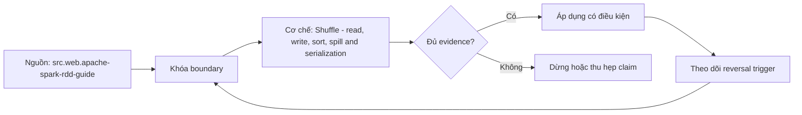

# Shuffle - read, write, sort, spill and serialization

> [!abstract] Câu hỏi trung tâm
> Một Spark shuffle tiêu tốn CPU, memory, disk và network ở các bước nào, và metric nào định vị bottleneck?

## 1. Map-side write

Records được partition, aggregate/sort tùy operator, serialize và ghi shuffle blocks/index dưới map attempt identity. Đừng bắt đầu bằng tên công cụ. Hãy bắt đầu bằng đối tượng được bảo vệ, boundary quan sát được và hậu quả nếu kết luận sai. Trong bài `Shuffle - read, write, sort, spill and serialization`, câu hỏi thực dụng là: Một Spark shuffle tiêu tốn CPU, memory, disk và network ở các bước nào, và metric nào định vị bottleneck? Ta ghi rõ grain, population, time window, owner và hành động sau failure; nếu một trường chưa biết thì đánh dấu unknown thay vì lấp bằng mặc định. Bằng chứng tối thiểu gồm fixture có version, cấu hình hoặc rule đã resolve, raw observation, expected result và limitation. Phần này là curriculum synthesis dựa trên các nguồn đã định danh, không phải lời hứa rằng mọi adapter hay deployment đều có cùng hành vi.

## 2. Spill

Execution memory thiếu làm data structures spill/merge ra disk; spill bytes và peak memory kể câu chuyện khác nhau. Điểm khó không nằm ở cú pháp mà ở identity và scope. Hai phép đo cùng tên vẫn có thể nói về hai population hoặc hai thời điểm khác nhau. Trong bài `Shuffle - read, write, sort, spill and serialization`, câu hỏi thực dụng là: Một Spark shuffle tiêu tốn CPU, memory, disk và network ở các bước nào, và metric nào định vị bottleneck? Ta ghi rõ grain, population, time window, owner và hành động sau failure; nếu một trường chưa biết thì đánh dấu unknown thay vì lấp bằng mặc định. Bằng chứng tối thiểu gồm fixture có version, cấu hình hoặc rule đã resolve, raw observation, expected result và limitation. Phần này là curriculum synthesis dựa trên các nguồn đã định danh, không phải lời hứa rằng mọi adapter hay deployment đều có cùng hành vi.

## 3. Network fetch

Reduce tasks fetch remote/local blocks; locality, concurrent requests, block size và retries ảnh hưởng latency/failure. Một dashboard xanh chỉ là tín hiệu. Muốn biến nó thành bằng chứng phải giữ input, phiên bản, rule, trạng thái trước-sau và cách tính độc lập. Trong bài `Shuffle - read, write, sort, spill and serialization`, câu hỏi thực dụng là: Một Spark shuffle tiêu tốn CPU, memory, disk và network ở các bước nào, và metric nào định vị bottleneck? Ta ghi rõ grain, population, time window, owner và hành động sau failure; nếu một trường chưa biết thì đánh dấu unknown thay vì lấp bằng mặc định. Bằng chứng tối thiểu gồm fixture có version, cấu hình hoặc rule đã resolve, raw observation, expected result và limitation. Phần này là curriculum synthesis dựa trên các nguồn đã định danh, không phải lời hứa rằng mọi adapter hay deployment đều có cùng hành vi.

## 4. Reduce-side read

Fetched blocks được deserialize, merge/sort/aggregate trước downstream operator, dùng CPU và execution memory. Thiết kế tốt phải chịu được counterexample. Hãy chủ động tạo case sát boundary, case thiếu dữ liệu và case replay thay vì chỉ chạy happy path. Trong bài `Shuffle - read, write, sort, spill and serialization`, câu hỏi thực dụng là: Một Spark shuffle tiêu tốn CPU, memory, disk và network ở các bước nào, và metric nào định vị bottleneck? Ta ghi rõ grain, population, time window, owner và hành động sau failure; nếu một trường chưa biết thì đánh dấu unknown thay vì lấp bằng mặc định. Bằng chứng tối thiểu gồm fixture có version, cấu hình hoặc rule đã resolve, raw observation, expected result và limitation. Phần này là curriculum synthesis dựa trên các nguồn đã định danh, không phải lời hứa rằng mọi adapter hay deployment đều có cùng hành vi.

## 5. Failure semantics

Lost executor/block hoặc failed fetch có thể rerun stages; speculative/retried attempts đòi metric interpretation theo attempt. Chi phí vận hành thuộc contract. Một rule đúng nhưng quá đắt, quá ồn hoặc không có owner sẽ nhanh chóng bị tắt và mất tác dụng. Trong bài `Shuffle - read, write, sort, spill and serialization`, câu hỏi thực dụng là: Một Spark shuffle tiêu tốn CPU, memory, disk và network ở các bước nào, và metric nào định vị bottleneck? Ta ghi rõ grain, population, time window, owner và hành động sau failure; nếu một trường chưa biết thì đánh dấu unknown thay vì lấp bằng mặc định. Bằng chứng tối thiểu gồm fixture có version, cấu hình hoặc rule đã resolve, raw observation, expected result và limitation. Phần này là curriculum synthesis dựa trên các nguồn đã định danh, không phải lời hứa rằng mọi adapter hay deployment đều có cùng hành vi.

## 6. Diagnosis

Nối shuffle read/write, fetch wait, records, spill, serialization CPU, disk throughput và task distribution thay vì tune một knob. Kết luận cần có điều kiện đảo chiều. Khi volume, latency, nguồn thẩm quyền hoặc topology đổi, quyết định cũ phải được xem xét lại bằng cùng một oracle. Trong bài `Shuffle - read, write, sort, spill and serialization`, câu hỏi thực dụng là: Một Spark shuffle tiêu tốn CPU, memory, disk và network ở các bước nào, và metric nào định vị bottleneck? Ta ghi rõ grain, population, time window, owner và hành động sau failure; nếu một trường chưa biết thì đánh dấu unknown thay vì lấp bằng mặc định. Bằng chứng tối thiểu gồm fixture có version, cấu hình hoặc rule đã resolve, raw observation, expected result và limitation. Phần này là curriculum synthesis dựa trên các nguồn đã định danh, không phải lời hứa rằng mọi adapter hay deployment đều có cùng hành vi.

## 7. Ma trận kiểm chứng từng mệnh đề

Với `wiki.spark.shuffle-read-write-spill`, command thành công không tự chứng minh dữ liệu đúng. Protocol riêng của bài là: Run a version-pinned Spark fixture with fixed inputs, capture explain/UI/event-log evidence, inject one changed constraint and reconcile output hashes plus operator/task metrics. Mỗi probe dưới đây phải nối input boundary với failure signal và oracle có thể phản bác kết luận.

### 7.1. Shuffle - read, write, sort, spill and serialization: kiểm `Map-side write` bằng case 1, cụ thể records được partition, aggregate/sort tùy operator, serialize và ghi shuffle blocks/index dưới map attempt identity

**Mệnh đề cần kiểm.** Shuffle - read, write, sort, spill and serialization: kiểm `Map-side write` bằng case 1, cụ thể records được partition, aggregate/sort tùy operator, serialize và ghi shuffle blocks/index dưới map attempt identity.

**Thiết kế phép thử cho `wiki.spark.shuffle-read-write-spill`.** Trong ngữ cảnh `wiki.spark.shuffle-read-write-spill`, tạo positive control và negative control chỉ khác đúng một điều kiện. Khóa input snapshot, phiên bản và owner của rule; chạy đúng population được bài `Shuffle - read, write, sort, spill and serialization` công bố.

**Bằng chứng cần giữ.** Đối với probe 1 của `Shuffle - read, write, sort, spill and serialization`, giữ fixture, raw failing rows và lệnh tái hiện. Nếu chưa chạy lab, ghi expected evidence và giữ trạng thái review; không biến protocol thành observation.

### 7.2. Shuffle - read, write, sort, spill and serialization: kiểm `Spill` bằng case 2, cụ thể execution memory thiếu làm data structures spill/merge ra disk; spill bytes và peak memory kể câu chuyện khác nhau

**Mệnh đề cần kiểm.** Shuffle - read, write, sort, spill and serialization: kiểm `Spill` bằng case 2, cụ thể execution memory thiếu làm data structures spill/merge ra disk; spill bytes và peak memory kể câu chuyện khác nhau.

**Thiết kế phép thử cho `wiki.spark.shuffle-read-write-spill`.** Trong ngữ cảnh `wiki.spark.shuffle-read-write-spill`, đổi grain nhưng giữ tổng số dòng để lộ phép đo sai cấp. Khóa input snapshot, phiên bản và owner của rule; chạy đúng population được bài `Shuffle - read, write, sort, spill and serialization` công bố.

**Bằng chứng cần giữ.** Đối với probe 2 của `Shuffle - read, write, sort, spill and serialization`, báo numerator, denominator và key set ở cả hai grain. Nếu chưa chạy lab, ghi expected evidence và giữ trạng thái review; không biến protocol thành observation.

### 7.3. Shuffle - read, write, sort, spill and serialization: kiểm `Network fetch` bằng case 3, cụ thể reduce tasks fetch remote/local blocks; locality, concurrent requests, block size và retries ảnh hưởng latency/failure

**Mệnh đề cần kiểm.** Shuffle - read, write, sort, spill and serialization: kiểm `Network fetch` bằng case 3, cụ thể reduce tasks fetch remote/local blocks; locality, concurrent requests, block size và retries ảnh hưởng latency/failure.

**Thiết kế phép thử cho `wiki.spark.shuffle-read-write-spill`.** Trong ngữ cảnh `wiki.spark.shuffle-read-write-spill`, đưa một giá trị tới đúng boundary và một giá trị vượt boundary. Khóa input snapshot, phiên bản và owner của rule; chạy đúng population được bài `Shuffle - read, write, sort, spill and serialization` công bố.

**Bằng chứng cần giữ.** Đối với probe 3 của `Shuffle - read, write, sort, spill and serialization`, lưu hai observed values cùng rule đã resolve. Nếu chưa chạy lab, ghi expected evidence và giữ trạng thái review; không biến protocol thành observation.

### 7.4. Shuffle - read, write, sort, spill and serialization: kiểm `Reduce-side read` bằng case 4, cụ thể fetched blocks được deserialize, merge/sort/aggregate trước downstream operator, dùng cpu và execution memory

**Mệnh đề cần kiểm.** Shuffle - read, write, sort, spill and serialization: kiểm `Reduce-side read` bằng case 4, cụ thể fetched blocks được deserialize, merge/sort/aggregate trước downstream operator, dùng cpu và execution memory.

**Thiết kế phép thử cho `wiki.spark.shuffle-read-write-spill`.** Trong ngữ cảnh `wiki.spark.shuffle-read-write-spill`, kill tiến trình ngay trước rồi ngay sau durable side effect. Khóa input snapshot, phiên bản và owner của rule; chạy đúng population được bài `Shuffle - read, write, sort, spill and serialization` công bố.

**Bằng chứng cần giữ.** Đối với probe 4 của `Shuffle - read, write, sort, spill and serialization`, lưu checkpoint, external ledger và trạng thái sau restart. Nếu chưa chạy lab, ghi expected evidence và giữ trạng thái review; không biến protocol thành observation.

### 7.5. Shuffle - read, write, sort, spill and serialization: kiểm `Failure semantics` bằng case 5, cụ thể lost executor/block hoặc failed fetch có thể rerun stages; speculative/retried attempts đòi metric interpretation theo attempt

**Mệnh đề cần kiểm.** Shuffle - read, write, sort, spill and serialization: kiểm `Failure semantics` bằng case 5, cụ thể lost executor/block hoặc failed fetch có thể rerun stages; speculative/retried attempts đòi metric interpretation theo attempt.

**Thiết kế phép thử cho `wiki.spark.shuffle-read-write-spill`.** Trong ngữ cảnh `wiki.spark.shuffle-read-write-spill`, đảo thứ tự input và concurrency nhưng giữ logical population. Khóa input snapshot, phiên bản và owner của rule; chạy đúng population được bài `Shuffle - read, write, sort, spill and serialization` công bố.

**Bằng chứng cần giữ.** Đối với probe 5 của `Shuffle - read, write, sort, spill and serialization`, so canonical hash và business totals giữa các thứ tự. Nếu chưa chạy lab, ghi expected evidence và giữ trạng thái review; không biến protocol thành observation.

### 7.6. Shuffle - read, write, sort, spill and serialization: kiểm `Diagnosis` bằng case 6, cụ thể nối shuffle read/write, fetch wait, records, spill, serialization cpu, disk throughput và task distribution thay vì tune một knob

**Mệnh đề cần kiểm.** Shuffle - read, write, sort, spill and serialization: kiểm `Diagnosis` bằng case 6, cụ thể nối shuffle read/write, fetch wait, records, spill, serialization cpu, disk throughput và task distribution thay vì tune một knob.

**Thiết kế phép thử cho `wiki.spark.shuffle-read-write-spill`.** Trong ngữ cảnh `wiki.spark.shuffle-read-write-spill`, replay cùng identity với payload giống rồi payload xung đột. Khóa input snapshot, phiên bản và owner của rule; chạy đúng population được bài `Shuffle - read, write, sort, spill and serialization` công bố.

**Bằng chứng cần giữ.** Đối với probe 6 của `Shuffle - read, write, sort, spill and serialization`, tách duplicate replay khỏi identity collision bằng reason code. Nếu chưa chạy lab, ghi expected evidence và giữ trạng thái review; không biến protocol thành observation.

### 7.7. Shuffle - read, write, sort, spill and serialization: kiểm `Map-side write` bằng case 7, cụ thể records được partition, aggregate/sort tùy operator, serialize và ghi shuffle blocks/index dưới map attempt identity

**Mệnh đề cần kiểm.** Shuffle - read, write, sort, spill and serialization: kiểm `Map-side write` bằng case 7, cụ thể records được partition, aggregate/sort tùy operator, serialize và ghi shuffle blocks/index dưới map attempt identity.

**Thiết kế phép thử cho `wiki.spark.shuffle-read-write-spill`.** Trong ngữ cảnh `wiki.spark.shuffle-read-write-spill`, thêm record tới trễ trong horizon và ngoài horizon. Khóa input snapshot, phiên bản và owner của rule; chạy đúng population được bài `Shuffle - read, write, sort, spill and serialization` công bố.

**Bằng chứng cần giữ.** Đối với probe 7 của `Shuffle - read, write, sort, spill and serialization`, báo accepted-late, rejected-late và oldest outstanding timestamp. Nếu chưa chạy lab, ghi expected evidence và giữ trạng thái review; không biến protocol thành observation.

### 7.8. Shuffle - read, write, sort, spill and serialization: kiểm `Spill` bằng case 8, cụ thể execution memory thiếu làm data structures spill/merge ra disk; spill bytes và peak memory kể câu chuyện khác nhau

**Mệnh đề cần kiểm.** Shuffle - read, write, sort, spill and serialization: kiểm `Spill` bằng case 8, cụ thể execution memory thiếu làm data structures spill/merge ra disk; spill bytes và peak memory kể câu chuyện khác nhau.

**Thiết kế phép thử cho `wiki.spark.shuffle-read-write-spill`.** Trong ngữ cảnh `wiki.spark.shuffle-read-write-spill`, đổi schema theo một cách tương thích rồi một cách phá vỡ semantics. Khóa input snapshot, phiên bản và owner của rule; chạy đúng population được bài `Shuffle - read, write, sort, spill and serialization` công bố.

**Bằng chứng cần giữ.** Đối với probe 8 của `Shuffle - read, write, sort, spill and serialization`, giữ schema diff, classification và consumer-visible result. Nếu chưa chạy lab, ghi expected evidence và giữ trạng thái review; không biến protocol thành observation.

### 7.9. Shuffle - read, write, sort, spill and serialization: kiểm `Network fetch` bằng case 9, cụ thể reduce tasks fetch remote/local blocks; locality, concurrent requests, block size và retries ảnh hưởng latency/failure

**Mệnh đề cần kiểm.** Shuffle - read, write, sort, spill and serialization: kiểm `Network fetch` bằng case 9, cụ thể reduce tasks fetch remote/local blocks; locality, concurrent requests, block size và retries ảnh hưởng latency/failure.

**Thiết kế phép thử cho `wiki.spark.shuffle-read-write-spill`.** Trong ngữ cảnh `wiki.spark.shuffle-read-write-spill`, tạo missing và duplicate bù nhau để count tổng không đổi. Khóa input snapshot, phiên bản và owner của rule; chạy đúng population được bài `Shuffle - read, write, sort, spill and serialization` công bố.

**Bằng chứng cần giữ.** Đối với probe 9 của `Shuffle - read, write, sort, spill and serialization`, so key multiset và typed hashes thay vì chỉ row count. Nếu chưa chạy lab, ghi expected evidence và giữ trạng thái review; không biến protocol thành observation.

### 7.10. Shuffle - read, write, sort, spill and serialization: kiểm `Reduce-side read` bằng case 10, cụ thể fetched blocks được deserialize, merge/sort/aggregate trước downstream operator, dùng cpu và execution memory

**Mệnh đề cần kiểm.** Shuffle - read, write, sort, spill and serialization: kiểm `Reduce-side read` bằng case 10, cụ thể fetched blocks được deserialize, merge/sort/aggregate trước downstream operator, dùng cpu và execution memory.

**Thiết kế phép thử cho `wiki.spark.shuffle-read-write-spill`.** Trong ngữ cảnh `wiki.spark.shuffle-read-write-spill`, cho reviewer tái hiện chỉ từ evidence package. Khóa input snapshot, phiên bản và owner của rule; chạy đúng population được bài `Shuffle - read, write, sort, spill and serialization` công bố.

**Bằng chứng cần giữ.** Đối với probe 10 của `Shuffle - read, write, sort, spill and serialization`, package phải đủ để người khác dựng lại decision và limitation. Nếu chưa chạy lab, ghi expected evidence và giữ trạng thái review; không biến protocol thành observation.

### 7.11. Shuffle - read, write, sort, spill and serialization: kiểm `Failure semantics` bằng case 11, cụ thể lost executor/block hoặc failed fetch có thể rerun stages; speculative/retried attempts đòi metric interpretation theo attempt

**Mệnh đề cần kiểm.** Shuffle - read, write, sort, spill and serialization: kiểm `Failure semantics` bằng case 11, cụ thể lost executor/block hoặc failed fetch có thể rerun stages; speculative/retried attempts đòi metric interpretation theo attempt.

**Thiết kế phép thử cho `wiki.spark.shuffle-read-write-spill`.** Trong ngữ cảnh `wiki.spark.shuffle-read-write-spill`, so với oracle độc lập không dùng chung query hoặc parser. Khóa input snapshot, phiên bản và owner của rule; chạy đúng population được bài `Shuffle - read, write, sort, spill and serialization` công bố.

**Bằng chứng cần giữ.** Đối với probe 11 của `Shuffle - read, write, sort, spill and serialization`, independent result phải khớp ở grain đã công bố. Nếu chưa chạy lab, ghi expected evidence và giữ trạng thái review; không biến protocol thành observation.

### 7.12. Shuffle - read, write, sort, spill and serialization: kiểm `Diagnosis` bằng case 12, cụ thể nối shuffle read/write, fetch wait, records, spill, serialization cpu, disk throughput và task distribution thay vì tune một knob

**Mệnh đề cần kiểm.** Shuffle - read, write, sort, spill and serialization: kiểm `Diagnosis` bằng case 12, cụ thể nối shuffle read/write, fetch wait, records, spill, serialization cpu, disk throughput và task distribution thay vì tune một knob.

**Thiết kế phép thử cho `wiki.spark.shuffle-read-write-spill`.** Trong ngữ cảnh `wiki.spark.shuffle-read-write-spill`, chạy scope hẹp và population đầy đủ rồi công bố phần bị loại. Khóa input snapshot, phiên bản và owner của rule; chạy đúng population được bài `Shuffle - read, write, sort, spill and serialization` công bố.

**Bằng chứng cần giữ.** Đối với probe 12 của `Shuffle - read, write, sort, spill and serialization`, coverage phải nêu rõ excluded nodes, partitions hoặc incidents. Nếu chưa chạy lab, ghi expected evidence và giữ trạng thái review; không biến protocol thành observation.

### 7.13. Shuffle - read, write, sort, spill and serialization: kiểm `Map-side write` bằng case 13, cụ thể records được partition, aggregate/sort tùy operator, serialize và ghi shuffle blocks/index dưới map attempt identity

**Mệnh đề cần kiểm.** Shuffle - read, write, sort, spill and serialization: kiểm `Map-side write` bằng case 13, cụ thể records được partition, aggregate/sort tùy operator, serialize và ghi shuffle blocks/index dưới map attempt identity.

**Thiết kế phép thử cho `wiki.spark.shuffle-read-write-spill`.** Trong ngữ cảnh `wiki.spark.shuffle-read-write-spill`, thử timezone, precision hoặc partition ở hai phía của ranh giới. Khóa input snapshot, phiên bản và owner của rule; chạy đúng population được bài `Shuffle - read, write, sort, spill and serialization` công bố.

**Bằng chứng cần giữ.** Đối với probe 13 của `Shuffle - read, write, sort, spill and serialization`, UTC/local interval và rounding policy phải hiện trong output. Nếu chưa chạy lab, ghi expected evidence và giữ trạng thái review; không biến protocol thành observation.

### 7.14. Shuffle - read, write, sort, spill and serialization: kiểm `Spill` bằng case 14, cụ thể execution memory thiếu làm data structures spill/merge ra disk; spill bytes và peak memory kể câu chuyện khác nhau

**Mệnh đề cần kiểm.** Shuffle - read, write, sort, spill and serialization: kiểm `Spill` bằng case 14, cụ thể execution memory thiếu làm data structures spill/merge ra disk; spill bytes và peak memory kể câu chuyện khác nhau.

**Thiết kế phép thử cho `wiki.spark.shuffle-read-write-spill`.** Trong ngữ cảnh `wiki.spark.shuffle-read-write-spill`, đổi constraint đủ lớn để quyết định phải đảo. Khóa input snapshot, phiên bản và owner của rule; chạy đúng population được bài `Shuffle - read, write, sort, spill and serialization` công bố.

**Bằng chứng cần giữ.** Đối với probe 14 của `Shuffle - read, write, sort, spill and serialization`, ADR phải lưu changed constraint và reversal threshold. Nếu chưa chạy lab, ghi expected evidence và giữ trạng thái review; không biến protocol thành observation.

### 7.15. Shuffle - read, write, sort, spill and serialization: kiểm `Network fetch` bằng case 15, cụ thể reduce tasks fetch remote/local blocks; locality, concurrent requests, block size và retries ảnh hưởng latency/failure

**Mệnh đề cần kiểm.** Shuffle - read, write, sort, spill and serialization: kiểm `Network fetch` bằng case 15, cụ thể reduce tasks fetch remote/local blocks; locality, concurrent requests, block size và retries ảnh hưởng latency/failure.

**Thiết kế phép thử cho `wiki.spark.shuffle-read-write-spill`.** Trong ngữ cảnh `wiki.spark.shuffle-read-write-spill`, chạy lại từ môi trường sạch với versions và seed đã khóa. Khóa input snapshot, phiên bản và owner của rule; chạy đúng population được bài `Shuffle - read, write, sort, spill and serialization` công bố.

**Bằng chứng cần giữ.** Đối với probe 15 của `Shuffle - read, write, sort, spill and serialization`, canonical result phải ổn định hoặc mọi nondeterminism phải được giải thích. Nếu chưa chạy lab, ghi expected evidence và giữ trạng thái review; không biến protocol thành observation.

## 8. Quy trình phản biện

1. Viết consumer-visible invariant cho `Shuffle - read, write, sort, spill and serialization` trước khi chọn query hoặc tool.
2. Khóa grain, identity, population, time window và authoritative source.
3. Phân biệt declared configuration, executed state và published state.
4. Chạy negative control, replay hoặc changed-assumption case phù hợp.
5. Đối soát bằng oracle độc lập; công bố coverage và phần không quan sát được.
6. Gắn owner, hành động, reversal trigger và hạn review cho kết luận.

## 9. Câu hỏi tự kiểm tra

1. `Shuffle - read, write, sort, spill and serialization: kiểm `Map-side write` bằng case 1, cụ thể records được partition, aggregate/sort tùy operator, serialize và ghi shuffle blocks/index dưới map attempt identity` thất bại đầu tiên ở boundary nào?
2. Artifact nào mạnh nhất để trả lời `Shuffle - read, write, sort, spill and serialization: kiểm `Network fetch` bằng case 3, cụ thể reduce tasks fetch remote/local blocks; locality, concurrent requests, block size và retries ảnh hưởng latency/failure`?
3. Counterexample nhỏ nhất cho `Shuffle - read, write, sort, spill and serialization: kiểm `Diagnosis` bằng case 6, cụ thể nối shuffle read/write, fetch wait, records, spill, serialization cpu, disk throughput và task distribution thay vì tune một knob` gồm những state nào?
4. `Shuffle - read, write, sort, spill and serialization: kiểm `Network fetch` bằng case 9, cụ thể reduce tasks fetch remote/local blocks; locality, concurrent requests, block size và retries ảnh hưởng latency/failure` có thể xanh giả ra sao?
5. Constraint nào khiến quyết định ở `Shuffle - read, write, sort, spill and serialization: kiểm `Spill` bằng case 14, cụ thể execution memory thiếu làm data structures spill/merge ra disk; spill bytes và peak memory kể câu chuyện khác nhau` phải đảo?
6. Phần nào của `Shuffle - read, write, sort, spill and serialization: kiểm `Network fetch` bằng case 15, cụ thể reduce tasks fetch remote/local blocks; locality, concurrent requests, block size và retries ảnh hưởng latency/failure` mới là protocol, chưa phải observation?

## 10. Giới hạn và điều chưa cho phép kết luận

- Lab của `Shuffle - read, write, sort, spill and serialization` chưa chạy trên hệ thống production; nội dung là giáo trình và expected evidence.
- Hành vi phụ thuộc phiên bản, connector, scheduler, warehouse và catalog configuration phải được kiểm lại.
- Các ma trận, ladder và threshold do giáo trình tổng hợp không được gán nguyên văn cho vendor.
- Note giữ trạng thái `review` cho tới khi owner duyệt semantics và learner artifact.

## Reference
1. [[SRC-APACHE-SPARK-RDD-GUIDE]]
2. [[SRC-APACHE-SPARK-TUNING]]

## Source coverage

| Source slice | Nội dung sử dụng | Trạng thái |
|---|---|---|
| [[SRC-APACHE-SPARK-RDD-GUIDE]] | Contract hoặc cơ chế liên quan trực tiếp tới `Shuffle - read, write, sort, spill and serialization` | Đã đọc locator; cần pin version khi chạy lab |
| [[SRC-APACHE-SPARK-TUNING]] | Contract hoặc cơ chế liên quan trực tiếp tới `Shuffle - read, write, sort, spill and serialization` | Đã đọc locator; cần pin version khi chạy lab |

## Key takeaways
- Shuffle diagnosis must connect write, spill, fetch, read and attempt-level evidence.
- Với `wiki.spark.shuffle-read-write-spill`, quality của kết luận phụ thuộc identity, coverage và oracle chứ không phụ thuộc màu dashboard.
- Câu hỏi `Một Spark shuffle tiêu tốn CPU, memory, disk và network ở các bước nào, và metric nào định vị bottleneck?` chỉ được trả lời trong scope và version đã ghi.
- Các source IDs `src.web.apache-spark-rdd-guide, src.web.apache-spark-tuning` đặt ranh giới cho source fact; phần còn lại là synthesis có nhãn.
- Trước khi lab chạy, đây là note đã kiểm cấu trúc và provenance, chưa phải chứng nhận production.

<!-- ATOMIC-EXECUTION-CAPSULE:START -->

## Execution capsule: kiểm chứng `wiki.spark.shuffle-read-write-spill`

> [!important] Phân loại mệnh đề
> Với `wiki.spark.shuffle-read-write-spill`, sơ đồ, ví dụ và artifact về **Shuffle - read, write, sort, spill and serialization** là **synthesis để kiểm chứng**; chúng không phải trích dẫn hay case nguyên văn của nguồn.

### Sơ đồ cơ chế và điểm kiểm soát



Đọc sơ đồ `wiki.spark.shuffle-read-write-spill` từ trái sang phải: source chỉ cung cấp claim ban đầu cho **Shuffle - read, write, sort, spill and serialization**; quyết định chỉ được đi tiếp sau khi boundary, evidence và điều kiện đảo quyết định đã hiện hữu.

### Artifact thực thi tối thiểu

```sql
-- Verification harness for: Shuffle - read, write, sort, spill and serialization
WITH evidence AS (
    SELECT 'wiki.spark.shuffle-read-write-spill' AS concept_id,
           'boundary_declared' AS check_name, 1 AS passed
    UNION ALL
    SELECT 'wiki.spark.shuffle-read-write-spill', 'independent_oracle', 1
    UNION ALL
    SELECT 'wiki.spark.shuffle-read-write-spill', 'reversal_trigger_recorded', 1
)
SELECT concept_id,
       MIN(passed) AS all_hard_checks_pass,
       COUNT(*) AS evidence_items
FROM evidence
GROUP BY concept_id
HAVING MIN(passed) = 1;
```

Artifact của `wiki.spark.shuffle-read-write-spill` buộc người dùng ghi boundary, oracle và reversal trigger cho **Shuffle - read, write, sort, spill and serialization**. Các giá trị minh họa phải được thay bằng evidence thật trước khi dùng cho quyết định.

### Tự kiểm tra trước khi tái sử dụng

1. Bạn có thể trả lời `Một Spark shuffle tiêu tốn CPU, memory, disk và network ở các bước nào, và metric nào định vị bottleneck?` bằng một câu mà không kéo thêm concept thứ hai không?
2. Source locator nào đỡ cho claim, và phần nào chỉ là synthesis trong note?
3. Observation nào khiến bạn dừng, thu hẹp hoặc đảo quyết định?
4. Artifact nào cho phép một reviewer độc lập tái hiện kết quả?

<!-- ATOMIC-EXECUTION-CAPSULE:END -->
